---
tags:
  - aviation-domain
  - exchange-models
  - aixm
  - e-learning
  - eurocontrol
aliases:
  - IM-AIXM-1
  - AIXM 5 Information Modelling and Data Coding Basics
course: EUROCONTROL IM-AIXM-1
created: 2026-09-14
status: complete
---

# AIXM 5 — Information Modelling & Data Coding Basics `[IM-AIXM-1]`

> [!abstract] The 30-second version
> Before AIXM can be used, you need to understand **why aeronautical data is modelled at all**, **how that model is drawn** (UML class diagrams), **how it is coded** for exchange (XML), and **how its geographical geometry is coded** (GML). This note walks through all four layers, bottom-up:
> **Data Modelling → UML Class Diagrams → XML → GML**.

## Course map

| # | Module | Core question it answers |
|---|---|---|
| 1 | [[#Module 1 — Data Modelling for Aeronautical Data\|Data modelling for aeronautical data]] | Why must aeronautical data be *modelled* before it's exchanged? |
| 2 | [[#Module 2 — UML Class Diagrams\|Introduction to the UML class diagram]] | How is that model actually drawn? |
| 3 | [[#Module 3 — Introduction to XML\|Introduction to XML]] | How is the model turned into a file computers can exchange? |
| 4 | [[#Module 4 — Introduction to GML\|Introduction to GML]] | How is the *geographical geometry* inside that file coded? |

---

## Module 1 — Data Modelling for Aeronautical Data

### What is data modelling?

> [!abstract] Definition
> **Data modelling** defines and analyses the data requirements needed to support the business processes within a domain (e.g. aeronautical information).

A data model is not reality — it is a **simplification** of reality, keeping only the data elements relevant to the business process at hand.

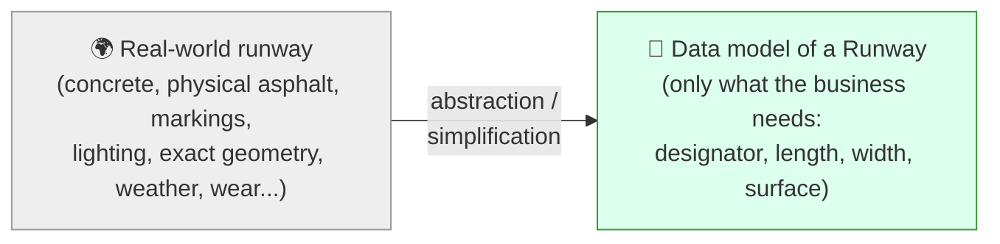

> [!tip] Key idea
> A data model is always an **abstraction** — it deliberately throws away detail that doesn't matter for the use case, and keeps only what does.

### Interoperability

> [!abstract] Definition
> **Interoperability** is the ability of computer systems or software to exchange and use information without restrictions — which requires clear, *shared* expectations about the content, context and meaning of that data.

A **common data model**, used consistently across a domain, is a key enabler of interoperability: it guarantees the data means the same thing to every system that touches it. But a shared model alone isn't enough — you also need:

- common **interfaces**
- common **data coding formats**
- common **rules**

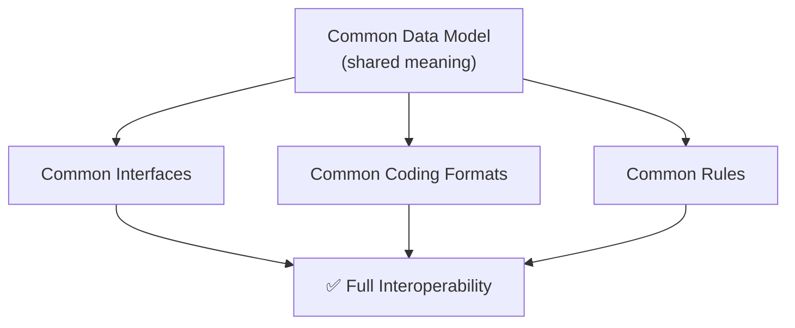

### From AIS to AIM

The aeronautical information domain is shifting from a paper-based **Aeronautical Information Service (AIS)** to a digital, data-centric **Aeronautical Information Management (AIM)**.

> [!quote] ICAO Annex 15 — definition of AIM
> The dynamic, integrated management of aeronautical information through the provision and exchange of quality-assured digital aeronautical data in collaboration with all parties.

According to ICAO, this transition rests on establishing:
1. a **common conceptual data model** for the aeronautical domain, and
2. a corresponding **data exchange format**.

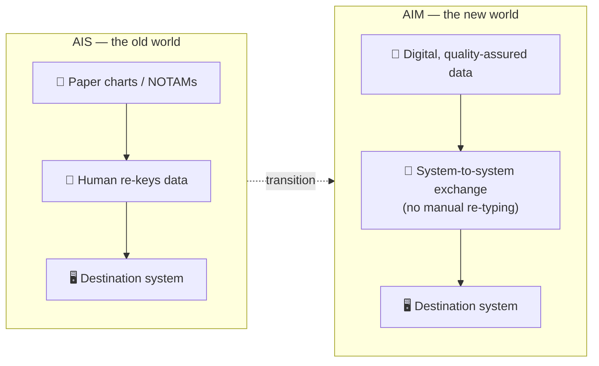

### Digital data exchange — benefits

In a fully digital environment, aeronautical data flows between computer systems with **no manual interaction**. This requires standardised, globally interoperable, machine-readable exchange models so every actor references the same data in the same format — in short: *"speak the same language."*

| Benefit | Why it matters |
|---|---|
| **Timeliness** | Faster access to up-to-date information |
| **New applications** | Standardised data enables new tools/services to be built on top of it |
| **Harmonisation** | Global interoperability between States and vendors |
| **Data quality** | Fewer data errors than manual re-keying |
| **Efficiency** | No re-typing — critical as data volumes grow (NOTAMs, flight restrictions, terminal waypoints, etc.) |

### Data models and data coding

A data model is the **blueprint**; a data coding format (XML, JSON…) is the **concrete file** built from that blueprint. The same underlying model can be coded in more than one format.

**Example — a Runway feature, coded two ways from the same AIXM model:**

**Coded in XML:**

```xml
<?xml version="1.0" encoding="UTF-8"?>
<aixm:Runway gml:id="urn.uuid.dd062d88-3e64-4a5d-bebd-89476db9ebea"
  xmlns:xlink="http://www.w3.org/1999/xlink"
  xmlns:aixm="http://www.aixm.aero/schema/5.1"
  xmlns:gml="http://www.opengis.net/gml/3.2"
  xmlns:xsi="http://www.w3.org/2001/XMLSchema-instance"
  xsi:schemaLocation="http://www.aixm.aero/schema/5.1
    http://www.aixm.aero/schema/5.1/AIXM_Features.xsd">
  <gml:identifier codeSpace="urn:uuid:">
    dd062d88-3e64-4a5d-bebd-89476db9ebea
  </gml:identifier>
  <aixm:timeSlice>
    <aixm:RunwayTimeSlice gml:id="ahts1EADH">
      <gml:validTime>
        <gml:TimePeriod gml:id="vtnull0">
          <gml:beginPosition>2009-01-01T00:00:00.000</gml:beginPosition>
          <gml:endPosition indeterminatePosition="unknown"/>
        </gml:TimePeriod>
      </gml:validTime>
      <aixm:interpretation>BASELINE</aixm:interpretation>
      <aixm:sequenceNumber>1</aixm:sequenceNumber>
      <aixm:correctionNumber>0</aixm:correctionNumber>
      <aixm:designator>RWY-02L/20R</aixm:designator>
      <aixm:nominalLength uom="M">3600</aixm:nominalLength>
      <aixm:nominalWidth uom="M">45</aixm:nominalWidth>
      <aixm:associatedAirportHeliport
        xlink:href="Donlon International Airport EADD" />
    </aixm:RunwayTimeSlice>
  </aixm:timeSlice>
</aixm:Runway>
```

**The same feature coded in JSON:**

```json
{
  "@id": "urn.uuid.dd062d88-3e64-4a5d-bebd-89476db9ebea",
  "@schemaLocation": "http://www.aixm.aero/schema/5.1 ...",
  "identifier": {
    "@codeSpace": "urn:uuid:",
    "#text": "dd062d88-3e64-4a5d-bebd-89476db9ebea"
  },
  "timeSlice": {
    "RunwayTimeSlice": {
      "@id": "ahts1EADH",
      "validTime": {
        "TimePeriod": {
          "@id": "vtnull0",
          "beginPosition": "2009-01-01T00:00:00.000",
          "endPosition": { "@indeterminatePosition": "unknown" }
        }
      },
      "interpretation": "BASELINE",
      "sequenceNumber": "1",
      "correctionNumber": "0",
      "designator": "RWY-02L/20R",
      "nominalLength": { "@uom": "M", "#text": "3600" },
      "nominalWidth": { "@uom": "M", "#text": "45" },
      "associatedAirportHeliport": {
        "@href": "Donlon International Airport EADD"
      }
    }
  }
}
```

> [!note] Same model, two skins
> Both blocks encode **the exact same Runway feature** from the same AIXM conceptual model — only the syntax differs. This is the payoff of modelling first: the coding format becomes a mechanical translation, not a design decision.

### Data models and data services

A **data service** exchanges data sets between systems over defined internet standards, without human intervention (e.g. an AIS providing AIP or Obstacle data sets). What a consumer can expect from that service — which subjects, which properties — is defined by the underlying **data model**.

### SWIM context

**System Wide Information Management (SWIM)** defines how ATM information is exchanged in a digital environment. It requires:

- a standardised **technical infrastructure**
- common **service interfaces**
- common **information exchange models**

Each ATM domain has its own specific exchange model, but all of them must stay compliant with one shared reference model.

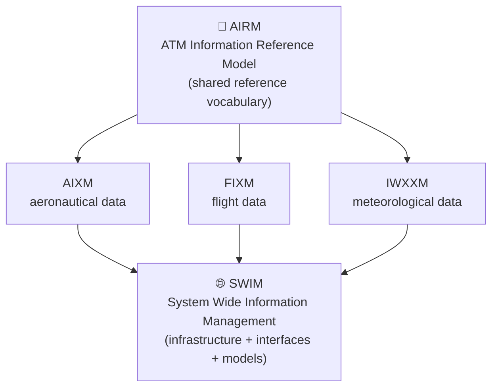

### ATM Information Reference Model (AIRM)

The **AIRM** is the ATM system-wide reference vocabulary — a conceptual model that every domain-specific model (AIXM, FIXM, IWXXM) must align with.

> [!example] Worked example
> The AIRM defines a data element called **`AirportHeliport`**, together with all of its properties. AIXM must use this element exactly as the AIRM defines it — not invent its own competing definition.

Using the AIRM promotes **semantic interoperability** — ensuring the *precise meaning* of exchanged information is preserved end-to-end, from the point of origin to the point of destination, not just the raw bytes.

---

## Module 2 — UML Class Diagrams

### What is UML?

**UML (Unified Modelling Language)** is a modelling language from software engineering, used to visualise the design of a system. It is an **ISO standard**, maintained by the **Object Management Group (OMG)**.

UML defines several diagram types for different purposes — but **AIXM (and also IWXXM, FIXM) uses only one of them: the class diagram.**

> [!abstract] Purpose of a UML class diagram
> A class diagram describes the structure of data by organising it into **classes**, **attributes**, and the **relationships** between classes.

### Classes and attributes

> [!abstract] Definition — Class
> A collection of objects with common structure, common behaviour, common relationships and common semantics. Drawn as a simple rectangle.

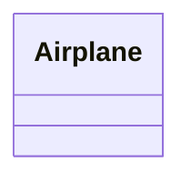

**Naming convention:** class names use **UpperCamelCase** and come from the vocabulary of the domain — words concatenated with no spaces, each word capitalised.

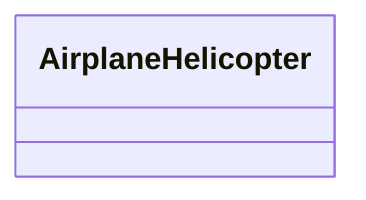

> [!warning] Why definitions matter
> Every class needs an explicit **definition** beyond its name. "Airplane" feels obvious — but "Navaid", "Obstacle" or "Terminal Arrival Area" are not, and near-synonyms can quietly diverge between sources:
>
> - **ICAO** — *Aeroplane*: "A power-driven heavier-than-air aircraft, deriving its lift in flight chiefly from aerodynamic reactions on surfaces which remain fixed under given conditions of flight."
> - **FAA** — *Airplane*: "An engine-driven fixed-wing aircraft heavier than air that is supported in flight by the dynamic reaction of the air against its wings."
>
> For international aviation, **ICAO definitions take first priority** wherever possible. For the ATM community specifically, the **AIRM** supplies a common vocabulary — mostly sourced from the ICAO Annexes.

**Attributes** describe simple properties of a class, written in **lowerCamelCase** (first letter lowercase, subsequent words capitalised, no spaces):

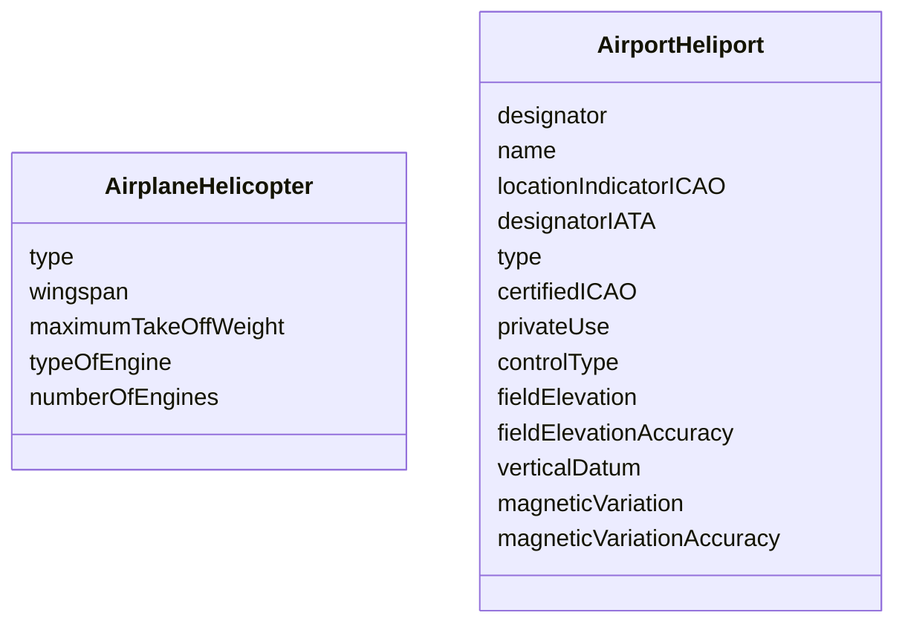

> [!tip] Watch for name collisions
> Two classes can each have an attribute called `type` — `AirplaneHelicopter.type` and `AirportHeliport.type` are **different attributes with different definitions** that just happen to share a name.

**Class instance:** an instance is one concrete occurrence of a class — e.g. a specific Airbus A320 registered as `9H-ABC` is *one instance* of the `AirplaneHelicopter` class.

### Allowable values (data types)

In a class diagram, an attribute's **data type** is written after a colon:

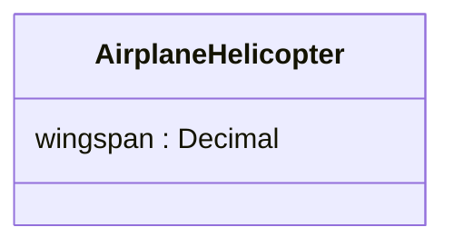

Data types can be generic (text, number, date) or **custom-built** to add constraints:

| Attribute | Naive type | Problem | Better custom type |
|---|---|---|---|
| `wingspan` | `Decimal` | fine as-is — allows `11` or `38.5`, rejects `"eleven"` | — |
| `engineNumber` | `String` | free text allows nonsense | `ValEngineNumberType` — integer, range 1–8 |
| `type` (aircraft) | `String` | allows any gibberish, e.g. "A3x20zz" | `CodeAircraftType` — a **code list** |

> [!abstract] Code list
> A **code list** is a predefined list of allowable values (e.g. ICAO's existing aircraft type designators). Restricting an attribute to a code list prevents free-text inconsistency at the source — this is a data-quality control baked directly into the model.

**Enhancing a data type — units of measurement.** A bare number like `38.5` is meaningless without a unit. Rather than bolting on a separate `wingspanUom` attribute, the cleaner approach is to build the **unit into the data type itself**:

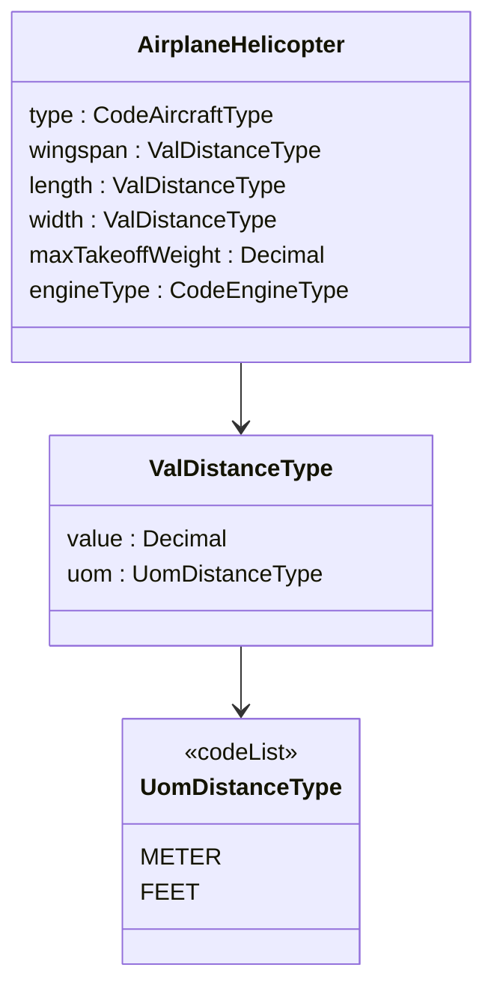

This lets `ValDistanceType` be **reused** across `wingspan`, `length` and `width` — and across other classes entirely. With it, `38.5 meter` and `38.5 feet` are valid; `38.5 km`, `38.5 inches`, or the abbreviation `"m"` are **not**, because they weren't declared in `UomDistanceType`.

> [!tip] Data types = built-in data quality
> Once every attribute has a properly constrained data type, an encoded XML/JSON instance of the model can be **automatically validated** against exactly these rules.

### Relationships

> [!abstract] Definition — Association
> A relationship between two classes with properties (name, cardinality/multiplicity, role names) describing how instances of one class relate to instances of another, and the rules that govern that relationship.

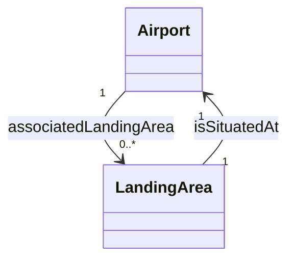

- An **Airport** may have **zero or many** `associatedLandingArea`.
- A **LandingArea** `isSituatedAt` **exactly one** `associatedAirport`.

**Composition** is a stronger relationship type: the part cannot exist independently of the whole (e.g. a `Runway` cannot exist without its `Airport`) — drawn with a filled diamond at the "whole" end.

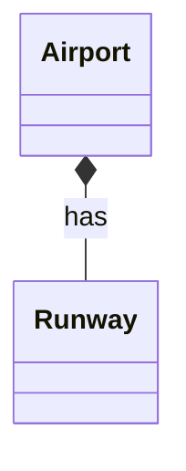

**Self-association:** a relationship where the same class is both source and target.

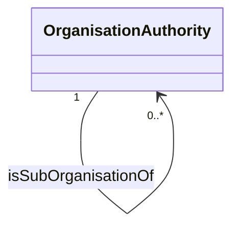

> [!example] Worked example
> A **Civil Aviation Authority (CAA)** may be a sub-organisation of a **State Ministry of Transport**. Both are instances of the *same* class `OrganisationAuthority`, so relating them requires a self-association, complete with its own name, role names and multiplicity.

### Advanced UML concepts

**Inheritance / generalisation:** a specialised class inherits all properties of a more general class, removing redundancy and presenting classes in a human-friendlier hierarchy rather than a flat network.

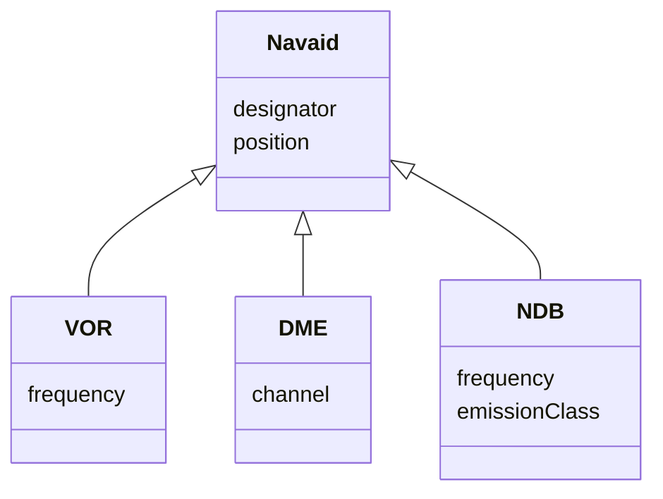

**Association class:** a class attached to an association to carry extra information *about the relationship itself* — it behaves like any other class (can hold attributes, participate in further associations) but is drawn linked to its association by a dotted line.

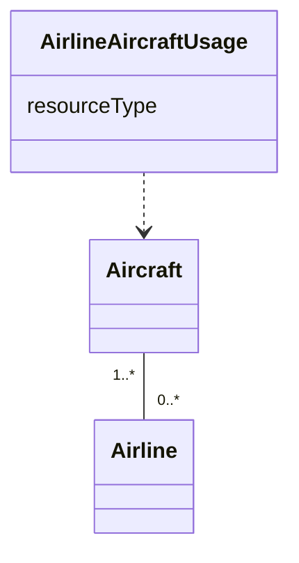

> [!example] Worked example
> `Aircraft` associates with `Airline`. The association class `AirlineAircraftUsage` adds the missing nuance — `resourceType` — capturing whether the airline **owns** the aircraft outright or merely **operates** it under a lease.

**Stereotypes** are a higher-level category a class belongs to, written in **«guillemets»** above the class name — used to group classes by purpose and add domain-specific vocabulary to the model.

| Stereotype | Used for |
|---|---|
| `«DataType»` | a custom, constrained data type (e.g. `ValDistanceType`) |
| `«CodeList»` | a predefined list of allowable coded values |
| `«Feature»` / `«Object»` | AIXM-specific: real-world things vs. supporting object classes |
| `«Choice»` | an exclusive (XOR) selection between classes |

> [!example] Worked example — Choice
> A **Minimum Sector Altitude (MSA)** has a centre point that is *either* a Navaid, *or* a Designated Point, *or* an Airport Reference Point — never more than one. AIXM models this with a choice class named `SignificantPoint`.

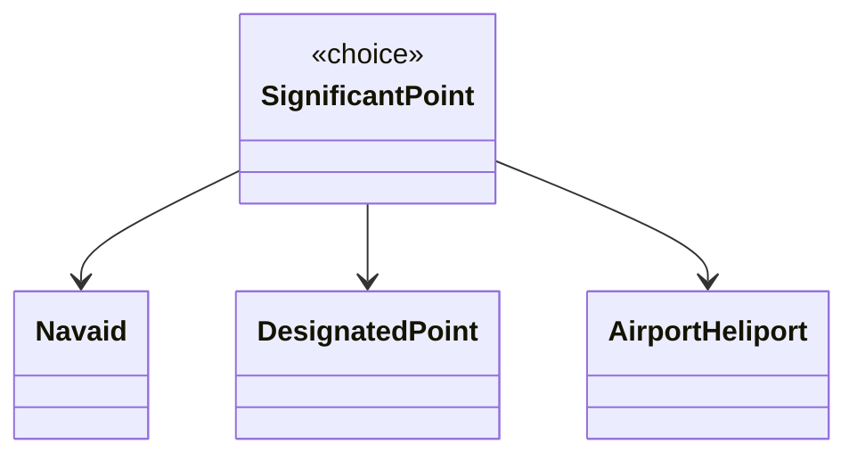

---

## Module 3 — Introduction to XML

### Objectives

- List examples of data coding formats used for aviation data exchange
- Describe the structure of an XML file
- Validate an XML file using an XML editor
- Explain how XML codes the data corresponding to a UML class diagram model

### Data encoding formats for aeronautical data

Several formats have evolved for exchanging aeronautical data digitally, each serving a different purpose:

| Format | Purpose | Style |
|---|---|---|
| **ARINC 424** | Aircraft navigation database standard (maintained by SAE International). Feeds ground systems that prepare data for onboard Flight Management Systems (FMS), flight planning systems and simulators. Amended repeatedly since 1975. | Fixed-field, not intended for human reading |
| **ADEXP** (EUROCONTROL "ATS Data Exchange Presentation") | Exchanges flight-plan and airspace-availability messages over AFTN/AMHS between IFPS, ATS units, Aircraft Operators and the Network Manager | Textual, keyword-based; fields start with a hyphen (`-`); deliberately kept human-readable for troubleshooting |
| **AIXM / IWXXM / FIXM** | Aeronautical data / meteorological data / flight data, respectively | **XML-based** |

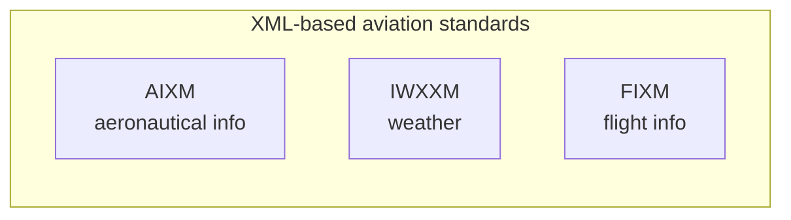

> [!note] Also in the works
> An **XML version of ARINC 424** is currently in development, alongside the established formats above.

### What is XML?

> [!abstract] Definition
> **XML (Extensible Markup Language)** defines rules for encoding documents in a format that is both **human-readable and machine-readable**, using tags (a *markup language*).

**XML vs HTML — same-looking syntax, opposite purpose:**

| | HTML | XML |
|---|---|---|
| Focus | **How** data is *presented* (for a browser) | **What** the data *is* |
| Tags | Fixed, predefined (`<p>`, `<h1>`…) | User-defined — you invent your own tag vocabulary |
| Typical use | Websites | Transporting and storing data |

```xml
<!-- HTML: focuses on presentation -->
<!DOCTYPE html>
<html>
  <body>
    <h1>Aircraft Catalogue</h1>
    <h2>AIRBUS A320</h2>
    <p>Wingspan: 38.5 meters</p>
  </body>
</html>
```

```xml
<!-- XML: focuses on the data itself, no presentation info at all -->
<?xml version="1.0" encoding="UTF-8"?>
<AircraftCatalogue>
  <Airplane>
    <type>A320</type>
    <wingspan uom="m">38.5</wingspan>
    <maxTakeOffWeight uom="kg">65000</maxTakeOffWeight>
  </Airplane>
</AircraftCatalogue>
```

Because XML carries **no display instructions**, the same data can be reused across many presentations — a spreadsheet table, a Word document, a web page, a chart — with total separation between **data** and **presentation**.

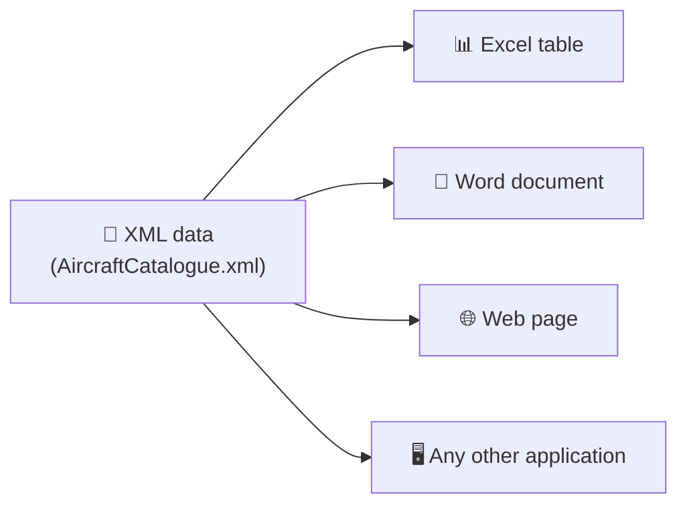

XML is an **open standard** maintained by the **W3C**, and is also a **meta-language** — a language for defining other languages. Examples: **MathML** (mathematics), **GML** (Geography Markup Language — the geometry standard AIXM itself is built on).

**XML vs JSON:** JSON (JavaScript Object Notation) is a more compact alternative that has emerged more recently.

```json
[
  {
    "type": "A320",
    "wingspan": { "@uom": "m", "#text": "38.5" },
    "maxTakeOffWeight": { "@uom": "kg", "#text": "65000" }
  }
]
```

| | XML | JSON |
|---|---|---|
| Verbosity | More verbose | More compact |
| Schema/validation support | Strong (XSD) | Weaker, historically |
| Current use in aviation | **XML is the incumbent** — the effort of migrating doesn't yet justify the benefit | Emerging elsewhere |

### Structure of an XML file

An XML document is made of:

- **Element content** — the markup itself, i.e. the tags
- **Text content** — the values held inside the tags

XML is **self-describing**: the structure (syntax) and the meaning (semantics) of the data travel together in the same file.

```xml
<?xml version="1.0" encoding="UTF-8"?>
<AircraftCatalogue>
  <Airplane>
    <type>A320</type>
    <wingspan uom="m">38.5</wingspan>
    <maxTakeOffWeight uom="kg">65000</maxTakeOffWeight>
    <engineType>Jet</engineType>
    <engineNumber>2</engineNumber>
    <manufacturer>Airbus</manufacturer>
  </Airplane>
</AircraftCatalogue>
```

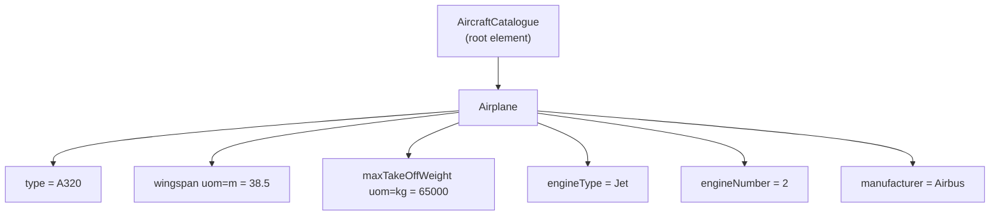

None of `<Airplane>`, `<type>`, `<wingspan>`… are defined by the XML standard itself — they're defined by the community exchanging airplane data. XML only specifies **how** to define your own tags correctly.

**Recommended editors:** any text editor works, but dedicated XML editors add tag completion and validation. The course uses **Notepad++** (Windows; install the *XML Tools* plugin for syntax checks/validation) — cross-platform alternatives include **Visual Studio Code**.

**Elements vs. attributes** — no hard rule, but a useful guideline: use **attributes only for metadata** (e.g. a unit of measurement), and **elements** for the actual data.

| | Attributes | Elements |
|---|---|---|
| Multiple values | ❌ cannot hold multiple values | ✅ can |
| Tree structures | ❌ cannot nest further | ✅ can |
| Future-proofing | ❌ not easily expandable | ✅ easier to extend |

> [!important] XML "well-formed" syntax rules
> An XML document is **well-formed** when it satisfies all of the following:
> 1. It must have **a single root element**.
> 2. Every element must have a **closing tag**.
> 3. Tags are **case-sensitive**.
> 4. Elements must be **properly nested**.
> 5. Attribute values must be **quoted**.

### Validation of an XML file

> [!abstract] Application schema
> A **conceptual schema for data** required by one or more applications. It lets external data received by one system be mapped into that system's own internal structure. Both sender and receiver must share access to the **same** application schema so each side can map its own internal data structure to the common exchange structure.

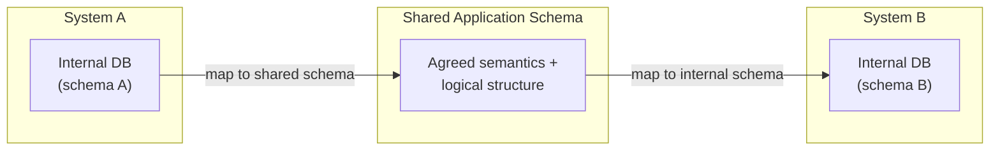

**XML Schema Definition (XSD)** is one schema language used to express constraints on XML documents — it defines the elements, attributes and data types an XML document is allowed to use, and is itself written in XML.

> [!warning] "Well-formed" ≠ "correct"
> A document can satisfy every XML syntax rule and still contain **wrong content**:
> ```xml
> <Airplane>
>   <type>A320</type>
>   <wingspan uom="m">38.5</wingspan>
>   <maxTakeOffWeight uom="kg">65000</maxTakeOffWeight>
>   <engineType>Jet</engineType>
>   <engineNumber>tow</engineNumber>  <!-- should be numeric, has a typo -->
>   <manufacturer>Airbus</manufacturer>
>   <colour>Red</colour>              <!-- never foreseen for this catalogue -->
> </Airplane>
> ```
> This is *well-formed* XML — but `engineNumber` holds text instead of a number, and `colour` is an element nobody defined. **XSD validation catches both.**

A (simplified) XSD for the `AircraftCatalogue`:

```xml
<?xml version="1.0" encoding="utf-8"?>
<xs:schema xmlns:xs="http://www.w3.org/2001/XMLSchema">
  <xs:element name="AircraftCatalogue">
    <xs:complexType>
      <xs:sequence>
        <xs:element name="Airplane" maxOccurs="unbounded" type="AirplaneType"/>
      </xs:sequence>
    </xs:complexType>
  </xs:element>
  <xs:complexType name="AirplaneType">
    <xs:sequence>
      <xs:element name="type"/>
      <xs:element name="wingspan"/>
      <xs:element name="maxTakeOffWeight"/>
      <xs:element name="engineType"/>
      <xs:element name="engineNumber" type="xs:integer"/>
      <xs:element name="manufacturer"/>
    </xs:sequence>
  </xs:complexType>
</xs:schema>
```

Reading the schema line by line:

1. `<xs:schema>` is the **root element** of every XSD file, and may carry additional information.
2. The `xmlns` declaration points at `http://www.w3.org/2001/XMLSchema` and tells the parser that every element/data type coming from that schema language must be prefixed `xs:`.
3. The XSD then **defines every element** that may appear in a conforming XML document. The first one defined is `AircraftCatalogue` itself — the root element of the *XML instance* document.
4. The definition says that inside `AircraftCatalogue` you may find another element, `Airplane`.
5. The `maxOccurs="unbounded"` attribute means there is **no limit** on how many `Airplane` elements may appear.
6. `Airplane` is declared with type `AirplaneType`.
7. The complex type `AirplaneType` defines exactly how an `Airplane` instance may be coded.
8. In this case it lists every property an `Airplane` may carry: `type`, `wingspan`, `maxTakeOffWeight`, `engineType`, `engineNumber` and `manufacturer`.
9. `engineNumber` is additionally given `type="xs:integer"` — so only whole-number values are allowed for it.
10. The `<xs:sequence>` indicator means the child elements **must appear in the exact order** they were declared in the schema.

> [!note] There's more
> A complete XSD has many more concepts than this simplified example shows. This is enough to understand *why* schemas exist and *how* they constrain a document — see Further Reading for the full XSD specification.


### From UML to XML

A data model (UML) is necessary to define what data matters — but it is **not by itself a coding format**. A concrete coding format, with its own application schema, is needed to actually transfer the data between sender and receiver.

For the AIS domain specifically:

| Layer | What's used |
|---|---|
| **Data model** | UML (class diagrams) |
| **Data coding format** | XML |
| **Application schema** | XML Schema (XSD) |

Together, these three layers make up a **data exchange specification** — AIXM is exactly that specification for the AIS domain.

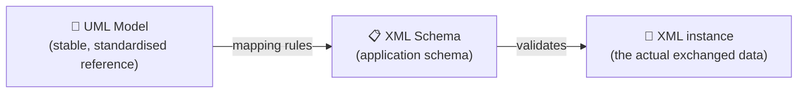

> [!important] The UML model is the anchor
> The **UML model is the most important, and most stable, component** of a data exchange specification — it represents the actual information concepts agreed by the community. The **coding format can change** (today XML, potentially JSON tomorrow, or something not yet invented) but a consistent, 1:1 mapping must always be maintained between the UML model and whichever XML Schema (or other application schema) implements it. Dedicated **mapping rules** define exactly how each UML element (class, attribute, relationship) converts into its XSD counterpart.

### Coding of associations in XML

UML **relationships** need special handling once they're coded in XML — a reference from one feature instance to another must be **unique** in context. AIXM solves this with two mechanisms:

- **UUID** (Universally Unique Identifier) — a unique code generated for each feature instance.
- **xlink** — a standard XML referencing schema; its `href` attribute points at another feature's UUID to encode the relationship.

```xml
<aixm:Runway gml:id="uuid.9e51668f-bf8a-4f5b-ba6e-27087972b9b8">
  <aixm:designator>09L/27R</aixm:designator>
  <aixm:type>RWY</aixm:type>
  <aixm:nominalLength uom="M">2800.0</aixm:nominalLength>
  <aixm:nominalWidth uom="M">45.0</aixm:nominalWidth>
  <aixm:associatedAirportHeliport
    xlink:href="urn:uuid:1b54b2d6-a5ff-4e57-94c2-f4047a381c64"
    xlink:title="AHP_EADD"/>
</aixm:Runway>
```

```mermaid
classDiagram
    class Runway {
        designator
        nominalLength
        nominalWidth
    }
    class AirportHeliport {
        uuid
    }
    Runway "1" --> "1" AirportHeliport : associatedAirportHeliport (xlink href)
```

> [!tip] Reading the example
> `Runway 09L/27R` doesn't embed the whole `AirportHeliport` feature inline — it just **references** it, via `xlink:href`, by the target's UUID. `xlink:title` is a human-readable hint (here `AHP_EADD`) but the UUID is what a machine actually resolves.


---

## Module 4 — Introduction to GML

### Objectives

- Discuss the importance of using geographical data standards in the aeronautical information domain
- Describe the scope, purpose and ownership of GML
- Explain the concept of a geodetic reference system
- Explain how point, curve and surface can be coded in GML
- Describe the purpose and content of the Aviation GML Profile
- Visualise a GML file containing AIXM/GML data

### Geographical aspects of aeronautical data

Under ICAO rules, States publish aeronautical information via AIPs, charts, manuals — and increasingly, digital data sets. Many of these products are inherently **geographical**: they describe *where* things are, not just *what* they are. ICAO Annex 15 and PANS-AIM both set explicit requirements for how this geographical/geometrical information must be provided.

### What is GML?

> [!abstract] Definition
> **GML (Geography Markup Language)** is an **XML schema for expressing geographical information** — points, lines (curves), polygons (surfaces) and other geometry types.

Like most XML-based grammars, GML has two parts:

| Part | Role |
|---|---|
| **The schema** | describes what a GML document may contain |
| **The instance document** | contains the actual geographic data |

```mermaid
flowchart TB
    ISO19107["ISO 19107<br/>Spatial Schema<br/>(the data MODEL — geometries, operations)"]
    ISO19136["ISO 19136 = GML<br/>(the ENCODING FORMAT — XML implementation)"]
    ISO19107 -- "encoded by" --> ISO19136
```

- GML implements the **ISO 19107** spatial schema (a data model of geometries — point, curve, surface — and their relationships).
- GML has itself been published as **ISO 19136**.
- **AIXM uses GML 3.2.1** — even though newer GML versions exist, migrating wasn't judged worth the cost versus the new capabilities offered.
- GML originated within, and is maintained by, the **Open Geospatial Consortium (OGC)** — an international consensus body of companies, government agencies and universities.

### Purpose and scope of GML

GML exchanges geographical information between systems built on **different software from different vendors**, via a standardised XML encoding for geometry and topology (and, as covered later in the course, temporality and metadata too).

GML supports **domain-specific application schemas** — so instead of generic "points, lines, polygons", an aviation application schema can talk directly about airspaces, waypoints and obstacles.

```xml
<?xml version="1.0" encoding="UTF-8"?>
<aixm:ARP>
  <aixm:ElevatedPoint gml:id="OB3000073" srsName="urn:ogc:def:crs:EPSG::4326">
    <gml:pos>50.90139444 -4.48457222</gml:pos>
  </aixm:ElevatedPoint>
</aixm:ARP>
```

### Why GML is used for aeronautical data

Many other geographic encoding standards exist (COGIF, GeoTIFF, SAIF, DLG, SDTS…). GML was chosen for aeronautical data for three reasons:

| Reason | Explanation |
|---|---|
| **Consensus** | Based on a common geography model agreed by the vast majority of the world's GIS vendors |
| **Compatibility** | Built on XML, a widely adopted public standard — viewable/editable/transformable by a huge range of tools |
| **Integrity** | XML schemas provide a built-in way to verify data integrity |

> [!quote] PANS-AIM
> "To facilitate and support the use of exchange of digital data sets between data providers and data users, the ISO 19100 series of standards for geographic information should be used as a reference framework."

GML (ISO 19136) is one member of that **ISO 19100** series.

### Geodetic reference system

The **Coordinate Reference System (CRS)** is critical to correctly encoding and processing geographical data — it defines the geodetic datum *and* the **order of the coordinate axes** (latitude-then-longitude, or the reverse), plus the angle convention used.

Two authorities define the CRS codes relevant to aeronautical information:

| Authority | Origin | Note |
|---|---|---|
| **IOGP** (International Association of Oil & Gas Producers) | formerly **EPSG** (European Petroleum Survey Group Geodesy), renamed 1999 | its reference codes still use the legacy `EPSG:` prefix |
| **OGC** (Open Geospatial Consortium) | — | already introduced above |

Both define **WGS-84** — the datum ICAO requires for aeronautical coordinates — but in a **different axis order**:

```mermaid
flowchart LR
    WGS84["WGS-84 datum"]
    WGS84 --> EPSG["EPSG:4326<br/>latitude, THEN longitude<br/>(matches aviation convention)"]
    WGS84 --> CRS84["OGC:CRS84<br/>longitude, THEN latitude"]
```

> [!important] AIXM's choice
> Because **EPSG:4326** matches usual aviation practice (latitude first), **AIXM recommends coding the CRS as `EPSG:4326`.** In GML, the CRS is declared via the `srsName` attribute on the geometry element.

```xml
<?xml version="1.0" encoding="UTF-8"?>
<aixm:ARP>
  <aixm:ElevatedPoint gml:id="OB3000073" srsName="urn:ogc:def:crs:EPSG::4326">
    <gml:pos>50.90139444 -4.48457222</gml:pos>
  </aixm:ElevatedPoint>
</aixm:ARP>
```

> [!warning] Getting the axis order wrong flips the globe
> Decoding `50.90139444 4.48457222` under **EPSG:4326** (lat, long) gives:
> **N50° 54′ 5.02″ / W4° 29′ 4.46″** — Cornwall, UK.
>
> Decoding the *exact same numbers* under **OGC:CRS84** (long, lat) instead gives:
> **S4° 29′ 4.46″ / E50° 54′ 5.02″** — roughly the opposite side of the world, off East Africa.
>
> The digits never change — only the **declared CRS** tells you which hemisphere you're in. This is why `srsName` is not optional metadata; it's load-bearing.

**3D and "2.5D" geometry.** GML can encode a full 3rd axis (`z`), but aeronautical data doesn't need a true 3D model. AIXM instead represents geometry as a **2D projection plus separate vertical feature properties** (e.g. `elevation`, referenced to Mean Sea Level or a Flight Level pressure datum) — this is called **2.5D geometry**. Genuine 3D "compound CRS" definitions are hard to define and use, so AIXM deliberately keeps the vertical dimension as an ordinary feature property, not as geometry:

```xml
<?xml version="1.0" encoding="UTF-8"?>
<aixm:ARP>
  <aixm:ElevatedPoint gml:id="OB3000073" srsName="urn:ogc:def:crs:EPSG::4326">
    <gml:pos>50.90139444 4.48457222</gml:pos>
    <aixm:elevation uom="M">15</aixm:elevation>
  </aixm:ElevatedPoint>
</aixm:ARP>
```

### Use of GML for aviation data — the aviation GML Profile

ISO 19107 is a huge, general-purpose spatial schema — most of it (spline/clothoid interpolations, cones, cylinders, a full 3D model) is irrelevant to aeronautical data. GML lets you define a **profile**: a defined subset of the full framework. An **Aviation GML Profile** exists as both an OGC document and an XML schema, covering just the three geometry types aviation actually needs:

```mermaid
flowchart LR
    Profile["✈️ Aviation GML Profile"] --> Point["📍 Point"]
    Profile --> Curve["➰ Curve (line)"]
    Profile --> Surface["🔷 Surface (polygon)"]
```

#### Point geometry

The simplest case — a single lat/long position, e.g. an Aerodrome Reference Point (ARP), a navaid, a waypoint or a runway threshold. Coded with the `gml:pos` element as **degrees with decimals (DD.dd)**, values space-separated:

```xml
<gml:pos>50.90139444 -4.48457222</gml:pos>
```

> [!note] A different convention than AIP publications
> GML uses **decimal degrees** (`DD.dd`) with **no sign = North/East**, `-` = South/West. AIS/AIP publications instead use **degrees-minutes-seconds** (`DDMMSS.ss`) with an explicit hemisphere letter (e.g. `123456.12N`). Converting between the two formats is routine when generating AIP tables or charts from GML source data.

#### Curve (line) geometry

Used for linear aeronautical features — airspace corridors, geo-borders, route segments. A curve is a sequence of lat/long positions, most compactly written with `gml:posList` (space-separated coordinate pairs, rather than repeating `gml:pos` for each point):

```xml
<aixm:VerticalStructure gml:id="uuid.718c2782-a624-405e-86b6-144b40b680b0">
  <aixm:part>
    <aixm:VerticalStructurePart gml:id="vsp0006-1">
      <aixm:type>TRANSMISSION_LINE</aixm:type>
      <aixm:designator>OBS-00006</aixm:designator>
      <aixm:horizontalProjection_linearExtent>
        <aixm:ElevatedCurve srsName="urn:ogc:def:crs:EPSG::4326" gml:id="crv12456">
          <gml:segments>
            <gml:GeodesicString>
              <gml:posList>54.33333333 -26.48555556 54.33777778 -26.45777778</gml:posList>
            </gml:GeodesicString>
          </gml:segments>
          <aixm:elevation uom="M">75</aixm:elevation>
          <aixm:verticalDatum>EGM_96</aixm:verticalDatum>
        </aixm:ElevatedCurve>
      </aixm:horizontalProjection_linearExtent>
    </aixm:VerticalStructurePart>
  </aixm:part>
</aixm:VerticalStructure>
```

> [!abstract] Geodesic vs. straight line
> A **geodesic** is the shortest path between two points on an ellipsoid's surface — and WGS-84, the required aeronautical datum, *is* an ellipsoid. The Aviation GML Profile recommends `gml:GeodesicString` as the **default** encoding for straight lines.
>
> - **Short distances** (within an airport): geodesic vs. "straight line" makes no practical difference.
> - **Long distances** (e.g. a 100 NM route segment): the interpolation type matters — lateral deviation between interpolation methods can reach **1–2 NM**. ATC systems and onboard avionics normally use the geodesic interpolation for route calculations.
>
> If a vertical dimension is needed for a curve, it's coded the same way as for points: as an **additional AIXM feature property**, not as extra geometry.

#### Surface (polygon) geometry

Used for the horizontal extent of area features — aprons, protection areas, airspaces. Surfaces are coded with `gml:PolygonPatch`; their boundary vertices are `gml:GeodesicString` segments, and — unlike simple lines — a surface may also include **arcs**:

```xml
<aixm:Airspace gml:id="uuid.6a23b1fb-5eba-468e-974a-d37cdecf089f">
  <aixm:type>R</aixm:type>
  <aixm:designator>EAR1</aixm:designator>
  <aixm:name>BRAVO</aixm:name>
  <aixm:geometryComponent>
    <aixm:AirspaceGeometryComponent gml:id="ID_247">
      <aixm:theAirspaceVolume>
        <aixm:AirspaceVolume gml:id="ID_248">
          <aixm:upperLimit uom="FT">500</aixm:upperLimit>
          <aixm:upperLimitReference>SFC</aixm:upperLimitReference>
          <aixm:lowerLimit uom="FT">GND</aixm:lowerLimit>
          <aixm:horizontalProjection>
            <aixm:Surface srsName="urn:ogc:def:crs:EPSG::4326" gml:id="ID_249">
              <gml:patches>
                <gml:PolygonPatch>
                  <gml:exterior>
                    <gml:Ring>
                      <gml:curveMember>
                        <gml:Curve gml:id="ID_250">
                          <gml:segments>
                            <gml:GeodesicString>
                              <gml:posList>55.23333333 -36.16666667 55.23116373 -36.89437338</gml:posList>
                            </gml:GeodesicString>
                            <gml:ArcByCenterPoint numArc="1">
                              <gml:pos>55.23333333 -36.16666667</gml:pos>
                              <gml:radius uom="NM">25.0</gml:radius>
                              <gml:startAngle uom="deg">270.0</gml:startAngle>
                              <gml:endAngle uom="deg">497.0</gml:endAngle>
                            </gml:ArcByCenterPoint>
                            <!-- ...remaining boundary segments... -->
                          </gml:segments>
                        </gml:Curve>
                      </gml:curveMember>
                    </gml:Ring>
                  </gml:exterior>
                </gml:PolygonPatch>
              </gml:patches>
            </aixm:Surface>
          </aixm:horizontalProjection>
        </aixm:AirspaceVolume>
      </aixm:theAirspaceVolume>
    </aixm:AirspaceGeometryComponent>
  </aixm:geometryComponent>
</aixm:Airspace>
```

```mermaid
flowchart LR
    Surface["gml:Surface"] --> Patch["gml:PolygonPatch"]
    Patch --> Ext["gml:exterior → gml:Ring"]
    Ext --> Curve["gml:Curve"]
    Curve --> Geo["gml:GeodesicString<br/>(straight boundary segments)"]
    Curve --> Arc["gml:ArcByCenterPoint<br/>(curved boundary segments)"]
```

> [!important] Surfaces must close
> A surface is a **closed shape**: in GML up to version 3.2.1, the **first** lat/long pair of the boundary must equal the **last** one — the ring has to come back to its starting point. As with points and lines, any vertical dimension is coded as an additional AIXM feature property, never as extra geometry.

> [!note] Beyond point/curve/surface
> The Aviation GML Profile also defines rhumb lines, circles, corridors and further arc types — see Further Reading for the OGC document and the GML Profile schema.

### Visualisation of GML

Geographic data describes the world independently of any particular way of drawing it — symbol choice, colour, line weight are a separate, later concern. Turning GML into a picture requires a **rendering tool** that interprets and styles it for display.

```mermaid
flowchart LR
    GMLdata["📄 GML/AIXM data<br/>(coordinates + feature properties)"] --> Renderer["🖥 Rendering tool<br/>(e.g. Luciad AIXM 5 Viewer)"] --> Map["🗺 Styled map / chart"]
```

For AIXM specifically, dedicated viewers are needed — the freeware **Luciad AIXM 5 Viewer** is one such tool (any other viewer capable of handling AIXM 5.1 works too; see Learn more for the download link).

---

## Jargon buster

| Term | Plain meaning |
|---|---|
| **Data model** | An abstraction defining what data matters for a business process |
| **Interoperability** | Systems exchanging and using data without restriction, via shared meaning |
| **AIS → AIM** | Shift from paper-based aeronautical information service to digital, integrated management |
| **SWIM** | System Wide Information Management — the ATM-wide digital exchange framework |
| **AIRM** | ATM Information Reference Model — the shared reference vocabulary all ATM data models must align with |
| **Semantic interoperability** | Meaning (not just bytes) is preserved end-to-end across the data chain |
| **UML** | Unified Modeling Language — ISO-standard modelling notation (OMG-maintained) |
| **Class** | A rectangle representing a group of real-world things with shared structure/behaviour |
| **Attribute** | A simple property of a class, written in `lowerCamelCase` |
| **Data type / Code list** | A constraint on an attribute's allowable values |
| **Association / Composition** | Relationship types between classes; composition = part cannot exist without the whole |
| **Self-association** | A relationship from a class to itself |
| **Generalisation / Inheritance** | A specialised class inherits a general class's properties |
| **Association class** | A class that adds detail to a relationship between two other classes |
| **Stereotype** | A `«labelled»` category applied to a class (DataType, CodeList, Feature, Choice…) |
| **XML** | Extensible Markup Language — human- and machine-readable tagged text format |
| **Well-formed** | An XML document that obeys all XML syntax rules |
| **Application schema** | The shared conceptual schema sender and receiver both map to/from |
| **XSD** | XML Schema Definition — a schema language for validating XML content, itself written in XML |
| **ARINC 424 / ADEXP** | Legacy/parallel aviation data formats (FMS navigation data / ATS message exchange) |
| **UUID / xlink** | AIXM's mechanism for referencing another feature instance uniquely by ID, inside XML |
| **GML** | Geography Markup Language — the XML-based standard for coding geographical geometry |
| **ISO 19107 / ISO 19136** | The spatial data model (19107) and its XML encoding, GML (19136) |
| **OGC** | Open Geospatial Consortium — maintains GML and its Aviation Profile |
| **CRS** | Coordinate Reference System — defines the geodetic datum and coordinate axis order |
| **EPSG:4326 / OGC:CRS84** | Two CRS codes for WGS-84 that differ in axis order (lat-long vs long-lat) — AIXM uses EPSG:4326 |
| **srsName** | The GML attribute declaring which CRS a geometry element uses |
| **2.5D geometry** | AIXM's approach to vertical position: 2D geometry + a separate elevation feature property |
| **Geodesic** | The shortest path between two points on an ellipsoid — the default line interpolation in the Aviation GML Profile |

## How it connects to the rest

This note is the **foundation layer** underneath [[21 — AIXM|AIXM]] and [[22 — AIXM Temporality Model|AIXM Temporality Model]] in Domain Knowledge: those notes describe *what AIXM is*; this note explains *the modelling and coding machinery AIXM is built from* — UML class diagrams as the conceptual layer, XML as the coding layer, and GML as the geometry-coding layer that also underpins [[20 — GIS|GIS]]. It also underpins [[26 — SWIM|SWIM]] and [[23 — FIXM|FIXM]], which share the same modelling philosophy via the AIRM.

It opens a three-part series: [[IM-AIXM-2]] covers the AIXM model, schema and extensions built on these fundamentals, and [[IM-AIXM-3]] covers the ICAO digital data sets delivered with them.

## Learn more

**Standards bodies referenced in this course**
- ICAO Annex 15 & PANS-AIM — Aeronautical Information Services, geographical data requirements
- OMG — Object Management Group (maintains UML)
- W3C — World Wide Web Consortium (maintains XML)
- SAE International — maintains ARINC 424
- EUROCONTROL — maintains ADEXP and co-manages AIXM
- OGC — Open Geospatial Consortium (maintains GML and the Aviation GML Profile)
- IOGP / EPSG — Coordinate Reference System definitions (e.g. `EPSG:4326`)

**Tools mentioned**
- Notepad++ with the *XML Tools* plugin (Windows)
- Visual Studio Code (cross-platform alternative)
- Luciad AIXM 5 Viewer (freeware AIXM/GML viewer) — <https://go.hexagongeospatial.com/luciad-aixm-5-viewer-download>
