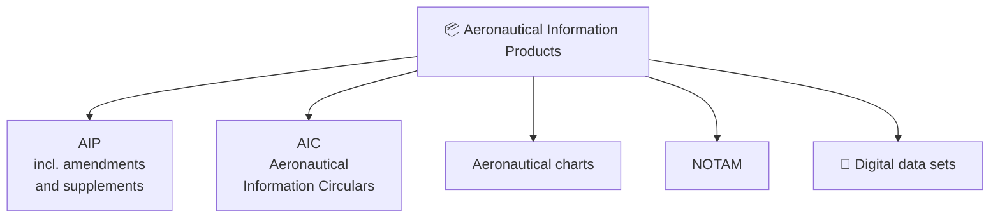
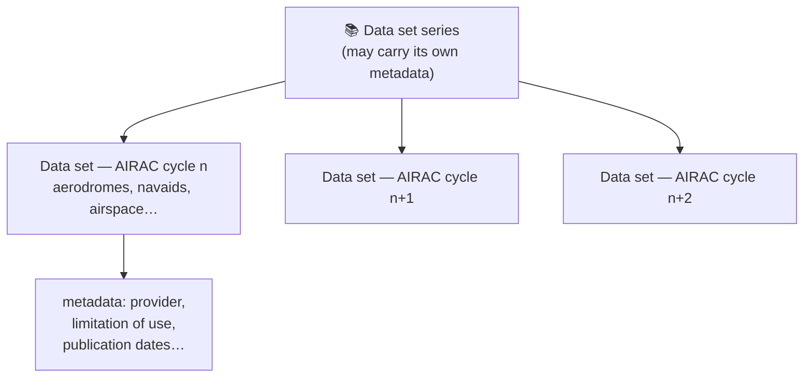
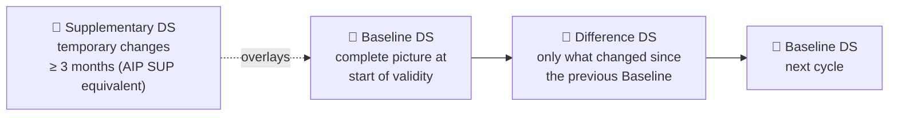
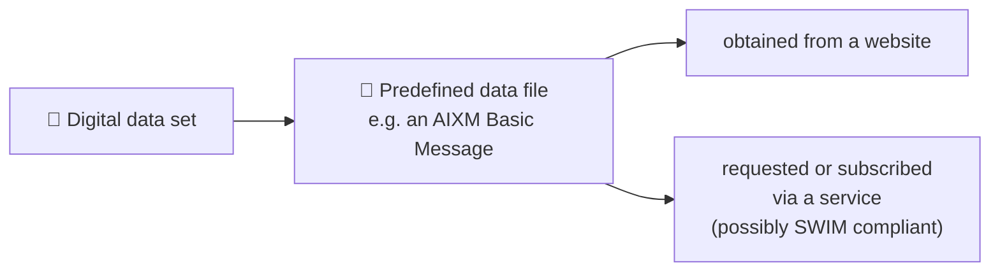
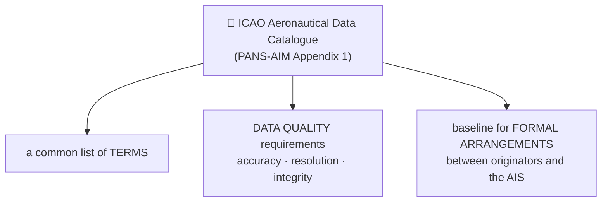
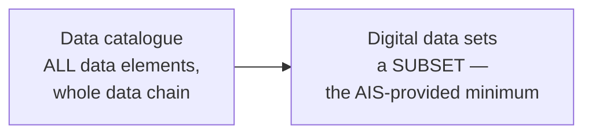
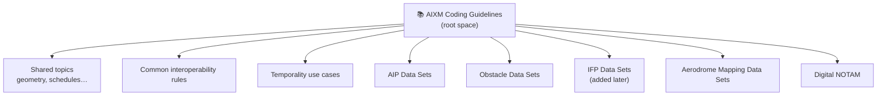
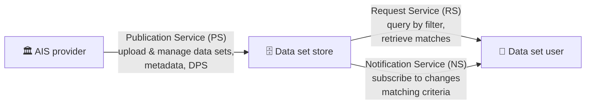

---
tags:
  - aviation-domain
  - exchange-models
  - aixm
  - e-learning
  - eurocontrol
aliases:
  - IM-AIXM-3
  - AIXM 5 coding and provision of the Digital Data Sets
course: EUROCONTROL IM-AIXM-3
created: 2026-09-14
status: in-progress
---

# AIXM 5 — Coding & Provision of the Digital Data Sets `[IM-AIXM-3]`

> [!abstract] The 30-second version
> [[IM-AIXM-1]] taught the machinery (UML, XML, GML) and [[IM-AIXM-2]] taught the AIXM model itself. This note is about the **product**: what ICAO actually requires a State to publish as a **digital data set**, which five data sets exist, what each must contain, how updates and metadata work, and how the data set finally reaches the user — as a file or as a **service**.

## Course map

| # | Module | Core question it answers |
|---|---|---|
| **Part 1 — The ICAO digital data set framework** | | |
| 1 | [[#Module 1 — Aeronautical Information Products and Data Sets\|Products and data sets]] | What *is* a digital data set, in ICAO's terms? |
| 2 | [[#Module 2 — Does AIXM 5 Meet the ICAO Requirements\|Does AIXM meet the requirements?]] | Why is AIXM the accepted answer, clause by clause? |
| 3 | [[#Module 3 — Metadata Requirements for Data Sets\|Metadata requirements]] | What must travel alongside every data set? |
| 4 | [[#Module 4 — Updating Data Sets\|Updating data sets]] | Complete reissue or differences — and how does AIXM express each? |
| 5 | [[#Module 5 — The Data Product Specification\|Data Product Specification]] | How is a data set formally described? |
| 6 | [[#Module 6 — Distribution of Data Sets\|Distribution]] | How does it physically get to the user? |
| 7 | [[#Module 7 — Data Sets versus Conventional AIP Products\|Data sets vs the AIP]] | Which AIP sections can now be left empty? |
| 8 | [[#Module 8 — Interoperability Rules\|Interoperability rules]] | Why does AIXM's flexibility need constraining? |
| **Part 2 — The data catalogue and the five data sets** | | |
| 9 | [[#Module 9 — The ICAO Aeronautical Data Catalogue\|The ICAO data catalogue]] | Where do the data element definitions come from? |
| 10 | [[#Module 10 — The AIP Data Set\|AIP data set]] | What goes in, and what may the AIP then omit? |
| 11 | [[#Module 11 — The Obstacle Data Set\|Obstacle data set]] | Which areas, which mandatory attributes? |
| 12 | [[#Module 12 — The Instrument Flight Procedure Data Set\|IFP data set]] | What does ICAO ask for here? |
| 13 | [[#Module 13 — The Aerodrome Mapping Data Set\|Aerodrome mapping data set]] | Which standard defines its content? |
| **Part 3 — Coding guidelines and services** | | |
| 14 | [[#Module 14 — The AIXM 5 Coding Guidelines\|AIXM 5 coding guidelines]] | How do I know how to code a given subject? |
| 15 | [[#Module 15 — Aeronautical Data Services\|Aeronautical data services]] | How is a data set served machine-to-machine? |

---

## Module 1 — Aeronautical Information Products and Data Sets

### What is an aeronautical information product?

> [!quote] ICAO Annex 15 — aeronautical information product
> Aeronautical data and aeronautical information provided either as digital data sets or as a standardised presentation in paper or electronic media.

They exist primarily to satisfy **international requirements for the exchange of aeronautical information**. The distinguishing feature of the fifth one:

> [!important] What makes a data set different
> A digital data set is provided in a **machine-readable format** — which could be as simple as a CSV file, or a complex XML structure based on a specific XML schema. Annex 15 requires **globally interoperable aeronautical information exchange models** for data set provision, and **AIXM is considered best practice** for formatting and exchanging digital aeronautical data.

### How ICAO defines a data set

In simple terms a **data set is an identifiable collection of data**. Each data set is valid for a **specific time period** — an [[14 — AIRAC|AIRAC]] cycle, for example — or until replaced by a newer version. **Both the data set series and each individual data set** may carry metadata: the organisation providing the data, limitations of use, publication dates, and so on.

### The five ICAO digital data sets

Annex 15 lists five, detailed further in PANS-AIM. Because their purpose is exchanging [[05 — AIS|AIS]] data, they are also called **AIS data sets**.

| # | Data set | Covered by AIXM 5? |
|---|---|---|
| 1 | **AIP data set** | ✅ |
| 2 | **Obstacle data set** | ✅ |
| 3 | **Instrument Flight Procedure (IFP) data set** | ✅ |
| 4 | **Aerodrome Mapping data set** | ✅ |
| 5 | **Terrain data set** | ❌ — uses GeoTIFF, shapefiles and similar instead |

> [!note] The requirements target one link in the chain, but don't restrict you to it
> Annex 15 and PANS-AIM frame these data sets around exchange **between the AIS and the next intended user**. Nothing prevents using the same ICAO data sets between **data originator and AIS**, or between **service providers and end users**.

---

## Module 2 — Does AIXM 5 Meet the ICAO Requirements

ICAO sets requirements (*shall*) and recommendations (*should*) for the model and coding used by digital data sets. Checked against AIXM 5:

### Requirements

| ICAO requires | AIXM 5 |
|---|---|
| Content and structure defined in terms of an **application schema** and a **feature catalogue** | The **UML data model** is the feature catalogue; the **XML schema** is the application schema |
| A **globally interoperable** aeronautical data and information exchange model shall be used | AIXM is used worldwide across the AIS community |
| The model *should* **encompass the data to be exchanged** | AIXM was explicitly developed to cover the data defined in Annex 15 and PANS-AIM |

### Recommendations for the information model

| ICAO recommends | AIXM 5 |
|---|---|
| Use **UML** to describe features, properties, associations and data types | Modelled in UML — see [[IM-AIXM-2]] |
| Include **data value constraints and verification rules** | A defined set of **business rules** |
| Include **provisions for metadata** | Full metadata concept built on ISO 19115/19139 |
| Include a **temporality model** | A comprehensive temporality concept — see [[22 — AIXM Temporality Model\|AIXM Temporality Model]] |

### Recommendations for the exchange model

| ICAO recommends | AIXM 5 |
|---|---|
| Apply a **commonly used data encoding format** | **XML** plus **GML**, both of which ICAO regards as commonly used |
| Cover **all** classes, attributes, data types and associations of the information model | An **exhaustive UML → XSD mapping** guarantees nothing is left behind |
| Provide an **extension mechanism** that does not adversely affect global standardisation | The AIXM extension concept, scoped to a community of interest |
| Use the **ISO 19100 series** as a reference framework | AIXM reuses several — e.g. **ISO 19136 (GML)** for geometry encoding |

> [!tip] Why "commonly used format" is a requirement and not a preference
> The intent is **interoperability across the whole data processing chain** — every organisation touching the data must be able to read it with ordinary tooling.

---

## Module 3 — Metadata Requirements for Data Sets

> [!important] The ICAO minimum for every data set
> Each data set shall include, for the next intended user:
> 1. the **name of the organizations or entities** providing the data set;
> 2. the **date and time** when the data set was provided;
> 3. the **validity** of the data set; and
> 4. any **limitations on the use** of the data set.

**Obstacle data sets carry more** — notably the **geographical extent** and the **confidence level** associated with the data.

> [!note] Metadata obligations run the length of the data chain
> When the AIS **collects** data from a survey or an originator, it is obliged to collect and **store** metadata about that transaction too — not just to pass metadata on with the finished product. That stored record is what makes the published data **traceable** back to its origin.

The AIXM-side mechanics — the three metadata levels, `aixm:messageMetadata`, and the ISO 19115/19139 classes — are covered in [[IM-AIXM-2]].

---

## Module 4 — Updating Data Sets

Data sets, like the AIP, **shall be amended or reissued at regular intervals** as needed to stay current.

> [!important] The synchronisation rule
> Updates to the **AIP and the digital data sets shall be synchronised**, and the **same update cycle applied to both**, so that data items appearing in multiple aeronautical information products stay consistent.

### Complete data set, or just the differences

For **permanent changes** and **temporary changes of long duration** (three months or longer), Annex 15 allows either:

- a **complete data set**; or
- a **subset containing only the differences** from the previously issued complete data set.

> [!note] If you reissue completely, still flag what moved
> When provided as a completely reissued data set, the **differences from the previous complete data set should be indicated**.

### The three AIXM data set variants

Both options are supported by the AIXM temporality concept, which defines three variants:

| Variant | Contains |
|---|---|
| **Baseline** | **All and only** `BASELINE` TimeSlices that are, or become, valid at the **start of the time validity** of the data set |
| **Difference** | The difference between two consecutive Baseline data sets: **mandatorily** all `BASELINE` TimeSlices that **end or start** their validity at the start of the data set's validity (optionally, equivalent `PERMDELTA` TimeSlices too, which pinpoint the change location more precisely); and **if applicable**, `BASELINE` TimeSlices that ended or started validity at an **intermediate time** between two consecutive Baseline data sets — covering changes outside the regular update cycle |
| **Supplementary** | TimeSlices giving **temporary updates valid three months or longer** (the AIP SUP equivalent), as `TEMPDELTA` for pre-existing features or `BASELINE` for **new** temporary features |

### What actually goes into a complete (Baseline) data set

> [!important] The two selection criteria
> For every feature in the scope of the data set, include the TimeSlices with interpretation `BASELINE` that:
> 1. **are valid or become valid** at that effective date/time; **and**
> 2. have an **undetermined end of validity**.

> [!warning] "Valid TimeSlice" has a precise meaning here
> Per the AIXM Temporality Concept, a *valid* TimeSlice is either the single TimeSlice, or — among TimeSlices sharing the same `interpretation` and the same `sequenceNumber` — **the one with the highest `correctionNumber`**. Pick the wrong one and you publish a superseded correction.

### Other update obligations

- Data sets released **in advance** under the AIRAC cycle **shall be updated with the non-AIRAC changes** occurring between publication and effective date.
- A **checklist of the data sets** shall be made available through the **same distribution mechanism** as the data sets themselves.
- **Temporary changes of short duration** published as digital data (digital NOTAM) **should use the same information model** as the complete data set — AIXM 5 can code digital NOTAM (see [[15 — NOTAMs|NOTAMs]]).
- The **update interval shall be specified in the Data Product Specification**.

---

## Module 5 — The Data Product Specification

> [!abstract] The requirement
> PANS-AIM requires that a **description of each available data set** be provided as a **Data Product Specification (DPS)**.

A DPS following **ISO 19131** is divided into sections, each specifying one aspect of the data product:

| Section | Covers |
|---|---|
| **Overview** | Informal overview — contact details of the party responsible for the DPS, its publication date, terms and definitions used |
| **Specification scope** | What the specification applies to |
| **Data product identification** | Title, abstract, purpose, geographic description |
| **Data content and structure** | The application schema and feature catalogue |
| **Reference systems** | Spatial and temporal reference systems used |
| **Data quality** | Quality requirements and measures |
| **Data capture** | Instructions, requirements and descriptions of data capture and production — including specific methods and processing steps |
| **Data maintenance** | Update frequency and process, including the **update interval** |
| **Portrayal** | How the data is to be presented, where relevant |
| **Data product delivery** | Delivery format and medium |
| **Metadata** | The metadata to accompany the product |

---

## Module 6 — Distribution of Data Sets

> [!quote] ICAO Annex 15
> Aeronautical information shall be provided in the form of aeronautical information products and associated services.

And a recommendation: **global communication networks such as the internet should, whenever practicable, be employed** for provision of aeronautical information products.

### The SWIM angle

> [!abstract] What "service" means in a SWIM context
> **Machine-to-machine interaction** built on **Service-Oriented Architecture (SOA)** principles: a **service consumer** uses a service offered by a **service provider** through a **defined interface**, and that interface must apply the standards described by SWIM.

PANS-AIM points to the **Manual on System-wide Information Management (SWIM) Concept (Doc 10039)** for further guidance on digital data set distribution. See [[26 — SWIM|SWIM]].

> [!tip] Registries are how anyone finds your service
> **Service registries** such as the **SWIM registry** let consumers search for and discover structured, categorised service information — while providers **gain visibility** for their services on the basis of common principles.

---

## Module 7 — Data Sets versus Conventional AIP Products

Digital data sets may be issued **in addition to**, or **instead of**, certain AIP sections — particularly where the information is presented as **tables of similar aeronautical features**.

> [!example] The trade
> Provide the **AIP data set**, and ENR 4.1 *"Radio navigation aids — en-route"* may be left empty. Provide the **Obstacle data set**, and **AD 2.10 Aerodrome obstacles** may be omitted.

### Advertising your data sets in the AIP

ICAO recommends describing available digital data sets in **AIP section GEN 3.1.6**, covering at least:

- data set **title**
- **short description**
- **data subjects** included
- **geographical scope**
- **limitations** related to its usage, if applicable
- **contact details** for how the data sets may be obtained

See [[13 — AIP|AIP]] for the document structure these sections belong to.

---

## Module 8 — Interoperability Rules

> [!important] Why AIXM is deliberately loose — and why that's a problem here
> AIXM 5 supports a wide range of use cases: data origination, charting, static data coding, digital NOTAM. That breadth **requires flexibility** — hence **no mandatory feature properties** (so that "differences" can be coded) and **no predefined feature keys** (both natural and artificial keys are allowed, depending on context).
>
> For the provision of **ICAO data sets**, that flexibility must be **constrained** so the data is fit for its intended use.

The AIXM coding guidelines therefore identify **interoperability rules** which ensure:

- end users can **seamlessly merge** digital data coming from **different States**; and
- States can **exchange** the AIP data set and the other Annex 15 data sets **between themselves**.

> [!tip] Most of these rules are machine-checkable
> Most interoperability rules can be expressed as **AIXM business rules**, so a data set can be **verified for compliance automatically** — on the data provider's side *and* the data user's side.

Beyond the business rules, they also cover **file naming conventions** for data sets, the use of **`nilReason`** and the value **`OTHER`**, and the **application of extensions**.

---

## Module 9 — The ICAO Aeronautical Data Catalogue

> [!abstract] What it is
> The **aeronautical data catalogue** is **Appendix 1 of ICAO PANS-AIM**. It is a general description of the aeronautical information data scope, consolidating **all data that can be collected and maintained by AIS providers**.

It serves as the reference for aeronautical data **origination and publication requirements**, providing a common terminology usable by both data originators and service providers. It also helps States identify **which organizations and authorities are responsible for originating** which data — making it the baseline for the **formal arrangements** between data originators and the AIS.

### Content and structure

The catalogue is a set of **Excel spreadsheets**, one per information **sub-domain**, each giving a detailed description of all **subjects, properties, sub-properties** and their **data types**.

> [!warning] The catalogue is not a data model
> Classifying an element as *subject*, *property* or *sub-property* **does not impose any particular data model**. The catalogue deliberately defines data elements in an **"operational" language**. Real implementations therefore need a **mapping** from the catalogue to a technically-worded model like AIXM — and for AIXM 5 that mapping is part of the **coding guidelines** ([[#Module 14 — The AIXM 5 Coding Guidelines|Module 14]]).

> [!note] States may extend it
> A national AISP may define **additional properties, or even additional subjects**, to fit the catalogue to national data collection needs.

### Data quality requirements

The catalogue is the **single source** of **data accuracy**, **data resolution** and **data integrity** requirements for aeronautical information.

> [!tip] This consolidation is the real win
> These requirements were previously scattered across **Annex 4** (charts), **Annex 11** (ATS), **Annex 14** (aerodromes), **Annex 15**, and **PANS-OPS**. The catalogue brings them into one place.

### Its three purposes

### How it relates to the data sets

The catalogue applies across the **entire aeronautical data chain**, from origination to end user. The **digital data sets** are mainly about the **AIS providing products** — and they define **far fewer** elements than the catalogue does. The data sets are, in effect, a **subset** of the catalogue.

> [!note] In Europe this is regulation, not guidance
> The data catalogue and digital data set requirements form part of **Commission Implementing Regulation (EU) No 139/2014** and **Regulation (EU) 2017/373**, as amended by **Commission Implementing Regulation (EU) 2020/469**.

---

## Module 10 — The AIP Data Set

> [!quote] ICAO Annex 15
> An AIP data set should be provided covering the extent of information as provided in the AIP.

> [!warning] That wording is misleading
> An AIP data set does **not** contain everything in a traditional AIP. **Obstacle data**, **instrument flight procedure data** and **airport mapping** each have their **own** data sets. And most **purely textual** information — such as the GEN part — is **not** in an AIP data set at all.
>
> In practice an AIP data set covers mainly the **tabular en-route data**: points, navaids, routes, airspace, and **limited** airport data.

**Purpose:** to support the ATM domain's transition from paper products to digital data sets. Its scope was therefore chosen by considering **how likely the data is to be used in digital form** by service providers, [[03 — ATC|ATC]], and IFR/VFR airspace users.

> [!important] What an AIS provider must ensure
> If an AIP data set is available, it shall contain the digital representation of aeronautical information **of lasting character** — permanent information **and long-duration temporary changes**. Concretely: the content normally published by **AIP Amendments and AIP Supplements**.

### Minimum content

PANS-AIM requires these subjects, with the properties indicated where applicable:

| Subject | Properties |
|---|---|
| **ATS airspace** | type, name, lateral limits, vertical limits, class of airspace |
| **Special activity airspace** | type, name, lateral limits, vertical limits, restriction, activation |
| **ATS route and other route** | designator, flight rules |
| **Route segment** | navigation specification, from point, to point, track, length, upper limit, lower limit, MEA, MOCA, direction of cruising level, required navigation performance |
| **Waypoint — en-route** | identification, location, formation |
| **Aerodrome/heliport** | ICAO location indicator, name, designator IATA, served city, certified ICAO, certification date, certification expiration date, control type, field elevation, reference temperature, magnetic variation, reference point |
| **Runway** | designator, nominal length, nominal width, surface type, strength |
| **Runway direction** | designator, true bearing, threshold, TORA, TODA, ASDA, LDA |
| **FATO** (Final Approach and Take-Off) | designation, length, width, threshold point |
| **TLOF** (Touchdown and Lift-Off) | designator, centre point, length, width, surface type |
| **Radio navigation aid** | type, identification, name, aerodrome/heliport served, hours of operation, magnetic variation, frequency/channel, position, elevation, magnetic bearing, true bearing, zero bearing direction |

> [!note] Minimum, not maximum
> These are the **minimum** data elements. When a complete AIP data set cannot be provided, the **available subset(s) should be provided** instead.

### The "not applicable" rule

> [!important] A missing property must say *why* it is missing
> Where a property is **not defined** for a particular occurrence of a minimum-data subject, the AIP data set shall include an **explicit indication: "not applicable"**. Other reasons a property may be absent include **unknown**, **withheld**, and so on.
>
> In AIXM this is exactly what the **`nil`** value and the **`nilReason`** element are for.

> [!tip] Read the scope of that rule generously
> ICAO imposes it explicitly and exclusively on the **AIP data set**, but the intention was almost certainly for it to apply to **all** data sets.

### AIP sections that may then be omitted

When an AIP data set is provided for the corresponding data, these sections may be omitted — with a **reference to the data set's availability** provided instead:

| AIP part | Sections |
|---|---|
| **GEN** | GEN 2.5 List of radio navigation aids |
| **ENR** — airspace, areas, navigation warnings | ENR 2.1 FIR, UIR, TMA, CTA · ENR 5.1 Prohibited, restricted and danger areas · ENR 5.2 Military exercise/training areas and ADIZ · ENR 5.3.1 Other activities of a dangerous nature · ENR 5.3.2 Other potential hazards · ENR 5.5 Aerial sporting and recreational activities |
| **ENR** — route structure | ENR 3.1 Lower ATS routes · ENR 3.2 Upper ATS routes · ENR 3.3 Area navigation routes · ENR 3.4 Helicopter routes · ENR 3.5 Other routes · ENR 3.6 En-route holding |
| **ENR** — navaids and points | ENR 4.1 Radio navigation aids — en-route · ENR 4.2 Special navigation systems · ENR 4.4 Name-code designators for significant points · ENR 4.5 Aeronautical ground lights — en-route |
| **AD** | AD 2.17 ATS airspace · AD 2.19 Radio navigation and landing aids · AD 3.16 ATS airspace · AD 3.18 Radio navigation and landing aids |

> [!important] This list is longer than the minimum content list
> It includes **en-route holding** and **aeronautical ground lights**, which are *not* in the PANS-AIM minimum. So an AIP data set can legitimately contain **more** than the specified minimum — and if you intend to empty those AIP sections, it **must**.

In AIXM, the properties needed to build an AIP data set are spread across several packages — **AirportHeliport**, **Airspace**, **Navaids/Points** and **Routes**.

---

## Module 11 — The Obstacle Data Set

Obstacle data feeds a wide range of applications: **instrument procedure design**, **aircraft operating limitations analysis**, **A-SMGCS**, **aeronautical chart production and on-board databases**, and **synthetic vision**.

### General requirements

| Requirement | Detail |
|---|---|
| **Content** | The digital representation of the **vertical and horizontal extent** of obstacles |
| **Geometry** | Obstacle data elements are features represented by **points, lines or polygons** |
| **Separation** | Obstacle data **shall not be included in terrain data sets** |

### Areas of coverage

| Area | Definition |
|---|---|
| **Area 1** | The **entire territory** of a State |
| **Area 2** | Within the **vicinity of an aerodrome** — subdivided into **Areas 2a, 2b, 2c and 2d** |
| **Area 3** | The area bordering the aerodrome movement area, extending horizontally from the **edge of a runway to 90 m from the runway centre line**, and **50 m from the edge of all other parts** of the movement area |
| **Area 4** | The area extending **900 m prior to the runway threshold** and **60 m each side** of the extended runway centre line, in the direction of approach on a **precision approach runway Category II or III** |

> [!note] Other surfaces qualify too
> Obstacle data may also be provided for collection surfaces specified in other Annexes — the **take-off flight path area** (Annex 4), **aerodrome obstacle limitation surfaces** (Annex 14), and others.

> [!example] A sample provision rule
> For aerodromes regularly used by international civil aviation, obstacle data **shall** be provided for **Area 2a** for obstacles **3 m or more above the nearest runway elevation**. Annex 15 and PANS-AIM contain the full set of mandatory/recommended provision conditions — they matter operationally but **not** for how the data is coded in AIXM.

### Mandatory content

Every obstacle feature shall be provided per the attribute list in **PANS-AIM Table A6-2**:

| Attribute | Status |
|---|---|
| Area of coverage | Mandatory |
| Data originator identifier | Mandatory |
| Data source identifier | Mandatory |
| Obstacle identifier | Mandatory |
| Horizontal accuracy | Mandatory |
| Horizontal confidence level | Mandatory |
| Horizontal position | Mandatory |
| Horizontal resolution | Mandatory |
| Horizontal extent | Mandatory |
| Horizontal reference system | Mandatory |
| Elevation | Mandatory |
| **Height** | *Optional* |
| Vertical accuracy | Mandatory |
| Vertical confidence level | Mandatory |
| Vertical resolution | Mandatory |
| Vertical reference system | Mandatory |
| Obstacle type | Mandatory |
| Geometry type | Mandatory |
| Integrity | Mandatory |
| Date and time stamp | Mandatory |
| Unit of measurement used | Mandatory |
| **Operations** | *Optional* |
| **Effectivity** | *Optional* |
| Lighting | Mandatory |
| Marking | Mandatory |

> [!important] Why three attributes are optional
> Obstacles may be **fixed (permanent or temporary)** or **mobile**. The attributes specific to **mobile** obstacles (feature *operations*) and **temporary** ones (*effectivity*) are marked optional — but **if you include such obstacles in the data set, the attributes describing them become required**.

> [!note] Two catalogue differences worth knowing
> The PANS-AIM **data catalogue** (Appendix 1) carries essentially this same list minus the items it treats as **metadata**, and adds two more: **Obstacle Operator/Owner** and **Material**.
>
> Also: the **geographical reference system and accuracies** are an **integral part of the AIXM data**, whereas the catalogue treats them as **metadata**. This is not a contradiction — global values for the whole data set may still be given as metadata.

### AIP sections that may then be omitted

- **ENR 5.4** Air navigation obstacles
- **AD 2.10** Aerodrome obstacles
- **AD 3.10** Heliport obstacles

The **AIXM UML Obstacle package covers all the ICAO data content requirements**.

---

## Module 12 — The Instrument Flight Procedure Data Set

> [!abstract] Content
> The digital representation of **instrument flight procedures**.

ICAO gives comparatively few requirements here, beyond that it **should be made available for aerodromes regularly used by international civil aviation**.

IFP data sets may contain **procedure design** and/or **procedure coding** information, and may be used by AISPs, data integrators or end users to **create procedure charts**, or to convert into data sets usable by **flight management systems (FMS)**.

Unlike the AIP and Obstacle data sets, ICAO provides **no detailed property list** — only the subjects, **including all of their properties**:

- Procedure
- Procedure segment
- Final approach segment
- Procedure fix
- Procedure holding
- Helicopter procedure specifics

The description of each subject, with properties, data types and applicable data quality requirements, is in the **PANS-AIM aeronautical data catalogue**. **ICAO PANS-OPS** also carries data publication requirements to consider.

> [!warning] A real version limitation
> **AIXM 5.1(.1) has limitations** for coding terminal procedures, especially against the **Performance Based Navigation (PBN)** concept. Several change proposals were raised specifically to close that gap in **AIXM 5.2**.

In AIXM 5 the **procedure packages** cover the corresponding data content requirements.

---

## Module 13 — The Aerodrome Mapping Data Set

> [!abstract] Content
> The digital representation of the **spatial layout of an aerodrome** — runways, taxiways, aprons, aircraft stands — with geometry as **points, lines or polygons** and attributes (e.g. surface type) adding further information.

Aerodrome mapping data supports applications that **improve situational awareness** or **supplement surface navigation**, increasing safety margins and operational efficiency. With appropriate data element accuracy it supports **collaborative decision making**, **common situational awareness** and **aerodrome guidance**, feeding applications such as:

- **moving maps** with own-ship position, surface guidance and navigation (e.g. **A-SMGCS**)
- facilitation of aerodrome-related aeronautical information, **including NOTAM**
- **aeronautical chart production**

> [!important] It shouldn't travel alone
> Aerodrome mapping data **should be supported by electronic terrain and obstacle data for Area 3**, to ensure consistency and quality across all geographical data for that aerodrome. Like the IFP data set, it should be available for aerodromes **regularly used by international civil aviation**.

### Defining standards

| Aspect | Standard |
|---|---|
| **Content** | **RTCA DO-272D / EUROCAE ED-99D** — *User requirement for Aerodrome Mapping Information* |
| **Metadata** | **RTCA DO-291B / EUROCAE ED-119B** — *Interchange Standards for Terrain, Obstacle, and Aerodrome Mapping Data* |

In AIXM, the relevant UML sits primarily in the **AirportHeliport package and its sub-packages** — Airport/Heliport, Apron, Runway, Taxiway, Markings and others.

> [!note] AIXM is not the only option here
> A separate XML-based exchange model exists specifically for AMDB data as published by DO-272D/ED-99D and DO-291C/ED-119C: the **Aerodrome Mapping Exchange Model (AMXM)**.

---

## Module 14 — The AIXM 5 Coding Guidelines

### Purpose

AIXM 5 enables digital data provision for a very wide range of elements. For the subjects and properties **formally declared as part of the ICAO digital data sets**, two things must be documented:

1. the ICAO **data catalogue subjects and properties mapped into AIXM** features and properties; and
2. for each AIXM feature and property of interest, **how the data currently provided by AIS is represented** in AIXM — covering both **nominal cases and less common situations**.

> [!example] What that looks like in practice
> The AIP data set coding guidelines explain how the **runway direction** subject and its **threshold** property are represented in AIXM — and how to code **both a normal and a displaced threshold**.

### Where they live, and how they're organised

The guidelines are accessible from the AIXM website, currently in a collaborative **Atlassian Confluence** environment set up so the AIXM community can develop guidance material together and document implementations.

Each ICAO data set covered by AIXM gets **its own space**, plus a space for **digital NOTAM** coding, all under a general **"AIXM Coding Guidelines"** root space that holds the basic and common topics applying to every data set.

> [!warning] Treat it as a living document
> The Confluence site is **constantly updated**. Content may have changed since any given course was recorded, and some material may not yet be public — but the **overall structure of the coding guidelines remains valid**.

### Structure of a data set's guidelines

The coding guidelines for each specific ICAO data set follow a **similar structure**, though with differences reflecting each set's specific content and requirements.

> [!note] Verification is coming from EUROCONTROL
> A **formal specification for verifying the content** of an ICAO data set in AIXM 5 format is to be provided by EUROCONTROL.

---

## Module 15 — Aeronautical Data Services

### The ICAO requirement

> [!quote] Annex 15 (16th Edition) / PANS-AIM (Doc 10066), 5.1.1
> Aeronautical information shall be provided in the form of aeronautical information products and associated services.

> [!quote] Annex 15, 5.4.1.3 — Recommendation
> Global communication networks such as the internet should, whenever practicable, be employed for the provision of aeronautical information products.

PANS-AIM points to **Doc 10039 (Manual on SWIM Concept)** for further guidance on digital data set distribution.

> [!note] What Doc 10039 will and won't tell you
> Neither the current Doc 10039 nor its envisaged update is expected to contain **domain-specific** guidance such as how to provide digital aeronautical data set services. It is expected to cover the **transversal requirements** — those common to *all* domains — for SWIM information services.

### The AeronauticalDataset service

> [!abstract] What "pre-defined" means, and why it matters
> The service provides **pre-defined** digital data sets — the content is **specified in advance**. A user **cannot request a user-specific data set**; they can only **choose between the data sets made available**, which are characterised by their **metadata**.

The Aeronautical Dataset Services are a **family** of services for **providing, discovering and retrieving** Annex 15 digital data sets. Three service definitions exist:

| Service | Primary function |
|---|---|
| **Aeronautical Dataset Request Service (RS)** | Lets a consumer **query available data sets using a set of filters** and **retrieve** those matching the criteria |
| **Aeronautical Dataset Publication Service (PS)** | Lets an AIS **upload and manage** Annex 15 data sets and accompanying metadata within a **data set store** — with support for managing **data set series, data sets and data product specifications** |
| **Aeronautical Dataset Notification Service (NS)** | Lets consumers **subscribe to notifications** about changes in data sets and data set series made available in the store, **filtered** by consumer-defined criteria |

### Prototype implementation

EUROCONTROL has implemented a **prototype** of this service to verify the **completeness and correctness of the Service Definitions**. It lets users **test the service without implementing a client** of their own, and runs on the fictitious **DONLON** data set plus sample data sets contributed by some AIS providers.

---

## Jargon buster

| Term | Plain meaning |
|---|---|
| **Aeronautical information product** | AIP, AIC, charts, NOTAM, or a digital data set |
| **Digital data set** | A machine-readable collection of aeronautical data, valid for a stated period |
| **Data set series** | The ongoing sequence of data sets; may carry its own metadata |
| **AIS data set** | Another name for the ICAO digital data sets, since they exchange AIS data |
| **The five data sets** | AIP · Obstacle · IFP · Aerodrome Mapping · Terrain (only Terrain is outside AIXM) |
| **Feature catalogue / application schema** | The AIXM UML model / the AIXM XML schema — the two things ICAO requires |
| **Baseline DS** | Complete picture: all `BASELINE` TimeSlices valid at the data set's start of validity |
| **Difference DS** | Only what changed since the previous Baseline data set |
| **Supplementary DS** | Temporary changes lasting three months or more — the AIP SUP equivalent |
| **Valid TimeSlice** | The one with the **highest `correctionNumber`** among equal interpretation and sequenceNumber |
| **`nil` / `nilReason`** | How AIXM says a property is "not applicable", unknown or withheld |
| **DPS** | Data Product Specification — the ISO 19131 description of a data product |
| **Interoperability rules** | Constraints on AIXM's deliberate flexibility, so data from different States merges cleanly |
| **ICAO data catalogue** | PANS-AIM Appendix 1 — subjects, properties, data types, and the single source of data quality requirements |
| **Subject / property / sub-property** | The catalogue's *operational* vocabulary — deliberately not a data model |
| **GEN 3.1.6** | The AIP section where a State advertises its available digital data sets |
| **Obstacle Areas 1–4** | State territory · aerodrome vicinity (2a–2d) · movement area surrounds · precision approach strip |
| **A-SMGCS** | Advanced Surface Movement Guidance and Control System |
| **DO-272D / ED-99D** | The standard defining aerodrome mapping data content |
| **DO-291B / ED-119B** | The standard defining aerodrome mapping metadata |
| **AMXM** | Aerodrome Mapping Exchange Model — an AMDB-specific alternative to AIXM |
| **Doc 10039 / Doc 10066** | Manual on SWIM Concept / PANS-AIM |
| **RS / PS / NS** | Dataset Request / Publication / Notification services |
| **Data set store** | Where the Publication Service puts data sets and the other two services read them |

## How it connects to the rest

This note is the **delivery end** of the AIXM story: [[IM-AIXM-1]] gave the modelling and coding fundamentals, [[IM-AIXM-2]] gave the AIXM model and its schema, and this one covers what ICAO requires you to **publish and distribute**. The data sets encode the content of the [[13 — AIP|AIP]] on the [[14 — AIRAC|AIRAC]] cycle, are produced by the [[05 — AIS|AIS]], reach users over [[26 — SWIM|SWIM]] or from systems like [[25 — EAD|EAD]], and carry the features described in [[07 — Aerodromes|Aerodromes]], [[08 — NAVAIDs|NAVAIDs]], [[09 — Waypoints|Waypoints]], [[10 — FIR|FIR]] and [[11 — TMA|TMA]]. Short-duration changes travel as digital [[15 — NOTAMs|NOTAMs]] using the same model.

## Learn more

**ICAO**
- Annex 15 (16th Edition) — Aeronautical Information Services
- PANS-AIM (**Doc 10066**), including **Appendix 1** — the aeronautical data catalogue — and **Table A6-2** for obstacle attributes
- PANS-OPS — procedure publication requirements relevant to the IFP data set
- **Doc 10039** — Manual on System-wide Information Management (SWIM) Concept
- Annexes 4, 11 and 14 — the original homes of the data quality requirements now consolidated in the catalogue

**Industry standards**
- **ISO 19131** — Data product specifications
- **ISO 19136** — Geography Markup Language, used by AIXM for geometry
- **RTCA DO-272D / EUROCAE ED-99D** — User requirement for Aerodrome Mapping Information
- **RTCA DO-291B / EUROCAE ED-119B** — Interchange standards for terrain, obstacle and aerodrome mapping data
- **RTCA DO-276 / EUROCAE ED-98** — User requirements for terrain and obstacle data

**European regulation**
- Commission Implementing Regulation (EU) No **139/2014**
- Regulation (EU) **2017/373**, as amended by Commission Implementing Regulation (EU) **2020/469**

**AIXM resources**
- AIXM coding guidelines and data set spaces — <http://aixm.aero/confluence>
- AIXM specifications, schemas and documentation — <https://aixm.aero>
- *Terrain and Obstacle Data Manual* — <https://www.eurocontrol.int/publication/eurocontrol-terrain-and-obstacle-data-manual>
