---
tags:
  - aviation-domain
  - exchange-models
  - aixm
  - e-learning
  - eurocontrol
aliases:
  - IM-AIXM-2
  - AIXM 5 purpose, scope and design concepts
course: EUROCONTROL IM-AIXM-2
created: 2026-09-14
status: complete
---

# AIXM 5 — Purpose, Scope & Design Concepts `[IM-AIXM-2]`

> [!abstract] The 30-second version
> [[IM-AIXM-1]] covered the *machinery* — data modelling, UML, XML, GML. This note covers **AIXM itself**: what it is for, what it does and doesn't cover, how it got here, who governs it, what it's made of, where it's deployed, and how its **Logical Data Model (the AIXM UML)** is organised sub-domain by sub-domain.

## Course map

| # | Module | Core question it answers |
|---|---|---|
| **Part 1 — Purpose, scope & design concepts** | | |
| 1 | [[#Module 1 — Purpose & Scope\|Purpose & scope]] | What is AIXM for, and where does its coverage stop? |
| 2 | [[#Module 2 — Evolution & Key Milestones\|Evolution & key milestones]] | How did it get from a 1993 study to AIXM 5.2? |
| 3 | [[#Module 3 — Governance\|Governance]] | Who decides what changes, and how? |
| 4 | [[#Module 4 — Main Components\|Main components]] | What is actually *in* the AIXM specification? |
| 5 | [[#Module 5 — Implementations & Use Cases\|Implementations & use cases]] | Where is AIXM actually running today? |
| 6 | [[#Module 6 — Resources\|Resources]] | Where do I go to look something up? |
| **Part 2 — The AIXM 5 Logical Data Model** | | |
| 7 | [[#Module 7 — Introduction to the AIXM 5 UML\|Introduction to the AIXM 5 UML]] | How is the model organised, and how do I browse it? |
| 8 | [[#Module 8 — Airport Model\|Airport model]] | How are aerodromes and their surfaces modelled? |
| 9 | [[#Module 9 — Navaid & Point Model\|Navaid & Point model]] | How are navaids and navigable points modelled? |
| 10 | [[#Module 10 — Route Model\|Route model]] | How are ATS routes and their segments modelled? |
| 11 | [[#Module 11 — Airspace Model\|Airspace model]] | How is airspace geometry and usage modelled? |
| 12 | [[#Module 12 — Organisation, Unit & Service Model\|Organisation, Unit & Service model]] | How are the bodies providing services modelled? |
| 13 | [[#Module 13 — Obstacle Model\|Obstacle model]] | How are obstacles and vertical structures modelled? |
| 14 | [[#Module 14 — Procedure Model\|Procedure model]] | How are SIDs, STARs and approaches modelled? |
| 15 | [[#Module 15 — Shared Components\|Shared components]] | How do schedules and notes work across the model? |
| 16 | [[#Module 16 — Other Topics in the Model\|Other topics in the model]] | What's left that this course doesn't cover? |
| **Part 3 — Coding format, metadata & extensions** | | |
| 17 | [[#Module 17 — The AIXM 5 XML Schema\|The AIXM 5 XML Schema]] | Which schemas are there, and how do they fit together? |
| 18 | [[#Module 18 — From AIXM UML to AIXM XSD\|From AIXM UML to AIXM XSD]] | How does the UML dictate the schema's structure? |
| 19 | [[#Module 19 — Metadata\|Metadata]] | What must travel *with* a data set, and how is it coded? |
| 20 | [[#Module 20 — The Extension Concept and OTHER\|The extension concept and OTHER]] | How do I add what the core model doesn't have? |
| 21 | [[#Module 21 — XSLT Processing of AIXM Data\|XSLT processing of AIXM data]] | How do I get AIXM into something human-readable? |

---

## Module 1 — Purpose & Scope

### The purpose of AIXM

> [!abstract] Core objective
> To provide a **system-independent, international data exchange standard for aeronautical data** — built on global aeronautical data needs, ICAO standards and practices, and industry requirements.

AIXM gives the domain two things at once:

- a **common language** for aeronautical data (shared concepts and definitions), and
- a **common encoding** for computer interpretation (machine-readable, platform-independent).

> [!note] "Aeronautical data" means the ICAO definition
> Throughout this course, *aeronautical data* means the data in scope of the **Aeronautical Information Services (AIS)** as defined in **ICAO Annex 15** and **PANS-AIM** — see [[05 — AIS|AIS]] and [[13 — AIP|AIP]].

### How the goal changed over time

AIXM did not start as a global standard. It started as the data exchange specification for one system — the **European AIS Database ([[25 — EAD|EAD]])** — and only handled **static** data: the long-lived content published in AIP tables and on charts, updated on the 28-day **[[14 — AIRAC|AIRAC]]** cycle.

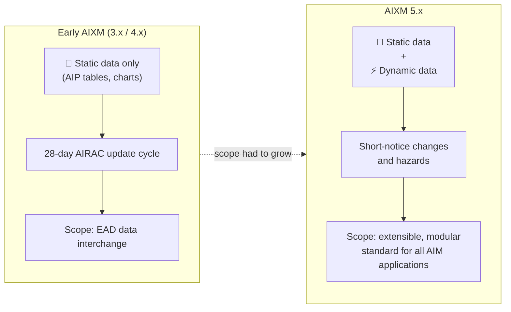

Attempts to stretch the early versions into a wider role — airspace activation services, airport mapping, obstacle databases, data of local interest — **proved difficult**. That pressure is what drove the redesign.

> [!important] The goal of AIXM 5
> To be an **extensible, modular** aeronautical information exchange standard satisfying current *and future* application requirements — covering not only static data but also the **dynamic** data needed to warn users of changes and hazards at short notice.

Applications AIXM 5 is meant to support:

- provision of **digital AIS data sets**
- **automated AIP production**
- **automated aeronautical chart** creation and publication
- **Digital NOTAM** (see [[15 — NOTAMs|NOTAMs]])
- **Aerodrome Mapping Databases (AMDBs)** and related applications
- enhanced **pre-flight briefing** solutions (see [[17 — PIB|PIB]])
- **data validation**

### The AIXM scope

From the start the focus has been the data defined in **ICAO Annex 15** — mainly what is published in an AIP — because that is what international air navigation needs across all phases of flight. Industry standards were also taken into account to a degree, notably **ARINC 424** for encoding terminal procedures.

Since **version 5**, the scope has widened beyond Annex 15's classic AIP content to also cover:

- **airport mapping data**
- **procedure design data**
- data needed for **digital NOTAM processing**

The **core AIXM 5 model** covers these conceptual areas (sub-domains):

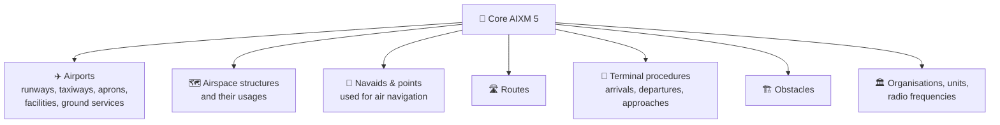

### AIXM extensions

> [!tip] When core isn't enough
> For specific applications, AIXM 5 allows the core model to be **extended**. This lets a particular **community of interest (COI)** cover needs that are not relevant to the whole AIXM user community — without forcing those needs into the core standard everyone else has to implement.

---

## Module 2 — Evolution & Key Milestones

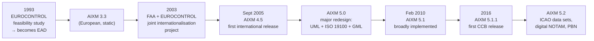

### The birth of AIXM

In **1993**, EUROCONTROL initiated a feasibility study for a central European data repository that would let European **AIS Providers (AISPs)** exchange digital data. That repository is what we now know as the **[[25 — EAD|EAD]]**.

### Internationalisation

Internationalisation began after **version 3.3**. In **2003** a joint project between the **US FAA** and **EUROCONTROL** set out to improve AIXM and raise it to the level of an international standard.

**AIXM 4.5** (September 2005) was the first release incorporating suggestions from the international community — and a genuine test of consensus-based configuration management. EAD was upgraded to 4.5, and several national AIS systems went into operation exchanging data in AIXM 4.5.

> [!note] What 4.5 actually changed
> Mostly **encoding capability**, not concepts: it extended what could be encoded, removed encoding difficulties users had hit in practice, and added further data quality checks.

### Standardisation — the AIXM 5 redesign

The next version had to **bridge the gap** between the static-only AIXM (3.3, 4.5) and a global ATM community that needed *both* static and dynamic data digitally. The result was labelled **version 5** — a major change in both scope and purpose.

> [!important] Design principle: adopt, don't invent
> Every AIXM 5 version follows one principle — **adopt existing international standards** to maximise interoperability and reduce implementation cost.

Consequently AIXM 5 builds on:

| Building block | Role |
|---|---|
| **UML** | develops the logical data model |
| **ISO 19100 series** | framework for modelling/encoding **geometry**, **temporality** and **metadata** (as recommended by ICAO Annex 15) |
| **XML** | the data encoding format (as in all previous versions) |

> [!tip] The single biggest break from AIXM 4.x
> Earlier versions used their **own proprietary model** for geometry (points, polygons). AIXM 5 adopts **GML** — an ISO 19100 series standard — instead. See [[IM-AIXM-1]] for how GML geometry actually encodes, and [[20 — GIS|GIS]] for the wider geospatial context.

### The versions in service

| Version | Released | What it brought |
|---|---|---|
| **AIXM 5.0** | — | the redesign itself (UML, ISO 19100, GML) |
| **AIXM 5.1** | February 2010 | the version **broadly implemented** in Europe and in many AIS systems worldwide; data model adjustments over 5.0, particularly to facilitate coding of **dynamic** AIS data (Digital NOTAM) |
| **AIXM 5.1.1** | 2016 | minor and editorial changes only — **no change** to data scope or technical design criteria; the **first release by the international AIXM Change Control Board**, which holds a formal relationship with the **ICAO Information Management Panel (IMP)** |

> [!note] 5.1 ↔ 5.1.1 compatibility
> AIXM 5.1.1 is **fully compatible at data set level** with 5.1 — data converts forwards *and* backwards between them **without data loss**.

### The future

**AIXM 5.2** is the next release, with these main objectives:

- enable provision of the new **ICAO digital AIS data sets** (except terrain data), per Annex 15 and PANS-AIM
- enable an **initial global implementation of Digital NOTAM**
- support **performance-based ICAO concepts** such as **PBN**
- support **emerging concepts** — free routes, large-scale **RPAS** use
- ensure interoperability of aeronautical data (AIXM) with **flight data ([[23 — FIXM|FIXM]])** and **MET data (IWXXM)**
- correct issues and limitations found in earlier versions

AIXM 5.2 has been **forward and backward mapped** with AIXM 5.1(.1), allowing standardised, consistent conversion between versions.

Beyond 5.2, regular updates are assumed. Candidate objectives include:

- new ICAO-specified data elements, particularly supporting **FF-ICE** (Flight & Flow Information for a Collaborative Environment)
- support for future ATM concepts such as **[[27 — TBO|TBO]]**
- alignment with **ICAO SWIM requirements** as developed by the IMP
- guidance material for implementing **AIS data services** compliant with SWIM concepts
- correcting issues and limitations found in earlier versions

---

## Module 3 — Governance

### Who manages AIXM

The **AIXM Change Control Board (CCB)** maintains and evolves the model in the interest of the largest number of stakeholders, acting under the **AIXM Change Management Charter**.

> [!abstract] CCB objective
> To maintain the AIXM specification as necessary for enabling States to comply with **ICAO global and regional requirements** for the provision of aeronautical information, in the context of the evolution towards **digital AIM** and **[[26 — SWIM|SWIM]]**.

To do that, the CCB has a **formal working relationship with the ICAO Information Management Panel (IMP)**, through its AIM working group.

**Membership** is open to any AIXM stakeholder organisation, on two conditions: a very good knowledge of the AIXM model, and a business interest in its further evolution. The CCB currently comprises representatives from around **55 organisations** — ANSPs, data houses, airlines, industry, military, and regional/international entities.

### How AIXM is maintained — the versioning scheme

Maintenance and evolution happen through new releases, classified by which digit changes:

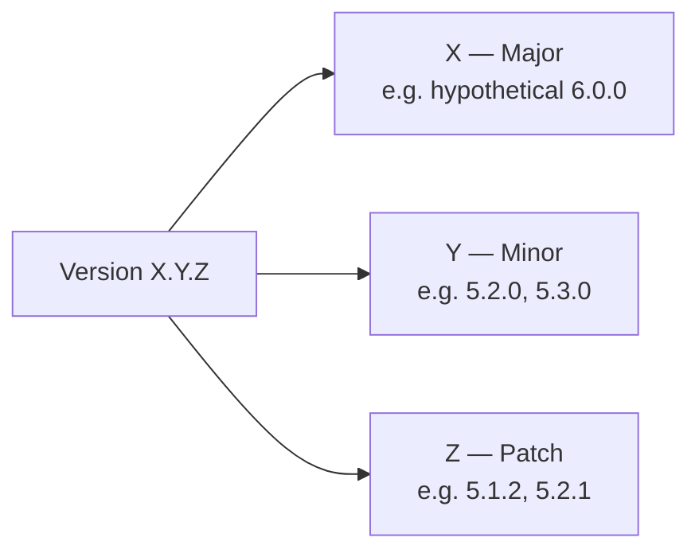

| Change | What it introduces | Data mapping consequences |
|---|---|---|
| **Major** (`X.y.z`) | Major conceptual change — refactoring a large part of the UML model, a different data encoding syntax | **Forward** mapping possible at transition time but *not* on a continuous basis; **backward** mapping limited. This was practically the case between AIXM 4 and 5. |
| **Minor** (`x.Y.z`) | New features, properties and capabilities supporting new/changed operational concepts; aligned where necessary with the **ICAO SARPS update cycle** | Previous-version data can be **fully forward mapped**; full **backward** mapping may be achieved through **extensions**. |
| **Patch** (`x.y.Z`) | Bug fixes, clarified definitions, documentation, minor changes | Data fully **forwards and backwards** mappable between consecutive versions. |

### How a change gets made


A change management process, supported by an **issue tracking and change proposal submission tool**, carries each proposal from a recorded issue through to release.

> [!important] Decisions are consensus, and adoption is silent
> The CCB decides by **consensus**, and adoption is a **silent process** — if no CCB member formally objects, the proposal is considered **accepted**.

---

## Module 4 — Main Components

AIXM 5 has **two main components**, plus a set of supporting ones.

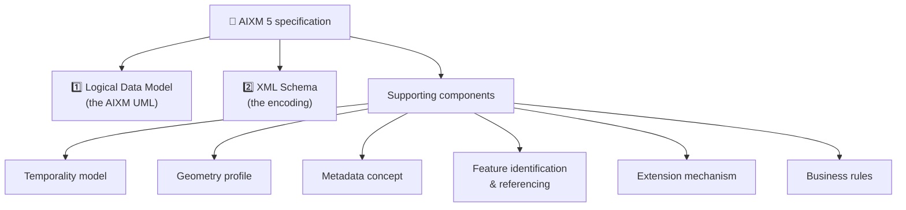

> [!abstract] The Logical Data Model (AIXM UML)
> Describes the **features of the aeronautical domain** and can be used as the **starting point for designing an AIM database**. Its class definitions are derived from ICAO and industry requirements.

The supporting components are:

| Component | Purpose |
|---|---|
| **Temporality model** | how features change over time — baselines, permanent and temporary changes (see [[22 — AIXM Temporality Model\|AIXM Temporality Model]]) |
| **Geometry profile** | the aviation subset of GML geometry |
| **Metadata concept** | data *about* the data — lineage, quality, responsible party |
| **Feature identification & referencing** | UUIDs and `xlink` references between feature instances |
| **Extension mechanism** | how a community of interest adds its own properties |
| **Business rules** | machine-checkable validation rules for various AIXM applications |

Most of these build on the **ISO 19100 series**:

| ISO standard | Used in AIXM 5 for |
|---|---|
| **ISO 19107** — Spatial schema | modelling **location and geometry** — a navaid's position, a guidance line's course, an airspace's lateral limits |
| **ISO 19136** — Geography Markup Language (GML) | **encoding** that location and geometry |
| **ISO 19108** — Temporal schema | the temporality concepts |
| **ISO 19115 / 19139** — Metadata | the metadata concepts |

---

## Module 5 — Implementations & Use Cases

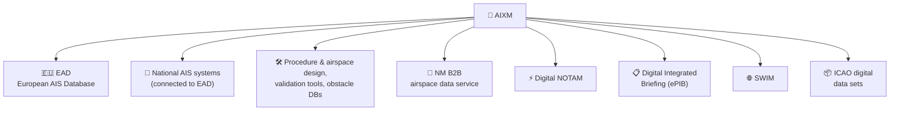

### European AIS Database (EAD)

In Europe, the **reference AIXM implementation** is the **[[25 — EAD|EAD]]**. It currently supports **two AIXM versions in parallel, in different databases**: AIXM 4.5 is handled by EAD's **Static Data Operations (SDO)** system, with AIXM 5.1 data held separately.

### Local AIS systems and other tools

AIS systems similar to EAD but adapted to national requirements have been built by industry and deployed by local AIS organisations worldwide. Many — **all European ones** — are connected, or being connected, to EAD, exchanging data in AIXM format.

AIXM is also used as the exchange format for **procedure and airspace design systems**, **data validation tools**, **obstacle databases** and other aeronautical information applications.

> [!tip] A free side-effect of the GML decision
> Because AIXM 5 is GML-based, AIXM data can be **visualised directly in GIS tools** that understand GML — no bespoke viewer required for basic inspection.

### NM B2B airspace data service

**NM B2B** is the EUROCONTROL **Network Manager** interface for system-to-system access to its services and data, letting users pull information into their own systems for collaborative **ATFCM** (see [[04 — ATFM|ATFM]]).

Its **airspace data service** uses **AIXM 5.1** to expose the most up-to-date, consistent view of NM operational **airspace, route and flight restriction** data — including the **ADR extension** for flexible use of airspace and free route concepts.

### Digital NOTAM

AIXM 5 is the **enabler of the digital NOTAM concept**: digital NOTAMs are encoded as **"events"** in AIXM 5 format. See [[15 — NOTAMs|NOTAMs]] and [[22 — AIXM Temporality Model|AIXM Temporality Model]].

### Digital Integrated Briefing (ePIB)

By **merging static AIXM data with digital NOTAM and MET data**, the pre-flight briefing is radically improved — giving end users far better **filtering and visualisation** than a text bulletin. See [[17 — PIB|PIB]].

### SWIM

As one of the **AIRM-compliant** information exchange models, AIXM is an enabler for **[[26 — SWIM|SWIM]]** — exchange models define the **syntax and semantics** of the data that SWIM applications exchange.

### ICAO digital data sets

AIXM supports encoding of the **ICAO digital data sets** — with the exception of the **terrain** data set. Detailed specifications and guidelines for encoding and distributing them (AIP, Obstacle, Instrument Flight Procedures data sets) are developed by a dedicated **EUROCONTROL focus group with international participation**.

> [!note] Terrain is the exception
> Terrain data is exchanged in other formats entirely — **GeoTIFF** being one example.

### Regulatory context

At global level, **ICAO Annex 15**, **PANS-AIM** and the **AIS Manual** define the requirements and guidelines for a globally interoperable aeronautical information exchange model — pointing towards AIXM.

---

## Module 6 — Resources

All AIXM artefacts are published **freely on the web under an open source licence**, enabling both open and proprietary implementations. There are four main entry points:

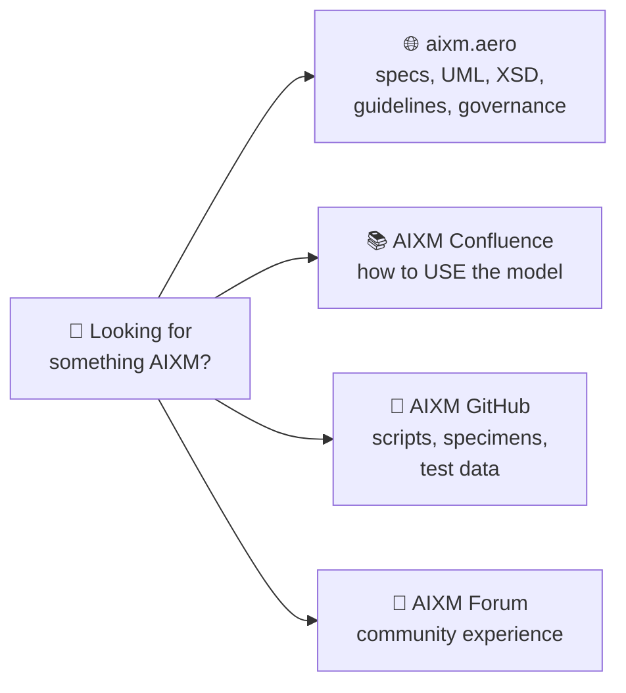

### The AIXM website — [aixm.aero](https://aixm.aero)

The main entry point. It holds documentation for **all active AIXM versions**, including their data model (UML for recent versions) and **XML schemas**, all downloadable.

Its **data coding guidelines** page carries supporting documents — several developed by the **OGC Aviation Domain Working Group**:

- AIXM Temporality Concept
- AIXM Feature Identification and Reference
- Guidance and Profile of GML for use with Aviation Data *(OGC)*
- Requirements for Aviation Metadata *(OGC)*
- Guidance on Aviation Metadata *(OGC)*
- Web Feature Service (WFS) Temporality Extension *(OGC)*
- Digital NOTAM Specification

**Mapping documents** are also available:

- AIP → AIXM mapping
- Airport mapping requirements (per EUROCAE/RTCA **ED-99A / DO-272A**)
- AIXM 4.5 → AIXM 5.1 mapping

The **governance** page carries CCB information including the **CCB Charter**. The **Usage and Implementation** section holds the **AIXM business rules**, expressed using the OMG standard **SBVR** (Semantics of Business Vocabulary and Business Rules). The site also lists commercial products, services and training.

### AIXM Confluence — <http://aixm.aero/confluence>

An online collaboration and knowledge base (Atlassian Confluence) whose purpose is to **explain how to use the model** and let the community collaboratively develop implementation guidance. It is organised into three high-level areas:

| Area | Contents |
|---|---|
| **AIXM concepts** | overview of the AIXM UML model, the UML conventions applied, and how the XML schema is generated |
| **AIXM applications** | coding specifications and guidelines for ICAO digital data sets (e.g. AIP data set), digital NOTAM, common coding rules; plus documentation of **extensions** and how to develop one |
| **AIXM data sources** | a place to list available AIXM data sources **by country** |

Pages are organised into **spaces**; the **space directory** lists every space available to you (ICAO AIP Data Set, ICAO Obstacle Data Set, AIXM Concepts, Extensions, Data Sources…).

> [!note] Expect work in progress
> Some spaces sit outside the three high-level areas because they hold **work in progress** — e.g. work-area spaces listing AIXM 5.2 changes, or EAD-specific topics. The Confluence content grows and updates constantly.

### AIXM GitHub — <https://github.com/aixm>

Versioned documents and software artefacts, including:

- scripts to convert the **AIXM UML → AIXM XSD**
- **DONLON** specimen data in AIXM format — AIP data sets, Obstacle data sets, Digital NOTAM examples, temporality examples
- mapping scripts and test files for **AIXM 5.1 → 5.2** conversion
- XSLTs for converting AIXM to CSV
- the **AIXM GML profile**
- a **test data generator**

Everything is downloadable; **contributing** requires a login, which must be requested.

### AIXM Forum

Hosted by EUROCONTROL, open to anyone interested in AIXM. **Read access is open; contributing requires registration.**

> [!tip] The forum archive is underrated
> Discussion archives often contain hints for **using AIXM in specific situations** that the official documentation on the website doesn't cover.

### Other relevant documents

| Document | Why it matters |
|---|---|
| **EUROCONTROL — Guidelines for the provision of Metadata to support the exchange of aeronautical data** | guidance on ICAO SARPS and European regulatory requirements for harmonised **metadata** exchange between data originators and AIS providers |
| **EUROCONTROL — Terrain and Obstacle Data Manual** | for bodies originating, processing and providing electronic terrain and obstacle data, through to State publication per Annex 15; includes **DONLON obstacle data set specimens** in AIXM and a tool converting AIXM obstacle data to spreadsheets |

---

## Module 7 — Introduction to the AIXM 5 UML

### Objectives

- Identify the aeronautical information subjects covered by AIXM 5
- Describe how the key aeronautical features are represented in the AIXM UML
- Locate relevant information about a key aeronautical feature in the AIXM UML model

### The structure of the AIXM UML

The AIXM 5.1 / 5.1.1 UML model is organised into **packages**, serving two purposes:

1. **Human understanding** — grouping classes for one area of interest (runways, navigation aids…) into a tree structure
2. **XSD generation** — separating the **data types** from the **features/objects** and from the **application messages**

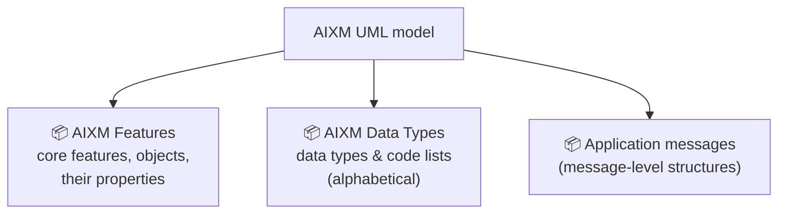

> [!abstract] Features vs objects — the two stereotypes that matter
> - **`«feature»`** — describes a **real-world entity**, and is fundamental in AIXM: `Navaid`, `Runway`, `Airspace`.
> - **`«object»`** — an abstraction of a real-world entity or, more often, of a **property** of one, which **cannot exist outside a feature**: the surface characteristics of a `Runway`, the activation properties of an `Airspace`.

### The AIXM Features package

In terms of features, AIXM 5 is divided into **12 conceptual areas** and **3 common components**.

Each package holds one or more **UML class diagrams** drawn to show the classes relevant to that conceptual area — typically the features and objects in the package, *plus* related classes from other packages where relevant.

> [!important] Conceptual areas overlap by design
> A strict separation is impossible, because aeronautical features have **many associations**. An obstacle can be an obstruction in an instrument procedure design, the building hosting the aerodrome tower, *and* the glide path navaid antenna. Expect to meet a package's features on **other packages'** diagrams.

### The AIXM Data Types package

Holds all AIXM **data types and code lists** used by the attributes of features and objects, sorted **alphabetically**.

### Navigating the model

| Version | Modelling tool used | Original model files |
|---|---|---|
| **AIXM 5.1** | Rational Rose | on aixm.aero, in the **Versions** area |
| **AIXM 5.1.1** | Sparx Enterprise Architect | on aixm.aero, in the **Versions** area |

For **both** versions a dedicated **UML Navigator** is provided — an HTML-based online tool for browsing the AIXM UML, reachable from the AIXM website.

> [!note] Same model, different look
> Because the 5.1 and 5.1.1 class diagrams were drawn in different tools, the Navigators **look and feel slightly different** — but **scope and structure are identical**, and so is the functionality.

---

## Module 8 — Airport Model

> [!abstract] What this conceptual area covers
> Airports and heliports, their **movement areas** (runways, TLOFs, taxiways, aprons) and the properties of those areas — including **surface lighting and markings** — plus **usage conditions**, **runway declared distances**, **surface contamination** and more. See [[07 — Aerodromes|Aerodromes]].

### Basic airport/heliport characteristics

The main class is **`AirportHeliport`**, carrying the basics such as name and designator.

> [!tip] Three ways to designate an aerodrome
> The **`designator`** may be the same as the **ICAO location indicator** (if any) or the **IATA code** (if any). If the airport/heliport has neither, a **local** designator such as `ED001` may be coded.

An `AirportHeliport` may **serve one or more Cities**, among its other relationships.

### Runway and runway direction

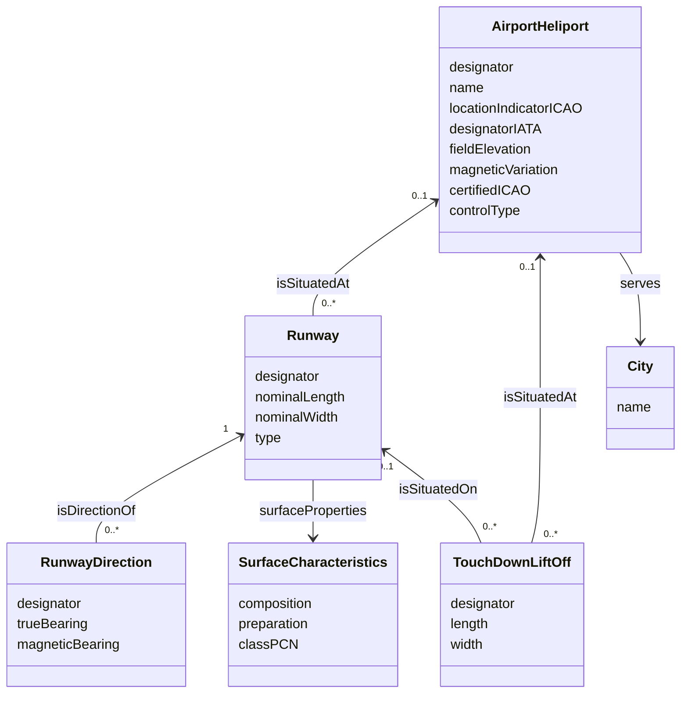

> [!important] Read the multiplicity carefully
> An airport may have **several physical runways** associated with it — but a `Runway` is situated at a **maximum of one** `AirportHeliport`.

The runway's surface is described by the attributes of the **`SurfaceCharacteristics`** class — including the **predominant material** the movement area surface is composed of (asphalt, grass, gravel…), along with its preparation and strength.

### TLOF

**`TouchDownLiftOff`** defines a **load-bearing area** on which a helicopter may touch down or lift off. It is identified by its `designator` — e.g. `HELIPAD-A`, `HELIPAD-B`, `TLOF1`, `TLOF2`.

> [!note] Where a TLOF sits
> A TLOF may be situated **on a short Runway of type `FATO`**, or **directly at an `AirportHeliport`**. In the FATO case it may either form an **integral part** of the FATO or sit **apart** from it.

### Aerodrome Mapping Database (AMDB)

**Aerodrome Mapping Data (AMD)** is collected to improve **situational awareness**, **surface navigation operations**, **training**, **charting** and **planning**. It is organised into an **Aerodrome Mapping Database (AMDB)** for electronic storage and use by applications.

> [!abstract] Why AMDB exists
> AMDB is the **industry standard** for the data used to create and display an **Airport Moving Map (AMM)** on an **Electronic Flight Bag (EFB)** device.

Its content is defined in **RTCA DO-272 / EUROCAE ED-99**, *"User requirement for Aerodrome Mapping Information"*. **ICAO Annex 15 and PANS-AIM** define an aerodrome mapping data set and refer to these AMDB specifications — and the AIXM 5 model covers the requirements for encoding it.

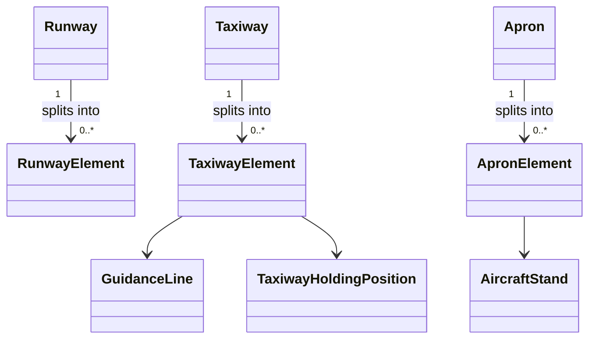

> [!tip] The "Element" pattern
> `RunwayElement`, `TaxiwayElement` and `ApronElement` exist to **split** the corresponding feature into smaller **functional geometrical elements** as needed — the granularity a moving map requires. Alongside them, `AircraftStand`, `GuidanceLine` and `TaxiwayHoldingPosition` pin down where an aircraft actually is.

---

## Module 9 — Navaid & Point Model

> [!abstract] The key mental shift
> In AIXM 5, **navaids and landing aids are modelled as *services* for navigation provided to pilots** — not merely as boxes of equipment. Navaids and points live in the **same package** because some navaids also serve as **significant points** in routes and instrument procedures. With the spread of **area navigation (RNAV)**, that significant-point role is steadily **decreasing**. See [[08 — NAVAIDs|NAVAIDs]] and [[09 — Waypoints|Waypoints]].

### Navaid and navaid equipment

The **`Navaid`** *service* is provided by **one or more `NavaidEquipment`**.

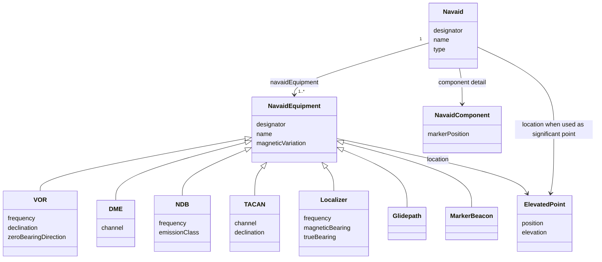

The `type` attribute of `Navaid` is **logically related** to the individual `NavaidEquipment`(s) associated with it. The relationship between equipment can be further described using the **`NavaidComponent`** class — for example the position of the **marker beacon** part of an ILS: **outer**, **middle** or **inner**.

### Basic elements

`Navaid` carries the attributes relevant to the **service** — designator, name. `NavaidEquipment` may *also* have a designator and name, which in most cases are **the same**.

> [!example] VOR/DME "BUB / Brussels"
> The `Navaid` designator is `BUB`, name *Brussels*. The `VOR` and the `DME` equipment classes carry **the same values** for their own `designator` and `name` attributes.

| Angular property | Where it lives |
|---|---|
| **`magneticVariation`** | may be defined for **each** `NavaidEquipment` |
| **`declination`** (station declination) | **VOR** and **TACAN** — instead of, or in addition to, magnetic variation |
| **`magneticBearing` / `trueBearing`** | only **particular** equipment — e.g. the measured angle between the **localizer beam** and Magnetic/True North at the localizer antenna |

> [!note] Variation vs declination
> Both express the angular difference between **True North** and **Magnetic North** — magnetic variation **at the position of the facility**, station declination **at its calibration**.

### Navaid position

Each `NavaidEquipment` has a location defined by **`ElevatedPoint`**; where an elevation matters (e.g. **DME**), the `elevation` attribute is used.

Equipment locations of one `Navaid` **may or may not coincide**:

- **Same position** — a collocated VOR and DME, or an NDB collocated with a marker
- **Different positions** — a VOR/DME where the DME is offset, or an **ILS** whose localiser, glidepath and markers all sit at different places

> [!important] The Navaid has its own location too
> `Navaid` itself may carry a location — the one used **when the Navaid acts as a significant point**. It is usually the position of *one* of its equipment items; for a VOR/DME, generally the **VOR**.

### Terminal navaids, landing aids, availability and ownership

| Relationship | Meaning |
|---|---|
| `Navaid` → `AirportHeliport` | the navaid serves as a **homing facility** for that aerodrome |
| `Navaid` → `RunwayDirection` | the navaid is a **landing system** (ILS, MLS) serving that runway direction |
| `Navaid` → `NavaidOperationalStatus` → `Timesheet` | **hours of operation**; can also be coded **per equipment** where physical components have different availability |
| `NavaidEquipment` → `OrganisationAuthority` | the organisation **responsible** for the equipment |

### Designated Point

> [!abstract] Definition
> A **`DesignatedPoint`** is a **navigable point not located at the position of conventional navaid equipment** — this includes **fixes** and **waypoints**.

Besides navaids, **en-route waypoints** are used as start/end points of route segments. AIXM 5 encodes both **en-route** and **terminal** points (the latter used in defining terminal procedures) via these relationships:

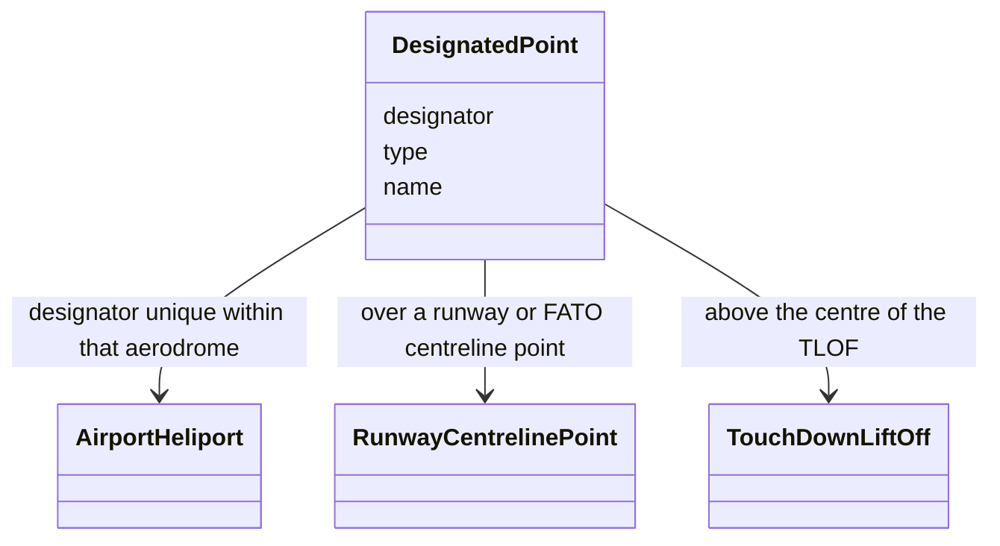

| Relationship | What it means |
|---|---|
| **`AirportHeliport`** | the designated point's designator is **unique among all designated points associated with that same aerodrome/heliport**; typically used for **RNAV procedures** there |
| **`RunwayCentrelinePoint`** | the point is over a runway/FATO centreline point — e.g. the **threshold** — usable in composing an approach or departure segment |
| **`TouchDownLiftOff`** | the point is located **above the centre of the TLOF** |

### Significant Point

> [!quote] ICAO Annex 11 — Significant point
> A specified geographical location used in defining an ATS route or the flight path of an aircraft and for other navigation and ATS purposes.

In AIXM, **`SignificantPoint`** is a **`«choice»`** class — exactly one of:

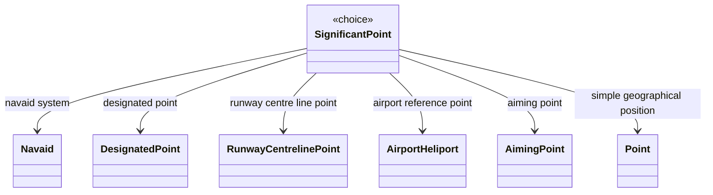

---

## Module 10 — Route Model

> [!abstract] What this area covers
> **Routes** describe both **RNAV** and **conventional** navigation routes. Each route has a **designator** and is made of one or more **route segments** with a start and end point — which may be a **Navaid** or a **DesignatedPoint**.

A **`RouteSegment`** describes what applies **between consecutive route points**: applicable **flight levels**, **track length**, **track direction** and **flight rules**. The model also has a **`RoutePortion`** concept for describing restrictions and services over **subsections** of a route.

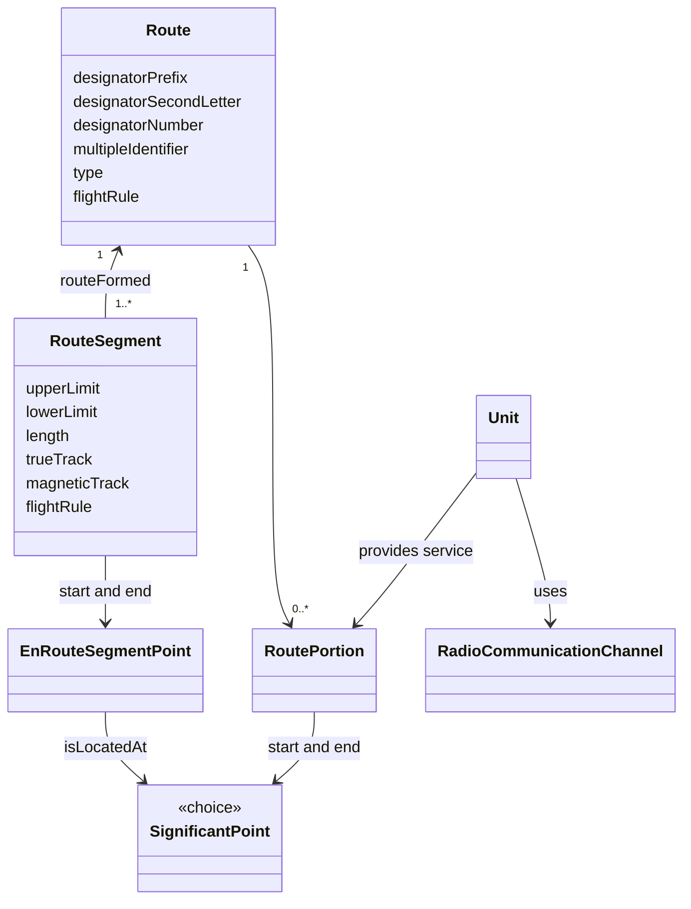

> [!important] Segments chain end-to-start
> Each `RouteSegment` **starts at** and **ends at** an `EnRouteSegmentPoint` — and the **start point of the following segment is the end point of the previous one**. That's what makes a route a continuous chain rather than a bag of independent legs.

### Route portion

> [!abstract] Definition
> A **route portion** is a group of **two or more consecutive segments of the same route** sharing the **same ATC service** and/or the **same flight restrictions**. Its start and end are defined by **significant points**.

A **controlling `Unit`** may provide an **`InformationService`** or an **`AirTrafficControlService`** on a `RoutePortion`, using one or more **`RadioCommunicationChannel`** (see [[03 — ATC|ATC]]).

---

## Module 11 — Airspace Model

> [!abstract] What this area covers
> A **generic** model for airspaces representing ICAO **regions, areas, zones, sectors** and other partitions. It models the **geometry** of structures such as [[10 — FIR|FIRs]], UIRs, [[11 — TMA|TMAs]] and restricted areas, plus **usage data** — airspace **class**, **activation times**, **services provided** and more. See [[12 — ICAO Airspace Classification|ICAO Airspace Classification]].

### Basic airspace elements

The main class is **`Airspace`**, carrying the basic data. It is used both for **ATS airspaces** and for so-called **Special Activity Airspaces**.

### Airspace geometry

The geographical and geometrical extent of an airspace is modelled with **`AirspaceVolume`**. There are **two ways** to describe each volume's geometry in AIXM 5:

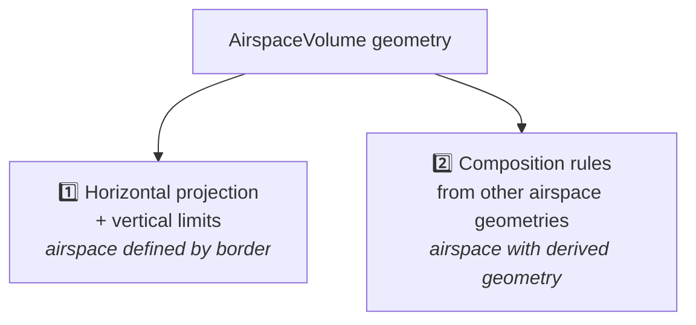

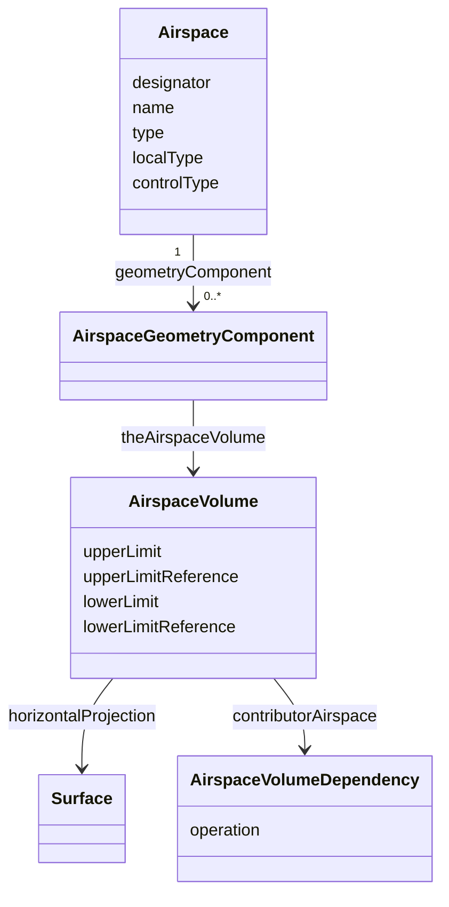

#### Option 1 — horizontal projection with vertical limits

The airspace is defined by its **horizontal boundaries**: `AirspaceVolume` has a related **`Surface`** geometry coded in **GML**, plus vertical limits.

A vertex of the lateral limits may be described in several ways, all coded with the corresponding GML elements:

| Boundary type | Example |
|---|---|
| **Geodesic line** between points | P7 → P1 |
| **Reference to a state boundary** | P1 → P2 |
| **Arc by centre point** | P3 → P4, using the VOR/DME `FDM` as the centre |

> [!tip] This is exactly the GML from IM-AIXM-1
> The surface, its `gml:GeodesicString` segments and `gml:ArcByCenterPoint` arcs are the same constructs walked through in [[IM-AIXM-1]] — an airspace boundary is just the most demanding real-world use of them.

#### Option 2 — derived geometry

The geometry of a **"child"** airspace is created by **combining the geometry of component "parent"** airspaces. Three **operations** are available — **union**, **intersection** and **subtraction** — and **combinations of operations are allowed**.

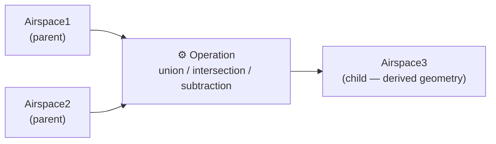

> [!important] How the construction is controlled
> The **`AirspaceGeometryComponent`** **association class** controls the construction operations.
>
> - The **first** airspace used in a construction **always** gets the operation code **`BASE`**.
> - **Sequence numbers** define the **order** in which the operations are applied.

#### Copying vs. referencing

There are **two methods** to define one airspace's geometry from another's — and combinations of both are possible for a single airspace:

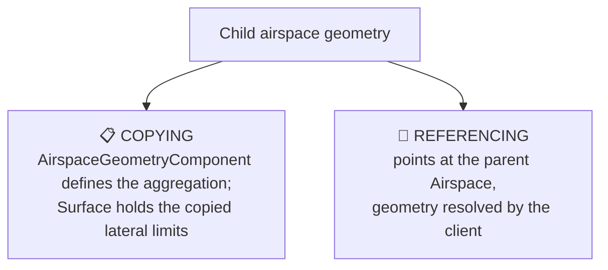

| | **Copying** | **Referencing** |
|---|---|---|
| **Appropriate for** | applications needing **fully digested** geometry for direct consumption — graphical visualisation, spatial calculations | data provision between **synchronised databases**, e.g. a local and a regional database |
| **Advantage** | provides **complete** geometrical data for the aggregated airspace; the client needs **no further calculation** | **preserves a true association** with the composing airspace |
| **Disadvantage** | the source geometry **may change over time** — future changes to the parent must be **propagated** into the aggregated airspace's `AirspaceVolume` | the client must **retrieve** the referenced airspace and perform the **geo-spatial calculations** itself to obtain usable GML geometry |

### Airspace classification

The **class** of an airspace is encoded using the **`AirspaceLayerClass`** object — and it may be defined either for the **whole airspace** or **per vertical layer** (an airspace whose classification changes with altitude). See [[12 — ICAO Airspace Classification|ICAO Airspace Classification]].

### Service provided within an airspace

Within an airspace, a **`Service`** (air traffic control and others) may be provided by a **`Unit`** using one or more **`RadioCommunicationChannel`** — i.e. on a radio frequency. Both the airspace **and** the ATS unit's service may operate under **schedules**.

### Airspace activation

> [!abstract] `AirspaceActivation`
> For **special activity airspaces** — Danger Areas and similar — this class carries additional information about the **type of restriction** or **nature of the hazard**, the **activation process**, and/or the **time of activity**.

> [!tip] Not only for special activity airspace
> `AirspaceActivation` also serves ordinary **ATS airspace** whose availability varies — e.g. a **CTR active only on certain days of the week**.

---

## Module 12 — Organisation, Unit & Service Model

> [!abstract] What this area covers
> The **authorities and units** providing air traffic, airport and other services — see [[02 — ANSP|ANSP]], [[03 — ATC|ATC]] and [[06 — Stakeholders|Stakeholders]].

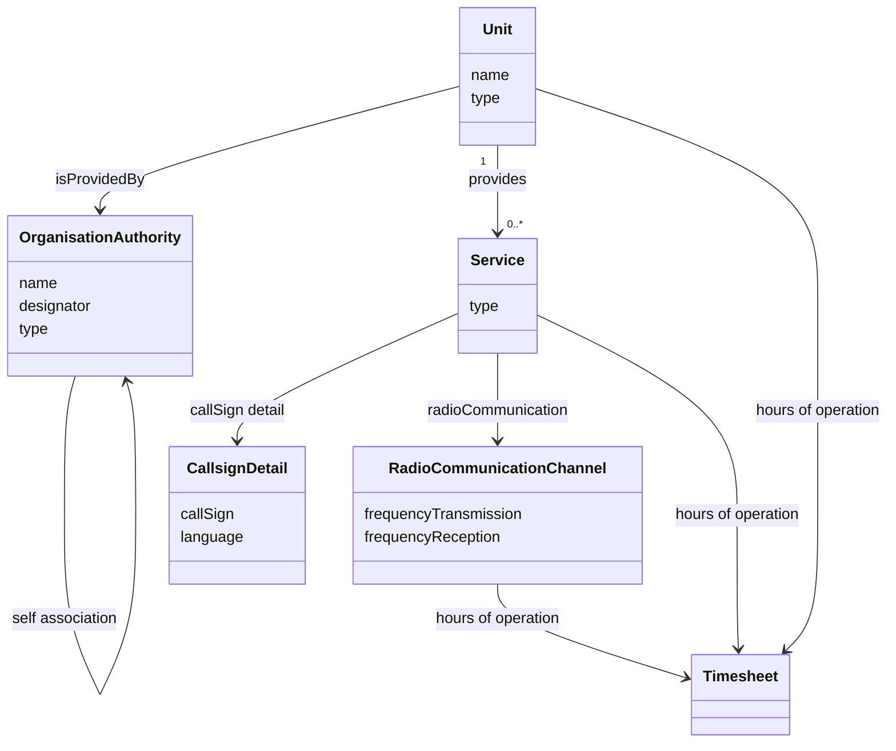

### Organisation

**`OrganisationAuthority`** codes a wide range of entities: **ATS organisations**, **aircraft operating agencies**, **States**, **groups of States**, **companies**, **government entities**. It also has a **self-association** — see the CAA-under-Ministry example in [[IM-AIXM-1]].

### Unit

> [!abstract] Definition
> A **`Unit`** is an **entity providing aeronautical related services**. Its basic attributes give its **name** and **type** — e.g. **Area Control Centre (ACC)** or **Aeronautical Information Services (AIS) office**.

### Service

A `Unit` may provide **one or more `Service`s** — the provision of tangible goods, **information**, **instructions** or **guidance** to pilots, flights, aircraft operators, and other personnel and institutions concerned with flight operations.

**Call sign and frequency.** A `Service` may be identified by one or more **`CallsignDetail`**, defined by a **`callSign`** and the **language** the service is provided in. The frequency itself lives on **`RadioCommunicationChannel`**.

**Hours of operation.** AIXM 5 lets hours be coded at **three** levels — for the **`Unit`** providing the service, for the **`Service`** itself, and for the **`RadioCommunicationChannel`** it is provided on. All the detail sits in the **`Timesheet`** class (see [[#Module 15 — Shared Components|Module 15]]).

> [!note] Which level should you actually code?
> The **data provider's needs** decide. PANS-AIM requires the **hours of the provided service** to be made available — but in practice the **opening hours of the unit**, or even **when a particular frequency is operative**, may be the more relevant thing to publish.

### Types of service

The abstract **`Service`** feature specialises into five:

```mermaid
classDiagram
    class Service {
        type
    }
    class TrafficSeparationService
    class InformationService
    class SearchRescueService
    class AirTrafficManagementService
    class AirportGroundService
    class AirTrafficControlService
    Service <|-- TrafficSeparationService
    Service <|-- InformationService
    Service <|-- SearchRescueService
    Service <|-- AirTrafficManagementService
    Service <|-- AirportGroundService
    TrafficSeparationService <|-- AirTrafficControlService
```

For most services the **`type`** attribute says what the service actually *is* — *Approach area control service*, *Aerodrome control tower service*, *En-route area control service*, and so on.

### Clients of a service

Which "clients" may use a service depends on the specialisation:

| Service | May be provided for / control |
|---|---|
| **`AirTrafficControlService`** | `clientHolding`, `clientRoute`, `clientProcedure`, `clientAirspace` — or control the airspace of a `clientAirport` |
| **`AirportGroundService`** | provided **at** an `AirportHeliport` |

---

## Module 13 — Obstacle Model

> [!quote] ICAO definition — Obstacle
> All fixed (whether temporary or permanent) and mobile objects, or parts thereof, that:
> - are located on an area intended for the surface movement of aircraft; or
> - extend above a defined surface intended to protect aircraft in flight; or
> - stand outside those defined surfaces and that have been assessed as being a hazard to air navigation.

The AIXM 5 obstacle model accommodates both the **ICAO requirements** and the **data requirements of industry user groups**, as reflected in the real data States publish. It allows **point, line and polygon** obstacles, and the **ICAO Annex 15 obstacle areas** and other obstacle collection surfaces have been added.

### The vertical structure model

> [!abstract] `VerticalStructure`
> "All fixed (whether temporary or permanent) and mobile objects, or parts thereof that extend above the surface of the Earth."

> [!important] Not every vertical structure is an obstacle
> The class covers obstacles **and** buildings and other raised structures relevant to aircraft operations. **Airport terminals and facilities are modelled as vertical structures** even though they are **not obstacles** — because they don't intersect any obstacle identification surface.

```mermaid
classDiagram
    class VerticalStructure {
        name
        type
        group
        overall dimensions
    }
    class VerticalStructurePart {
        designator
        type
        constructionStatus
        mobile
        verticalExtent
        markingPattern
    }
    class VerticalStructurePartGeometry
    class Point
    class Curve
    class Surface
    class PropertiesWithSchedule
    class Timesheet
    class ObstacleArea {
        type
    }
    VerticalStructure "1" --> "1..*" VerticalStructurePart : isMadeOf
    VerticalStructurePart --> VerticalStructurePartGeometry : isRepresentedAs
    VerticalStructurePartGeometry --> Point
    VerticalStructurePartGeometry --> Curve
    VerticalStructurePartGeometry --> Surface
    PropertiesWithSchedule <|-- VerticalStructurePart
    PropertiesWithSchedule --> Timesheet
    ObstacleArea --> VerticalStructure : collects
    ObstacleArea --> Surface : hasExtent
```

### Basic properties

`VerticalStructure` carries the overall attributes and associations for the obstacle: **name** (the name it is publicly known by, which may also identify it), **type**, a **group indicator**, and **overall dimensions**.

### Vertical structure part

The physical detail is modelled through the **`isMadeOf`** association to **`VerticalStructurePart`** — which is what makes it possible to code **complex obstacles made of several parts**: buildings, power lines, and so on.

| Attribute | Purpose |
|---|---|
| **`designator`** | official identification of the obstacle or part, allocated through **national obstacle catalogues** |
| **`type`** | a **distinct** type for the part, which may differ from the parent's type |
| **`constructionStatus`** | still under construction, scheduled for demolition, etc. |
| **mobile indication** | the part is **not fixed** — it can change shape and/or position (e.g. a crane with moving parts) |
| **marking attributes** | further detail of the obstacle part's **visual marking** |

> [!example] One structure, three part types
> A whole structure may be type **`CABLE_CAR`**, while its ground and top stations are coded as **`BUILDING`** and the cable between them as **`CATENARY`**.

> [!warning] Version difference worth knowing
> In **AIXM 5.1**, `designator` exists **only on `VerticalStructurePart`**, and `name` **only on `VerticalStructure`** (where it doubles as a kind of obstacle identifier).
> **AIXM 5.2** provides `name`, `identifier` and `region` on **both** levels.

### Geometry

The actual horizontal and vertical extent is modelled via **`isRepresentedAs`** → **`VerticalStructurePartGeometry`**, allowing a **Point**, **Curve** (line) or **Surface** (polygon) geometry.

> [!important] What that geometry actually represents
> It is the **projection of the part's geometry onto a horizontal plane located at the top of the obstacle part** — not a ground footprint. The **`verticalExtent`** attribute is the **height of the obstacle or part sitting on the ground**.

### Temporal obstacles

`VerticalStructurePart` has a specialisation association with **`PropertiesWithSchedule`**, so a part may carry a **timetable** expressed by one or more **`Timesheet`**.

> [!tip] Why a crane needs a schedule
> For mobile obstacles — or obstacles with a mobile part such as cranes and bridges — the timesheet indicates **when that part actually exists in that form and at that location**, with the properties detailed by the `VerticalStructurePart`.

### Vertical structure as host

Some aeronautical features — **navaids, control towers, antennas** — can themselves be seen as obstacles, or as being **hosted by** a vertical structure. AIXM 5.1(.1) defines **"hosting" associations** between `VerticalStructure` and those features.

### Obstacle areas

> [!abstract] When a structure becomes an obstacle
> A `VerticalStructure` **becomes an obstacle** if it satisfies the **obstacle data collection criteria for a given area**. **`ObstacleArea`** is the main class here, with a **`type`** attribute identifying the area — the ICAO Annex 15 areas **AREA 1, AREA 2, AREA 3, AREA 4**, plus other obstacle collection surfaces.

The horizontal projection of an `ObstacleArea` is modelled through **`hasExtent`** → **`Surface`**. The **`ObstacleAreaOrigin`** class relates an `ObstacleArea` to the features it originates from.

> [!note] AIXM 5.2 addition
> 5.2 adds an association between **`ObstacleArea`** and the **`Runway`** feature — needed for e.g. **AREA 2a**.

---

## Module 14 — Procedure Model

> [!abstract] Definition
> A **flight procedure** is a series of **predetermined flight manoeuvres with specified protection from obstacles**. Linked to an airport or heliport, it is called a **terminal procedure**.

The AIXM 5 terminal procedure model covers **SIDs**, **STARs** and **IAPs**. AIXM 5.1 already covered both **conventional and RNAV** procedures; **AIXM 5.2** is better aligned with the ICAO **PBN** concept and supports coding **GNSS** data.

Its components cover **procedures, segment legs, minima, circling, protection areas and design assessment surfaces** — supporting the coding of **State-published procedure data** and, to some extent, **procedure design data**, based on both ICAO **PANS-OPS** and FAA **TERPS**.

### Procedure overview

```mermaid
classDiagram
    class Procedure {
        name
        instruction
    }
    class StandardInstrumentDeparture {
        designator
    }
    class StandardInstrumentArrival {
        designator
    }
    class InstrumentApproachProcedure {
        approachType
    }
    Procedure <|-- StandardInstrumentDeparture
    Procedure <|-- StandardInstrumentArrival
    Procedure <|-- InstrumentApproachProcedure
```

**Identification** works differently per type:

| Type | How it's identified |
|---|---|
| **IAP** | mainly by the **`name`** attribute of `Procedure`, since IAPs have **no coded identifier**. An approach is identified by its **type** (ILS, VOR, RNP) plus its **relationship to the runway direction**, which makes it unique at an airport — and the name is composed the same way (e.g. an ILS approach for RWY **27R** at DONLON). |
| **SID / STAR** | the **`designator`** attribute, defined in the respective **specialised** class, holds the **coded identifier** — e.g. `KODAP1A` — composed per **ICAO Annex 11** rules. **`name`** carries the plain-language designator, e.g. *"KODAP ONE ALPHA ARRIVAL"*. |

### Relationships to aerodromes and landing areas

```mermaid
classDiagram
    class Procedure
    class AirportHeliport
    class LandingTakeoffAreaCollection
    class RunwayDirection
    class TouchDownLiftOff
    Procedure "0..*" --> "1..*" AirportHeliport : generally one, STARs may serve several
    Procedure --> LandingTakeoffAreaCollection : one or many
    LandingTakeoffAreaCollection <|-- RunwayDirection
    LandingTakeoffAreaCollection <|-- TouchDownLiftOff
```

> [!important] IAP vs SID/STAR multiplicity
> An **IAP** relates to **only one** runway direction, FATO or TLOF. A **SID or STAR** may relate to **several** runway directions — even of **different runways** (e.g. STARs `DNS2B`, `KODAP1A` used for both 09L and 27R).

### Other common Procedure relationships

| Related class | What it adds |
|---|---|
| **`AircraftCharacteristic`** | the procedure is designed **only for aircraft with specific characteristics** — fixed wing or helicopter, landing category (`A`, `B`, …), navigation capability such as *RNP approach capability* |
| **`ProcedureAvailability`** | codes **temporary situations** where the procedure is **not available** |
| **`SafeAltitudeArea`** | mainly a **Minimum Sector Altitude (MSA)** — obstacle clearance within a sector of a **25 NM (46 km)** circle centred on a navaid or waypoint |
| **`TerminalArrivalArea`** | for **PBN** IAPs, a **TAA** may replace the MSA — also **1000 ft** minimum clearance above all objects within an arc of a 25 NM circle |
| **`GuidanceService`** *(choice)* | identifies the main **ground-based navaid** (VOR, ILS), a **special navigation system**, or the **radar service** used while flying the procedure |

> [!abstract] The TAA in detail
> **`arrivalAreaType`** says whether the area is the **straight-in**, **right base** or **left base** portion. Vertical and horizontal limits come from the **`CircleSector`** class. The TAA areas are associated with the procedure's **initial approach fixes (IAF)** and/or **intermediate fix (IF)** — modelled via the **`DesignatedPoint`** class.

> [!note] AIXM 5.2 adds GNSS to the guidance choice
> Including both **primary** systems (GPS, GLONASS, Galileo) and **augmentation** systems (GBAS, SBAS).

The **`instruction`** attribute of `Procedure` holds a **textual description** — free text, or following a formalised description concept.

### Procedure leg

The trajectory an aircraft flies is defined with **segment legs**; a terminal procedure may be composed of one or more.

```mermaid
classDiagram
    class SegmentLeg {
        course
        courseType
        upperLimitAltitude
        lowerLimitAltitude
        verticalAngle
        legTypeARINC
        legPath
    }
    class DepartureLeg
    class ArrivalLeg
    class ApproachLeg
    class ArrivalFeederLeg
    class InitialLeg
    class IntermediateLeg
    class FinalLeg
    class MissedApproachLeg
    SegmentLeg <|-- DepartureLeg
    SegmentLeg <|-- ArrivalLeg
    SegmentLeg <|-- ApproachLeg
    ApproachLeg <|-- ArrivalFeederLeg
    ApproachLeg <|-- InitialLeg
    ApproachLeg <|-- IntermediateLeg
    ApproachLeg <|-- FinalLeg
    ApproachLeg <|-- MissedApproachLeg
```

| Leg class | Used by |
|---|---|
| **`DepartureLeg`** | the **SID** |
| **`ArrivalLeg`** | the **STAR** |
| **`ApproachLeg`** | the **IAP** — further specialised because approach design divides the procedure into specific segments |

> [!example] Minima hang off the final leg
> **`FinalLeg`** relates to **`ApproachCondition`**, which associates with **`Minima`** — used to code **OCA/OCH** values and their conditions: aircraft category, visibility requirements, type of final guidance. Certain IAPs also require a **final approach segment (FAS) data block**.

#### Two ways to code the trajectory

| Option | Attribute | Values / meaning |
|---|---|---|
| **1 — ARINC 424 leg types** | **`legTypeARINC`** | ARINC 424 **"path and terminator"** codes — `TF`, `RF`, `CA`… |
| **2 — Simple path indicator** | **`legPath`** | a general, **non-standardised** description — `STRAIGHT`, `ARC`, `BASETURN` |

> [!abstract] Reading a path-and-terminator code
> The concept transforms terminal procedures into **coded flight paths a computer-based navigation system can interpret**. In **`TF`**, the **`T`** is the type of flight path to fly (a **track**) and the **`F`** says the segment **terminates at a fix**. Its usage is described in the **ARINC 424** specification, and for RNAV procedures also in **ICAO PANS-OPS**.

Each `SegmentLeg` may also carry an associated **`Curve`** object — a **"ready to use" GML graphical representation** of the leg, for **charting** purposes.

#### Segment points

```mermaid
classDiagram
    class SegmentLeg
    class TerminalSegmentPoint {
        role
    }
    class SegmentPoint {
        reportingATC
        flyOver
        waypoint
    }
    class SignificantPoint {
        <<choice>>
    }
    class PointReference
    class AngleIndication
    class DistanceIndication
    SegmentLeg --> TerminalSegmentPoint : beginsAt
    SegmentLeg --> TerminalSegmentPoint : terminatesAt
    SegmentLeg --> TerminalSegmentPoint : has arcCentre
    SegmentPoint <|-- TerminalSegmentPoint
    SegmentPoint --> SignificantPoint : isLocatedAt
    TerminalSegmentPoint --> PointReference : fix information
    PointReference --> AngleIndication
    PointReference --> DistanceIndication
```

Each segment leg may have a **starting point** (`beginsAt`), an **end point** (`terminatesAt`) and, for certain leg types, an **arc centre** (`has arcCentre`) — all `TerminalSegmentPoint`.

- **`role`** flags special significance: **IAF**, **FAF**, **MAPT**…
- The actual location is a **`SignificantPoint`**, via **`isLocatedAt`** inherited from the abstract **`SegmentPoint`** — which also supplies **`reportingATC`** (`COMPULSORY`, `ON_REQUEST`…), **`flyOver`** and **`waypoint`** (`YES`/`NO`).

> [!example] Reading a real approach
> A **`RunwayCentrelinePoint`** (`RW27L`) serves as the segment point with role **`MAPT`**; a **`DesignatedPoint`** (`DD601`) is coded as **`FAF`**. `RW27L`'s chart symbol also marks it as a **fly-over** waypoint.

**Fix information.** Where a start/end point has associated "fix" data, it is modelled through **`PointReference`**, which may refer to one or more **`AngleIndication`** and/or **`DistanceIndication`**, using `SignificantPoint` to name the navigation aid the fix is based on.

> [!example] A leg defined by a radial and a distance
> A leg starts at terminal segment point **`KAV`** (a navaid) and ends at a point reference defined as **13.2 km** from `KAV` with an **angle indication of 147°** from `KAV`.

### Procedure transition

The model supports **two ways** of associating procedures and legs:

| View | How legs attach |
|---|---|
| **Procedure design view** | a `SegmentLeg` is associated **directly** with the SID, STAR or IAP it was originally designed for |
| **Coding view** (per ARINC 424) | a group of **consecutive segments forming a branch** — a **`ProcedureTransition`** — each of which is part of the SID, STAR or IAP |

Each `ProcedureTransition` has a **`transitionId`** and a **type** (enroute transition, runway transition, approach transition…). The **`ProcedureTransitionLeg`** class carries the **`sequenceNumber`** setting the **order** in which `SegmentLeg`s are assembled into the transition.

```mermaid
flowchart LR
    A["waypoint on route J15"] -- "Enroute Transition<br/>ALPHA" --> D["DELTA"]
    B["waypoint on route J15"] -- "Enroute Transition<br/>BRAVO" --> D
    D -- "Common Transition" --> M["MIKE"]
    M -- "Runway Transition<br/>RW18" --> R18["IAF for RW18"]
    M -- "Runway Transition<br/>RW36" --> R36["IAF for RW36"]
```

> [!tip] Why bother with transitions
> The **main advantage** of grouping legs into branches is **avoiding duplication** — the same segment leg doesn't have to be coded again for every procedure that uses it. ARINC 424 applies the same concept to SIDs and a similar one to approaches.

> [!note] You don't have to use it
> It may be appropriate **not** to use the ARINC 424 transition concept — in the example above, coding **4 separate STARs** instead. And a SID or STAR need **not** have all three transition types: quite often one consists of just **one common transition** related to one specific runway direction.

---

## Module 15 — Shared Components

AIXM uses several **shared components** across more than one conceptual area. Two of them matter most.

### Schedules

> [!abstract] `PropertiesWithSchedule`
> Used **through inheritance** in every situation needing a **schedule attached to a specific group of properties** — `NavaidOperationalStatus`, `AirportHeliportAvailability`, `VerticalStructurePart`, and more.

The **`Timesheet`** class carries the detail. Its attributes group as follows:

| Attribute group | What it does |
|---|---|
| **`timeReference`** | the time reference system or **offset relative to UTC**. It does **not** support "local time" directly — use `UTC+1`, `UTC-2`… As a general rule **`UTC`** shall be used, as required by ICAO Annex 15. |
| **`day` / `dayTil`** | applicability day(s). A **single** day → `day` only. A period of **consecutive** days → **both**. |
| **`startTime` / `endTime`** | start/end of the period covered by one timesheet. `endTime`'s meaning **depends on `dayTil`**: if present, the end occurs on `dayTil`; otherwise on `day`. Use **`00:00` of the next day** as the end-of-day value. |
| **`startEvent` / `endEvent`** | an **alternative** to clock times — sunrise, sunset, etc. |
| **`startTimeRelativeEvent` / `endTimeRelativeEvent`** | an offset from the event, e.g. *"15 minutes before sunrise"* |
| **`startEventInterpretation` / `endEventInterpretation`** | required when **both** a time *and* an event are given — says which takes precedence (**earliest** or **latest**) |
| **`daylightSavingAdjust`** | `startTime`/`endTime` are **decreased by one hour** when Daylight Saving ("summer time") is in force |
| **`startDate` / `endDate`** | an applicability **period during the year**, e.g. *15 October → 15 March* |
| **`excluded`** | the period **must be subtracted** from the overall period covered by the combination of **all** timesheets on the same object |

#### Worked coding examples

**Monday and Tuesday, 0500–2200 UTC** — two separate timesheets:

| `day` | `startTime` | `dayTil` | `endTime` | `timeReference` |
|---|---|---|---|---|
| `MON` | 05:00 | | 22:00 | `UTC` |
| `TUE` | 05:00 | | 22:00 | `UTC` |

**From Monday 0500 *to* Tuesday 2200 UTC** — one continuous span, so `dayTil` is used:

| `day` | `startTime` | `dayTil` | `endTime` | `timeReference` |
|---|---|---|---|---|
| `MON` | 05:00 | `TUE` | 22:00 | `UTC` |

**H24:**

| `day` | `startTime` | `dayTil` | `endTime` | `timeReference` |
|---|---|---|---|---|
| `ANY` | 00:00 | `ANY` | 00:00 | `UTC` |

**Daily 0500–2200, becoming 0400–2100 in summer time:**

| `day` | `startTime` | `dayTil` | `endTime` | `daylightSavingAdjust` | `timeReference` |
|---|---|---|---|---|---|
| `ANY` | 05:00 | | 22:00 | `YES` | `UTC` |

**MON–FRI 0000–2400, excluding holidays** — the exclusion is a second timesheet with `excluded = YES`:

| `day` | `startTime` | `dayTil` | `endTime` | `excluded` |
|---|---|---|---|---|
| `MON` | 00:00 | `SAT` | 00:00 | `NO` |
| `HOL` | 00:00 | `AFT_HOL` | 00:00 | `YES` |

> [!tip] Read the H24 and MON–FRI rows carefully
> Both rely on the **`00:00` of the next day** convention — `MON`→`SAT` at `00:00` is *through the end of Friday*, not into Saturday daytime.

### Notes

The AIXM 5 **Notes** package holds the **generalised notes (remarks)** concept.

> [!abstract] "Generalised" means two levels
> **Any** AIXM class can carry notes — either concerning the **whole feature or object**, or concerning **one specified property** (which is what the **`propertyName`** attribute pins down).

| Aspect | Detail |
|---|---|
| **Metadata standard** | AIXM 5 uses **ISO 19115** for its metadata concept |
| **Language codes** | The **INSPIRE Metadata Implementing Rules** recommend **ISO 639-2** — three letters, e.g. `eng`. AIXM's coding guidelines follow this, although `xml:lang` also supports 2-letter codes (`en`). |
| **Length limit** | The text of a **`LinguisticNote.note`** instance is limited to **10,000 characters** |

---

## Module 16 — Other Topics in the Model

The AIXM 5 UML has many more classes, attributes and associations than any course can cover — some adding further detail to the areas above, some belonging to entirely separate topics:

- additional **Procedures** classes — **obstacle assessment**, **vertical profile tables**
- distinct concepts — **refuelling procedures**, **flight restrictions**, **holding patterns**, **aeronautical ground lights**

> [!tip] Where to go exploring
> The **UML Model Overview** section of the AIXM collaboration area is the recommended starting point. Reach it from the public Confluence entry point at <http://aixm.aero/confluence> — the course also cites a direct `ext.eurocontrol.int/aixm_confluence` deep link, but that host is **sign-in gated** and returns *403 Forbidden* without a EUROCONTROL extranet account.

---

## Module 17 — The AIXM 5 XML Schema

### Objectives

- Describe the AIXM XML Schema components and locations
- Describe how the AIXM UML dictates the XML Schema structure
- Describe the structure of an AIXM Basic Message
- Validate an AIXM XML file with an XML editor
- Discuss the limitations of the XML Schema and the need for AIXM business rules

### The schema structure

AIXM 5 uses several **"internal"** and **"external"** XML schemas to specify how AIXM data shall be encoded, and these schemas have **dependencies on each other**. AIXM data is validated against **some or all** of them, as applicable.

```mermaid
flowchart TB
    subgraph Core["Core AIXM schemas — one shared namespace, per version"]
        Feat["AIXM_Features.xsd<br/>all features &amp; objects<br/>with all their properties"]
        DT["AIXM_DataTypes.xsd<br/>data types &amp; code lists"]
        AbsGML["AIXM_AbstractGML_ObjectTypes.xsd<br/>the abstract GML-based<br/>object/feature machinery"]
    end
    subgraph Ext["External schemas — each in its own namespace"]
        XL["Xlinks.xsd<br/>internal &amp; external<br/>links in XML documents"]
        GML["GML 3.2.1<br/>geometry &amp; temporal primitives"]
        GMD["ISO 19139 (gmd)<br/>metadata"]
    end
    Feat -- "XML include" --> DT
    Feat -- "XML include" --> AbsGML
    Feat -- "XML import" --> XL
    Feat -- "XML import" --> GML
    Feat -- "XML import" --> GMD
```

> [!important] Include vs. import — the distinction that matters
> **`AIXM_Features.xsd`** pulls in the other two **core** schemas through the XML **include** mechanism, because all three **share the same namespace**. The **external** schemas are **imported**, because their elements live in **other namespaces**.

> [!abstract] What a namespace actually is
> Think of a namespace as a **vocabulary**. It provides **uniquely named** elements and attributes within an XML document — so `aixm:type` and some other standard's `type` never collide.

A **separate set of schemas, in a separate namespace, exists for each AIXM version** — 5.1, 5.1.1, 5.2 and so on. All of them are downloadable from **aixm.aero**.

---

## Module 18 — From AIXM UML to AIXM XSD

> [!important] The rule the whole specification rests on
> A data exchange specification needs a **consistent and accurate mapping** from data model to encoding format. AIXM 5 therefore publishes **exact mapping rules** explaining how the AIXM UML was translated into an XML grammar — and the **UML class, property and data type names become the element names in the XSD**.

```mermaid
flowchart LR
    UMLpkg["📐 AIXM UML packages"] -- "conversion scripts<br/>(+ tool with simple HMI,<br/>on AIXM GitHub)" --> XSD["📋 Core AIXM XML schemas"]
    UMLpkg -- "same scripts" --> ExtXSD["📋 Extension schemas"]
```

### The abstract AIXM model

Underneath every feature sits a structure the simplified diagrams don't show:

```mermaid
classDiagram
    class AIXMFeature {
        <<abstract>>
    }
    class AIXMFeatureTimeSlice {
        <<abstract>>
        interpretation
        sequenceNumber
        correctionNumber
        validTime
        featureLifetime
    }
    class AirportHeliport
    class AirportHeliportTimeSlice
    class City
    class Metadata
    class Extension
    AIXMFeature <|-- AirportHeliport
    AIXMFeatureTimeSlice <|-- AirportHeliportTimeSlice
    AirportHeliport "1" --> "1..*" AirportHeliportTimeSlice : timeSlice
    AirportHeliportTimeSlice --> City : properties include objects
    AirportHeliport --> Metadata
    AirportHeliport --> Extension
```

- Every AIXM feature — `AirportHeliport`, `Runway`, all of them — **inherits from the abstract `AIXMFeature` class**. Abstract classes are identified by their name being written in **italics**.
- The concrete feature content lives in the corresponding **`TimeSlice`** classes, which hold **all the properties** of the feature, **including its objects** such as `City`.
- Those `TimeSlice` classes inherit from the abstract **`AIXMFeatureTimeSlice`**, which carries all the attributes relevant to **AIXM temporality** (see [[22 — AIXM Temporality Model|AIXM Temporality Model]]).
- Each feature may additionally have **`Metadata`** and **`Extension`**s.

> [!note] Why you rarely see this on a diagram
> Drawn out for every class, this structure would **undermine the readability** of the UML diagrams. So AIXM publishes a **simplified** model that hides both the inheritance from `AIXMFeature` and the `TimeSlice` classes. They are nonetheless **assumed to exist** and **must all be mapped** into the XML Schema.

### Feature and object mapping

For each feature and object modelled in UML, the XSD gets a corresponding **XML element** plus a **`PropertyGroup`** holding all of its properties — attributes *and* relationships. Relationships are named using the **target class role name** (`AirportHeliport`, `SurfaceCharacteristics`, `Note`).

| XSD construct | What it carries over from the UML |
|---|---|
| **`type`** | the **data type** assigned to the property — e.g. `ValDistanceType` for a `Runway`'s `nominalLength` |
| **`nillable="true"`** | the property **may be coded with the value `nil`** — it is permitted to carry no value |
| **`minOccurs` / `maxOccurs`** | the **multiplicity** defined in the UML; `maxOccurs` defaults to **`1`** when not stated |

> [!warning] Every property of every AIXM feature is optional
> All AIXM feature properties have **`minOccurs="0"`**. Provide a `Runway` in an AIXM file and you are **not obliged to give its designator, its length, or any other property**. This is deliberate, and the reason is **temporality** — a change-only time slice must be able to carry just the properties that changed.

> [!example] Multiplicity on relationships
> A `Runway` may reference **zero or one** `AirportHeliport`, but may carry **zero or many** annotations. The properties of referenced classes such as `SurfaceCharacteristics` are consistently defined in their **own** `PropertyGroup`.

### Inheritance mapping

In the XSD, the properties of the **general** class are **included into the specialised** class:

```mermaid
flowchart LR
    NEPG["NavaidEquipmentPropertyGroup<br/>(all NavaidEquipment properties)"] --> VOR["VOR"]
    NEPG --> LOC["Localizer"]
    NEPG --> DME["DME"]
    NEPG --> Etc["…every other specialisation"]
```

### Association class mapping

Where a relationship itself carries properties, the association class becomes its own element:

> [!example] `AirportHeliport` → `OrganisationAuthority`
> The relationship between the two features carries properties defined in the **`AirportHeliportResponsibilityOrganisation`** association class. In the XSD, an **`AirportHeliportResponsibilityOrganisation` element is created** and then **referenced from the `AirportHeliportPropertyGroup`** — and the name of that property is **automatically derived from the association's name**.

---

## Module 19 — Metadata

### What metadata is, and what it's for

> [!abstract] Definition
> **Metadata is data about data** — descriptive information about the **quality** of the data, its **origin**, the **point of contact**, its **geographical extent**, and more.

Its practical purpose: letting a **data consumer decide whether a data set is fit for use** — i.e. whether it complies with the data requirements imposed by their particular usage or application.

### ICAO requirements

> [!important] The ICAO minimum (Annex 15 / PANS-AIM)
> The metadata collected shall include, **as a minimum**:
> 1. the **names of the organizations or entities** performing any action of **originating, transmitting or manipulating** the data;
> 2. the **action performed**; and
> 3. the **date and time** the action was performed.

This concerns the process of transmitting data from the **data originator to the AISP**, and the **AISP is responsible** for collecting and storing it. The purpose of recording it is to ensure the **traceability** of aeronautical data.

| Data set | Additional metadata required |
|---|---|
| **Obstacle** | area of coverage, data source identifier, and information on **accuracy, resolution and integrity** |
| **Terrain** | even more is required — but it **cannot be coded in AIXM**, so it's outside this course's scope |

### European Union requirements

In Europe most Annex 15 requirements, metadata included, are implemented by regulation:

> [!note] The regulatory chain
> **Commission Implementing Regulation (EU) 2020/469**, amending **2017/373** and **139/2014**, repealing **Regulation (EU) No 73/2010** (formerly known as the **ADQ** regulation). On metadata specifically, the regulation is a **one-to-one copy of the ICAO Annex 15 provisions**.

Additional requirements applying to **all geographical data** come from the **INSPIRE** directive (*Infrastructure for Spatial Information in the European Community*), which requires metadata to comply with **ISO 19115** — a standard whose mandatory element set goes **beyond** the Annex 15 requirements.

### The AIXM 5 metadata model

AIXM allows metadata at **three levels**:

```mermaid
flowchart TB
    M["AIXM Message level<br/>valid for one message —<br/>automatically DROPPED at the reception point"]
    T["AIXM Feature TimeSlice level<br/>valid for a specific set of feature properties,<br/>at a moment or during a period"]
    F["AIXM Feature level<br/>overall metadata, valid for the<br/>ENTIRE LIFETIME of the feature"]
```

AIXM 5 uses **ISO 19115:2003 (Geographic information — Metadata)**. A newer edition of ISO 19115 exists but is **not currently used** by AIXM 5.

> [!note] AIXM uses only a sliver of ISO 19115
> The standard is modelled in UML and defines **over 400 metadata classes**; AIXM uses a **limited selection**. The core class is **`MD_Metadata`**. Most relevant for digital data sets are **`MD_DataIdentification`** and **`MD_Constraints`**. **`LI_Lineage`** and related classes mainly carry the metadata the AIS collects about **data origination and processing**.

**Encoding.** The AIXM XML Schema incorporates the **ISO 19139:2006** metadata elements — the XML Schema implementation derived from ISO 19115, defining the **Geographic MetaData XML (`gmd`)** encoding.

> [!important] Some "metadata" is ordinary AIXM data
> Because aeronautical data has specific coding needs, several things ISO 19115/19139 would treat as metadata are coded as an **integral part of AIXM 5**: **effective date**, **spatial reference system**, and **resolution/accuracy**.

### Minimum metadata for ICAO digital data sets

> [!abstract] Where it goes
> The metadata provided with an ICAO data set **shall be in the same file as the data**, and is generally provided at **message level** — not feature or time slice level — using the **`aixm:messageMetadata`** element and its GML sub-elements.

| Required item | What to provide |
|---|---|
| **Data provider** | the **name of the organisation** providing the data set (only the organisation name is expected), plus a **contact address** such as phone or email |
| **Provision date** | the **date and time** the data set was provided |
| **Validity** | the **valid date range** for the data set — in many cases with **no end date** |
| **Limitation of use** | any limitation affecting **fitness for use** — e.g. *"not to be used for navigation"* — plus access constraints protecting privacy or intellectual property |

> [!warning] Never identify a person
> It is important to ensure that **no person is identified** in the data set. The organisation-level contact is the minimum that preserves traceability from end user back to originator: the next intended user gets a contact from whom to **request the supplementary metadata** the AIS has collected and stored.

Class usage: **`MD_Identification`** for the organisation responsible for the data set; **`MD_Constraints`** for limitations of use.

> [!note] ICAO never defined "validity"
> Annex 15 does not define the term, so **AIXM defines it** as the valid date range for the data set.

### Additional metadata for obstacle data sets

ICAO requires the **area of coverage** — the geographical extent of the data set, which may be a country, a territory, a bounding box or a polygon:

| Element | Purpose |
|---|---|
| **`GeographicDescription`** | a clear **textual** description of the extent |
| **`GeographicBoundingBox`** | a rectangular extent |
| **`BoundingPolygon`** | an arbitrary polygonal extent |

> [!tip] Why GIS people always include a bounding box
> Including a bounding box or polygon is **good practice** — applications that render the data graphically use it to set the **initial window size**.

### Resolution, accuracy, confidence level & integrity

> [!quote] ICAO — resolution
> A number of units or digits to which a measured or calculated value is expressed and used.

> [!quote] ICAO — accuracy
> A degree of conformance between the estimated or measured value and the true value.

For **measured positional data**, accuracy is normally expressed as a **distance from a stated position within which there is a defined confidence of the true position falling**. A **confidence level** is the percentage of all possible samples expected to include the true population parameter.

| Concept | How AIXM handles it |
|---|---|
| **Resolution** | In AIXM 5.1(.1) it is **implicit** — carried by the **number of significant digits**. Annex 15 requires the order of resolution to be **commensurate with the actual data accuracy**. |
| **Accuracy** | Coded **directly with the data**, using specific attributes. **No need** to code it as metadata — though doing so is not prohibited. |
| **Confidence level** | ICAO requires **95%** for aeronautical data, **90%** for terrain and obstacle data. AIXM **assumes** the data meets these, so there is **no attribute** for it — if it must be coded, it is **metadata**. |
| **Integrity** | The values **routine / essential / critical** are coded as **metadata**, if coded at all. |

### Claiming ISO 19115 compliance

ISO 19115 compliance requires mandatory elements that ICAO does **not** require for digital data sets:

| Element | Content |
|---|---|
| **Dataset title** | the name of the data set |
| **Dataset reference date** | already covered by the data set's **validity** |
| **Dataset language** | the language(s) used within the data set |
| **Dataset topic category** | the main theme(s) — by default use **`transportation`** |
| **Abstract** | a brief narrative summary of the data set's content |

Plus **metadata about the metadata**:

| Element | Content |
|---|---|
| **Metadata point of contact** | the organisation responsible for **creating and maintaining the metadata** — mark **`inapplicable`**, or give the organisation name and email of the party who added it |
| **Metadata timestamp** | when the **metadata record** was created or updated — mark `inapplicable`, or record a date |

> [!tip] Mercifully, it stops there
> There is no metadata on the metadata of the metadata.

---

## Module 20 — The Extension Concept and OTHER

### Objectives

- Describe the basic concept of AIXM 5 extensions
- Describe the standard process by which extensions are created
- Explain the `OTHER` concept for code lists
- Describe what kinds of extension are possible
- Locate the extension documentation on the web

### Why extensions exist

> [!abstract] The purpose
> Third parties can expand the core AIXM model with **extensions and messages** needed by applications in a specific user community — letting a **Community Of Interest (COI)** handle local concepts **in a standard way, without affecting the global interoperability** of the model.

Real examples: **eASM** (Civil–Military Airspace Management), **FAA Special Use Airspaces (SAA)**, and **EAD Audit information**.

### The creation process

> [!important] Model in UML first — don't hand-write the XSD
> Extensions **shall be modelled in UML** (with a UML-capable tool such as Sparx Enterprise Architect), and the **same UML→XSD mapping scripts** that generate the core AIXM schemas then generate the extension schemas.
>
> Creating extensions **directly as XML schemas**, skipping the UML, is **not recommended**: the UML has value beyond documentation and definition — it is the **common ground** between domain experts and IT staff, which is what makes defining system requirements comprehensive and robust.

### Package structure

To extend AIXM, a new UML package (possibly with sub-packages) is created **under the `AIXM Application Schemes` package** — as done for the **ADR** extension. The sub-package types control which schemas get generated:

```mermaid
flowchart TB
    AS["AIXM Application Schemes"] --> MyExt["My extension package"]
    MyExt --> F["Features sub-package<br/>extensions to core features/objects"]
    MyExt --> D["DataTypes sub-package<br/>new data types &amp; code lists"]
    MyExt --> M["Message sub-package<br/>community message types"]
```

Package properties must be set so the generation script produces correct schemas — **`targetNamespace`**, **`targetNamespacePrefix`**, **AIXM Core-Version**, **Extension Version**, the **XSD file name**, and others. The extension schema gets its **own namespace, prefix and file name**, and the **links between packages** must be specified so the correct `import`/`include` statements are generated.

### Feature and object extension

The concept supports two different things:

| Approach | How |
|---|---|
| **Extend a core feature/object** | create a class with the **same name** as the core AIXM feature, carrying the new attributes or associations. Its stereotype **must be `«extension»`**. |
| **Define a wholly new feature** | create new classes (features and objects) relevant only to that community — no core equivalent needed |

Associations may be created between new features/objects and core ones, following the AIXM UML modelling conventions. The new association should point **towards the AIXM core feature** — as shown for the `AirportHeliportSet` feature.

### Data type and code list extension

New attributes may need new data types or code lists to capture their valid values; these are modelled in the **`DataTypes`** sub-package and may carry the **same kinds of constraint as core data types** — a pattern, a range of values, and so on.

> [!example] Two extension data types
> - A code list **`CodeMilitaryActivityCategoryBaseType`**, with a generalisation to the **`string`** class (from `XMLSchemaDatatypes`, included in the AIXM UML model).
> - A data type **`ValCostType`** with a `nilReason` property of type `NilReasonEnumeration`, plus a `uom` attribute of type **`UomCurrencyType`**.

> [!warning] Extension data types are namespace-bound
> Code lists and data types defined in an extension **can only be used by the features/objects in the same namespace** — i.e. the ones created for that same extension.

### Message extension

The extension message concept supports defining **message types exchanged within that community**. Such messages may carry additional properties, may **restrict their content to a subset** of AIXM features, and may include extension feature properties and new features.

> [!example] `eAMIBasicMessage`
> A message defined by this class would allow, as features, **only those defined in the extension**.

> [!tip] You don't have to redefine `AIXMBasicMessage`
> When the standard **AIXM Basic Message** is used with extensions, it needs **no redefinition** to include extension features — extension features, objects and data types can be used as elements in an `AIXMBasicMessage` directly.

### Extension principles

| Principle | Requirement |
|---|---|
| **Publication** | the extension schema **shall be available through a public URL** |
| **Documentation** | a document explaining the extension's purpose and the usage of **each** extension element shall be available to **all recipients** of the data set |
| **No duplication** | an extension **shall not duplicate** information items that already exist in core AIXM under different names or abbreviations |
| **Conventions** | features and objects **shall follow core AIXM modelling conventions** — stereotypes, naming, data types |
| **Core validity** | an extension of a core element **should remain valid against the core AIXM XSD element of the same name** |

> [!important] The consequence of that last rule
> Because an extended core element must still validate against the core element definition, it is **not possible to use extended data type or code list classes on core AIXM features**. The workaround is the **`OTHER:`** concept.

### The `OTHER` concept

> [!abstract] All AIXM code lists are open
> Every list of values defined as a class with the stereotype **`«codelist»`** is an **open** list — extensible by adding values with the **`OTHER:`** prefix.

> [!example] A day value AIXM never anticipated
> Beyond `CodeDayType`'s predefined `MON`, `TUE`, `WED`… you may code **`OTHER:3RD_MO`** in a `Timesheet` to mean *"the third Monday of each month"*.

> [!warning] Use it sparingly
> Each `OTHER` value carries a meaning that is **unknown to the data user** and may require **human interpretation** — defeating the point of machine-readable data. Use `OTHER` **only where no corresponding core value exists**. For particular attributes, `OTHER` is **explicitly forbidden** by AIXM data coding rules.

---

## Module 21 — XSLT Processing of AIXM Data

### Objectives

- Describe XSLT capabilities for transforming XML files
- Use an XSLT script to transform AIXM XML data

### What XSLT is

**XSL** (*eXtensible Stylesheet Language*) is a styling language for XML, developed by the **W3C** because an XML-based stylesheet language was needed.

> [!abstract] Why XML needed one
> XML uses **no predefined tags**, so each tag's meaning is defined by the community of interest. A `<table>` element could mean an HTML table, a piece of furniture, or something else entirely — **browsers have no idea how to display it**. XSL describes how XML elements should be displayed.

**XSLT** — *XSL Transformations* — is the most important part of XSL.

```mermaid
flowchart LR
    Src["📄 XML source<br/>document(s)"] --> P["⚙️ XSLT processor"]
    Sheet["📐 XSLT stylesheet(s)<br/>rules = templates"] --> P
    P --> Out["📄 NEW output document<br/>XML / HTML / CSV"]
    Src -. "never modified" .-> Src
```

- It transforms an XML document into **another XML document, or another format** such as HTML or CSV.
- The **original document is not changed** — a **new** document is created from the content of the existing one.
- You can **add or remove** elements and attributes, **rearrange and sort** elements, **perform tests** and decide which elements to hide or display.
- An XSL stylesheet consists of one or more sets of rules called **templates**.
- XSLT uses **XPath** to define which parts of the source document should match a template; when a match is found, that part is transformed into the result document. XPath is what navigates elements and attributes.

### Applying XSLT to AIXM

The practical payoff: extracting data from an `AIXMBasicMessage` and transforming it into a **"human-processable"** format such as **CSV**, which is far easier for a person to read than raw AIXM XML.

| | |
|---|---|
| **Goal** | apply an XSLT script to extract data from an `AIXMBasicMessage` in a more human-readable format than XML |
| **Scenario** | extract `DesignatedPoint` features from the **AIXM DONLON specimen** and transform them to CSV |
| **Input** | `EA_AIP_DS_FULL_20170701.xml` + `AIXM_AIP_DS_Extract_Designated_Points-0.2-2019-01.xslt` — both downloadable from the **AIXM GitHub** |
| **Output** | a `.csv` file of designated points |
| **Tooling** | an XML processor supporting **XSLT 3.0 (streaming)**, e.g. **Saxon-EE 9.x** |

> [!warning] Notepad++ can't do this one
> Notepad++ does **not** include an XSLT 3.0 streaming processor. The **Oxygen XML editor** is an example of one that does.

---

## Jargon buster

| Term | Plain meaning |
|---|---|
| **AIXM** | Aeronautical Information Exchange Model — the model + XML encoding for AIS data |
| **Static / dynamic data** | Long-lived AIRAC-cycle data vs. short-notice changes and hazards (digital NOTAM) |
| **COI / extension** | Community of interest; the mechanism letting one add properties outside the core model |
| **CCB** | AIXM Change Control Board — the body that governs the model's evolution |
| **Change Management Charter** | The document the CCB operates under |
| **ICAO IMP** | ICAO Information Management Panel — the CCB's formal ICAO counterpart |
| **Silent adoption** | If no CCB member objects, a change proposal is accepted |
| **Major / minor / patch** | `X.y.z` conceptual break / `x.Y.z` new capability / `x.y.Z` fixes only |
| **Forward / backward mapping** | Converting data to a newer / older AIXM version without loss |
| **Logical Data Model (AIXM UML)** | The class model of the aeronautical domain; the starting point for an AIM database design |
| **`«feature»` / `«object»`** | A real-world entity / an abstraction that cannot exist outside a feature |
| **Conceptual area** | A sub-domain grouping of the model (airports, airspace, navaids, routes…) |
| **UML Navigator** | HTML tool for browsing the AIXM UML online |
| **SBVR** | OMG standard used to express the AIXM business rules |
| **DONLON** | The fictitious State/aerodrome used for AIXM specimen data sets |
| **AMDB / AMM / EFB** | Aerodrome Mapping Database / Airport Moving Map / Electronic Flight Bag |
| **DO-272 / ED-99** | RTCA/EUROCAE documents defining aerodrome mapping information requirements |
| **TLOF / FATO** | Touch-down and lift-off area / final approach and take-off area |
| **`SignificantPoint`** | Choice class: navaid, designated point, runway centreline point, ARP, aiming point or plain position |
| **`NavaidEquipment`** | The physical kit (VOR, DME, NDB, localizer…) providing a `Navaid` *service* |
| **Station declination** | Angular difference between True and Magnetic North at a VOR/TACAN's calibration |
| **`RoutePortion`** | 2+ consecutive segments of one route sharing ATC service and/or restrictions |
| **Derived geometry** | An airspace whose shape is computed from other airspaces' geometries |
| **NM B2B** | EUROCONTROL Network Manager's system-to-system service interface (AIXM 5.1 airspace data) |
| **ADR extension** | The AIXM extension NM B2B uses for flexible use of airspace and free route |
| **ePIB** | Digital integrated pre-flight information bulletin |
| **`AirspaceGeometryComponent`** | Association class controlling how a derived airspace geometry is constructed; first component is always `BASE` |
| **Copying vs referencing** | Two ways to build a child airspace's geometry — embed a copy, or point at the parent and let the client compute |
| **`AirspaceLayerClass`** | Carries the airspace class, for the whole airspace or per vertical layer |
| **`AirspaceActivation`** | Restriction type / hazard nature / activation process / times — for SAA and for part-time ATS airspace |
| **`OrganisationAuthority`** | Any organisation: ATS body, operator, State, group of States, company, government entity |
| **`Unit`** | An entity providing aeronautical services (ACC, AIS office…) |
| **`Service`** | Abstract; specialises into traffic separation, information, search & rescue, ATM and airport ground services |
| **`CallsignDetail`** | A service's call sign plus the language it is provided in |
| **`VerticalStructure`** | Any fixed or mobile object extending above the Earth's surface — obstacles *and* non-obstacles |
| **`VerticalStructurePart`** | The physical parts a structure `isMadeOf`; where `designator`, `type` and mobility live |
| **`verticalExtent`** | Height of an obstacle or part sitting on the ground |
| **`ObstacleArea`** | The collection area (Annex 15 AREA 1–4 and others) that makes a structure an obstacle |
| **SID / STAR / IAP** | Standard Instrument Departure / Standard Arrival / Instrument Approach Procedure |
| **PANS-OPS / TERPS** | ICAO and FAA procedure-design standards the model supports |
| **MSA / TAA** | Minimum Sector Altitude / Terminal Arrival Altitude area — 25 NM obstacle-clearance constructs |
| **OCA / OCH** | Obstacle clearance altitude / height, coded via `Minima` off the `FinalLeg` |
| **`legTypeARINC`** | ARINC 424 *path and terminator* code (`TF`, `RF`, `CA`…) — machine-flyable leg definition |
| **`legPath`** | The simpler, non-standardised alternative (`STRAIGHT`, `ARC`, `BASETURN`) |
| **IAF / FAF / MAPT** | Initial approach fix / final approach fix / missed approach point — `TerminalSegmentPoint.role` values |
| **`PointReference`** | Fix information built from `AngleIndication` and/or `DistanceIndication` off a significant point |
| **`ProcedureTransition`** | ARINC 424 "coding view" — a branch of consecutive legs, avoiding duplicate leg coding |
| **`PropertiesWithSchedule`** | The inherited hook that attaches a `Timesheet` to a group of properties |
| **`Timesheet`** | The schedule itself — days, times, events, DST, date ranges, exclusions |
| **`excluded` / `AFT_HOL`** | Subtract this period from the combined timesheets / the day after a holiday |
| **`LinguisticNote`** | The note text, language-tagged (ISO 639-2, e.g. `eng`), max 10,000 characters |
| **`AIXM_Features.xsd`** | The core schema holding every feature and object; *includes* the other two core schemas |
| **Namespace** | A vocabulary guaranteeing uniquely named elements/attributes; one per AIXM version |
| **Include vs import** | Include = same namespace (core schemas); import = different namespace (GML, xlink, gmd) |
| **`Xlinks.xsd`** | External schema providing internal and external linking within XML documents |
| **`AIXMFeature` / `AIXMFeatureTimeSlice`** | The abstract classes every feature and time slice inherits from — hidden on simplified diagrams |
| **`PropertyGroup`** | The XSD construct holding all of a feature's or object's properties |
| **`nillable`** | The property may legitimately be coded with the value `nil` |
| **`minOccurs="0"`** | Why *every* AIXM property is optional — a consequence of the temporality design |
| **ISO 19115 / ISO 19139** | The metadata standard AIXM 5 uses, and its XML encoding (`gmd`) |
| **`MD_Metadata` / `MD_DataIdentification` / `MD_Constraints` / `LI_Lineage`** | Core metadata class / data set identification / use limitations / origination & processing history |
| **`aixm:messageMetadata`** | Where data set metadata normally goes — at message level, in the same file as the data |
| **EU 2020/469** | The regulation implementing Annex 15 metadata provisions in Europe; repealed 73/2010 (ADQ) |
| **INSPIRE** | EU spatial-data directive requiring ISO 19115-compliant metadata |
| **Confidence level** | 95% for aeronautical data, 90% for terrain/obstacle; assumed by AIXM, coded only as metadata |
| **Integrity (routine/essential/critical)** | Coded as metadata, if coded at all |
| **`«extension»`** | The stereotype a class must carry to extend a core AIXM feature of the same name |
| **`AIXM Application Schemes`** | The UML package under which extension packages are created |
| **`OTHER:`** | The prefix that extends any open code list with a custom value — use only as a last resort |
| **XSLT / XPath** | Transforms XML into another document (never modifying the original) / navigates to the parts that match |
| **Saxon-EE** | An XSLT 3.0 streaming processor — needed for the AIXM→CSV extraction; Notepad++ has none |

## How it connects to the rest

This note is the middle of a three-part series: [[IM-AIXM-1]] taught UML, XML and GML in the abstract, this one shows **what AIXM built with them**, and [[IM-AIXM-3]] covers **what ICAO requires you to publish and distribute** with it. For the domain-level summaries see [[21 — AIXM|AIXM]] and [[22 — AIXM Temporality Model|AIXM Temporality Model]]; for the systems that carry AIXM data, [[25 — EAD|EAD]] and [[26 — SWIM|SWIM]]; for the content being encoded, [[13 — AIP|AIP]], [[15 — NOTAMs|NOTAMs]], [[07 — Aerodromes|Aerodromes]], [[08 — NAVAIDs|NAVAIDs]], [[09 — Waypoints|Waypoints]], [[10 — FIR|FIR]] and [[11 — TMA|TMA]]. The sibling exchange models are [[23 — FIXM|FIXM]] and IWXXM.

## Learn more

**Primary AIXM resources**
- AIXM website (specifications, UML, XSD, coding guidelines, governance) — <https://aixm.aero>
- AIXM Confluence (usage guidance, coding specifications, extensions, data sources) — <http://aixm.aero/confluence>
- AIXM GitHub (UML→XSD scripts, DONLON specimens, mapping scripts, GML profile, test data generator) — <https://github.com/aixm>
- AIXM Forum — hosted by EUROCONTROL; read access open, contributing requires registration

**Governing and referenced standards**
- ICAO Annex 15, PANS-AIM, AIS Manual — requirements for aeronautical information provision
- ICAO Annex 11 — definition of *significant point*
- ISO 19100 series — ISO 19107 (spatial schema), ISO 19136 (GML), ISO 19108 (temporal), ISO 19115/19139 (metadata)
- RTCA DO-272 / EUROCAE ED-99 — *User requirement for Aerodrome Mapping Information*
- ARINC 424 — terminal procedure encoding, taken into account in AIXM's scope
- OMG SBVR — the notation used for AIXM business rules

**Further EUROCONTROL publications**
- *Guidelines for the provision of Metadata to support the exchange of aeronautical data* — <https://www.eurocontrol.int/publication/eurocontrol-guidelines-provision-metadata-support-exchange-aeronautical-data>
- *Terrain and Obstacle Data Manual* — <https://www.eurocontrol.int/publication/eurocontrol-terrain-and-obstacle-data-manual>
