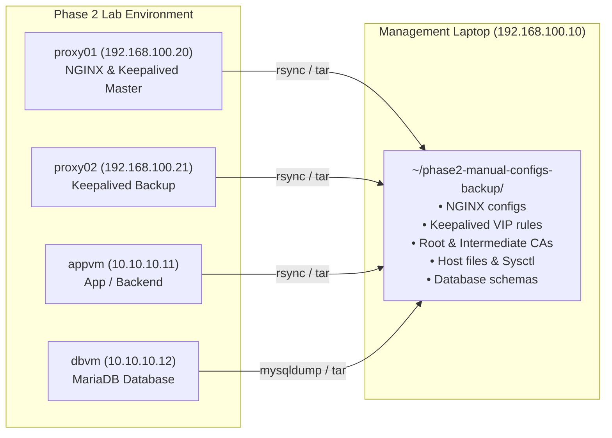
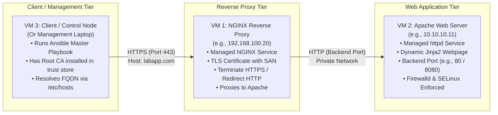

---
tags:
  - ansible
  - automation
  - devops
  - sysadmin
  - airnav-das
  - phase-3
reading-order: 0
created: 2026-09-24
updated: 2026-09-24
---

# Phase 3: Deployment Automation — Start Here & Environment Preservation

> [!abstract] Phase 3 Mission Statement
> As Systems Engineers at AirNav FCO Engineering, our primary responsibility is delivering robust, consistent, and repeatable systems. In Phase 2, we built our 3-tier platform manually (PKI, NGINX reverse proxy, Keepalived High Availability, and MariaDB). Now, in **Phase 3 (Deployment Automation)**, we elevate from manual operators to automation architects.
> 
> Using **Ansible**, we will automate the complete deployment of a secure, 3-tier System Discovery Platform with **one single master playbook**. We will automate an internal PKI, NGINX reverse proxy, Apache backend, client DNS resolution, and end-to-end verification — proving **idempotency** and **drift correction**.

> [!info] Official Documentation & Authority Sources
> - **Ansible Community Documentation**: [docs.ansible.com](https://docs.ansible.com/ansible/latest/)
> - **Red Hat Ansible Automation Platform**: [access.redhat.com/documentation/en-us/red_hat_ansible_automation_platform](https://access.redhat.com/documentation/en-us/red_hat_ansible_automation_platform/)
> - **YAML Specification (v1.2)**: [yaml.org/spec/1.2.2/](https://yaml.org/spec/1.2.2/)
> - **Jinja2 Template Designer**: [jinja.palletsprojects.com](https://jinja.palletsprojects.com/)
> - **OpenSSL 3.0+ Cryptographic Standards**: [openssl.org/docs](https://www.openssl.org/docs/)
> - **IETF RFC 5280 (X.509 PKI)**: [datatracker.ietf.org/doc/html/rfc5280](https://datatracker.ietf.org/doc/html/rfc5280)

---

## 1 · Preserving Your Phase 2 Configuration (Beyond Snapshots)

> [!important] Why Snapshots Are Not Enough
> Proxmox VM snapshots freeze virtual disk blocks, but they are opaque: you cannot easily search them, compare textual differences (`diff`), or restore individual configuration files if a service breaks. 
> 
> Before starting Phase 3, we will extract all manual configuration files, certificates, and system states from our Phase 2 setup into a **versioned local text archive** on your management laptop (`192.168.100.10`).



### 1.1 Step-by-Step Configuration Harvest

Run these commands from your management laptop terminal to pull all mission-critical configs into a dedicated backup folder:

```bash
# 1. Create a dedicated preservation workspace on your laptop:
mkdir -p ~/phase2-preservation/{proxy01,proxy02,appvm,dbvm,pki-ca}

# 2. Archive PKI CA keys and certificates from your local workspace:
cp -a ~/pki-ca ~/phase2-preservation/pki-ca/

# 3. Pull NGINX, Keepalived, and Network configs from proxy01:
ssh root@192.168.100.20 "tar -czf /tmp/proxy01-configs.tar.gz \
    /etc/nginx \
    /etc/keepalived \
    /etc/hosts \
    /etc/sysctl.d \
    /etc/pki/nginx 2>/dev/null"
scp root@192.168.100.20:/tmp/proxy01-configs.tar.gz ~/phase2-preservation/proxy01/
ssh root@192.168.100.20 "rm -f /tmp/proxy01-configs.tar.gz"

# 4. Pull Keepalived configs from proxy02:
ssh root@192.168.100.21 "tar -czf /tmp/proxy02-configs.tar.gz \
    /etc/keepalived \
    /etc/hosts \
    /etc/sysctl.d 2>/dev/null"
scp root@192.168.100.21:/tmp/proxy02-configs.tar.gz ~/phase2-preservation/proxy02/
ssh root@192.168.100.21 "rm -f /tmp/proxy02-configs.tar.gz"

# 5. Extract archives locally for instant reference and diffing:
cd ~/phase2-preservation/proxy01 && tar -xzf proxy01-configs.tar.gz
cd ~/phase2-preservation/proxy02 && tar -xzf proxy02-configs.tar.gz

# 6. Create a single, immutable snapshot archive with timestamp:
cd ~
tar -czf "phase2-complete-backup-$(date +%Y%m%d).tar.gz" phase2-preservation/
echo "Preservation complete! Stored at ~/phase2-complete-backup-$(date +%Y%m%d).tar.gz"
```

### 1.2 Restoring from the Archive (Emergency Plan)
If you ever need to restore your manual setup:
```bash
# Example: Restoring NGINX and Keepalived configs back to proxy01:
scp -r ~/phase2-preservation/proxy01/etc/nginx/* root@192.168.100.20:/etc/nginx/
scp ~/phase2-preservation/proxy01/etc/keepalived/keepalived.conf root@192.168.100.20:/etc/keepalived/
ssh root@192.168.100.20 "nginx -t && systemctl restart nginx keepalived"
```

---

## 2 · Phase 3 Target Architecture & Scope Boundaries

> [!warning] Strict Scope Boundary (From Trainee Onboarding Brief)
> - **In Scope**: One Ansible master playbook, inventory, variables, roles/tasks, Jinja2 templates, handlers, internal Root CA generation, NGINX reverse proxy, Apache backend, client `/etc/hosts` name resolution, automated verification, and idempotency tests.
> - **Out of Scope**: Databases, database clustering/Galera, Keepalived High Availability, VRRP floating IPs, hardware load balancers, and custom application code. Keep the application simple (managed static web page).



### Node Identity & Role Mapping

| Node Alias | VM Role | Network Identity | Primary Service Managed |
|---|---|---|---|
| **Control Node (VM3)** | Ansible Runner & Verification Client | `192.168.100.10` (Laptop) or Dedicated VM | Ansible Core, OpenSSL Root CA, curl client |
| **Reverse Proxy (VM1)** | Gateway / TLS Termination | `192.168.100.20` (`ens18`) | NGINX, TLS Server Cert & Key, Firewall |
| **Web Server (VM2)** | Backend Application Host | `10.10.10.11` (`ens19`) | Apache (`httpd`), Custom HTML page, SELinux |

---

## 3 · Module Roadmap & Curriculum Structure

This learning folder is divided into logical, step-by-step guides mirroring the official onboarding milestones:

```
Ansible - Deployment Automation/
├── 00 — Start Here & Environment Preservation Guide.md  <-- (You are here)
├── 01 — Ansible Flight School & Foundations.md          <-- Master conceptual guide
├── 02 — Milestone 1 — Project Hangar & Blueprint.md     <-- Project setup, inventory & SSH
├── 03 — Milestone 2 — Web Server Role (Apache).md       <-- Automating httpd, firewall, SELinux
├── 04 — Milestone 3 — Proxy Gateway Role (NGINX).md     <-- Automating reverse proxy & handlers
├── 05 — Milestone 4 — Trust (PKI & HTTPS Automation).md <-- Automating Root CA & Server Certs
├── 06 — Milestone 5 — Client Landing Zone & Testing.md  <-- Client hosts, trust anchor, curl
└── 07 — Milestone 6 & Automated Launch — Repeatability.md <-- Idempotency, drift repair, demo defense
```

---

## 4 · Completion Review & Evidence Matrix

During the final technical demonstration with Sir Jayrose and the engineering team, you will present evidence against this matrix:

| Milestone | Deliverable Area | Key Demonstration Item | Verified Status |
|:---:|---|---|:---:|
| **Flight School** | Automation Blueprint | Node flow diagram, inventory hierarchy, variables taxonomy | ⬜ Pending |
| **M1: Project Hangar** | Project Structure | `ansible.cfg`, `inventory/`, `roles/`, `ansible all -m ping` output | ⬜ Pending |
| **M2: Web Server** | Apache Automation | Automated `httpd` setup, custom Jinja2 template, port, SELinux | ⬜ Pending |
| **M3: Proxy Gateway** | NGINX Automation | Automated reverse proxy template, validation hook, event handler | ⬜ Pending |
| **M4: Trust** | Internal PKI | Automated Root CA, server cert with SAN, NGINX HTTPS redirect | ⬜ Pending |
| **M5: Client Landing** | Client Configuration | `/etc/hosts` lineinfile management, system trust anchor update | ⬜ Pending |
| **M6: Repeatability** | Idempotency & Drift | Second-run zero-change output (`ok > 0, changed = 0`), drift repair | ⬜ Pending |
| **Final Activity** | Master Launch | Single-command deployment (`ansible-playbook site.yml`) | ⬜ Pending |

---

> [!tip] Recommended Learning Workflow
> 1. Read **`01 — Ansible Flight School & Foundations.md`** first to build an unshakeable conceptual model of how Ansible works under the hood.
> 2. Follow each milestone document in numerical sequence (`02` through `07`).
> 3. Each guide features inline-commented code, architecture diagrams, command-line verification steps, and defense explanations so you are fully prepared for technical questioning.
