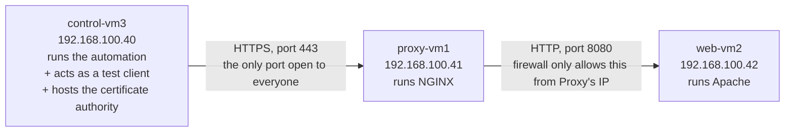

# 00 — Simple Explanation

> [!abstract] Purpose of this note
> The other notes in this folder are **evidence** — proof, for a trainer, that the project works. This note is **instruction** — for you, so the underlying mechanisms actually stick. Every concept below is explained in plain, precise technical language first; that explanation stands on its own and should make sense with no outside knowledge. Where an analogy genuinely helps build intuition, it appears afterward, clearly marked, as an *addition* — never as a replacement for the real explanation.

> [!info] How this note is formatted
> - `[!info]` — a definition or a technical fact, stated precisely.
> - `[!example]` — an **optional** analogy, offered after the technical explanation, to reinforce it.
> - `[!tip]` — a practical note or a shortcut.
> - `[!warning]` — a real mistake this project actually hit, and why.
> - `[!question]-` — a folded "wait, but why" answer. Click to expand.
> - Code blocks are followed immediately by a plain-language breakdown — read the code, then the paragraph under it.

---

## Contents

1. [[#1. The Architecture — What Is Actually Being Built]]
2. [[#2. Why Automation Instead of Doing It by Hand]]
3. [[#3. Why HTTPS Needs a Private Certificate Authority]]
4. [[#4. Ansible Concepts, Defined Precisely]]
5. [[#5. YAML — the Notation Everything Is Written In]]
6. [[#6. The Project's Configuration Files, Explained Line by Line]]
7. [[#7. Milestone 2 — the Apache Role, Line by Line]]
8. [[#8. Milestone 4 — the Certificate Authority Role, Line by Line]]
9. [[#9. Milestone 3 — the NGINX Role, Line by Line]]
10. [[#10. Milestone 5 — the Client Role, Line by Line]]
11. [[#11. Milestone 6 — Why Re-Running the Same Command Proves Anything]]
12. [[#12. Full Execution, Start to Finish, in Order]]
13. [[#13. Glossary]]

---

## 1. The Architecture — What Is Actually Being Built

Three virtual machines exist. Each one runs exactly one role, and network rules restrict which machine can talk to which other machine.



**Why split one job across three machines instead of running everything on one?** Two independent technical reasons:

1. **Reduced attack surface.** `web-vm2` — where the actual application logic and content live — has no port open to the general network at all; a firewall rule on it accepts connections on port 8080 only from the exact IP address of `proxy-vm1`. Nothing else on the network, including `control-vm3`, can reach it directly. If an attacker only has network access to the "public" side, `web-vm2` is unreachable regardless of any vulnerability it might have.
2. **Separation of concerns.** Encryption (HTTPS) and content generation (the web page) are handled by two different pieces of software, each doing one job. This mirrors how real production systems are built: a dedicated reverse proxy layer handles TLS, routing, and rate-limiting, while application servers behind it only need to speak plain HTTP on a private network.

> [!example] Analogy (optional)
> This is the same reason a business has one receptionist at the front desk instead of letting every visitor wander the building looking for the right department. The receptionist is the only person a visitor ever has to interact with directly; everyone else works behind a door the visitor never opens.

---

## 2. Why Automation Instead of Doing It by Hand

Configuring a server by hand means typing commands into a terminal, one at a time, and remembering to repeat the exact same sequence — correctly, in the same order, with the same values — on every machine that needs it, every time it needs it again (a rebuild, a new environment, a fix after a mistake).

This has two specific, well-documented failure modes:

1. **Human error under repetition.** A person who has typed the same 40-step sequence five times is statistically more likely to skip step 23 on the sixth attempt than a program is. There is no mechanism by which a human "remembers" a step was already done correctly except their own attention.
2. **No record of what was actually done.** Once a command is typed into a terminal, the only record of it is whatever the human wrote down separately (if anything). If two administrators configure "the same" server months apart, there is no guarantee they did it identically, because the instructions live in memory and notes, not in an artifact that can be inspected, versioned, or re-executed.

**Ansible solves this by making the desired end state the input, not the sequence of commands.** Every Ansible **task** describes a *state* — "package X is installed," "this file contains exactly this content," "this service is running" — not a *command*. A program called a **module** is responsible for reading the current state of the machine, comparing it to the desired state written in the task, and only taking action if they differ. This is the technical meaning of **idempotency**: running the same instruction repeatedly produces the same end result every time, because each run starts by checking, not by blindly acting.

Concretely: the module used to install a package checks the system's package database first. If the package is already installed at the correct version, the module does nothing and reports "no change." If it is missing, only then does it install it. This is fundamentally different from typing `dnf install httpd` in a terminal, which will simply attempt an install (or complain the package already exists) with no built-in concept of "check first."

> [!example] Analogy (optional)
> Think of the difference between telling someone "turn the oven dial to 350 and hold it there" (a command, executed blindly) versus "keep the oven at 350" (a target state, which a thermostat checks against continuously and only adjusts when there's a real difference). Ansible tasks are written as thermostats, not as one-time dial turns.

---

## 3. Why HTTPS Needs a Private Certificate Authority

### 3.1 What a certificate actually is

An HTTPS website presents an **X.509 certificate** to every visitor's browser. Structurally, a certificate is a data file containing:

- A **subject** — who this certificate identifies (here, the domain name `labapp.com`).
- A **public key** — half of a mathematically linked pair of numbers (a *key pair*). The other half, the **private key**, is kept secret by the server and never transmitted anywhere.
- An **issuer** — who is vouching for this certificate.
- A **digital signature**, produced by the issuer's own private key, over the entire contents of the certificate.

### 3.2 What a digital signature proves, mathematically

A private key can perform an operation on data (called *signing*) that produces a signature. Anyone holding the matching **public key** can perform a *verification* operation and get a definite yes/no answer to the question: **"was this exact data signed by the private key that corresponds to this specific public key, and has it been altered since?"** This is a property of the mathematics involved (asymmetric cryptography, e.g. RSA), not a policy or a promise — changing a single byte of the signed data makes verification fail deterministically.

This means: if a browser has a copy of an issuer's public key (packaged inside the issuer's own certificate) and it can verify that a website's certificate was signed by the matching private key, it has **mathematical proof** that the issuer specifically approved that certificate — without the issuer needing to be contacted at the time.

### 3.3 What "chain of trust" and "Root CA" actually mean

A browser does not trust certificates by default. It ships with (or is configured with) a fixed list of certificates it has been told, in advance, to trust unconditionally — these are called **trust anchors**, and an authority whose certificate is in that list is called a **Certificate Authority (CA)**. Trusting a CA is not derived from any calculation; it is a configuration decision, made once, by whoever controls the browser or operating system.

When a browser receives a website's certificate, it checks: *"was this signed by a private key whose matching public certificate is one of my trust anchors, or by a private key whose certificate was itself signed by one of my trust anchors?"* This checking process, potentially walking up through multiple signing steps, is the **chain of trust**. A **Root CA** is a certificate at the top of such a chain — its certificate is **self-signed** (it signs its own certificate with its own private key, since there is nothing above it to sign it), and it is trusted purely because it has been explicitly installed as a trust anchor.

This project builds exactly this, at the smallest possible scale: one Root CA, and one certificate it signs directly for `labapp.com`.

### 3.4 Why the hostname check (SAN) matters separately from the signature check

A valid signature only proves *who issued the certificate*. It says nothing about *which website is allowed to use it*. For that, a certificate carries a field called the **Subject Alternative Name (SAN)** — a list of hostnames the certificate is valid for. Modern TLS clients (per IETF RFC 9525, which superseded the older RFC 6125) check the hostname the user actually typed against this SAN list specifically, and reject the connection if it doesn't match, even if the signature is perfectly valid and the issuer is fully trusted. This is a second, independent check — a certificate can pass the trust check and still fail the identity check, or vice versa.

> [!example] Analogy (optional)
> A signature check is like verifying a notary's stamp on a document is genuine. A SAN check is like confirming the document actually names the specific person standing in front of you, and not someone else. A document can have a perfectly genuine notary stamp while still being the wrong person's document.

### 3.5 Why this project runs its own CA instead of using a public one

A publicly trusted CA (the kind that comes pre-installed in every browser) will only sign a certificate for a domain name after verifying the requester actually controls it — usually by proving control over its DNS or web server, over the public internet. `labapp.com` in this lab is an internal name on a private network that no public CA can verify, so a public CA cannot be used here. Building a small, self-contained CA solves the identical cryptographic problem (issuing a certificate whose signature can be verified) without needing public-internet verification — at the cost that only machines explicitly told to trust this specific Root CA will accept certificates it issues. That trade-off is the entire reason [[Milestone 5 — Client Landing Zone|Milestone 5]] exists: something has to explicitly install this Root CA as a trust anchor on the client, because no browser or operating system trusts it by default.

---

## 4. Ansible Concepts, Defined Precisely

| Term | Precise definition |
| --- | --- |
| **Control node** | The machine that runs the `ansible-playbook` command and initiates every action. Here: `control-vm3`. |
| **Managed node** | A machine that Ansible connects to (over SSH) and configures. Here: `proxy-vm1`, `web-vm2`, and `control-vm3` itself. |
| **Inventory** | A file listing every managed node, its network address, and the named groups it belongs to. |
| **Group** | A named subset of the inventory, used to target instructions at specific machines by role rather than by individual name. |
| **Playbook** | A YAML file containing an ordered list of **plays**, executed top to bottom. |
| **Play** | A block that pairs one target (a host or group) with a set of roles or tasks to run against it. |
| **Task** | A single, named instruction: one module invocation with specific arguments. |
| **Module** | A self-contained program (most are written in Python) that Ansible copies to the managed node over SSH, executes once, and removes. Each module implements the "check current state, act only if different" logic for one kind of resource (a package, a file, a service, a firewall rule, and so on). |
| **Variable** | A named value, substituted into tasks and templates with `{{ variable_name }}` syntax. |
| **Fact** | A variable whose value Ansible discovered by directly inspecting a managed node (its OS, IP address, hardware), rather than one a human wrote down. |
| **Template** | A text file (extension `.j2`, for the Jinja2 templating engine) containing `{{ variable }}` placeholders, rendered into a real file by substituting current variable values before delivery. |
| **Handler** | A task that is only executed if a different task, earlier in the same play, reported that it made a change and explicitly requested (`notify:`) this handler to run. Handlers run once, after all regular tasks in the play, unless forced to run earlier. |
| **Role** | A directory with a fixed internal structure (`tasks/`, `handlers/`, `templates/`, `defaults/`) that packages everything needed to configure one component, so it can be applied to any group of hosts by name. |
| **Collection** | A distributable package of additional modules and/or roles, installed separately from Ansible's built-in module set, when a task needs a capability Ansible doesn't ship by default (this project uses `ansible.posix` for firewall/SELinux tasks and `community.crypto` for certificate generation). |
| **Idempotent** | Describes a task or module whose repeated execution, with unchanged inputs, produces no further change after the first successful run — because it verifies current state before acting. |

---

## 5. YAML — the Notation Everything Is Written In

YAML ("YAML Ain't Markup Language") represents two structures: **key–value pairs** and **ordered lists**, using line breaks and indentation instead of brackets or closing tags. There is no third structure to learn.

```yaml
# A key-value pair: a name, a colon, then its value
domain_name: "labapp.com"

# A list: each item starts with a dash, at the same indentation level
ports:
  - 80
  - 443

# A nested map: indenting under a key groups related pairs together
person:
  name: Hans
  role: trainee
```

Indentation is not cosmetic — it is the only thing that indicates "this value belongs inside that structure." The convention throughout this project is two spaces per indentation level; a tab character in place of spaces is a common, hard-to-spot error, because most editors render a tab and two spaces identically to the eye.

An Ansible task file is a **list of maps** — each `- name: ...` line begins one list item (one task), and every line indented beneath it is a key–value pair describing that task:

```yaml
- name: Install Apache        # one list item = one task, with the key "name"
  ansible.builtin.dnf:        # a second key on this same task: which module to run
    name: httpd                 # an argument passed to that module
    state: present              # a second argument passed to that module
```

`{{ double curly braces }}` mark a place where a variable's current value is substituted before the file is used. This substitution mechanism is called Jinja2 templating, and it works identically inside plain `.yml` task files and inside `.j2` template files.

---

## 6. The Project's Configuration Files, Explained Line by Line

### 6.1 `ansible.cfg` — settings for how Ansible itself behaves

```ini
[defaults]
inventory = ./inventory/hosts.yml
roles_path = ./roles
collections_path = ./collections
remote_user = root
forks = 5
host_key_checking = True
retry_files_enabled = False
interpreter_python = auto_silent
callback_result_format = yaml

[privilege_escalation]
become = True
become_method = sudo
become_user = root
become_ask_pass = False
```

| Setting | Effect |
| --- | --- |
| `inventory = ./inventory/hosts.yml` | Explicitly names the inventory file, rather than relying on a system-wide default location. |
| `roles_path = ./roles` | Tells Ansible where to find role directories referenced in `site.yml`. |
| `collections_path = ./collections` | Uses a project-local copy of downloaded collections instead of a system-wide one, so the project's dependencies travel with the project folder. |
| `remote_user = root` | The SSH login account used on every managed node. |
| `forks = 5` | The maximum number of managed nodes Ansible will act on simultaneously (this project only has 3, so this ceiling is never actually reached). |
| `host_key_checking = True` | Verifies each managed node's SSH host key matches what was recorded on first connection, protecting against a machine at that address being silently replaced. |
| `retry_files_enabled = False` | Disables Ansible's default behavior of writing a `.retry` file listing failed hosts after an unsuccessful run. |
| `interpreter_python = auto_silent` | Uses whichever Python interpreter is present on the managed node, without printing an informational warning about the detection. |
| `callback_result_format = yaml` | Formats task output as indented, readable YAML in the terminal instead of a single-line JSON blob. |
| `become = True` / `become_method = sudo` | Escalates privilege to `root` via `sudo` for tasks that require it. |

> [!question]- If `remote_user` is already `root`, what does `become` actually add?
> Nothing observable today — escalating to root from an already-root session has no effect. Its purpose is forward-looking: if this project's login account is ever changed to a lower-privileged user (standard practice in production, since logging in directly as root is a security liability), `become: True` is already the mechanism that grants root privileges *for the specific tasks that need them*, without any other file in the project needing to change.

### 6.2 `inventory/hosts.yml` — the list of managed machines and their groups

```yaml
all:
  children:
    proxy:
      hosts:
        proxy-vm1:
          ansible_host: 192.168.100.41
    webserver:
      hosts:
        web-vm2:
          ansible_host: 192.168.100.42
    client:
      hosts:
        control-vm3:
          ansible_host: 127.0.0.1
          ansible_connection: local
    pki_ca:
      hosts:
        control-vm3:
    lab:
      children:
        proxy:
        webserver:
        client:
```

This is a nested structure: `all` contains `children`, each of which is a named group. `proxy` contains one host, `proxy-vm1`, whose network address is given by `ansible_host`. `control-vm3` is listed under `client` with `ansible_connection: local` — this setting tells Ansible not to open an SSH connection for this host at all, and instead execute tasks directly on the machine `ansible-playbook` is already running on, since it is targeting itself. `control-vm3` also appears separately under `pki_ca` — a single host can be a member of any number of groups simultaneously; group membership represents *facts about a host's role*, not a mutually exclusive category. `lab` defines no hosts directly; its `children` list means "everything in `proxy`, `webserver`, and `client`, combined," providing a single name that refers to every machine at once.

> [!question]- Why is `control-vm3` in two separate groups instead of one combined group?
> Because `client` and `pki_ca` describe two independent facts that happen to both be true of the same machine today: "this machine should receive client-side configuration" and "this machine hosts the certificate authority." Keeping them as separate groups means any file in the project that needs to know "which host runs the CA" queries the `pki_ca` group specifically, and would continue to work unmodified if the certificate authority were later moved to a dedicated fourth machine — only the inventory would need to change.

### 6.3 `group_vars/all.yml` — variables shared by every host

```yaml
domain_name: "labapp.com"
proxy_http_port: 80
proxy_https_port: 443
backend_port: 8080

proxy_address:   "{{ hostvars[groups['proxy'][0]]['ansible_host'] }}"
backend_address: "{{ hostvars[groups['webserver'][0]]['ansible_host'] }}"

webpage_title: "AirNav DAS - System Discovery Platform"
webpage_marker: "DEPLOYED-BY-ANSIBLE"

pki_dir: "/root/lab-pki"
pki_org: "AirNav FCO Engineering"
root_ca_common_name: "AirNav DAS Lab Root CA"
root_ca_valid_days: 3650
server_cert_valid_days: 199

root_ca_cert_file: "{{ pki_dir }}/root-ca.crt"
server_cert_file:  "{{ pki_dir }}/{{ domain_name }}.crt"
server_key_file:   "{{ pki_dir }}/{{ domain_name }}.key"
```

Most of these lines assign a literal value to a name. Two lines instead compute a value from the inventory:

```
proxy_address: "{{ hostvars[groups['proxy'][0]]['ansible_host'] }}"
```

Evaluated in order: `groups['proxy']` retrieves the list of host names belonging to the `proxy` group — `['proxy-vm1']`. `groups['proxy'][0]` retrieves the first element of that list (list indices start at 0) — `'proxy-vm1'`. `hostvars['proxy-vm1']` retrieves the complete set of known variables for that specific host. `hostvars['proxy-vm1']['ansible_host']` retrieves that host's configured network address — `192.168.100.41`. The net effect: `proxy_address` always equals whatever address the inventory currently assigns to the proxy host, without that address being typed a second time anywhere else in the project. If the inventory changes, every file that references `proxy_address` reflects the change automatically on the next run.

### 6.4 `group_vars/proxy.yml`, `webserver.yml`, `client.yml` — variables scoped to one group

```yaml
# proxy.yml
nginx_tls_dir: "/etc/pki/nginx"
nginx_cert_path:  "{{ nginx_tls_dir }}/{{ domain_name }}.crt"
nginx_key_path:   "{{ nginx_tls_dir }}/private/{{ domain_name }}.key"
nginx_chain_path: "{{ nginx_tls_dir }}/root-ca.crt"
nginx_ssl_protocols: "TLSv1.2 TLSv1.3"
```
```yaml
# webserver.yml
apache_document_root: "/var/www/html"
apache_vhost_file: "/etc/httpd/conf.d/{{ domain_name }}.conf"
```
```yaml
# client.yml
client_trust_anchor: "/etc/pki/ca-trust/source/anchors/airnav-das-lab-root-ca.crt"
```

Variables defined in `group_vars/<groupname>.yml` are only visible to hosts in that specific group. This keeps a value like `nginx_tls_dir` — meaningless to `web-vm2`, which never touches NGINX — out of the file every host reads.

### 6.5 `host_vars/web-vm2.yml` — a variable scoped to exactly one host

```yaml
webpage_message: "Served by Apache on web-vm2 through the NGINX reverse proxy."
```

This is the most specific scope available: a value that applies to one named host only. If a second web server joined the inventory, it would receive its own `host_vars/<hostname>.yml` file with its own value for `webpage_message`, independent of this one.

> [!question]- What happens if the same variable name is defined in more than one of these files?
> Ansible resolves this using a fixed rule called **variable precedence**: the more specific scope always overrides the more general one. A value in `host_vars/` overrides the same name in `group_vars/<group>.yml`, which overrides `group_vars/all.yml`, which overrides a role's own `defaults/main.yml`. [[OLIVERIO — Deployment Automation#1.4 Variables and precedence|The complete ordering is documented here]].

### 6.6 `collections/requirements.yml` — pinned external module dependencies

```yaml
collections:
  - name: ansible.posix
    version: ">=1.5.4,<1.6.0"
  - name: community.crypto
    version: ">=2.15.0,<3.0.0"
```

Ansible's built-in module set does not include firewall management or certificate generation; those capabilities are provided by two separately-installed collections. This file specifies not just *which* collections are required, but a **version range** for each — pinning prevents an automatic upgrade to a newer version from silently changing behavior.

> [!warning] A real problem this pinning prevented
> `ansible.posix` version 1.6.x explicitly declares that it does not support the version of ansible-core installed on this project's control node (2.14.18), and prints a compatibility warning. The version range `<1.6.0` keeps the project on the last version confirmed to work correctly, rather than silently pulling in an incompatible release the next time collections are installed.

### 6.7 `site.yml` — the master playbook

```yaml
- name: "Play 0 | Pre-flight checks on every lab host"
  hosts: lab
  gather_facts: true
  tasks:
    - name: Refuse to run on an unsupported OS
      ansible.builtin.assert:
        that:
          - ansible_facts['os_family'] == 'RedHat'
          - ansible_facts['distribution_major_version'] == '9'
        fail_msg: "..."
    - name: Refuse to run with missing or malformed key variables
      ansible.builtin.assert:
        that:
          - domain_name is match('^[a-z0-9.-]+$')
          - backend_port | int > 0
        fail_msg: "..."

- name: "Play 1 | Internal PKI on the control node"
  hosts: pki_ca
  roles: [{ role: pki_ca, tags: [pki] }]

- name: "Play 2 | Apache backend"
  hosts: webserver
  roles: [{ role: apache_web, tags: [apache] }]

- name: "Play 3 | NGINX reverse proxy with HTTPS"
  hosts: proxy
  roles: [{ role: nginx_proxy, tags: [nginx] }]

- name: "Play 4 | Client name resolution, trust and end-to-end verification"
  hosts: client
  roles:
    - { role: client_trust, tags: [client] }
    - { role: verify, tags: [verify] }
```

Five plays, executed strictly in the order written:

- **Play 0** targets `lab` (every machine) and performs two validation checks before any real configuration begins. `ansible.builtin.assert` evaluates a list of conditions and halts the entire run with an explanatory message if any condition is false — this prevents, for example, applying configuration built for one operating system to a machine running a different one, or proceeding with an obviously malformed setting like an empty domain name.
- **Play 1** targets only the `pki_ca` group and applies the `pki_ca` role — meaning every task file inside that role's directory is executed against that group.
- **Plays 2 through 4** follow the identical pattern for their respective groups and roles.

The `tags:` value attached to each role allows a later, partial invocation — `ansible-playbook site.yml --tags nginx` executes only the `nginx_proxy` role's tasks, skipping the rest of the playbook, which is useful when only one component needs to be re-applied.

> [!question]- Why does Play 0 use `gather_facts: true` while later plays use `gather_facts: false`?
> "Gathering facts" means Ansible connects to a managed node and queries it for information (operating system, IP addresses, and so on) before running any tasks. This is a real network round-trip. Since Play 0 already gathers facts from every host in `lab`, and those results remain available for the rest of the playbook run, repeating the gathering step in every subsequent play would only re-fetch identical information at the cost of additional time — `gather_facts: false` skips that redundant step.

---

## 7. Milestone 2 — the Apache Role, Line by Line

```yaml
- name: Install Apache
  ansible.builtin.dnf:
    name: "{{ apache_package }}"
    state: present
```
`dnf` is AlmaLinux's package manager. `state: present` is a declaration, not a command: it tells the module the desired end state is "this package exists on the system." The module checks the local package database first; installation only occurs if the package is currently absent.

```yaml
- name: Set the Apache listen port (validated before it is written)
  ansible.builtin.lineinfile:
    path: /etc/httpd/conf/httpd.conf
    regexp: '^Listen\s'
    line: "Listen {{ backend_port }}"
    validate: httpd -t -f %s
  notify: Reload Apache
```
`lineinfile` finds a line in an existing file matching a pattern (`regexp`) and replaces it, or appends the line if no match is found — it modifies exactly one line and leaves the rest of the file untouched. Here, it locates the line beginning with `Listen` (Apache's directive for which TCP port to bind to) and rewrites it to use port 8080 rather than the default of 80, since port 80 is reserved for NGINX in this architecture. `validate: httpd -t -f %s` runs Apache's own configuration-syntax checker against a temporary copy of the file *before* the real file is overwritten; the write only proceeds if that check passes. `notify: Reload Apache` queues a handler to run later in this same play, but only because this task is expected to report a change.

```yaml
- name: Deploy the backend virtual host
  ansible.builtin.template:
    src: vhost.conf.j2
    dest: "{{ apache_vhost_file }}"
    mode: "0644"
  notify: Reload Apache
```
`template` renders a `.j2` file (substituting all `{{ variables }}` with their current values) and writes the result to `dest`. `mode: "0644"` sets Unix file permissions: the owner may read and write the file, and everyone else may only read it — appropriate for a configuration file that isn't secret but shouldn't be modifiable by other accounts.

```yaml
- name: Deploy the managed webpage
  ansible.builtin.template:
    src: index.html.j2
    dest: "{{ apache_document_root }}/index.html"
    mode: "0644"
```
The same mechanism, applied to the actual HTML content. This task has no `notify:` — Apache reads a static content file fresh on every request, so no service reload is required for a content change to take effect; only *configuration* changes require Apache to be told about them.

```yaml
- name: Allow the backend port ONLY from the reverse proxy
  ansible.posix.firewalld:
    rich_rule: >-
      rule family="ipv4" source address="{{ proxy_address }}/32"
      port port="{{ backend_port }}" protocol="tcp" accept
    permanent: true
    immediate: true
    state: enabled
```
`firewalld` is the Linux firewall management service; a **rich rule** allows a more specific condition than a plain "open this port" rule. This rule reads as: accept TCP traffic on port 8080, but only if its source IP address is exactly `proxy_address/32` (`/32` denotes a single specific address, not a range). Traffic from any other source to this port is rejected by the firewall's default policy. `permanent: true` writes the rule so it survives a reboot; `immediate: true` also applies it to the currently running firewall instance, without requiring a restart to take effect.

```yaml
- name: Ensure Apache is enabled at boot and running
  ansible.builtin.service:
    name: "{{ apache_service }}"
    state: started
    enabled: true
```
Two independent conditions are set in one task: `state: started` means the service process must be running right now; `enabled: true` means systemd (the Linux service manager) must start it automatically on every future boot, without manual intervention.

```yaml
- name: Apply pending Apache reloads before testing
  ansible.builtin.meta: flush_handlers
```
Handlers normally execute once, after every task in the current play has run. `meta: flush_handlers` is a directive that forces any handlers already queued by earlier tasks to run immediately, at this point in the play — necessary here because the verification task that follows needs Apache already running with its final configuration.

```yaml
- name: Backend verification
  when: not ansible_check_mode
  tags: [verify]
  block:
    - name: Verify the page locally on the web server
      ansible.builtin.uri:
        url: "http://127.0.0.1:{{ backend_port }}/"
        return_content: true
      register: apache_local
      failed_when: webpage_marker not in apache_local.content
```
`block:` groups several tasks so a shared condition (`when:`) applies to all of them at once — here, "skip this entire group during a `--check` dry run, since nothing has actually been deployed yet to check." `uri` performs an HTTP request and can capture the response. `register: apache_local` stores the entire result (status code, response body, headers) in a named variable for later inspection. `failed_when:` overrides Ansible's default success/failure logic with a custom condition — this task is deliberately made to fail if the expected marker text is absent from the response, turning "does the page look approximately right" into an explicit, automatic pass/fail check.

### The handlers file

```yaml
- name: Validate Apache configuration
  ansible.builtin.command: httpd -t
  changed_when: false
  listen: Reload Apache

- name: Reload Apache service
  ansible.builtin.service:
    name: "{{ apache_service }}"
    state: reloaded
  listen: Reload Apache
```
`listen: Reload Apache` means both of these handlers respond to the same `notify: Reload Apache` call. When triggered, Ansible runs every handler listening for that name **in the order they appear in this file** — validation first, reload second — regardless of the order in which they were notified elsewhere. `changed_when: false` on the first handler overrides Ansible's default assumption that a `command` task always counts as a change; since this command only checks syntax and never modifies anything, it is explicitly marked as a non-change. `state: reloaded` (as opposed to `restarted`) sends the service a signal to re-read its configuration without terminating existing connections first.

---

## 8. Milestone 4 — the Certificate Authority Role, Line by Line

```yaml
- name: Create the CA working directory (root-only)
  ansible.builtin.file:
    path: "{{ pki_dir }}"
    state: directory
    mode: "0700"
```
`mode: "0700"` is the strictest permission setting used anywhere in this project: only the file's owner may read, write, or even list the contents of this directory — not the owner's group, not any other account. This directory will shortly contain unencrypted private keys, so access is restricted as tightly as the filesystem allows.

```yaml
- name: Generate the Root CA private key
  community.crypto.openssl_privatekey:
    path: "{{ pki_dir }}/root-ca.key"
    type: RSA
    size: "{{ root_ca_key_size }}"
    mode: "0600"
```
This generates an RSA key pair and writes the private half to disk. `size: 4096` specifies the key length in bits — a larger key represents a computationally harder problem to break by brute force, at the cost of slightly slower cryptographic operations; 4096 bits is a conservative choice appropriate for a long-lived trust anchor. `mode: "0600"` restricts the file to read/write access by its owner only — one notch stricter even than the containing directory, since this specific file is the single most sensitive artifact in the project.

```yaml
- name: Create the Root CA signing request (CA extensions)
  community.crypto.openssl_csr:
    path: "{{ pki_dir }}/root-ca.csr"
    privatekey_path: "{{ pki_dir }}/root-ca.key"
    common_name: "{{ root_ca_common_name }}"
    basic_constraints: ["CA:TRUE", "pathlen:0"]
    basic_constraints_critical: true
    key_usage: [keyCertSign, cRLSign]
    key_usage_critical: true
```
A **Certificate Signing Request (CSR)** is a data structure declaring the desired contents and extensions of a certificate, along with the corresponding public key, before it has been signed by anyone. `basic_constraints: ["CA:TRUE", "pathlen:0"]` declares that this certificate is permitted to sign other certificates (`CA:TRUE`), but that any certificate it signs may not itself sign further certificates (`pathlen:0` — a chain depth limit of zero beyond this point). `key_usage: [keyCertSign, cRLSign]` restricts what operations this key is permitted to perform to exactly two: signing certificates, and signing certificate revocation lists. Both constraints are marked `_critical: true`, meaning any certificate-processing software that does not understand a given extension is required by the X.509 standard to reject the certificate outright, rather than silently ignore a restriction it doesn't recognize.

```yaml
- name: Self-sign the Root CA certificate
  community.crypto.x509_certificate:
    path: "{{ root_ca_cert_file }}"
    csr_path: "{{ pki_dir }}/root-ca.csr"
    privatekey_path: "{{ pki_dir }}/root-ca.key"
    provider: selfsigned
    selfsigned_not_after: "+{{ root_ca_valid_days }}d"
```
`provider: selfsigned` performs the signing operation using the CSR's own private key, rather than a separate issuer's key — the only option available for a Root CA, since by definition nothing exists above it to sign it. `selfsigned_not_after: "+3650d"` sets the certificate's expiration 3,650 days (10 years) from the moment of generation.

The **server certificate** for `labapp.com` follows the identical two-step process (CSR, then signing), with different, deliberate extension values:

```yaml
    subject_alt_name: ["DNS:{{ domain_name }}"]
    basic_constraints: ["CA:FALSE"]
    key_usage: [digitalSignature, keyEncipherment]
    extended_key_usage: [serverAuth]
```
`subject_alt_name` is the field a TLS client actually checks against the hostname it connected to (see §3.4). `basic_constraints: ["CA:FALSE"]` explicitly forbids this certificate from being used to sign anything else — it can only identify a server, never issue further certificates. `extended_key_usage: [serverAuth]` further restricts its permitted use to exactly one purpose: authenticating a TLS server.

```yaml
- name: Sign the server certificate with the Root CA
  community.crypto.x509_certificate:
    provider: ownca
    ownca_path: "{{ root_ca_cert_file }}"
    ownca_privatekey_path: "{{ pki_dir }}/root-ca.key"
    ownca_not_after: "+{{ server_cert_valid_days }}d"
```
`provider: ownca` signs this CSR using a *different* certificate's private key — specifically, the Root CA's — rather than signing it with its own key. This is the exact operation that establishes the chain of trust described in §3.3: from this point forward, the resulting certificate carries a signature verifiable against the Root CA's public key.

```yaml
- name: Verify the server certificate chains to the Root CA
  ansible.builtin.command: openssl verify -CAfile {{ root_ca_cert_file }} {{ server_cert_file }}
  changed_when: false
```
`openssl verify` performs exactly the mathematical check described in §3.2 — confirming the server certificate's signature is valid against the given Root CA certificate's public key. This is a read-only check, hence `changed_when: false`.

> [!warning] A real consequence of this design, observed directly in this project
> Every time the machine holding `pki_dir` is rebuilt from a clean state (no prior files present), this role generates a **completely new** key pair for the Root CA — the *name* `AirNav DAS Lab Root CA` stays the same because it's just a text field, but the underlying cryptographic key is entirely different. Any client that had previously trusted the old Root CA certificate will reject certificates signed by the new one with a signature-verification failure, even though the issuer name matches — because trust was established for a specific key, not a name. This actually happened during this project's own repeatability testing, and required re-importing the newly generated Root CA into the browser used for manual verification.
>
> Note that this only ever affects a **personal laptop browser** used for an optional visual check — the actual client the project targets, `control-vm3`, is re-trusted automatically on every playbook run by the `client_trust` role in §10, with no manual step at all. [[Milestone 5 — Client Landing Zone#Scope note: this is the entire graded requirement — a personal laptop is not|See here]] for the laptop-side convenience script that automates the re-trust step for Chromium.

---

## 9. Milestone 3 — the NGINX Role, Line by Line

```yaml
- name: Install NGINX and the SELinux Python bindings used by seboolean
  ansible.builtin.dnf:
    name:
      - "{{ nginx_package }}"
      - python3-libsemanage
```
A single task can install a list of packages, not just one. `python3-libsemanage` is not NGINX-related software; it is a dependency required by a *different* task later in this same role (the SELinux boolean task below), included here so the entire role's requirements are satisfied at the outset.

```yaml
- name: Deploy the server certificate and the CA chain
  ansible.builtin.copy:
    src: "{{ item.src }}"
    dest: "{{ item.dest }}"
    mode: "0644"
  loop:
    - { src: "{{ server_cert_file }}", dest: "{{ nginx_cert_path }}" }
    - { src: "{{ root_ca_cert_file }}", dest: "{{ nginx_chain_path }}" }
```
`loop:` executes the same task once per item in a list, substituting `item` with each entry in turn — this avoids writing two nearly identical `copy` tasks by hand. Critically, `src:` in a `copy` task is read from the **control node** (`control-vm3`, where the certificate authority resides), while `dest:` is written on the **managed node** (`proxy-vm1`) — this is the one point in the entire project where a file physically transfers between two different machines, because the certificate was generated on one machine and is required by a different one.

```yaml
- name: Deploy the server private key
  ansible.builtin.copy:
    src: "{{ server_key_file }}"
    dest: "{{ nginx_key_path }}"
    mode: "0600"
  no_log: true
```
Identical mechanism, applied to the private key, with `mode: "0600"` (owner-only access) and `no_log: true` — the latter instructs Ansible never to print this task's parameters or results to the console or any log, a safeguard against a private key's contents appearing in a terminal transcript or CI log by accident.

```yaml
- name: Deploy nginx.conf (validated with nginx -t before it replaces the live file)
  ansible.builtin.template:
    src: nginx.conf.j2
    dest: /etc/nginx/nginx.conf
    validate: nginx -t -c %s
```
This renders NGINX's **entire** configuration file from one template, rather than a fragment. `validate: nginx -t -c %s` runs NGINX's own syntax and semantic checker against the rendered candidate file *before* it replaces the live one — this check can only meaningfully validate a complete, self-contained configuration, which is why the role manages the whole file rather than a partial snippet.

```yaml
- name: Allow NGINX to open connections to the backend (SELinux)
  ansible.posix.seboolean:
    name: httpd_can_network_relay
    state: true
    persistent: true
```
**SELinux** is a mandatory access control system present on RHEL-family distributions (including AlmaLinux) that enforces policy restrictions independent of, and in addition to, standard Unix file permissions. By default, SELinux policy prevents a web-server process from initiating an outbound network connection to another host — even though this is exactly what a reverse proxy must do. `httpd_can_network_relay` is a specific, named policy exception ("boolean") that permits precisely this behavior and nothing broader. A wider boolean (`httpd_can_network_connect`) exists and would also satisfy this requirement, but grants more permission than NGINX actually needs; the narrower boolean is used deliberately, following the security principle of least privilege. `persistent: true` writes the setting so it survives a reboot.

### The NGINX configuration template

```nginx
upstream apache_backend {
    server {{ backend_address }}:{{ backend_port }};
}
```
Defines a named group of one or more backend servers NGINX can forward requests to. `{{ backend_address }}` and `{{ backend_port }}` are substituted from the inventory-derived variables, so this file never contains a hardcoded IP address.

```nginx
server {
    listen      {{ proxy_http_port }};
    server_name {{ domain_name }};
    return 301 https://$host$request_uri;
}
```
This server block handles plain HTTP requests (port 80) and responds with an HTTP 301 status code — a **permanent redirect** — to the equivalent HTTPS URL. No content is ever served over the unencrypted connection; its only function is to redirect.

```nginx
server {
    listen      {{ proxy_https_port }} ssl;
    server_name {{ domain_name }};
    ssl_certificate     {{ nginx_cert_path }};
    ssl_certificate_key {{ nginx_key_path }};

    location / {
        proxy_pass http://apache_backend;
        proxy_set_header Host              $host;
        proxy_set_header X-Real-IP         $remote_addr;
        proxy_set_header X-Forwarded-For   $proxy_add_x_forwarded_for;
        proxy_set_header X-Forwarded-Proto $scheme;
    }
}
```
This is the server block that terminates TLS: `listen ... ssl` accepts encrypted connections, and `ssl_certificate` / `ssl_certificate_key` specify which certificate and private key to present during the TLS handshake. `proxy_pass` forwards the (now-decrypted) request to the `apache_backend` group defined earlier. The four `proxy_set_header` lines add HTTP headers to the forwarded request that would otherwise be lost: without them, Apache would only ever observe that a connection arrived from the proxy's own IP address, with no information about the original client, the original hostname requested, or whether the original connection was encrypted. `$remote_addr`, `$proxy_add_x_forwarded_for`, `$host`, and `$scheme` are NGINX's own built-in variables, populated automatically from the incoming connection.

---

## 10. Milestone 5 — the Client Role, Line by Line

```yaml
- name: Map {{ domain_name }} to the NGINX proxy in /etc/hosts
  ansible.builtin.lineinfile:
    path: /etc/hosts
    regexp: '^\S+\s+{{ domain_name | regex_escape }}$'
    line: "{{ proxy_address }} {{ domain_name }}"
    backup: true
```
`/etc/hosts` is a plain-text file consulted by the operating system's name-resolution process before any external DNS server is queried; an entry here maps a hostname directly to an IP address for this specific machine only. The `regexp` pattern is deliberately narrow: `^\S+` matches the address at the start of a line, `\s+` matches the separating whitespace, and `{{ domain_name }}$` requires the line to end exactly with this domain name and nothing else — this ensures only a line that already maps this specific domain gets replaced, and every other line in the file (mapping `localhost` or other hosts) is left untouched. `backup: true` saves a timestamped copy of the file before any modification, independent of Ansible's own change tracking.

```yaml
- name: Place the Root CA in the system trust anchors
  ansible.builtin.copy:
    src: "{{ root_ca_cert_file }}"
    dest: "{{ client_trust_anchor }}"
  notify: Update CA trust
```
This copies the Root CA's public certificate (never its private key — the private key never leaves the machine that generated it) into a directory the operating system treats as a source of trust anchors.

```yaml
- name: Update CA trust
  ansible.builtin.command: update-ca-trust extract
  changed_when: true
```
Operating systems in the RHEL family do not re-scan the trust-anchor directory on every certificate check, for performance reasons; instead, they maintain a pre-compiled bundle of trusted certificates, rebuilt only on request. `update-ca-trust extract` performs that rebuild. `changed_when: true` is a manual override: because this is a plain `command` task, Ansible cannot inspect its effect automatically, so this line explicitly states "treat this as a change whenever it runs" — which is accurate here, since it only ever runs as a handler triggered by an actual certificate change.

```yaml
- name: Resolve {{ domain_name }} through the system resolver (/etc/hosts first)
  ansible.builtin.command: getent hosts {{ domain_name }}
  failed_when: verify_dns.stdout.split()[0] | default('') != proxy_address
```
`getent hosts` queries the operating system's name resolution mechanism using the exact same code path every application on the system uses — a stronger test than manually reading `/etc/hosts`, since it confirms the resolution actually functions end-to-end, not merely that the file contains the expected text. `.stdout.split()[0]` extracts the first whitespace-separated token from the command's output (the resolved IP address) for comparison against the expected value.

```yaml
- name: HTTPS with FULL certificate validation returns the managed page
  ansible.builtin.uri:
    url: "{{ verify_url }}"
    validate_certs: true
    return_content: true
  failed_when: >-
    webpage_marker not in verify_https.content or
    verify_https.x_backend_server | default('') != groups['webserver'][0]
```
`validate_certs: true` instructs the `uri` module to perform full certificate validation exactly as a browser would: verifying the signature chain up to a trusted anchor, and checking the requested hostname against the certificate's SAN field. This is the first point in the whole project where that full validation is actually exercised — [[Milestone 3 — Proxy Gateway Role|Milestone 3's]] own test of NGINX deliberately used `validate_certs: false`, since a client's trust configuration doesn't exist yet at that point in the deployment sequence.

---

## 11. Milestone 6 — Why Re-Running the Same Command Proves Anything

Section 2 established that Ansible tasks describe a desired *state*, and each module checks current state before acting. A direct, testable consequence follows: **running the identical playbook a second time against an already-correctly-configured system should report zero changes**, because every task's precondition check will find the desired state already satisfied.

This is not a hopeful claim — it is a falsifiable prediction that this project actually verified: after a first deployment completed with tasks reporting `changed` results, a second, unmodified run of the same command reported `changed=0` across every task on every host. Any task that *did* report a change on the second run would indicate a design flaw (a task lacking a proper precondition check).

**A stronger test extends this idea to detect and correct manual interference.** If a person modifies a managed file by hand, outside of Ansible, the file's actual state now differs from what the playbook declares. Re-running the exact same playbook will find *only that one discrepancy* (since every other file/service/setting is still correct) and correct *only* that one thing — it does not need to be told what changed; it re-derives that by re-checking everything. This was tested directly in this project: a configuration value was changed by hand on `proxy-vm1`, which caused the site to fail; re-running the identical playbook command found and corrected exactly that one file, restoring service, without touching any other component.

**A separate mechanism prevents a different category of failure: a mistake introduced through the playbook itself**, rather than around it. The `validate:` argument used on the Apache and NGINX configuration tasks (§7, §9) tests a candidate configuration file *before* it replaces the live one. If validation fails — for instance, from a typo in a variable that produces an invalid setting — the task fails and the live, working configuration file is left completely untouched. This project verified that behavior directly by deliberately supplying an invalid setting and confirming, via a checksum comparison, that the live configuration file was byte-for-byte identical before and after the failed attempt, and that the site remained available throughout.

Full command output for both of these tests is recorded in [[Milestone 6 — Repeatability Check]].

---

## 12. Full Execution, Start to Finish, in Order

Running `ansible-playbook site.yml` executes, in this fixed order:

1. **Validation** — every machine is checked against required conditions (correct operating system, sane configuration values). Execution halts immediately if any check fails, rather than applying partial configuration to a system that doesn't meet prerequisites.
2. **Certificate authority creation** — on `control-vm3`: a Root CA key pair and self-signed certificate are generated (if not already present and valid), followed by a key pair, CSR, and CA-signed certificate for `labapp.com`.
3. **Backend deployment** — on `web-vm2`: Apache is installed, moved to port 8080, given a virtual host configuration and the actual page content, and firewalled to accept connections only from `proxy-vm1`'s address.
4. **Proxy deployment** — on `proxy-vm1`: NGINX is installed, the certificate and key from step 2 are delivered to it, a complete NGINX configuration is generated and validated before being applied, the necessary firewall ports are opened, and the SELinux policy exception required for proxying is granted.
5. **Client configuration and verification** — on `control-vm3`, acting as a client: `labapp.com` is mapped to the proxy's address in `/etc/hosts`, the Root CA is installed as a trust anchor and the system trust bundle is rebuilt, and then a sequence of independent checks is executed: name resolution, presence of the CA in the trust store, the HTTP-to-HTTPS redirect, and a fully-validated HTTPS request confirming the response actually originated from `web-vm2` by way of `proxy-vm1`.

Each of these steps only performs work where the current state differs from the declared desired state, which is the property demonstrated and tested in §11.

---

## 13. Glossary

| Term | Definition |
| --- | --- |
| **Idempotent** | A task whose repeated execution with unchanged inputs produces no further change, because it checks current state before acting. |
| **Control node / managed node** | The machine running Ansible / a machine Ansible configures. |
| **Inventory / group** | The list of managed machines / a named subset of that list. |
| **Playbook / play / task** | The full ordered instruction set / one section targeting one group / one instruction within it. |
| **Module** | A program implementing one idempotent operation, executed remotely by Ansible. |
| **Variable / fact** | A named, substitutable value / a variable populated by inspecting a machine directly. |
| **Template (Jinja2)** | A text file with `{{ variable }}` placeholders, rendered before delivery. |
| **Handler** | A task that only runs when explicitly notified by a change elsewhere in the same play. |
| **Role / collection** | A packaged directory of tasks for one component / a distributable package of additional modules. |
| **X.509 certificate** | A structured data file binding a subject, a public key, and an issuer's signature together. |
| **Private key / public key** | The secret half of an asymmetric key pair, never shared / the shareable half, used to verify signatures made with the private half. |
| **Digital signature** | Mathematical proof that specific data was signed by a specific private key and has not been altered since. |
| **CSR (Certificate Signing Request)** | An unsigned declaration of a certificate's desired contents, submitted for signing. |
| **Root CA** | A self-signed certificate explicitly configured as a trust anchor, from which a chain of trust originates. |
| **Chain of trust** | The sequence of signature verifications connecting a presented certificate back to a trusted anchor. |
| **Trust anchor / trust store** | A certificate explicitly trusted by policy / the collection of such certificates on a given system. |
| **SAN (Subject Alternative Name)** | The certificate field listing hostnames it may validly identify, checked separately from signature validity. |
| **Reverse proxy** | A server that receives client requests on behalf of backend servers and forwards them internally. |
| **TLS termination** | The point at which an encrypted connection is decrypted back to plaintext, typically at a reverse proxy. |
| **Firewalld / rich rule** | The Linux firewall service / a firewall rule with conditions more specific than a plain port toggle. |
| **SELinux / boolean** | A mandatory access control system enforcing policy beyond file permissions / a named, toggleable policy exception. |
| **`validate:`** | An Ansible template/file argument that tests a candidate file's correctness before it replaces the live one. |
| **`--check` / `--diff`** | Run Ansible without making changes, reporting what would happen / show the exact before/after content of a changed file. |

---

See [[OLIVERIO — Deployment Automation]] for the complete, tested technical guide, and the six milestone notes ([[Milestone 1 — Project Hangar]], [[Milestone 2 — Web Server Role]], [[Milestone 4 — Trust]], [[Milestone 3 — Proxy Gateway Role]], [[Milestone 5 — Client Landing Zone]], [[Milestone 6 — Repeatability Check]]) for the live, audited evidence that everything explained here was actually verified working.
