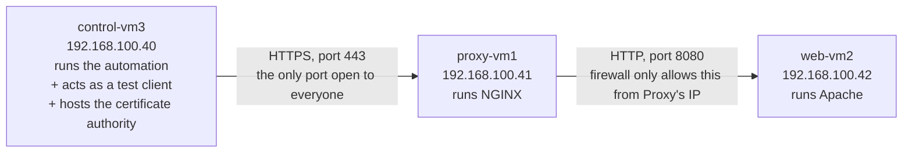

# 00 — Simple Explanation

> [!abstract] Purpose of this note
> The other notes in this folder are **evidence** — proof, for a trainer, that the project works. This note is **instruction** — for you, so the underlying mechanisms actually stick, and a **complete offline reference**: every file that exists on control-vm3's `/root/ansible-platform` is reproduced here **verbatim** (fetched directly from the live machine, not retyped from memory), with a line-by-line breakdown of what each line does. You should be able to read this note with no SSH access, no laptop, and no lab at all, and still understand exactly what the project does and why.

> [!info] How this note is formatted
> - `[!info]` — a definition or a technical fact, stated precisely.
> - `[!example]` — an **optional** analogy, offered after the technical explanation, to reinforce it.
> - `[!tip]` — a practical note or a shortcut.
> - `[!warning]` — a real mistake this project actually hit, and why.
> - `[!question]-` — a folded "wait, but why" answer. Click to expand.
> - Every file in §6 is shown as a complete code block, immediately followed by a table with **three** columns: the exact line(s), a precise **technical** explanation, and the same idea **in plain terms**. Both explanations stand on their own — you don't need the analogy sections earlier in this note to understand the technical column.

---

## Contents

1. [[#1. The Architecture — What Is Actually Being Built]]
2. [[#2. Why Automation Instead of Doing It by Hand]]
3. [[#3. Why HTTPS Needs a Private Certificate Authority]]
4. [[#4. Ansible Concepts, Defined Precisely]]
5. [[#5. YAML — the Notation Everything Is Written In]]
6. [[#6. Complete File-by-File Reference — Every File on control-vm3, Verbatim]]
7. [[#7. Why Re-Running the Same Command Proves Anything]]
8. [[#8. Full Execution, Start to Finish, in Order]]
9. [[#9. Glossary]]

---

## 1. The Architecture — What Is Actually Being Built

Three virtual machines exist. Each one runs exactly one role, and network rules restrict which machine can talk to which other machine.



**Why split one job across three machines instead of running everything on one?** Two independent technical reasons:

1. **Reduced attack surface.** `web-vm2` — where the actual application logic and content live — has no port open to the general network at all; a firewall rule on it accepts connections on port 8080 only from the exact IP address of `proxy-vm1`. Nothing else on the network, including `control-vm3`, can reach it directly. If an attacker only has network access to the "public" side, `web-vm2` is unreachable regardless of any vulnerability it might have.
2. **Separation of concerns.** Encryption (HTTPS) and content generation (the web page) are handled by two different pieces of software, each doing one job. This mirrors how real production systems are built: a dedicated reverse proxy layer handles TLS, routing, and rate-limiting, while application servers behind it only need to speak plain HTTP on a private network.

> [!example] Analogy (optional)
> This is the same reason a business has one receptionist at the front desk instead of letting every visitor wander the building looking for the right department. The receptionist is the only person a visitor ever has to interact with directly; everyone else works behind a door the visitor never opens.

---

## 2. Why Automation Instead of Doing It by Hand

Configuring a server by hand means typing commands into a terminal, one at a time, and remembering to repeat the exact same sequence — correctly, in the same order, with the same values — on every machine that needs it, every time it needs it again (a rebuild, a new environment, a fix after a mistake).

This has two specific, well-documented failure modes:

1. **Human error under repetition.** A person who has typed the same 40-step sequence five times is statistically more likely to skip step 23 on the sixth attempt than a program is. There is no mechanism by which a human "remembers" a step was already done correctly except their own attention.
2. **No record of what was actually done.** Once a command is typed into a terminal, the only record of it is whatever the human wrote down separately (if anything). If two administrators configure "the same" server months apart, there is no guarantee they did it identically, because the instructions live in memory and notes, not in an artifact that can be inspected, versioned, or re-executed.

**Ansible solves this by making the desired end state the input, not the sequence of commands.** Every Ansible **task** describes a *state* — "package X is installed," "this file contains exactly this content," "this service is running" — not a *command*. A program called a **module** is responsible for reading the current state of the machine, comparing it to the desired state written in the task, and only taking action if they differ. This is the technical meaning of **idempotency**: running the same instruction repeatedly produces the same end result every time, because each run starts by checking, not by blindly acting.

Concretely: the module used to install a package checks the system's package database first. If the package is already installed at the correct version, the module does nothing and reports "no change." If it is missing, only then does it install it. This is fundamentally different from typing `dnf install httpd` in a terminal, which will simply attempt an install (or complain the package already exists) with no built-in concept of "check first."

> [!example] Analogy (optional)
> Think of the difference between telling someone "turn the oven dial to 350 and hold it there" (a command, executed blindly) versus "keep the oven at 350" (a target state, which a thermostat checks against continuously and only adjusts when there's a real difference). Ansible tasks are written as thermostats, not as one-time dial turns.

---

## 3. Why HTTPS Needs a Private Certificate Authority

### 3.1 What a certificate actually is

An HTTPS website presents an **X.509 certificate** to every visitor's browser. Structurally, a certificate is a data file containing:

- A **subject** — who this certificate identifies (here, the domain name `labapp.com`).
- A **public key** — half of a mathematically linked pair of numbers (a *key pair*). The other half, the **private key**, is kept secret by the server and never transmitted anywhere.
- An **issuer** — who is vouching for this certificate.
- A **digital signature**, produced by the issuer's own private key, over the entire contents of the certificate.

### 3.2 What a digital signature proves, mathematically

A private key can perform an operation on data (called *signing*) that produces a signature. Anyone holding the matching **public key** can perform a *verification* operation and get a definite yes/no answer to the question: **"was this exact data signed by the private key that corresponds to this specific public key, and has it been altered since?"** This is a property of the mathematics involved (asymmetric cryptography, e.g. RSA), not a policy or a promise — changing a single byte of the signed data makes verification fail deterministically.

This means: if a browser has a copy of an issuer's public key (packaged inside the issuer's own certificate) and it can verify that a website's certificate was signed by the matching private key, it has **mathematical proof** that the issuer specifically approved that certificate — without the issuer needing to be contacted at the time.

### 3.3 What "chain of trust" and "Root CA" actually mean

A browser does not trust certificates by default. It ships with (or is configured with) a fixed list of certificates it has been told, in advance, to trust unconditionally — these are called **trust anchors**, and an authority whose certificate is in that list is called a **Certificate Authority (CA)**. Trusting a CA is not derived from any calculation; it is a configuration decision, made once, by whoever controls the browser or operating system.

When a browser receives a website's certificate, it checks: *"was this signed by a private key whose matching public certificate is one of my trust anchors, or by a private key whose certificate was itself signed by one of my trust anchors?"* This checking process, potentially walking up through multiple signing steps, is the **chain of trust**. A **Root CA** is a certificate at the top of such a chain — its certificate is **self-signed** (it signs its own certificate with its own private key, since there is nothing above it to sign it), and it is trusted purely because it has been explicitly installed as a trust anchor.

This project builds exactly this, at the smallest possible scale: one Root CA, and one certificate it signs directly for `labapp.com`.

### 3.4 Why the hostname check (SAN) matters separately from the signature check

A valid signature only proves *who issued the certificate*. It says nothing about *which website is allowed to use it*. For that, a certificate carries a field called the **Subject Alternative Name (SAN)** — a list of hostnames the certificate is valid for. Modern TLS clients (per IETF RFC 9525, which superseded the older RFC 6125) check the hostname the user actually typed against this SAN list specifically, and reject the connection if it doesn't match, even if the signature is perfectly valid and the issuer is fully trusted. This is a second, independent check — a certificate can pass the trust check and still fail the identity check, or vice versa.

> [!example] Analogy (optional)
> A signature check is like verifying a notary's stamp on a document is genuine. A SAN check is like confirming the document actually names the specific person standing in front of you, and not someone else. A document can have a perfectly genuine notary stamp while still being the wrong person's document.

### 3.5 Why this project runs its own CA instead of using a public one

A publicly trusted CA (the kind that comes pre-installed in every browser) will only sign a certificate for a domain name after verifying the requester actually controls it — usually by proving control over its DNS or web server, over the public internet. `labapp.com` in this lab is an internal name on a private network that no public CA can verify, so a public CA cannot be used here. Building a small, self-contained CA solves the identical cryptographic problem (issuing a certificate whose signature can be verified) without needing public-internet verification — at the cost that only machines explicitly told to trust this specific Root CA will accept certificates it issues. That trade-off is the entire reason [[Milestone 5 — Client Landing Zone|Milestone 5]] exists: something has to explicitly install this Root CA as a trust anchor on the client, because no browser or operating system trusts it by default.

---

## 4. Ansible Concepts, Defined Precisely

| Term | Precise definition |
| --- | --- |
| **Control node** | The machine that runs the `ansible-playbook` command and initiates every action. Here: `control-vm3`. |
| **Managed node** | A machine that Ansible connects to (over SSH) and configures. Here: `proxy-vm1`, `web-vm2`, and `control-vm3` itself. |
| **Inventory** | A file listing every managed node, its network address, and the named groups it belongs to. |
| **Group** | A named subset of the inventory, used to target instructions at specific machines by role rather than by individual name. |
| **Playbook** | A YAML file containing an ordered list of **plays**, executed top to bottom. |
| **Play** | A block that pairs one target (a host or group) with a set of roles or tasks to run against it. |
| **Task** | A single, named instruction: one module invocation with specific arguments. |
| **Module** | A self-contained program (most are written in Python) that Ansible copies to the managed node over SSH, executes once, and removes. Each module implements the "check current state, act only if different" logic for one kind of resource (a package, a file, a service, a firewall rule, and so on). |
| **Variable** | A named value, substituted into tasks and templates with `{{ variable_name }}` syntax. |
| **Fact** | A variable whose value Ansible discovered by directly inspecting a managed node (its OS, IP address, hardware), rather than one a human wrote down. |
| **Template** | A text file (extension `.j2`, for the Jinja2 templating engine) containing `{{ variable }}` placeholders, rendered into a real file by substituting current variable values before delivery. |
| **Handler** | A task that is only executed if a different task, earlier in the same play, reported that it made a change and explicitly requested (`notify:`) this handler to run. Handlers run once, after all regular tasks in the play, unless forced to run earlier. |
| **Role** | A directory with a fixed internal structure (`tasks/`, `handlers/`, `templates/`, `defaults/`) that packages everything needed to configure one component, so it can be applied to any group of hosts by name. |
| **Collection** | A distributable package of additional modules and/or roles, installed separately from Ansible's built-in module set, when a task needs a capability Ansible doesn't ship by default (this project uses `ansible.posix` for firewall/SELinux tasks and `community.crypto` for certificate generation). |
| **Idempotent** | Describes a task or module whose repeated execution, with unchanged inputs, produces no further change after the first successful run — because it verifies current state before acting. |

---

## 5. YAML — the Notation Everything Is Written In

YAML ("YAML Ain't Markup Language") represents two structures: **key–value pairs** and **ordered lists**, using line breaks and indentation instead of brackets or closing tags. There is no third structure to learn.

```yaml
# A key-value pair: a name, a colon, then its value
domain_name: "labapp.com"

# A list: each item starts with a dash, at the same indentation level
ports:
  - 80
  - 443

# A nested map: indenting under a key groups related pairs together
person:
  name: Hans
  role: trainee
```

Indentation is not cosmetic — it is the only thing that indicates "this value belongs inside that structure." The convention throughout this project is two spaces per indentation level; a tab character in place of spaces is a common, hard-to-spot error, because most editors render a tab and two spaces identically to the eye.

An Ansible task file is a **list of maps** — each `- name: ...` line begins one list item (one task), and every line indented beneath it is a key–value pair describing that task:

```yaml
- name: Install Apache        # one list item = one task, with the key "name"
  ansible.builtin.dnf:        # a second key on this same task: which module to run
    name: httpd                 # an argument passed to that module
    state: present              # a second argument passed to that module
```

`{{ double curly braces }}` mark a place where a variable's current value is substituted before the file is used. This substitution mechanism is called Jinja2 templating, and it works identically inside plain `.yml` task files and inside `.j2` template files. A Jinja2 **filter**, written as `value | filter_name`, transforms a value inline — for example `backend_port | int` converts a value to an integer, and `foo | default('')` substitutes an empty string if `foo` is undefined. Several tables below contain filters like these.

---

## 6. Complete File-by-File Reference — Every File on control-vm3, Verbatim

> [!tip] How this section was built
> Every file below was copied directly from `/root/ansible-platform` on control-vm3 on 2026-09-25 — not retyped from memory or from an earlier draft. If you ever suspect this note has drifted from the real deployment, the way to check is the same way this section was built: `scp -r root@192.168.100.40:/root/ansible-platform ~/ansible-platform-check` and diff it.

The project has one master playbook (`site.yml`), configuration split across an inventory and several variable files, and five roles. This section covers every one of them, in the order a newcomer would most usefully read them: project settings first, then the machine list and variables, then the master playbook, then each role in the order `site.yml` actually runs them.

### 6.1 `ansible.cfg` — project settings

```ini
[defaults]
inventory = ./inventory/hosts.yml
roles_path = ./roles
collections_path = ./collections

# SSH login user on managed nodes
remote_user = root
# How many hosts are configured in parallel
forks = 5
# Host keys were accepted during ssh-copy-id, so keep MITM protection ON
host_key_checking = True
# No *.retry files after a failure
retry_files_enabled = False
# Use the platform python3 without printing the discovery warning
interpreter_python = auto_silent
# Human-readable task results (built into ansible-core >= 2.13, no extra collection)
callback_result_format = yaml

[privilege_escalation]
# Run tasks as root. A no-op while remote_user is root, but it keeps the
# project working unchanged if you later switch to a non-root automation user.
become = True
become_method = sudo
become_user = root
become_ask_pass = False
```

| Line | Technical explanation | In plain terms |
| --- | --- | --- |
| `[defaults]` | INI section header; every `key = value` line until the next `[section]` belongs to Ansible's core settings namespace. | Labels the block of settings that follows as "the main settings." |
| `inventory = ./inventory/hosts.yml` | Overrides Ansible's default inventory search path with an explicit, project-relative file. | Says exactly which file lists the machines. |
| `roles_path = ./roles` | Adds this directory to the search path Ansible uses when a playbook references a role by name. | Says where the toolboxes referenced in `site.yml` live. |
| `collections_path = ./collections` | Directs both `ansible-galaxy collection install` and runtime module lookup to a project-local directory instead of the user-wide default (`~/.ansible/collections`). | Keeps the extra tools bundled inside the project folder. |
| `remote_user = root` | The SSH username Ansible authenticates as on every managed node unless overridden per host. | Log in as root everywhere. |
| `forks = 5` | The maximum number of managed nodes processed concurrently per task. | At most 5 machines worked on at once (moot with only 3 hosts). |
| `host_key_checking = True` | Enforces SSH host-key verification against `~/.ssh/known_hosts`; refuses to connect if a host's key no longer matches what was recorded when it was first trusted. | Won't silently talk to a machine whose identity changed. |
| `retry_files_enabled = False` | Suppresses the default behavior of writing a `<playbook>.retry` file listing failed hosts after a run with failures. | No leftover retry files. |
| `interpreter_python = auto_silent` | Selects the managed node's Python interpreter automatically, without printing the `[WARNING]: Platform ... discovered interpreter` message. | Uses whatever Python is already there, quietly. |
| `callback_result_format = yaml` | Selects ansible-core's built-in `yaml` stdout callback, formatting task results as indented YAML rather than single-line JSON. | Makes the terminal output readable. |
| `[privilege_escalation]` | INI section header for settings governing `become` (privilege escalation) behavior. | Labels the block of settings about "becoming root." |
| `become = True` | Every task runs with privilege escalation applied by default. | Do admin-level actions automatically when needed. |
| `become_method = sudo` | Specifies the escalation mechanism to invoke. | Uses `sudo` specifically. |
| `become_user = root` | The account to escalate to. | Become root, specifically. |
| `become_ask_pass = False` | Assumes passwordless `sudo` is configured on managed nodes. | Won't stop mid-run to ask for a `sudo` password. |

### 6.2 `.gitignore`

```gitignore
collections/ansible_collections/
*.retry
```

| Line | Technical explanation | In plain terms |
| --- | --- | --- |
| `collections/ansible_collections/` | Excludes the downloaded collection source (potentially thousands of files) from version control. | Don't track the huge pile of downloaded library code. |
| `*.retry` | Excludes any leftover retry-list file. Belt-and-braces — `retry_files_enabled = False` in `ansible.cfg` already prevents these from being created. | A safety net, just in case. |

### 6.3 `inventory/hosts.yml` — the machine list

```yaml
all:
  children:
    proxy:                          # VM1 — NGINX reverse proxy (client-facing)
      hosts:
        proxy-vm1:
          ansible_host: 192.168.100.41
    webserver:                      # VM2 — Apache backend (only the proxy talks to it)
      hosts:
        web-vm2:
          ansible_host: 192.168.100.42
    client:                         # VM3 — test client (also the control node)
      hosts:
        control-vm3:
          ansible_host: 127.0.0.1
          ansible_connection: local # run tasks directly, no SSH to itself
    pki_ca:                         # where the lab Root CA lives (the control node)
      hosts:
        control-vm3:
    lab:                            # parent group = the whole platform
      children:
        proxy:
        webserver:
        client:
```

| Line | Technical explanation | In plain terms |
| --- | --- | --- |
| `all:` | The implicit top-level group; every custom group nests under it via `children:`. | The "everyone" box that holds all the smaller boxes. |
| `children:` (under `all`) | Declares that what follows is a set of named subgroups, not a direct list of hosts. | Says "here are the teams," not "here are individual machines." |
| `proxy:` | Defines a group named `proxy`. | Names one team: "proxy." |
| `hosts:` (under `proxy`) | Declares that what follows lists individual member hosts. | Says "here's who's on this team." |
| `proxy-vm1:` | Declares a host with the inventory name `proxy-vm1` — a label Ansible uses to refer to this machine; it need not match the machine's real hostname (though it does here). | Names one machine. |
| `ansible_host: 192.168.100.41` | A reserved Ansible variable giving the real network address to connect to for this host. | The real address to reach `proxy-vm1` at. |
| `webserver: / web-vm2: / ansible_host: 192.168.100.42` | Identical structure, defining the `webserver` group and its one member. | Names the second team and its machine. |
| `client: / control-vm3:` | Defines the `client` group with one member. | Names the third team. |
| `ansible_host: 127.0.0.1` | The IPv4 loopback address — "this machine, itself." | Says "this is the machine you're already on." |
| `ansible_connection: local` | Overrides the default `ssh` connection plugin with `local`, which runs modules via a direct subprocess rather than opening an SSH session. | Don't bother connecting over the network — just run it here. |
| `pki_ca: / hosts: / control-vm3:` (no `ansible_host` here) | Defines a second group also containing `control-vm3`. Ansible merges variables for a host from every group it belongs to, so `control-vm3`'s connection settings (already defined under `client`) still apply. | A second team with the same one member. |
| `lab:` | Defines a group named `lab`. | Names a fourth, "everyone in the project" team. |
| `children: / proxy: / webserver: / client:` (under `lab`) | Declares `lab`'s membership as three other groups combined, not individual hosts — every host in any of those groups is transitively a member of `lab`. | Says "`lab` means all three teams, put together." |

> [!question]- Why is `control-vm3` in two separate groups instead of one combined group?
> Because `client` and `pki_ca` describe two independent facts that happen to both be true of the same machine today: "this machine should receive client-side configuration" and "this machine hosts the certificate authority." Keeping them separate means any file that needs "which host runs the CA" queries the `pki_ca` group specifically, and would keep working unmodified if the CA later moved to a dedicated fourth machine — only the inventory would change.

### 6.4 `group_vars/all.yml` — variables shared by every host

```yaml
# group_vars/all.yml — COMMON values shared by every host.
# Change a value here once and every template/task that uses it follows.

# --- Service identity ---------------------------------------------------------
domain_name: "labapp.com"            # FQDN users type; goes into the cert SAN, nginx server_name and /etc/hosts
proxy_http_port: 80                  # NGINX plain HTTP (redirects to HTTPS)
proxy_https_port: 443                # NGINX HTTPS (client-facing)
backend_port: 8080                   # Apache listen port (internal only)

# --- Addresses derived from the inventory (never typed twice) -----------------
proxy_address:   "{{ hostvars[groups['proxy'][0]]['ansible_host'] }}"
backend_address: "{{ hostvars[groups['webserver'][0]]['ansible_host'] }}"

# --- Page content + the string our tests look for -----------------------------
webpage_title: "AirNav DAS - System Discovery Platform"
webpage_marker: "DEPLOYED-BY-ANSIBLE"   # verify tasks fail if this is missing from the response

# --- Internal PKI (lives on the control node, group pki_ca) -------------------
pki_dir: "/root/lab-pki"             # CA working directory; OUTSIDE the project so keys never land in git
pki_org: "AirNav FCO Engineering"
pki_ou: "DAS Lab"
pki_country: "PH"
pki_state: "Western Visayas (Region VI)"
pki_city: "Iloilo"
root_ca_common_name: "AirNav DAS Lab Root CA"
root_ca_valid_days: 3650             # 10 years: long-lived trust anchor
server_cert_valid_days: 199          # under the CA/B Forum 200-day cap in force since 15 Mar 2026

# File names produced by the pki_ca role and consumed by nginx_proxy / client_trust
root_ca_cert_file: "{{ pki_dir }}/root-ca.crt"
server_cert_file:  "{{ pki_dir }}/{{ domain_name }}.crt"
server_key_file:   "{{ pki_dir }}/{{ domain_name }}.key"
```

| Line | Technical explanation | In plain terms |
| --- | --- | --- |
| `domain_name: "labapp.com"` | The FQDN used throughout the project: as the CSR common name and SAN, NGINX's `server_name`, and the `/etc/hosts` entry. | The web address everything is built around. |
| `proxy_http_port: 80` | The port NGINX listens on for plain HTTP, used only to issue a redirect. | The "insecure door," used only to point elsewhere. |
| `proxy_https_port: 443` | The port NGINX listens on for TLS-encrypted HTTPS — the port a real client actually uses. | The "secure door." |
| `backend_port: 8080` | The port Apache listens on, reachable only from the proxy's IP via a firewall rule. | The private door only the proxy may use. |
| `proxy_address: "{{ hostvars[groups['proxy'][0]]['ansible_host'] }}"` | Resolves, at runtime, to the `ansible_host` value of the first member of the `proxy` group — i.e. whatever address the inventory currently assigns to `proxy-vm1`. | The proxy's address, read from the inventory instead of retyped. |
| `backend_address: "{{ hostvars[groups['webserver'][0]]['ansible_host'] }}"` | The identical mechanism, resolving to `web-vm2`'s address. | The backend's address, likewise derived, not retyped. |
| `webpage_title: "AirNav DAS - System Discovery Platform"` | A string substituted into the HTML `<title>` and `<h1>` by the `apache_web` role's template. | The page's headline text. |
| `webpage_marker: "DEPLOYED-BY-ANSIBLE"` | A unique string printed on the page and searched for by every automated content check (`failed_when: webpage_marker not in ...`) throughout the project. | The "proof word" every test looks for. |
| `pki_dir: "/root/lab-pki"` | The absolute path where the certificate authority's keys and certificates are stored, deliberately outside `/root/ansible-platform` so they can never be accidentally committed to the project's git repository. | Where the certificate factory keeps its files — kept apart from the project on purpose. |
| `pki_org: / pki_ou: / pki_country: / pki_state: / pki_city:` | String constants supplied as the `organization_name`, `organizational_unit_name`, `country_name`, `state_or_province_name`, and `locality_name` arguments to every CSR generated by the `pki_ca` role. | The organization's address details, printed on every certificate this project issues. |
| `root_ca_common_name: "AirNav DAS Lab Root CA"` | The Root CA certificate's subject/issuer common name, and the nickname used to look it up in a client's trust store later. | The certificate authority's official name. |
| `root_ca_valid_days: 3650` | The number of days from generation until the Root CA certificate expires (10 years). | How long the certificate authority itself stays valid. |
| `server_cert_valid_days: 199` | The number of days the `labapp.com` server certificate stays valid — chosen to stay under the CA/Browser Forum's 200-day maximum public certificate lifetime, in force from 15 March 2026. | How long the website's own certificate stays valid — deliberately short, matching current public-CA practice. |
| `root_ca_cert_file: "{{ pki_dir }}/root-ca.crt"` | Builds the full path to the Root CA's public certificate by concatenating `pki_dir` with a fixed filename. | Where the certificate authority's public certificate will be found. |
| `server_cert_file: "{{ pki_dir }}/{{ domain_name }}.crt"` | Builds the server certificate's path, incorporating `domain_name` so the filename itself reflects the FQDN. | Where `labapp.com`'s certificate will be found. |
| `server_key_file: "{{ pki_dir }}/{{ domain_name }}.key"` | Builds the server private key's path, identically. | Where `labapp.com`'s private key will be found. |

### 6.5 `group_vars/proxy.yml`, `group_vars/webserver.yml`, `group_vars/client.yml` — group-scoped variables

```yaml
# group_vars/proxy.yml — values only the [proxy] group needs.
nginx_tls_dir: "/etc/pki/nginx"                          # where NGINX reads its cert/key
nginx_cert_path:  "{{ nginx_tls_dir }}/{{ domain_name }}.crt"
nginx_key_path:   "{{ nginx_tls_dir }}/private/{{ domain_name }}.key"
nginx_chain_path: "{{ nginx_tls_dir }}/root-ca.crt"      # the chain up to (and incl.) our root
nginx_ssl_protocols: "TLSv1.2 TLSv1.3"
```

```yaml
# group_vars/webserver.yml — values only the [webserver] group needs.
apache_document_root: "/var/www/html"
apache_vhost_file: "/etc/httpd/conf.d/{{ domain_name }}.conf"
```

```yaml
# group_vars/client.yml — values only the [client] group needs.
client_trust_anchor: "/etc/pki/ca-trust/source/anchors/airnav-das-lab-root-ca.crt"
```

| Line | Technical explanation | In plain terms |
| --- | --- | --- |
| `nginx_tls_dir: "/etc/pki/nginx"` | The base directory on `proxy-vm1` where TLS material is stored — the RHEL-family convention for NGINX's certificate location. | Where NGINX's certificate folder lives. |
| `nginx_cert_path: "{{ nginx_tls_dir }}/{{ domain_name }}.crt"` | Builds the full destination path the server certificate is copied to on the proxy. | Where the website's certificate ends up on the proxy machine. |
| `nginx_key_path: "{{ nginx_tls_dir }}/private/{{ domain_name }}.key"` | Builds the destination path for the private key, under a `private/` subdirectory with tighter permissions. | Where the private key ends up — in the extra-locked subfolder. |
| `nginx_chain_path: "{{ nginx_tls_dir }}/root-ca.crt"` | Builds the destination path for the Root CA certificate, which NGINX serves alongside the leaf certificate as part of the chain. | Where the "chain of trust" certificate ends up. |
| `nginx_ssl_protocols: "TLSv1.2 TLSv1.3"` | The space-separated list of TLS protocol versions NGINX is permitted to negotiate — excludes older, deprecated versions (SSLv3, TLSv1.0, TLSv1.1). | Only allows modern, currently-secure encryption versions. |
| `apache_document_root: "/var/www/html"` | The standard RHEL-family path Apache serves static files from. | Where the actual webpage file lives. |
| `apache_vhost_file: "/etc/httpd/conf.d/{{ domain_name }}.conf"` | Builds the path to Apache's virtual-host configuration file, named after the domain. | Where Apache's site-specific settings file goes. |
| `client_trust_anchor: "/etc/pki/ca-trust/source/anchors/airnav-das-lab-root-ca.crt"` | The RHEL-family convention path for a locally-trusted CA certificate, watched by `update-ca-trust`. | Where the trusted certificate list keeps this Root CA. |

### 6.6 `host_vars/web-vm2.yml` — a variable scoped to exactly one host

```yaml
# host_vars/web-vm2.yml — values for THIS host only (highest precedence of the
# inventory-file variables). A second web server would get its own file.
webpage_message: "Served by Apache on web-vm2 through the NGINX reverse proxy."
```

| Line | Technical explanation | In plain terms |
| --- | --- | --- |
| `webpage_message: "Served by Apache on web-vm2 through the NGINX reverse proxy."` | A string substituted into the page template, defined at the most specific scope available (one named host), overriding the role's generic `defaults/main.yml` value ("Served by Apache."). | The sentence shown on the page, specific to this one machine. |

> [!question]- Why does this variable exist here instead of in `group_vars/webserver.yml`?
> Because it's a fact about *this one machine specifically*, not about "every machine in the webserver group." If a second web server joined the inventory, it would get its own `host_vars/<hostname>.yml` with its own message — `group_vars/webserver.yml` is reserved for values every member of that group should share.

### 6.7 `collections/requirements.yml` — pinned external module dependencies

```yaml
# collections/requirements.yml — external modules this project needs, pinned to
# versions that support ansible-core 2.14 (the AlmaLinux 9 package).
# Install with:  ansible-galaxy collection install -r collections/requirements.yml
collections:
  - name: ansible.posix          # firewalld, seboolean
    version: ">=1.5.4,<1.6.0"
  - name: community.crypto       # openssl_privatekey, openssl_csr, x509_certificate
    version: ">=2.15.0,<3.0.0"
```

| Line | Technical explanation | In plain terms |
| --- | --- | --- |
| `collections:` | Declares a list of external collections this project depends on. | The shopping list of extra tools. |
| `- name: ansible.posix` | The collection providing `ansible.posix.firewalld` and `ansible.posix.seboolean`, used by the `apache_web` and `nginx_proxy` roles. | The toolbox with firewall and SELinux tools. |
| `version: ">=1.5.4,<1.6.0"` | Constrains the installed version to this range. Version 1.6.x declares it does not support ansible-core 2.14 (the version installed here), so the upper bound prevents an incompatible upgrade. | Only use versions confirmed to work with this Ansible install. |
| `- name: community.crypto` | The collection providing `openssl_privatekey`, `openssl_csr`, and `x509_certificate`, used by the `pki_ca` role. | The toolbox with certificate-building tools. |
| `version: ">=2.15.0,<3.0.0"` | Constrains the installed version to the 2.x line. | Stay on a tested major version. |

### 6.8 `site.yml` — the master playbook

```yaml
# site.yml — THE master playbook. One command deploys and verifies the platform:
#   ansible-playbook site.yml
# Useful variations:
#   ansible-playbook site.yml --check --diff    # dry run: show drift, change nothing
#   ansible-playbook site.yml --tags verify     # run only the read-only tests
#   ansible-playbook site.yml --tags nginx      # converge only the proxy role
# Plays run top to bottom; each play targets an inventory group and applies roles.
---
- name: "Play 0 | Pre-flight checks on every lab host"
  hosts: lab
  gather_facts: true
  tasks:
    - name: Refuse to run on an unsupported OS
      ansible.builtin.assert:
        that:
          - ansible_facts['os_family'] == 'RedHat'
          - ansible_facts['distribution_major_version'] == '9'
        fail_msg: "{{ inventory_hostname }} runs {{ ansible_facts['distribution'] }} {{ ansible_facts['distribution_version'] }}; this project targets EL9."
        success_msg: "{{ inventory_hostname }}: {{ ansible_facts['distribution'] }} {{ ansible_facts['distribution_version'] }} OK"

    - name: Refuse to run with missing or malformed key variables
      ansible.builtin.assert:
        that:
          - domain_name is match('^[a-z0-9.-]+$')
          - backend_port | int > 0
          - proxy_https_port | int > 0
        fail_msg: "Check group_vars/all.yml: domain_name/ports are missing or invalid."
        quiet: true
      run_once: true

- name: "Play 1 | Internal PKI on the control node"
  hosts: pki_ca
  gather_facts: false
  roles:
    - { role: pki_ca, tags: [pki] }

- name: "Play 2 | Apache backend"
  hosts: webserver
  gather_facts: false          # facts already gathered in Play 0 (cached for the run)
  roles:
    - { role: apache_web, tags: [apache] }

- name: "Play 3 | NGINX reverse proxy with HTTPS"
  hosts: proxy
  gather_facts: false
  roles:
    - { role: nginx_proxy, tags: [nginx] }

- name: "Play 4 | Client name resolution, trust and end-to-end verification"
  hosts: client
  gather_facts: false
  roles:
    - { role: client_trust, tags: [client] }
    - { role: verify, tags: [verify] }
```

| Line | Technical explanation | In plain terms |
| --- | --- | --- |
| `---` | The YAML document-start marker. | A formality marking where the real content begins. |
| `- name: "Play 0 \| Pre-flight checks on every lab host"` | Begins the first play in the list, with a human-readable name shown in the terminal output. | Names the first chapter of the run. |
| `hosts: lab` | Targets the `lab` group — every host in `proxy`, `webserver`, and `client` combined. | This chapter runs on all three machines. |
| `gather_facts: true` | Instructs Ansible to connect to and query each targeted host for system facts before running any tasks. | Look at each machine first, before doing anything. |
| `tasks:` | Declares a direct, inline list of tasks for this play (as opposed to `roles:`, used by later plays). | Here's the checklist for this chapter. |
| `ansible.builtin.assert:` / `that: [...]` | Evaluates a list of boolean expressions; if any is false, the play (and by default, the whole run) stops with an error. | Check these things; refuse to continue if any is wrong. |
| `ansible_facts['os_family'] == 'RedHat'` | Compares a fact discovered during the gather-facts step against the literal string `'RedHat'`, true for RHEL-family distributions including AlmaLinux. | Is this a Red-Hat-family Linux? |
| `ansible_facts['distribution_major_version'] == '9'` | Compares the discovered OS major version against `'9'` as a string. | Is it specifically version 9? |
| `fail_msg: "..."` | The message printed if any condition in `that:` is false, interpolating facts to describe what was actually found. | The error message shown if the check fails. |
| `success_msg: "..."` | The message printed if every condition passes. | The confirmation message shown if the check passes. |
| `domain_name is match('^[a-z0-9.-]+$')` | Applies the Jinja2 `match` test with a regular expression, true only if `domain_name` consists entirely of lowercase letters, digits, dots, and hyphens. | Does the domain name look like a real, sane hostname? |
| `backend_port \| int > 0` | Converts `backend_port` to an integer with the `int` filter, then checks it's a positive number. | Is the backend port a real, positive number? |
| `proxy_https_port \| int > 0` | The identical check applied to the HTTPS port. | Is the HTTPS port a real, positive number? |
| `quiet: true` | Suppresses printing the full list of conditions when the assertion succeeds, showing only the pass/fail result. | Don't clutter the output when this check passes. |
| `run_once: true` | Runs this task on only one host in the play, rather than once per host, since the variables being checked are identical everywhere. | No need to check the same setting three separate times. |
| `- name: "Play 1 \| Internal PKI on the control node"` | Begins the second play. | Names chapter two. |
| `hosts: pki_ca` | Targets only the `pki_ca` group (`control-vm3`). | This chapter runs only on the certificate-authority machine. |
| `gather_facts: false` | Skips re-querying facts, since Play 0 already gathered and cached them for the whole run. | No need to look at the machine again — already done. |
| `roles: - { role: pki_ca, tags: [pki] }` | Applies the `pki_ca` role's entire task list to this play's hosts, and tags every task in it with `pki`. | Open the "certificate factory" toolbox and use everything in it; label this work "pki" for later. |
| `- name: "Play 2 \| Apache backend"` / `hosts: webserver` / `roles: - { role: apache_web, tags: [apache] }` | Identical pattern, targeting the `webserver` group and applying the `apache_web` role. | Chapter three: set up the backend web server. |
| `- name: "Play 3 \| NGINX reverse proxy with HTTPS"` / `hosts: proxy` / `roles: - { role: nginx_proxy, tags: [nginx] }` | Identical pattern, targeting `proxy` and applying `nginx_proxy`. | Chapter four: set up the reverse proxy. |
| `- name: "Play 4 \| Client name resolution, trust and end-to-end verification"` / `hosts: client` | Targets the `client` group (`control-vm3`, in its client role). | Chapter five: set up and test the client. |
| `roles: - { role: client_trust, ... } - { role: verify, ... }` | Applies two roles in this one play, in the listed order — `client_trust` fully completes before `verify` begins. | Two toolboxes for this chapter, opened one after the other. |

### 6.9 Role `pki_ca` — builds the Root CA and the server certificate

#### `roles/pki_ca/defaults/main.yml`

```yaml
# roles/pki_ca/defaults/main.yml — lowest-precedence defaults for this role.
# group_vars/all.yml overrides these; they only exist so the role is self-describing.
root_ca_key_size: 4096        # long-lived trust anchor -> stronger key
server_key_size: 2048         # leaf cert, rotated often
```

| Line | Technical explanation | In plain terms |
| --- | --- | --- |
| `root_ca_key_size: 4096` | The RSA key length, in bits, for the Root CA's private key. Sits at the lowest variable-precedence level, so it's overridden by nothing else in this project (it isn't redefined in `group_vars`), but documents the value in the role itself. | How mathematically strong the certificate authority's own key is. |
| `server_key_size: 2048` | The RSA key length for the server (leaf) private key — smaller, since it's replaced far more often than the root. | How strong the website's own key is (smaller, since it's short-lived). |

#### `roles/pki_ca/tasks/main.yml`

```yaml
# roles/pki_ca/tasks/main.yml — build a 2-level lab PKI on the control node:
#   Root CA (self-signed)  --signs-->  server certificate for {{ domain_name }}
# Every module below is idempotent: it inspects the existing file and only
# (re)writes it when it is missing or no longer matches the requested state.

- name: Create the CA working directory (root-only)
  ansible.builtin.file:
    path: "{{ pki_dir }}"
    state: directory
    owner: root
    group: root
    mode: "0700"

# ---------------- Root CA ----------------
- name: Generate the Root CA private key
  community.crypto.openssl_privatekey:
    path: "{{ pki_dir }}/root-ca.key"
    type: RSA
    size: "{{ root_ca_key_size }}"
    mode: "0600"

- name: Create the Root CA signing request (CA extensions)
  community.crypto.openssl_csr:
    path: "{{ pki_dir }}/root-ca.csr"
    privatekey_path: "{{ pki_dir }}/root-ca.key"
    common_name: "{{ root_ca_common_name }}"
    organization_name: "{{ pki_org }}"
    organizational_unit_name: "{{ pki_ou }}"
    country_name: "{{ pki_country }}"
    state_or_province_name: "{{ pki_state }}"
    locality_name: "{{ pki_city }}"
    basic_constraints: ["CA:TRUE", "pathlen:0"]   # may sign leaf certs only, no sub-CAs
    basic_constraints_critical: true
    key_usage: [keyCertSign, cRLSign]             # a CA signs certs/CRLs, nothing else
    key_usage_critical: true
    create_subject_key_identifier: true

- name: Self-sign the Root CA certificate
  community.crypto.x509_certificate:
    path: "{{ root_ca_cert_file }}"
    csr_path: "{{ pki_dir }}/root-ca.csr"
    privatekey_path: "{{ pki_dir }}/root-ca.key"
    provider: selfsigned
    selfsigned_not_after: "+{{ root_ca_valid_days }}d"
    mode: "0644"

# ---------------- Server (leaf) certificate ----------------
- name: Generate the server private key for {{ domain_name }}
  community.crypto.openssl_privatekey:
    path: "{{ server_key_file }}"
    type: RSA
    size: "{{ server_key_size }}"
    mode: "0600"

- name: Create the server CSR with the FQDN in the Subject Alternative Name
  community.crypto.openssl_csr:
    path: "{{ pki_dir }}/{{ domain_name }}.csr"
    privatekey_path: "{{ server_key_file }}"
    common_name: "{{ domain_name }}"               # informational only; clients match the SAN
    organization_name: "{{ pki_org }}"
    organizational_unit_name: "{{ pki_ou }}"
    country_name: "{{ pki_country }}"
    state_or_province_name: "{{ pki_state }}"
    locality_name: "{{ pki_city }}"
    subject_alt_name: ["DNS:{{ domain_name }}"]    # RFC 6125 / RFC 9525: the name clients verify
    basic_constraints: ["CA:FALSE"]
    basic_constraints_critical: true
    key_usage: [digitalSignature, keyEncipherment]
    key_usage_critical: true
    extended_key_usage: [serverAuth]               # usable for TLS servers only

- name: Sign the server certificate with the Root CA
  community.crypto.x509_certificate:
    path: "{{ server_cert_file }}"
    csr_path: "{{ pki_dir }}/{{ domain_name }}.csr"
    provider: ownca
    ownca_path: "{{ root_ca_cert_file }}"
    ownca_privatekey_path: "{{ pki_dir }}/root-ca.key"
    ownca_not_after: "+{{ server_cert_valid_days }}d"
    mode: "0644"

# ---------------- Evidence (read-only) ----------------
- name: Certificate evidence
  when: not ansible_check_mode   # tests read LIVE state; skip them in --check
  tags: [verify]                 # run alone with: ansible-playbook site.yml --tags verify
  block:
    - name: Verify the server certificate chains to the Root CA
      ansible.builtin.command: openssl verify -CAfile {{ root_ca_cert_file }} {{ server_cert_file }}
      register: pki_chain_check
      changed_when: false                              # read-only check -> never "changed"

    - name: Read the issued certificate
      community.crypto.x509_certificate_info:
        path: "{{ server_cert_file }}"
      register: pki_server_cert

    - name: Show certificate evidence
      ansible.builtin.debug:
        msg:
          - "chain  : {{ pki_chain_check.stdout }}"
          - "subject: {{ pki_server_cert.subject }}"
          - "issuer : {{ pki_server_cert.issuer.commonName }}"
          - "SAN    : {{ pki_server_cert.subject_alt_name }}"
          - "expires: {{ pki_server_cert.not_after }}"
```

| Line(s) | Technical explanation | In plain terms |
| --- | --- | --- |
| `- name: Create the CA working directory (root-only)` / `mode: "0700"` | `ansible.builtin.file` with `state: directory` ensures the path exists with the specified ownership and permission bits; `0700` means only the owning user (root) may read, write, or list the directory. | Make a locked folder that only root can even look inside. |
| `- name: Generate the Root CA private key` | `community.crypto.openssl_privatekey` generates an RSA private key at `path`, of the given `type` and `size`, only if a valid key matching those parameters doesn't already exist there. | Create the certificate authority's secret signing key — but only if it doesn't already exist correctly. |
| `type: RSA` / `size: "{{ root_ca_key_size }}"` | Specifies the RSA algorithm and the key length in bits (4096, from the role's own `defaults/main.yml`). | What kind of key, and how strong. |
| `mode: "0600"` | Restricts the key file to read/write by its owner only — one notch stricter than the folder, since this file is the most sensitive artifact in the project. | Only root can even read this file. |
| `- name: Create the Root CA signing request (CA extensions)` | `community.crypto.openssl_csr` generates a Certificate Signing Request — a declaration of the desired certificate's contents and extensions, paired with the public half of the given private key. | Fill out the application form for the certificate authority's own certificate. |
| `common_name: / organization_name: / organizational_unit_name: / country_name: / state_or_province_name: / locality_name:` | Populate the X.509 Subject fields of the CSR from project variables. | The name and address printed on the certificate. |
| `basic_constraints: ["CA:TRUE", "pathlen:0"]` | Sets the `basicConstraints` extension: `CA:TRUE` marks this as a certificate authority; `pathlen:0` limits how many additional CA certificates may exist below it in a chain to zero (it may sign end-entity certificates, not further CAs). | "This is allowed to sign other certificates, but only ordinary ones, not more certificate authorities." |
| `basic_constraints_critical: true` | Marks the extension critical per RFC 5280: any certificate-processing software that doesn't understand it must reject the certificate outright rather than ignore the restriction. | This rule isn't optional — enforce it or reject the certificate. |
| `key_usage: [keyCertSign, cRLSign]` | Sets the `keyUsage` extension, restricting the key's permitted cryptographic operations to signing certificates and certificate revocation lists only. | This key may only be used to sign certificates — nothing else. |
| `key_usage_critical: true` | Marks that extension critical too. | Also not optional. |
| `create_subject_key_identifier: true` | Adds a `subjectKeyIdentifier` extension — a hash of the public key, used by other software to reference this specific key unambiguously. | Gives the key a unique fingerprint-style ID inside the certificate. |
| `- name: Self-sign the Root CA certificate` | `community.crypto.x509_certificate` issues the actual certificate from the CSR. | Actually create the certificate authority's certificate. |
| `provider: selfsigned` | Signs the certificate using the *same* private key the CSR was built from — the only option for a Root CA, since nothing exists above it to sign it. | The certificate authority vouches for itself. |
| `selfsigned_not_after: "+{{ root_ca_valid_days }}d"` | Sets the certificate's expiration to the given number of days from generation. | How long until this certificate authority's certificate expires. |
| `mode: "0644"` | Sets the certificate file's permissions to world-readable — certificates are public data by design. | Anyone can read this file, since certificates aren't secret. |
| `- name: Generate the server private key for {{ domain_name }}` | Identical mechanism to the Root CA key, but for the server, at `server_key_size` (2048 bits — smaller, since this key is replaced far more often). | Create `labapp.com`'s own secret key. |
| `- name: Create the server CSR with the FQDN in the Subject Alternative Name` | Builds a CSR for the leaf certificate. | Fill out the application form for the website's certificate. |
| `subject_alt_name: ["DNS:{{ domain_name }}"]` | Sets the `subjectAlternativeName` extension — the field a TLS client actually checks the requested hostname against (see §3.4), rather than the Common Name. | The actual name a browser will check against what you typed. |
| `basic_constraints: ["CA:FALSE"]` | Explicitly forbids this certificate from being used to sign anything else. | "This certificate may only identify a server — it can never issue other certificates." |
| `key_usage: [digitalSignature, keyEncipherment]` | Restricts the key to signing data (for the TLS handshake) and encrypting/decrypting a key exchange — the operations a TLS server key performs. | This key may only be used for securing a website connection. |
| `extended_key_usage: [serverAuth]` | Further restricts the certificate's purpose to server authentication in TLS specifically. | This certificate can only be used to prove "I am a website server." |
| `- name: Sign the server certificate with the Root CA` | Issues the leaf certificate. | Actually stamp the website's certificate. |
| `provider: ownca` | Signs using a *different* certificate's private key — the Root CA's, specified by `ownca_path` / `ownca_privatekey_path` — rather than the CSR's own key. | The certificate authority stamps this one, not the website itself. |
| `ownca_not_after: "+{{ server_cert_valid_days }}d"` | Sets the leaf certificate's expiration (199 days from `group_vars/all.yml`). | How long until the website's certificate expires. |
| `- name: Certificate evidence` / `when: not ansible_check_mode` / `tags: [verify]` / `block:` | Groups the following read-only checks; `when:` skips them entirely during a `--check` dry run (nothing real exists yet to check); `tags: [verify]` allows re-running just this group later. | A group of proof-gathering steps, skipped during a rehearsal run. |
| `- name: Verify the server certificate chains to the Root CA` | Runs `openssl verify`, the same signature-chain check described in §3.2, as a shell command. | Mathematically confirm the certificate authority really did sign this certificate. |
| `changed_when: false` | Overrides Ansible's default assumption that a `command` task always counts as a change, since this one only reads and reports, never modifies anything. | This step never counts as "changing" anything — it just checks. |
| `- name: Read the issued certificate` | `community.crypto.x509_certificate_info` parses an existing certificate file and returns its fields (subject, issuer, SAN, expiry) as structured data, without modifying anything. | Read back everything the certificate actually says. |
| `- name: Show certificate evidence` / `ansible.builtin.debug:` / `msg: [...]` | Prints a multi-line message built from the two previous tasks' registered results. | Print a clear summary of what was just proven. |

### 6.10 Role `apache_web` — the backend web server

#### `roles/apache_web/defaults/main.yml`

```yaml
# roles/apache_web/defaults/main.yml — safe fallbacks (overridden by group_vars/host_vars).
apache_package: httpd
apache_service: httpd
webpage_message: "Served by Apache."
```

| Line | Technical explanation | In plain terms |
| --- | --- | --- |
| `apache_package: httpd` | The RPM package name to install — on RHEL-family distributions, the Apache HTTP Server package is named `httpd`, not `apache2`. | The name of the actual software package. |
| `apache_service: httpd` | The systemd service/unit name used to start, enable, and reload Apache. | The name systemd knows this program by. |
| `webpage_message: "Served by Apache."` | The lowest-precedence fallback for this variable; overridden in practice by `host_vars/web-vm2.yml`'s more specific value. | A generic placeholder message, only used if nothing more specific is set. |

#### `roles/apache_web/tasks/main.yml`

```yaml
# roles/apache_web/tasks/main.yml — Milestone 2: backend Apache web server.

- name: Install Apache
  ansible.builtin.dnf:
    name: "{{ apache_package }}"
    state: present

- name: Set the Apache listen port (validated before it is written)
  ansible.builtin.lineinfile:
    path: /etc/httpd/conf/httpd.conf
    regexp: '^Listen\s'                        # replace the existing Listen line...
    line: "Listen {{ backend_port }}"          # ...with the port from group_vars
    validate: httpd -t -f %s                   # %s = candidate file; bad syntax is never written
  notify: Reload Apache

- name: Deploy the backend virtual host
  ansible.builtin.template:
    src: vhost.conf.j2
    dest: "{{ apache_vhost_file }}"
    owner: root
    group: root
    mode: "0644"
  notify: Reload Apache                         # handler validates with 'httpd -t' first

- name: Deploy the managed webpage
  ansible.builtin.template:
    src: index.html.j2
    dest: "{{ apache_document_root }}/index.html"
    owner: root
    group: root
    mode: "0644"
    # static file: Apache serves the new copy immediately, no reload needed

- name: Allow the backend port ONLY from the reverse proxy
  ansible.posix.firewalld:
    rich_rule: >-
      rule family="ipv4" source address="{{ proxy_address }}/32"
      port port="{{ backend_port }}" protocol="tcp" accept
    permanent: true                             # survives reboot
    immediate: true                             # applied now, no firewall reload
    state: enabled

- name: Ensure Apache is enabled at boot and running
  ansible.builtin.service:
    name: "{{ apache_service }}"
    state: started
    enabled: true

- name: Apply pending Apache reloads before testing
  ansible.builtin.meta: flush_handlers

# ---------------- Verification (read-only) ----------------
- name: Backend verification
  when: not ansible_check_mode   # tests read LIVE state; skip them in --check
  tags: [verify]                 # run alone with: ansible-playbook site.yml --tags verify
  block:
    - name: Verify the page locally on the web server
      ansible.builtin.uri:
        url: "http://127.0.0.1:{{ backend_port }}/"
        return_content: true
      register: apache_local
      failed_when: webpage_marker not in apache_local.content

    - name: Show backend verification result
      ansible.builtin.debug:
        msg: "Apache on {{ inventory_hostname }}:{{ backend_port }} -> HTTP {{ apache_local.status }}, marker found"
```

| Line(s) | Technical explanation | In plain terms |
| --- | --- | --- |
| `- name: Install Apache` / `state: present` | Ensures the `httpd` package is present, checking the RPM database first and installing only if absent. | Make sure Apache is installed, only doing work if it isn't already. |
| `- name: Set the Apache listen port ...` | `ansible.builtin.lineinfile` finds a line matching `regexp` in an existing file and replaces it (or appends `line` if no match exists), touching no other line in the file. | Find and fix exactly one line, leave everything else untouched. |
| `regexp: '^Listen\s'` | A regular expression matching any line beginning with the literal word `Listen` followed by whitespace — Apache's own directive for its listening port. | Find the line that controls which door Apache uses. |
| `line: "Listen {{ backend_port }}"` | The replacement line, with `backend_port` (8080) substituted in. | Change it to port 8080. |
| `validate: httpd -t -f %s` | Before committing the change, Ansible renders it to a temporary file and runs `httpd -t -f <tempfile>`, Apache's own syntax checker, against that candidate; the real file is only overwritten if the check passes. `%s` is replaced with the temp file's path. | Test the change would actually work before ever touching the real config. |
| `notify: Reload Apache` | Queues the `Reload Apache` handler to run later in this play, but only if this task actually reported a change. | If this line really changed, remember to tell Apache about it. |
| `- name: Deploy the backend virtual host` | `ansible.builtin.template` renders `vhost.conf.j2` (substituting all its `{{ variables }}`) and writes the result to `dest`, only overwriting the file if the rendered content differs from what's already there. | Fill out and deliver Apache's site-specific settings file. |
| `owner: root / group: root / mode: "0644"` | Sets file ownership and permission bits: owner can read/write, everyone else can only read. | Root owns it; anyone can look, only root can change it. |
| `- name: Deploy the managed webpage` | Same templating mechanism, applied to the actual HTML content, with no `notify:` — a static content file needs no service reload to take effect, since Apache reads it fresh on every request. | Deliver the actual webpage; no need to tell Apache anything afterward. |
| `- name: Allow the backend port ONLY from the reverse proxy` | `ansible.posix.firewalld` with a `rich_rule` — a firewalld rule with conditions more specific than a plain port toggle. | Build a locked door that only opens for one specific visitor. |
| `rule family="ipv4" source address="{{ proxy_address }}/32" port port="{{ backend_port }}" protocol="tcp" accept` | Accepts TCP traffic on `backend_port` only when its source IP exactly matches `proxy_address` (`/32` denotes a single address, not a range); traffic from any other source hits the zone's default policy (reject/drop). | Only let traffic in on this port if it came from the proxy specifically. |
| `permanent: true` | Writes the rule to firewalld's persistent configuration, so it survives a reboot. | Keep this rule even after restarting. |
| `immediate: true` | Also applies the rule to the currently running firewalld instance immediately, without needing a reload. | Also apply it right now, no restart needed. |
| `- name: Ensure Apache is enabled at boot and running` | `state: started` requires the service to be running now; `enabled: true` requires systemd to auto-start it on every future boot — two independent conditions checked and set together. | Running now, and set to always start automatically from now on. |
| `- name: Apply pending Apache reloads before testing` / `ansible.builtin.meta: flush_handlers` | Forces any handler already queued by earlier tasks in this play to execute immediately, rather than waiting for the play's natural end. | Do any pending "only if changed" reminders right now, since the next step needs them done first. |
| `- name: Backend verification` / `when: not ansible_check_mode` / `tags: [verify]` / `block:` | Groups the verification tasks; skipped entirely during a `--check` dry run. | A group of proof-gathering steps, skipped during a rehearsal run. |
| `- name: Verify the page locally on the web server` | `ansible.builtin.uri` performs an HTTP GET to Apache directly on the loopback address and its own port, capturing the response body via `return_content: true`. | Fetch the page from the machine itself, and read what came back. |
| `register: apache_local` | Stores the entire result (status code, body, headers) in a variable named `apache_local` for use by the next task. | Keep the result in a labeled box for later. |
| `failed_when: webpage_marker not in apache_local.content` | Overrides the default success condition; this task fails unless the secret marker string appears in the response body. | Fail this step unless the "proof word" is actually present in the page. |
| `- name: Show backend verification result` / `ansible.builtin.debug:` / `msg: "..."` | Prints a one-line summary interpolating the hostname, port, and captured status code. | Print a short confirmation of what was found. |

#### `roles/apache_web/handlers/main.yml`

```yaml
# roles/apache_web/handlers/main.yml — run ONCE at the end of the play, and only
# if a task reported "changed" and notified them. Handlers run in the order they
# are written here, so validation always runs before the reload.

- name: Validate Apache configuration
  ansible.builtin.command: httpd -t
  changed_when: false
  listen: Reload Apache                  # both handlers answer the same notification

- name: Reload Apache service
  ansible.builtin.service:
    name: "{{ apache_service }}"
    state: reloaded                      # graceful: in-flight requests are not dropped
  listen: Reload Apache
```

| Line(s) | Technical explanation | In plain terms |
| --- | --- | --- |
| `- name: Validate Apache configuration` / `ansible.builtin.command: httpd -t` | Runs Apache's built-in syntax checker as a shell command. | Ask Apache itself, "is your configuration file valid right now?" |
| `changed_when: false` | A `command` task is assumed "changed" by default since Ansible can't inspect its effect; this line overrides that, since running a syntax check never modifies anything. | This never counts as "changing" anything — it's just a check. |
| `listen: Reload Apache` (both handlers) | Both handlers subscribe to the same notification name. When `notify: Reload Apache` fires anywhere in the role, every handler with this `listen:` value runs, **in the order written in this file** — validation, then reload — regardless of notification order. | Both of these respond to the same "something changed" signal, and always run in this fixed order. |
| `- name: Reload Apache service` / `state: reloaded` | Sends Apache a reload signal (rather than `restarted`), which re-reads configuration without terminating existing connections. | Tell Apache to pick up the new settings without dropping anyone currently connected. |

#### `roles/apache_web/templates/vhost.conf.j2`

```apacheconf
# {{ ansible_managed }}
# Backend vhost for {{ domain_name }} — only NGINX ({{ proxy_address }}) reaches this port.

<VirtualHost *:{{ backend_port }}>
    ServerName {{ domain_name }}
    DocumentRoot {{ apache_document_root }}

    # Response header that proves which backend answered (visible to the client through NGINX)
    Header always set X-Backend-Server "{{ inventory_hostname }}"

    # %h = TCP peer (the proxy); X-Forwarded-For = the real client NGINX passed on
    LogFormat "%h xff=\"%{X-Forwarded-For}i\" proto=%{X-Forwarded-Proto}i \"%r\" %>s" proxied
    CustomLog logs/{{ domain_name }}_access.log proxied
    ErrorLog  logs/{{ domain_name }}_error.log
</VirtualHost>
```

| Line(s) | Technical explanation | In plain terms |
| --- | --- | --- |
| `# {{ ansible_managed }}` | Renders to a standard "this file is managed by Ansible" banner comment, using a built-in Ansible variable — a convention warning anyone reading the deployed file not to hand-edit it. | A warning label: "don't edit this file by hand, Ansible owns it." |
| `<VirtualHost *:{{ backend_port }}>` | Opens an Apache `VirtualHost` block bound to all local addresses (`*`) on `backend_port` (8080). | Defines a website configuration that answers on port 8080. |
| `ServerName {{ domain_name }}` | Sets the hostname this virtual host responds to. | This site answers to the name `labapp.com`. |
| `DocumentRoot {{ apache_document_root }}` | Sets the filesystem directory Apache serves files from for this virtual host. | Where the actual page files are. |
| `Header always set X-Backend-Server "{{ inventory_hostname }}"` | Adds a custom HTTP response header on every response, containing this host's inventory name (`web-vm2`) — `always` ensures it's set regardless of response status. | Stamps every response with "this came from web-vm2," visible even through the proxy. |
| `LogFormat "%h xff=... proto=... \"%r\" %>s" proxied` | Defines a named (`proxied`) Apache log format string; `%h` is the direct TCP peer, `%{X-Forwarded-For}i` and `%{X-Forwarded-Proto}i` read the headers NGINX adds, `%r` the request line, `%>s` the final HTTP status. | Defines what gets written to the log, including the *real* client info NGINX forwards. |
| `CustomLog logs/{{ domain_name }}_access.log proxied` | Directs access logging for this virtual host to a domain-named file, using the format just defined. | Where successful-request logs go. |
| `ErrorLog logs/{{ domain_name }}_error.log` | Directs error logging to a separate, domain-named file. | Where error logs go. |
| `</VirtualHost>` | Closes the block opened above. | Ends this site's configuration. |

#### `roles/apache_web/templates/index.html.j2`

```html
<!-- {{ ansible_managed }} -->
<!DOCTYPE html>
<html lang="en">
<head>
  <meta charset="utf-8">
  <title>{{ webpage_title }}</title>
</head>
<body>
  <h1>{{ webpage_title }}</h1>
  <p>{{ webpage_message }}</p>
  <ul>
    <li>FQDN: {{ domain_name }}</li>
    <li>Backend: {{ inventory_hostname }} ({{ ansible_host }}) port {{ backend_port }}</li>
    <li>OS: {{ ansible_facts['distribution'] }} {{ ansible_facts['distribution_version'] }}</li>
  </ul>
  <p>{{ webpage_marker }}</p>
</body>
</html>
```

| Line(s) | Technical explanation | In plain terms |
| --- | --- | --- |
| `<!-- {{ ansible_managed }} -->` | The same managed-file banner, as an HTML comment. | "Don't hand-edit this," for an HTML file. |
| `<title>{{ webpage_title }}</title>` / `<h1>{{ webpage_title }}</h1>` | Substitutes the `webpage_title` variable into both the browser tab title and the page's main heading. | The page's headline text, shown in two places. |
| `<p>{{ webpage_message }}</p>` | Substitutes `webpage_message` — resolved, via variable precedence, from `host_vars/web-vm2.yml`. | A sentence specific to this backend machine. |
| `<li>FQDN: {{ domain_name }}</li>` | Prints the configured domain name. | Shows what domain this page is meant to answer to. |
| `<li>Backend: {{ inventory_hostname }} ({{ ansible_host }}) port {{ backend_port }}</li>` | Prints this host's inventory name, its address, and the port it's listening on — `inventory_hostname` and `ansible_host` are reserved Ansible variables referring to the current host in the loop. | Shows exactly which machine and port generated this page. |
| `<li>OS: {{ ansible_facts['distribution'] }} {{ ansible_facts['distribution_version'] }}</li>` | Prints two facts gathered from the machine in Play 0 — the OS name and version. | Shows what operating system this machine runs. |
| `<p>{{ webpage_marker }}</p>` | Prints the secret marker string every automated test searches for. | The "proof word" printed on the page for the tests to find. |

> [!warning] A real idempotency trap avoided here
> An early draft of this template printed a live timestamp (`{{ ansible_date_time.iso8601 }}`). Because that value differs on every single run, the rendered file would differ every time too, making this `template` task report `changed` on every run forever — breaking the entire idempotency property demonstrated in [[Milestone 6 — Repeatability Check]]. Only values that describe the *desired state* belong in a managed template — never a value that changes just because time passed.

### 6.11 Role `nginx_proxy` — the reverse proxy and HTTPS termination

#### `roles/nginx_proxy/defaults/main.yml`

```yaml
# roles/nginx_proxy/defaults/main.yml
nginx_package: nginx
nginx_service: nginx
```

| Line | Technical explanation | In plain terms |
| --- | --- | --- |
| `nginx_package: nginx` | The RPM package name to install. | The name of the software package. |
| `nginx_service: nginx` | The systemd service/unit name. | The name systemd knows this program by. |

#### `roles/nginx_proxy/tasks/main.yml`

```yaml
# roles/nginx_proxy/tasks/main.yml — Milestones 3 + 4: NGINX reverse proxy with HTTPS.

- name: Install NGINX and the SELinux Python bindings used by seboolean
  ansible.builtin.dnf:
    name:
      - "{{ nginx_package }}"
      - python3-libsemanage          # required by ansible.posix.seboolean on the managed host
    state: present

# ---------------- TLS material (Milestone 4) ----------------
- name: Create the TLS directories
  ansible.builtin.file:
    path: "{{ item.path }}"
    state: directory
    owner: root
    group: root
    mode: "{{ item.mode }}"
  loop:
    - { path: "{{ nginx_tls_dir }}", mode: "0755" }
    - { path: "{{ nginx_tls_dir }}/private", mode: "0700" }   # key dir: root only

- name: Deploy the server certificate and the CA chain
  ansible.builtin.copy:
    src: "{{ item.src }}"            # 'src' is read on the CONTROL node (where the CA lives)
    dest: "{{ item.dest }}"
    owner: root
    group: root
    mode: "0644"                     # certificates are public
  loop:
    - { src: "{{ server_cert_file }}", dest: "{{ nginx_cert_path }}" }
    - { src: "{{ root_ca_cert_file }}", dest: "{{ nginx_chain_path }}" }
  notify: Reload NGINX

- name: Deploy the server private key
  ansible.builtin.copy:
    src: "{{ server_key_file }}"
    dest: "{{ nginx_key_path }}"
    owner: root
    group: root
    mode: "0600"                     # read by the NGINX master process (root) only
  no_log: true                       # never print key material in the output
  notify: Reload NGINX

# ---------------- Reverse proxy config (Milestone 3) ----------------
- name: Deploy nginx.conf (validated with nginx -t before it replaces the live file)
  ansible.builtin.template:
    src: nginx.conf.j2
    dest: /etc/nginx/nginx.conf
    owner: root
    group: root
    mode: "0644"
    validate: nginx -t -c %s         # candidate file is tested; a broken config is never installed
  notify: Reload NGINX

- name: Open HTTP and HTTPS in firewalld
  ansible.posix.firewalld:
    port: "{{ item }}/tcp"
    permanent: true
    immediate: true
    state: enabled
  loop:
    - "{{ proxy_http_port }}"
    - "{{ proxy_https_port }}"

- name: Allow NGINX to open connections to the backend (SELinux)
  ansible.posix.seboolean:
    name: httpd_can_network_relay    # narrowest boolean that permits proxying to HTTP ports
    state: true
    persistent: true                 # survives reboot (writes the policy store)

- name: Ensure NGINX is enabled at boot and running
  ansible.builtin.service:
    name: "{{ nginx_service }}"
    state: started
    enabled: true

- name: Apply pending NGINX reloads before testing
  ansible.builtin.meta: flush_handlers

# ---------------- Proxy-path verification (read-only) ----------------
- name: Proxy-path verification
  when: not ansible_check_mode   # tests read LIVE state; skip them in --check
  tags: [verify]                 # run alone with: ansible-playbook site.yml --tags verify
  block:
    - name: Proxy -> backend reachability (firewall rule allows this host)
      ansible.builtin.uri:
        url: "http://{{ backend_address }}:{{ backend_port }}/"
        return_content: true
      register: proxy_to_backend
      failed_when: webpage_marker not in proxy_to_backend.content

    - name: Full path through NGINX on this host (HTTPS -> Apache)
      ansible.builtin.uri:
        url: "https://127.0.0.1:{{ proxy_https_port }}/"
        headers:
          Host: "{{ domain_name }}"      # select our server block
        validate_certs: false            # cert trust is proven from the client in Milestone 5
        return_content: true
      register: through_nginx
      failed_when: >-
        webpage_marker not in through_nginx.content or
        through_nginx.x_backend_server | default('') != groups['webserver'][0]

    - name: Show proxy verification result
      ansible.builtin.debug:
        msg:
          - "direct backend : HTTP {{ proxy_to_backend.status }}"
          - "through NGINX  : HTTP {{ through_nginx.status }} answered by {{ through_nginx.x_backend_server }}"
```

| Line(s) | Technical explanation | In plain terms |
| --- | --- | --- |
| `- name: Install NGINX and the SELinux Python bindings used by seboolean` / `name: [...]` | Installs a list of two packages in one task: NGINX itself, and `python3-libsemanage` — a dependency required later in this same file by `ansible.posix.seboolean`, but absent from a minimal AlmaLinux install by default. | Install NGINX, and also a helper library a later step in this file needs. |
| `- name: Create the TLS directories` / `loop: [...]` | `loop:` repeats this one task once per list item, substituting `item` each time — here, building two directories with different permissions in one task definition instead of two. | Make two folders, one public, one locked, using one instruction repeated twice. |
| `{ path: "{{ nginx_tls_dir }}", mode: "0755" }` | The certificate directory, world-readable (owner: read/write/list; group and others: read/list). | The public certificate folder. |
| `{ path: "{{ nginx_tls_dir }}/private", mode: "0700" }` | The key subdirectory, owner-only. | The locked key folder. |
| `- name: Deploy the server certificate and the CA chain` / `loop: [...]` | Copies two files in one task: the server certificate and the Root CA certificate (the "chain"). | Deliver two public certificate files. |
| `src: "{{ item.src }}"` | Critically, `src:` in an `ansible.builtin.copy` task is read from the **control node** — where the CA lives — not the managed node the task is running against. | The file being copied comes from the machine that made it, not the one receiving it. |
| `mode: "0644"` | World-readable — appropriate, since certificates are public data. | Anyone can read these; they're not secret. |
| `notify: Reload NGINX` | Queues the reload handler if this task actually copies a new/changed file. | If the certificate changed, remember to tell NGINX. |
| `- name: Deploy the server private key` | Copies the private key, at the tighter `0600` permission. | Deliver the one genuinely secret file. |
| `no_log: true` | Suppresses Ansible from ever printing this task's parameters or results to the console or any log file. | Never let this key's contents show up in any output, even by accident. |
| `- name: Deploy nginx.conf ...` / `validate: nginx -t -c %s` | Renders the *entire* NGINX configuration from one template, then tests the rendered candidate with NGINX's own checker before overwriting the live file — only possible because the whole file, not a fragment, is managed here. | Build the complete settings file, test it for real, and only then replace the live one. |
| `- name: Open HTTP and HTTPS in firewalld` / `loop: [...]` | Opens two plain ports (no source restriction, unlike the backend's rich rule), since this machine is meant to be reachable from anywhere. | Let anyone knock on ports 80 and 443 — this is the public-facing machine. |
| `- name: Allow NGINX to open connections to the backend (SELinux)` | `ansible.posix.seboolean` toggles a named SELinux policy boolean. | Grant one specific extra permission the security system normally denies. |
| `name: httpd_can_network_relay` | The specific boolean permitting an `httpd_t`-labeled process (which NGINX runs as) to make outbound connections to HTTP-labeled ports — deliberately the narrowest boolean that satisfies the requirement, rather than the broader `httpd_can_network_connect`. | The specific, narrow permission slip NGINX needs to reach the backend — nothing broader. |
| `persistent: true` | Writes the boolean's state into the SELinux policy store so it survives a reboot. | Keep this permission even after restarting. |
| `- name: Ensure NGINX is enabled at boot and running` | Same dual condition as Apache's equivalent task. | Running now, and always starts automatically going forward. |
| `- name: Proxy-path verification` / `when: not ansible_check_mode` / `tags: [verify]` | Groups the two HTTP checks that follow, skipped during a dry run. | A group of proof-gathering steps, skipped during a rehearsal run. |
| `- name: Proxy -> backend reachability ...` | Fetches the page directly from Apache's address, from the proxy machine — proving the firewall rule that permits exactly this connection actually works. | Confirm the proxy really can reach the backend. |
| `- name: Full path through NGINX on this host (HTTPS -> Apache)` | Fetches the page over HTTPS from the proxy's own loopback address, deliberately with `validate_certs: false`. | Confirm a request through the front door actually reaches the kitchen and comes back correctly. |
| `headers: Host: "{{ domain_name }}"` | Explicitly sets the HTTP `Host` header so NGINX selects the correct `server` block (since the request targets `127.0.0.1`, not the real domain name). | Ask specifically for the `labapp.com` site, not just "whatever's on this IP." |
| `validate_certs: false` | Deliberately skips certificate trust validation for this specific check — this task's job is only to prove NGINX terminates TLS and forwards correctly, not that a client trusts the result (that's proven separately, in the `verify` role). | Don't check if the certificate is trusted yet — that's tested elsewhere; just check the connection itself works. |
| `failed_when: webpage_marker not in through_nginx.content or through_nginx.x_backend_server \| default('') != groups['webserver'][0]` | Fails unless *both* the marker string is present *and* the `X-Backend-Server` response header equals the name of the first (only) host in the `webserver` group. `default('')` avoids an error if the header is entirely absent. | Fail unless the response really has the right content *and* really came from the right backend machine. |
| `- name: Show proxy verification result` | Prints a two-line summary of both checks' status codes. | Print a short confirmation of both results. |

#### `roles/nginx_proxy/handlers/main.yml`

```yaml
# roles/nginx_proxy/handlers/main.yml
# Runs once at the end of the play (or at flush_handlers), only when notified.
- name: Reload NGINX
  ansible.builtin.service:
    name: "{{ nginx_service }}"
    state: reloaded      # SIGHUP: new workers get the new config/cert, open connections finish
```

| Line | Technical explanation | In plain terms |
| --- | --- | --- |
| `- name: Reload NGINX` / `state: reloaded` | Sends NGINX's master process a reload signal (SIGHUP internally): it spawns new worker processes using the updated configuration and certificate, while existing workers finish handling any in-flight connections before exiting. | Tell NGINX to start using the new settings, without cutting off anyone mid-request. |

#### `roles/nginx_proxy/templates/nginx.conf.j2`

```nginx
# {{ ansible_managed }}
# Whole-file management: nothing outside this file (e.g. a stray conf.d/*.conf)
# can change how the proxy behaves, which makes drift detectable and reversible.

user nginx;
worker_processes auto;
error_log /var/log/nginx/error.log notice;
pid /run/nginx.pid;

events {
    worker_connections 1024;
}

http {
    include      /etc/nginx/mime.types;
    default_type application/octet-stream;
    sendfile     on;
    server_tokens off;                        # hide the NGINX version

    log_format proxied '$remote_addr "$request" $status -> $upstream_addr';
    access_log /var/log/nginx/access.log proxied;

    upstream apache_backend {
        server {{ backend_address }}:{{ backend_port }};   # from the inventory via group_vars
    }

    # --- Port {{ proxy_http_port }}: redirect everything to HTTPS -----------
    server {
        listen      {{ proxy_http_port }};
        server_name {{ domain_name }};
        return 301 https://$host$request_uri;
    }

    # --- Port {{ proxy_https_port }}: TLS termination + reverse proxy --------
    server {
        listen      {{ proxy_https_port }} ssl;
        server_name {{ domain_name }};

        ssl_certificate     {{ nginx_cert_path }};
        ssl_certificate_key {{ nginx_key_path }};
        ssl_protocols       {{ nginx_ssl_protocols }};
        # Ciphers are left to the AlmaLinux system-wide crypto policy (PROFILE=SYSTEM).

        location / {
            proxy_pass http://apache_backend;
            proxy_set_header Host              $host;                       # original name
            proxy_set_header X-Real-IP         $remote_addr;                # real client IP
            proxy_set_header X-Forwarded-For   $proxy_add_x_forwarded_for;  # client chain
            proxy_set_header X-Forwarded-Proto $scheme;                     # "https"
        }
    }
}
```

| Line(s) | Technical explanation | In plain terms |
| --- | --- | --- |
| `user nginx;` | The Linux user account NGINX's worker processes run as, after the root-owned master process drops privileges. | NGINX itself runs as a low-privilege account, not root. |
| `worker_processes auto;` | Spawns one worker process per detected CPU core. | Use the machine's CPU efficiently. |
| `events { worker_connections 1024; }` | Sets the maximum simultaneous connections each worker process may handle. | A ceiling on how many connections at once. |
| `include /etc/nginx/mime.types;` / `default_type application/octet-stream;` | Loads the standard file-extension-to-MIME-type mapping, with a fallback type for anything unrecognized. | Knows how to correctly label file types sent to browsers. |
| `sendfile on;` | Enables the kernel `sendfile()` system call for serving static files, avoiding an extra copy through userspace. | A performance optimization for serving files. |
| `server_tokens off;` | Omits the NGINX version number from error pages and the `Server` response header. | Don't advertise exactly which NGINX version is running. |
| `log_format proxied '$remote_addr "$request" $status -> $upstream_addr';` | Defines a named log format using NGINX's built-in variables: the client's TCP address, the raw request line, the response status, and the address the request was proxied to. | Defines what info gets written to the access log. |
| `access_log /var/log/nginx/access.log proxied;` | Applies that log format to the main access log. | Where those logs get written. |
| `upstream apache_backend { server {{ backend_address }}:{{ backend_port }}; }` | Defines a named upstream group with one member, resolved from the inventory-derived variables. | Gives a nickname to "the backend server," so it isn't hardcoded elsewhere in this file. |
| `server { listen {{ proxy_http_port }}; ... return 301 https://$host$request_uri; }` | A server block bound to the HTTP port; unconditionally issues an HTTP 301 (permanent redirect) response to the same host and path, but over HTTPS. `$host` and `$request_uri` are NGINX's own built-in variables for the requested hostname and path. | Anyone arriving on the insecure door gets sent straight to the secure one. |
| `server { listen {{ proxy_https_port }} ssl; ... }` | A server block bound to the HTTPS port, with `ssl` enabling TLS termination for this block. | This is the actual, secure entry point. |
| `ssl_certificate {{ nginx_cert_path }};` / `ssl_certificate_key {{ nginx_key_path }};` | Specifies the certificate and private key files NGINX presents during the TLS handshake. | Which certificate and key to show visitors. |
| `ssl_protocols {{ nginx_ssl_protocols }};` | Restricts negotiable TLS protocol versions to the list from `group_vars/proxy.yml` (TLSv1.2, TLSv1.3). | Only allow modern encryption versions. |
| `location / { proxy_pass http://apache_backend; ... }` | Matches every request path (`/`); `proxy_pass` forwards the decrypted request to the named upstream group over plain HTTP. | Send every request on to the backend server. |
| `proxy_set_header Host $host;` | Preserves the originally-requested hostname in the forwarded request, since NGINX's own connection to Apache would otherwise use its own default. | Tells Apache which website name was actually requested. |
| `proxy_set_header X-Real-IP $remote_addr;` | Adds a custom header carrying the actual client's IP address. | Lets Apache know who the real visitor is, not just "the proxy." |
| `proxy_set_header X-Forwarded-For $proxy_add_x_forwarded_for;` | Appends the client's address to (or creates) a standard `X-Forwarded-For` chain header, used by the vhost's custom log format. | A standard way of passing along "who really asked for this," even through multiple proxies. |
| `proxy_set_header X-Forwarded-Proto $scheme;` | Passes along whether the original client connection used `http` or `https` — `$scheme` reflects the *original* incoming connection's protocol. | Tells Apache the visitor actually arrived securely, even though the backend hop itself is plain HTTP. |

### 6.12 Role `client_trust` — name resolution and Root CA trust on the client

#### `roles/client_trust/defaults/main.yml`

```yaml
# roles/client_trust/defaults/main.yml
client_trust_anchor: "/etc/pki/ca-trust/source/anchors/lab-root-ca.crt"
```

| Line | Technical explanation | In plain terms |
| --- | --- | --- |
| `client_trust_anchor: "/etc/pki/ca-trust/source/anchors/lab-root-ca.crt"` | The role's own lowest-precedence fallback path — overridden in practice by `group_vars/client.yml`'s more specific value (`airnav-das-lab-root-ca.crt`). | A generic default filename, only used if nothing more specific overrides it. |

#### `roles/client_trust/tasks/main.yml`

```yaml
# roles/client_trust/tasks/main.yml — Milestone 5: name resolution + trust on the client.

- name: Map {{ domain_name }} to the NGINX proxy in /etc/hosts
  ansible.builtin.lineinfile:
    path: /etc/hosts
    # Match ONLY a line that ends with our FQDN; every other line is left untouched.
    regexp: '^\S+\s+{{ domain_name | regex_escape }}$'
    line: "{{ proxy_address }} {{ domain_name }}"
    state: present
    backup: true            # keep a timestamped copy whenever the file changes

- name: Place the Root CA in the system trust anchors
  ansible.builtin.copy:
    src: "{{ root_ca_cert_file }}"
    dest: "{{ client_trust_anchor }}"
    owner: root
    group: root
    mode: "0644"
  notify: Update CA trust

- name: Rebuild the trust bundle now (the verify role needs it in this same run)
  ansible.builtin.meta: flush_handlers
```

| Line(s) | Technical explanation | In plain terms |
| --- | --- | --- |
| `- name: Map {{ domain_name }} to the NGINX proxy in /etc/hosts` | `ansible.builtin.lineinfile` targets the operating system's static hostname-to-address mapping file, consulted before any external DNS query. | Adds a "cheat sheet" entry so this machine knows where `labapp.com` is, without asking the internet. |
| `regexp: '^\S+\s+{{ domain_name \| regex_escape }}$'` | A regular expression matching a line consisting of some non-whitespace token, then whitespace, then the domain name and nothing else. `regex_escape` escapes any characters in `domain_name` that would otherwise have special meaning in a regex (like a literal dot). | Finds only the one line that maps this exact domain — nothing else in the file is touched. |
| `line: "{{ proxy_address }} {{ domain_name }}"` | The replacement (or newly-added) line content. | The new mapping: this domain now points at the proxy's address. |
| `backup: true` | Saves a timestamped copy of the entire file before any modification, independent of Ansible's own change tracking. | Keeps a safety-net copy every time this file actually changes. |
| `- name: Place the Root CA in the system trust anchors` | Copies the Root CA's *public* certificate (never its private key) into the RHEL-family trust-anchors directory. | Delivers the "trusted certificate authority" file to where the system looks for one. |
| `notify: Update CA trust` | Queues the handler that rebuilds the compiled trust bundle, but only if this copy actually changed the file. | If the trusted certificate actually changed, remember to rebuild the trust list. |
| `- name: Rebuild the trust bundle now ...` / `ansible.builtin.meta: flush_handlers` | Forces the `Update CA trust` handler to run immediately if queued, rather than waiting for the end of the play — necessary because the `verify` role runs immediately afterward in the same play and needs the rebuilt trust bundle to already be current. | Rebuild the trust list right now, since the very next step needs it done already. |

#### `roles/client_trust/handlers/main.yml`

```yaml
# roles/client_trust/handlers/main.yml
- name: Update CA trust
  ansible.builtin.command: update-ca-trust extract   # regenerates /etc/pki/ca-trust/extracted/*
  changed_when: true                                 # only ever runs when the anchor changed
```

| Line | Technical explanation | In plain terms |
| --- | --- | --- |
| `ansible.builtin.command: update-ca-trust extract` | Runs the RHEL-family command that rebuilds the compiled trust bundles under `/etc/pki/ca-trust/extracted/` from everything currently in the source anchors directories. | Regenerates the operating system's actual "list of who I trust," using whatever certificates are currently in the trusted folder. |
| `changed_when: true` | Manually asserts this task always counts as a change, since a plain `command` task can't be automatically inspected the way a dedicated module can — accurate here because this handler only ever runs as a result of an actual certificate change. | Always count this as "something changed," since it's true whenever this step even runs. |

### 6.13 Role `verify` — end-to-end proof from the client

#### `roles/verify/defaults/main.yml`

```yaml
# roles/verify/defaults/main.yml — nothing to override; tests read group_vars.
verify_url: "https://{{ domain_name }}/"
```

| Line | Technical explanation | In plain terms |
| --- | --- | --- |
| `verify_url: "https://{{ domain_name }}/"` | Builds the full HTTPS URL the final verification test requests. | The web address the last, full check actually visits. |

#### `roles/verify/tasks/main.yml`

```yaml
# roles/verify/tasks/main.yml — Milestone 5/6: end-to-end proof from the client.
# Every task is read-only (changed_when: false or uri), so this role never reports "changed".

- name: End-to-end verification from the client
  when: not ansible_check_mode   # tests read LIVE state; skip them in --check
  tags: [verify]                 # run alone with: ansible-playbook site.yml --tags verify
  block:
    - name: Resolve {{ domain_name }} through the system resolver (/etc/hosts first)
      ansible.builtin.command: getent hosts {{ domain_name }}
      register: verify_dns
      changed_when: false
      failed_when: verify_dns.stdout.split()[0] | default('') != proxy_address

    - name: Confirm the Root CA is in the system trust store
      ansible.builtin.shell: trust list --filter=ca-anchors | grep -F "{{ root_ca_common_name }}"
      register: verify_trust
      changed_when: false

    - name: HTTP is redirected to HTTPS
      ansible.builtin.uri:
        url: "http://{{ domain_name }}/"
        follow_redirects: none
        status_code: 301
      register: verify_redirect
      failed_when: >-
        verify_redirect.status != 301 or
        not verify_redirect.location.startswith('https://' ~ domain_name)

    - name: HTTPS with FULL certificate validation returns the managed page
      ansible.builtin.uri:
        url: "{{ verify_url }}"
        validate_certs: true      # fails unless the chain + SAN check out against the system trust store
        return_content: true
      register: verify_https
      failed_when: >-
        webpage_marker not in verify_https.content or
        verify_https.x_backend_server | default('') != groups['webserver'][0]

    - name: End-to-end summary
      ansible.builtin.debug:
        msg:
          - "DNS      : {{ domain_name }} -> {{ verify_dns.stdout.split()[0] }} (proxy)"
          - "Trust    : {{ root_ca_common_name }} present in ca-anchors"
          - "Redirect : http -> {{ verify_redirect.location }} ({{ verify_redirect.status }})"
          - "HTTPS    : {{ verify_https.status }}, Server={{ verify_https.server }}, X-Backend-Server={{ verify_https.x_backend_server }}"
          - "Path     : client -> NGINX {{ proxy_address }}:{{ proxy_https_port }} -> Apache {{ backend_address }}:{{ backend_port }}"
```

| Line(s) | Technical explanation | In plain terms |
| --- | --- | --- |
| `- name: End-to-end verification from the client` / `when: not ansible_check_mode` / `tags: [verify]` / `block:` | Groups every task in this role under one shared skip condition and tag. | The whole "final proof" checklist, skipped during a rehearsal run. |
| `- name: Resolve {{ domain_name }} through the system resolver ...` | Runs `getent hosts`, which queries the operating system's actual name-resolution mechanism (the same code path every real application uses), rather than reading `/etc/hosts` directly as a text file. | Ask the computer, the normal way, "where would this domain actually take me?" |
| `failed_when: verify_dns.stdout.split()[0] \| default('') != proxy_address` | Splits the command's text output on whitespace, takes the first token (the resolved address), and compares it to the expected proxy address; `default('')` prevents an error if the output was empty. | Fail unless the resolved address is exactly the proxy's. |
| `- name: Confirm the Root CA is in the system trust store` | `ansible.builtin.shell` (used here instead of `command`, since this line uses a pipe, which `command` cannot interpret) runs `trust list`, filtered to CA anchors, and searches for the Root CA's name with `grep -F` (a literal, non-regex search). | Ask the operating system's actual trust list, "is this certificate authority really on it?" |
| `- name: HTTP is redirected to HTTPS` | Requests the plain-HTTP URL with `follow_redirects: none`, capturing the redirect response itself rather than following it. | Check that the insecure door really does redirect, without actually following the redirect. |
| `status_code: 301` | Declares that only an HTTP 301 response counts as success for this request — any other status (including a different kind of redirect, like 302) fails the task. | Requires the redirect to specifically be "permanent," not some other kind. |
| `failed_when: verify_redirect.status != 301 or not verify_redirect.location.startswith('https://' ~ domain_name)` | A compound check: the status must be exactly 301, *and* the `Location` header must begin with `https://` followed by the domain name (`~` is Jinja2's string-concatenation operator). | Fail unless it's really a 301, *and* it really points to the secure version of this exact domain. |
| `- name: HTTPS with FULL certificate validation returns the managed page` | Requests the HTTPS URL with `validate_certs: true` — full certificate chain and hostname validation, exactly as a real browser performs it. | The real, no-shortcuts test: does a fully-validated secure connection actually work? |
| `failed_when: webpage_marker not in verify_https.content or verify_https.x_backend_server \| default('') != groups['webserver'][0]` | Fails unless the marker text is present *and* the backend header names the correct host. | Fail unless the content is right *and* it demonstrably came from the correct backend machine. |
| `- name: End-to-end summary` / `msg: [...]` | Prints a five-line summary, each line restating one already-proven fact from the tasks above using their `register`-ed results. | A readable recap of everything just proven, in one place. |

---

## 7. Why Re-Running the Same Command Proves Anything

Section 2 established that Ansible tasks describe a desired *state*, and each module checks current state before acting. A direct, testable consequence follows: **running the identical playbook a second time against an already-correctly-configured system should report zero changes**, because every task's precondition check will find the desired state already satisfied.

This is not a hopeful claim — it is a falsifiable prediction that this project actually verified: after a first deployment completed with tasks reporting `changed` results, a second, unmodified run of the same command reported `changed=0` across every task on every host. Any task that *did* report a change on the second run would indicate a design flaw (a task lacking a proper precondition check).

**A stronger test extends this idea to detect and correct manual interference.** If a person modifies a managed file by hand, outside of Ansible, the file's actual state now differs from what the playbook declares. Re-running the exact same playbook will find *only that one discrepancy* (since every other file/service/setting is still correct) and correct *only* that one thing — it does not need to be told what changed; it re-derives that by re-checking everything. This was tested directly in this project: a configuration value was changed by hand on `proxy-vm1`, which caused the site to fail; re-running the identical playbook command found and corrected exactly that one file, restoring service, without touching any other component.

**A separate mechanism prevents a different category of failure: a mistake introduced through the playbook itself**, rather than around it. The `validate:` argument used on the Apache and NGINX configuration tasks (§6.10, §6.11) tests a candidate configuration file *before* it replaces the live one. If validation fails — for instance, from a typo in a variable that produces an invalid setting — the task fails and the live, working configuration file is left completely untouched. This project verified that behavior directly by deliberately supplying an invalid setting and confirming, via a checksum comparison, that the live configuration file was byte-for-byte identical before and after the failed attempt, and that the site remained available throughout.

Full command output for both of these tests is recorded in [[Milestone 6 — Repeatability Check]].

---

## 8. Full Execution, Start to Finish, in Order

Running `ansible-playbook site.yml` executes, in this fixed order:

1. **Validation** — every machine is checked against required conditions (correct operating system, sane configuration values). Execution halts immediately if any check fails, rather than applying partial configuration to a system that doesn't meet prerequisites.
2. **Certificate authority creation** — on `control-vm3`: a Root CA key pair and self-signed certificate are generated (if not already present and valid), followed by a key pair, CSR, and CA-signed certificate for `labapp.com`.
3. **Backend deployment** — on `web-vm2`: Apache is installed, moved to port 8080, given a virtual host configuration and the actual page content, and firewalled to accept connections only from `proxy-vm1`'s address.
4. **Proxy deployment** — on `proxy-vm1`: NGINX is installed, the certificate and key from step 2 are delivered to it, a complete NGINX configuration is generated and validated before being applied, the necessary firewall ports are opened, and the SELinux policy exception required for proxying is granted.
5. **Client configuration and verification** — on `control-vm3`, acting as a client: `labapp.com` is mapped to the proxy's address in `/etc/hosts`, the Root CA is installed as a trust anchor and the system trust bundle is rebuilt, and then a sequence of independent checks is executed: name resolution, presence of the CA in the trust store, the HTTP-to-HTTPS redirect, and a fully-validated HTTPS request confirming the response actually originated from `web-vm2` by way of `proxy-vm1`.

Each of these steps only performs work where the current state differs from the declared desired state, which is the property demonstrated and tested in §7.

---

## 9. Glossary

| Term | Definition |
| --- | --- |
| **Idempotent** | A task whose repeated execution with unchanged inputs produces no further change, because it checks current state before acting. |
| **Control node / managed node** | The machine running Ansible / a machine Ansible configures. |
| **Inventory / group** | The list of managed machines / a named subset of that list. |
| **Playbook / play / task** | The full ordered instruction set / one section targeting one group / one instruction within it. |
| **Module** | A program implementing one idempotent operation, executed remotely by Ansible. |
| **Variable / fact** | A named, substitutable value / a variable populated by inspecting a machine directly. |
| **Template (Jinja2)** | A text file with `{{ variable }}` placeholders, rendered before delivery. |
| **Handler** | A task that only runs when explicitly notified by a change elsewhere in the same play. |
| **Role / collection** | A packaged directory of tasks for one component / a distributable package of additional modules. |
| **X.509 certificate** | A structured data file binding a subject, a public key, and an issuer's signature together. |
| **Private key / public key** | The secret half of an asymmetric key pair, never shared / the shareable half, used to verify signatures made with the private half. |
| **Digital signature** | Mathematical proof that specific data was signed by a specific private key and has not been altered since. |
| **CSR (Certificate Signing Request)** | An unsigned declaration of a certificate's desired contents, submitted for signing. |
| **Root CA** | A self-signed certificate explicitly configured as a trust anchor, from which a chain of trust originates. |
| **Chain of trust** | The sequence of signature verifications connecting a presented certificate back to a trusted anchor. |
| **Trust anchor / trust store** | A certificate explicitly trusted by policy / the collection of such certificates on a given system. |
| **SAN (Subject Alternative Name)** | The certificate field listing hostnames it may validly identify, checked separately from signature validity. |
| **Reverse proxy** | A server that receives client requests on behalf of backend servers and forwards them internally. |
| **TLS termination** | The point at which an encrypted connection is decrypted back to plaintext, typically at a reverse proxy. |
| **Firewalld / rich rule** | The Linux firewall service / a firewall rule with conditions more specific than a plain port toggle. |
| **SELinux / boolean** | A mandatory access control system enforcing policy beyond file permissions / a named, toggleable policy exception. |
| **`validate:`** | An Ansible template/file argument that tests a candidate file's correctness before it replaces the live one. |
| **`--check` / `--diff`** | Run Ansible without making changes, reporting what would happen / show the exact before/after content of a changed file. |

---

See [[OLIVERIO — Deployment Automation]] for the complete, tested technical guide, and the six milestone notes ([[Milestone 1 — Project Hangar]], [[Milestone 2 — Web Server Role]], [[Milestone 4 — Trust]], [[Milestone 3 — Proxy Gateway Role]], [[Milestone 5 — Client Landing Zone]], [[Milestone 6 — Repeatability Check]]) for the live, audited evidence that everything explained here was actually verified working.
