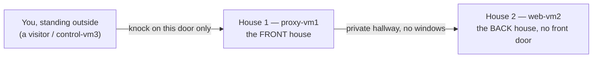

# 00 — Simple Explanation

> [!abstract] What this note is for
> The other notes in this folder are the **evidence** — proof that everything works, written for a trainer who already knows the field. This note is different. This note is for **you**, to actually understand *why* every single line exists, using plain words and analogies, from the very first concept. Nothing here needs to be memorized for a deadline — the deployment is already done and audited. This is just for building the part of your brain that will still understand this stuff five years from now, in a different job, on a system that isn't this one.
>
> Read it in order. Every section builds on the one before it. Whenever you see a `> [!question]-` box, click it open — those are the "wait, but why" moments, answered.

---

## Contents

1. [[#Part 1 — The Big Picture, With No Jargon]]
2. [[#Part 2 — Ansible Vocabulary, In Plain Words]]
3. [[#Part 3 — YAML, the Language Everything Is Written In]]
4. [[#Part 4 — The Project Files, One at a Time, Line by Line]]
5. [[#Part 5 — Milestone 2 — Apache, Line by Line]]
6. [[#Part 6 — Milestone 4 — The Certificate Authority, Line by Line]]
7. [[#Part 7 — Milestone 3 — NGINX, Line by Line]]
8. [[#Part 8 — Milestone 5 — The Client, Line by Line]]
9. [[#Part 9 — Milestone 6 — Why Running It Twice Proves Anything]]
10. [[#Part 10 — The Whole Thing, One More Time, Beginning to End]]
11. [[#Part 11 — Glossary]]

---

## Part 1 — The Big Picture, With No Jargon

### The three-house analogy

Imagine three houses on a street, and you — the homeowner — are not allowed to knock on two of them directly. Here's the street:



- **House 1 (proxy-vm1)** is the only house with a front door facing the street. Anyone visiting has to knock here.
- **House 2 (web-vm2)** has no front door at all — the only way in is through a private hallway that connects it to House 1. Nobody from the street can reach it directly.
- **You (control-vm3)** are the visitor, and also — this is the twist — the person who *built* both houses using instructions, and the person who *made the ID cards* everyone uses to prove the houses are real and safe.

Why build it this way instead of just one house? Because if House 2 (where the actual valuables — the webpage — are kept) never has a front door, nobody can break into it directly. Every visitor has to go through House 1 first, and House 1 can be watched, locked down, and inspected far more easily than trying to guard two open doors.

That's the entire shape of this project. Everything else — the certificates, the automation, the tests — exists to make that one sentence true and *provably* true.

### The three real machines

| In the analogy | Real name | Real job |
| --- | --- | --- |
| The visitor / builder | `control-vm3` | Runs the automation, tests the result, also makes the ID cards (certificates) |
| House 1, front door | `proxy-vm1` | Runs NGINX — the only thing a real client ever talks to |
| House 2, no front door | `web-vm2` | Runs Apache — makes the actual webpage, but is walled off from the outside |

### Why "automation" at all — the recipe-card analogy

Imagine you have to bake the exact same cake in three different kitchens, and you have to do it again next month, and the month after. You have two choices:

1. **Do it by hand every time** — remember every step, every ingredient amount, every oven temperature, for every kitchen. One tired evening, you forget the baking powder in kitchen #2, and nobody notices until the cake collapses.
2. **Write the recipe down once**, in a very precise way, and hand it to a robot that reads it exactly and never skips a step, never gets tired, and — this is the important part — **checks what's already in the kitchen first**, so if the flour is already measured out correctly, it doesn't dump more flour in.

Ansible is that robot. The "recipe" is called a **playbook**. And "checking what's already there first" is called **idempotency** — a word that just means *"doing this again causes no extra harm."* You'll see that word constantly; every time you do, mentally replace it with "the robot checks before it acts."

### Why certificates and "HTTPS" at all — the passport-office analogy

Imagine a small country invents its own passport system, just for itself:

- The country sets up **one passport office** that everyone in the country agrees to trust. That office is the **Root Certificate Authority (Root CA)**.
- When a citizen (in our case, the website `labapp.com`) needs a passport, the passport office checks their details and stamps a passport for them. That stamped passport is the **server certificate**.
- Anyone who trusts *the passport office* automatically trusts *any passport it stamped* — they don't need to personally verify every citizen, just the one office.
- A border guard (your web browser, or `curl`) who has never heard of this passport office would reject the passport as fake. So you have to **tell the border guard, ahead of time, "this specific office is legitimate, trust its stamps."** That's what installing the Root CA into a **trust store** means.
- The passport also has to say exactly *whose* passport it is — in our case, "this passport belongs to `labapp.com`." That's the **Subject Alternative Name (SAN)**. A border guard checks the name on the passport against the name of the person standing in front of them; if they don't match, the passport is rejected even if the office that stamped it is legitimate.

Every single PKI concept in this project — Root CA, server certificate, SAN, trust store, "chain of trust" — is just a more formal way of describing that passport office story.

### Why a "reverse proxy" at all — the hotel-receptionist analogy

Imagine a hotel where guests are never allowed to walk into the kitchen. Instead:

- A guest tells the **receptionist** (NGINX) what they want.
- The receptionist walks down a staff-only hallway (a firewalled, internal-only network) to the **kitchen** (Apache) and places the order.
- The kitchen makes the food and hands it back to the receptionist.
- The receptionist brings it to the guest, at the front desk, and the guest never sees the kitchen at all.

The receptionist is also the only one wearing a name badge the hotel issued (the TLS certificate) — guests check that badge before trusting anything the receptionist says. The kitchen doesn't need a badge, because guests never interact with it directly.

---

## Part 2 — Ansible Vocabulary, In Plain Words

| Fancy term | What it actually means, in one sentence |
| --- | --- |
| **Control node** | The one computer that runs the automation and gives orders. Here: `control-vm3`. |
| **Managed node** | A computer that receives orders and obeys them. Here: `proxy-vm1` and `web-vm2` (and control-vm3 also manages *itself*). |
| **Inventory** | A phone book: the list of every managed computer, its address, and which "team" it belongs to. |
| **Group** | A team name in that phone book — e.g., "everyone who should run NGINX" is the `proxy` group. |
| **Playbook** | The entire, ordered to-do list for the whole day, across every team. |
| **Play** | One chapter of that to-do list, aimed at one team. "Chapter 2: everything the `webserver` team needs to do." |
| **Task** | One single instruction inside a chapter. "Install this package." |
| **Module** | The actual tool used to carry out a task — like `dnf` (the tool for installing packages) or `template` (the tool for filling out a form and delivering it). |
| **Variable** | A sticky note with a value written on it, that many different instructions can look at. Change the sticky note once, everything that reads it changes too. |
| **Template** | A fill-in-the-blank worksheet. The blanks get filled in with variables before the worksheet is delivered to a computer. |
| **Handler** | A special instruction that only runs **if something changed**. "Only mop the floor if you actually spilled something." |
| **Role** | A labeled toolbox containing everything needed for one specific job — its own instructions, its own worksheets, its own "only if messy" rules. |
| **Fact** | Something Ansible learns by looking at a computer itself — its operating system, its IP address — rather than being told. |
| **Idempotent** | "Doing this again causes no extra harm, because it checks first." The single most important word in this whole project. |

> [!question]- Why not just write one giant list of commands instead of all these separate concepts (roles, plays, handlers...)?
> You *could* — and that's actually what the very first rough draft of this project looked like (a to-do list of nothing but "ping this machine"). The problem shows up the moment something needs to be reused, changed, or debugged. If "install NGINX" is written out in five different places because five different files needed it, and you find a mistake, you now have to fix it in five places and hope you didn't miss one. A **role** exists so "everything about NGINX" lives in exactly one folder. A **variable** exists so a value like the domain name is typed once. A **handler** exists so a service doesn't restart 50 times a day for no reason. Every one of these concepts exists to solve a real, specific headache — not to make things fancier than they need to be.

---

## Part 3 — YAML, the Language Everything Is Written In

Ansible files (except `ansible.cfg`) are written in **YAML** ("Yet Another Markup Language" — yes, the name is a joke about how many of these formats already existed). YAML's entire job is to describe **lists** and **key-value pairs** using indentation instead of curly braces or tags. Here is everything you actually need to know:

```yaml
# A key-value pair: the "key" is on the left, the "value" is on the right
domain_name: "labapp.com"

# A list of things, written with a dash before each item
colors:
  - red
  - green
  - blue

# A "map" (a group of related key-value pairs), shown by indenting
person:
  name: Hans
  role: trainee

# Indentation is not decoration — it is the ONLY thing that says
# "this belongs inside that." Two spaces is the convention here.
# A tab character will break it. This trips up almost everyone once.
```

Ansible task files are just lists of maps — every `- name: ...` you see is one item in a list, and everything indented under it is that item's details:

```yaml
- name: Install Apache        # this whole block is ONE task
  ansible.builtin.dnf:        # "dnf" is the tool being used
    name: httpd                #   ...and this is an argument to that tool
    state: present              #   ...and so is this
```

Read it out loud as: *"Here is a task named 'Install Apache.' Use the `dnf` tool. Tell it the package name is `httpd`, and the desired state is `present` (installed)."*

`{{ double curly braces }}` are how a **variable** gets substituted in. `{{ domain_name }}` means "put whatever `domain_name` is currently set to, right here." This is called **Jinja2 templating**, and it works both inside `.yml` files and inside `.j2` template files.

---

## Part 4 — The Project Files, One at a Time, Line by Line

### 4.1 `ansible.cfg` — the settings note stuck to the front of the recipe book

```ini
[defaults]
inventory = ./inventory/hosts.yml
roles_path = ./roles
collections_path = ./collections
remote_user = root
forks = 5
host_key_checking = True
retry_files_enabled = False
interpreter_python = auto_silent
callback_result_format = yaml

[privilege_escalation]
become = True
become_method = sudo
become_user = root
become_ask_pass = False
```

| Line | In plain words |
| --- | --- |
| `inventory = ./inventory/hosts.yml` | "The phone book is in this exact file. Don't guess." |
| `roles_path = ./roles` | "The toolboxes (roles) are in this folder." |
| `collections_path = ./collections` | "Extra tools we downloaded live here, not in some system-wide folder." |
| `remote_user = root` | "When you log into a managed computer, log in as `root`." |
| `forks = 5` | "You're allowed to talk to up to 5 computers at the exact same time." (We only have 3, so this never becomes a limit here.) |
| `host_key_checking = True` | "Double-check that each computer really is who it claims to be before talking to it" — the same warning SSH gives you the first time you connect somewhere new. |
| `retry_files_enabled = False` | "Don't leave behind little `.retry` leftover files when something fails." Housekeeping. |
| `interpreter_python = auto_silent` | "Use whatever Python is on the managed computer, and don't nag me about which one you picked." |
| `callback_result_format = yaml` | "When you print results to my screen, use the readable, indented format — not a single ugly wall of text." |
| `become = True` / `become_method = sudo` | "Whatever the task needs to do, do it with administrator power, using `sudo` to get it." |

> [!question]- If `remote_user` is already `root`, why does `become = True` matter at all?
> Right now, it doesn't change behavior — logging in as root already has full power, so "becoming root" from root is a no-op. It's there for the future: if this project ever switches to logging in as an ordinary, less powerful user (which is what real production systems do, for security), `become: True` is already the switch that says "escalate to root for tasks that need it." Nothing else in the project would need to change.

### 4.2 `inventory/hosts.yml` — the phone book

```yaml
all:
  children:
    proxy:
      hosts:
        proxy-vm1:
          ansible_host: 192.168.100.41
    webserver:
      hosts:
        web-vm2:
          ansible_host: 192.168.100.42
    client:
      hosts:
        control-vm3:
          ansible_host: 127.0.0.1
          ansible_connection: local
    pki_ca:
      hosts:
        control-vm3:
    lab:
      children:
        proxy:
        webserver:
        client:
```

Read this top to bottom as nested boxes, like Russian dolls:

- `all` is the biggest box — literally every computer, always.
- Inside it, `children` lists smaller boxes (groups).
- `proxy` is a small box containing one computer, `proxy-vm1`, whose address is `192.168.100.41`.
- `client` is a small box containing `control-vm3` — but notice its address is `127.0.0.1` (a computer's own "this is me" address) and it has `ansible_connection: local`, meaning: *"don't SSH anywhere for this one — you're already standing on it, just run the instructions directly."*
- `pki_ca` is its own box, and it also contains `control-vm3` — a computer is allowed to be a member of more than one box at once, the same way a person can be both "on the soccer team" and "in the choir."
- `lab` is a box that doesn't list any computers directly — it just says "my members are the proxy box, the webserver box, and the client box combined." It's a box made of other boxes, used whenever you need to say "everyone."

> [!question]- Why does `control-vm3` need to be in two separate boxes (`client` and `pki_ca`) instead of one?
> Because they mean two *different things that happen to be true about the same computer right now*. `client` means "this machine should get the test-client setup (the trusted certificate, the hosts-file entry)." `pki_ca` means "this machine is where the certificate factory lives." Today, both happen to be true of `control-vm3`. If someone later built a fourth machine dedicated only to being the certificate factory, you'd just move the `pki_ca` line to it — nothing else in the whole project would need to change, because every file that cares about "where's the CA" asks the `pki_ca` group, not a hardcoded machine name.

### 4.3 `group_vars/all.yml` — sticky notes everyone can read

```yaml
domain_name: "labapp.com"
proxy_http_port: 80
proxy_https_port: 443
backend_port: 8080

proxy_address:   "{{ hostvars[groups['proxy'][0]]['ansible_host'] }}"
backend_address: "{{ hostvars[groups['webserver'][0]]['ansible_host'] }}"

webpage_title: "AirNav DAS - System Discovery Platform"
webpage_marker: "DEPLOYED-BY-ANSIBLE"

pki_dir: "/root/lab-pki"
pki_org: "AirNav FCO Engineering"
pki_ou: "DAS Lab"
pki_country: "PH"
pki_state: "Western Visayas (Region VI)"
pki_city: "Iloilo"
root_ca_common_name: "AirNav DAS Lab Root CA"
root_ca_valid_days: 3650
server_cert_valid_days: 199

root_ca_cert_file: "{{ pki_dir }}/root-ca.crt"
server_cert_file:  "{{ pki_dir }}/{{ domain_name }}.crt"
server_key_file:   "{{ pki_dir }}/{{ domain_name }}.key"
```

Every line here is a sticky note with a name and a value. The two interesting ones are `proxy_address` and `backend_address` — they don't have a plain value, they have a little formula instead:

```
"{{ hostvars[groups['proxy'][0]]['ansible_host'] }}"
```

Read this from the inside out, like peeling an onion:

1. `groups['proxy']` — "look in the phone book, find the box named `proxy`." That gives you a list of computer names in that box: `['proxy-vm1']`.
2. `groups['proxy'][0]` — "take the first name in that list" (lists start counting from 0, so `[0]` means "the first one"). That gives you `proxy-vm1`.
3. `hostvars['proxy-vm1']` — "look up everything known about the computer named `proxy-vm1`."
4. `hostvars['proxy-vm1']['ansible_host']` — "and specifically, what address did the phone book give for it?" That gives you `192.168.100.41`.

So this whole formula means: **"whatever address the phone book lists for the proxy computer, that's what `proxy_address` equals."** Nobody had to type `192.168.100.41` a second time anywhere. If the proxy ever moved to a new address, you'd change it in the phone book (`inventory/hosts.yml`) once, and this sticky note updates itself automatically the next time the playbook runs.

The three PKI file-path lines at the bottom (`root_ca_cert_file`, `server_cert_file`, `server_key_file`) are just building full file paths out of smaller pieces, the same way you might write "my file will be at `/home/`, plus `my_name`, plus `/notes.txt`."

### 4.4 `group_vars/proxy.yml`, `webserver.yml`, `client.yml` — sticky notes for one team only

```yaml
# proxy.yml — only proxy-vm1 reads these
nginx_tls_dir: "/etc/pki/nginx"
nginx_cert_path:  "{{ nginx_tls_dir }}/{{ domain_name }}.crt"
nginx_key_path:   "{{ nginx_tls_dir }}/private/{{ domain_name }}.key"
nginx_chain_path: "{{ nginx_tls_dir }}/root-ca.crt"
nginx_ssl_protocols: "TLSv1.2 TLSv1.3"
```

```yaml
# webserver.yml — only web-vm2 reads these
apache_document_root: "/var/www/html"
apache_vhost_file: "/etc/httpd/conf.d/{{ domain_name }}.conf"
```

```yaml
# client.yml — only control-vm3 (as a client) reads this
client_trust_anchor: "/etc/pki/ca-trust/source/anchors/airnav-das-lab-root-ca.crt"
```

Think of `group_vars/all.yml` as a notice board in the building lobby everyone walks past, and these three files as notice boards inside each team's own break room — only that team needs to see them, so there's no reason to clutter the lobby with it.

### 4.5 `host_vars/web-vm2.yml` — a sticky note for exactly one computer

```yaml
webpage_message: "Served by Apache on web-vm2 through the NGINX reverse proxy."
```

This is the most specific level of all — a note taped directly to one specific desk, not the break room, not the lobby. If a second web server ever joined the team, it would get its own `host_vars/web-vm3.yml` with its own message, and nobody's note would interfere with anybody else's.

> [!question]- What happens if the SAME sticky-note name shows up in more than one of these files?
> The most specific one wins. This is called **variable precedence**, and it's exactly like a dress code: a company-wide policy ("business casual") can be overridden by a specific department's stricter rule ("lab coats required"), which can be overridden by a specific person's own doctor's note ("no lab coat, allergic"). The individual, most specific rule always wins over the general one. [[Milestone 1 — Project Hangar#1.4 Variables and precedence|The exact order is written out here]].

### 4.6 `collections/requirements.yml` — the shopping list for extra tools

```yaml
collections:
  - name: ansible.posix
    version: ">=1.5.4,<1.6.0"
  - name: community.crypto
    version: ">=2.15.0,<3.0.0"
```

Ansible comes with a basic toolbox out of the box (`ansible.builtin`), but it doesn't know how to touch a firewall or build a certificate on its own — those are specialty tools you have to order separately, called **collections**. This file is the exact order form: which specialty toolbox, and which version range, so that anyone running this project gets the *same* tools, not whatever happens to be newest on the day they install it.

> [!question]- Why pin a version range instead of just "give me the latest one"?
> Because "latest" changes underneath you without warning. This project actually hit that exact problem: the newest `ansible.posix` (version 1.6) printed a warning that it doesn't support the Ansible version installed here, and could have broken silently in the future. Pinning `<1.6.0` says "I've tested against this range, stay here until someone deliberately checks the next version and updates the pin."

### 4.7 `site.yml` — the master to-do list, in five chapters

```yaml
- name: "Play 0 | Pre-flight checks on every lab host"
  hosts: lab
  gather_facts: true
  tasks:
    - name: Refuse to run on an unsupported OS
      ansible.builtin.assert:
        that:
          - ansible_facts['os_family'] == 'RedHat'
          - ansible_facts['distribution_major_version'] == '9'
        fail_msg: "..."
    - name: Refuse to run with missing or malformed key variables
      ansible.builtin.assert:
        that:
          - domain_name is match('^[a-z0-9.-]+$')
          - backend_port | int > 0
          - proxy_https_port | int > 0
        fail_msg: "..."

- name: "Play 1 | Internal PKI on the control node"
  hosts: pki_ca
  roles: [{ role: pki_ca, tags: [pki] }]

- name: "Play 2 | Apache backend"
  hosts: webserver
  roles: [{ role: apache_web, tags: [apache] }]

- name: "Play 3 | NGINX reverse proxy with HTTPS"
  hosts: proxy
  roles: [{ role: nginx_proxy, tags: [nginx] }]

- name: "Play 4 | Client name resolution, trust and end-to-end verification"
  hosts: client
  roles:
    - { role: client_trust, tags: [client] }
    - { role: verify, tags: [verify] }
```

Think of this as a **table of contents for the whole day**, and each `- name: "Play ..."` is one chapter:

- **Chapter 0** happens on `lab` — remember, that's the box made of every other box, so this chapter runs on *all three machines*. Before doing anything real, it checks two things and **refuses to continue** if either is wrong:
  1. Is this really the operating system this project was built for? (`ansible_facts['os_family'] == 'RedHat'` — a *fact*, remember, is something Ansible learned by actually looking at the machine, not something we told it.)
  2. Do the important settings actually make sense — is the domain name a real-looking name, are the ports positive numbers?
  
  `assert` is the module doing the checking — it's the module whose entire job is "check this condition, and if it's false, stop everything and explain why," rather than silently limping forward with broken settings.

- **Chapter 1** happens only on the `pki_ca` box — remember, that's just `control-vm3` right now. It runs the `pki_ca` role — meaning "open that toolbox and do everything inside it."

- **Chapters 2, 3, 4** each open one more toolbox, on the team that toolbox belongs to.

The `tags: [pki]`, `tags: [apache]`, and so on are like labels on the toolboxes that let you say later, "just open the NGINX toolbox by itself" (`ansible-playbook site.yml --tags nginx`), without running the whole day's chapters.

> [!question]- Why does Chapter 0 run `gather_facts: true` but the later chapters don't?
> "Gathering facts" means Ansible actually connects to a machine and asks it questions — what's your operating system, what's your IP address, and so on. That's a real trip that takes a moment. Since Chapter 0 already visited every machine and asked, Ansible remembers the answers for the rest of the run — asking again in every later chapter would just be the same trip for no new information, so `gather_facts: false` in Chapters 1–4 means "don't bother, I already know."

---

## Part 5 — Milestone 2 — Apache, Line by Line

Full file recap in [[Milestone 2 — Web Server Role]]. Here, every single task gets the ELI5 treatment.

```yaml
- name: Install Apache
  ansible.builtin.dnf:
    name: "{{ apache_package }}"
    state: present
```
**In plain words:** "Check if the `httpd` program is installed. If it's not, install it. If it already is, do nothing — don't even bother re-downloading it." `dnf` is AlmaLinux's package installer, the same kind of tool as an app store, just for a server instead of a phone.

```yaml
- name: Set the Apache listen port (validated before it is written)
  ansible.builtin.lineinfile:
    path: /etc/httpd/conf/httpd.conf
    regexp: '^Listen\s'
    line: "Listen {{ backend_port }}"
    validate: httpd -t -f %s
  notify: Reload Apache
```
**In plain words:** Apache normally answers on "door number 80" by default. This task finds the one line in its settings file that says which door to use, and changes it to door **8080** instead — but *before* saving that change, it hands the almost-changed file to Apache's own checker (`httpd -t -f %s`) and asks "would this still make sense?" Only if the answer is yes does it actually save. `notify: Reload Apache` means: "if this line actually needed changing, remind Apache about it afterward" — that's a handler being called.

Think of `regexp` and `line` as: "find the line that *looks like this* (starts with the word `Listen`), and replace the whole thing with *this instead*." Nothing else in that big settings file gets touched.

```yaml
- name: Deploy the backend virtual host
  ansible.builtin.template:
    src: vhost.conf.j2
    dest: "{{ apache_vhost_file }}"
    mode: "0644"
  notify: Reload Apache
```
**In plain words:** Take the fill-in-the-blank worksheet called `vhost.conf.j2`, fill in all its blanks using the current sticky notes (variables), and deliver the finished worksheet to the exact file path stored in `apache_vhost_file`. `mode: "0644"` is a **permission** setting — a code that means "the owner can read and write it, everyone else can only read it, nobody but the owner can run it as a program." You'll see permission codes like this a lot; think of them as a lock with three different keys: one for you, one for your group, one for everybody else.

```yaml
- name: Deploy the managed webpage
  ansible.builtin.template:
    src: index.html.j2
    dest: "{{ apache_document_root }}/index.html"
    mode: "0644"
```
**In plain words:** Same idea, different worksheet — this one fills in the actual webpage. Notice: **no `notify:` here.** That's on purpose — a webpage file doesn't need Apache "told about it," because Apache re-reads that file fresh every single time someone visits. Only *settings* files need a reload; plain content doesn't.

```yaml
- name: Allow the backend port ONLY from the reverse proxy
  ansible.posix.firewalld:
    rich_rule: >-
      rule family="ipv4" source address="{{ proxy_address }}/32"
      port port="{{ backend_port }}" protocol="tcp" accept
    permanent: true
    immediate: true
    state: enabled
```
**In plain words:** This is building a locked door with a peephole that only opens for one specific visitor. `source address="{{ proxy_address }}/32"` means "only traffic that came from the proxy's exact address" (the `/32` is a technical way of saying "this one exact address, not a whole neighborhood of addresses"). `port port="8080" protocol="tcp"` means "and only if it's knocking on door 8080." `accept` means "if both of those are true, let it in" — everyone else gets turned away automatically. `permanent: true` means "keep this rule even after a reboot," and `immediate: true` means "also apply it right now, don't make me restart anything to see the effect."

```yaml
- name: Ensure Apache is enabled at boot and running
  ansible.builtin.service:
    name: "{{ apache_service }}"
    state: started
    enabled: true
```
**In plain words:** Two separate promises in one task — `state: started` means "it should be running *right now*," and `enabled: true` means "and it should *start itself automatically* the next time this computer reboots," the same way you might flip a light switch on (`started`) while also making sure the switch is wired to turn on automatically every morning (`enabled`).

```yaml
- name: Apply pending Apache reloads before testing
  ansible.builtin.meta: flush_handlers
```
**In plain words:** Normally, "only if something changed" reminders (handlers) wait patiently until the very end of the whole chapter before they run. This task is a shortcut that says "actually, run any pending reminders **right now**, don't wait" — because the very next task needs Apache to already be using its newest settings.

```yaml
- name: Backend verification
  when: not ansible_check_mode
  tags: [verify]
  block:
    - name: Verify the page locally on the web server
      ansible.builtin.uri:
        url: "http://127.0.0.1:{{ backend_port }}/"
        return_content: true
      register: apache_local
      failed_when: webpage_marker not in apache_local.content
    - name: Show backend verification result
      ansible.builtin.debug:
        msg: "..."
```
**In plain words:** A `block:` is just a way of grouping several tasks together so you can apply one rule to all of them at once — here, `when: not ansible_check_mode` means "skip this entire group during a dry run, since there's nothing real to check yet." Inside it: visit the webpage yourself, from the same machine, save what came back into a labeled box called `apache_local` (that's what `register` does — "keep the result of this task in a box with this name so a later task can look inside it"), and then **fail on purpose** if the secret marker word isn't found in what came back. `debug` at the end just prints a friendly message so a human reading the output doesn't have to guess whether it worked.

### The handlers file

```yaml
- name: Validate Apache configuration
  ansible.builtin.command: httpd -t
  changed_when: false
  listen: Reload Apache

- name: Reload Apache service
  ansible.builtin.service:
    name: "{{ apache_service }}"
    state: reloaded
  listen: Reload Apache
```
**In plain words:** Both of these answer to the same name, `Reload Apache` — that's what `listen:` does. When any task earlier says `notify: Reload Apache`, **both** of these fire, **in the order they're written here** (top to bottom in the file, not the order they got notified). So it always double-checks the settings are valid first, and only *then* actually reloads. `changed_when: false` on the first one means "even though this ran a command, don't count it as 'changing' anything" — it's a check, not an action.

### The two templates, as fill-in-the-blank worksheets

`vhost.conf.j2` and `index.html.j2` both live in a `templates/` folder, and both contain ordinary text with `{{ blanks }}` scattered through it. When Ansible delivers them, every `{{ blank }}` gets replaced with the current value of that sticky note. That's the entire trick behind a template — it's not magic, it's "find and replace," just done automatically and safely.

---

## Part 6 — Milestone 4 — The Certificate Authority, Line by Line

Back to the passport-office analogy from Part 1. This role has exactly two "customers": the Root CA itself (which issues its own passport, since nobody exists above it to issue one *to* it), and the server certificate for `labapp.com` (whose passport the Root CA issues).

```yaml
- name: Create the CA working directory (root-only)
  ansible.builtin.file:
    path: "{{ pki_dir }}"
    state: directory
    mode: "0700"
```
**In plain words:** Build a locked filing cabinet (`/root/lab-pki`) before anything gets put in it. `mode: "0700"` is a permission code meaning "only the owner can even open this drawer — not their group, not anyone else." This is the strictest lock code you'll see in the whole project, because this drawer will hold private keys.

```yaml
- name: Generate the Root CA private key
  community.crypto.openssl_privatekey:
    path: "{{ pki_dir }}/root-ca.key"
    type: RSA
    size: "{{ root_ca_key_size }}"
    mode: "0600"
```
**In plain words:** A "private key" is like a very special signature stamp that can never be copied or faked, and only the office holding it can use it to stamp something official. `type: RSA` and `size: 4096` describe *how strong* the stamp's lock mechanism is — a bigger number means a lock that would take dramatically longer to pick by brute force. `mode: "0600"` means "only the owner can even read this file, not even their own group" — one notch stricter than the folder itself, because a key is the single most sensitive thing in this entire project.

```yaml
- name: Create the Root CA signing request (CA extensions)
  community.crypto.openssl_csr:
    path: "{{ pki_dir }}/root-ca.csr"
    privatekey_path: "{{ pki_dir }}/root-ca.key"
    common_name: "{{ root_ca_common_name }}"
    organization_name: "{{ pki_org }}"
    country_name: "{{ pki_country }}"
    basic_constraints: ["CA:TRUE", "pathlen:0"]
    basic_constraints_critical: true
    key_usage: [keyCertSign, cRLSign]
    key_usage_critical: true
```
**In plain words:** Before you can stamp a passport, you fill out an *application form* describing exactly what kind of passport this should be. That's what a **CSR** (Certificate Signing Request) is. This particular application says:
- "This will be the passport OFFICE itself, not a regular citizen" (`CA:TRUE`)
- "...and this office is not allowed to open a franchise office under itself" (`pathlen:0` — no sub-offices)
- "...and this office may only ever be used to stamp other passports or say 'this passport is no longer valid,' nothing else" (`keyCertSign, cRLSign`)
- `_critical: true` on both of those means: "this rule is not optional — any border guard who doesn't understand it must reject the passport entirely, rather than shrug and ignore the rule they don't recognize." It's the difference between a suggestion and a hard requirement.

```yaml
- name: Self-sign the Root CA certificate
  community.crypto.x509_certificate:
    path: "{{ root_ca_cert_file }}"
    csr_path: "{{ pki_dir }}/root-ca.csr"
    privatekey_path: "{{ pki_dir }}/root-ca.key"
    provider: selfsigned
    selfsigned_not_after: "+{{ root_ca_valid_days }}d"
```
**In plain words:** Take that filled-out application, and stamp it using **its own** stamp (`provider: selfsigned`) — because nobody exists above the Root CA to stamp it for it; it has to vouch for itself, which is exactly why everyone has to be *told* to trust it rather than figuring it out automatically. `selfsigned_not_after: "+3650d"` means "this passport expires 3,650 days (10 years) from today."

The **server certificate** for `labapp.com` follows the exact same three-step dance (key → application form → stamp), with three differences that matter a lot:

```yaml
    subject_alt_name: ["DNS:{{ domain_name }}"]
    basic_constraints: ["CA:FALSE"]
    key_usage: [digitalSignature, keyEncipherment]
    extended_key_usage: [serverAuth]
```
- `subject_alt_name: ["DNS:labapp.com"]` — this is the actual name printed on the passport photo page. A border guard checks *this* against the name of the person standing in front of them, never the office's own name.
- `CA:FALSE` — "this passport holder is a regular citizen, not an office. They may never stamp anyone else's passport."
- `serverAuth` — "this passport may only be used to prove 'I am a website server,' nothing else" (a passport meant for one specific purpose, like a work visa instead of a full passport).

```yaml
- name: Sign the server certificate with the Root CA
  community.crypto.x509_certificate:
    provider: ownca
    ownca_path: "{{ root_ca_cert_file }}"
    ownca_privatekey_path: "{{ pki_dir }}/root-ca.key"
    ownca_not_after: "+{{ server_cert_valid_days }}d"
```
**In plain words:** This time, `provider: ownca` means "don't stamp this with its own stamp — stamp it using the *Root CA's* stamp instead" (`ownca_path` and `ownca_privatekey_path` point at the Root CA's own passport and its own private stamp). This is the literal moment the "chain of trust" is created: this certificate, from now on, carries proof that the Root CA specifically vouched for it.

```yaml
- name: Verify the server certificate chains to the Root CA
  ansible.builtin.command: openssl verify -CAfile {{ root_ca_cert_file }} {{ server_cert_file }}
  changed_when: false
```
**In plain words:** This is the border guard's own math check — "does the signature on this passport actually match a real stamp from this specific office?" `changed_when: false` means "this is just a check, not something that modifies anything, so don't count it as a change" — same idea as the Apache config check earlier.

> [!question]- If the Root CA's key is "never copied or faked," what actually stops someone from stealing the file and making fake passports themselves?
> Nothing about the math stops them — a stolen private key file is just as usable to an attacker as it is to the real owner. That's *entirely* why this project locks it in a `0700` folder with `0600` file permissions, readable only by `root` on one specific machine. The security of the whole system rests on that one file never leaving that one folder. A real production CA takes this much further — keeping the Root CA's key on a device that's physically disconnected from any network most of the time. See [[Milestone 4 — Trust#Remaining limitations|the limitations section]] for how this project is intentionally simpler than that, for lab purposes.

---

## Part 7 — Milestone 3 — NGINX, Line by Line

Back to the hotel-receptionist analogy.

```yaml
- name: Install NGINX and the SELinux Python bindings used by seboolean
  ansible.builtin.dnf:
    name:
      - "{{ nginx_package }}"
      - python3-libsemanage
```
**In plain words:** Same idea as installing Apache, except this time it's a **list** of two things to install at once (notice the two `- ` dashes under `name:`). The second item, `python3-libsemanage`, isn't NGINX at all — it's a helper tool needed later in this same file, for a completely different task. This is a good example of "install everything a later step will need, right at the start" rather than discovering the gap halfway through.

```yaml
- name: Create the TLS directories
  ansible.builtin.file:
    path: "{{ item.path }}"
    state: directory
    mode: "{{ item.mode }}"
  loop:
    - { path: "{{ nginx_tls_dir }}", mode: "0755" }
    - { path: "{{ nginx_tls_dir }}/private", mode: "0700" }
```
**In plain words:** `loop:` means "repeat this exact same task once for each item in this list." Instead of writing the same "create a folder" task twice with slightly different details, you write it *once* and hand it a list of two folders to build — a public one that anyone can look inside (`0755`), and a private one that only the owner can even open (`0700`), for the same reason the certificate authority's own folder was locked down: one of these will soon hold a private key.

```yaml
- name: Deploy the server certificate and the CA chain
  ansible.builtin.copy:
    src: "{{ item.src }}"
    dest: "{{ item.dest }}"
    mode: "0644"
  loop:
    - { src: "{{ server_cert_file }}", dest: "{{ nginx_cert_path }}" }
    - { src: "{{ root_ca_cert_file }}", dest: "{{ nginx_chain_path }}" }
```
**In plain words:** This is the one moment in the entire project where a file physically travels from **one computer to another**. `src:` is read from `control-vm3` (where the certificate factory lives), and `dest:` is written on `proxy-vm1`. Everywhere else in this project, files are generated fresh on the same machine that uses them — this is the exception, because the certificate was born somewhere else and needs to be *delivered* here.

```yaml
- name: Deploy the server private key
  ansible.builtin.copy:
    src: "{{ server_key_file }}"
    dest: "{{ nginx_key_path }}"
    mode: "0600"
  no_log: true
```
**In plain words:** Same idea, but for the private key specifically — locked down to `0600` (owner-only) the instant it lands, and `no_log: true` means "never print this task's details to the screen or a log file, even if something goes wrong" — a safety net so a private key can never accidentally end up visible in a terminal transcript someone might screenshot or paste somewhere.

```yaml
- name: Deploy nginx.conf (validated with nginx -t before it replaces the live file)
  ansible.builtin.template:
    src: nginx.conf.j2
    dest: /etc/nginx/nginx.conf
    validate: nginx -t -c %s
```
**In plain words:** Same fill-in-the-blank idea from Apache, but this file is the **entire** settings file for NGINX, not just one small piece — every server behavior in this project (the redirect, the HTTPS server, the forwarding rules) lives in this one worksheet. `validate: nginx -t -c %s` means: "before saving this over the real file, hand the *almost-saved* version to NGINX's own checker and ask 'would you actually start up correctly with this?' — only overwrite the real file if the answer is yes."

```yaml
- name: Open HTTP and HTTPS in firewalld
  ansible.posix.firewalld:
    port: "{{ item }}/tcp"
    state: enabled
  loop:
    - "{{ proxy_http_port }}"
    - "{{ proxy_https_port }}"
```
**In plain words:** Unlike Apache's locked, one-visitor-only door, these two doors (80 and 443) are meant to be public — this is the "front desk," remember, so anyone should be able to walk up and knock.

```yaml
- name: Allow NGINX to open connections to the backend (SELinux)
  ansible.posix.seboolean:
    name: httpd_can_network_relay
    state: true
    persistent: true
```
**In plain words:** This one needs its own little story. AlmaLinux has an extra security guard on top of the firewall, called **SELinux**, whose entire job is to say "even if you're allowed *in the door*, are you allowed to do *this specific thing* once you're inside?" By default, SELinux does NOT let a web server program open its own outgoing connection to somewhere else — even though NGINX's whole job here is exactly that (calling the kitchen). This task is the specific permission slip that says "yes, this particular kind of program is allowed to relay a connection like this." It's deliberately the *narrowest* permission slip that works — there's a much broader one (`httpd_can_network_connect`) that would also work, but would allow far more than NGINX actually needs, the same way you'd hand someone a key to one specific room instead of a master key to the whole building, even though the master key would also technically open that one room.

```yaml
- name: Full path through NGINX on this host (HTTPS -> Apache)
  ansible.builtin.uri:
    url: "https://127.0.0.1:{{ proxy_https_port }}/"
    headers:
      Host: "{{ domain_name }}"
    validate_certs: false
```
**In plain words:** This test deliberately says `validate_certs: false` — meaning "don't bother checking whether this certificate is trustworthy, I already know it's *technically correct* from Milestone 4, I just want to know whether NGINX successfully forwards the request to Apache and back." Checking whether a *client* trusts it is a completely different question, saved for Milestone 5 on purpose — this test's whole job is narrower than that.

### The NGINX config template, piece by piece

```nginx
upstream apache_backend {
    server {{ backend_address }}:{{ backend_port }};
}
```
**In plain words:** "Give a nickname, `apache_backend`, to 'the kitchen,' whose actual address is filled in from the sticky notes." Everywhere else in this file that says `apache_backend`, it really means "whatever address and port the phone book says web-vm2 is at."

```nginx
server {
    listen      {{ proxy_http_port }};
    server_name {{ domain_name }};
    return 301 https://$host$request_uri;
}
```
**In plain words:** "Anyone who knocks on door 80 asking for `labapp.com` gets told, politely but firmly, 'go to the HTTPS door instead' — here's the exact address to go to." `301` is a numbered code meaning "this redirect is permanent, remember it for next time" (as opposed to a temporary one).

```nginx
server {
    listen      {{ proxy_https_port }} ssl;
    server_name {{ domain_name }};
    ssl_certificate     {{ nginx_cert_path }};
    ssl_certificate_key {{ nginx_key_path }};

    location / {
        proxy_pass http://apache_backend;
        proxy_set_header Host              $host;
        proxy_set_header X-Real-IP         $remote_addr;
        proxy_set_header X-Forwarded-For   $proxy_add_x_forwarded_for;
        proxy_set_header X-Forwarded-Proto $scheme;
    }
}
```
**In plain words:** "On door 443, use TLS (the `ssl` keyword), and present *this specific* passport and stamp when asked (`ssl_certificate`/`ssl_certificate_key`). For any request that arrives here, forward it to the kitchen nickname we set up earlier, but attach four little notes to the order first" — those `proxy_set_header` lines are literally sticky notes attached to the order ticket, so the kitchen (which never sees the actual guest) still knows: who the real guest is (`X-Real-IP`, `X-Forwarded-For`), what they originally asked for (`Host`), and whether they arrived securely (`X-Forwarded-Proto`). Without these notes, Apache would only ever see "an order came from the receptionist" and nothing about the real guest at all.

---

## Part 8 — Milestone 5 — The Client, Line by Line

```yaml
- name: Map {{ domain_name }} to the NGINX proxy in /etc/hosts
  ansible.builtin.lineinfile:
    path: /etc/hosts
    regexp: '^\S+\s+{{ domain_name | regex_escape }}$'
    line: "{{ proxy_address }} {{ domain_name }}"
    backup: true
```
**In plain words:** `/etc/hosts` is a computer's own tiny personal phone book — before it ever asks the internet "where does `labapp.com` live," it checks this file first. This task finds (or adds) exactly one line, the one that ends in `labapp.com`, and sets it to point at the proxy's address. The `regexp` pattern is precise on purpose: `^\S+` means "some non-space characters at the start of the line" (the old address, whatever it was), `\s+` means "then some spaces," and `{{ domain_name }}$` means "then our domain name, and *nothing else*, right up to the end of the line." That precision is what guarantees every *other* line in the file — `localhost`, other computers' names — is left completely alone. `backup: true` means "before changing anything, save a timestamped copy of the whole file first," just in case.

```yaml
- name: Place the Root CA in the system trust anchors
  ansible.builtin.copy:
    src: "{{ root_ca_cert_file }}"
    dest: "{{ client_trust_anchor }}"
  notify: Update CA trust
```
**In plain words:** This is the literal moment from the passport-office analogy where you tell the border guard "this office is legitimate, from now on." The certificate file itself gets copied into a specific folder the operating system watches (`/etc/pki/ca-trust/source/anchors/`), and then a handler is notified to actually *update the guard's rulebook* — because just leaving the file in the folder isn't enough on its own, the next task explains why.

```yaml
- name: Update CA trust
  ansible.builtin.command: update-ca-trust extract
  changed_when: true
```
**In plain words:** The operating system doesn't re-read that folder every time it needs to check a certificate — that would be slow. Instead, it keeps a **pre-compiled summary** of everyone it trusts, rebuilt only when told to. `update-ca-trust extract` is the command that says "rebuild that summary now, using everything currently in the trusted folder." `changed_when: true` here is interesting — normally Ansible decides on its own whether something "changed," but a plain command like this one can't be inspected that way, so this line tells Ansible: "trust me, if this handler runs at all, count it as a real change" (which is true — it only ever runs when the certificate file itself actually changed, since it's a handler).

```yaml
- name: Resolve {{ domain_name }} through the system resolver (/etc/hosts first)
  ansible.builtin.command: getent hosts {{ domain_name }}
  failed_when: verify_dns.stdout.split()[0] | default('') != proxy_address
```
**In plain words:** `getent hosts` is asking the computer, using the *exact same method* every real program uses (not a special shortcut), "if I wanted to reach `labapp.com` right now, where would I actually be sent?" `.stdout.split()[0]` takes the text answer that came back and grabs just the first word of it (the address), and compares it against what we expect. This is deliberately a stronger test than typing `ping labapp.com` yourself, because it proves the *real resolution path* works, not just that the name exists somewhere.

```yaml
- name: HTTPS with FULL certificate validation returns the managed page
  ansible.builtin.uri:
    url: "{{ verify_url }}"
    validate_certs: true
    return_content: true
  failed_when: >-
    webpage_marker not in verify_https.content or
    verify_https.x_backend_server | default('') != groups['webserver'][0]
```
**In plain words:** This is the test from Milestone 3 finally run *for real*, with `validate_certs: true` this time instead of `false` — meaning "actually check the passport, the way a real border guard would: is the signature genuine, is the office trusted, does the name match?" And then, on top of that, it checks two more things about the actual content that came back: does it contain our secret marker word, *and* does the `X-Backend-Server` header say it really came from `web-vm2` specifically (not some other, wrong machine)? Both conditions must be satisfied, or the whole check fails.

---

## Part 9 — Milestone 6 — Why Running It Twice Proves Anything

Go back to the recipe-robot analogy from Part 1. Imagine you hand the robot the same recipe card twice, one after another, for the same kitchen that's already perfectly set up:

- **First time:** the robot measures flour, cracks eggs, preheats the oven — a lot of visible activity, because the kitchen started out empty.
- **Second time:** the robot walks in, looks at the counter, sees the flour is already measured, the eggs are already cracked, the oven is already at the right temperature — and does **nothing**, because every single thing it would have done is already exactly done.

That's what `changed=0` on the second run actually means, in the recipe language: **not** "the robot got lazy," but "the robot checked every single thing, one at a time, and every single thing was already correct." That's a much stronger statement than it sounds like at first.

Now imagine someone sneaks into the kitchen between the robot's visits and, by hand, swaps the sugar for salt. The next time the robot walks the exact same recipe card, it checks the sugar container, notices "this doesn't match what the recipe says," and fixes **only that one thing** — it doesn't re-crack the eggs or re-preheat the oven, because those are still fine. That's exactly what happened in this project's real drift test: someone (deliberately, as a test) changed one number in NGINX's settings by hand, and re-running the exact same command fixed *only* that one file and reloaded *only* that one service — nothing else was touched, because nothing else was actually wrong.

And the very last piece — the "validation guard" — is like the robot **reading the recipe card itself out loud before starting**, and refusing to even pick up a single ingredient if the recipe card has an obvious mistake on it, like "bake at -400 degrees." It's a completely different kind of safety than the sugar/salt story: that one catches a person going around the recipe; this one catches a mistake *inside* the recipe itself, before it ever reaches the kitchen.

[[Milestone 6 — Repeatability Check]] has the full, live-reproduced proof of all of this, with real command output.

---

## Part 10 — The Whole Thing, One More Time, Beginning to End

Put every analogy together and walk through what actually happens when you type `ansible-playbook site.yml`:

1. **The visitor (control-vm3) checks the street address on all three houses** — confirms they're the right kind of house (AlmaLinux 9) and that the instructions written down make sense (real-looking domain name, real port numbers). If either check fails, stop immediately rather than build on a bad foundation.
2. **The visitor visits the passport office** (which happens to also be their own house) and, if there isn't already a legitimate office and a legitimate passport for `labapp.com`, builds both from scratch: an office stamp (Root CA key), the office's own passport (Root CA cert), a citizen's stamp application (server CSR), and the finished, office-stamped passport (server cert).
3. **The visitor walks to House 2 (web-vm2)** and sets up the kitchen: installs Apache, moves it to the back-hallway door (port 8080), writes the actual menu (the webpage), and installs a lock on the back hallway that only lets House 1 through.
4. **The visitor walks to House 1 (proxy-vm1)** and sets up the front desk: installs NGINX, delivers the passport and stamp the office just made, writes the front-desk rulebook (`nginx.conf`) that says "redirect plain requests to the secure door, and forward secure requests down the hallway to the kitchen," opens the two public doors (80 and 443), and gets the extra security guard's (SELinux's) permission for the receptionist to actually use that hallway.
5. **The visitor goes back home (control-vm3, as a client this time)** and does two things: writes "House 1's address" next to `labapp.com` in their own personal phone book, and tells their own border-guard rulebook "the passport office from step 2 is legitimate, trust its stamps from now on."
6. **The visitor then personally tests the entire path themselves**, exactly the way a real guest would: look up the name, check the trust rule is really in place, knock on the plain door and confirm it redirects, knock on the secure door with full passport-checking turned on, and confirm the food that comes back is really the one from the House 2 menu.

Every single step above checks what's already true before acting, which is why doing the whole thing again, unchanged, does nothing — and why breaking one small piece by hand only ever costs you a fix to that one piece.

---

## Part 11 — Glossary

| Term | One-sentence meaning |
| --- | --- |
| **Ansible** | The recipe-reading robot: agentless (installs nothing on the machines it manages), connects over SSH, and only acts on differences between what's asked for and what's already true. |
| **Control node** | The computer running the robot. |
| **Managed node** | A computer the robot is allowed to change. |
| **Inventory** | The phone book of managed computers and the teams (groups) they're in. |
| **Group** | A named team inside the phone book. |
| **Playbook** | The whole day's to-do list, written in YAML. |
| **Play** | One chapter of that list, aimed at one team. |
| **Task** | One instruction inside a chapter. |
| **Module** | The actual tool a task uses (`dnf`, `template`, `service`, ...). |
| **Variable** | A named, reusable value — a sticky note. |
| **Fact** | A value Ansible learned by actually asking a machine, not by being told. |
| **Template** | A fill-in-the-blank worksheet (`.j2` file) with `{{ blanks }}`. |
| **Handler** | A task that only runs if something earlier actually changed. |
| **Role** | A folder bundling everything (tasks, handlers, templates, defaults) for one job. |
| **Idempotent** | "Doing this again causes no harm, because it checks first." |
| **`validate:`** | "Test the almost-finished file before replacing the real one." |
| **`--check`** | A dry run: report what would change, change nothing. |
| **`--diff`** | Show the actual before/after lines of a changed file. |
| **YAML** | The indentation-based format Ansible files are written in. |
| **Root CA** | A self-vouching "passport office" that everyone agrees to trust directly. |
| **Server certificate** | A "passport" issued by the Root CA, proving a specific website's identity. |
| **SAN (Subject Alternative Name)** | The actual name printed on the passport that a visitor's name gets checked against. |
| **Trust store / trust anchor** | The list of passport offices a specific computer has agreed to trust. |
| **Chain of trust** | The proof that a specific passport was really stamped by a specific, trusted office. |
| **Reverse proxy** | The receptionist: the only thing a real visitor talks to directly. |
| **TLS termination** | The point where an encrypted (HTTPS) connection ends and becomes a plain one behind the scenes — here, at NGINX. |
| **Firewalld / firewall rule** | The locked door — who's allowed to knock, on which specific door. |
| **SELinux** | The extra guard who checks "are you allowed to do *this*, even though you're already inside?" |
| **SELinux boolean** | One specific permission slip that guard can be handed. |

---

> [!success] What to do with this note
> You don't need to memorize any of this. Come back to it whenever a term from the other milestone notes feels fuzzy, re-read the matching analogy, and move on. Understanding builds the same way idempotency works: check what you already know, and only spend effort on the part that's actually still missing.

See [[OLIVERIO — Deployment Automation]] for the tested, full technical guide, and the six milestone notes ([[Milestone 1 — Project Hangar]], [[Milestone 2 — Web Server Role]], [[Milestone 4 — Trust]], [[Milestone 3 — Proxy Gateway Role]], [[Milestone 5 — Client Landing Zone]], [[Milestone 6 — Repeatability Check]]) for the live, audited evidence that everything explained here actually works.
