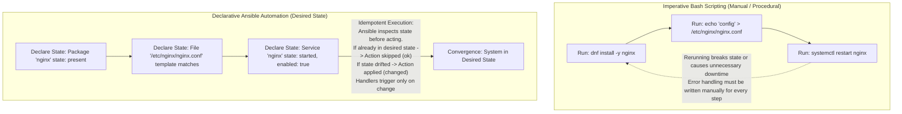
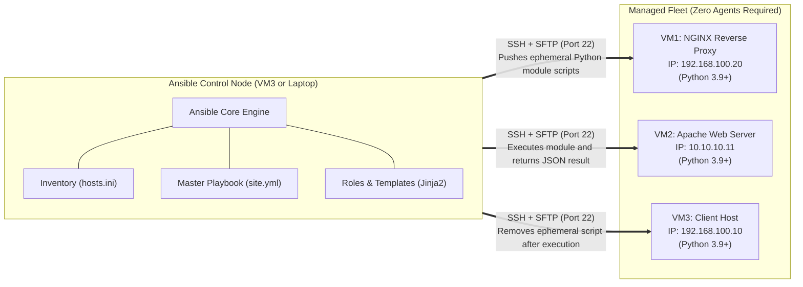
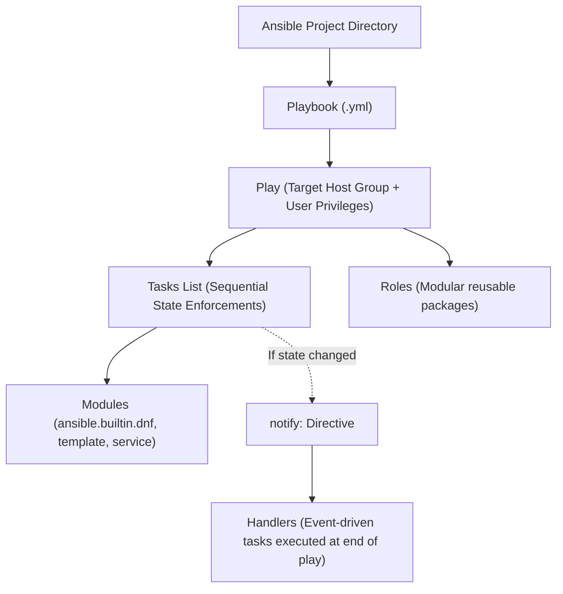
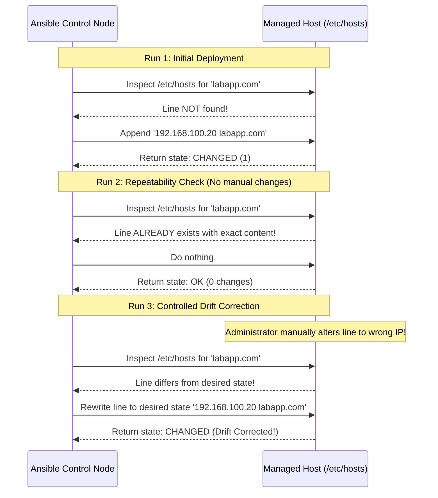
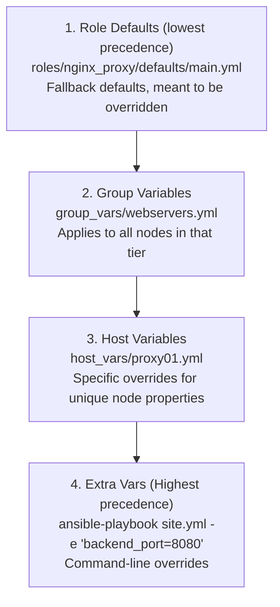

---
tags:
  - ansible
  - automation
  - devops
  - yaml
  - jinja2
  - fundamentals
reading-order: 1
created: 2026-09-24
updated: 2026-09-24
---

# Ansible Flight School & Architectural Foundations

> [!abstract] The 30-Second Executive Summary
> **Ansible** is an open-source, agentless IT automation engine. Unlike traditional tools that require client software (agents) or daemon processes on managed nodes, Ansible operates entirely over standard **OpenSSH** and executes lightweight Python modules on remote hosts. It uses a **declarative paradigm** written in human-readable **YAML**: instead of scripting step-by-step instructions ("install package, then edit file, then restart service"), you declare the **desired end state** ("ensure package is present, ensure configuration file matches template, ensure service is running").
>
> The gold standard of Ansible is **Idempotency**: running a playbook once brings the system to the desired state; running it 1,000 times subsequently produces **zero changes**, making automation safe, predictable, and self-healing against configuration drift.

> [!info] Official Documentation & Authority Sources
> - **Ansible Architecture**: [docs.ansible.com/ansible/latest/network/getting_started/basic_concepts.html](https://docs.ansible.com/ansible/latest/network/getting_started/basic_concepts.html)
> - **Playbook Syntax & Guidelines**: [docs.ansible.com/ansible/latest/playbook_guide/playbooks_intro.html](https://docs.ansible.com/ansible/latest/playbook_guide/playbooks_intro.html)
> - **Variable Precedence**: [docs.ansible.com/ansible/latest/playbook_guide/playbooks_variables.html#variable-precedence-where-should-i-put-a-variable](https://docs.ansible.com/ansible/latest/playbook_guide/playbooks_variables.html#variable-precedence-where-should-i-put-a-variable)
> - **YAML Specification 1.2**: [yaml.org/spec/1.2.2/](https://yaml.org/spec/1.2.2/)
> - **Jinja2 Template Engine**: [jinja.palletsprojects.com/en/3.1.x/](https://jinja.palletsprojects.com/en/3.1.x/)

---

## 1 · Why Ansible? The Engineering Paradigm Shift

In Phase 2, we configured our infrastructure manually via Bash. Let us compare the two paradigms:



| Evaluation Criterion | Imperative Bash Scripting | Declarative Ansible Automation |
|---|---|---|
| **Paradigm** | *How* to do it (step-by-step commands). | *What* the end state should look like. |
| **Agent Requirement** | None (direct shell access). | None (Agentless; requires only SSH + Python 3). |
| **Idempotency** | Must be manually coded (`if grep -q ...; then ... fi`). | Built into native modules by default. |
| **Execution Safety** | Dangerous to rerun without safeguards. | Safe to rerun repeatedly at any time. |
| **Drift Detection** | Difficult to detect without specialized diff tools. | Native `--check` (dry run) and `--diff` flags. |
| **Multi-Host Scaling** | Requires complex loops, SSH wrappers, or parallel shells. | Native parallel execution over dynamic inventories. |

---

## 2 · Core Architectural Topology

Ansible uses a **Control Node / Managed Node** topology:



### How an Ansible Task Executes Under the Hood:
1. **Compilation**: The control node reads the playbook, inventory, variables, and templates.
2. **Template Rendering**: Any Jinja2 templates are rendered into concrete text in memory on the control node.
3. **Module Packaging**: Ansible builds a small, standalone Python script containing the task logic and arguments.
4. **Transport**: The script is transferred via SSH (SFTP/SCP) to a temporary directory on the managed node (`~/.ansible/tmp/`).
5. **Execution**: The managed node's Python interpreter executes the script.
6. **Result Return**: The script outputs a structured **JSON** payload back to the control node (e.g., `{"changed": true, "rc": 0}`).
7. **Cleanup**: Ansible automatically deletes the temporary script on the remote node.

---

## 3 · YAML Masterclass: Syntax & Formatting Rules

Ansible playbooks are strictly formatted in **YAML** (YAML Ain't Markup Language). A single indentation mistake will cause the YAML parser to fail.

### Rule 1: Spaces Only, Never Tabs
Always use **2 spaces** per indentation level. Tabs (`\t`) are strictly forbidden by the YAML specification.

### Rule 2: Key-Value Mappings (Dictionaries)
A colon followed by a **mandatory space** separates keys and values:

```yaml
# Correct:
service_name: nginx
port_number: 443

# WRONG (Parser error - missing space):
service_name:nginx
```

### Rule 3: Sequences (Lists)
Lists are denoted by a hyphen `-` followed by a **mandatory space**:

```yaml
# A list of firewall services:
firewall_services:
  - http
  - https
  - ssh
```

### Rule 4: Multi-line String Scalar Indicators (`|` vs `>`)
When writing multi-line text (such as config files or banner text):

```yaml
# Literal Block Scalar (|): Preserves all newlines exactly as written
motd_banner: |
  ===========================================
  AIRNAV DAS ENTERPRISE SYSTEM DISCOVERY
  AUTHORIZED PERSONNEL ONLY
  ===========================================

# Folded Block Scalar (>): Folds newlines into single spaces (one paragraph)
compliance_notice: >
  This system is actively monitored for security
  and compliance with AirNav FCO Engineering
  guidelines.
```

### Rule 5: Quoting Rules for Jinja2 Expressions
If a value **starts** with a Jinja2 variable delimiter `{{`, you **must quote the entire line**, otherwise YAML interprets `{` as an inline dictionary:

```yaml
# WRONG (YAML syntax error):
message: {{ greeting }} from {{ inventory_hostname }}

# Correct (Quoted):
message: "{{ greeting }} from {{ inventory_hostname }}"
```

---

## 4 · The Ansible Lexicon: Anatomy of Automation



### 1. Inventory (`inventory/hosts.ini` or `hosts.yml`)
The source of truth that defines *which machines exist* and *how they are grouped*:

```ini
# INI format: Simple, human-readable, industry standard
[proxy]
proxy01 ansible_host=192.168.100.20 ansible_user=root

[webservers]
appvm   ansible_host=10.10.10.11   ansible_user=root

[clients]
laptop  ansible_host=192.168.100.10 ansible_user=aw16

# Parent group containing all tiers:
[lab:children]
proxy
webservers
clients
```

### 2. Play
A Play maps a specific group of hosts from the inventory to a set of tasks and roles:
```yaml
- name: Configure Web Server Tier
  hosts: webservers          # Target host group from inventory
  become: true               # Elevate privileges to root (sudo)
  tasks:
    # Tasks listed here...
```

### 3. Task & Module
A Task is the smallest executable unit of action. It invokes a **Module** (using FQCN: Fully Qualified Collection Name) with specific arguments:

```yaml
    - name: Ensure Apache HTTP server is installed
      ansible.builtin.dnf:    # FQCN Module
        name: httpd           # Argument: package name
        state: present        # Argument: desired state (installed)
```

### 4. Handler
A Handler is a special task that executes **only when notified** by a task that made an actual change:

```yaml
    - name: Deploy NGINX reverse proxy configuration
      ansible.builtin.template:
        src: proxy.conf.j2
        dest: /etc/nginx/conf.d/proxy.conf
        mode: '0644'
      notify: Reload NGINX   # <-- Emits notification ONLY IF template changes

  handlers:
    - name: Reload NGINX
      ansible.builtin.service:
        name: nginx
        state: reloaded
```

> [!tip] Handler Execution Lifecycle
> Handlers run **once at the very end of the play**, regardless of how many tasks notified them. If 10 tasks modify different config files and notify `Reload NGINX`, NGINX reloads **exactly once**, eliminating service flapping and unnecessary restarts.

---

## 5 · The Gold Standard: Understanding Idempotency

In mathematics, an operation is idempotent if applying it multiple times produces the same result:
$$f(f(x)) = f(x)$$

In systems engineering:
- **Non-Idempotent (Bad Script)**: Running `echo "192.168.100.20 labapp.com" >> /etc/hosts` three times results in three duplicate lines.
- **Idempotent (Ansible)**: Using `ansible.builtin.lineinfile` checks whether the line exists first. If present, it does nothing (`ok`). If missing, it adds it once (`changed`).



### Ansible Status Reporting
At the end of every playbook run, Ansible prints the **PLAY RECAP**:
- `ok`: Number of tasks where the system was already in the desired state.
- `changed`: Number of tasks where Ansible modified the host to reach the desired state.
- `unreachable`: Could not connect via SSH.
- `failed`: Task returned an error and halted execution.
- `skipped`: Task condition evaluated to false (`when:` statement).

---

## 6 · Variable Architecture & Precedence Hierarchy

Ansible variables eliminate hardcoded magic values. Variables can be defined in multiple locations, governed by a strict **precedence hierarchy** (official 22-level precedence).

### The Practical Rule of Thumb (3-Tier Variable Scoping):



| Location | Purpose | Example Use Case |
|---|---|---|
| `roles/<role>/defaults/main.yml` | Default fallback values. | `backend_port: 80` (safe default). |
| `group_vars/all.yml` | Values shared across the entire fleet. | `domain_name: labapp.com`, `admin_email: hans@airnav.local`. |
| `group_vars/webservers.yml` | Values specific to backend nodes. | `apache_package_name: httpd`. |
| `host_vars/<hostname>.yml` | Values unique to a single machine. | `ansible_host: 192.168.100.20`. |

---

## 7 · Jinja2 Templating: Powering Dynamic Configurations

Static configuration files are brittle. Jinja2 templates (`.j2` extension) allow configuration files to adapt dynamically based on host variables and inventory facts.

### Syntax Cheatsheet:
- `{{ variable }}`: Expressions (evaluates and prints variable content).
- ` ... `: Control structures (loops and logic).
- `{# comment #}`: Comments that will not appear in the generated file.

### Real-World Example: NGINX Reverse Proxy Template (`reverse_proxy.conf.j2`)

```nginx
# Auto-generated by Ansible for {{ inventory_hostname }}
# Generated on: {{ ansible_date_time.iso8601 }}

server {
    listen {{ proxy_port | default(80) }};
    server_name {{ fqdn }};

    location / {
        proxy_pass http://{{ backend_host }}:{{ backend_port }};
        proxy_set_header Host $host;
        proxy_set_header X-Real-IP $remote_addr;
        proxy_set_header X-Forwarded-For $proxy_add_x_forwarded_for;
        proxy_set_header X-Forwarded-Proto $scheme;
    }
}
```

---

## 8 · Roles: Modular, Reusable Enterprise Structure

Rather than writing monolithic 500-line playbooks, enterprise Ansible organizes tasks, handlers, variables, and templates into **Roles**.

A role follows a standardized directory structure:

```
roles/apache_web/
├── defaults/
│   └── main.yml        # Default variables (lowest precedence)
├── files/
│   └── airnav_logo.png # Static immutable files copied as-is
├── handlers/
│   └── main.yml        # Service restart/reload handlers
├── meta/
│   └── main.yml        # Role metadata, author, and dependencies
├── tasks/
│   └── main.yml        # Primary sequence of tasks to execute
├── templates/
│   └── index.html.j2   # Dynamic Jinja2 templates
└── vars/
    └── main.yml        # High-precedence role variables
```

---

## 9 · Safe Execution Toolkit: Flags You Must Know

Before executing any playbook in production, use Ansible's built-in validation suite:

```bash
# 1. Syntax Check: Validates YAML syntax and playbook structure without connecting:
ansible-playbook site.yml --syntax-check

# 2. Check Mode (Dry Run): Simulates execution against hosts without making any changes:
ansible-playbook site.yml --check

# 3. Diff Mode: Shows exact unified diff of text changes that would occur:
ansible-playbook site.yml --check --diff

# 4. Limit Execution: Runs the playbook against a single specific node:
ansible-playbook site.yml --limit proxy01

# 5. Step Mode: Prompts for confirmation before executing each individual task:
ansible-playbook site.yml --step
```

---

## 10 · Key Takeaways for Technical Defense

When presenting to Sir Jayrose and the senior engineers, keep these fundamental principles in mind:

1. **Why Ansible over Shell Scripts?** Shell scripts are imperative and fragile; Ansible is declarative, idempotent, and self-healing.
2. **How does Ansible achieve idempotency?** Ansible modules inspect the current state of the remote resource (file hash, package version, service state, socket) before executing. If the state matches the declaration, the module exits with `changed: false`.
3. **Why use Handlers instead of restarting in tasks?** Direct service restarts cause downtime during deployment. Handlers defer restarts to the end of the play and coalesce multiple change events into a single reload.
4. **Why are templates better than `lineinfile`?** For complex configuration files (like `nginx.conf` or `httpd.conf`), managing individual lines with `lineinfile` is error-prone. Managing the entire file via a Jinja2 template guarantees complete configuration fidelity.
