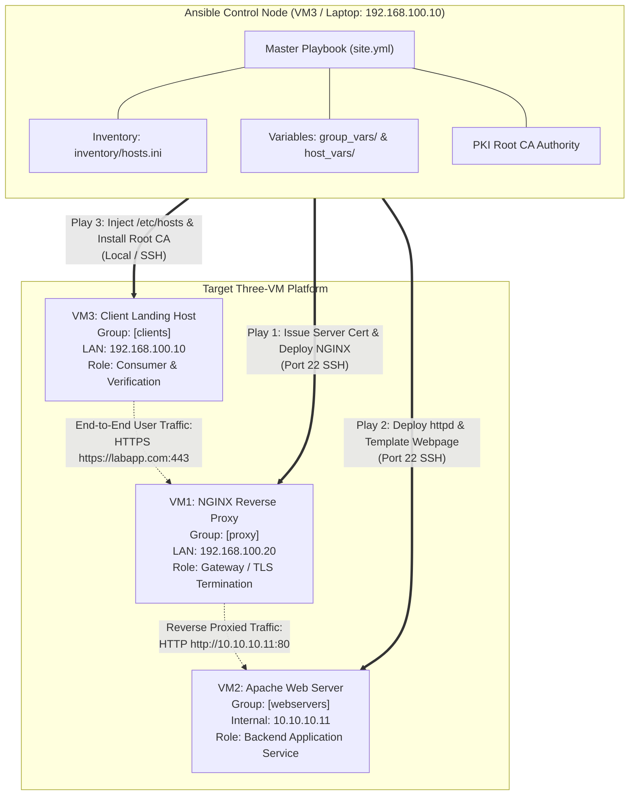

---
tags:
  - ansible
  - milestone-1
  - project-structure
  - inventory
  - blueprint
reading-order: 2
created: 2026-09-24
updated: 2026-09-24
---

# Milestone 1: Project Hangar & Automation Blueprint

> [!abstract] Milestone 1 Objective
> Establish a standardized, modular, and production-ready Ansible project repository ("Project Hangar"). Configure an **agentless SSH control plane** connecting the Ansible Control Node to all managed hosts. Create the inventory hierarchy, master playbook skeleton, and variable structure, validating end-to-end connectivity with `ansible all -m ping`.

> [!info] Official References & Standards
> - **Ansible Inventory Best Practices**: [docs.ansible.com/ansible/latest/inventory_guide/intro_inventory.html](https://docs.ansible.com/ansible/latest/inventory_guide/intro_inventory.html)
> - **Ansible Configuration (`ansible.cfg`)**: [docs.ansible.com/ansible/latest/reference_appendices/config.html](https://docs.ansible.com/ansible/latest/reference_appendices/config.html)
> - **Sample Ansible Project Layout**: [docs.ansible.com/ansible/latest/tips_tricks/sample_setup.html](https://docs.ansible.com/ansible/latest/tips_tricks/sample_setup.html)
> - **OpenSSH Key Management (RFC 4253)**: [datatracker.ietf.org/doc/html/rfc4253](https://datatracker.ietf.org/doc/html/rfc4253)

---

## 1 · Pre-Activity Deliverable: The Automation Blueprint

Before writing a single line of playbook code, professional systems engineers draft the **Automation Blueprint** to define host roles, inventory groupings, network paths, and variable taxonomy.



### Automation Blueprint Inventory Matrix

| Host Alias | Inventory Group | IP Address | Managed Services | Managed Files & Templates | Managed Ports / FW |
|---|---|---|---|---|---|
| `proxy01` | `[proxy]` | `192.168.100.20` | `nginx` | `/etc/nginx/conf.d/proxy.conf`<br>`/etc/pki/tls/certs/server.crt`<br>`/etc/pki/tls/private/server.key` | TCP 80, 443 |
| `appvm` | `[webservers]` | `10.10.10.11` | `httpd` | `/etc/httpd/conf.d/vhost.conf`<br>`/var/www/html/index.html` | TCP 80 (or custom port) |
| `client` | `[clients]` | `192.168.100.10` | Trust Store | `/etc/hosts`<br>`/etc/pki/ca-trust/source/anchors/root-ca.crt` | Client outbound HTTPS |

---

## 2 · Step-by-Step Hands-on Implementation

### Step 1.1 · Setting up Ansible on the Control Node
The Control Node requires Python 3.9+ and `ansible-core` (or the complete `ansible` package).

Run these commands on your Control Node (Management Laptop or designated VM3):

```bash
# Verify Python 3 is available:
python3 --version

# Install Ansible using AlmaLinux/RHEL standard EPEL or pip:
# Method A: Via DNF (Recommended for AlmaLinux 9):
sudo dnf install -y epel-release
sudo dnf install -y ansible-core python3-pip

# Method B: Via Python pip in user space (if dnf is restricted):
python3 -m pip install --user ansible

# Verify the Ansible installation:
ansible --version
# Output should confirm: ansible [core 2.15+] with python version 3.9+
```

---

### Step 1.2 · Establishing Passwordless SSH Authentication
Ansible is **agentless**: it connects to managed nodes using standard SSH keys. Password-based authentication creates interactive prompts that break automation.

```bash
# 1. Generate an SSH keypair on the Control Node if you don't already have one:
# (-t ed25519 is the modern cryptographic standard per NIST and OpenSSH)
if [ ! -f ~/.ssh/id_ed25519 ]; then
    ssh-keygen -t ed25519 -C "ansible-control-plane" -f ~/.ssh/id_ed25519 -N ""
fi

# 2. Copy the public key to all managed nodes:
ssh-copy-id -i ~/.ssh/id_ed25519.pub root@192.168.100.20   # proxy01
ssh-copy-id -i ~/.ssh/id_ed25519.pub root@10.10.10.11      # appvm

# 3. Test non-interactive login without being prompted for a password:
ssh -o BatchMode=yes root@192.168.100.20 "echo 'proxy01 SSH OK'"
ssh -o BatchMode=yes root@10.10.10.11 "echo 'appvm SSH OK'"
```

---

### Step 1.3 · Scaffold the Project Directory Structure ("Project Hangar")
Create a clean directory dedicated to this Ansible deployment automation project:

```bash
# Create project root directory:
mkdir -p ~/ansible-platform
cd ~/ansible-platform

# Create the standard enterprise subdirectory hierarchy:
mkdir -p inventory
mkdir -p group_vars
mkdir -p host_vars
mkdir -p roles/{common,apache_web,nginx_proxy,pki_trust,client_zone}

# Verify tree structure:
ls -F
# Output: group_vars/  host_vars/  inventory/  roles/
```

---

### Step 1.4 · Crafting `ansible.cfg`
The `ansible.cfg` file controls how Ansible behaves within this project directory. Placing this file in the project root ensures any engineer cloning the repository gets the exact same behavior without modifying global `/etc/ansible/ansible.cfg`.

Create `~/ansible-platform/ansible.cfg`:

```ini
# ansible.cfg — Project-level Ansible configuration
# Docs: https://docs.ansible.com/ansible/latest/reference_appendices/config.html

[defaults]
# Automatically use our project inventory:
inventory = ./inventory/hosts.ini

# Path where Ansible discovers roles:
roles_path = ./roles

# Remote user to connect as by default:
remote_user = root

# Number of parallel processes to spawn when communicating with nodes:
forks = 5

# Suppress host key checking for fast lab redeployments:
host_key_checking = False

# Enable human-readable, formatted YAML output instead of dense JSON:
stdout_callback = yaml

# Do not create .retry files on failure:
retry_files_enabled = False

[privilege_escalation]
# Automatically escalate privileges when needed:
become = True
become_method = sudo
become_user = root
become_ask_pass = False
```

---

### Step 1.5 · Defining the Inventory (`inventory/hosts.ini`)
Create `~/ansible-platform/inventory/hosts.ini`:

```ini
# inventory/hosts.ini — Three-Tier Lab Platform Inventory
# Defines node aliases, IP addresses, and group memberships

[proxy]
proxy01 ansible_host=192.168.100.20 ansible_user=root

[webservers]
appvm   ansible_host=10.10.10.11   ansible_user=root

[clients]
# The control node itself acts as the client verification node:
localhost ansible_connection=local ansible_user=aw16

# Umbrella group containing all lab nodes:
[lab:children]
proxy
webservers
clients
```

---

### Step 1.6 · Separating Variables (`group_vars/` and `host_vars/`)
A core requirement of Milestone 1 is separating **common values**, **group values**, and **host-specific values**.

#### 1. Common Values across the entire lab (`group_vars/all.yml`):
```yaml
# group_vars/all.yml — Applied to all nodes in the inventory
domain_name: "labapp.com"
backend_port: 80
proxy_http_port: 80
proxy_https_port: 443
ca_subject_org: "AirNav FCO Engineering"
ca_subject_cn: "AirNav DAS Lab Root CA"
```

#### 2. Group Values for Proxy Tier (`group_vars/proxy.yml`):
```yaml
# group_vars/proxy.yml — Applied specifically to [proxy] nodes
nginx_package_name: "nginx"
nginx_service_name: "nginx"
ssl_cert_dir: "/etc/pki/nginx"
ssl_cert_file: "{{ ssl_cert_dir }}/server.crt"
ssl_key_file: "{{ ssl_cert_dir }}/server.key"
```

#### 3. Group Values for Web Server Tier (`group_vars/webservers.yml`):
```yaml
# group_vars/webservers.yml — Applied specifically to [webservers] nodes
apache_package_name: "httpd"
apache_service_name: "httpd"
document_root: "/var/www/html"
webpage_title: "AirNav DAS - System Discovery Platform"
```

---

### Step 1.7 · Master Playbook Skeleton (`site.yml`)
Create `~/ansible-platform/site.yml`:

```yaml
---
# site.yml — Master Orchestration Playbook
# Calls plays in strict chronological order across the 3-tier architecture

- name: "Phase 1: Environment Sanity & PKI Trust Setup"
  hosts: localhost
  gather_facts: false
  tasks:
    - name: Display deployment banner
      ansible.builtin.debug:
        msg: "Starting AirNav DAS Platform Automated Deployment..."

- name: "Phase 2: Deploy Backend Apache Web Server"
  hosts: webservers
  become: true
  tasks:
    - name: Ping webserver
      ansible.builtin.ping:

- name: "Phase 3: Deploy NGINX Reverse Proxy Gateway"
  hosts: proxy
  become: true
  tasks:
    - name: Ping proxy gateway
      ansible.builtin.ping:

- name: "Phase 4: Client Landing Zone & End-to-End Verification"
  hosts: clients
  tasks:
    - name: Ping client
      ansible.builtin.ping:
...
```

---

## 3 · Verification & Evidence Collection

Run these commands to prove Milestone 1 completion:

```bash
# 1. Validate the inventory graph structure:
ansible-inventory --graph
# Expected Output:
# @all:
#   |--@lab:
#   |  |--@clients:
#   |  |  |--localhost
#   |  |--@proxy:
#   |  |  |--proxy01
#   |  |--@webservers:
#   |  |  |--appvm

# 2. Test non-interactive Ansible connectivity across all nodes:
ansible all -m ping
# Expected Output:
# proxy01   | SUCCESS => {"changed": false, "ping": "pong"}
# appvm     | SUCCESS => {"changed": false, "ping": "pong"}
# localhost | SUCCESS => {"changed": false, "ping": "pong"}

# 3. Test Master Playbook execution:
ansible-playbook site.yml
# Expected Output:
# PLAY RECAP:
# appvm     : ok=1    changed=0    unreachable=0    failed=0
# localhost : ok=2    changed=0    unreachable=0    failed=0
# proxy01   : ok=1    changed=0    unreachable=0    failed=0
```

---

## 4 · Technical Defense Q&A for Trainers

> [!tip] Questions Sir Jayrose Might Ask
> **Q1: Why did you place `ansible.cfg` in the project directory instead of `/etc/ansible/`?**
> *Answer:* Project-level `ansible.cfg` makes the repository portable and self-contained. Anyone who clones this project gets the exact same timeouts, inventory path, roles path, and callback formatting, without relying on machine-global configuration.
>
> **Q2: Why use `inventory/hosts.ini` over hardcoding IP addresses inside playbooks?**
> *Answer:* Hardcoding IPs violates the separation of concerns. In production, we deploy the exact same playbooks across Dev, Staging, and Production environments simply by passing a different inventory (`-i inventory/staging.ini`).
>
> **Q3: What does `ansible all -m ping` actually test?**
> *Answer:* It does NOT send an ICMP echo ping packet! It establishes an SSH connection, verifies Python 3 is installed on the remote host, transfers a small Python test script, executes it, and verifies a return payload of `{"ping": "pong"}`.
