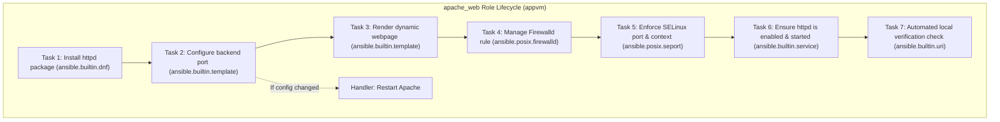

---
tags:
  - ansible
  - milestone-2
  - apache
  - httpd
  - selinux
  - firewalld
reading-order: 3
created: 2026-09-24
updated: 2026-09-24
---

# Milestone 2: Web Server Role (Apache Automation)

> [!abstract] Milestone 2 Objective
> Automate the installation, configuration, and security hardening of the backend **Apache HTTP Server (`httpd`)** on `appvm` (`10.10.10.11`). Build a modular Ansible Role (`apache_web`) that deploys a dynamic Jinja2 webpage, manages the backend port, configures **Firewalld**, enforces **SELinux** contexts, defines event-driven handlers, and executes an automated local verification test.

> [!info] Official Documentation & Authority Sources
> - **Apache HTTP Server Project**: [httpd.apache.org/docs/2.4/](https://httpd.apache.org/docs/2.4/)
> - **Ansible DNF Module**: [docs.ansible.com/ansible/latest/collections/ansible/builtin/dnf_module.html](https://docs.ansible.com/ansible/latest/collections/ansible/builtin/dnf_module.html)
> - **Ansible Service Module**: [docs.ansible.com/ansible/latest/collections/ansible/builtin/service_module.html](https://docs.ansible.com/ansible/latest/collections/ansible/builtin/service_module.html)
> - **Ansible FirewallD Module**: [docs.ansible.com/ansible/latest/collections/ansible/posix/firewalld_module.html](https://docs.ansible.com/ansible/latest/collections/ansible/posix/firewalld_module.html)
> - **Red Hat SELinux User's and Administrator's Guide**: [access.redhat.com/documentation/en-us/red_hat_enterprise_linux/9/html/using_selinux/](https://access.redhat.com/documentation/en-us/red_hat_enterprise_linux/9/html/using_selinux/)

---

## 1 · Architectural Role Overview

The `apache_web` role is responsible solely for the backend tier. It is completely decoupled from the reverse proxy: it does not care who is proxying to it, only that it reliably serves the web application on its designated backend port.



---

## 2 · Step-by-Step Hands-on Implementation

### Step 2.1 · Scaffold the `apache_web` Role Directory
From your project root (`~/ansible-platform`):

```bash
mkdir -p roles/apache_web/{defaults,tasks,templates,handlers,meta}
```

---

### Step 2.2 · Define Role Defaults (`roles/apache_web/defaults/main.yml`)
Role defaults provide safe fallback values that can be easily overridden in `group_vars` without altering role code.

Create `roles/apache_web/defaults/main.yml`:

```yaml
---
# roles/apache_web/defaults/main.yml — Default parameters for Apache Web Role

apache_package: "httpd"
apache_service: "httpd"
backend_port: 80
web_document_root: "/var/www/html"

# Dynamic content variables:
platform_title: "AirNav DAS - System Discovery Platform"
environment_tier: "Production-Simulated"
```

---

### Step 2.3 · Build the Jinja2 Webpage Template (`roles/apache_web/templates/index.html.j2`)
Create `roles/apache_web/templates/index.html.j2`. This template pulls dynamic facts directly from the target system during execution:

```html
<!DOCTYPE html>
<html lang="en">
<head>
    <meta charset="UTF-8">
    <title>{{ platform_title }}</title>
    <style>
        body { font-family: 'Segoe UI', Tahoma, Geneva, Verdana, sans-serif; background-color: #0b132b; color: #ffffff; text-align: center; padding-top: 50px; }
        .card { background-color: #1c2541; display: inline-block; padding: 40px; border-radius: 12px; box-shadow: 0 8px 24px rgba(0,0,0,0.4); border: 1px solid #3a506b; }
        h1 { color: #48cae4; margin-bottom: 5px; }
        h3 { color: #90e0ef; font-weight: normal; margin-top: 0; }
        table { margin: 25px auto 0 auto; text-align: left; border-collapse: collapse; }
        td { padding: 8px 16px; border-bottom: 1px solid #3a506b; }
        .badge { background-color: #5bc0be; color: #0b132b; padding: 4px 10px; border-radius: 6px; font-weight: bold; }
    </style>
</head>
<body>
    <div class="card">
        <h1>✈️ AIRNAV FCO ENGINEERING</h1>
        <h3>{{ platform_title }}</h3>
        <span class="badge">AUTOMATED BY ANSIBLE</span>

        <table>
            <tr><td><strong>Backend Host:</strong></td><td>{{ ansible_hostname }} ({{ ansible_default_ipv4.address }})</td></tr>
            <tr><td><strong>Operating System:</strong></td><td>{{ ansible_distribution }} {{ ansible_distribution_version }}</td></tr>
            <tr><td><strong>Serving Port:</strong></td><td>TCP {{ backend_port }}</td></tr>
            <tr><td><strong>Deployed At:</strong></td><td>{{ ansible_date_time.iso8601 }}</td></tr>
        </table>
    </div>
</body>
</html>
```

---

### Step 2.4 · Build the Port Configuration Template (`roles/apache_web/templates/ports.conf.j2`)
Create `roles/apache_web/templates/ports.conf.j2`. This cleanly overrides the default listening port in Apache:

```apache
# Managed by Ansible — roles/apache_web
# Do not edit manually; changes will be overwritten by automation.

Listen {{ backend_port }}
```

---

### Step 2.5 · Define Role Tasks (`roles/apache_web/tasks/main.yml`)
Create `roles/apache_web/tasks/main.yml`:

```yaml
---
# roles/apache_web/tasks/main.yml — Apache Deployment Sequence

- name: Install Apache HTTP Server package
  ansible.builtin.dnf:
    name: "{{ apache_package }}"
    state: present
  tags: [packages, apache]

- name: Configure Apache backend listening port
  ansible.builtin.template:
    src: ports.conf.j2
    dest: /etc/httpd/conf.d/00-ports.conf
    owner: root
    group: root
    mode: '0644'
  notify: Restart Apache
  tags: [config, apache]

- name: Deploy dynamic landing page from Jinja2 template
  ansible.builtin.template:
    src: index.html.j2
    dest: "{{ web_document_root }}/index.html"
    owner: root
    group: root
    mode: '0644'
  tags: [content, apache]

- name: Configure Firewalld to permit backend port traffic
  ansible.posix.firewalld:
    port: "{{ backend_port }}/tcp"
    permanent: true
    state: enabled
    immediate: true
  tags: [security, firewall]

- name: Configure SELinux to permit custom Apache listening port
  community.general.seport:
    ports: "{{ backend_port }}"
    proto: tcp
    setype: http_port_t
    state: present
  when: backend_port != 80 and backend_port != 443
  tags: [security, selinux]

- name: Ensure Apache service is enabled on boot and started
  ansible.builtin.service:
    name: "{{ apache_service }}"
    state: started
    enabled: true
  tags: [services, apache]

- name: Flush handlers to apply config changes immediately before verification
  ansible.builtin.meta: flush_handlers

- name: Verify Apache responds locally on backend port
  ansible.builtin.uri:
    url: "http://127.0.0.1:{{ backend_port }}"
    method: GET
    status_code: 200
    return_content: true
  register: local_http_check
  failed_when: "'AIRNAV FCO ENGINEERING' not in local_http_check.content"
  tags: [verification]

- name: Display backend verification evidence
  ansible.builtin.debug:
    msg: "SUCCESS: Apache backend verified locally on port {{ backend_port }}. HTTP Status: {{ local_http_check.status }}"
  tags: [verification]
```

---

### Step 2.6 · Define Handlers (`roles/apache_web/handlers/main.yml`)
Create `roles/apache_web/handlers/main.yml`:

```yaml
---
# roles/apache_web/handlers/main.yml — Event Handlers for Apache

- name: Restart Apache
  ansible.builtin.service:
    name: "{{ apache_service }}"
    state: restarted
```

---

### Step 2.7 · Link the Role in `site.yml`
Update Phase 2 of `~/ansible-platform/site.yml`:

```yaml
- name: "Phase 2: Deploy Backend Apache Web Server"
  hosts: webservers
  become: true
  roles:
    - apache_web
```

---

## 3 · Verification & Evidence Collection

Execute the playbook specifically for the web tier and inspect results:

```bash
# 1. Run syntax check:
ansible-playbook site.yml --syntax-check

# 2. Run in check mode with unified diff (Dry run):
ansible-playbook site.yml --check --diff --tags apache

# 3. Execute the actual deployment against appvm:
ansible-playbook site.yml --limit appvm

# 4. Verify directly from the target VM command line:
ssh root@10.10.10.11 "systemctl is-active httpd && curl -s http://localhost | grep 'AIRNAV'"
# Expected Output:
# active
# <h1>✈️ AIRNAV FCO ENGINEERING</h1>
```

---

## 4 · Technical Defense Q&A for Trainers

> [!tip] Questions Sir Jayrose Might Ask
> **Q1: Why did you use `flush_handlers` before the `ansible.builtin.uri` verification task?**
> *Answer:* Normally, handlers run at the very end of the play. If we modify Apache's port configuration and immediately test with `uri`, the test would fail because Apache hasn't restarted yet! `flush_handlers` forces pending handlers to execute immediately before continuing.
>
> **Q2: Why use `ansible.posix.firewalld` with `immediate: true` instead of running `firewall-cmd` via shell?**
> *Answer:* `immediate: true` applies the rule to both the running firewall memory and persists it to disk (`permanent: true`), achieving complete idempotency without restarting the firewalld daemon.
>
> **Q3: What would happen with SELinux if we changed `backend_port` to `8080`?**
> *Answer:* SELinux in Enforcing mode blocks `httpd` from binding to non-standard network ports. The task `community.general.seport` assigns the port to the `http_port_t` SELinux policy type, allowing Apache to bind without setting SELinux to Permissive or Disabling it.
