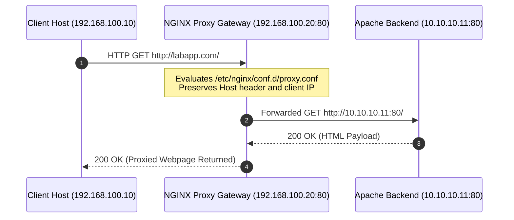

---
tags:
  - ansible
  - milestone-3
  - nginx
  - reverse-proxy
  - selinux
  - handlers
reading-order: 4
created: 2026-09-24
updated: 2026-09-24
---

# Milestone 3: Proxy Gateway Role (NGINX Reverse Proxy)

> [!abstract] Milestone 3 Objective
> Automate **NGINX** on `proxy01` (`192.168.100.20`) as the client-facing reverse proxy gateway. Build the `nginx_proxy` Ansible Role to dynamically forward client requests to the Apache backend (`10.10.10.11`). Enforce configuration validation (`nginx -t`) before reloading, manage the critical **SELinux network connection boolean**, configure Firewalld, and verify the complete proxy-to-backend communication path.

> [!info] Official Documentation & Authority Sources
> - **NGINX Reverse Proxy Guide**: [docs.nginx.com/nginx/admin-guide/web-server/reverse-proxy/](https://docs.nginx.com/nginx/admin-guide/web-server/reverse-proxy/)
> - **Ansible Template Module Validation**: [docs.ansible.com/ansible/latest/collections/ansible/builtin/template_module.html#parameter-validate](https://docs.ansible.com/ansible/latest/collections/ansible/builtin/template_module.html#parameter-validate)
> - **SELinux Booleans for Web Servers**: [access.redhat.com/documentation/en-us/red_hat_enterprise_linux/9/html/using_selinux/configuring-selinux-for-applications-services#doc-wrapper](https://access.redhat.com/documentation/en-us/red_hat_enterprise_linux/9/html/using_selinux/configuring-selinux-for-applications-services#doc-wrapper)
> - **Ansible SEBoolean Module**: [docs.ansible.com/ansible/latest/collections/ansible/posix/seboolean_module.html](https://docs.ansible.com/ansible/latest/collections/ansible/posix/seboolean_module.html)

---

## 1 · Reverse Proxy Data Flow & Mechanics

The Reverse Proxy stands between the client network and the private backend application network:



---

## 2 · Step-by-Step Hands-on Implementation

### Step 2.1 · Scaffold the `nginx_proxy` Role Directory
From your project root (`~/ansible-platform`):

```bash
mkdir -p roles/nginx_proxy/{defaults,tasks,templates,handlers,meta}
```

---

### Step 2.2 · Define Role Defaults (`roles/nginx_proxy/defaults/main.yml`)
Create `roles/nginx_proxy/defaults/main.yml`:

```yaml
---
# roles/nginx_proxy/defaults/main.yml — Default parameters for NGINX Proxy Role

nginx_package: "nginx"
nginx_service: "nginx"

# Proxy Gateway Routing Parameters:
fqdn: "labapp.com"
proxy_http_port: 80
backend_host: "10.10.10.11"
backend_port: 80

# Timeouts & Buffer Tuning:
proxy_connect_timeout: 5s
proxy_read_timeout: 60s
```

---

### Step 2.3 · Craft the Reverse Proxy Template (`roles/nginx_proxy/templates/reverse_proxy.conf.j2`)
Create `roles/nginx_proxy/templates/reverse_proxy.conf.j2`.

```nginx
# /etc/nginx/conf.d/reverse_proxy.conf
# Managed by Ansible — roles/nginx_proxy
# Host: {{ inventory_hostname }} | Generated: {{ ansible_date_time.iso8601 }}

upstream backend_cluster {
    server {{ backend_host }}:{{ backend_port }};
    keepalive 32;
}

server {
    listen {{ proxy_http_port }};
    listen [::]:{{ proxy_http_port }};
    server_name {{ fqdn }};

    # Logging with forwarded client context:
    access_log /var/log/nginx/reverse_proxy_access.log combined;
    error_log /var/log/nginx/reverse_proxy_error.log warn;

    location / {
        proxy_pass http://backend_cluster;

        # Standard HTTP Header Propagation:
        proxy_set_header Host $host;
        proxy_set_header X-Real-IP $remote_addr;
        proxy_set_header X-Forwarded-For $proxy_add_x_forwarded_for;
        proxy_set_header X-Forwarded-Proto $scheme;

        # Proxy connection tuning:
        proxy_connect_timeout {{ proxy_connect_timeout }};
        proxy_read_timeout {{ proxy_read_timeout }};
        proxy_http_version 1.1;
        proxy_set_header Connection "";
    }
}
```

---

### Step 2.4 · Define Role Tasks (`roles/nginx_proxy/tasks/main.yml`)
Create `roles/nginx_proxy/tasks/main.yml`:

```yaml
---
# roles/nginx_proxy/tasks/main.yml — NGINX Deployment Sequence

- name: Install NGINX reverse proxy package
  ansible.builtin.dnf:
    name: "{{ nginx_package }}"
    state: present
  tags: [packages, nginx]

- name: Remove default Welcome configuration if present
  ansible.builtin.file:
    path: /etc/nginx/conf.d/default.conf
    state: absent
  notify: Reload NGINX
  tags: [config, nginx]

- name: Deploy reverse proxy configuration with pre-flight syntax validation
  ansible.builtin.template:
    src: reverse_proxy.conf.j2
    dest: /etc/nginx/conf.d/reverse_proxy.conf
    owner: root
    group: root
    mode: '0644'
    # Validates syntax on remote host before replacing the active file:
    validate: 'nginx -t -c /etc/nginx/nginx.conf'
  notify: Reload NGINX
  tags: [config, nginx]

- name: Configure SELinux boolean to permit NGINX to proxy network traffic
  ansible.posix.seboolean:
    name: httpd_can_network_connect
    state: true
    persistent: true
  tags: [security, selinux]

- name: Configure Firewalld to permit incoming HTTP traffic
  ansible.posix.firewalld:
    port: "{{ proxy_http_port }}/tcp"
    permanent: true
    state: enabled
    immediate: true
  tags: [security, firewall]

- name: Ensure NGINX service is enabled on boot and started
  ansible.builtin.service:
    name: "{{ nginx_service }}"
    state: started
    enabled: true
  tags: [services, nginx]

- name: Flush handlers to reload NGINX before running verification check
  ansible.builtin.meta: flush_handlers

- name: Verify proxy-to-backend communication path
  ansible.builtin.uri:
    url: "http://127.0.0.1:{{ proxy_http_port }}"
    headers:
      Host: "{{ fqdn }}"
    method: GET
    status_code: 200
    return_content: true
  register: proxy_check
  failed_when: "'AIRNAV FCO ENGINEERING' not in proxy_check.content"
  tags: [verification]

- name: Display proxy verification evidence
  ansible.builtin.debug:
    msg: "SUCCESS: NGINX successfully forwarded request to Apache backend. HTTP Status: {{ proxy_check.status }}"
  tags: [verification]
```

---

### Step 2.5 · Define Handlers (`roles/nginx_proxy/handlers/main.yml`)
Create `roles/nginx_proxy/handlers/main.yml`:

```yaml
---
# roles/nginx_proxy/handlers/main.yml — Event Handlers for NGINX

- name: Reload NGINX
  ansible.builtin.service:
    name: "{{ nginx_service }}"
    state: reloaded

- name: Restart NGINX
  ansible.builtin.service:
    name: "{{ nginx_service }}"
    state: restarted
```

---

### Step 2.6 · Link the Role in `site.yml`
Update Phase 3 of `~/ansible-platform/site.yml`:

```yaml
- name: "Phase 3: Deploy NGINX Reverse Proxy Gateway"
  hosts: proxy
  become: true
  roles:
    - nginx_proxy
```

---

## 3 · Verification & Evidence Collection

Execute the playbook against the proxy tier:

```bash
# 1. Run syntax check:
ansible-playbook site.yml --syntax-check

# 2. Run dry-run check with unified diff:
ansible-playbook site.yml --check --diff --tags nginx

# 3. Execute the actual deployment against proxy01:
ansible-playbook site.yml --limit proxy01

# 4. Verify directly from proxy01 command line:
ssh root@192.168.100.20 "curl -s -H 'Host: labapp.com' http://localhost | grep 'AIRNAV'"
# Expected Output:
# <h1>✈️ AIRNAV FCO ENGINEERING</h1>
```

---

## 4 · Technical Defense Q&A for Trainers

> [!tip] Questions Sir Jayrose Might Ask
> **Q1: Why is `validate: 'nginx -t -c /etc/nginx/nginx.conf'` so critical in production?**
> *Answer:* If a syntax error is introduced into a template (e.g. missing semicolon), replacing the file without validation leaves a broken file on disk. When NGINX reloads or crashes, it cannot restart! The `validate` parameter renders the template to a temporary file on the target node first, runs `nginx -t`, and **only** moves it to the final destination if the syntax check passes.
>
> **Q2: What is the purpose of the `httpd_can_network_connect` SELinux boolean?**
> *Answer:* Under RHEL/AlmaLinux targeted policy, web servers (`httpd_t` domain, which covers NGINX) are blocked from opening outbound TCP sockets by default. Without `httpd_can_network_connect = true`, NGINX fails to reach the backend with `(13: Permission denied) while connecting to upstream` and clients get `502 Bad Gateway`.
>
> **Q3: Why reload NGINX (`state: reloaded`) instead of restarting it (`state: restarted`)?**
> *Answer:* Reloading performs a graceful zero-downtime configuration re-read. Active worker processes finish serving ongoing client requests while new worker processes spawn with the updated configuration. Restarting drops all active TCP connections.
