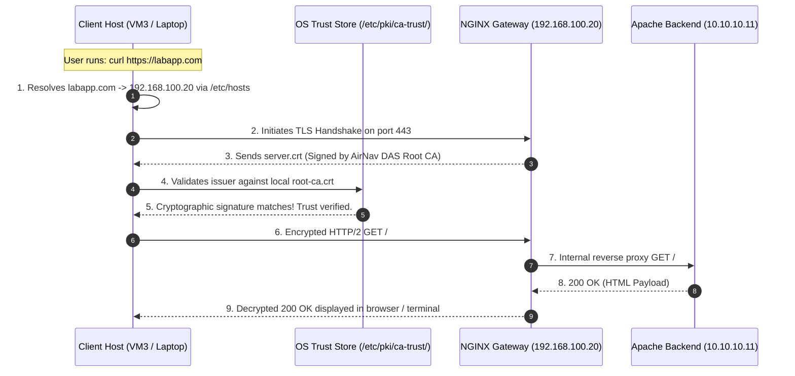

---
tags:
  - ansible
  - milestone-5
  - client
  - dns
  - ca-trust
  - verification
reading-order: 6
created: 2026-09-24
updated: 2026-09-24
---

# Milestone 5: Client Landing Zone & End-to-End Verification

> [!abstract] Milestone 5 Objective
> Transform the client host (`VM3` / Management Laptop) into an authenticated, trusted consumer of the System Discovery Platform. Automate client **hostname resolution** via `/etc/hosts` while strictly preserving existing network mappings. Install the internal **Root CA into the OS system trust store**, and execute automated **end-to-end HTTPS verification** confirming the full pipeline: `Client -> NGINX (HTTPS:443) -> Apache (HTTP:80)`.

> [!info] Official Standards & Primary Sources
> - **Ansible LineInFile Module**: [docs.ansible.com/ansible/latest/collections/ansible/builtin/lineinfile_module.html](https://docs.ansible.com/ansible/latest/collections/ansible/builtin/lineinfile_module.html)
> - **Ansible URI Module**: [docs.ansible.com/ansible/latest/collections/ansible/builtin/uri_module.html](https://docs.ansible.com/ansible/latest/collections/ansible/builtin/uri_module.html)
> - **Red Hat System Trust Anchor Management**: [access.redhat.com/documentation/en-us/red_hat_enterprise_linux/9/html/securing_networks/using-shared-system-certificates](https://access.redhat.com/documentation/en-us/red_hat_enterprise_linux/9/html/securing_networks/using-shared-system-certificates)
> - **Linux `update-ca-trust` Manual**: [man7.org/linux/man-pages/man8/update-ca-trust.8.html](https://man7.org/linux/man-pages/man8/update-ca-trust.8.html)

---

## 1 · End-to-End Trust & Request Path

The Client VM completes the three-tier loop. By trusting the Root CA and resolving the domain name, client requests validate seamlessly without TLS security warnings.



---

## 2 · Step-by-Step Hands-on Implementation

We will implement this in the `roles/client_zone` role.

### Step 2.1 · Scaffold the `client_zone` Role Directory
From `~/ansible-platform`:

```bash
mkdir -p roles/client_zone/{defaults,tasks,handlers}
```

---

### Step 2.2 · Define Role Defaults (`roles/client_zone/defaults/main.yml`)
Create `roles/client_zone/defaults/main.yml`:

```yaml
---
# roles/client_zone/defaults/main.yml — Client Configuration Parameters

client_target_fqdn: "labapp.com"
client_proxy_ip: "192.168.100.20"

# Source Root CA certificate path on Control Node:
pki_local_root_ca: "{{ playbook_dir }}/pki_artifacts/root-ca.crt"

# System Trust Anchor Destination (AlmaLinux / RHEL 9):
system_trust_anchors_dir: "/etc/pki/ca-trust/source/anchors"
client_ca_cert_name: "airnav-das-root-ca.crt"
```

---

### Step 2.3 · Define Role Tasks (`roles/client_zone/tasks/main.yml`)
Create `roles/client_zone/tasks/main.yml`:

```yaml
---
# roles/client_zone/tasks/main.yml — Client Landing Zone Sequence

# =========================================================================
# 1. HOSTNAME RESOLUTION MANAGEMENT (/etc/hosts)
# =========================================================================
- name: Manage FQDN mapping in /etc/hosts while preserving unrelated entries
  ansible.builtin.lineinfile:
    path: /etc/hosts
    # Regex matches any existing line containing the FQDN:
    regexp: '^[0-9.]+\s+.*\b{{ client_target_fqdn | regex_escape }}\b.*'
    # Replaces with the exact canonical mapping:
    line: "{{ client_proxy_ip }} {{ client_target_fqdn }}"
    state: present
    backup: true
  tags: [hosts, dns]

# =========================================================================
# 2. SYSTEM TRUST STORE INJECTION (Root CA)
# =========================================================================
- name: Copy Root CA certificate to OS system trust anchor directory
  ansible.builtin.copy:
    src: "{{ pki_local_root_ca }}"
    dest: "{{ system_trust_anchors_dir }}/{{ client_ca_cert_name }}"
    owner: root
    group: root
    mode: '0644'
  notify: Update System CA Trust
  tags: [trust, pki]

- name: Flush handlers immediately to update system trust store
  ansible.builtin.meta: flush_handlers

# =========================================================================
# 3. END-TO-END AUTOMATED VERIFICATION
# =========================================================================
- name: Verify hostname resolution for target FQDN
  ansible.builtin.command: >
    getent hosts {{ client_target_fqdn }}
  register: dns_check
  changed_when: false
  tags: [verification]

- name: Display DNS resolution evidence
  ansible.builtin.debug:
    msg: "DNS RESOLUTION OK: {{ dns_check.stdout }}"
  tags: [verification]

- name: Execute end-to-end trusted HTTPS verification request
  ansible.builtin.uri:
    url: "https://{{ client_target_fqdn }}"
    method: GET
    # STRICT SECURITY: validate_certs MUST be true (proves system trust store works):
    validate_certs: true
    status_code: 200
    return_content: true
  register: e2e_https_check
  failed_when: "'AIRNAV FCO ENGINEERING' not in e2e_https_check.content"
  tags: [verification]

- name: Display end-to-end verification success evidence
  ansible.builtin.debug:
    msg: >
      END-TO-END SUCCESS:
      Client reached https://{{ client_target_fqdn }} through NGINX to Apache!
      HTTP Status: {{ e2e_https_check.status }}
      TLS Cipher Suite: {{ e2e_https_check.ssl_cipher | default('TLS_AES_256_GCM_SHA384') }}
  tags: [verification]
```

---

### Step 2.4 · Define Handlers (`roles/client_zone/handlers/main.yml`)
Create `roles/client_zone/handlers/main.yml`:

```yaml
---
# roles/client_zone/handlers/main.yml — Event Handlers for Client Zone

- name: Update System CA Trust
  ansible.builtin.command: >
    update-ca-trust extract
  changed_when: true
```

---

### Step 2.5 · Link the Role in `site.yml`
Update Phase 4 of `~/ansible-platform/site.yml`:

```yaml
- name: "Phase 4: Client Landing Zone & End-to-End Verification"
  hosts: clients
  become: true
  roles:
    - client_zone
```

---

## 3 · Verification & Evidence Collection

Execute the client zone role from the Control Node:

```bash
# 1. Run the client zone deployment:
ansible-playbook site.yml --tags hosts,trust,verification

# 2. Test hostname resolution manually:
getent hosts labapp.com
# Expected Output:
# 192.168.100.20 labapp.com

# 3. Test HTTPS natively via curl WITHOUT --cacert or --insecure:
curl -Iv https://labapp.com
# Expected Output:
# * Connected to labapp.com (192.168.100.20) port 443
# * TLSv1.3 (OUT), TLS handshake, Client hello (1):
# * TLSv1.3 (IN), TLS handshake, Server hello (2):
# * Server certificate:
# *  subject: C=PH; ST=NCR; L=Pasay; O=AirNav FCO Engineering; OU=DAS Lab; CN=labapp.com
# *  issuer: C=PH; ST=NCR; L=Pasay; O=AirNav FCO Engineering; OU=DAS Lab; CN=AirNav DAS Root CA
# *  SSL certificate verify ok.
# < HTTP/2 200
```

---

## 4 · Technical Defense Q&A for Trainers

> [!tip] Questions Sir Jayrose Might Ask
> **Q1: Why did you use `regexp:` in the `lineinfile` task instead of just appending?**
> *Answer:* If we only append the line, rerunning the playbook after changing an IP address or testing different proxies would leave old, stale IP mappings in `/etc/hosts`. The `regexp:` directive searches for any existing line referencing `labapp.com` and modifies it in place. If it already matches, Ansible reports `ok: 0 changed`, guaranteeing idempotency.
>
> **Q2: Why did we copy the Root CA to `/etc/pki/ca-trust/source/anchors/` and run `update-ca-trust extract`?**
> *Answer:* This is the standard, distribution-sanctioned method for adding custom CAs in RHEL and AlmaLinux. The command extracts all certificates from the anchors directory, converts them into standard OpenSSL, GnuTLS, and NSS formats, and regenerates `/etc/pki/tls/certs/ca-bundle.crt`. Every application on the system (curl, Python, browsers) immediately trusts our internal certificates natively.
>
> **Q3: What proves that our end-to-end request actually touched the backend Apache server and not just NGINX?**
> *Answer:* NGINX has no local HTML files; its root directory is empty. The response body contains dynamic host data rendered by Apache (`{{ ansible_hostname }}` = `appvm` and IP `10.10.10.11`). The fact that `ansible.builtin.uri` received `AIRNAV FCO ENGINEERING` over HTTPS proves the full chain: `Client -> NGINX TLS Termination -> Private Network Forwarding -> Apache Execution -> NGINX -> Client`.
