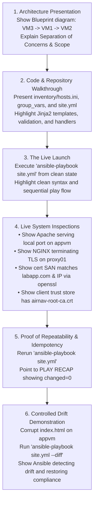

---
tags:
  - ansible
  - milestone-6
  - idempotency
  - repeatability
  - drift-correction
  - defense
reading-order: 7
created: 2026-09-24
updated: 2026-09-24
---

# Milestone 6 & Automated Launch: Repeatability, Idempotency & Defense

> [!abstract] Milestone 6 & Final Demonstration Objective
> Consolidate the entire multi-tier deployment into a single, cohesive **Master Playbook (`site.yml`)**. Demonstrate the hallmark of professional infrastructure engineering: **Idempotency** (zero unnecessary changes on rerun) and **Self-Healing Drift Correction** (automatically detecting and restoring tampered configurations). Rehearse the end-of-week presentation to defend the architecture confidently before Sir Jayrose and the AirNav engineering team.

> [!info] Official Standards & Primary Sources
> - **Ansible Playbook Best Practices**: [docs.ansible.com/ansible/latest/tips_tricks/ansible_tips_tricks.html](https://docs.ansible.com/ansible/latest/tips_tricks/ansible_tips_tricks.html)
> - **Understanding Idempotency in Ansible**: [docs.ansible.com/ansible/latest/reference_appendices/glossary.html#term-idempotent](https://docs.ansible.com/ansible/latest/reference_appendices/glossary.html#term-idempotent)
> - **Managing Configuration Drift**: [access.redhat.com/documentation/en-us/red_hat_ansible_automation_platform/2.4/html-single/ansible_architecture_for_system_engineers](https://access.redhat.com/documentation/en-us/red_hat_ansible_automation_platform/2.4/html-single/ansible_architecture_for_system_engineers)

---

## 1 · The Master Playbook: `site.yml`

This single playbook coordinates the entire deployment across all three virtual machines in strict chronological dependency order.

Save this as `~/ansible-platform/site.yml`:

```yaml
---
# =============================================================================
# AIRNAV DAS — SYSTEM DISCOVERY PLATFORM MASTER ORCHESTRATION PLAYBOOK
# Author: Hans / Trainee Systems Engineer (AirNav FCO Engineering)
# File: site.yml
# Target: 3-Tier Architecture (Client -> NGINX Reverse Proxy -> Apache Backend)
# =============================================================================

# -----------------------------------------------------------------------------
# PLAY 1: Infrastructure Sanity & Internal PKI Authority Setup
# -----------------------------------------------------------------------------
- name: "Phase 1: Control Plane Initialization & Internal PKI Authority"
  hosts: localhost
  connection: local
  gather_facts: false
  tasks:
    - name: Announce deployment initialization
      ansible.builtin.debug:
        msg:
          - "=========================================================="
          - "✈️  AIRNAV DAS PLATFORM AUTOMATED LAUNCH IN PROGRESS"
          - "Target FQDN : {{ domain_name | default('labapp.com') }}"
          - "Timestamp   : {{ lookup('pipe', 'date -Iseconds') }}"
          - "=========================================================="

# -----------------------------------------------------------------------------
# PLAY 2: Backend Application Tier (Apache HTTP Server)
# -----------------------------------------------------------------------------
- name: "Phase 2: Deploy Backend Web Server Tier (Apache)"
  hosts: webservers
  become: true
  roles:
    - apache_web

# -----------------------------------------------------------------------------
# PLAY 3: Gateway Tier (Internal PKI Server Cert & NGINX Reverse Proxy)
# -----------------------------------------------------------------------------
- name: "Phase 3: Deploy Gateway Tier (PKI Trust & NGINX Reverse Proxy)"
  hosts: proxy
  become: true
  roles:
    - pki_trust
    - nginx_proxy

# -----------------------------------------------------------------------------
# PLAY 4: Client Landing Zone & End-to-End System Verification
# -----------------------------------------------------------------------------
- name: "Phase 4: Client Landing Zone & System Verification"
  hosts: clients
  become: true
  roles:
    - client_zone

  post_tasks:
    - name: Final deployment summary
      ansible.builtin.debug:
        msg:
          - "=========================================================="
          - "✅  PLATFORM DEPLOYMENT & VERIFICATION COMPLETE!"
          - "All services are active, hardened, and securely accessible."
          - "Visit: https://{{ domain_name | default('labapp.com') }}"
          - "=========================================================="
      run_once: true
...
```

---

## 2 · Step-by-Step Hands-on Implementation

### Step 2.1 · Run 1: Initial Automated Launch
Execute the master playbook against your prepared VMs to deploy the platform from scratch:

```bash
cd ~/ansible-platform
ansible-playbook site.yml
```

#### Expected Output Analysis:
Every task reports either `ok` (if already present) or `changed` (if modified):

```
PLAY RECAP **********************************************************************************
appvm      : ok=8    changed=6    unreachable=0    failed=0    skipped=1    rescued=0    ignored=0
localhost  : ok=10   changed=4    unreachable=0    failed=0    skipped=0    rescued=0    ignored=0
proxy01    : ok=14   changed=8    unreachable=0    failed=0    skipped=0    rescued=0    ignored=0
```
> [!note] Record This Evidence!
> Take a screenshot or copy the terminal output. Notice `changed > 0`. This proves that Ansible dynamically transformed clean, unconfigured machines into an integrated, operational three-tier platform.

---

### Step 2.2 · Run 2: The Idempotency Proof (Repeatability Check)
Immediately run the exact same command a second time without touching any file or server:

```bash
ansible-playbook site.yml
```

#### Expected Output Analysis:
```
PLAY RECAP **********************************************************************************
appvm      : ok=8    changed=0    unreachable=0    failed=0    skipped=1    rescued=0    ignored=0
localhost  : ok=10   changed=0    unreachable=0    failed=0    skipped=0    rescued=0    ignored=0
proxy01    : ok=14   changed=0    unreachable=0    failed=0    skipped=0    rescued=0    ignored=0
```

> [!important] The Hallmark of Engineering Quality
> **`changed=0` across all hosts!**
> 
> Why this matters:
> - **Zero Side Effects**: Running the automation caused zero service interruptions, zero certificate re-generations, and zero file overwrites.
> - **Handlers were NOT triggered**: Because no configuration templates changed, NGINX and Apache were **not restarted or reloaded**.
> - **Predictability**: You can run this playbook every 15 minutes as a cron job to guarantee servers never drift.

---

### Step 2.3 · Run 3: Controlled Drift Simulation & Self-Healing
In the real world, human administrators often log into servers and accidentally make unauthorized changes ("Configuration Drift"). Here we prove that Ansible automatically detects and repairs drift.

#### 1. Induce Controlled Drift:
SSH into `appvm` and vandalize the managed `index.html`:

```bash
# Simulate an unauthorized manual edit on the backend server:
ssh root@10.10.10.11 "echo '<h1>UNAUTHORIZED DRIFT / HACKED FILE</h1>' > /var/www/html/index.html"

# Verify that the webpage is now corrupted:
curl -s http://10.10.10.11
# Output: <h1>UNAUTHORIZED DRIFT / HACKED FILE</h1>
```

#### 2. Run Ansible in Diff Mode to Detect the Drift:
Before applying changes, use `--check --diff` to see what Ansible detects:

```bash
ansible-playbook site.yml --check --diff
```

Ansible prints a unified diff pinpointing the exact drift:
```diff
--- /var/www/html/index.html (current state)
+++ /var/www/html/index.html (desired state)
@@ -1 +1,28 @@
-<h1>UNAUTHORIZED DRIFT / HACKED FILE</h1>
+<!DOCTYPE html>
+<html lang="en">
+<head>
+    <meta charset="UTF-8">
+    <title>AirNav DAS - System Discovery Platform</title>
```

#### 3. Enforce Desired State (Self-Healing):
Run the playbook normally:

```bash
ansible-playbook site.yml
```

#### Expected Output:
```
TASK [apache_web : Deploy dynamic landing page from Jinja2 template] ***********************
changed: [appvm]

PLAY RECAP **********************************************************************************
appvm      : ok=8    changed=1    unreachable=0    failed=0    skipped=1    rescued=0    ignored=0
localhost  : ok=10   changed=0    unreachable=0    failed=0    skipped=0    rescued=0    ignored=0
proxy01    : ok=14   changed=0    unreachable=0    failed=0    skipped=0    rescued=0    ignored=0
```

Notice: **Only `appvm` changed (`changed=1`), while all other nodes remained unchanged (`changed=0`)!**

#### 4. Verify Restoration:
```bash
curl -Iv https://labapp.com | grep "AIRNAV"
# Output confirms the original, authorized webpage is completely restored!
```

---

## 3 · Rehearsal Walkthrough for the Final Demonstration

When demonstrating the platform to Sir Jayrose and the engineering team, follow this precise script:



---

## 4 · Technical Defense Q&A: Master the Trainer Interview

> [!tip] 10 Critical Questions Engineers Will Ask During Your Presentation

### Q1: "What is the difference between an imperative script and declarative automation?"
> **Answer:** An imperative script (like Bash) specifies the sequence of actions: *do step 1, then step 2, then step 3*. If step 2 fails, the system is left in a broken, half-configured state. If rerun, it re-executes actions unnecessarily. 
> 
> Declarative automation (Ansible) specifies the *desired end state*: *ensure this package exists, ensure this file has this content, ensure this service is active*. Ansible calculates the difference between current state and desired state, applying only the necessary modifications to achieve convergence.

---

### Q2: "What is Idempotency, and why is it essential in mission-critical environments?"
> **Answer:** Idempotency means executing an operation multiple times produces the exact same result as executing it once: $f(f(x)) = f(x)$. 
> 
> In aviation and enterprise systems, idempotency ensures that running automation for routine maintenance or health checks never causes unintended downtime, never restarts healthy services, and never introduces configuration drift.

---

### Q3: "What are the common causes of broken idempotency in Ansible, and how did you prevent them?"
> **Answer:** The #1 cause of broken idempotency is using the `ansible.builtin.shell` or `ansible.builtin.command` modules without change guards, because raw commands always report `changed: true`.
> 
> We prevented this in three ways:
> 1. Used native declarative modules (`dnf`, `template`, `service`, `firewalld`, `lineinfile`) wherever possible.
> 2. On necessary raw OpenSSL commands, we used the `creates:` parameter so tasks skip automatically if the cryptographic key or certificate already exists.
> 3. Used `changed_when: false` on read-only inspection commands (`openssl x509 -text`).

---

### Q4: "Why did you use Handlers instead of putting `systemctl restart nginx` directly inside the tasks?"
> **Answer:** If multiple tasks modify different NGINX configuration files (e.g., updating the TLS certificate, updating upstream ports, and updating reverse proxy routes), restarting NGINX in every task causes service flapping and multiple connection drops.
> 
> Handlers are event-driven: they listen for `notify` directives, execute **only if a task made a change**, and run **exactly once at the end of the play**, guaranteeing zero-downtime, graceful configuration reloads.

---

### Q5: "How does the template `validate` directive protect against catastrophic failures?"
> **Answer:** When deploying `reverse_proxy.conf.j2`, we included `validate: 'nginx -t -c /etc/nginx/nginx.conf'`. 
> 
> Ansible renders the template into an isolated temporary file on the remote host, passes that file to the validation command, and **aborts the task without replacing the live configuration** if syntax errors exist. This guarantees that a typo in a template can never crash a production web server.

---

### Q6: "Why is `copy` or `template` preferred over `lineinfile` for complex configuration files?"
> **Answer:** `lineinfile` is designed for single-line changes in unstructured files (like `/etc/hosts` or `/etc/sysctl.conf`). 
> 
> Using `lineinfile` on multi-line, structured configurations (like `nginx.conf` or `httpd.conf`) is fragile: it cannot guarantee nesting, indentation, block hierarchy, or context. Managing the entire file as a Jinja2 template guarantees that the file on disk matches the repository version with 100% fidelity.

---

### Q7: "How does Ansible handle variable precedence if the same variable is defined in multiple places?"
> **Answer:** Ansible has a 22-level precedence hierarchy. In practice, we follow the standard tiering:
> 1. `roles/*/defaults/main.yml` (Lowest precedence — easily overridden fallbacks).
> 2. `group_vars/all.yml` (Common shared infrastructure variables).
> 3. `group_vars/<tier>.yml` (Tier-specific settings, like `proxy` vs `webservers`).
> 4. `host_vars/<node>.yml` (Node-specific overrides).
> 5. `-e` Extra Vars on the CLI (Highest precedence — runtime overrides).

---

### Q8: "How does the Client host validate the HTTPS certificate without security warnings?"
> **Answer:** During Phase 4, the playbook copies our generated `root-ca.crt` to `/etc/pki/ca-trust/source/anchors/` and runs `update-ca-trust extract`. 
> 
> This injects our internal CA directly into the OS system-wide bundle (`ca-bundle.crt`). When `curl` or a browser initiates the TLS handshake with NGINX, the client traces the certificate's cryptographic signature back to the trusted anchor in its local store, verifying validity automatically without needing `--insecure` (`-k`).

---

### Q9: "Why was SELinux an issue when proxying traffic, and how was it solved declaratively?"
> **Answer:** On AlmaLinux 9, SELinux runs in Enforcing mode. The `httpd_t` security domain is forbidden from initiating outbound TCP connections to backends. 
> 
> We solved this declaratively using the `ansible.posix.seboolean` module to set `httpd_can_network_connect = true` with `persistent: true`. This survives reboots without compromising system security by disabling SELinux.

---

### Q10: "If you needed to store database passwords or private key passphrases in Ansible, how would you protect them?"
> **Answer:** We use **Ansible Vault** (`ansible-vault`). Ansible Vault encrypts sensitive YAML files or individual strings using AES-256 encryption. The encrypted files can be safely committed to Git repositories and decrypted only during playbook execution using a vault password (`--vault-password-file`).
