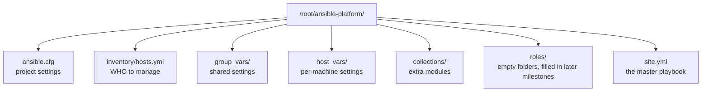

# Milestone 1 — Project Hangar

> [!abstract] What this milestone actually is
> Before Ansible can automate anything, it needs three things: **a list of machines** (inventory), **a place to put settings shared by everyone** (variables), and **one file that starts the whole deployment** (the master playbook). Milestone 1 is building that skeleton — no servers are installed yet, nothing is deployed yet. It's the filing cabinet the rest of the project gets put into.

> [!success] Audit result
> Checked directly on `control-vm3` against [[OLIVERIO — Deployment Automation#3 · Milestone 1 — Project Hangar]]. Every file matches the guide exactly, correctly. `ansible-inventory --graph`, connectivity, and `--syntax-check` all passed live. No corrections needed.

---

## What you built, in plain terms



### 1. `ansible.cfg` — the project's settings file

This tells Ansible things like "look for the machine list in `inventory/hosts.yml`," "log in as root," and "don't print scary SSH warnings we've already dealt with." Without this file, Ansible falls back to system defaults, which is how mismatched settings (like the `hosts.ini` vs `hosts.yml` mixup from the earlier draft) happen. One file, one source of truth, sitting right next to the project.

### 2. `inventory/hosts.yml` — the machine list

This says: "there are three machines, here's their IP address, and here's the job each one does."

| Group       | Machine       | Job                                   |
| ----------- | ------------- | -------------------------------------- |
| `proxy`     | proxy-vm1     | Will run NGINX (the reverse proxy)     |
| `webserver` | web-vm2       | Will run Apache (the backend)          |
| `client`    | control-vm3   | Runs the tests at the end              |
| `pki_ca`    | control-vm3   | Where the certificate authority lives  |
| `lab`       | all of them   | "Everyone" — used for setup checks      |

Notice `control-vm3` is in **two** groups (`client` and `pki_ca`). Nothing wrong with that — a machine can have more than one job. It's your control node, your test client, *and* your certificate authority, all at once, because it's the only machine in the lab that stays put.

> [!question]- Why is the proxy's real IP address only written once, in this file?
> Because everything else in the project doesn't say "192.168.100.41" — it says "whatever machine is in the `proxy` group." So if the proxy ever moves to a different IP, you change **one line**, here, and every certificate, config file, and firewall rule that depends on it updates automatically the next time you run the playbook.

### 3. `group_vars/` — settings shared by groups of machines

Four files, one per group, holding the values that group needs:

- **`all.yml`** — the big one. The domain name (`labapp.com`), the ports, the certificate details (organization name, country, how many days a certificate stays valid), and the label the tests look for in the webpage (`DEPLOYED-BY-ANSIBLE`) to prove Ansible put it there.
- **`proxy.yml`** — only proxy-vm1 needs to know where its certificate files will live.
- **`webserver.yml`** — only web-vm2 needs to know its web folder.
- **`client.yml`** — only control-vm3 needs to know where to put the trusted certificate.

This split matters for the same reason as the inventory: change the domain name once in `all.yml`, and the certificate, the NGINX config, and the `/etc/hosts` entry all follow.

### 4. `host_vars/web-vm2.yml` — a setting for one specific machine

This is the most specific level: a sentence that shows up on the webpage, only for web-vm2. If you ever add a second web server, it would get its own message here, without touching anyone else's settings.

### 5. `collections/requirements.yml` — extra tools Ansible needs

Ansible on its own doesn't know how to touch a firewall or generate a certificate. Those abilities come from add-on packages called **collections**. This file lists exactly which ones, and which versions, so the project works the same way on any machine that installs from it. You already ran the install command, and both showed up correctly:

```
ansible.posix    1.5.4
community.crypto 2.26.9
```

### 6. `roles/` — labeled empty folders, waiting to be filled

Five folders were created — `pki_ca`, `apache_web`, `nginx_proxy`, `client_trust`, `verify` — one for each job the platform needs done. Right now they're empty. That's expected at this stage: Milestone 1 is just building the shelves. Milestones 2–5 put something on each shelf.

### 7. `site.yml` — the master playbook

This is the one file you will actually run. It reads top to bottom like a checklist:

1. **Check every machine first** — refuse to continue if it isn't the right operating system, or if a key setting is missing. Catching a mistake here beats catching it halfway through a deployment.
2. **Build the certificate authority** on control-vm3.
3. **Set up Apache** on web-vm2.
4. **Set up NGINX** on proxy-vm1.
5. **Set up the client and run the final tests** on control-vm3.

Right now steps 2–5 do nothing, because their roles are still empty. Once you did the check in step 1 pass on all three machines, that's proof the wiring — the inventory, the settings, the playbook structure — is correct before a single package gets installed.

### 8. `README.md` and `.gitignore`

The README is the "how another engineer runs this" cheat sheet — what to install, what commands to run, which file to edit for which kind of change. The `.gitignore` makes sure the downloaded collections (thousands of files, not yours to track) never get committed to git.

---

## How you proved it was right

These are the exact checks from the guide, and what they told you:

| Command | What it checks | What you got |
| --- | --- | --- |
| `ansible-inventory --graph` | Did the groups come out the way the file describes? | Yes — `proxy`, `webserver`, `client`, `pki_ca`, and `lab` all resolved correctly |
| `ansible lab -m ansible.builtin.ping` | Can the control node reach all three machines and run Python on them? | `pong` from all three |
| `ansible-playbook site.yml --syntax-check` | Is every YAML file valid and does the playbook structure make sense? | Passed |

> [!question]- Why does `ping` matter more than just being able to `ssh` in manually?
> The Ansible `ping` module isn't a network ping — it doesn't send ICMP packets. It connects over SSH exactly the way every real task will, copies a tiny Python script to the machine, runs it, and reads back a JSON reply. A "pong" proves the *whole automation path* works: SSH key, login user, and Python interpreter all present and correct. That's a stronger check than `ssh host whoami`.

---

## What Milestone 1 does *not* include yet

No software was installed. No certificate exists yet. No webpage exists yet. That's normal — this milestone is the foundation, and the next ones build on it:

- **Milestone 2** fills in `apache_web` (the backend web server)
- **Milestone 4** fills in `pki_ca` (the certificate authority)
- **Milestone 3** fills in `nginx_proxy` (the reverse proxy + HTTPS)
- **Milestone 5** fills in `client_trust` and `verify` (name resolution + the final proof it all works)

See [[OLIVERIO — Deployment Automation]] for the full, tested walkthrough of each one.
