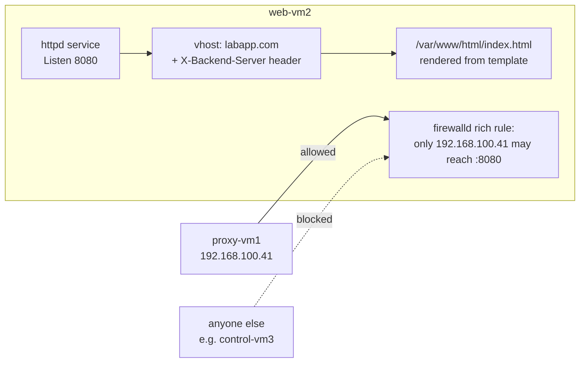

# Milestone 2 — Web Server Role

> [!abstract] What this milestone actually is
> Milestone 1 built the empty shelves. Milestone 2 puts the first thing on one of them: the `apache_web` role, which turns web-vm2 into the backend server for the platform — install Apache, listen on the right port, serve the managed page, and make sure **only the reverse proxy** can reach it. Nothing here is client-facing yet; this is the part of the system nobody is supposed to talk to directly.

> [!success] Audit result
> Checked every file in `roles/apache_web/` on `control-vm3` against [[OLIVERIO — Deployment Automation#4 · Milestone 2 — Web Server Role (Apache)]] — exact match. Then ran the deployment for real and checked the result independently on web-vm2, proxy-vm1, and control-vm3. Everything came back correct: service running, config valid, page served, firewall isolation actually enforced, SELinux still enforcing. No corrections needed.

---

## What you built, in plain terms



### 1. Install Apache — one task, one module

`ansible.builtin.dnf` with `state: present` means "make sure this package is here." The first time you ran the playbook this installed `httpd`; every time after, Ansible checks the package database first and does nothing if it's already there. That's why your second run showed `ok` instead of `changed` for this task.

### 2. Move Apache off port 80, onto 8080 — and validate before writing

Out of the box, Apache listens on port 80. This project puts Apache on **8080** instead, because port 80 is reserved for NGINX (the reverse proxy) later. The `lineinfile` task finds the existing `Listen` line in `httpd.conf` and replaces it — it doesn't touch anything else in that file.

The important part is `validate: httpd -t -f %s`. Before Ansible commits the change, it hands the **candidate** file to `httpd -t` and asks "would this be valid?" Only if the answer is yes does the real file get overwritten. A typo here would be caught before it could ever take Apache down.

### 3. Deploy the vhost — a config file that documents its own reasoning

The `vhost.conf.j2` template becomes `/etc/httpd/conf.d/labapp.com.conf` on the server. Three things worth noticing in what it produces:

- **`ServerName labapp.com`** — ties this virtual host to the platform's domain name.
- **`Header always set X-Backend-Server "web-vm2"`** — this is the "receipt." Later, when you curl the site through NGINX, seeing this header in the response proves the request actually reached Apache on this specific machine, not just NGINX answering on its own.
- **A custom log format (`proxied`)** — logs the real client IP (`X-Forwarded-For`) that NGINX will pass along, not just NGINX's own IP, which is all Apache would see by default.

### 4. Deploy the page — the actual content

`index.html.j2` renders into a real HTML file using facts Ansible already knows: the hostname, the IP, the backend port, and the OS version it detected. It also prints `DEPLOYED-BY-ANSIBLE` — a marker with one job: give the automated tests something unambiguous to search for, later, when they need to confirm this exact page (and not some leftover default page) is what's being served.

> [!question]- Why does the page task not have a `notify:` like the other two?
> Static files don't need a reload. Apache reads `index.html` fresh on every request — there's no cached copy of it sitting in the running process the way there is with the main configuration. Only *configuration* changes need Apache told about them; content changes don't.

### 5. The firewall rule — the part that makes "backend" mean something

```
rule family="ipv4" source address="192.168.100.41/32" port port="8080" protocol="tcp" accept
```

This is a **rich rule**, not just "open port 8080." It says: accept traffic on 8080, but only if it comes from `192.168.100.41` — the proxy's address, read from the inventory rather than typed by hand. Everyone else gets rejected. This was checked live:

| Who asked | What happened |
| --- | --- |
| `proxy-vm1` (192.168.100.41) | `200 OK`, page returned, `X-Backend-Server: web-vm2` header present |
| `control-vm3` (not the proxy) | Connection refused |

That's the actual proof that "the backend only talks to the proxy" isn't just a comment in a diagram — it's an enforced rule.

### 6. Start and enable the service, then flush the handlers

`state: started, enabled: true` means "running now, and running again after every reboot." The `meta: flush_handlers` task right after forces any queued handler (validate + reload) to run **immediately**, instead of waiting for the end of the play — because the very next task needs Apache to already be serving the latest config.

### 7. The two handlers — validate, then reload, never the other way around

```yaml
- name: Validate Apache configuration   # runs first
  ansible.builtin.command: httpd -t
  listen: Reload Apache

- name: Reload Apache service           # runs second
  ansible.builtin.service:
    state: reloaded
  listen: Reload Apache
```

Both handlers answer to the same name, `Reload Apache`, and Ansible runs handlers **in the order they're written in the file** — not the order they were notified. So validation always happens before the reload is attempted. And a `reload` (not `restart`) means in-flight requests finish instead of being dropped.

Handlers themselves only fire when a task actually reports `changed`. On your second run, nothing changed, so no handler ran — which is exactly why the recap showed fewer `ok` results for web-vm2 than the very first run did.

### 8. The built-in test — proof, not assumption

The last block calls the page **from web-vm2 itself**, over plain HTTP on port 8080, and fails the whole run if the `DEPLOYED-BY-ANSIBLE` marker isn't in the response. This is wrapped so it's skipped during a `--check` dry run (there's nothing real to fetch yet in that mode), and it's tagged `verify` so you can re-run just this check later with `--tags verify` without touching anything else.

---

## What was verified live, independently of the playbook's own output

| Check | Command | Result |
| --- | --- | --- |
| Service state | `systemctl is-active / is-enabled httpd` | active, enabled |
| Config validity | `httpd -t` | Syntax OK |
| Listening port | `ss -tlnp \| grep :8080` | httpd bound to `:8080` |
| Firewall rule | `firewall-cmd --list-rich-rules` | only `192.168.100.41/32` accepted |
| SELinux | `getenforce` + file context | still **Enforcing**; page file labeled `httpd_sys_content_t` (correct, no relabeling needed) |
| Page content | `curl http://127.0.0.1:8080/` | exact rendered page, marker present |
| Isolation — blocked | `curl` from control-vm3 to `.42:8080` | connection refused |
| Isolation — allowed | `curl -I` from proxy-vm1 to `.42:8080` | `200 OK`, `X-Backend-Server: web-vm2` |
| Idempotency | second `ansible-playbook site.yml` run | `changed=0` on web-vm2 |

---

## What Milestone 2 does *not* include yet

Nothing has HTTPS yet, and nothing is reachable from outside the lab network in the way an end user would reach it — that's the job of the next two milestones:

- **Milestone 4** builds the certificate authority and issues a certificate for `labapp.com`
- **Milestone 3** installs NGINX, deploys that certificate, and becomes the only thing a client is allowed to talk to directly

See [[OLIVERIO — Deployment Automation]] for the full walkthrough, and [[Milestone 1 — Project Hangar]] for how the project skeleton this role plugs into was built.
