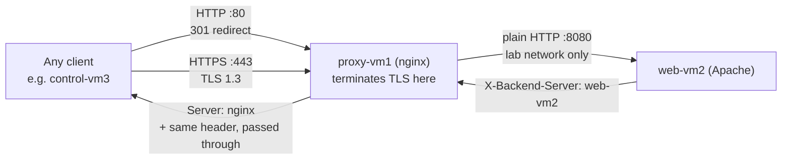

# Milestone 3 — Proxy Gateway Role

> [!abstract] What this milestone actually is
> This is where the platform becomes reachable and secure at the same time. The `nginx_proxy` role installs NGINX on proxy-vm1, hands it the certificate that [[Milestone 4 — Trust]] created, serves HTTPS with it, redirects plain HTTP to HTTPS, and forwards every request on to Apache on web-vm2. After this milestone, proxy-vm1 is the **only** machine a real client is ever meant to talk to directly.

> [!success] Audit result
> Checked `roles/nginx_proxy/` on `control-vm3` against [[OLIVERIO — Deployment Automation#6 · Milestone 3 — Proxy Gateway Role (NGINX + HTTPS)]] — exact match. Ran the role live and verified independently on proxy-vm1: service state, config validity, listening ports, firewall, SELinux, file permissions, the live rendered config, the TLS handshake itself, and the full request path from another machine through NGINX to Apache and back. Everything came back correct. No corrections needed.

---

## What you built, in plain terms



### 1. Install NGINX — plus one dependency the OS doesn't ship by default

Same idea as Apache in [[Milestone 2 — Web Server Role]] — `dnf: state=present`. The one difference: this task also installs `python3-libsemanage`, which the SELinux task later in this role needs. That package isn't on a minimal AlmaLinux install, and its absence is exactly what broke an early test run (see the "real issue hit" box in the master guide). Fixing a module's *dependency*, not just the module call, is part of getting the task right.

### 2. Create the TLS directories with different permissions for different sensitivity

```
/etc/pki/nginx           mode 0755   — certificates are public, anyone may read them
/etc/pki/nginx/private   mode 0700   — only root may even list what's in here
```

Confirmed live: exactly these permissions, and the SELinux context on every file is `cert_t` — the label NGINX's process type is already permitted to read, so nothing needed to be relabeled by hand.

### 3. Deploy the certificate, chain, and key — created on one machine, used on another

The `src:` in these `copy` tasks is read from **the control node** (`/root/lab-pki/...`, where [[Milestone 4 — Trust]] built it), and the `dest:` is written on **proxy-vm1**. This is the one place in the whole project where a file crosses from one machine to another rather than being generated locally. Three files land here:

| File on proxy-vm1 | What it is | Mode |
| --- | --- | --- |
| `/etc/pki/nginx/labapp.com.crt` | the server certificate | `0644` (public) |
| `/etc/pki/nginx/root-ca.crt` | the Root CA — the "chain" | `0644` (public) |
| `/etc/pki/nginx/private/labapp.com.key` | the server's private key | `0600` (root only) |

The key copy task has `no_log: true`, so even if something went wrong, Ansible's own output would never print the key's contents to the terminal or a log file.

> [!question]- Why does the certificate need the Root CA copied alongside it?
> A TLS client doesn't automatically know which Root CA signed a server's certificate — it has to be told, or it has to be given the whole chain to walk itself. Serving the Root CA cert (`root-ca.crt`) next to the server cert means the client Milestone 5 sets up has everything it needs to verify the signature, without a separate lookup.

### 4. Deploy `nginx.conf` — the whole file, checked before it's live

```
validate: nginx -t -c %s
```

Ansible renders the template to a temporary file first and runs `nginx -t -c` against **that** temporary file — never the real one — before deciding whether to overwrite `/etc/nginx/nginx.conf`. This only works because the role manages the **entire** file, not a fragment dropped into `conf.d/`: a fragment can't be syntax-checked on its own, since it isn't a complete, valid config by itself.

Confirmed live: `nginx -t` on the actual installed file reports "syntax is ok" and "test is successful," and the live file's content matches the template's output exactly — same `upstream`, same `server_tokens off`, same `ssl_protocols`.

Inside the config itself, three things worth calling out:

- **Port 80 → 301 redirect.** Nothing is ever served in clear text; the port-80 server block's only job is to send the browser to `https://` instead.
- **Port 443 → TLS termination + forwarding.** `ssl_certificate` and `ssl_certificate_key` point at the files the previous task just copied in. `ssl_protocols TLSv1.2 TLSv1.3` sets a floor; the actual cipher choices are left to AlmaLinux's system-wide crypto policy rather than hard-coded, so one OS-level setting governs every TLS service on the box.
- **The forwarding headers.** `X-Real-IP`, `X-Forwarded-For`, and `X-Forwarded-Proto` are added so that Apache, sitting behind the proxy, can still tell who the real client was and that the original request arrived over HTTPS — without them, Apache would only ever see the proxy's own IP address and think everything was plain HTTP.

### 5. Firewall and SELinux — opened for everyone, but only for the two ports that should be public

Unlike Apache's backend port (locked to the proxy's IP only), ports 80 and 443 here are opened to **all** hosts — because this machine is the one thing in the platform meant to be reached from anywhere. Confirmed live: `firewall-cmd --list-ports` → `80/tcp 443/tcp`, nothing more.

The `seboolean` task turns on `httpd_can_network_relay` — the specific permission that lets an NGINX process (SELinux type `httpd_t`) open its own outbound connection to Apache. Confirmed live: `getsebool httpd_can_network_relay` → `on`, and `getenforce` → `Enforcing`. Nothing was turned off to make this work; the platform is running exactly as strictly as it would in production.

### 6. Start the service, flush handlers, then prove the path actually works

Same pattern as Apache: `state: started, enabled: true`, then `meta: flush_handlers` so any pending certificate/config reload is applied *before* the tests that follow depend on it being live.

### 7. The handler — reload, not restart

```yaml
- name: Reload NGINX
  ansible.builtin.service:
    state: reloaded
```

One handler this time (unlike Apache's two), because the validation already happened at write-time via `validate:` on the template task — there's nothing left to check separately before reloading. `reloaded` sends NGINX a graceful signal: new worker processes pick up the new config and certificate, while any request already in flight on an old worker finishes normally.

### 8. The built-in tests — two separate claims, both proven

```yaml
- Proxy -> backend reachability   # can this proxy actually reach Apache?
- Full path through NGINX         # does a real HTTPS request come back correctly?
```

The second test deliberately sets `validate_certs: false` — not because the certificate is untrustworthy, but because *this* test runs before any client has been told to trust the Root CA. Proving the certificate is trusted end-to-end is [[Milestone 5]]'s job specifically; this test's job is only to prove NGINX terminates TLS and forwards correctly. It also checks the `X-Backend-Server` header equals the webserver group's host — the same "receipt" mechanism from Milestone 2, now checked automatically instead of by eye.

---

## What was verified live, independently of the playbook's own output

| Check | Command | Result |
| --- | --- | --- |
| Service state | `systemctl is-active / is-enabled nginx` | active, enabled |
| Config validity | `nginx -t` | syntax ok, test successful |
| Listening ports | `ss -tlnp` | bound to `:80` and `:443` |
| Firewall | `firewall-cmd --list-ports` | `80/tcp 443/tcp` only |
| SELinux | `getenforce` / `getsebool httpd_can_network_relay` | **Enforcing** / `on` |
| TLS file permissions + context | `ls -laZ` | `0755`/`0700`/`0600` as designed, all labeled `cert_t` |
| Live config content | `grep` on the installed `nginx.conf` | matches the template's rendering exactly |
| HTTP → HTTPS redirect | `curl -I http://192.168.100.41/` | `301 Moved Permanently` |
| TLS handshake | `openssl s_client -connect …:443 -servername labapp.com` | negotiated **TLSv1.3**, served the correct cert (subject `labapp.com`, issuer `AirNav DAS Lab Root CA`) |
| Full request path | `curl` from control-vm3 through NGINX | `200 OK`, `Server: nginx`, `X-Backend-Server: web-vm2` — proof the request crossed both machines |
| Idempotency | second `ansible-playbook site.yml` run | every `nginx_proxy` task reported `ok`, none `changed` |

> [!question]- The `openssl s_client` check above said `Verify return code: 21 (unable to verify the first certificate)` — is that a problem?
> No — it's expected at this stage. That check was run from a machine that hasn't been told to trust the Root CA yet. It proves NGINX served the *correct* certificate; it doesn't yet prove a client trusts it, because **no client has been configured to trust it yet.** That's the entire point of [[Milestone 5 — Client Landing Zone|Milestone 5]] — once the Root CA is installed in control-vm3's trust store, the exact same HTTPS request returns `Verify return code: 0 (ok)` instead.

---

## Why the certificate had to exist before this role could even run

`nginx -t -c %s` doesn't just check syntax — it checks that every file the config *references* actually exists and is readable, including `ssl_certificate` and `ssl_certificate_key`. If [[Milestone 4 — Trust]] hadn't already produced `labapp.com.crt` and `labapp.com.key` on the control node for this role to copy over, the very first `nginx -t` here would have failed and this role could never succeed — which is exactly why the master guide builds Milestone 4 before Milestone 3, even though the spec numbers them the other way around. See [[OLIVERIO — Deployment Automation#2.7 Build order vs milestone numbers]].

---

## What Milestone 3 does *not* include yet

HTTPS works, and the whole request path from proxy to backend is proven — but no *client* has been told any of this is trustworthy yet, and nothing resolves the domain name `labapp.com` to this proxy automatically:

- **Milestone 5** installs the Root CA into the system trust store on the client and adds `labapp.com` to `/etc/hosts`, then re-runs the same kind of HTTPS check from Milestone 3 — this time with full certificate validation turned on, and it passes

See [[OLIVERIO — Deployment Automation]] for the full walkthrough, [[Milestone 4 — Trust]] for how the certificate this role deploys was built, and [[Milestone 2 — Web Server Role]] for the backend this proxy forwards to.
