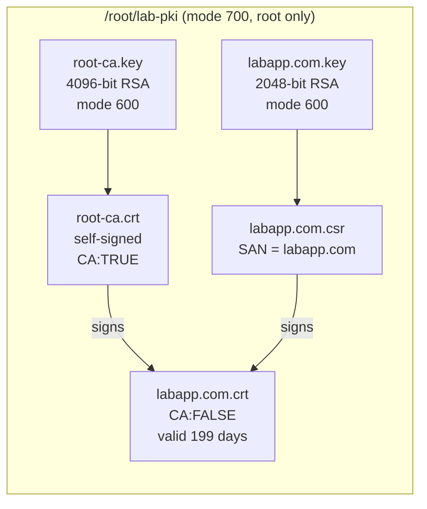

# Milestone 4 — Trust

> [!abstract] What this milestone actually is
> Everything HTTPS depends on is created here, before HTTPS itself exists: a **Root CA** (a certificate that signs other certificates) and a **server certificate for `labapp.com`**, signed by that Root CA. Nothing is deployed to the proxy yet — this milestone only *creates* the trust material on the control node. See [[OLIVERIO — Deployment Automation#2.7 Build order vs milestone numbers]] for why this has to exist before NGINX's role can even pass its own config check.

> [!success] Audit result
> Checked `roles/pki_ca/` on `control-vm3` against [[OLIVERIO — Deployment Automation#5 · Milestone 4 — Trust (Internal PKI)]] — exact match. Ran the role live and inspected every file it produced with `openssl` directly, independently of what the playbook itself reported. Root CA extensions, server cert extensions, SAN, key sizes, validity windows, file permissions, chain verification, and key/cert matching all came back correct. No corrections needed.

---

## What you built, in plain terms



A **Root CA** is just a certificate that is allowed to *sign other certificates*. It's trusted because you, the administrator, tell every client to trust it directly — that's what Milestone 5 does later. Once a client trusts the Root CA, it automatically trusts anything the Root CA has signed, including the `labapp.com` certificate built here.

### 1. The CA working directory — `/root/lab-pki`, mode 700

Everything the certificate authority owns lives in one folder, owned by root, permission `700` (only root can even list what's inside). It sits **outside** the Ansible project folder on purpose — if this folder were inside `/root/ansible-platform`, a careless `git add .` could commit a private key to a repository. Confirmed live: `700 root:root /root/lab-pki`.

### 2. The Root CA — a key, then a request, then a self-signed certificate

Three steps, in order, because that's how a certificate actually gets made:

1. **`openssl_privatekey`** — generates `root-ca.key`, 4096-bit RSA. Confirmed: `Private-Key: (4096 bit, 2 primes)`. Long-lived trust anchors get the stronger key size because they're expensive to replace everywhere once trusted.
2. **`openssl_csr`** — a *request* describing what kind of certificate this should be. The two extensions that matter here:
   - `basic_constraints: [CA:TRUE, pathlen:0]` — "this certificate is allowed to sign other certificates, but only ordinary server/client certificates, not another CA." Confirmed live: `CA:TRUE, pathlen:0`.
   - `key_usage: [keyCertSign, cRLSign]` — "the only thing this key is for is signing certificates and revocation lists." Confirmed live: `Certificate Sign, CRL Sign`, marked **critical** — meaning a client that doesn't understand this extension is required to reject the certificate outright, rather than ignore the restriction.
3. **`x509_certificate` with `provider: selfsigned`** — the Root CA signs *itself*, because there's nothing above it in the chain. `selfsigned_not_after: "+3650d"` gives it 10 years — confirmed live: issued 2026-09-24, expires 2036-09-21.

### 3. The server certificate — same pattern, different extensions, signed by the Root CA instead

1. **`openssl_privatekey`** — `labapp.com.key`, 2048-bit RSA this time. Confirmed: `Private-Key: (2048 bit, 2 primes)`. A smaller key is fine here because this certificate is short-lived and easy to reissue; it doesn't need to survive a decade of cryptographic advances the way the root does.
2. **`openssl_csr`** — the request for the actual website certificate:
   - **`subject_alt_name: ["DNS:labapp.com"]`** — this is the part that actually matters to a browser or `curl`. Modern TLS clients check the domain name against the **SAN**, not the Common Name (CN). The CN here is set too, but only for readability — RFC 9525 formally deprecated relying on CN for hostname matching. Confirmed live: `X509v3 Subject Alternative Name: DNS:labapp.com`.
   - `basic_constraints: [CA:FALSE]` — "this certificate must never be used to sign other certificates." Confirmed critical and `CA:FALSE`.
   - `key_usage: [digitalSignature, keyEncipherment]` + `extended_key_usage: [serverAuth]` — "this key is for proving server identity in a TLS handshake, nothing else." Confirmed: both present and critical.
3. **`x509_certificate` with `provider: ownca`** — this time it's *not* self-signed. `ownca_path` and `ownca_privatekey_path` point at the Root CA's own cert and key, so the Root CA does the signing. `ownca_not_after: "+199d"` — confirmed live: issued 2026-09-24, expires 2027-04-11, exactly 199 days.

> [!question]- Why 199 days and not something rounder, like 365?
> Public certificate authorities are moving toward much shorter maximum lifetimes under CA/Browser Forum Ballot SC-081: the cap drops to **200 days starting 15 March 2026**. A private lab CA isn't bound by that rule at all — but matching the practice a real public CA now enforces is good discipline, and it's a detail worth being able to explain if asked why it isn't "just 10 years for everything."

### 4. Proving the chain actually works — not just trusting the task said "ok"

The role ends with a read-only block that runs `openssl verify -CAfile root-ca.crt labapp.com.crt` and prints the subject, issuer, SAN, and expiry. This block is wrapped so it's skipped in `--check` mode (nothing exists yet to check on a dry run) and tagged `verify` so it can be re-run on its own later. When you ran it, it printed:

```
chain  : /root/lab-pki/labapp.com.crt: OK
issuer : AirNav DAS Lab Root CA
SAN    : ['DNS:labapp.com']
```

I re-ran that same `openssl verify` independently, outside the playbook, and it agreed: `labapp.com.crt: OK`.

> [!question]- What does "chains to the Root CA" actually mean, mechanically?
> The Root CA's private key produced a cryptographic signature over the server certificate's contents when it was issued. `openssl verify` takes the Root CA's *public* certificate (never the private key — it never needs it for this) and checks whether that signature is mathematically valid for this exact certificate. If even one byte of the certificate changed after signing, this check would fail. An `OK` here is a much stronger statement than "the file looks right" — it's proof the Root CA specifically signed this specific certificate.

---

## What was verified live, independently of the playbook's own output

| Check | Command | Result |
| --- | --- | --- |
| Folder/key permissions | `stat -c "%a %U:%G"` | `700 root:root` dir, `600 root:root` on both `.key` files, `644` on both `.crt` files |
| Root CA key size | `openssl rsa -in root-ca.key -text` | 4096-bit |
| Root CA extensions | `openssl x509 -ext basicConstraints,keyUsage` | `CA:TRUE, pathlen:0` · `Certificate Sign, CRL Sign` (critical) |
| Root CA validity | `openssl x509 -startdate -enddate` | 2026-09-24 → 2036-09-21 (10 years) |
| Server key size | `openssl rsa -in labapp.com.key -text` | 2048-bit |
| Server cert extensions | `openssl x509 -ext subjectAltName,basicConstraints,keyUsage,extendedKeyUsage` | SAN `DNS:labapp.com` · `CA:FALSE` · `Digital Signature, Key Encipherment` (critical) · `TLS Web Server Authentication` |
| Server cert validity | `openssl x509 -startdate -enddate` | 2026-09-24 → 2027-04-11 (199 days) |
| Chain verification | `openssl verify -CAfile root-ca.crt labapp.com.crt` | `labapp.com.crt: OK` |
| Key/cert pairing | compared public key extracted from cert vs. from key file | **MATCH** — the private key on disk is provably the one that produced this certificate |
| Idempotency | second `ansible-playbook site.yml` run | all `pki_ca` tasks reported `ok`, none `changed` |

> [!question]- Why bother checking that the key matches the cert?
> It's possible for a key and a certificate to both be individually valid files while not belonging to each other — for example, if a key got regenerated by hand after the cert was already issued. NGINX would fail to start with a key/cert mismatch, and the error message for that is not always obvious. Comparing the public key extracted from each file is the same check a TLS library effectively performs at startup, done here as evidence rather than left to be discovered later.

---

## Why this role is idempotent, specifically

Every module used here — `openssl_privatekey`, `openssl_csr`, `x509_certificate` — **inspects the file already on disk** before doing anything. Running the role again doesn't regenerate a new key or reissue a new certificate; it parses the existing one, compares its actual properties (size, subject, SAN, validity, issuer) against what the role asks for, and only acts if something is actually different. That's why the second run above showed every PKI task as `ok`, not `changed` — the certificate authority you built is exactly the one being asked for, so there is nothing to redo.

This matters more here than almost anywhere else in the project: a naive approach using raw `openssl` shell commands would regenerate the Root CA on every single run, which would immediately break every certificate it had already signed and every client that had already trusted it.

---

## What Milestone 4 does *not* include yet

The certificate exists only on control-vm3, in `/root/lab-pki`. Nothing has been copied anywhere, and no service is using it yet:

- **Milestone 3** installs NGINX on proxy-vm1 and copies the server certificate, key, and Root CA chain there, then actually serves HTTPS with them
- **Milestone 5** puts the Root CA into the trust store on the client and proves the whole chain is trusted end to end

See [[OLIVERIO — Deployment Automation]] for the full walkthrough, [[Milestone 1 — Project Hangar]] for the project skeleton, and [[Milestone 2 — Web Server Role]] for the backend this certificate will eventually sit in front of.
