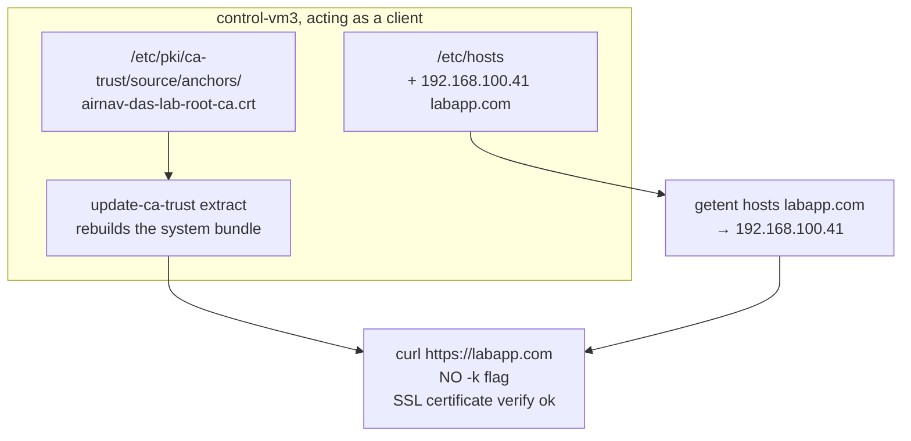

# Milestone 5 — Client Landing Zone

> [!abstract] What this milestone actually is
> Every previous milestone built a piece of the platform. This one connects the last wire: it tells **control-vm3**, acting as a client, where `labapp.com` actually lives and that its certificate is trustworthy — then it proves, with no shortcuts, that the whole thing works end to end. This is the milestone where "it works" stops being an assumption and becomes something the platform demonstrates about itself.

> [!success] Audit result
> Checked `roles/client_trust/` and `roles/verify/` on `control-vm3` against [[OLIVERIO — Deployment Automation#7 · Milestone 5 — Client Landing Zone]] — exact match. Ran the roles live and verified independently: `/etc/hosts` content, the trust anchor file and its filename, the extracted trust bundle, an HTTPS request made with `curl` **without** `-k`, and the Apache access log on the backend. Everything came back correct. No corrections needed.

---

## What you built, in plain terms



### 1. `client_trust`: one line in `/etc/hosts`, added without disturbing anything else

```yaml
regexp: '^\S+\s+{{ domain_name | regex_escape }}$'
line: "{{ proxy_address }} {{ domain_name }}"
```

The `regexp` matches **only** a line that ends in `labapp.com` — nothing about `localhost`, `control-vm3`, `pve`, or `laptop` is touched. Confirmed live: every pre-existing line in `/etc/hosts` is exactly where it was, with one new line added at the end:

```
192.168.100.41 labapp.com
```

`backup: true` means every time this line actually changes, Ansible saves a timestamped copy of the file first (`/etc/hosts.<timestamp>~`) — a safety net for a file that, if broken, could take down every other name resolution on the machine too.

### 2. Placing the Root CA in the system trust anchors

```yaml
dest: "{{ client_trust_anchor }}"
```

Notice this variable isn't hard-coded in the task — it comes from `group_vars/client.yml`, which sets it to `airnav-das-lab-root-ca.crt`, overriding the role's own generic default of `lab-root-ca.crt` in `roles/client_trust/defaults/main.yml`. That's [[OLIVERIO — Deployment Automation#1.4 Variables and precedence|variable precedence]] working exactly as designed: the group-specific value wins. Confirmed live — the file that actually landed on disk is named `airnav-das-lab-root-ca.crt`, matching the group_vars override, not the role default.

### 3. `update-ca-trust extract` — a handler, not a task

```yaml
notify: Update CA trust
```

Copying the certificate file alone doesn't make the system trust it. AlmaLinux/RHEL keep a **compiled bundle** of trusted certificates under `/etc/pki/ca-trust/extracted/`, built from everything in `source/anchors/`. `update-ca-trust extract` is the command that rebuilds that bundle. Making it a handler means it only runs when the anchor file actually changed — not on every single playbook run — which is exactly the kind of unnecessary work idempotency is supposed to avoid.

### 4. `meta: flush_handlers` — because the next role needs the trust store *right now*

Normally a handler waits until the very end of the play. But the `verify` role runs **in this same play**, immediately after, and its HTTPS check depends on the trust bundle already being rebuilt. `flush_handlers` forces `update-ca-trust extract` to run immediately instead of waiting, so by the time `verify` starts, the trust store is already current.

### 5. `verify`: four separate claims, each checked, then a plain-language summary

This is the role that turns "I think it works" into "here is proof, in order":

| Task | What it actually proves | How |
| --- | --- | --- |
| Resolve `labapp.com` | Name resolution really goes through `/etc/hosts`, not by accident | `getent hosts` — the same resolver curl and every other program use, not just `ping` |
| Confirm the Root CA is trusted | The certificate isn't just *copied* somewhere, it's actually *active* in the trust store | `trust list --filter=ca-anchors` — reads the compiled bundle, not the source folder |
| HTTP → HTTPS redirect | Nothing is reachable in plain text | expects exactly `301`, to a `https://` URL for the same domain |
| HTTPS with **full** certificate validation | The whole chain — hostname match, signature, trust — checks out, the way a real browser would check it | `validate_certs: true`, plus checks the response actually came from `web-vm2` |

> [!question]- Why does the redirect check demand the *exact* status code 301, not just "any redirect"?
> A `302 Found` would also send the browser somewhere else, but it has a different meaning (temporary vs. permanent) and search engines/clients treat it differently. Locking the check to `301` specifically catches a config drift where someone changes `return 301` to something else in `nginx.conf` without meaning to — a looser check would quietly let that pass.

### 6. The final summary — one message, five separate facts

```
DNS      : labapp.com -> 192.168.100.41 (proxy)
Trust    : AirNav DAS Lab Root CA present in ca-anchors
Redirect : http -> https://labapp.com/ (301)
HTTPS    : 200, Server=nginx, X-Backend-Server=web-vm2
Path     : client -> NGINX 192.168.100.41:443 -> Apache 192.168.100.42:8080
```

Every line here corresponds to one of the checks above — this isn't a separate claim, it's a readable restatement of what was already individually proven, so the evidence doesn't require scrolling back through the raw task output to understand.

---

## What was verified live, independently of the playbook's own output

| Check | Command | Result |
| --- | --- | --- |
| `/etc/hosts` unchanged elsewhere | `cat /etc/hosts` | every original line intact, one new line added: `192.168.100.41 labapp.com` |
| Resolver | `getent hosts labapp.com` | `192.168.100.41  labapp.com` |
| Trust anchor filename | `ls /etc/pki/ca-trust/source/anchors/` | `airnav-das-lab-root-ca.crt` — confirms the `group_vars/client.yml` override actually won over the role default |
| Trust bundle rebuilt | `trust list --filter=ca-anchors` | `label: AirNav DAS Lab Root CA`, `trust: anchor` |
| HTTP redirect | `curl -I http://labapp.com` | `301 Moved Permanently` |
| **HTTPS with no `-k`** | `curl -v https://labapp.com` | `SSL certificate verify ok.` — curl's own TLS stack accepted the chain, nothing was told to ignore errors |
| Response headers | same `curl -v` | `Server: nginx`, `X-Backend-Server: web-vm2` |
| Page content | `curl -s https://labapp.com` | exact managed page, `DEPLOYED-BY-ANSIBLE` marker present |
| Client IP forwarded correctly | Apache access log on web-vm2 | `192.168.100.41 xff="192.168.100.40" proto=https` — TCP peer is the proxy, but the *real* client (control-vm3) is preserved in `X-Forwarded-For` |
| Idempotency | second `ansible-playbook site.yml` run | every `client_trust` and `verify` task reported `ok`, none `changed` |

> [!question]- What does "no `-k`" actually prove, and why does it matter this much?
> `curl -k` (or `--insecure`) tells curl to skip certificate validation entirely — it would return `200 OK` for a certificate signed by anyone, expired, or for the wrong domain. Every check in this milestone was run **without** that flag. When `curl -v https://labapp.com` prints `SSL certificate verify ok.` with no `-k` anywhere in the command, that specifically means: curl checked the signature chain against its trust store, checked the hostname against the SAN, checked the certificate hadn't expired — and accepted all three on its own. That is the actual definition of "this HTTPS setup is trusted," not an assumption dressed up to look like one.

---

## How this milestone closes the loop with the earlier ones

| Earlier milestone | What it created | What Milestone 5 does with it |
| --- | --- | --- |
| [[Milestone 4 — Trust]] | the Root CA certificate | copied into the client's trust store here, so the client can verify anything the CA signed |
| [[Milestone 3 — Proxy Gateway Role]] | HTTPS on proxy-vm1, verified with `validate_certs: false` | verified again here, this time with `validate_certs: true` — the exact gap that milestone left open on purpose |
| [[Milestone 2 — Web Server Role]] | the `X-Backend-Server` header | checked automatically here as the final proof the request reached the right backend, not just *a* backend |

None of the earlier milestones' verification steps used full certificate validation, by design — each one tested only what it could prove on its own, without depending on client configuration that didn't exist yet. Milestone 5 is where all of it becomes provable together, in the way a real user's browser would actually experience it.

---

## Scope note: this is the entire graded requirement — a personal laptop is not

> [!important] The Root CA does not need to be installed anywhere except the client VM
> "Make the Root CA certificate available from the client host" refers to **control-vm3**, which is the `client` group member in this project's own inventory. That's exactly what `client_trust`'s "Place the Root CA in the system trust anchors" task above does, automatically, on every run. Nothing about the assignment requires trusting the CA on the physical laptop you happen to be typing on — that machine isn't part of the three-VM platform at all.

If you personally want to *look at* `https://labapp.com` in an ordinary GUI browser on your own laptop — purely for your own visual confirmation, not for grading — that laptop is outside Ansible's inventory, so nothing here configures it automatically. Two consequences follow directly from how [[Milestone 4 — Trust|Milestone 4]] builds the certificate authority (see also [[OLIVERIO — Deployment Automation#8.7 Remaining limitations (be honest in the defense)|the project's remaining limitations]]):

- Every time control-vm3 is rebuilt from a clean snapshot, the `pki_ca` role generates a **new** Root CA key pair (same name, different key), because there is nothing left on disk to preserve.
- A browser that trusted the *previous* Root CA will reject the *new* one with a signature-verification error (`SEC_ERROR_BAD_SIGNATURE` in Firefox-family browsers) — it recognizes the name, but the key underneath it no longer matches.

`refresh-local-trust.sh`, in this same folder, automates re-syncing this for **Chromium and other NSS-aware browsers** on Linux, which read a shared certificate database at `~/.pki/nssdb`:

```bash
./refresh-local-trust.sh                 # defaults to control-vm3 at 192.168.100.40
./refresh-local-trust.sh 192.168.100.40  # or pass the address explicitly
```

It fetches the *current* `root-ca.crt` from control-vm3, removes any previously trusted certificate under the same name (since NSS does not automatically replace one nickname with another key), and imports the current one — with no GUI dialog involved. Re-running it after every VM rebuild keeps Chromium in sync automatically.

> [!warning] This does not cover Zen Browser (or any other Firefox-family browser)
> Firefox-family browsers, Zen Browser included, keep their own private certificate database per profile and never read `~/.pki/nssdb`. There is no way to script around this from outside the browser itself. For those browsers, the manual steps still apply after every CA regeneration: Settings → Privacy & Security → Certificates → View Certificates → Authorities → delete the old **"AirNav DAS Lab Root CA"** entry → Import the freshly fetched `root-ca.crt` → tick "Trust this CA to identify websites."

---

## What comes after Milestone 5

The platform is now fully deployed and provably trusted end to end. The only thing left is proving it stays that way — that re-running the playbook doesn't undo or duplicate anything, and that if something drifts out of the desired state by hand, Ansible detects and corrects it:

- **Milestone 6** re-runs the whole playbook on a clean system, re-runs it again to show `changed=0`, then deliberately breaks something and shows Ansible fixing it

See [[OLIVERIO — Deployment Automation]] for the full walkthrough, and the earlier milestone notes ([[Milestone 1 — Project Hangar]], [[Milestone 2 — Web Server Role]], [[Milestone 4 — Trust]], [[Milestone 3 — Proxy Gateway Role]]) for how each piece this one depends on was built.
