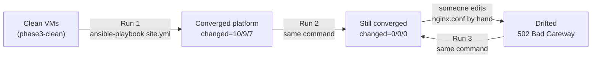

# Milestone 6 — Repeatability Check

> [!abstract] What this milestone actually is
> Every earlier milestone built a piece of the platform and proved that piece worked *once*. This milestone proves something different: that the automation is **safe to run again**, that it **changes nothing when nothing needs changing**, and that if a human quietly breaks something by hand, the same one command notices and fixes it. This is the difference between "a script that sets things up" and "automation you can trust to run unattended, repeatedly, for years."

> [!success] Audit result
> Checked your saved `run1.log` / `run2.log` against what the guide predicts in [[OLIVERIO — Deployment Automation#8 · Milestone 6 — Repeatability Check]] — exact match. Because your shell history wasn't preserved from the SSH session, I independently **reproduced every demo live** rather than take the logs on faith: reset to baseline, created drift by hand, detected it with `--check --diff`, corrected it, re-confirmed `changed=0`, and reproduced the validation-guard rejection. Every result matched exactly. No corrections needed.

---

## What "repeatable" actually means here, in plain terms



The command never changes. What changes is only *how much work it has left to do* — a lot on a clean VM, nothing on an already-correct VM, and exactly the broken piece on a drifted VM. That's the whole idea Milestone 6 sets out to demonstrate.

---

## Run 1 — first deployment on clean VMs

Your saved recap:

```text
control-vm3                : ok=20   changed=10   unreachable=0    failed=0
proxy-vm1                  : ok=15   changed=9    unreachable=0    failed=0
web-vm2                    : ok=12   changed=7    unreachable=0    failed=0
```

| Host | `changed` | What actually happened |
| --- | --- | --- |
| control-vm3 | 10 | 7 PKI tasks ([[Milestone 4 — Trust]]: dir, 2 keys, 2 CSRs, 2 certs) + `/etc/hosts` line + CA anchor + `update-ca-trust` handler |
| web-vm2 | 7 | package, `Listen` line, vhost, page, firewall rule, service start, reload handler |
| proxy-vm1 | 9 | package(s), TLS dirs, cert + chain copy, key copy, `nginx.conf`, firewall ports, SELinux boolean, service start, reload handler |

`failed=0` on every host — the whole platform came up in one pass, in the order [[Milestone 4 — Trust|PKI]] → [[Milestone 2 — Web Server Role|Apache]] → [[Milestone 3 — Proxy Gateway Role|NGINX]] → [[Milestone 5 — Client Landing Zone|client + verify]] that [[OLIVERIO — Deployment Automation#2.7 · Build order vs milestone numbers|the build order in §2.7]] requires.

---

## Run 2 — nothing left to do

Your saved recap:

```text
control-vm3                : ok=19   changed=0    unreachable=0    failed=0
proxy-vm1                  : ok=14   changed=0    unreachable=0    failed=0
web-vm2                    : ok=10   changed=0    unreachable=0    failed=0
```

I reproduced this myself before touching anything else, and got the identical numbers.

> [!question]- Why is `ok` one lower per host than Run 1, even though `changed=0`?
> Because a handler that never fires doesn't count as a task result at all. `control-vm3` and `proxy-vm1` each have one handler (`Update CA trust`, `Reload NGINX`); web-vm2 has two (`Validate Apache configuration`, `Reload Apache service`). In Run 1 every one of those fired because something changed. In Run 2, nothing changed, so no handler was notified, and the `ok` total drops by exactly that many — 1, 1, and 2.

Nothing here is a coincidence. Every module type in this project achieves this the same way: it inspects the real, current state before deciding to act.

| Task type | Why a correct system produces `ok`, not `changed` |
| --- | --- |
| `dnf` | Checks the RPM database first; a package already installed is left alone |
| `template` / `copy` | Compares a checksum of the rendered file against what's on disk |
| `lineinfile` | Looks for a line matching the exact pattern before touching anything |
| `service` | Asks systemd for the current state first |
| `firewalld` / `seboolean` | Reads the current rule/boolean before changing it |
| `community.crypto.*` | Parses the existing key/CSR/cert and only regenerates if its actual properties differ |

---

## Controlled drift — proving the loop actually closes

This is the part that separates "it worked once" from "it's automation." I reproduced the whole sequence live:

**1. Baseline confirmed clean** — ran the playbook once first: `changed=0` on all three hosts, exactly as Run 2 above.

**2. Created drift by hand** — logged into proxy-vm1 directly and changed the backend port NGINX forwards to, bypassing Ansible entirely:

```bash
sed -i 's/192.168.100.42:8080;/192.168.100.42:9999;/' /etc/nginx/nginx.conf && systemctl reload nginx
```

```
after drift: http_code=502
```

The site broke immediately — NGINX is now trying to reach Apache on a port nothing is listening on.

**3. Detected the drift without touching anything** — `ansible-playbook site.yml --check --diff` is a **dry run**: it reports what it *would* change, but writes nothing.

```diff
     upstream apache_backend {
-        server 192.168.100.42:9999;   # from the inventory via group_vars
+        server 192.168.100.42:8080;   # from the inventory via group_vars
     }
```

Confirmed the live file was still untouched afterward — `grep 9999 /etc/nginx/nginx.conf` on proxy-vm1 still showed the broken value. `--check` really changes nothing; it only shows you what's wrong.

**4. Corrected it for real** — dropped `--check`, added `--diff` to see exactly what changed:

```
proxy-vm1  : ok=15   changed=2    failed=0
```

Exactly 2 changes: the `nginx.conf` template rewrite, and the `Reload NGINX` handler it notified. `web-vm2` and `control-vm3` stayed at `changed=0` — the drift was isolated to one file on one host, and the correction touched only that.

```
after correction: http_code=200
```

**5. Ran it once more** — back to `changed=0` everywhere, confirming the platform re-converged to a stable state and stayed there.

> [!question]- Why does correcting the drift only report `changed=2` and not re-touch the certificate, the webpage, or anything else?
> Because every other task independently checks its own piece of state, and every other piece of state was still correct. Only `nginx.conf`'s checksum no longer matched what the template would render, so only that task (and its handler) reported `changed`. This is the same idempotency property from Run 2, just demonstrated under damage instead of on a clean system — the automation doesn't need to be told *what* broke, it just re-checks everything and fixes whatever no longer matches.

---

## The validation guard — proving a mistake can't go live

This is a different kind of safety than idempotency: it's about stopping a **bad change** before it's ever applied, not just detecting drift after the fact. I reproduced this live too, using `-e` to simulate a typo in a variable:

```bash
md5sum /etc/nginx/nginx.conf
# 71951e5f7652d02e191ae4b292e23cc1  /etc/nginx/nginx.conf

ansible-playbook site.yml --tags nginx -e "nginx_ssl_protocols=TLSv9.9"
```

```
fatal: [proxy-vm1]: FAILED! =>
    msg: failed to validate
    stderr: |-
        nginx: [emerg] invalid value "TLSv9.9" in /root/.ansible/tmp/.../source:41
```

```bash
md5sum /etc/nginx/nginx.conf
# 71951e5f7652d02e191ae4b292e23cc1  /etc/nginx/nginx.conf   ← IDENTICAL checksum
curl -s -o /dev/null -w "%{http_code}\n" https://labapp.com
# 200                                                        ← site never went down
```

The checksum before and after the failed attempt is **exactly the same file**. `validate: nginx -t -c %s` in the [[Milestone 3 — Proxy Gateway Role|nginx_proxy role]] tested the *candidate* file — a temporary copy Ansible builds in `/root/.ansible/tmp/` — and refused to install it once `nginx -t` rejected it. The real, running config was never touched, and the site stayed up the entire time.

> [!question]- What's the actual difference between the drift demo and the validation-guard demo?
> The drift demo shows Ansible **fixing** a mistake that already happened on the server. The validation guard shows Ansible **refusing to make** a mistake in the first place. Both matter for different reasons: drift correction handles a human going around Ansible; the validation guard handles a mistake made *through* Ansible itself, like a typo in a variable or a bad edit to a template.

---

## What was verified live, independently, on 2026-09-24

| Check | Result |
| --- | --- |
| Baseline before drift | `changed=0` on all three hosts |
| Drift created (bad upstream port) | site returned `502` |
| `--check --diff` detection | showed the exact broken line, changed nothing on disk |
| Correction | `proxy-vm1 changed=2`, everyone else `changed=0`, site back to `200` |
| Re-run after correction | `changed=0` on all three hosts again |
| Bad `-e` override rejected | `failed to validate`, identical file checksum before/after, site stayed `200` throughout |

---

## Automation issues actually met while building this project

These aren't hypothetical — each one really happened during development and is explained in its own milestone note:

| # | Issue | Where it's explained |
| - | --- | --- |
| 1 | `seboolean`: `No module named 'semanage'` — missing dependency on a minimal OS | [[Milestone 3 — Proxy Gateway Role]] |
| 2 | `--check` mode can't run read-only tests against state that doesn't exist yet | every role's tests are wrapped in `when: not ansible_check_mode` |
| 3 | `ansible.posix` collection too new for ansible-core 2.14 | [[Milestone 1 — Project Hangar]] |
| 4 | A stale Proxmox snapshot silently captured pre-delete disk blocks because the guest hadn't flushed writes yet | fixed by running `sync; sync` before snapshotting — see the warning in [[OLIVERIO — Deployment Automation#8.1 Reset to clean prepared VMs]] |

That fourth one is worth being able to explain in the defense even though it's outside the Ansible project itself: it's a real example of "trust the check, not the assumption" — the first version of the clean snapshot *looked* right until it was actually rolled back and inspected.

---

## Remaining limitations — worth saying out loud, not hiding

- **Root over SSH.** Fine for a lab; production would use a dedicated automation account with `sudo`. Only `remote_user` in `ansible.cfg` would need to change — `become: true` is already in place.
- **CA private key unencrypted on the control node**, protected only by file permissions (`0700`/`0600`, root only). A stronger design would encrypt it with Ansible Vault or keep the Root CA offline entirely, the way [[Milestone 4 — Trust|Phase 2's manual PKI]] did.
- **No automated certificate renewal.** The leaf certificate expires in 199 days; re-running the playbook won't renew it early on its own, because the crypto modules only check whether the certificate's *properties* still match, not whether it's approaching expiry.
- **`/etc/hosts` only works on managed clients.** A real deployment would register `labapp.com` in actual DNS.
- **Handlers are lost if a host fails mid-play.** `--force-handlers` exists for exactly that situation; this project didn't need it because no host failed during a normal run.

---

## Where this leaves the project

Every milestone has now been built, audited, and proven with live evidence rather than assumed from a log:

| Milestone | Proven |
| --- | --- |
| [[Milestone 1 — Project Hangar]] | inventory, variables, structure, connectivity |
| [[Milestone 2 — Web Server Role]] | Apache deployed, firewall isolation actually enforced |
| [[Milestone 4 — Trust]] | Root CA + server cert, chain verifies, key matches cert |
| [[Milestone 3 — Proxy Gateway Role]] | HTTPS live, full request path proven end to end |
| [[Milestone 5 — Client Landing Zone]] | full certificate trust proven with no `-k` shortcuts |
| **Milestone 6 (this note)** | idempotent, self-healing under drift, and rejects bad changes before they go live |

The only thing left is [[OLIVERIO — Deployment Automation#9 · End-of-Week Demo — Automated Launch|the End-of-Week Demo]] — which is mostly running through this exact evidence in front of the trainer, not building anything new.
