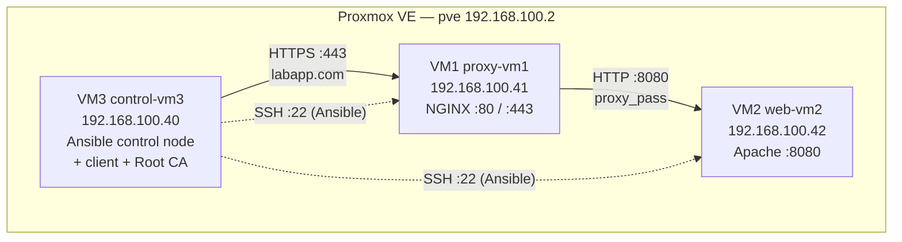
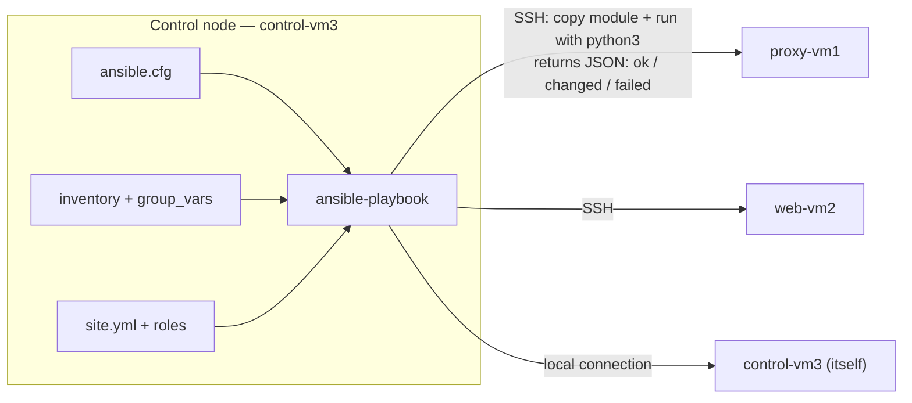
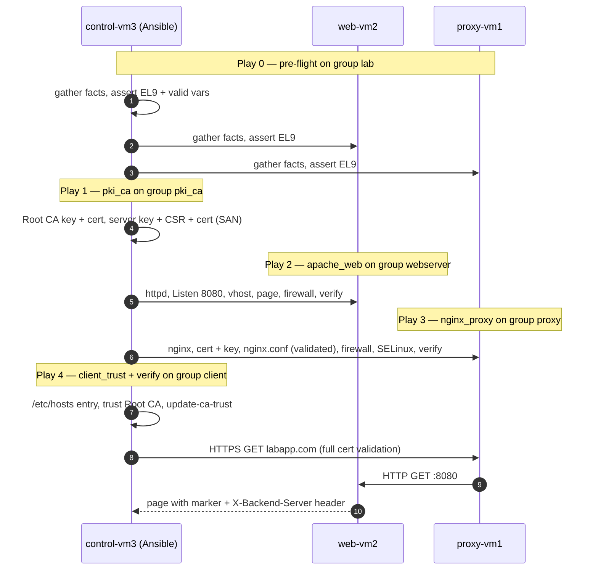

# OLIVERIO — Deployment Automation (Phase 3)

> [!abstract] Mission
> Rebuild the System Discovery platform with **one Ansible project** and **one master playbook** (`site.yml`). The playbook configures three prepared VMs as client, reverse proxy and web server. It also builds a small internal PKI, serves HTTPS on NGINX and makes the Root CA trusted on the client. Finally, it proves the whole path works, and a second run proves it changes nothing.

> [!success] Tested before it was written
> Every file in this note was deployed on the real lab VMs on 2026-09-24:
> - **Run 1** on clean VMs completed with `failed=0`.
> - **Run 2** reported `changed=0` on every host.
> - The drift, check-mode and validation demos in [[#8 · Milestone 6 — Repeatability Check]] were all run for real.
>
> Afterwards the VMs were rolled back to the Proxmox snapshot `phase3-clean`, so your own first run is a true first run.

> [!info] How to use this note
> - Work top to bottom. Every command block says **where** to run it (laptop, `pve`, `control-vm3`, …).
> - Copy the file contents exactly. The comments inside the code are the line-by-line explanation.
> - `> [!question]-` blocks are folded "defend it" answers for the trainer Q&A. Click them to open.

---

## Contents

1. [[#0 · Environment at a Glance]]
2. [[#1 · Flight School — Ansible Concepts]]
3. [[#2 · Automation Blueprint]]
4. [[#3 · Milestone 1 — Project Hangar]]
5. [[#4 · Milestone 2 — Web Server Role (Apache)]]
6. [[#5 · Milestone 4 — Trust (Internal PKI)]]
7. [[#6 · Milestone 3 — Proxy Gateway Role (NGINX + HTTPS)]]
8. [[#7 · Milestone 5 — Client Landing Zone]]
9. [[#8 · Milestone 6 — Repeatability Check]]
10. [[#9 · End-of-Week Demo — Automated Launch]]
11. [[#10 · Completion Review]]
12. [[#11 · Troubleshooting]]
13. [[#12 · References]]

---

## 0 · Environment at a Glance

### 0.1 Target architecture



### 0.2 Node identity matrix

| VMID | Hostname      | Lab IP (static)  | Job in the platform                              | Inventory groups           |
| ---- | ------------- | ---------------- | ------------------------------------------------ | -------------------------- |
| 104  | `proxy-vm1`   | `192.168.100.41` | NGINX reverse proxy, TLS termination             | `proxy`, `lab`             |
| 105  | `web-vm2`     | `192.168.100.42` | Apache backend serving the managed page          | `webserver`, `lab`         |
| 106  | `control-vm3` | `192.168.100.40` | Ansible control node, test client, lab Root CA   | `client`, `pki_ca`, `lab`  |

> [!note] Network layout, as installed
> Each VM's `ens18` carries **two** addresses:
> - a DHCP address in `192.168.107.0/24`, which holds the default route used for `dnf` and the internet;
> - the static lab address above, used for all platform traffic.
>
> OS: AlmaLinux 9.8 minimal, SELinux **enforcing**, firewalld **running**, all as it would be in production.

### 0.3 Proxmox state

| Item                        | State                                                                                  |
| --------------------------- | -------------------------------------------------------------------------------------- |
| Phase 2 VMs 100–103         | Stopped, disks kept (untouched fallback)                                               |
| Phase 2 full backups        | `/var/lib/vz/dump/vzdump-qemu-10{0..3}-*.vma.zst` on `pve`                              |
| Snapshot `freshInstall`     | 104/105/106 right after the OS install                                                 |
| Snapshot `phase3-clean`     | 104/105/106: OS + SSH keys + `ansible-core` on control-vm3, **nothing deployed yet** ← start here |

---

## 1 · Flight School — Ansible Concepts

### 1.1 What Ansible is, in one picture



- **Agentless.** Nothing is installed on the managed nodes. Ansible connects over **SSH**, copies a small Python program (the *module*), runs it with the node's `python3`, reads the JSON result, then deletes the program.
- **Push-based.** The control node decides when changes happen. Nodes never poll a server.
- **Declarative.** You describe the **desired state** ("`httpd` is installed, running and enabled"), not the keystrokes. The module compares the desired state with the actual state and only acts on the difference. That comparison is what makes re-runs safe.

### 1.2 The vocabulary, mapped to this project

| Term                    | What it is                                                                                          | Where it lives here                                        |
| ----------------------- | --------------------------------------------------------------------------------------------------- | ---------------------------------------------------------- |
| **Control node**        | Machine that runs `ansible-playbook`. Needs Python + ansible-core.                                   | `control-vm3`                                              |
| **Managed node**        | Machine being configured. Needs SSH + Python only.                                                  | `proxy-vm1`, `web-vm2`, and `control-vm3` itself           |
| **Inventory**           | List of managed nodes, their addresses, and the **groups** they belong to.                          | `inventory/hosts.yml`                                      |
| **Facts**               | Data Ansible collects from each host at the start of a play (OS, IPs, CPU, …) → `ansible_facts`.  | Gathered in Play 0, used by `index.html.j2` and the asserts |
| **YAML**                | Indentation-based data format all Ansible files use. Spaces only, never tabs.                       | Everything except `ansible.cfg` (INI) and templates (Jinja2) |
| **Playbook**            | A YAML file containing one or more plays.                                                           | `site.yml` = the master playbook                           |
| **Play**                | Maps a **group of hosts** to the work to do on them.                                                | 5 plays in `site.yml`                                      |
| **Task**                | One call to one module with arguments.                                                              | `roles/*/tasks/main.yml`                                   |
| **Module**              | The unit of work (`dnf`, `template`, `service`, …). Written as FQCN: `collection.namespace.module`. | `ansible.builtin.*`, `ansible.posix.*`, `community.crypto.*` |
| **Variable**            | Named value substituted with `{{ name }}`. Defined once, used everywhere.                           | `group_vars/`, `host_vars/`, `roles/*/defaults/`           |
| **Template**            | Jinja2 file rendered with variables, then copied to the host.                                       | `roles/*/templates/*.j2`                                   |
| **Handler**             | Task that runs **only when notified** by a task that reported `changed`, once, at the end of the play. | `roles/*/handlers/main.yml`                              |
| **Role**                | A reusable folder bundling tasks, handlers, templates and defaults for one job.                     | `pki_ca`, `apache_web`, `nginx_proxy`, `client_trust`, `verify` |
| **Collection**          | Distribution package for modules/roles, installed with `ansible-galaxy`.                            | `ansible.posix`, `community.crypto`                         |
| **Master playbook**     | The single entry point that runs every play in order.                                               | `site.yml`                                                  |

### 1.3 What happens during `ansible-playbook site.yml`

1. **Load settings.** Ansible finds `./ansible.cfg` because you are in the project folder.
2. **Build the inventory.** It reads `inventory/hosts.yml`, then loads `group_vars/` and `host_vars/` for every host.
3. **Run each play in order.** For every play in `site.yml`:
   1. It **gathers facts** from the target hosts, if enabled.
   2. It runs **task 1 on all hosts in parallel** (up to `forks = 5`), then task 2 on all hosts, and so on.
   3. Each task returns **ok** (already correct), **changed** (Ansible fixed it), **failed** or **skipped**.
   4. A `changed` task with `notify:` queues a **handler**.
   5. Queued handlers run **once**, after the play's tasks finish, or earlier at a `meta: flush_handlers`.
   6. A host that fails is **removed** from the rest of the run. If *every* host of a play fails, the whole run stops.
4. **Print the `PLAY RECAP`.** It shows the per-host totals. `changed=0` on a re-run is the proof of idempotency.

### 1.4 Variables and precedence

The same variable can be defined in several places. The more specific one wins. Here is a simplified order, lowest to highest, of the levels this project uses. The [full list has 22 levels](https://docs.ansible.com/ansible/latest/playbook_guide/playbooks_variables.html#understanding-variable-precedence).

| Precedence  | Source                        | Our use                                                        |
| :---------: | ----------------------------- | -------------------------------------------------------------- |
| 1 (lowest)  | `roles/<role>/defaults/main.yml` | Safe fallbacks that make each role self-describing          |
| 2           | `group_vars/all.yml`          | **Common** values: FQDN, ports, PKI identity                   |
| 3           | `group_vars/<group>.yml`      | **Group** values: NGINX TLS paths, Apache paths, trust anchor path |
| 4           | inventory host vars + `host_vars/<host>.yml` | **Host-specific** values: `ansible_host`, page text for web-vm2 |
| 5           | Facts                         | `ansible_facts['distribution']` …                              |
| 6 (highest) | `-e` extra vars on the CLI    | One-off overrides (used in the validation demo in [[#8 · Milestone 6 — Repeatability Check]]) |

> [!tip] "Never type an IP twice"
> Only the inventory contains IP addresses. Everything else **derives** them:
> - `proxy_address: "{{ hostvars[groups['proxy'][0]]['ansible_host'] }}"` means "the address of the first host in the `proxy` group".
> - To move the proxy to a new IP, edit **one line** in `inventory/hosts.yml`. The NGINX upstream, the Apache firewall rule and the client `/etc/hosts` entry all follow on the next run.

### 1.5 Idempotency — the core idea

> [!important] Definition
> An operation is **idempotent** when running it once or a hundred times leaves the system in the same state. In Ansible terms, the **first run converges** the system (many `changed`), and **every later run reports `changed=0`** unless something drifted.

How each kind of task in this project achieves it:

| Task type                        | Why it is idempotent                                                                        |
| -------------------------------- | ------------------------------------------------------------------------------------------- |
| `dnf: state=present`             | Queries the RPM database; installs only if missing                                          |
| `template` / `copy`              | Compares the SHA-1 checksum of the rendered file with the one on disk; writes only on mismatch |
| `lineinfile`                     | Looks for a line matching `regexp`; replaces or adds only if it differs                    |
| `service: state=started`         | Asks systemd; starts only if stopped                                                        |
| `firewalld` / `seboolean`        | Reads the current rule/boolean; changes only if different                                   |
| `community.crypto.*`             | Parses the existing key/CSR/cert and regenerates only if its properties no longer match    |
| `command` / `shell`              | **Not** idempotent by nature → we mark read-only ones `changed_when: false`                 |
| Handlers                         | Only run when notified, so an unchanged config never restarts a service                     |

### 1.6 The safe-execution toolbox

| Tool                                   | What it does                                                                  | Used in                               |
| -------------------------------------- | ----------------------------------------------------------------------------- | ------------------------------------- |
| `ansible-playbook --syntax-check`      | Parses YAML and structure without connecting to hosts                         | Every milestone                       |
| `ansible-inventory --graph`            | Shows how hosts and groups resolved                                           | Milestone 1                           |
| `ansible lab -m ansible.builtin.ping`  | Proves SSH + Python work on every host (not ICMP ping)                        | Milestone 1                           |
| `--check`                              | Dry run: reports what *would* change, changes nothing                         | Milestone 6                           |
| `--diff`                               | Shows the before/after lines of changed files                                 | Milestone 6                           |
| `--tags` / `--limit`                   | Run only part of the playbook / only some hosts                               | Demo                                  |
| `assert` + `fail_msg`                  | Stops the run early with a human-readable reason                              | Play 0                                |
| `validate:`                            | Tests a candidate config file **before** it replaces the live one             | `httpd.conf`, `nginx.conf`            |
| Handlers + `flush_handlers`            | Reload only on change, and at a controlled moment                             | Apache, NGINX, CA trust               |
| `become`                               | Privilege escalation (`sudo`) for tasks that need root                        | `ansible.cfg`                         |
| `block` + `when: not ansible_check_mode` | Groups the read-only tests and skips them in `--check`                      | Every role                            |
| `no_log: true`                         | Hides secret values from the output                                           | Private key copy                      |

### 1.7 Why this beats doing it by hand

| Quality             | Manual (Phase 2)                                                                     | Ansible (Phase 3)                                                                                   |
| ------------------- | ------------------------------------------------------------------------------------ | --------------------------------------------------------------------------------------------------- |
| **Faster**          | Hours of SSH sessions, dozens of commands per VM                                     | One command; a clean deploy of all 3 VMs takes about a minute                                        |
| **Consistent**      | Each rebuild depends on memory and copy-paste; small typos differ between VMs        | The same files render the same result every time, on any number of hosts                            |
| **Maintainable**    | Changing the FQDN means editing nginx, the cert, `/etc/hosts`… on several machines   | Change `domain_name` in **one** file; every template, the cert SAN and `/etc/hosts` follow          |
| **Less error-prone**| A bad `nginx.conf` goes live and breaks the site; nobody notices drift               | `validate:` blocks bad configs; handlers reload only on change; `--check --diff` detects drift      |
| **Documented**      | Runbook and reality slowly diverge                                                   | The code *is* the runbook, and `verify` proves the result on every run                              |

---

## 2 · Automation Blueprint

### 2.1 Deployment flow of `site.yml`



### 2.2 Inventory groups

| Group       | Members                              | Why the group exists                                                    |
| ----------- | ------------------------------------ | ----------------------------------------------------------------------- |
| `proxy`     | proxy-vm1                            | Target of the `nginx_proxy` role; `group_vars/proxy.yml`                |
| `webserver` | web-vm2                              | Target of the `apache_web` role; `group_vars/webserver.yml`             |
| `client`    | control-vm3                          | Target of `client_trust` + `verify`; `group_vars/client.yml`            |
| `pki_ca`    | control-vm3                          | Where the CA lives. Move the CA = edit the inventory, not the code      |
| `lab`       | children: proxy, webserver, client   | "The whole platform", used by the pre-flight play                       |

### 2.3 What the project manages

| Host          | Packages                          | Files / templates                                                                                             | Services | Firewall / SELinux                                      | Certificates                          | Tests                                                     |
| ------------- | --------------------------------- | ------------------------------------------------------------------------------------------------------------- | -------- | ------------------------------------------------------- | ------------------------------------- | --------------------------------------------------------- |
| `control-vm3` | —                                 | `/etc/hosts` (one line), `/etc/pki/ca-trust/source/anchors/airnav-das-lab-root-ca.crt`                        | —        | —                                                       | Creates Root CA + server cert in `/root/lab-pki` | DNS, trust store, HTTP→HTTPS redirect, HTTPS with validation |
| `web-vm2`     | `httpd`                           | `httpd.conf` (`Listen` line), `conf.d/labapp.com.conf`, `/var/www/html/index.html`                             | `httpd`  | rich rule: 8080/tcp from proxy only                     | —                                     | local `GET :8080`                                         |
| `proxy-vm1`   | `nginx`, `python3-libsemanage`    | `/etc/nginx/nginx.conf`, `/etc/pki/nginx/labapp.com.crt`, `root-ca.crt`, `private/labapp.com.key`               | `nginx`  | ports 80, 443; boolean `httpd_can_network_relay`        | Receives cert + key + chain           | direct backend, HTTPS through NGINX                       |

### 2.4 Variable map

| Variable                 | Value                          | Defined in                   | Used by                                           |
| ------------------------ | ------------------------------ | ---------------------------- | ------------------------------------------------- |
| `domain_name`            | `labapp.com`                   | `group_vars/all.yml`         | cert CN/SAN, nginx `server_name`, vhost, `/etc/hosts`, tests |
| `proxy_http_port`        | `80`                           | `group_vars/all.yml`         | nginx redirect server, firewalld                  |
| `proxy_https_port`       | `443`                          | `group_vars/all.yml`         | nginx TLS server, firewalld, tests                |
| `backend_port`           | `8080`                         | `group_vars/all.yml`         | Apache `Listen` + vhost, nginx upstream, firewall rich rule |
| `proxy_address`          | derived → `192.168.100.41`     | `group_vars/all.yml`         | Apache firewall source, client `/etc/hosts`, tests |
| `backend_address`        | derived → `192.168.100.42`     | `group_vars/all.yml`         | nginx upstream, proxy test                        |
| `webpage_marker`         | `DEPLOYED-BY-ANSIBLE`          | `group_vars/all.yml`         | page template + every content test                |
| `pki_dir`                | `/root/lab-pki`                | `group_vars/all.yml`         | pki_ca, nginx_proxy, client_trust                 |
| `pki_org` … `pki_city`   | AirNav FCO Engineering …       | `group_vars/all.yml`         | CSR subjects                                      |
| `nginx_*_path`           | `/etc/pki/nginx/...`           | `group_vars/proxy.yml`       | nginx_proxy tasks + `nginx.conf.j2`               |
| `apache_document_root`   | `/var/www/html`                | `group_vars/webserver.yml`   | page task, vhost                                  |
| `client_trust_anchor`    | `/etc/pki/ca-trust/source/anchors/…` | `group_vars/client.yml` | client_trust                                      |
| `webpage_message`        | "Served by Apache on web-vm2 …"| `host_vars/web-vm2.yml`      | page template                                     |

### 2.5 Project structure

```text
/root/ansible-platform/
├── ansible.cfg                  # project settings (inventory path, roles/collections path, become)
├── README.md                    # how another engineer runs this
├── .gitignore                   # keeps downloaded collections out of git
├── site.yml                     # MASTER PLAYBOOK — the only thing you run
├── inventory/
│   └── hosts.yml                # hosts, IPs, groups
├── group_vars/
│   ├── all.yml                  # common values
│   ├── proxy.yml                # proxy-only values
│   ├── webserver.yml            # web-only values
│   └── client.yml               # client-only values
├── host_vars/
│   └── web-vm2.yml              # host-specific value
├── collections/
│   └── requirements.yml         # pinned external collections
└── roles/
    ├── pki_ca/        {defaults,tasks}                       # Milestone 4 (create)
    ├── apache_web/    {defaults,tasks,handlers,templates}    # Milestone 2
    ├── nginx_proxy/   {defaults,tasks,handlers,templates}    # Milestones 3 + 4 (deploy)
    ├── client_trust/  {defaults,tasks,handlers}              # Milestone 5
    └── verify/        {defaults,tasks}                       # Milestones 5 + 6 tests
```

### 2.6 Design decisions

| Decision                                                 | Why                                                                                                        | Rejected alternative                                     |
| -------------------------------------------------------- | ---------------------------------------------------------------------------------------------------------- | -------------------------------------------------------- |
| Control node = VM3 (also the client)                     | The spec allows it; it saves a VM, and the client tests run locally with `ansible_connection: local`       | Laptop as control node (not reproducible for others)     |
| Roles, one per job                                       | Each role is a reusable unit with its own defaults, handlers and templates                                 | One long playbook (hard to read, reuse, test)            |
| CA on the control node, in `/root/lab-pki` (0700)        | Keys never leave the automation host except the server key → proxy; kept **outside** the project so it can't be committed | CA inside the project folder                    |
| `community.crypto` modules instead of `openssl` commands | They are idempotent: they inspect the existing files. Raw `openssl` needs `creates:` hacks and can't detect wrong content | `command: openssl …`                         |
| Whole-file `nginx.conf` with `validate: nginx -t -c %s`  | A complete file can be tested **before** it replaces the live one, and a stray `conf.d/*.conf` can't change behaviour | Fragment in `conf.d/` (can't be validated standalone) |
| Apache: `validate` on `httpd.conf` + validate handler for the vhost | `httpd.conf` is a full file (pre-write validation). A vhost fragment can't be tested alone, so the handler runs `httpd -t` before reload | Restart without testing |
| Backend on `8080`, firewalled to the proxy IP only       | Makes the "backend port" a real variable. Apache is unreachable except through NGINX (true reverse-proxy isolation) | Port 80 open to everyone                       |
| SELinux kept enforcing; boolean `httpd_can_network_relay`| Narrowest permission that lets NGINX connect to HTTP ports                                                 | `setenforce 0` or the broader `httpd_can_network_connect` |
| Server cert valid 199 days                               | Mirrors the public CA/B Forum cap of 200 days (Ballot SC-081, from 15 Mar 2026)                            | 365 days / 10 years                                      |
| `X-Backend-Server` response header                       | One `curl -I` from the client proves the request passed NGINX (`Server: nginx`) **and** reached Apache on web-vm2 | Screenshot of two logs                        |
| Tests inside the playbook (`verify` role)                | Every run proves the platform works, not just that files were copied                                       | Manual curl after deploy                                 |

### 2.7 Build order vs milestone numbers

> [!warning] Why Milestone 4 is built before Milestone 3
> The NGINX HTTPS server block references the certificate files. `nginx -t` (our validation) fails if they don't exist yet. So the PKI role (**M4**) is written **before** the proxy role (**M3**). The proxy role then covers M3 and M4's deploy steps (4.3 and 4.4).

| Section in this note | Spec milestone | Role(s)                       |
| -------------------- | -------------- | ----------------------------- |
| §3                   | M1             | project skeleton, `site.yml`  |
| §4                   | M2             | `apache_web`                  |
| §5                   | M4 (create)    | `pki_ca`                      |
| §6                   | M3 + M4 (deploy/HTTPS) | `nginx_proxy`         |
| §7                   | M5             | `client_trust`, `verify`      |
| §8                   | M6             | whole project                 |

---

## 3 · Milestone 1 — Project Hangar

> [!abstract] Goal
> A clear, reusable project structure with an inventory, separated variables, one master playbook, a README, and proven connectivity.

### 3.0 Preconditions (already done on your VMs)

These were completed before this note, and the `phase3-clean` snapshot includes them. They are kept here so another engineer can reproduce the setup.

```bash
# === On EACH VM (console or SSH): static lab IP next to the DHCP address ===
nmcli con mod ens18 ipv4.method auto ipv4.addresses 192.168.100.41/24   # .40/.41/.42 per VM
nmcli con up ens18
hostnamectl set-hostname proxy-vm1                                       # control-vm3 / proxy-vm1 / web-vm2

# === On control-vm3: Ansible + SSH keys ===
dnf install -y epel-release
dnf install -y ansible-core                         # AlmaLinux AppStream → ansible-core 2.14
ssh-keygen -t ed25519 -C "ansible-control-vm3" -f ~/.ssh/id_ed25519 -N ""
ssh-copy-id -i ~/.ssh/id_ed25519.pub root@192.168.100.41   # accept the host key → stored in known_hosts
ssh-copy-id -i ~/.ssh/id_ed25519.pub root@192.168.100.42
```

Quick check before you start (**control-vm3**):

```bash
ansible --version | head -1          # expect: ansible [core 2.14.x]
ssh -o BatchMode=yes root@192.168.100.41 hostname   # expect: proxy-vm1   (no password prompt)
ssh -o BatchMode=yes root@192.168.100.42 hostname   # expect: web-vm2
```

### 3.1 Start from a fresh folder

Your early scaffold (`playbook.yml`, `pki_artifacts/`, empty role folders) is replaced by the structure below. Keep it for reference instead of deleting it:

```bash
# control-vm3
cd /root
mv ansible-platform ansible-platform.scaffold-old     # keep the first draft, out of the way
mkdir -p ansible-platform/{inventory,group_vars,host_vars,collections}
cd ansible-platform

# Role skeletons: each role only gets the folders it actually uses
mkdir -p roles/pki_ca/{defaults,tasks}
mkdir -p roles/apache_web/{defaults,tasks,handlers,templates}
mkdir -p roles/nginx_proxy/{defaults,tasks,handlers,templates}
mkdir -p roles/client_trust/{defaults,tasks,handlers}
mkdir -p roles/verify/{defaults,tasks}

# Placeholder task lists so site.yml runs before the roles are written.
# "[]" is an empty YAML list = "no tasks". Each milestone replaces one of these.
for r in pki_ca apache_web nginx_proxy client_trust verify; do
  printf -- '---\n[]\n' > roles/$r/tasks/main.yml
done
```

> [!note] What changed compared with your scaffold
>
> | File                    | Scaffold                             | Final                                                                                    | Why                                                                 |
> | ----------------------- | ------------------------------------ | ---------------------------------------------------------------------------------------- | ------------------------------------------------------------------- |
> | `ansible.cfg`           | `host_key_checking = False`          | `True`, plus `collections_path`, `callback_result_format`, `interpreter_python`           | Keys are already trusted, so keep MITM protection; project-local collections |
> | `inventory/hosts.yml`   | 3 groups + `lab`                     | adds `pki_ca` group; `ansible_user` dropped (set once in `ansible.cfg`)                  | CA location becomes an inventory decision                           |
> | `group_vars/all.yml`    | `backend_port: 80`                   | `8080`, derived `proxy_address`/`backend_address`, PKI paths, test marker                | Backend isolated; no repeated IPs                                   |
> | `group_vars/proxy.yml`  | `backend_server_ip: "192.168.100.42"`| removed → derived from inventory                                                         | The IP was typed twice                                              |
> | `playbook.yml`          | 4 plays of `ping`                    | `site.yml`: 5 plays calling roles                                                        | `site.yml` is the Ansible convention for the master playbook        |

### 3.2 `ansible.cfg`

```bash
vi /root/ansible-platform/ansible.cfg
```

```ini
# ansible.cfg — project-level settings.
# Ansible uses the FIRST config file it finds, in this order:
#   $ANSIBLE_CONFIG -> ./ansible.cfg -> ~/.ansible.cfg -> /etc/ansible/ansible.cfg
# Running every command from the project folder therefore makes behaviour reproducible.
# NOTE: keep comments on their own lines; '#' after a value becomes part of the value.

[defaults]
# Who we manage (the inventory file)
inventory = ./inventory/hosts.yml
# Where our roles and the pinned collections live (both inside the project)
roles_path = ./roles
collections_path = ./collections
# SSH login user on managed nodes
remote_user = root
# How many hosts are configured in parallel
forks = 5
# Host keys were accepted during ssh-copy-id, so keep MITM protection ON
host_key_checking = True
# No *.retry files after a failure
retry_files_enabled = False
# Use the platform python3 without printing the discovery warning
interpreter_python = auto_silent
# Human-readable task results (built into ansible-core >= 2.13, no extra collection)
callback_result_format = yaml

[privilege_escalation]
# Run tasks as root. A no-op while remote_user is root, but it keeps the
# project working unchanged if you later switch to a non-root automation user.
become = True
become_method = sudo
become_user = root
become_ask_pass = False
```

> [!warning] Two traps from the first attempt
> - `stdout_callback = yaml` fails on ansible-core 2.14: that callback lives in `community.general`, which isn't installed. `callback_result_format = yaml` is the built-in replacement (core ≥ 2.13).
> - INI inline comments: Ansible only strips inline comments that start with `;`. A line like `forks = 5  # parallel` makes the value `5  # parallel`. Always put comments on their own line.

### 3.3 Inventory — `inventory/hosts.yml`

```yaml
# inventory/hosts.yml — WHO Ansible manages and HOW it reaches them.
# Group names here MUST match the file names in group_vars/.
all:
  children:
    proxy:                          # VM1 — NGINX reverse proxy (client-facing)
      hosts:
        proxy-vm1:
          ansible_host: 192.168.100.41
    webserver:                      # VM2 — Apache backend (only the proxy talks to it)
      hosts:
        web-vm2:
          ansible_host: 192.168.100.42
    client:                         # VM3 — test client (also the control node)
      hosts:
        control-vm3:
          ansible_host: 127.0.0.1
          ansible_connection: local # run tasks directly, no SSH to itself
    pki_ca:                         # where the lab Root CA lives (the control node)
      hosts:
        control-vm3:
    lab:                            # parent group = the whole platform
      children:
        proxy:
        webserver:
        client:
```

> [!question]- Why is control-vm3 in two groups, and why `ansible_connection: local`?
> A host can belong to any number of groups. It gets the variables of **all** of them.
> - `client` means "run the client role and tests here".
> - `pki_ca` means "the CA lives here".
>
> They are separate *concepts* that happen to share a machine today. `ansible_connection: local` makes Ansible run the tasks directly, without SSH-ing into itself.

### 3.4 Variables — common, group and host values

`group_vars/all.yml`, the **common** values:

```yaml
# group_vars/all.yml — COMMON values shared by every host.
# Change a value here once and every template/task that uses it follows.

# --- Service identity ---------------------------------------------------------
domain_name: "labapp.com"            # FQDN users type; goes into the cert SAN, nginx server_name and /etc/hosts
proxy_http_port: 80                  # NGINX plain HTTP (redirects to HTTPS)
proxy_https_port: 443                # NGINX HTTPS (client-facing)
backend_port: 8080                   # Apache listen port (internal only)

# --- Addresses derived from the inventory (never typed twice) -----------------
proxy_address:   "{{ hostvars[groups['proxy'][0]]['ansible_host'] }}"
backend_address: "{{ hostvars[groups['webserver'][0]]['ansible_host'] }}"

# --- Page content + the string our tests look for -----------------------------
webpage_title: "AirNav DAS - System Discovery Platform"
webpage_marker: "DEPLOYED-BY-ANSIBLE"   # verify tasks fail if this is missing from the response

# --- Internal PKI (lives on the control node, group pki_ca) -------------------
pki_dir: "/root/lab-pki"             # CA working directory; OUTSIDE the project so keys never land in git
pki_org: "AirNav FCO Engineering"
pki_ou: "DAS Lab"
pki_country: "PH"
pki_state: "Western Visayas (Region VI)"
pki_city: "Iloilo"
root_ca_common_name: "AirNav DAS Lab Root CA"
root_ca_valid_days: 3650             # 10 years: long-lived trust anchor
server_cert_valid_days: 199          # under the CA/B Forum 200-day cap in force since 15 Mar 2026

# File names produced by the pki_ca role and consumed by nginx_proxy / client_trust
root_ca_cert_file: "{{ pki_dir }}/root-ca.crt"
server_cert_file:  "{{ pki_dir }}/{{ domain_name }}.crt"
server_key_file:   "{{ pki_dir }}/{{ domain_name }}.key"
```

`group_vars/proxy.yml`, `group_vars/webserver.yml` and `group_vars/client.yml`, the **group** values:

```yaml
# group_vars/proxy.yml — values only the [proxy] group needs.
nginx_tls_dir: "/etc/pki/nginx"                          # where NGINX reads its cert/key
nginx_cert_path:  "{{ nginx_tls_dir }}/{{ domain_name }}.crt"
nginx_key_path:   "{{ nginx_tls_dir }}/private/{{ domain_name }}.key"
nginx_chain_path: "{{ nginx_tls_dir }}/root-ca.crt"      # the chain up to (and incl.) our root
nginx_ssl_protocols: "TLSv1.2 TLSv1.3"
```

```yaml
# group_vars/webserver.yml — values only the [webserver] group needs.
apache_document_root: "/var/www/html"
apache_vhost_file: "/etc/httpd/conf.d/{{ domain_name }}.conf"
```

```yaml
# group_vars/client.yml — values only the [client] group needs.
client_trust_anchor: "/etc/pki/ca-trust/source/anchors/airnav-das-lab-root-ca.crt"
```

`host_vars/web-vm2.yml`, a **host-specific** value:

```yaml
# host_vars/web-vm2.yml — values for THIS host only (highest precedence of the
# inventory-file variables). A second web server would get its own file.
webpage_message: "Served by Apache on web-vm2 through the NGINX reverse proxy."
```

> [!question]- Where does Ansible find `group_vars/` if the inventory is in `inventory/`?
> It loads `group_vars/` and `host_vars/` from **two** places: next to the inventory file and next to the playbook. Ours sit next to `site.yml` (the project root), so both `ansible-playbook` and `ansible-inventory` pick them up.

> [!tip] About `labapp.com`
> `labapp.com` is a **real, registered public domain** (that is why the browser landed on GoDaddy in Phase 2). It works here because `/etc/hosts` is consulted before DNS. The best-practice name for private use is under **`.internal`**, the TLD ICANN reserved for private use in 2024 (e.g. `labapp.internal`). Because the FQDN is one variable, switching is a one-line change in `group_vars/all.yml`. On the next run you get a new cert SAN, nginx `server_name`, vhost and `/etc/hosts` entry.

### 3.5 Collections — `collections/requirements.yml`

`firewalld`, `seboolean` and the crypto modules are **not** in ansible-core. They come from two collections, pinned to versions that support ansible-core 2.14:

```yaml
# collections/requirements.yml — external modules this project needs, pinned to
# versions that support ansible-core 2.14 (the AlmaLinux 9 package).
# Install with:  ansible-galaxy collection install -r collections/requirements.yml
collections:
  - name: ansible.posix          # firewalld, seboolean
    version: ">=1.5.4,<1.6.0"
  - name: community.crypto       # openssl_privatekey, openssl_csr, x509_certificate
    version: ">=2.15.0,<3.0.0"
```

```bash
# control-vm3, inside /root/ansible-platform
ansible-galaxy collection install -r collections/requirements.yml
# → installs into ./collections/ansible_collections/ (because of collections_path in ansible.cfg)
ansible-galaxy collection list | grep -E 'posix|crypto'
# expect: ansible.posix 1.5.4   community.crypto 2.26.x
```

> [!warning] Why the pin `<1.6.0` for ansible.posix
> `ansible.posix` 1.6.x prints `Collection ansible.posix does not support Ansible version 2.14.18`. Its metadata requires a newer core. 1.5.4 declares `requires_ansible: '>=2.9'` and has everything we use.

### 3.6 The master playbook — `site.yml`

```yaml
# site.yml — THE master playbook. One command deploys and verifies the platform:
#   ansible-playbook site.yml
# Useful variations:
#   ansible-playbook site.yml --check --diff    # dry run: show drift, change nothing
#   ansible-playbook site.yml --tags verify     # run only the read-only tests
#   ansible-playbook site.yml --tags nginx      # converge only the proxy role
# Plays run top to bottom; each play targets an inventory group and applies roles.
---
- name: "Play 0 | Pre-flight checks on every lab host"
  hosts: lab
  gather_facts: true
  tasks:
    - name: Refuse to run on an unsupported OS
      ansible.builtin.assert:
        that:
          - ansible_facts['os_family'] == 'RedHat'
          - ansible_facts['distribution_major_version'] == '9'
        fail_msg: "{{ inventory_hostname }} runs {{ ansible_facts['distribution'] }} {{ ansible_facts['distribution_version'] }}; this project targets EL9."
        success_msg: "{{ inventory_hostname }}: {{ ansible_facts['distribution'] }} {{ ansible_facts['distribution_version'] }} OK"

    - name: Refuse to run with missing or malformed key variables
      ansible.builtin.assert:
        that:
          - domain_name is match('^[a-z0-9.-]+$')
          - backend_port | int > 0
          - proxy_https_port | int > 0
        fail_msg: "Check group_vars/all.yml: domain_name/ports are missing or invalid."
        quiet: true
      run_once: true

- name: "Play 1 | Internal PKI on the control node"
  hosts: pki_ca
  gather_facts: false
  roles:
    - { role: pki_ca, tags: [pki] }

- name: "Play 2 | Apache backend"
  hosts: webserver
  gather_facts: false          # facts already gathered in Play 0 (cached for the run)
  roles:
    - { role: apache_web, tags: [apache] }

- name: "Play 3 | NGINX reverse proxy with HTTPS"
  hosts: proxy
  gather_facts: false
  roles:
    - { role: nginx_proxy, tags: [nginx] }

- name: "Play 4 | Client name resolution, trust and end-to-end verification"
  hosts: client
  gather_facts: false
  roles:
    - { role: client_trust, tags: [client] }
    - { role: verify, tags: [verify] }
```

> [!question]- Why `gather_facts: false` in Plays 1–4?
> Facts for every `lab` host were collected once in Play 0. They stay in memory for the whole run, so gathering again in each play would just add SSH round-trips. The Apache page template still uses `ansible_facts['distribution']` from Play 0.

> [!question]- What do the `tags` on roles give me?
> They let you select parts of the run: `--tags nginx` converges only the proxy role, and `--tags verify` runs only the read-only tests. The tests are tagged `verify` **inside** every role too, so `--tags verify` runs the backend, proxy and end-to-end checks without changing anything.

### 3.7 `README.md` and `.gitignore`

````markdown
# ansible-platform — AirNav DAS Phase 3

One Ansible project that deploys and verifies a 3-VM HTTPS platform:

```
control-vm3 (client + control node) --HTTPS 443--> proxy-vm1 (NGINX) --HTTP 8080--> web-vm2 (Apache)
Internal PKI on control-vm3: Root CA --signs--> server cert for labapp.com (SAN) --> NGINX
```

| Host        | IP             | Group(s)         | Role(s) applied            |
|-------------|----------------|------------------|----------------------------|
| proxy-vm1   | 192.168.100.41 | proxy, lab       | nginx_proxy                |
| web-vm2     | 192.168.100.42 | webserver, lab   | apache_web                 |
| control-vm3 | 192.168.100.40 | client, pki_ca, lab | pki_ca, client_trust, verify |

## Requirements (control node)
- AlmaLinux 9, `ansible-core` 2.14 (`dnf install ansible-core`)
- Root SSH key access to proxy-vm1 and web-vm2 (`ssh-copy-id`)
- Collections: `ansible-galaxy collection install -r collections/requirements.yml`

## Run
```bash
cd /root/ansible-platform
ansible-inventory --graph                  # inventory sanity
ansible lab -m ansible.builtin.ping        # connectivity
ansible-playbook site.yml --syntax-check   # YAML / structure
ansible-playbook site.yml                  # deploy + verify (first run: many "changed")
ansible-playbook site.yml                  # second run: changed=0 everywhere
ansible-playbook site.yml --check --diff   # drift report, changes nothing
ansible-playbook site.yml --tags verify    # tests only
```

## Where to change things
| Change                         | File                         |
|--------------------------------|------------------------------|
| Host IPs / group membership    | `inventory/hosts.yml`        |
| FQDN, ports, PKI identity      | `group_vars/all.yml`         |
| NGINX TLS paths / protocols    | `group_vars/proxy.yml`       |
| Apache paths                   | `group_vars/webserver.yml`   |
| Trust-anchor path on client    | `group_vars/client.yml`      |
| Page text for one host         | `host_vars/web-vm2.yml`      |

## Outputs
- CA material: `/root/lab-pki/` on control-vm3 (mode 0700, keys 0600) — back it up, never commit it.
- NGINX TLS: `/etc/pki/nginx/` on proxy-vm1 (key in `private/`, 0600).
- Client trust: `/etc/pki/ca-trust/source/anchors/airnav-das-lab-root-ca.crt` + `update-ca-trust`.
- Client name resolution: `192.168.100.41 labapp.com` in control-vm3 `/etc/hosts`.
````

```text
collections/ansible_collections/
*.retry
```

### 3.8 Validate the hangar

```bash
# control-vm3, inside /root/ansible-platform
ansible-inventory --graph                 # groups resolved as designed?
ansible-inventory --host proxy-vm1        # merged variables for one host (derived IPs rendered at runtime)
ansible lab -m ansible.builtin.ping -o    # SSH + python on all 3 → "pong"
ansible-playbook site.yml --syntax-check  # expect: "playbook: site.yml"
ansible-playbook site.yml                 # Play 0 runs; roles are still empty placeholders
```

Expected `--graph`:

```text
@all:
  |--@ungrouped:
  |--@proxy:
  |  |--proxy-vm1
  |--@webserver:
  |  |--web-vm2
  |--@client:
  |  |--control-vm3
  |--@pki_ca:
  |  |--control-vm3
  |--@lab:
  |  |--@proxy:
  |  |  |--proxy-vm1
  |  |--@webserver:
  |  |  |--web-vm2
  |  |--@client:
  |  |  |--control-vm3
```

- [ ] Project folder with inventory, master playbook, variables, roles and README
- [ ] `--graph` output and `ping` = `pong` on 3 hosts saved as evidence

---

## 4 · Milestone 2 — Web Server Role (Apache)

> [!abstract] Goal
> Install Apache on web-vm2, serve a managed page on the backend port, open the firewall for the proxy only, keep SELinux enforcing, and verify locally.

> [!info] Concepts in this role
> - **`Listen`** tells Apache which TCP port to bind. The stock `httpd.conf` says `Listen 80`, and we replace that one line.
> - **VirtualHost** ties a port and `ServerName` to a `DocumentRoot`.
> - **SELinux:** port 8080 is labelled `http_cache_port_t`, which `httpd` is allowed to bind by default, so no port relabelling is needed. We checked this on the VM in enforcing mode.
> - **firewalld rich rule:** "accept TCP 8080 **only** from `192.168.100.41`". Everyone else is rejected, so the backend is reachable only through the proxy.
> - **Handlers with `listen:`:** both Apache handlers answer the same notification, `Reload Apache`. Handlers run in the order they are **written**, so `httpd -t` always runs before the reload. If validation fails, the reload never happens and the running Apache keeps its last good config.

`roles/apache_web/defaults/main.yml`:

```yaml
# roles/apache_web/defaults/main.yml — safe fallbacks (overridden by group_vars/host_vars).
apache_package: httpd
apache_service: httpd
webpage_message: "Served by Apache."
```

`roles/apache_web/tasks/main.yml`:

```yaml
# roles/apache_web/tasks/main.yml — Milestone 2: backend Apache web server.

- name: Install Apache
  ansible.builtin.dnf:
    name: "{{ apache_package }}"
    state: present

- name: Set the Apache listen port (validated before it is written)
  ansible.builtin.lineinfile:
    path: /etc/httpd/conf/httpd.conf
    regexp: '^Listen\s'                        # replace the existing Listen line...
    line: "Listen {{ backend_port }}"          # ...with the port from group_vars
    validate: httpd -t -f %s                   # %s = candidate file; bad syntax is never written
  notify: Reload Apache

- name: Deploy the backend virtual host
  ansible.builtin.template:
    src: vhost.conf.j2
    dest: "{{ apache_vhost_file }}"
    owner: root
    group: root
    mode: "0644"
  notify: Reload Apache                         # handler validates with 'httpd -t' first

- name: Deploy the managed webpage
  ansible.builtin.template:
    src: index.html.j2
    dest: "{{ apache_document_root }}/index.html"
    owner: root
    group: root
    mode: "0644"
    # static file: Apache serves the new copy immediately, no reload needed

- name: Allow the backend port ONLY from the reverse proxy
  ansible.posix.firewalld:
    rich_rule: >-
      rule family="ipv4" source address="{{ proxy_address }}/32"
      port port="{{ backend_port }}" protocol="tcp" accept
    permanent: true                             # survives reboot
    immediate: true                             # applied now, no firewall reload
    state: enabled

- name: Ensure Apache is enabled at boot and running
  ansible.builtin.service:
    name: "{{ apache_service }}"
    state: started
    enabled: true

- name: Apply pending Apache reloads before testing
  ansible.builtin.meta: flush_handlers

# ---------------- Verification (read-only) ----------------
- name: Backend verification
  when: not ansible_check_mode   # tests read LIVE state; skip them in --check
  tags: [verify]                 # run alone with: ansible-playbook site.yml --tags verify
  block:
    - name: Verify the page locally on the web server
      ansible.builtin.uri:
        url: "http://127.0.0.1:{{ backend_port }}/"
        return_content: true
      register: apache_local
      failed_when: webpage_marker not in apache_local.content

    - name: Show backend verification result
      ansible.builtin.debug:
        msg: "Apache on {{ inventory_hostname }}:{{ backend_port }} -> HTTP {{ apache_local.status }}, marker found"
```

`roles/apache_web/handlers/main.yml`:

```yaml
# roles/apache_web/handlers/main.yml — run ONCE at the end of the play, and only
# if a task reported "changed" and notified them. Handlers run in the order they
# are written here, so validation always runs before the reload.

- name: Validate Apache configuration
  ansible.builtin.command: httpd -t
  changed_when: false
  listen: Reload Apache                  # both handlers answer the same notification

- name: Reload Apache service
  ansible.builtin.service:
    name: "{{ apache_service }}"
    state: reloaded                      # graceful: in-flight requests are not dropped
  listen: Reload Apache
```

`roles/apache_web/templates/vhost.conf.j2`:

```apacheconf
# {{ ansible_managed }}
# Backend vhost for {{ domain_name }} — only NGINX ({{ proxy_address }}) reaches this port.

<VirtualHost *:{{ backend_port }}>
    ServerName {{ domain_name }}
    DocumentRoot {{ apache_document_root }}

    # Response header that proves which backend answered (visible to the client through NGINX)
    Header always set X-Backend-Server "{{ inventory_hostname }}"

    # %h = TCP peer (the proxy); X-Forwarded-For = the real client NGINX passed on
    LogFormat "%h xff=\"%{X-Forwarded-For}i\" proto=%{X-Forwarded-Proto}i \"%r\" %>s" proxied
    CustomLog logs/{{ domain_name }}_access.log proxied
    ErrorLog  logs/{{ domain_name }}_error.log
</VirtualHost>
```

`roles/apache_web/templates/index.html.j2`:

```html
<!-- {{ ansible_managed }} -->
<!DOCTYPE html>
<html lang="en">
<head>
  <meta charset="utf-8">
  <title>{{ webpage_title }}</title>
</head>
<body>
  <h1>{{ webpage_title }}</h1>
  <p>{{ webpage_message }}</p>
  <ul>
    <li>FQDN: {{ domain_name }}</li>
    <li>Backend: {{ inventory_hostname }} ({{ ansible_host }}) port {{ backend_port }}</li>
    <li>OS: {{ ansible_facts['distribution'] }} {{ ansible_facts['distribution_version'] }}</li>
  </ul>
  <p>{{ webpage_marker }}</p>
</body>
</html>
```

> [!danger] The idempotency trap we avoided
> An earlier draft printed `{{ ansible_date_time.iso8601 }}` on the page. The time differs on every run, so the rendered file differs, so the `template` task reports **changed forever**, and a second run can never be `changed=0`. Only put values in templates that describe the **desired state**, never the moment of the run.

Run and verify:

```bash
# control-vm3
ansible-playbook site.yml --syntax-check
ansible-playbook site.yml
# expect in the output: "Apache on web-vm2:8080 -> HTTP 200, marker found"

# Evidence on the web server itself
ssh root@192.168.100.42 'ss -tlnp | grep 8080; firewall-cmd --list-rich-rules; curl -s http://127.0.0.1:8080/ | grep -E "h1|DEPLOYED"'

# Evidence that ONLY the proxy may connect (run from control-vm3, which is not the proxy):
curl -m 3 http://192.168.100.42:8080/ || echo "blocked by firewalld — as designed"
```

- [ ] Automated Apache deployment
- [ ] Managed page (`index.html.j2`) and config template (`vhost.conf.j2`)
- [ ] Local backend verification result

---

## 5 · Milestone 4 — Trust (Internal PKI)

> [!abstract] Goal
> Create a Root CA and use it to sign a server certificate whose **SAN** contains the FQDN, all automated and idempotent, on the control node.

> [!info] Concepts in this role
> - **Chain of trust:** `Root CA (self-signed, trusted by the client)` → signs → `labapp.com certificate (presented by NGINX)`. A client trusts the server cert because it can verify the root's signature on it.
> - **Why the SAN matters:** browsers and TLS libraries match the hostname against the **Subject Alternative Name** only (RFC 9525, which replaced RFC 6125). The CN is informational. A cert without a matching SAN fails even if the CN is right.
> - **CA extensions (RFC 5280):** `basicConstraints CA:TRUE, pathlen:0` means "is a CA, may sign only end-entity certs". `keyUsage keyCertSign, cRLSign` means it may only sign.
> - **Leaf extensions:** `CA:FALSE`, `digitalSignature + keyEncipherment`, `extendedKeyUsage serverAuth`. The cert can be used only by a TLS server.
> - **Key sizes:** RSA 4096 for the long-lived root, RSA 2048 for the short-lived leaf. These match the NIST SP 800-57 guidance used in Phase 2.
> - **Validity:** the root lasts 10 years. The leaf lasts 199 days, under the CA/B Forum public limit of **200 days** that took effect on **15 March 2026** (Ballot SC-081). A private CA isn't bound by it, but copying public practice is good discipline.
> - **Idempotency:** `openssl_privatekey`, `openssl_csr` and `x509_certificate` read the existing file and regenerate **only** if it no longer matches the parameters. Run 2 therefore keeps the same keys and certs instead of rotating them on every run.

`roles/pki_ca/defaults/main.yml`:

```yaml
# roles/pki_ca/defaults/main.yml — lowest-precedence defaults for this role.
# group_vars/all.yml overrides these; they only exist so the role is self-describing.
root_ca_key_size: 4096        # long-lived trust anchor -> stronger key
server_key_size: 2048         # leaf cert, rotated often
```

`roles/pki_ca/tasks/main.yml`:

```yaml
# roles/pki_ca/tasks/main.yml — build a 2-level lab PKI on the control node:
#   Root CA (self-signed)  --signs-->  server certificate for {{ domain_name }}
# Every module below is idempotent: it inspects the existing file and only
# (re)writes it when it is missing or no longer matches the requested state.

- name: Create the CA working directory (root-only)
  ansible.builtin.file:
    path: "{{ pki_dir }}"
    state: directory
    owner: root
    group: root
    mode: "0700"

# ---------------- Root CA ----------------
- name: Generate the Root CA private key
  community.crypto.openssl_privatekey:
    path: "{{ pki_dir }}/root-ca.key"
    type: RSA
    size: "{{ root_ca_key_size }}"
    mode: "0600"

- name: Create the Root CA signing request (CA extensions)
  community.crypto.openssl_csr:
    path: "{{ pki_dir }}/root-ca.csr"
    privatekey_path: "{{ pki_dir }}/root-ca.key"
    common_name: "{{ root_ca_common_name }}"
    organization_name: "{{ pki_org }}"
    organizational_unit_name: "{{ pki_ou }}"
    country_name: "{{ pki_country }}"
    state_or_province_name: "{{ pki_state }}"
    locality_name: "{{ pki_city }}"
    basic_constraints: ["CA:TRUE", "pathlen:0"]   # may sign leaf certs only, no sub-CAs
    basic_constraints_critical: true
    key_usage: [keyCertSign, cRLSign]             # a CA signs certs/CRLs, nothing else
    key_usage_critical: true
    create_subject_key_identifier: true

- name: Self-sign the Root CA certificate
  community.crypto.x509_certificate:
    path: "{{ root_ca_cert_file }}"
    csr_path: "{{ pki_dir }}/root-ca.csr"
    privatekey_path: "{{ pki_dir }}/root-ca.key"
    provider: selfsigned
    selfsigned_not_after: "+{{ root_ca_valid_days }}d"
    mode: "0644"

# ---------------- Server (leaf) certificate ----------------
- name: Generate the server private key for {{ domain_name }}
  community.crypto.openssl_privatekey:
    path: "{{ server_key_file }}"
    type: RSA
    size: "{{ server_key_size }}"
    mode: "0600"

- name: Create the server CSR with the FQDN in the Subject Alternative Name
  community.crypto.openssl_csr:
    path: "{{ pki_dir }}/{{ domain_name }}.csr"
    privatekey_path: "{{ server_key_file }}"
    common_name: "{{ domain_name }}"               # informational only; clients match the SAN
    organization_name: "{{ pki_org }}"
    organizational_unit_name: "{{ pki_ou }}"
    country_name: "{{ pki_country }}"
    state_or_province_name: "{{ pki_state }}"
    locality_name: "{{ pki_city }}"
    subject_alt_name: ["DNS:{{ domain_name }}"]    # RFC 6125 / RFC 9525: the name clients verify
    basic_constraints: ["CA:FALSE"]
    basic_constraints_critical: true
    key_usage: [digitalSignature, keyEncipherment]
    key_usage_critical: true
    extended_key_usage: [serverAuth]               # usable for TLS servers only

- name: Sign the server certificate with the Root CA
  community.crypto.x509_certificate:
    path: "{{ server_cert_file }}"
    csr_path: "{{ pki_dir }}/{{ domain_name }}.csr"
    provider: ownca
    ownca_path: "{{ root_ca_cert_file }}"
    ownca_privatekey_path: "{{ pki_dir }}/root-ca.key"
    ownca_not_after: "+{{ server_cert_valid_days }}d"
    mode: "0644"

# ---------------- Evidence (read-only) ----------------
- name: Certificate evidence
  when: not ansible_check_mode   # tests read LIVE state; skip them in --check
  tags: [verify]                 # run alone with: ansible-playbook site.yml --tags verify
  block:
    - name: Verify the server certificate chains to the Root CA
      ansible.builtin.command: openssl verify -CAfile {{ root_ca_cert_file }} {{ server_cert_file }}
      register: pki_chain_check
      changed_when: false                              # read-only check -> never "changed"

    - name: Read the issued certificate
      community.crypto.x509_certificate_info:
        path: "{{ server_cert_file }}"
      register: pki_server_cert

    - name: Show certificate evidence
      ansible.builtin.debug:
        msg:
          - "chain  : {{ pki_chain_check.stdout }}"
          - "subject: {{ pki_server_cert.subject }}"
          - "issuer : {{ pki_server_cert.issuer.commonName }}"
          - "SAN    : {{ pki_server_cert.subject_alt_name }}"
          - "expires: {{ pki_server_cert.not_after }}"
```

> [!question]- Why a file-based `openssl_csr` and not `openssl_csr_pipe`?
> `openssl_csr_pipe` returns a CSR in memory. Without extra plumbing it builds a **new** one each run, and that makes the certificate task report `changed` every time. `openssl_csr` writes the CSR to disk and compares it with the requested subject and extensions, so it stays `ok` until something really changes.

Run and verify:

```bash
# control-vm3
ansible-playbook site.yml
# expect: "chain  : /root/lab-pki/labapp.com.crt: OK" and "SAN    : ['DNS:labapp.com']"

# Manual inspection = evidence for the trainer
cd /root/lab-pki && ls -l
stat -c '%a %n' /root/lab-pki /root/lab-pki/*.key          # expect 700 dir, 600 keys
openssl x509 -in root-ca.crt -noout -subject -ext basicConstraints,keyUsage
openssl x509 -in labapp.com.crt -noout -subject -issuer -dates \
  -ext subjectAltName,basicConstraints,keyUsage,extendedKeyUsage
openssl verify -CAfile root-ca.crt labapp.com.crt              # expect: labapp.com.crt: OK
```

Output from the test run:

```text
subject=C=PH, ST=Western Visayas (Region VI), L=Iloilo, O=AirNav FCO Engineering, OU=DAS Lab, CN=labapp.com
issuer=C=PH, ST=Western Visayas (Region VI), L=Iloilo, O=AirNav FCO Engineering, OU=DAS Lab, CN=AirNav DAS Lab Root CA
X509v3 Subject Alternative Name:
    DNS:labapp.com
X509v3 Key Usage: critical
    Digital Signature, Key Encipherment
X509v3 Extended Key Usage:
    TLS Web Server Authentication
X509v3 Basic Constraints: critical
    CA:FALSE
--- root ---
X509v3 Key Usage: critical
    Certificate Sign, CRL Sign
X509v3 Basic Constraints: critical
    CA:TRUE, pathlen:0
```

- [ ] Automated Root CA and server-certificate creation
- [ ] Certificate inspection and chain-verification evidence

---

## 6 · Milestone 3 — Proxy Gateway Role (NGINX + HTTPS)

> [!abstract] Goal
> Install NGINX on proxy-vm1 and deploy the certificate, key and chain. Then serve HTTPS for the FQDN, redirect HTTP to HTTPS, forward requests to Apache, validate before every reload, and verify the proxy → backend path.

> [!info] Concepts in this role
> - **Reverse proxy:** the client only ever talks to NGINX. NGINX opens its own connection to Apache (`upstream apache_backend`) and relays the answer back.
> - **TLS termination:** HTTPS ends at NGINX (client ↔ NGINX is encrypted), and NGINX ↔ Apache is plain HTTP on the private lab network. This is common practice: certificates live in one place and the backend stays simple.
> - **Forwarding headers:** without them Apache would only see the proxy's IP.
>   - `X-Forwarded-For` / `X-Real-IP` carry the real client address.
>   - `X-Forwarded-Proto` says the original request was `https`.
>   - `Host` keeps the name the client asked for.
> - **HTTP → HTTPS:** the port-80 server answers `301 Moved Permanently` to `https://…`, so nothing is ever served in clear text.
> - **Ciphers:** not hard-coded. On AlmaLinux, NGINX follows the **system-wide crypto policy**, so one OS policy governs every TLS service. We only pin the protocol floor, `TLSv1.2 TLSv1.3`.
> - **`validate: nginx -t -c %s`:** Ansible renders the template to a temporary file and runs `nginx -t -c /tmp/…`. It installs the file **only if the test passes**. Because we manage the **whole** `nginx.conf`, that temporary file is a complete, testable config.
> - **SELinux:** by default, processes labelled `httpd_t` (NGINX runs as `httpd_t`) may not open outbound connections. The boolean `httpd_can_network_relay` allows connections to HTTP ports only. `httpd_can_network_connect` would allow **any** port, which is broader than needed.
> - **Private key handling:** stored in `/etc/pki/nginx/private/` (dir `0700`, file `0600`, owner root) with `no_log: true`. The NGINX master process reads it as root before dropping privileges to the `nginx` user.

`roles/nginx_proxy/defaults/main.yml`:

```yaml
# roles/nginx_proxy/defaults/main.yml
nginx_package: nginx
nginx_service: nginx
```

`roles/nginx_proxy/tasks/main.yml`:

```yaml
# roles/nginx_proxy/tasks/main.yml — Milestones 3 + 4: NGINX reverse proxy with HTTPS.

- name: Install NGINX and the SELinux Python bindings used by seboolean
  ansible.builtin.dnf:
    name:
      - "{{ nginx_package }}"
      - python3-libsemanage          # required by ansible.posix.seboolean on the managed host
    state: present

# ---------------- TLS material (Milestone 4) ----------------
- name: Create the TLS directories
  ansible.builtin.file:
    path: "{{ item.path }}"
    state: directory
    owner: root
    group: root
    mode: "{{ item.mode }}"
  loop:
    - { path: "{{ nginx_tls_dir }}", mode: "0755" }
    - { path: "{{ nginx_tls_dir }}/private", mode: "0700" }   # key dir: root only

- name: Deploy the server certificate and the CA chain
  ansible.builtin.copy:
    src: "{{ item.src }}"            # 'src' is read on the CONTROL node (where the CA lives)
    dest: "{{ item.dest }}"
    owner: root
    group: root
    mode: "0644"                     # certificates are public
  loop:
    - { src: "{{ server_cert_file }}", dest: "{{ nginx_cert_path }}" }
    - { src: "{{ root_ca_cert_file }}", dest: "{{ nginx_chain_path }}" }
  notify: Reload NGINX

- name: Deploy the server private key
  ansible.builtin.copy:
    src: "{{ server_key_file }}"
    dest: "{{ nginx_key_path }}"
    owner: root
    group: root
    mode: "0600"                     # read by the NGINX master process (root) only
  no_log: true                       # never print key material in the output
  notify: Reload NGINX

# ---------------- Reverse proxy config (Milestone 3) ----------------
- name: Deploy nginx.conf (validated with nginx -t before it replaces the live file)
  ansible.builtin.template:
    src: nginx.conf.j2
    dest: /etc/nginx/nginx.conf
    owner: root
    group: root
    mode: "0644"
    validate: nginx -t -c %s         # candidate file is tested; a broken config is never installed
  notify: Reload NGINX

- name: Open HTTP and HTTPS in firewalld
  ansible.posix.firewalld:
    port: "{{ item }}/tcp"
    permanent: true
    immediate: true
    state: enabled
  loop:
    - "{{ proxy_http_port }}"
    - "{{ proxy_https_port }}"

- name: Allow NGINX to open connections to the backend (SELinux)
  ansible.posix.seboolean:
    name: httpd_can_network_relay    # narrowest boolean that permits proxying to HTTP ports
    state: true
    persistent: true                 # survives reboot (writes the policy store)

- name: Ensure NGINX is enabled at boot and running
  ansible.builtin.service:
    name: "{{ nginx_service }}"
    state: started
    enabled: true

- name: Apply pending NGINX reloads before testing
  ansible.builtin.meta: flush_handlers

# ---------------- Proxy-path verification (read-only) ----------------
- name: Proxy-path verification
  when: not ansible_check_mode   # tests read LIVE state; skip them in --check
  tags: [verify]                 # run alone with: ansible-playbook site.yml --tags verify
  block:
    - name: Proxy -> backend reachability (firewall rule allows this host)
      ansible.builtin.uri:
        url: "http://{{ backend_address }}:{{ backend_port }}/"
        return_content: true
      register: proxy_to_backend
      failed_when: webpage_marker not in proxy_to_backend.content

    - name: Full path through NGINX on this host (HTTPS -> Apache)
      ansible.builtin.uri:
        url: "https://127.0.0.1:{{ proxy_https_port }}/"
        headers:
          Host: "{{ domain_name }}"      # select our server block
        validate_certs: false            # cert trust is proven from the client in Milestone 5
        return_content: true
      register: through_nginx
      failed_when: >-
        webpage_marker not in through_nginx.content or
        through_nginx.x_backend_server | default('') != groups['webserver'][0]

    - name: Show proxy verification result
      ansible.builtin.debug:
        msg:
          - "direct backend : HTTP {{ proxy_to_backend.status }}"
          - "through NGINX  : HTTP {{ through_nginx.status }} answered by {{ through_nginx.x_backend_server }}"
```

`roles/nginx_proxy/handlers/main.yml`:

```yaml
# roles/nginx_proxy/handlers/main.yml
# Runs once at the end of the play (or at flush_handlers), only when notified.
- name: Reload NGINX
  ansible.builtin.service:
    name: "{{ nginx_service }}"
    state: reloaded      # SIGHUP: new workers get the new config/cert, open connections finish
```

`roles/nginx_proxy/templates/nginx.conf.j2`:

```nginx
# {{ ansible_managed }}
# Whole-file management: nothing outside this file (e.g. a stray conf.d/*.conf)
# can change how the proxy behaves, which makes drift detectable and reversible.

user nginx;
worker_processes auto;
error_log /var/log/nginx/error.log notice;
pid /run/nginx.pid;

events {
    worker_connections 1024;
}

http {
    include      /etc/nginx/mime.types;
    default_type application/octet-stream;
    sendfile     on;
    server_tokens off;                        # hide the NGINX version

    log_format proxied '$remote_addr "$request" $status -> $upstream_addr';
    access_log /var/log/nginx/access.log proxied;

    upstream apache_backend {
        server {{ backend_address }}:{{ backend_port }};   # from the inventory via group_vars
    }

    # --- Port {{ proxy_http_port }}: redirect everything to HTTPS -----------
    server {
        listen      {{ proxy_http_port }};
        server_name {{ domain_name }};
        return 301 https://$host$request_uri;
    }

    # --- Port {{ proxy_https_port }}: TLS termination + reverse proxy --------
    server {
        listen      {{ proxy_https_port }} ssl;
        server_name {{ domain_name }};

        ssl_certificate     {{ nginx_cert_path }};
        ssl_certificate_key {{ nginx_key_path }};
        ssl_protocols       {{ nginx_ssl_protocols }};
        # Ciphers are left to the AlmaLinux system-wide crypto policy (PROFILE=SYSTEM).

        location / {
            proxy_pass http://apache_backend;
            proxy_set_header Host              $host;                       # original name
            proxy_set_header X-Real-IP         $remote_addr;                # real client IP
            proxy_set_header X-Forwarded-For   $proxy_add_x_forwarded_for;  # client chain
            proxy_set_header X-Forwarded-Proto $scheme;                     # "https"
        }
    }
}
```

> [!bug] Real issue hit during testing — `No module named 'semanage'`
> The first test run failed at the SELinux task:
> `Failed to import the required Python library (libsemanage-python or python3-libsemanage) on proxy-vm1`
>
> - **Cause:** `ansible.posix.seboolean` runs *on the managed node* and needs the SELinux management Python bindings. A minimal AlmaLinux install doesn't ship them.
> - **Fix:** install `python3-libsemanage` in the same `dnf` task as NGINX (see above). Module dependencies are part of the desired state, too.
> - **Side lesson:** the `Reload NGINX` handler queued before the failure never ran. Handlers are dropped when a host fails. It didn't matter here because NGINX wasn't started yet, but in production you use `ansible-playbook --force-handlers` or re-trigger the change.

Run and verify:

```bash
# control-vm3
ansible-playbook site.yml
# expect: "direct backend : HTTP 200" and "through NGINX  : HTTP 200 answered by web-vm2"

# Evidence on the proxy
ssh root@192.168.100.41 'nginx -t; firewall-cmd --list-ports; getsebool httpd_can_network_relay; ls -lZ /etc/pki/nginx /etc/pki/nginx/private'
# expect: syntax ok · 80/tcp 443/tcp · --> on · files with SELinux type cert_t, key -rw-------

# The TLS certificate NGINX presents (from control-vm3; -servername = SNI)
echo | openssl s_client -connect 192.168.100.41:443 -servername labapp.com 2>/dev/null \
  | grep -E 'subject=|issuer=|Protocol|Cipher is'
```

- [ ] Automated NGINX deployment
- [ ] Managed reverse-proxy template and handler
- [ ] Successful proxy-to-backend verification
- [ ] NGINX HTTPS configuration (M4) with HTTP → HTTPS redirect

---

## 7 · Milestone 5 — Client Landing Zone

> [!abstract] Goal
> On the client, map the FQDN to the proxy in `/etc/hosts` without touching other lines, trust the Root CA system-wide, and prove HTTPS works **with full certificate validation**.

> [!info] Concepts in this role
> - **Name resolution order:** `/etc/nsswitch.conf` says `hosts: files dns …`, so `/etc/hosts` is checked before DNS. `getent hosts` asks the same resolver that `curl` and Python use, which makes it a truer test than `ping`.
> - **`lineinfile` with a precise `regexp`:** `^\S+\s+labapp\.com$` matches **only** a line that ends with our FQDN. If the IP is wrong it is replaced; otherwise it is left alone. The `localhost`, `pve` and `laptop` entries are never touched.
> - **System trust store (RHEL/AlmaLinux):** drop the CA in `/etc/pki/ca-trust/source/anchors/` and run `update-ca-trust extract`. That regenerates the bundles in `/etc/pki/ca-trust/extracted/` used by curl, OpenSSL, Python and dnf. Nothing is copied by hand into `ca-bundle.crt`.
> - **`meta: flush_handlers`:** normally handlers wait until the end of the play. The `verify` role runs **in the same play** and needs the updated trust store, so we flush right after copying the CA.
> - **`validate_certs: true`:** the HTTPS test fails unless the chain verifies against the system trust store **and** the SAN matches `labapp.com`. A `200` from this task therefore proves DNS, trust and TLS in one go.

`roles/client_trust/defaults/main.yml`:

```yaml
# roles/client_trust/defaults/main.yml
client_trust_anchor: "/etc/pki/ca-trust/source/anchors/lab-root-ca.crt"
```

`roles/client_trust/tasks/main.yml`:

```yaml
# roles/client_trust/tasks/main.yml — Milestone 5: name resolution + trust on the client.

- name: Map {{ domain_name }} to the NGINX proxy in /etc/hosts
  ansible.builtin.lineinfile:
    path: /etc/hosts
    # Match ONLY a line that ends with our FQDN; every other line is left untouched.
    regexp: '^\S+\s+{{ domain_name | regex_escape }}$'
    line: "{{ proxy_address }} {{ domain_name }}"
    state: present
    backup: true            # keep a timestamped copy whenever the file changes

- name: Place the Root CA in the system trust anchors
  ansible.builtin.copy:
    src: "{{ root_ca_cert_file }}"
    dest: "{{ client_trust_anchor }}"
    owner: root
    group: root
    mode: "0644"
  notify: Update CA trust

- name: Rebuild the trust bundle now (the verify role needs it in this same run)
  ansible.builtin.meta: flush_handlers
```

`roles/client_trust/handlers/main.yml`:

```yaml
# roles/client_trust/handlers/main.yml
- name: Update CA trust
  ansible.builtin.command: update-ca-trust extract   # regenerates /etc/pki/ca-trust/extracted/*
  changed_when: true                                 # only ever runs when the anchor changed
```

`roles/verify/defaults/main.yml`:

```yaml
# roles/verify/defaults/main.yml — nothing to override; tests read group_vars.
verify_url: "https://{{ domain_name }}/"
```

`roles/verify/tasks/main.yml`:

```yaml
# roles/verify/tasks/main.yml — Milestone 5/6: end-to-end proof from the client.
# Every task is read-only (changed_when: false or uri), so this role never reports "changed".

- name: End-to-end verification from the client
  when: not ansible_check_mode   # tests read LIVE state; skip them in --check
  tags: [verify]                 # run alone with: ansible-playbook site.yml --tags verify
  block:
    - name: Resolve {{ domain_name }} through the system resolver (/etc/hosts first)
      ansible.builtin.command: getent hosts {{ domain_name }}
      register: verify_dns
      changed_when: false
      failed_when: verify_dns.stdout.split()[0] | default('') != proxy_address

    - name: Confirm the Root CA is in the system trust store
      ansible.builtin.shell: trust list --filter=ca-anchors | grep -F "{{ root_ca_common_name }}"
      register: verify_trust
      changed_when: false

    - name: HTTP is redirected to HTTPS
      ansible.builtin.uri:
        url: "http://{{ domain_name }}/"
        follow_redirects: none
        status_code: 301
      register: verify_redirect
      failed_when: >-
        verify_redirect.status != 301 or
        not verify_redirect.location.startswith('https://' ~ domain_name)

    - name: HTTPS with FULL certificate validation returns the managed page
      ansible.builtin.uri:
        url: "{{ verify_url }}"
        validate_certs: true      # fails unless the chain + SAN check out against the system trust store
        return_content: true
      register: verify_https
      failed_when: >-
        webpage_marker not in verify_https.content or
        verify_https.x_backend_server | default('') != groups['webserver'][0]

    - name: End-to-end summary
      ansible.builtin.debug:
        msg:
          - "DNS      : {{ domain_name }} -> {{ verify_dns.stdout.split()[0] }} (proxy)"
          - "Trust    : {{ root_ca_common_name }} present in ca-anchors"
          - "Redirect : http -> {{ verify_redirect.location }} ({{ verify_redirect.status }})"
          - "HTTPS    : {{ verify_https.status }}, Server={{ verify_https.server }}, X-Backend-Server={{ verify_https.x_backend_server }}"
          - "Path     : client -> NGINX {{ proxy_address }}:{{ proxy_https_port }} -> Apache {{ backend_address }}:{{ backend_port }}"
```

Run and verify:

```bash
# control-vm3
ansible-playbook site.yml
```

Summary from the test run:

```text
TASK [verify : End-to-end summary]
ok: [control-vm3] =>
    msg:
    - 'DNS      : labapp.com -> 192.168.100.41 (proxy)'
    - 'Trust    : AirNav DAS Lab Root CA present in ca-anchors'
    - 'Redirect : http -> https://labapp.com/ (301)'
    - 'HTTPS    : 200, Server=nginx, X-Backend-Server=web-vm2'
    - 'Path     : client -> NGINX 192.168.100.41:443 -> Apache 192.168.100.42:8080'
```

Manual evidence (**control-vm3**). Note that there is **no** `-k`/`--insecure` anywhere:

```bash
grep labapp /etc/hosts                       # 192.168.100.41 labapp.com (other lines untouched)
getent hosts labapp.com                      # 192.168.100.41  labapp.com
trust list --filter=ca-anchors | grep -A2 "AirNav DAS Lab Root CA"
curl -sI http://labapp.com  | head -3        # HTTP/1.1 301 Moved Permanently → Location: https://labapp.com/
curl -sI https://labapp.com | grep -iE '^(HTTP|server|x-backend)'
#   HTTP/1.1 200 OK
#   Server: nginx               ← answered through the proxy
#   X-Backend-Server: web-vm2   ← generated by Apache on the backend
curl -s https://labapp.com | grep -E 'Backend|DEPLOYED'
echo | openssl s_client -connect labapp.com:443 -servername labapp.com 2>/dev/null | grep 'Verify return'
#   Verify return code: 0 (ok)
ssh root@192.168.100.42 'tail -3 /var/log/httpd/labapp.com_access.log'
#   192.168.100.41 xff="192.168.100.40" proto=https "GET / HTTP/1.0" 200
#   ↑ TCP peer is the PROXY          ↑ real client passed on by NGINX
```

- [ ] Managed client hosts-file entry
- [ ] Root CA available in the system trust store on the client
- [ ] Successful FQDN, HTTPS and webpage verification

---

## 8 · Milestone 6 — Repeatability Check

> [!abstract] Goal
> Prove the project converges clean VMs, changes nothing on a re-run, detects drift and corrects it, and explain the remaining limitations.

### 8.1 Reset to clean prepared VMs

Rolling back **control-vm3** would also roll back your project folder, so save the project first. `phase3-clean` on all three VMs holds no project folder at all — the rollback target is genuinely empty, not a leftover scaffold — so there is nothing to delete after it.

```bash
# === Laptop: 1) save the project off the VM ===
scp -r root@192.168.100.40:/root/ansible-platform ~/ansible-platform

# === Laptop: 2) roll all three VMs back to the clean baseline (stops them) and start them ===
ssh root@192.168.100.2 'for v in 104 105 106; do qm rollback $v phase3-clean && qm start $v; done'

# === Laptop: 3) wait ~40 s for boot, then put the project back ===
scp -r ~/ansible-platform root@192.168.100.40:/root/
# collections/ansible_collections/ was copied too, so no re-install is needed
```

> [!tip] Before the demo
> The same three steps give you a guaranteed-clean stage. You can also snapshot the **converged** state (`qm snapshot 104 phase3-deployed` …) as a fast fallback during the presentation.

> [!warning] "Fresh install" is not the same snapshot as "clean baseline" — pick the right one
> Each VM actually has two earlier snapshots, and only one of them supports the flow above:
>
> | Snapshot | What it has | Works with "just scp the project back and run it"? |
> | --- | --- | --- |
> | `freshInstall` | Bare AlmaLinux, right after the OS installer finished — no SSH keys exchanged, no `ansible-core` on control-vm3 | **No** — you'd first have to redo §3.0's preconditions (generate the SSH keypair, `ssh-copy-id` to both managed nodes, install `ansible-core`) before the project would even connect |
> | `phase3-clean` | OS + the SSH keypair already exchanged + `ansible-core` already installed on control-vm3, project folder empty | **Yes** — this is the snapshot every command above rolls back to |
>
> If a demo plan says "roll back to the fresh install snapshot," confirm out loud that it means `phase3-clean` before running `qm rollback` — rolling back to the literal `freshInstall` snapshot instead will leave control-vm3 unable to reach the other two VMs at all until the SSH setup is repeated by hand.

> [!success] Laptop-side backup verified current (2026-09-25)
> `~/ansible-platform` on the laptop was compared file-by-file (checksums, not just names) against the live, working project on control-vm3 — **identical**, with every fix from every milestone already included. The only difference found was a stray `.site.yml.swp` vim leftover on control-vm3, which has been removed; it was never part of the project and would not have been copied by `scp -r` regardless. Re-run the same checksum comparison after any further hand-edits on control-vm3, before trusting the laptop copy for a demo.

> [!warning] Snapshotting a running VM without a guest-agent freeze
> `phase3-clean` on control-vm3 was rebuilt once already because of this: deleting files and then immediately snapshotting a *running* VM (guest filesystem freeze disabled) can capture the disk **before** the guest has flushed the delete to the virtual block device — the snapshot silently keeps the old files. The fix is to run `sync; sync` on the guest right before taking the snapshot. If you ever rebuild this baseline yourself, do the same.

### 8.2 Run 1 — first deployment

```bash
# control-vm3
cd /root/ansible-platform
ansible-playbook site.yml | tee ~/run1.log
```

Recap from the clean test run:

```text
PLAY RECAP *********************************************************************
control-vm3                : ok=20   changed=10   unreachable=0    failed=0    skipped=0    rescued=0    ignored=0
proxy-vm1                  : ok=15   changed=9    unreachable=0    failed=0    skipped=0    rescued=0    ignored=0
web-vm2                    : ok=12   changed=7    unreachable=0    failed=0    skipped=0    rescued=0    ignored=0
```

| Host        | `changed` | What changed and why                                                                                                   |
| ----------- | :-------: | ---------------------------------------------------------------------------------------------------------------------- |
| control-vm3 | 10        | 7 PKI tasks (dir, 2 keys, 2 CSRs, 2 certs) + `/etc/hosts` line + CA anchor + `update-ca-trust` handler                  |
| web-vm2     | 7         | package, `Listen` line, vhost, page, firewall rule, service start, reload handler                                      |
| proxy-vm1   | 9         | packages, TLS dirs, cert + chain, key, `nginx.conf`, firewall ports, SELinux boolean, service start, reload handler     |

### 8.3 Run 2 — nothing to do

```bash
ansible-playbook site.yml | tee ~/run2.log
```

```text
PLAY RECAP *********************************************************************
control-vm3                : ok=19   changed=0    unreachable=0    failed=0    skipped=0    rescued=0    ignored=0
proxy-vm1                  : ok=14   changed=0    unreachable=0    failed=0    skipped=0    rescued=0    ignored=0
web-vm2                    : ok=10   changed=0    unreachable=0    failed=0    skipped=0    rescued=0    ignored=0
```

> [!success] How to explain `changed=0`
> Every task compared desired and actual state and found them equal:
> - `dnf` found the packages installed.
> - `template`/`copy` checksums matched.
> - `lineinfile` found the exact line.
> - `service` found the units running.
> - firewalld and SELinux were already set.
> - The crypto modules found valid keys and certs matching the parameters, so nothing was re-issued.
>
> Because nothing changed, **no handler was notified**: no reload of Apache or NGINX, no `update-ca-trust`. The `ok` totals also drop by the number of handlers that didn't run: 1 on control-vm3 and proxy-vm1, 2 on web-vm2 (validate + reload).
>
> The test tasks never report `changed`. `uri` is read-only, and the `command` checks use `changed_when: false`.

> [!question]- Are there tasks that stay "changed" without a valid reason?
> **None.** These are the traps that would have caused it, and how each is avoided:
>
> | Trap                                                  | Avoided by                                               |
> | ----------------------------------------------------- | -------------------------------------------------------- |
> | Timestamp or random value in a template               | Page shows only desired-state values                     |
> | `command`/`shell` without `changed_when`              | All read-only commands use `changed_when: false`         |
> | `update-ca-trust` as a normal task                    | It is a **handler**, runs only when the anchor changes   |
> | `openssl` via `command` / `openssl_csr_pipe`          | File-based `community.crypto` modules                    |
> | `service: state=restarted` as a task                  | `state: started` in tasks, reload only via handlers      |

### 8.4 Controlled drift — break the proxy by hand, let Ansible heal it

**Step 1: create drift** (someone "fixes" the upstream port by hand):

```bash
# control-vm3
ssh root@192.168.100.41 "sed -i 's/192.168.100.42:8080;/192.168.100.42:9999;/' /etc/nginx/nginx.conf && systemctl reload nginx"
curl -s -o /dev/null -w '%{http_code}\n' https://labapp.com       # → 502 (Bad Gateway)
```

**Step 2: detect it.** The tests fail, and check mode shows exactly what differs without changing anything:

```bash
ansible-playbook site.yml --tags verify          # fails on proxy-vm1: 502 Bad Gateway
ansible-playbook site.yml --check --diff         # dry run
```

```diff
TASK [nginx_proxy : Deploy nginx.conf (validated with nginx -t before it replaces the live file)]
--- before: /etc/nginx/nginx.conf
+++ after: /root/.ansible/tmp/.../nginx.conf.j2
@@ -21,7 +21,7 @@
     upstream apache_backend {
-        server 192.168.100.42:9999;   # from the inventory via group_vars
+        server 192.168.100.42:8080;   # from the inventory via group_vars
     }
```

**Step 3: correct it:**

```bash
ansible-playbook site.yml --diff
# → nginx.conf: changed  →  RUNNING HANDLER [nginx_proxy : Reload NGINX]: changed
# → proxy-vm1 changed=2, every other host changed=0, all verify tasks ok
curl -sI https://labapp.com | grep -iE '^(HTTP|x-backend)'     # 200 OK, X-Backend-Server: web-vm2
```

**Step 4:** run it once more. You get `changed=0` again.

> [!example] Second drift, the webpage
> `ssh root@192.168.100.42 "echo '<h1>hacked by hand</h1>' > /var/www/html/index.html"`. The next run reports `Deploy the managed webpage: changed` on web-vm2 only, and no reload runs, because static files don't need one.

### 8.5 The validation guard

This proves a broken config never reaches the server:

```bash
ssh root@192.168.100.41 md5sum /etc/nginx/nginx.conf
ansible-playbook site.yml --tags nginx -e "nginx_ssl_protocols=TLSv9.9"
#   fatal: [proxy-vm1]: FAILED! => msg: failed to validate
#   nginx: [emerg] invalid value "TLSv9.9" in /root/.ansible/tmp/.../source:41
ssh root@192.168.100.41 md5sum /etc/nginx/nginx.conf       # SAME checksum → live file untouched
curl -s -o /dev/null -w '%{http_code}\n' https://labapp.com # 200 → site never went down
```

`-e` extra vars have the highest precedence, so they override `group_vars/proxy.yml` for this run only.

### 8.6 Automation issues met and resolved

| # | Symptom                                                                 | Root cause                                                                     | Resolution                                                                    |
| - | ----------------------------------------------------------------------- | ------------------------------------------------------------------------------ | ----------------------------------------------------------------------------- |
| 1 | `seboolean`: `No module named 'semanage'`                               | Module dependency missing on a minimal OS                                      | Add `python3-libsemanage` to the NGINX `dnf` task                             |
| 2 | `--check` aborted the whole run after the Apache play                   | Test tasks can't run in check mode; when every host of a play fails, Ansible stops | Tests wrapped in `block` + `when: not ansible_check_mode`                  |
| 3 | `ansible.posix` "does not support Ansible version 2.14.18"              | Collection too new for the distro's ansible-core                               | Pin `>=1.5.4,<1.6.0` in `requirements.yml`                                    |
| 4 | `stdout_callback = yaml` not found                                      | Callback moved to `community.general`                                          | `callback_result_format = yaml` (built-in)                                    |
| 5 | `cat: inventory/hosts.ini: No such file`                                | Guide said INI, project uses YAML                                              | Single source of truth: `inventory = ./inventory/hosts.yml` in `ansible.cfg`  |
| 6 | Phase 2: `unknown directive "http2"`                                    | `http2 on;` needs NGINX ≥ 1.25.1; AlmaLinux 9 default stream is 1.20.1         | HTTP/2 not used (out of scope); always read the installed version's docs     |

### 8.7 Remaining limitations (be honest in the defense)

- **Root over SSH:** simple for a lab. In production you would use a dedicated automation user with `sudo`. `become: true` is already in place, so only `remote_user` would change.
- **CA key unencrypted on the control node:** it is protected by `0700`/`0600` and root only. In production, use a passphrase from **Ansible Vault**, or an offline root plus an intermediate CA as in Phase 2.
- **No automated renewal:** the leaf expires in 199 days. Re-running the playbook will **not** renew it early, because timestamps are ignored in the idempotency check by default. Renewal would need `x509_certificate_info` plus a `valid_at` check, or a scheduled run.
- **`/etc/hosts` is per-client:** it only works on managed clients. A real deployment registers the name in DNS.
- **Check mode on a *clean* VM is limited:** later tasks depend on packages that `--check` doesn't really install. Use `--check --diff` on converged systems (drift detection), as shown above.
- **Handlers are lost when a host fails mid-play:** use `--force-handlers` when that matters.
- **`labapp.com` is a public domain:** switch `domain_name` to a `.internal` name for correctness.

- [ ] First-run and second-run comparison
- [ ] Controlled-drift and correction evidence
- [ ] Short explanation of idempotency and remaining limitations

---

## 9 · End-of-Week Demo — Automated Launch

Reset first ([[#8.1 Reset to clean prepared VMs]]), then follow this script:

| # | Demonstration point                              | Do (control-vm3 unless stated)                                                              | Say                                                                                       |
| - | ------------------------------------------------ | ------------------------------------------------------------------------------------------- | ----------------------------------------------------------------------------------------- |
| 1 | Blueprint + 3-VM architecture                    | Show §0.1, §2.1 and §2.3 of this note                                                        | Who does what, why the CA sits on the control node, why the backend is firewalled         |
| 2 | Inventory, variables, roles, templates, handlers, master playbook | `tree -L 2` (or `find . -maxdepth 2`), `cat inventory/hosts.yml site.yml`, one role | Precedence, derived IPs, handler `listen`, `validate:`                                   |
| 3 | Run the master playbook on prepared VMs          | `ansible-playbook site.yml`                                                                 | Walk through the plays as they print                                                      |
| 4 | Apache serving the managed page                  | `ssh root@192.168.100.42 curl -s 127.0.0.1:8080`                                            | Rendered from `index.html.j2` with host facts                                             |
| 5 | NGINX forwarding to Apache                       | `curl -sI https://labapp.com` → `Server: nginx` + `X-Backend-Server: web-vm2`; Apache log line with `xff=` | Two headers from two different servers in one response                  |
| 6 | Root CA + server cert created by automation      | `ls -l /root/lab-pki`, `openssl x509 … -ext subjectAltName`, `openssl verify …`             | SAN, pathlen, 199 days                                                                    |
| 7 | Root CA on the client                            | `trust list --filter=ca-anchors \| grep -A2 AirNav`                                        | System-wide trust via `update-ca-trust`                                                   |
| 8 | FQDN via `/etc/hosts`                            | `grep labapp /etc/hosts; getent hosts labapp.com`                                           | `lineinfile` touches only its own line                                                    |
| 9 | HTTPS via FQDN                                   | `curl -v https://labapp.com 2>&1 \| grep -E 'SSL certificate verify ok\|subject:\|HTTP/1.1'` | No `-k`: trust is real                                                                  |
| 10 | Second run                                      | `ansible-playbook site.yml` → `changed=0`                                                   | [[#8.3 Run 2 — nothing to do]]                                                             |
| 11 | Drift correction / automation issue             | §8.4, or tell the `semanage` story from §8.6                                               | Detect → diff → converge → verify                                                         |

> [!tip] Optional — open it in the laptop browser
> This is outside the spec — the client the assignment cares about is control-vm3, which already trusts the CA automatically via [[Milestone 5 — Client Landing Zone]]. This is purely a visual for your own laptop, unrelated to grading.
>
> 1. On the laptop, add `192.168.100.41 labapp.com` to `/etc/hosts` (remove any older line for the same name — two entries for one hostname resolves to whichever comes first, which can silently point at a stale address).
> 2. For **Chromium** and other browsers that read the shared Linux NSS certificate store: run `refresh-local-trust.sh` (in this same vault folder) — it fetches the current CA from control-vm3 and imports it with no GUI step. Re-run it any time the CA is regenerated (e.g. after a clean-VM rollback).
> 3. For **Firefox-family browsers (including Zen Browser)**: these keep a separate, per-profile certificate store the script above cannot reach. Import manually: Settings → Privacy & Security → Certificates → View Certificates → Authorities → Import → pick the CA the script just fetched to `~/Downloads/airnav-lab-root-ca.crt` → tick "Trust this CA to identify websites." Repeat this manual step after every CA regeneration.

---

## 10 · Completion Review

| Review area              | Completion evidence                                   | Where / how                                                            | Status |
| ------------------------ | ----------------------------------------------------- | ---------------------------------------------------------------------- | :----: |
| Ansible foundation       | Learning summary and automation blueprint             | §1, §2                                                                 | ☐      |
| Project structure        | Inventory, variables, master playbook, README         | §3; `ansible-inventory --graph`, `ping`                                | ☐      |
| Apache automation        | Working page and backend verification                 | §4; task "Show backend verification result"                            | ☐      |
| NGINX automation         | Working reverse proxy and managed configuration       | §6; task "Show proxy verification result", `nginx -t`                  | ☐      |
| Internal PKI automation  | Root CA and server cert created and verified          | §5; `openssl verify` → OK, SAN = `DNS:labapp.com`                      | ☐      |
| Client configuration     | FQDN mapping and Root CA available on client          | §7; `getent hosts`, `trust list`                                       | ☐      |
| End-to-end verification  | Trusted HTTPS access to the expected page             | §7; "End-to-end summary", `curl https://labapp.com` without `-k`       | ☐      |
| Repeatability            | Second run and controlled-drift correction            | §8.2–8.5                                                               | ☐      |
| Final demonstration      | Automated launch and technical explanation            | §9                                                                     | ☐      |

---

## 11 · Troubleshooting

| Symptom                                                         | Likely cause                                                        | Fix                                                                                     |
| --------------------------------------------------------------- | ------------------------------------------------------------------- | --------------------------------------------------------------------------------------- |
| `UNREACHABLE! … Host key verification failed`                   | VM re-installed, so its host key changed (`host_key_checking = True`) | `ssh-keygen -R 192.168.100.41` then `ssh root@192.168.100.41` once to accept the new key |
| `UNREACHABLE! … Permission denied (publickey…)`                 | Key not on the node                                                 | `ssh-copy-id -i ~/.ssh/id_ed25519.pub root@<ip>`                                        |
| `couldn't resolve module/action 'ansible.posix.firewalld'`      | Collections not installed / wrong folder                            | Run `ansible-galaxy collection install -r collections/requirements.yml` **inside** the project |
| `The error appears to be in … mapping values are not allowed`  | YAML indentation (tab or misaligned key)                            | `ansible-playbook site.yml --syntax-check`; use 2 spaces, never tabs                    |
| `AnsibleUndefinedVariable: 'proxy_address'`                     | Command run outside the project folder, so `group_vars` not loaded   | `cd /root/ansible-platform` first                                                       |
| `failed to validate` on `nginx.conf`                            | Template or variable produces invalid NGINX syntax                  | Read the `stderr` line number; the live config is untouched                             |
| HTTPS test `CERTIFICATE_VERIFY_FAILED`                          | CA not in the trust store / SAN mismatch                            | `trust list --filter=ca-anchors`; `openssl x509 -in … -ext subjectAltName`              |
| `502 Bad Gateway` from NGINX                                    | Backend down, wrong upstream port, firewall, or SELinux boolean     | `ssh proxy-vm1 curl 192.168.100.42:8080`; `getsebool httpd_can_network_relay`; `ausearch -m avc -ts recent` |
| `dnf` hangs / cannot resolve mirrors                            | No default route via the DHCP address                               | `ip r` must show `default via 192.168.107.1`; `nmcli con mod ens18 ipv4.method auto …`  |

---

## 12 · References

**Ansible (official documentation)**
- [Getting started](https://docs.ansible.com/ansible/latest/getting_started/index.html) · [How to build your inventory](https://docs.ansible.com/ansible/latest/inventory_guide/intro_inventory.html) · [Intro to playbooks](https://docs.ansible.com/ansible/latest/playbook_guide/playbooks_intro.html)
- [Using variables & precedence](https://docs.ansible.com/ansible/latest/playbook_guide/playbooks_variables.html) · [Special variables (`hostvars`, `groups`, `ansible_check_mode`)](https://docs.ansible.com/ansible/latest/reference_appendices/special_variables.html)
- [Templating (Jinja2)](https://docs.ansible.com/ansible/latest/playbook_guide/playbooks_templating.html) · [Handlers](https://docs.ansible.com/ansible/latest/playbook_guide/playbooks_handlers.html) · [Roles](https://docs.ansible.com/ansible/latest/playbook_guide/playbooks_reuse_roles.html) · [Blocks](https://docs.ansible.com/ansible/latest/playbook_guide/playbooks_blocks.html) · [Tags](https://docs.ansible.com/ansible/latest/playbook_guide/playbooks_tags.html)
- [Check mode and diff mode](https://docs.ansible.com/ansible/latest/playbook_guide/playbooks_checkmode.html) · [Privilege escalation](https://docs.ansible.com/ansible/latest/playbook_guide/playbooks_privilege_escalation.html) · [Glossary — idempotency](https://docs.ansible.com/ansible/latest/reference_appendices/glossary.html)
- [Configuration settings (`callback_result_format`, `collections_path`)](https://docs.ansible.com/ansible/latest/reference_appendices/config.html) · [Installing collections](https://docs.ansible.com/ansible/latest/collections_guide/collections_installing.html)
- [Sample Ansible setup (`site.yml` layout)](https://docs.ansible.com/ansible/latest/tips_tricks/sample_setup.html) · [General tips / best practices](https://docs.ansible.com/ansible/latest/tips_tricks/ansible_tips_tricks.html)
- Modules: [dnf](https://docs.ansible.com/ansible/latest/collections/ansible/builtin/dnf_module.html) · [template](https://docs.ansible.com/ansible/latest/collections/ansible/builtin/template_module.html) · [lineinfile](https://docs.ansible.com/ansible/latest/collections/ansible/builtin/lineinfile_module.html) · [copy](https://docs.ansible.com/ansible/latest/collections/ansible/builtin/copy_module.html) · [service](https://docs.ansible.com/ansible/latest/collections/ansible/builtin/service_module.html) · [uri](https://docs.ansible.com/ansible/latest/collections/ansible/builtin/uri_module.html) · [assert](https://docs.ansible.com/ansible/latest/collections/ansible/builtin/assert_module.html) · [meta](https://docs.ansible.com/ansible/latest/collections/ansible/builtin/meta_module.html) · [ansible.posix.firewalld](https://docs.ansible.com/ansible/latest/collections/ansible/posix/firewalld_module.html) · [ansible.posix.seboolean](https://docs.ansible.com/ansible/latest/collections/ansible/posix/seboolean_module.html) · [community.crypto.openssl_privatekey](https://docs.ansible.com/ansible/latest/collections/community/crypto/openssl_privatekey_module.html) · [openssl_csr](https://docs.ansible.com/ansible/latest/collections/community/crypto/openssl_csr_module.html) · [x509_certificate](https://docs.ansible.com/ansible/latest/collections/community/crypto/x509_certificate_module.html)

**NGINX / Apache**
- [nginx command-line switches (`-t`, `-c`)](https://nginx.org/en/docs/switches.html) · [ngx_http_proxy_module](https://nginx.org/en/docs/http/ngx_http_proxy_module.html) · [ngx_http_upstream_module](https://nginx.org/en/docs/http/ngx_http_upstream_module.html) · [Configuring HTTPS servers](https://nginx.org/en/docs/http/configuring_https_servers.html)
- [Apache `Listen`](https://httpd.apache.org/docs/2.4/mod/mpm_common.html#listen) · [Virtual hosts](https://httpd.apache.org/docs/2.4/vhosts/) · [mod_headers](https://httpd.apache.org/docs/2.4/mod/mod_headers.html) · [mod_log_config](https://httpd.apache.org/docs/2.4/mod/mod_log_config.html)

**RHEL / AlmaLinux 9**
- [Using shared system certificates (`update-ca-trust`)](https://docs.redhat.com/en/documentation/red_hat_enterprise_linux/9/html/securing_networks/using-shared-system-certificates_securing-networks)
- [Using and configuring firewalld](https://docs.redhat.com/en/documentation/red_hat_enterprise_linux/9/html/configuring_firewalls_and_packet_filters/using-and-configuring-firewalld_firewall-packet-filters) · [Using SELinux](https://docs.redhat.com/en/documentation/red_hat_enterprise_linux/9/html/using_selinux/index)

**PKI standards**
- [RFC 5280 — X.509 certificate profile](https://datatracker.ietf.org/doc/html/rfc5280) · [RFC 9525 — service identity (SAN matching)](https://datatracker.ietf.org/doc/html/rfc9525) · [RFC 8446 — TLS 1.3](https://datatracker.ietf.org/doc/html/rfc8446)
- [CA/B Forum Ballot SC-081 — reduced certificate validity (200 days from 15 Mar 2026)](https://cabforum.org/2025/04/11/ballot-sc081v3-introduce-schedule-of-reducing-validity-and-data-reuse-periods/)
- [ICANN — `.internal` reserved for private use](https://www.icann.org/en/public-comment/proceeding/proposed-top-level-domain-string-for-private-use-24-01-2024)

**Proxmox VE**
- [`qm` manual (snapshot / rollback)](https://pve.proxmox.com/pve-docs/qm.1.html) · [Live snapshots](https://pve.proxmox.com/wiki/Live_Snapshots)

**Related notes:** [[OLIVERIO-Airnav-DAS PKI & CAs Task]] (Phase 2 manual PKI) · [[OLIVERIO_AirNavDAS_SystemDiscoveryTask]] (Phase 1 platform)
