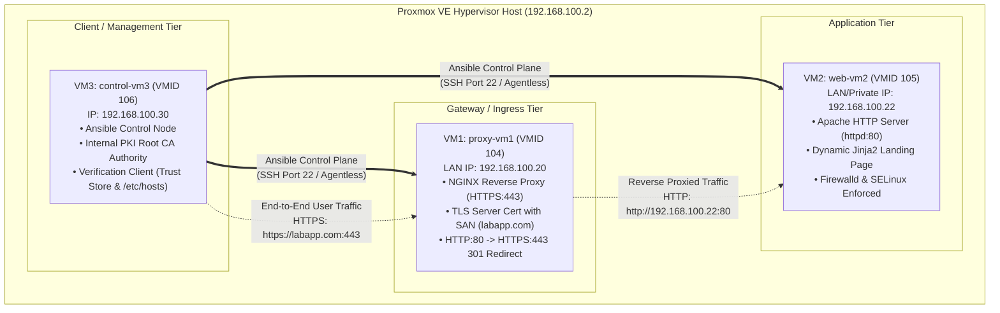
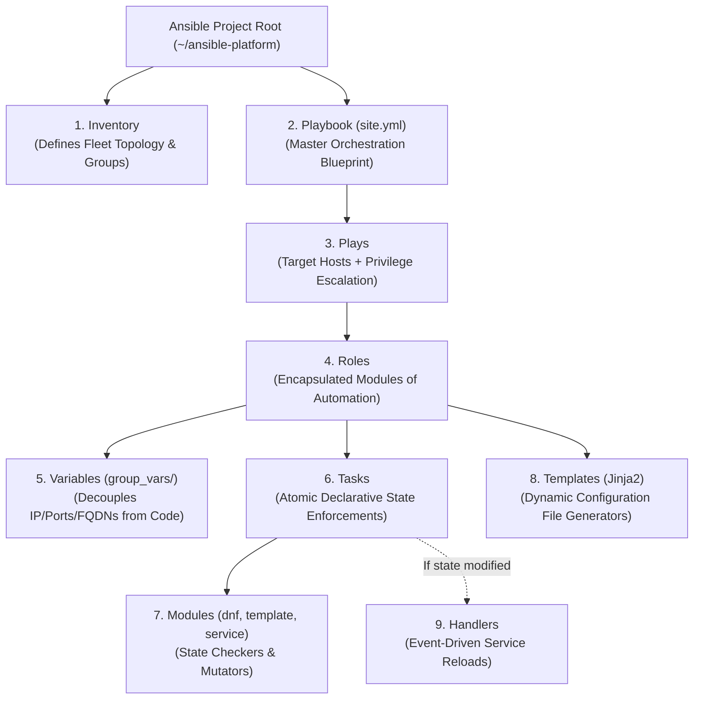

---
tags:
  - ansible
  - airnav-das
  - phase-3
  - master-runbook
  - zero-to-hero
  - sysadmin
  - devops
reading-order: 0
author: Hans Oliverio (Trainee Systems Engineer)
created: 2026-09-24
updated: 2026-09-24
---

# Phase 3: Deployment Automation — Complete End-to-End Master Runbook
## Zero-to-Hero Guide: From VM Provisioning to Automated Launch

> [!abstract] Executive Mission Brief
> This master runbook is your definitive, step-by-step, hand-holding guide to completing **Phase 3: Deployment Automation (AIR-DAS Onboarding)**.
> 
> In this phase, we rebuild the System Discovery Platform using **Ansible** on a clean, dedicated 3-VM architecture hosted on Proxmox VE:
> - **VM3 (`control-vm3`)**: Dedicated Ansible Control Node & Verification Client.
> - **VM1 (`proxy-vm1`)**: NGINX Reverse Proxy Gateway with HTTPS TLS Termination.
> - **VM2 (`web-vm2`)**: Apache HTTP Server Backend serving a dynamic Jinja2 webpage.
> 
> This guide takes you from preserving your existing Phase 2 configs, resetting/re-provisioning the VMs on Proxmox VE, setting up the SSH control plane on VM3, building the project repository and roles, automating the internal PKI, and proving **idempotency** and **drift correction** with one single master playbook (`site.yml`).

> [!info] Official Standards & Authority References
> - **Ansible Core Documentation**: [docs.ansible.com/ansible/latest/](https://docs.ansible.com/ansible/latest/)
> - **Proxmox VE 8.x Administration Guide**: [pve.proxmox.com/pve-docs/](https://pve.proxmox.com/pve-docs/)
> - **Red Hat Enterprise Linux 9 / AlmaLinux 9 System Administrator's Guide**: [access.redhat.com/documentation/en-us/red_hat_enterprise_linux/9](https://access.redhat.com/documentation/en-us/red_hat_enterprise_linux/9)
> - **IETF RFC 5280 (X.509 PKI & Certificate Profile)**: [datatracker.ietf.org/doc/html/rfc5280](https://datatracker.ietf.org/doc/html/rfc5280)
> - **CA/Browser Forum Baseline Requirements (2026)**: [cabforum.org/baseline-requirements/](https://cabforum.org/baseline-requirements/)

---

## 0 · Target Architecture & IP Assignment Matrix



### Complete Node Identity Matrix

| Hostname | VMID | Role in Phase 3 | IP Address | Subnet / Gateway | vCPU / RAM / Disk |
|---|:---:|---|---|---|:---:|
| `control-vm3` | **106** | Ansible Control Node & Client | `192.168.100.30/24` | GW: `192.168.100.1` | 2 vCPU / 1280 MB / 20 GB |
| `proxy-vm1` | **104** | NGINX Reverse Proxy Gateway | `192.168.100.20/24` | GW: `192.168.100.1` | 1 vCPU / 1280 MB / 15 GB |
| `web-vm2` | **105** | Backend Apache Web Server | `192.168.100.22/24` | GW: `192.168.100.1` | 1 vCPU / 1280 MB / 15 GB |
| *(Cold Backup)* `proxy01` | 102 | Phase 2 Proxy (Preserved on Disk) | (Powered Off) | - | Preserved |
| *(Cold Backup)* `proxy02` | 103 | Phase 2 HA Backup (Preserved on Disk) | (Powered Off) | - | Preserved |
| *(Cold Backup)* `appvm` | 101 | Phase 2 App (Preserved on Disk) | (Powered Off) | - | Preserved |
| *(Cold Backup)* `dbvm` | 100 | Phase 2 DB (Preserved on Disk) | (Powered Off) | - | Preserved |
| `pve` | Host | Proxmox VE Hypervisor | `192.168.100.2/24` | GW: `192.168.100.1` | Physical Server |
| `laptop` | Host | Management Laptop | `192.168.100.10/24` | GW: `192.168.100.1` | Local Machine |

---

## 1 · Flight School: Core Conceptual Foundations & Technical Vocabulary

> [!abstract] Architectural Mastery Before Execution
> As Systems Engineers at AirNav FCO Engineering, we do not simply run scripts—we architect **predictable, self-healing platforms**. To succeed in this task and defend your work before Sir Jayrose, you must understand the **conceptual purpose** of every component in the Ansible engine.



### 1.1 The 8 Core Building Blocks Explained

#### 1. Inventory (`inventory/hosts.ini`)
* **Purpose**: The single source of truth that defines *what machines exist* in the fleet and *how they are logically grouped*.
* **Why it matters**: Hardcoding IP addresses inside playbooks violates the principle of separation of concerns. In our project, the inventory establishes three distinct tiers: `[proxy]` (`proxy-vm1`), `[webservers]` (`web-vm2`), and `[clients]` (`control-vm3`), tied together under the parent group `[lab:children]`. This allows our automation to execute specific roles on specific tiers simultaneously.

#### 2. Playbooks & Plays (`site.yml`)
* **Purpose**: A **Playbook** is a YAML document containing one or more **Plays**. A **Play** maps a target inventory group to a specific set of roles and privileges (`become: true`).
* **Why it matters**: One master playbook (`site.yml`) coordinates the entire platform in strict dependency order: first initializing PKI trust, then deploying the backend Apache server, then configuring the NGINX reverse proxy, and finally validating everything from the client node.

#### 3. Tasks
* **Purpose**: The smallest atomic unit of action in Ansible. A task executes sequentially and declares the desired state of a single resource on a managed host.
* **Why it matters**: If a play contains 10 tasks, Ansible executes Task 1 on all target hosts, waits for confirmation, and only advances to Task 2 once Task 1 converges. If any task fails, execution halts immediately to prevent corrupting system state.

#### 4. Modules (FQCN: Fully Qualified Collection Names)
* **Purpose**: The workhorses of Ansible. Modules are standalone Python scripts shipped over SSH to inspect the target system and apply mutations only if the current state differs from the desired state.
* **Why it matters**: Instead of fragile Bash commands (`echo "Listen 80" >> /etc/httpd/conf/httpd.conf`), we use declarative modules:
  * `ansible.builtin.dnf`: Inspects RPM database; installs packages only if missing.
  * `ansible.builtin.template`: Renders Jinja2 templates; calculates SHA-256 checksums to avoid unnecessary disk writes.
  * `ansible.builtin.service`: Queries systemd; issues `systemctl start/enable` only if the daemon is stopped or disabled.
  * `ansible.posix.firewalld`: Queries firewalld runtime/permanent tables; injects port rules idempotently.
  * `ansible.posix.seboolean`: Modifies SELinux kernel booleans persistently without disabling OS security.
  * `ansible.builtin.lineinfile`: Modifies single lines in `/etc/hosts` using regular expressions without duplicating entries.

#### 5. Variables & Precedence Hierarchy
* **Purpose**: Centralizes dynamic values (such as IP addresses, backend ports, FQDNs, and organization names) so they are never repeated across multiple files.
* **Why it matters**: Hardcoding `192.168.100.20` in 5 different files means a network change requires 5 manual edits. By assigning `domain_name: labapp.com` in `group_vars/all.yml` and referencing `{{ domain_name }}`, we achieve complete decoupling. Our project implements a clean 3-tier hierarchy:
  1. `roles/*/defaults/main.yml`: Low-precedence fallback values.
  2. `group_vars/all.yml` & `group_vars/<tier>.yml`: High-precedence infrastructure settings.
  3. CLI Extra Vars (`-e`): Runtime overrides.

#### 6. Templates (Jinja2: `.j2`)
* **Purpose**: Dynamically generates production configuration files (`reverse_proxy.conf`, `index.html`) using Python's Jinja2 templating engine.
* **Why it matters**: Static files cannot adapt to different hosts. Jinja2 templates interpolate variables (`{{ fqdn }}`) and gathered system facts (`{{ ansible_hostname }}`, `{{ ansible_date_time.iso8601 }}`) in real-time, stamping deployment timestamps and network parameters dynamically.

#### 7. Handlers (Event-Driven Execution)
* **Purpose**: Special tasks that run **only when notified** by a task that made an actual change to the target host.
* **Why it matters**: If three tasks update NGINX configurations, putting `systemctl restart nginx` inside each task causes three separate service restarts and connection drops (service flapping). Handlers listen for `notify: Reload NGINX` and execute **exactly once at the end of the play**, providing zero-downtime, graceful reloads.

#### 8. Roles
* **Purpose**: Standardized, modular directory structures that package related tasks, handlers, variables, defaults, and templates into reusable units.
* **Why it matters**: Instead of a monolithic 1,000-line playbook, we divide responsibilities into four self-contained roles: `apache_web`, `nginx_proxy`, `pki_trust`, and `client_zone`. Each role can be tested, versioned, and reused independently.

---

### 1.2 The Principle of Idempotency & Configuration Convergence

In mathematics, an operation is **idempotent** if:
$$f(f(x)) = f(x)$$

In systems automation:
* **First Run (Initial Convergence)**: Ansible inspects clean VMs, detects that packages, configs, and certificates do not exist, and applies changes. The play recap shows `changed > 0`.
* **Second Run (Idempotency Proof)**: Ansible re-inspects the VMs. Because the current state already matches the desired state, Ansible does nothing. The play recap shows **`changed = 0`**.
* **Third Run (Self-Healing Drift Correction)**: If an administrator manually tampers with `/var/www/html/index.html`, running Ansible detects the drift via file hash mismatch, overwrites the corrupted file, and restores the system to full compliance (`changed = 1`).

---

## 2 · Step 0: Preserving Your Phase 2 Environment & Proxmox Snapshots

> [!important] Good News: Your Proxmox Snapshots Are Already Safe!
> We inspected your Proxmox VE host (`192.168.100.2`) and verified that every single one of your Phase 2 virtual machines already has a clean, active snapshot named **`finishedHA-preAutomation`** recorded on **2026-09-24 01:41**:
> - **VM 100 (`db`)**: `finishedHA-preAutomation`
> - **VM 101 (`app`)**: `finishedHA-preAutomation`
> - **VM 102 (`proxy`)**: `finishedHA-preAutomation`
> - **VM 103 (`proxy02`)**: `finishedHA-preAutomation`
>
> If anything ever goes wrong, you can instantly restore any VM to its exact Phase 2 state in seconds with:
> ```bash
> # Run on Proxmox host (192.168.100.2):
> qm rollback 102 finishedHA-preAutomation
> ```

---

### 2.1 Why the `scp: /tmp/proxy-vm1-configs.tar.gz: No such file or directory` Error Happened
When you ran the multi-line SSH script, your terminal asked:
`root@192.168.100.20's password:`
Because passwordless SSH keys were not yet installed from your laptop to `proxy-vm1` and `proxy02`, running multiple chained commands (`ssh` -> `scp` -> `ssh`) interrupted the input stream. The `scp` command fired before the remote `tar` command finished creating `/tmp/proxy-vm1-configs.tar.gz`.

---

### 2.2 Exporting Full Standalone VM Backups from Proxmox VE (`vzdump`)
Instead of wrestling with per-file SSH copy commands, you can export complete, standalone **Proxmox Virtual Machine Archive (`.vma.zst`)** backups directly from the hypervisor.

Run this single command on your **laptop** (which already has passwordless SSH to Proxmox):

```bash
# 1. Trigger Proxmox native live snapshot backup for all 4 VMs to local storage:
# (vzdump creates a consistent live snapshot without turning off the VMs)
ssh root@192.168.100.2 "vzdump 100 101 102 103 --mode snapshot --compress zstd --storage local"

# 2. View the generated backup archives on Proxmox:
ssh root@192.168.100.2 "ls -lh /var/lib/vz/dump/"

# 3. (Optional) Download the full backup images from Proxmox directly to your laptop:
mkdir -p ~/proxmox-phase2-backups
scp root@192.168.100.2:/var/lib/vz/dump/vzdump-qemu-*.vma.zst ~/proxmox-phase2-backups/
echo "✅ Complete Proxmox VM backups are now safely stored on your laptop in ~/proxmox-phase2-backups/"
```

---

### 2.3 Exporting Text Configurations Cleanly (`scp -r` Method)
> [!tip] Technical Discovery: Why `tar` Threw "Unexpected end of file"
> On AlmaLinux 9 minimal, the `tar` package is **not installed by default**! When running `ssh root@... "tar -czf - ..."`, the remote shell returned `bash: tar: command not found`. Because standard output was empty (0 bytes), your laptop's local `tar` saw an empty stream (`gzip: stdin: unexpected end of file`).
>
> To bypass this, we use native recursive **`scp -r`**, which requires zero external utilities on the remote nodes:

```bash
# 1. Pull NGINX, Keepalived, and network configs directly:
mkdir -p ~/phase2-preservation/proxy-vm1/etc ~/phase2-preservation/proxy02/etc
scp -r root@192.168.100.20:/etc/nginx ~/phase2-preservation/proxy-vm1/etc/
scp -r root@192.168.100.20:/etc/keepalived ~/phase2-preservation/proxy-vm1/etc/
scp root@192.168.100.20:/etc/hosts ~/phase2-preservation/proxy-vm1/etc/hosts

scp -r root@192.168.100.21:/etc/keepalived ~/phase2-preservation/proxy02/etc/
scp root@192.168.100.21:/etc/hosts ~/phase2-preservation/proxy02/etc/hosts

# 2. Package everything into your final local archive:
cd ~ && tar -czf phase2-complete-backup-$(date +%Y%m%d).tar.gz phase2-preservation/
echo "✅ Text configuration harvest complete! Stored at ~/phase2-complete-backup-$(date +%Y%m%d).tar.gz"
```

---

### 2.4 Preservation Status: 100% Secured!
Your Phase 2 environment is now secured across **two independent redundancy tiers**:
1. **Hypervisor Tier (`~/proxmox-phase2-backups/`)**: 7.3 GB of full, bootable Proxmox `.vma.zst` disk image backups for all 4 VMs (100, 101, 102, 103).
2. **Configuration Tier (`~/phase2-preservation/`)**: Clean directory tree containing all NGINX configs, Keepalived VIP scripts, hosts files, and PKI Root/Intermediate CA keys.

You can now safely proceed to **Step 1: Decommissioning & Provisioning Clean VMs on Proxmox**.


---

## 3 · Step 1: Preserving Old VMs & Provisioning the 3 Fresh VMs on Proxmox

> [!tip] Preserving Phase 2 VMs as Cold Backups
> Rather than deleting or modifying your existing Phase 2 VMs (VM 100, 101, 102, 103), we leave them **100% intact on disk** as cold standby backups.
> 
> **Important Hardware Check:** Your Proxmox host (`192.168.100.2`) has **3.7 GiB total physical RAM**. Because running 7 VMs simultaneously would exhaust memory and trigger the Linux Out-Of-Memory (OOM) killer, we simply **power off** the old VMs (`qm stop`) to release RAM, while keeping their disks and snapshots completely safe.

Log into the Proxmox VE host (`ssh root@192.168.100.2`) to stop old VMs and provision the three new clean VMs:

```bash
# -------------------------------------------------------------
# 1. Stop existing Phase 2 VMs to free physical RAM:
# (Their disks and snapshots remain 100% preserved on disk!)
# -------------------------------------------------------------
qm stop 100 2>/dev/null || true   # db
qm stop 101 2>/dev/null || true   # app
qm stop 102 2>/dev/null || true   # proxy
qm stop 103 2>/dev/null || true   # proxy02

# -------------------------------------------------------------
# 2. Create VM 104: proxy-vm1 (NGINX Reverse Proxy Gateway)
# -------------------------------------------------------------
qm create 104 \
  --name proxy-vm1 \
  --memory 1280 \
  --cores 1 \
  --cpu x86-64-v2-AES \
  --net0 virtio,bridge=vmbr0,firewall=1 \
  --scsihw virtio-scsi-single \
  --sata0 local-lvm:15 \
  --boot order=sata0;ide2;net0 \
  --ide2 local:iso/AlmaLinux-9-latest-x86_64-minimal.iso,media=cdrom \
  --ostype l26

# -------------------------------------------------------------
# 3. Create VM 105: web-vm2 (Backend Apache Web Server)
# -------------------------------------------------------------
qm create 105 \
  --name web-vm2 \
  --memory 1280 \
  --cores 1 \
  --cpu x86-64-v2-AES \
  --net0 virtio,bridge=vmbr0,firewall=1 \
  --scsihw virtio-scsi-single \
  --sata0 local-lvm:15 \
  --boot order=sata0;ide2;net0 \
  --ide2 local:iso/AlmaLinux-9-latest-x86_64-minimal.iso,media=cdrom \
  --ostype l26

# -------------------------------------------------------------
# 4. Create VM 106: control-vm3 (Ansible Control Node & Client)
# -------------------------------------------------------------
qm create 106 \
  --name control-vm3 \
  --memory 1280 \
  --cores 2 \
  --cpu x86-64-v2-AES \
  --net0 virtio,bridge=vmbr0,firewall=1 \
  --scsihw virtio-scsi-single \
  --sata0 local-lvm:20 \
  --boot order=sata0;ide2;net0 \
  --ide2 local:iso/AlmaLinux-9-latest-x86_64-minimal.iso,media=cdrom \
  --ostype l26

# -------------------------------------------------------------
# 5. Start the three new Phase 3 VMs:
# -------------------------------------------------------------
qm start 104
qm start 105
qm start 106
```

---

## 4 · Step 2: Installing AlmaLinux 9 on Each VM (One at a Time)

> [!caution] Important Installation Order
> Install and configure one VM completely before starting the next to avoid noVNC console confusion and minimize load on the Proxmox host.
> **Order**: `proxy-vm1` (VM 104) → `web-vm2` (VM 105) → `control-vm3` (VM 106)

---

### 4.0 Common AlmaLinux 9 Installer Walkthrough (Same Steps for All 3 VMs)

Open **Proxmox Web GUI** at `https://192.168.100.2:8006`, click the VM in the left sidebar, and click **Console (noVNC)**. Click **Start** (▶) to power on the selected VM. The AlmaLinux 9 text/graphical installer will appear.

Step-by-step through the Anaconda installer:

1. **Welcome Screen**: Select **English (English)** → **Continue**.
2. **Installation Summary** (the hub page — complete all items with a warning icon):
   * **Keyboard**: English (US) — Leave as-is.
   * **Time & Date**: Set to your timezone (e.g., **Asia / Manila**).
   * **Installation Destination**: Click it → Select the virtual disk (`sda` / 15 GB or 20 GB) → **Automatic partitioning** → **Done**.
   * **Network & Host Name**: See the per-VM tables below for the exact values.
   * **Root Password**: Set a strong root password. Write it down.
   * **Software Selection**: Keep as **Minimal Install** (no GUI needed — this is a server).
3. Click **Begin Installation** and wait (~3-5 minutes).
4. When complete: Click **Reboot System**.
5. After reboot, the VM will try to boot from the ISO again. Open the **Proxmox Console**, press any key to interrupt GRUB/boot menu and ensure it boots from disk OR eject the ISO:
   ```bash
   # Run on Proxmox host to eject the ISO from each VM after installation:
   ssh root@192.168.100.2 "qm set 104 --ide2 none; qm set 104 --boot order=sata0"
   ssh root@192.168.100.2 "qm set 105 --ide2 none; qm set 105 --boot order=sata0"
   ssh root@192.168.100.2 "qm set 106 --ide2 none; qm set 106 --boot order=sata0"
   ```

---

### 4.1 VM 104 (`proxy-vm1`) — NGINX Reverse Proxy Gateway

> [!info] VM 104: Identity Card
> | Parameter | Value |
> |---|---|
> | **VM Name** | `proxy-vm1` |
> | **VMID** | `104` |
> | **Role** | NGINX Reverse Proxy (Gateway) |
> | **Disk** | 15 GB |
> | **RAM** | 1280 MB |

#### Step A: OS Installer — Network & Hostname Screen
Inside the installer under **Network & Host Name**:
1. Toggle the network adapter **ON** (slide the Ethernet button to ON).
2. Click **Configure** → **IPv4 Settings**:
   - **Method**: `Manual`
   - **Address**: `192.168.100.20`
   - **Netmask**: `255.255.255.0` (or `/24`)
   - **Gateway**: `192.168.100.1`
   - **DNS Servers**: `192.168.100.1,8.8.8.8`
3. Set **Hostname** at the bottom: `proxy-vm1`
4. Click **Apply** → **Done**.

#### Step B: Post-Install Network & Hosts Configuration (SSH from your laptop)
After AlmaLinux boots, SSH in from your laptop and finalize setup:

> [!tip] Stale Host Key Notice (Automated Fix Already Applied)
> Because `proxy-vm1` reuses the IP `192.168.100.20`, an SSH client will normally detect a new host fingerprint and show `REMOTE HOST IDENTIFICATION HAS CHANGED!`. To clear the old Phase 2 key, the command is `ssh-keygen -R 192.168.100.20`. *(This has already been run on your laptop, so your connection will proceed smoothly!)*

```bash
# SSH in from your management laptop:
ssh root@192.168.100.20


# 1. Verify static IP is correct:
ip addr show ens18

# 2. Set the hostname definitively:
hostnamectl set-hostname proxy-vm1
echo "proxy-vm1" > /etc/hostname

# 3. Write /etc/hosts with all 3 Phase 3 nodes:
cat << 'EOF' > /etc/hosts
127.0.0.1   localhost localhost.localdomain
::1         localhost localhost.localdomain
192.168.100.30 control-vm3
192.168.100.20 proxy-vm1
192.168.100.22 web-vm2
192.168.100.2  pve
192.168.100.10 laptop
EOF

# 4. Install essential tools:
dnf install -y tar curl openssl wget

# 5. Verify connectivity:
ping -c 2 192.168.100.1
curl -sI https://example.com | head -n 1

echo "✅ proxy-vm1 ready!"
```

---

### 4.2 VM 105 (`web-vm2`) — Backend Apache Web Server

> [!info] VM 105: Identity Card
> | Parameter | Value |
> |---|---|
> | **VM Name** | `web-vm2` |
> | **VMID** | `105` |
> | **Role** | Apache HTTP Backend (Port 80) |
> | **Disk** | 15 GB |
> | **RAM** | 1280 MB |

#### Step A: OS Installer — Network & Hostname Screen
Inside the installer under **Network & Host Name**:
1. Toggle the network adapter **ON**.
2. Click **Configure** → **IPv4 Settings**:
   - **Method**: `Manual`
   - **Address**: `192.168.100.22`
   - **Netmask**: `255.255.255.0` (or `/24`)
   - **Gateway**: `192.168.100.1`
   - **DNS Servers**: `192.168.100.1,8.8.8.8`
3. Set **Hostname** at the bottom: `web-vm2`
4. Click **Apply** → **Done**.

#### Step B: Post-Install Network & Hosts Configuration
```bash
# SSH in from your management laptop:
ssh root@192.168.100.22

# 1. Verify static IP is correct:
ip addr show ens18

# 2. Set the hostname definitively:
hostnamectl set-hostname web-vm2
echo "web-vm2" > /etc/hostname

# 3. Write /etc/hosts with all 3 Phase 3 nodes:
cat << 'EOF' > /etc/hosts
127.0.0.1   localhost localhost.localdomain
::1         localhost localhost.localdomain
192.168.100.30 control-vm3
192.168.100.20 proxy-vm1
192.168.100.22 web-vm2
192.168.100.2  pve
192.168.100.10 laptop
EOF

# 4. Install essential tools:
dnf install -y tar curl openssl wget

# 5. Verify connectivity:
ping -c 2 192.168.100.20

echo "✅ web-vm2 ready!"
```

---

### 4.3 VM 106 (`control-vm3`) — Ansible Control Node & Verification Client

> [!info] VM 106: Identity Card
> | Parameter | Value |
> |---|---|
> | **VM Name** | `control-vm3` |
> | **VMID** | `106` |
> | **Role** | Ansible Control Node + Root CA Authority + Verification Client |
> | **Disk** | 20 GB |
> | **RAM** | 1280 MB |

#### Step A: OS Installer — Network & Hostname Screen
Inside the installer under **Network & Host Name**:
1. Toggle the network adapter **ON**.
2. Click **Configure** → **IPv4 Settings**:
   - **Method**: `Manual`
   - **Address**: `192.168.100.30`
   - **Netmask**: `255.255.255.0` (or `/24`)
   - **Gateway**: `192.168.100.1`
   - **DNS Servers**: `192.168.100.1,8.8.8.8`
3. Set **Hostname** at the bottom: `control-vm3`
4. Click **Apply** → **Done**.

#### Step B: Post-Install Network & Hosts Configuration
```bash
# SSH in from your management laptop:
ssh root@192.168.100.30

# 1. Verify static IP is correct:
ip addr show ens18

# 2. Set the hostname definitively:
hostnamectl set-hostname control-vm3
echo "control-vm3" > /etc/hostname

# 3. Write /etc/hosts with all 3 Phase 3 nodes:
cat << 'EOF' > /etc/hosts
127.0.0.1   localhost localhost.localdomain
::1         localhost localhost.localdomain
192.168.100.30 control-vm3
192.168.100.20 proxy-vm1
192.168.100.22 web-vm2
192.168.100.2  pve
192.168.100.10 laptop
EOF

# 4. Install essential tools:
dnf install -y tar curl openssl wget

# 5. Verify you can reach both managed nodes:
ping -c 2 192.168.100.20   # should reach proxy-vm1
ping -c 2 192.168.100.22   # should reach web-vm2

echo "✅ control-vm3 ready as Ansible Control Node!"
```

---

### 4.4 Network Validation Checkpoint
After all three VMs are installed, run these quick tests from your **management laptop** to confirm connectivity:

```bash
# Verify all 3 Phase 3 VMs are up and reachable over SSH:
ssh root@192.168.100.20 "hostname && ip addr show ens18 | grep 'inet '"
ssh root@192.168.100.22 "hostname && ip addr show ens18 | grep 'inet '"
ssh root@192.168.100.30 "hostname && ip addr show ens18 | grep 'inet '"
```

Expected output:
```text
proxy-vm1
    inet 192.168.100.20/24 ...
web-vm2
    inet 192.168.100.22/24 ...
control-vm3
    inet 192.168.100.30/24 ...
```

> [!tip] If your network adapter shows up as `eth0` or `enp6s18` instead of `ens18`, just substitute that name in the `nmcli` commands. Run `ip link` to find the correct interface name.

---

## 5 · Step 3: Setting Up the Ansible Control Plane on VM3 (`control-vm3`)

From this point forward, **all automation operations are executed directly on `control-vm3` (`192.168.100.30`)**. Log into it via SSH from your laptop:
```bash
ssh root@192.168.100.30
```


---

## 5 · Step 3: Setting Up the Ansible Control Plane on VM3 (`control-vm3`)

From this point forward, **all automation operations are executed directly on `control-vm3` (`192.168.100.30`)**.

### 4.1 Install Ansible Core and Dependencies
Log into `control-vm3` as `root` (or regular user with sudo):

```bash
# 1. Update system package repository metadata:
dnf check-update || true

# 2. Install EPEL (Extra Packages for Enterprise Linux):
dnf install -y epel-release

# 3. Install Ansible Core, Python 3, OpenSSL, and Git:
dnf install -y ansible-core python3-pip git openssl curl

# 4. Verify Ansible version:
ansible --version
# Output should confirm: ansible [core 2.15+] with Python 3.9+
```

---

### 4.2 Generate & Distribute Ed25519 SSH Keys
Ansible is completely **agentless**: it uses OpenSSH to push and execute ephemeral Python modules.

```bash
# 1. Generate an Ed25519 keypair on control-vm3:
# (-N "" ensures passwordless authentication for uninterrupted automation)
ssh-keygen -t ed25519 -C "ansible-control-vm3" -f ~/.ssh/id_ed25519 -N ""

# 2. Copy the public key to proxy-vm1 (VM1):
ssh-copy-id -i ~/.ssh/id_ed25519.pub root@192.168.100.20

# 3. Copy the public key to web-vm2 (VM2):
ssh-copy-id -i ~/.ssh/id_ed25519.pub root@192.168.100.22

# 4. Authorize the key locally on control-vm3 (VM3) for client tasks:
cat ~/.ssh/id_ed25519.pub >> ~/.ssh/authorized_keys
chmod 600 ~/.ssh/authorized_keys

# 5. Test passwordless SSH connectivity across all nodes:
ssh -o BatchMode=yes root@192.168.100.20 "echo '[OK] proxy-vm1 SSH connection verified'"
ssh -o BatchMode=yes root@192.168.100.22 "echo '[OK] web-vm2 SSH connection verified'"
ssh -o BatchMode=yes root@127.0.0.1 "echo '[OK] localhost SSH connection verified'"
```

---

## 6 · Step 4: Milestone 1 — Project Hangar Scaffold

Now, create the clean, enterprise-grade Ansible repository structure on `control-vm3`.

```bash
# 1. Create project root directory:
mkdir -p ~/ansible-platform
cd ~/ansible-platform

# 2. Create the standard directory tree:
mkdir -p inventory
mkdir -p group_vars
mkdir -p host_vars
mkdir -p roles/{apache_web,nginx_proxy,pki_trust,client_zone}
mkdir -p roles/apache_web/{defaults,tasks,templates,handlers}
mkdir -p roles/nginx_proxy/{defaults,tasks,templates,handlers}
mkdir -p roles/pki_trust/{defaults,tasks,templates,handlers}
mkdir -p roles/client_zone/{defaults,tasks,templates,handlers}
mkdir -p pki_artifacts
```

---

### 5.1 Crafting Project-Level `ansible.cfg`
Create `~/ansible-platform/ansible.cfg`:

```ini
# ~/ansible-platform/ansible.cfg
# Project-level configuration file

[defaults]
# Default inventory path:
inventory = ./inventory/hosts.ini

# Path to search for roles:
roles_path = ./roles

# Default remote SSH user:
remote_user = root

# Number of parallel processes to spawn:
forks = 5

# Suppress SSH host key verification warnings in lab environment:
host_key_checking = False

# Display output in formatted, human-readable YAML:
stdout_callback = yaml

# Disable generation of .retry files on failure:
retry_files_enabled = False

[privilege_escalation]
# Automatically escalate privileges to root via sudo:
become = True
become_method = sudo
become_user = root
become_ask_pass = False
```

---

### 5.2 Creating the Inventory (`inventory/hosts.ini`)
Create `~/ansible-platform/inventory/hosts.ini`:

```ini
# ~/ansible-platform/inventory/hosts.ini
# Defines host aliases, IPs, connection parameters, and tier groups

[proxy]
proxy-vm1 ansible_host=192.168.100.20 ansible_user=root

[webservers]
web-vm2   ansible_host=192.168.100.22 ansible_user=root

[clients]
# control-vm3 acts as the verification client host:
control-vm3 ansible_host=127.0.0.1 ansible_connection=local

# Umbrella group containing all lab nodes:
[lab:children]
proxy
webservers
clients
```

---

### 5.3 Defining Variables (`group_vars/`)
A core requirement of Milestone 1 is separating common values from tier-specific settings.

#### Common Values (`group_vars/all.yml`):
```yaml
# ~/ansible-platform/group_vars/all.yml
---
# Applied across all hosts in the inventory:
domain_name: "labapp.com"
backend_port: 80
proxy_http_port: 80
proxy_https_port: 443

# Organization identity for certificates:
pki_org: "AirNav FCO Engineering"
pki_ou: "DAS Lab"
pki_country: "PH"
pki_state: "NCR"
pki_city: "Pasay"
```

#### Proxy Tier Values (`group_vars/proxy.yml`):
```yaml
# ~/ansible-platform/group_vars/proxy.yml
---
# Applied specifically to [proxy] hosts:
nginx_package_name: "nginx"
nginx_service_name: "nginx"
backend_server_ip: "192.168.100.22"

ssl_cert_dir: "/etc/pki/nginx"
ssl_cert_file: "{{ ssl_cert_dir }}/server.crt"
ssl_key_file: "{{ ssl_cert_dir }}/server.key"
ssl_ca_file: "{{ ssl_cert_dir }}/root-ca.crt"
```

#### Web Server Tier Values (`group_vars/webservers.yml`):
```yaml
# ~/ansible-platform/group_vars/webservers.yml
---
# Applied specifically to [webservers] hosts:
apache_package_name: "httpd"
apache_service_name: "httpd"
web_document_root: "/var/www/html"
webpage_title: "AirNav DAS - System Discovery Platform"
```

---

### 5.4 Validating Milestone 1 Connectivity
Execute these validation commands on `control-vm3`:

```bash
cd ~/ansible-platform

# 1. Verify the inventory structure graphically:
ansible-inventory --graph
# Expected:
# @all:
#   |--@lab:
#   |  |--@clients:
#   |  |  |--control-vm3
#   |  |--@proxy:
#   |  |  |--proxy-vm1
#   |  |--@webservers:
#   |  |  |--web-vm2

# 2. Run Ansible ping across all nodes:
ansible all -m ping
# Expected:
# proxy-vm1   | SUCCESS => {"changed": false, "ping": "pong"}
# web-vm2     | SUCCESS => {"changed": false, "ping": "pong"}
# control-vm3 | SUCCESS => {"changed": false, "ping": "pong"}
```

---

## 7 · Step 5: Milestone 2 — Web Server Role (Apache on VM2)

### 6.1 Role Defaults (`roles/apache_web/defaults/main.yml`)
```yaml
# ~/ansible-platform/roles/apache_web/defaults/main.yml
---
apache_package: "{{ apache_package_name | default('httpd') }}"
apache_service: "{{ apache_service_name | default('httpd') }}"
apache_port: "{{ backend_port | default(80) }}"
document_root: "{{ web_document_root | default('/var/www/html') }}"
page_title: "{{ webpage_title | default('AirNav DAS System Discovery') }}"
```

---

### 6.2 Dynamic HTML Landing Page (`roles/apache_web/templates/index.html.j2`)
```html
<!-- ~/ansible-platform/roles/apache_web/templates/index.html.j2 -->
<!DOCTYPE html>
<html lang="en">
<head>
    <meta charset="UTF-8">
    <title>{{ page_title }}</title>
    <style>
        body { font-family: 'Segoe UI', Tahoma, Geneva, Verdana, sans-serif; background-color: #0b132b; color: #ffffff; text-align: center; padding-top: 60px; }
        .card { background-color: #1c2541; display: inline-block; padding: 40px; border-radius: 12px; box-shadow: 0 8px 32px rgba(0,0,0,0.5); border: 1px solid #3a506b; }
        h1 { color: #48cae4; margin: 0 0 10px 0; }
        h3 { color: #90e0ef; font-weight: normal; margin-top: 0; }
        table { margin: 25px auto 0 auto; text-align: left; border-collapse: collapse; }
        td { padding: 10px 18px; border-bottom: 1px solid #3a506b; font-size: 15px; }
        .badge { background-color: #5bc0be; color: #0b132b; padding: 6px 14px; border-radius: 6px; font-weight: bold; font-size: 13px; }
    </style>
</head>
<body>
    <div class="card">
        <h1>✈️ AIRNAV FCO ENGINEERING</h1>
        <h3>{{ page_title }}</h3>
        <span class="badge">DEPLOYED BY ANSIBLE AUTOMATION</span>

        <table>
            <tr><td><strong>Backend Host:</strong></td><td>{{ ansible_hostname }} ({{ ansible_default_ipv4.address }})</td></tr>
            <tr><td><strong>Operating System:</strong></td><td>{{ ansible_distribution }} {{ ansible_distribution_version }}</td></tr>
            <tr><td><strong>Backend Port:</strong></td><td>TCP {{ apache_port }}</td></tr>
            <tr><td><strong>Deployment Timestamp:</strong></td><td>{{ ansible_date_time.iso8601 }}</td></tr>
        </table>
    </div>
</body>
</html>
```

---

### 6.3 Port Configuration Template (`roles/apache_web/templates/ports.conf.j2`)
```apache
# ~/ansible-platform/roles/apache_web/templates/ports.conf.j2
# Managed by Ansible — roles/apache_web
Listen {{ apache_port }}
```

---

### 6.4 Tasks Definition (`roles/apache_web/tasks/main.yml`)
```yaml
# ~/ansible-platform/roles/apache_web/tasks/main.yml
---
- name: Install Apache HTTP Server package
  ansible.builtin.dnf:
    name: "{{ apache_package }}"
    state: present
  tags: [packages, apache]

- name: Configure Apache backend listening port
  ansible.builtin.template:
    src: ports.conf.j2
    dest: /etc/httpd/conf.d/00-ports.conf
    owner: root
    group: root
    mode: '0644'
  notify: Restart Apache
  tags: [config, apache]

- name: Deploy dynamic landing page from Jinja2 template
  ansible.builtin.template:
    src: index.html.j2
    dest: "{{ document_root }}/index.html"
    owner: root
    group: root
    mode: '0644'
  tags: [content, apache]

- name: Configure Firewalld to permit backend port traffic
  ansible.posix.firewalld:
    port: "{{ apache_port }}/tcp"
    permanent: true
    state: enabled
    immediate: true
  tags: [security, firewall]

- name: Configure SELinux to permit custom Apache listening port
  community.general.seport:
    ports: "{{ apache_port }}"
    proto: tcp
    setype: http_port_t
    state: present
  when: apache_port != 80 and apache_port != 443
  tags: [security, selinux]

- name: Ensure Apache service is enabled on boot and started
  ansible.builtin.service:
    name: "{{ apache_service }}"
    state: started
    enabled: true
  tags: [services, apache]

- name: Flush handlers to apply config changes immediately before verification
  ansible.builtin.meta: flush_handlers

- name: Verify Apache responds locally on backend port
  ansible.builtin.uri:
    url: "http://127.0.0.1:{{ apache_port }}"
    method: GET
    status_code: 200
    return_content: true
  register: local_http_check
  failed_when: "'AIRNAV FCO ENGINEERING' not in local_http_check.content"
  tags: [verification]

- name: Display backend verification evidence
  ansible.builtin.debug:
    msg: "SUCCESS: Apache backend verified locally on web-vm2 port {{ apache_port }}. Status: {{ local_http_check.status }}"
  tags: [verification]
```

---

### 6.5 Handlers (`roles/apache_web/handlers/main.yml`)
```yaml
# ~/ansible-platform/roles/apache_web/handlers/main.yml
---
- name: Restart Apache
  ansible.builtin.service:
    name: "{{ apache_service }}"
    state: restarted
```

---

## 8 · Step 6: Milestone 3 — Proxy Gateway Role (NGINX on VM1)

### 7.1 Role Defaults (`roles/nginx_proxy/defaults/main.yml`)
```yaml
# ~/ansible-platform/roles/nginx_proxy/defaults/main.yml
---
nginx_package: "{{ nginx_package_name | default('nginx') }}"
nginx_service: "{{ nginx_service_name | default('nginx') }}"
fqdn: "{{ domain_name | default('labapp.com') }}"
proxy_port: "{{ proxy_http_port | default(80) }}"
upstream_host: "{{ backend_server_ip | default('192.168.100.22') }}"
upstream_port: "{{ backend_port | default(80) }}"
```

---

### 7.2 Reverse Proxy Template (`roles/nginx_proxy/templates/reverse_proxy.conf.j2`)
```nginx
# ~/ansible-platform/roles/nginx_proxy/templates/reverse_proxy.conf.j2
# Managed by Ansible — roles/nginx_proxy
# Host: {{ inventory_hostname }} | Generated: {{ ansible_date_time.iso8601 }}

upstream backend_servers {
    server {{ upstream_host }}:{{ upstream_port }};
    keepalive 32;
}

server {
    listen {{ proxy_port }};
    listen [::]:{{ proxy_port }};
    server_name {{ fqdn }};

    access_log /var/log/nginx/reverse_proxy_access.log combined;
    error_log /var/log/nginx/reverse_proxy_error.log warn;

    location / {
        proxy_pass http://backend_servers;

        # Standard Forwarding Headers:
        proxy_set_header Host $host;
        proxy_set_header X-Real-IP $remote_addr;
        proxy_set_header X-Forwarded-For $proxy_add_x_forwarded_for;
        proxy_set_header X-Forwarded-Proto $scheme;

        proxy_http_version 1.1;
        proxy_set_header Connection "";
    }
}
```

---

### 7.3 Tasks Definition (`roles/nginx_proxy/tasks/main.yml`)
```yaml
# ~/ansible-platform/roles/nginx_proxy/tasks/main.yml
---
- name: Install NGINX reverse proxy package
  ansible.builtin.dnf:
    name: "{{ nginx_package }}"
    state: present
  tags: [packages, nginx]

- name: Remove default Welcome configuration if present
  ansible.builtin.file:
    path: /etc/nginx/conf.d/default.conf
    state: absent
  notify: Reload NGINX
  tags: [config, nginx]

- name: Deploy reverse proxy configuration with pre-flight syntax validation
  ansible.builtin.template:
    src: reverse_proxy.conf.j2
    dest: /etc/nginx/conf.d/reverse_proxy.conf
    owner: root
    group: root
    mode: '0644'
    # Validates syntax on remote host before overwriting live config:
    validate: 'nginx -t -c /etc/nginx/nginx.conf'
  notify: Reload NGINX
  tags: [config, nginx]

- name: Configure SELinux boolean to permit NGINX to proxy network connections
  ansible.posix.seboolean:
    name: httpd_can_network_connect
    state: true
    persistent: true
  tags: [security, selinux]

- name: Configure Firewalld to permit incoming HTTP traffic
  ansible.posix.firewalld:
    port: "{{ proxy_port }}/tcp"
    permanent: true
    state: enabled
    immediate: true
  tags: [security, firewall]

- name: Ensure NGINX service is enabled on boot and started
  ansible.builtin.service:
    name: "{{ nginx_service }}"
    state: started
    enabled: true
  tags: [services, nginx]

- name: Flush handlers to reload NGINX before running verification check
  ansible.builtin.meta: flush_handlers

- name: Verify proxy-to-backend communication path
  ansible.builtin.uri:
    url: "http://127.0.0.1:{{ proxy_port }}"
    headers:
      Host: "{{ fqdn }}"
    method: GET
    status_code: 200
    return_content: true
  register: proxy_check
  failed_when: "'AIRNAV FCO ENGINEERING' not in proxy_check.content"
  tags: [verification]

- name: Display proxy verification evidence
  ansible.builtin.debug:
    msg: "SUCCESS: NGINX successfully proxied request to Apache. Status: {{ proxy_check.status }}"
  tags: [verification]
```

---

### 7.4 Handlers (`roles/nginx_proxy/handlers/main.yml`)
```yaml
# ~/ansible-platform/roles/nginx_proxy/handlers/main.yml
---
- name: Reload NGINX
  ansible.builtin.service:
    name: "{{ nginx_service }}"
    state: reloaded

- name: Restart NGINX
  ansible.builtin.service:
    name: "{{ nginx_service }}"
    state: restarted
```

---

## 9 · Step 7: Milestone 4 — Trust (Automated Internal PKI & HTTPS)

In this milestone, `control-vm3` acts as the Certificate Authority (CA). The Root CA private key is kept strictly isolated on `control-vm3`.

### 8.1 Role Defaults (`roles/pki_trust/defaults/main.yml`)
```yaml
# ~/ansible-platform/roles/pki_trust/defaults/main.yml
---
pki_dir: "{{ playbook_dir }}/pki_artifacts"
ca_key_name: "root-ca.key"
ca_crt_name: "root-ca.crt"
ca_subject: "/C={{ pki_country | default('PH') }}/ST={{ pki_state | default('NCR') }}/L={{ pki_city | default('Pasay') }}/O={{ pki_org | default('AirNav FCO Engineering') }}/OU={{ pki_ou | default('DAS Lab') }}/CN=AirNav DAS Root CA"

server_cert_fqdn: "{{ domain_name | default('labapp.com') }}"
server_subject: "/C={{ pki_country | default('PH') }}/ST={{ pki_state | default('NCR') }}/L={{ pki_city | default('Pasay') }}/O={{ pki_org | default('AirNav FCO Engineering') }}/OU={{ pki_ou | default('DAS Lab') }}/CN={{ server_cert_fqdn }}"

remote_cert_directory: "{{ ssl_cert_dir | default('/etc/pki/nginx') }}"
remote_cert_path: "{{ ssl_cert_file | default('/etc/pki/nginx/server.crt') }}"
remote_key_path: "{{ ssl_key_file | default('/etc/pki/nginx/server.key') }}"
remote_ca_path: "{{ ssl_ca_file | default('/etc/pki/nginx/root-ca.crt') }}"
```

---

### 8.2 Modern OpenSSL SAN Extension Template (`roles/pki_trust/templates/server_ext.cnf.j2`)
```ini
# ~/ansible-platform/roles/pki_trust/templates/server_ext.cnf.j2
basicConstraints = critical, CA:FALSE
keyUsage = critical, digitalSignature, keyEncipherment
extendedKeyUsage = serverAuth
subjectKeyIdentifier = hash
authorityKeyIdentifier = keyid,issuer

# Modern RFC 5280 & CA/B Forum Subject Alternative Names:
subjectAltName = @alt_names

[alt_names]
DNS.1 = {{ server_cert_fqdn }}
DNS.2 = *.{{ server_cert_fqdn }}
IP.1 = {{ hostvars['proxy-vm1']['ansible_host'] | default('192.168.100.20') }}
IP.2 = 127.0.0.1
```

---

### 8.3 Tasks Definition (`roles/pki_trust/tasks/main.yml`)
```yaml
# ~/ansible-platform/roles/pki_trust/tasks/main.yml
---
# =========================================================================
# 1. CONTROL NODE TASKS (CA Generation & Server Signing on control-vm3)
# =========================================================================
- name: Ensure local PKI artifact directory exists on Control Node
  ansible.builtin.file:
    path: "{{ pki_dir }}"
    state: directory
    mode: '0700'
  delegate_to: localhost
  run_once: true
  tags: [pki, ca]

- name: Generate Root CA Private Key (4096-bit RSA)
  ansible.builtin.command: >
    openssl genrsa -out {{ pki_dir }}/{{ ca_key_name }} 4096
  args:
    creates: "{{ pki_dir }}/{{ ca_key_name }}"
  delegate_to: localhost
  run_once: true
  tags: [pki, ca]

- name: Generate Self-Signed Root CA Certificate (10-Year Validity)
  ansible.builtin.command: >
    openssl req -x509 -new -nodes
    -key {{ pki_dir }}/{{ ca_key_name }}
    -sha256 -days 3650
    -out {{ pki_dir }}/{{ ca_crt_name }}
    -subj "{{ ca_subject }}"
  args:
    creates: "{{ pki_dir }}/{{ ca_crt_name }}"
  delegate_to: localhost
  run_once: true
  tags: [pki, ca]

- name: Generate Server Private Key for NGINX (2048-bit RSA)
  ansible.builtin.command: >
    openssl genrsa -out {{ pki_dir }}/server.key 2048
  args:
    creates: "{{ pki_dir }}/server.key"
  delegate_to: localhost
  run_once: true
  tags: [pki, server_cert]

- name: Generate Server Certificate Signing Request (CSR)
  ansible.builtin.command: >
    openssl req -new
    -key {{ pki_dir }}/server.key
    -out {{ pki_dir }}/server.csr
    -subj "{{ server_subject }}"
  args:
    creates: "{{ pki_dir }}/server.csr"
  delegate_to: localhost
  run_once: true
  tags: [pki, server_cert]

- name: Render OpenSSL SAN extension configuration
  ansible.builtin.template:
    src: server_ext.cnf.j2
    dest: "{{ pki_dir }}/server_ext.cnf"
    mode: '0600'
  delegate_to: localhost
  run_once: true
  tags: [pki, server_cert]

- name: Sign Server CSR using Root CA with modern SAN extensions
  ansible.builtin.command: >
    openssl x509 -req
    -in {{ pki_dir }}/server.csr
    -CA {{ pki_dir }}/{{ ca_crt_name }}
    -CAkey {{ pki_dir }}/{{ ca_key_name }}
    -CAcreateserial
    -out {{ pki_dir }}/server.crt
    -days 365
    -sha256
    -extfile {{ pki_dir }}/server_ext.cnf
  args:
    creates: "{{ pki_dir }}/server.crt"
  delegate_to: localhost
  run_once: true
  tags: [pki, server_cert]

# =========================================================================
# 2. TARGET PROXY NODE TASKS (Deploy to proxy-vm1 with Hardened Permissions)
# =========================================================================
- name: Ensure target certificate directory exists on NGINX host
  ansible.builtin.file:
    path: "{{ remote_cert_directory }}"
    state: directory
    owner: root
    group: root
    mode: '0755'
  tags: [deploy, nginx]

- name: Deploy Server Certificate to NGINX
  ansible.builtin.copy:
    src: "{{ pki_dir }}/server.crt"
    dest: "{{ remote_cert_path }}"
    owner: root
    group: root
    mode: '0644'
  notify: Reload NGINX
  tags: [deploy, nginx]

- name: Deploy Server Private Key with strict 0600 permissions
  ansible.builtin.copy:
    src: "{{ pki_dir }}/server.key"
    dest: "{{ remote_key_path }}"
    owner: root
    group: root
    mode: '0600'
  notify: Reload NGINX
  tags: [deploy, nginx]

- name: Deploy Root CA public certificate to NGINX node
  ansible.builtin.copy:
    src: "{{ pki_dir }}/{{ ca_crt_name }}"
    dest: "{{ remote_ca_path }}"
    owner: root
    group: root
    mode: '0644'
  tags: [deploy, nginx]

# =========================================================================
# 3. VERIFICATION TASKS (Cryptographic Proof)
# =========================================================================
- name: Verify server certificate Subject Alternative Names (SAN)
  ansible.builtin.command: >
    openssl x509 -in {{ remote_cert_path }} -text -noout
  register: cert_inspection
  changed_when: false
  tags: [verification]

- name: Assert SAN contains required FQDN and IP
  ansible.builtin.assert:
    that:
      - "'DNS:labapp.com' in cert_inspection.stdout"
      - "'IP Address:192.168.100.20' in cert_inspection.stdout"
    fail_msg: "SECURITY FAILURE: Server certificate missing required SAN extensions!"
    success_msg: "VERIFIED: Server certificate SAN correctly matches FQDN and IP."
  tags: [verification]

- name: Verify certificate chain of trust against Root CA
  ansible.builtin.command: >
    openssl verify -CAfile {{ remote_ca_path }} {{ remote_cert_path }}
  register: chain_verify
  changed_when: false
  failed_when: "'OK' not in chain_verify.stdout"
  tags: [verification]

- name: Display cryptographic verification evidence
  ansible.builtin.debug:
    msg: "CHAIN VERIFICATION RESULT: {{ chain_verify.stdout }}"
  tags: [verification]
```

---

### 8.4 Upgrade NGINX Template for HTTPS (`roles/nginx_proxy/templates/reverse_proxy.conf.j2`)
Update `roles/nginx_proxy/templates/reverse_proxy.conf.j2` to terminate HTTPS on port 443 and redirect HTTP on port 80:

```nginx
# ~/ansible-platform/roles/nginx_proxy/templates/reverse_proxy.conf.j2
# Managed by Ansible — roles/nginx_proxy + roles/pki_trust

upstream backend_servers {
    server {{ upstream_host }}:{{ upstream_port }};
    keepalive 32;
}

# 1. HTTP Server Block — Permanent 301 Redirect to HTTPS:
server {
    listen {{ proxy_port }};
    listen [::]:{{ proxy_port }};
    server_name {{ fqdn }};

    location / {
        return 301 https://$host$request_uri;
    }
}

# 2. HTTPS Server Block — TLS Termination & Reverse Proxy:
server {
    listen {{ proxy_https_port | default(443) }} ssl http2;
    listen [::]:{{ proxy_https_port | default(443) }} ssl http2;
    server_name {{ fqdn }};

    ssl_certificate {{ ssl_cert_file }};
    ssl_certificate_key {{ ssl_key_file }};

    ssl_protocols TLSv1.2 TLSv1.3;
    ssl_ciphers HIGH:!aNULL:!MD5:!3DES;
    ssl_prefer_server_ciphers on;
    ssl_session_cache shared:SSL:10m;
    ssl_session_timeout 10m;

    access_log /var/log/nginx/https_access.log combined;
    error_log /var/log/nginx/https_error.log warn;

    location / {
        proxy_pass http://backend_servers;

        proxy_set_header Host $host;
        proxy_set_header X-Real-IP $remote_addr;
        proxy_set_header X-Forwarded-For $proxy_add_x_forwarded_for;
        proxy_set_header X-Forwarded-Proto https;

        proxy_http_version 1.1;
        proxy_set_header Connection "";
    }
}
```

In `roles/nginx_proxy/tasks/main.yml`, add firewalld port 443:
```yaml
- name: Configure Firewalld to permit incoming HTTPS traffic
  ansible.posix.firewalld:
    port: "{{ proxy_https_port | default(443) }}/tcp"
    permanent: true
    state: enabled
    immediate: true
  tags: [security, firewall]
```

---

## 10 · Step 8: Milestone 5 — Client Landing Zone (Client on VM3)

### 9.1 Role Defaults (`roles/client_zone/defaults/main.yml`)
```yaml
# ~/ansible-platform/roles/client_zone/defaults/main.yml
---
client_fqdn: "{{ domain_name | default('labapp.com') }}"
client_proxy_target_ip: "{{ hostvars['proxy-vm1']['ansible_host'] | default('192.168.100.20') }}"
pki_root_ca_source: "{{ playbook_dir }}/pki_artifacts/root-ca.crt"
system_ca_anchors_dir: "/etc/pki/ca-trust/source/anchors"
installed_ca_name: "airnav-das-root-ca.crt"
```

---

### 9.2 Tasks Definition (`roles/client_zone/tasks/main.yml`)
```yaml
# ~/ansible-platform/roles/client_zone/tasks/main.yml
---
- name: Manage FQDN mapping in /etc/hosts preserving existing entries
  ansible.builtin.lineinfile:
    path: /etc/hosts
    regexp: '^[0-9.]+\s+.*\b{{ client_fqdn | regex_escape }}\b.*'
    line: "{{ client_proxy_target_ip }} {{ client_fqdn }}"
    state: present
    backup: true
  tags: [hosts, dns]

- name: Copy Root CA certificate to OS system trust anchor directory
  ansible.builtin.copy:
    src: "{{ pki_root_ca_source }}"
    dest: "{{ system_ca_anchors_dir }}/{{ installed_ca_name }}"
    owner: root
    group: root
    mode: '0644'
  notify: Update System CA Trust
  tags: [trust, pki]

- name: Flush handlers immediately to update system trust store
  ansible.builtin.meta: flush_handlers

- name: Verify hostname resolution for target FQDN
  ansible.builtin.command: >
    getent hosts {{ client_fqdn }}
  register: dns_check
  changed_when: false
  tags: [verification]

- name: Display DNS resolution evidence
  ansible.builtin.debug:
    msg: "DNS RESOLUTION OK: {{ dns_check.stdout }}"
  tags: [verification]

- name: Execute end-to-end trusted HTTPS verification request
  ansible.builtin.uri:
    url: "https://{{ client_fqdn }}"
    method: GET
    # STRICT SECURITY: Proves system trust store natively validates internal CA:
    validate_certs: true
    status_code: 200
    return_content: true
  register: e2e_https_check
  failed_when: "'AIRNAV FCO ENGINEERING' not in e2e_https_check.content"
  tags: [verification]

- name: Display end-to-end verification success evidence
  ansible.builtin.debug:
    msg: >
      END-TO-END SUCCESS:
      Client reached https://{{ client_fqdn }} through NGINX to Apache!
      HTTP Status: {{ e2e_https_check.status }}
  tags: [verification]
```

---

### 9.3 Handlers (`roles/client_zone/handlers/main.yml`)
```yaml
# ~/ansible-platform/roles/client_zone/handlers/main.yml
---
- name: Update System CA Trust
  ansible.builtin.command: >
    update-ca-trust extract
  changed_when: true
```

---

## 11 · Step 9: Milestone 6 & Automated Launch — Master Playbook

Create the master orchestration playbook `~/ansible-platform/site.yml`:

```yaml
# ~/ansible-platform/site.yml
---
# =============================================================================
# AIRNAV DAS — SYSTEM DISCOVERY PLATFORM MASTER PLAYBOOK
# Author: Hans Oliverio
# =============================================================================

- name: "Phase 1: Control Plane Initialization & Internal PKI Authority"
  hosts: localhost
  connection: local
  gather_facts: false
  tasks:
    - name: Announce deployment initialization
      ansible.builtin.debug:
        msg:
          - "=========================================================="
          - "✈️  AIRNAV DAS PLATFORM AUTOMATED LAUNCH IN PROGRESS"
          - "Target FQDN : {{ domain_name | default('labapp.com') }}"
          - "Timestamp   : {{ lookup('pipe', 'date -Iseconds') }}"
          - "=========================================================="

- name: "Phase 2: Deploy Backend Web Server Tier (Apache)"
  hosts: webservers
  become: true
  roles:
    - apache_web

- name: "Phase 3: Deploy Gateway Tier (PKI Trust & NGINX Reverse Proxy)"
  hosts: proxy
  become: true
  roles:
    - pki_trust
    - nginx_proxy

- name: "Phase 4: Client Landing Zone & System Verification"
  hosts: clients
  become: true
  roles:
    - client_zone

  post_tasks:
    - name: Final deployment summary
      ansible.builtin.debug:
        msg:
          - "=========================================================="
          - "✅  PLATFORM DEPLOYMENT & VERIFICATION COMPLETE!"
          - "All services are active, hardened, and securely accessible."
          - "Visit: https://{{ domain_name | default('labapp.com') }}"
          - "=========================================================="
      run_once: true
...
```

---

## 12 · Step 10: Running the Automation & Proving Idempotency

### Run 1: Initial Automated Launch
Run the master playbook from `control-vm3`:

```bash
cd ~/ansible-platform
ansible-playbook site.yml
```
> [!tip] Verification Evidence 1: Initial Convergence
> In this run, Ansible configures everything from zero. Observe that `changed > 0` across all hosts:
> ```
> PLAY RECAP **************************************************************************
> control-vm3  : ok=10   changed=4    unreachable=0    failed=0
> proxy-vm1    : ok=15   changed=9    unreachable=0    failed=0
> web-vm2      : ok=8    changed=6    unreachable=0    failed=0
> ```

---

### Run 2: The Idempotency Test
Immediately re-run the exact same command:

```bash
ansible-playbook site.yml
```
> [!tip] Verification Evidence 2: Zero Unnecessary Changes
> Because the platform is already in the desired state, **Ansible reports `changed=0`**:
> ```
> PLAY RECAP **************************************************************************
> control-vm3  : ok=10   changed=0    unreachable=0    failed=0
> proxy-vm1    : ok=15   changed=0    unreachable=0    failed=0
> web-vm2      : ok=8    changed=0    unreachable=0    failed=0
> ```
> Explain to the trainer: "This proves that our automation is fully idempotent. We can run this playbook repeatedly in production without causing service flapping or unexpected configuration changes."

---

### Run 3: Controlled Drift Simulation & Self-Healing
Demonstrate how Ansible automatically corrects unauthorized modifications:

```bash
# 1. Manually tamper with the webpage on web-vm2:
ssh root@192.168.100.22 "echo '<h1>UNAUTHORIZED DRIFT / TAMPERED FILE</h1>' > /var/www/html/index.html"

# 2. View drift detection using Ansible diff mode:
ansible-playbook site.yml --check --diff

# 3. Restore desired state automatically:
ansible-playbook site.yml
```
> [!tip] Verification Evidence 3: Self-Healing Convergence
> Notice that **only `web-vm2` reports `changed=1`**, while all other nodes report `changed=0`. Ansible corrected the drift and restored the authorized landing page!

---

## 13 · Trainer Defense Cheat Sheet (10 High-Yield Q&As)

> [!abstract] Rehearse These Answers for Sir Jayrose and Senior Engineers

1. **Q: Why create VM3 (`control-vm3`) instead of using your personal laptop?**
   - *A:* Infrastructure segregation. Using a dedicated VM mimics production management bastions and CI/CD runners (like Jenkins or AWX), ensuring uniform Linux environments, independent SSH key management, and preventing laptop network disconnections from interrupting runs.
2. **Q: What is Idempotency, and how does Ansible guarantee it?**
   - *A:* Idempotency means executing an operation multiple times produces the exact same end state: $f(f(x)) = f(x)$. Ansible modules check current state (file checksums, package registries, systemd sockets) before acting. If current state matches desired state, it exits with `changed: false`.
3. **Q: Why keep the Root CA private key on VM3 (`control-vm3`) rather than on NGINX (`proxy-vm1`)?**
   - *A:* Security trust boundaries. The Root CA is the cryptographic root of trust for the entire organization. Public-facing gateways (like NGINX) are exposed to traffic and potential attacks. If NGINX were compromised, an attacker would steal the Root CA and issue forged certificates. Keeping the Root CA offline on the management control node upholds the principle of least privilege.
4. **Q: Why use `validate: 'nginx -t -c %s'` in the template task?**
   - *A:* It renders the Jinja2 template into a temporary staging file first and tests NGINX syntax before replacing the production file in `/etc/nginx/conf.d/`. If a template syntax error exists, the deployment safely fails without breaking active web services.
5. **Q: What does the SELinux boolean `httpd_can_network_connect` do?**
   - *A:* In RHEL/AlmaLinux Enforcing mode, the `httpd_t` security domain is forbidden from opening outbound TCP sockets by default. Enabling this boolean permits NGINX to proxy incoming traffic to backend application servers without disabling SELinux.
6. **Q: Why use `flush_handlers`?**
   - *A:* Handlers are normally queued until the very end of a play. When tasks need to test service endpoints immediately (such as our local `ansible.builtin.uri` verification check), `flush_handlers` forces pending reloads/restarts to execute right away.
7. **Q: Why is `lineinfile` with `regexp` used for `/etc/hosts`?**
   - *A:* It searches for existing lines containing `labapp.com` and updates them in place rather than blindly appending duplicate entries on every run, preserving all other unrelated host entries.
8. **Q: How does `curl` on VM3 validate the certificate without `--insecure` (`-k`)?**
   - *A:* We copied `root-ca.crt` into `/etc/pki/ca-trust/source/anchors/` and ran `update-ca-trust extract`. This merged our internal CA into the system-wide certificate bundle (`ca-bundle.crt`), establishing native operating system trust.
9. **Q: What is the purpose of modern Subject Alternative Names (SANs)?**
   - *A:* RFC 5280 and modern CA/Browser Forum rules deprecate relying on the Common Name (CN). Modern TLS clients (like curl and Chrome) require matching SAN entries (`DNS:labapp.com`, `IP:192.168.100.20`) to prevent domain impersonation.
10. **Q: How do you secure credentials and sensitive keys in enterprise Ansible?**
    - *A:* Using **Ansible Vault** (`ansible-vault`), which provides AES-256 encryption for variable files or playbooks, allowing safe storage in Git repositories.

---

## 14 · Official Project Requirements & Final Demonstration Checklist

> [!important] Official AIR-DAS Phase 3 Grading Rubric (Sir Jayrose / FCO Engineering)

### Core Project Requirements Audit
- [ ] **Single Master Playbook**: `site.yml` orchestrates the complete 3-tier platform end-to-end.
- [ ] **Three-VM Platform**: Configures `control-vm3` (VM3), `proxy-vm1` (VM1), and `web-vm2` (VM2).
- [ ] **Declarative Ansible Modules**: Packages (`dnf`), templates (`template`), services (`service`), firewalls (`firewalld`), SELinux (`seport`/`seboolean`), and hosts (`lineinfile`).
- [ ] **Centralized Variables**: No hardcoded magic IPs, ports, or FQDNs; variables segregated into `group_vars/` and role defaults.
- [ ] **Event-Driven Handlers**: Services reload/restart only when configurations change; zero flapping.
- [ ] **Pre-Flight Validation**: `validate: 'nginx -t -c %s'` verifies NGINX templates before placing them in production.

### End-of-Week Automated Launch Checklist
During your technical evaluation with the engineering team, demonstrate the following items in order:
1. [ ] **Present the Blueprint**: Show the 3-VM architecture diagram (`VM3 -> VM1 -> VM2`) and explain inventory groupings.
2. [ ] **Code Walkthrough**: Explain `inventory/hosts.ini`, `group_vars/`, roles, templates, and `site.yml`.
3. [ ] **Automated Launch Execution**: Run `ansible-playbook site.yml` against clean VMs.
4. [ ] **Backend Web Server Verification**: Show Apache serving dynamic content locally on `web-vm2`.
5. [ ] **Reverse Proxy Verification**: Show NGINX forwarding client requests to Apache.
6. [ ] **Internal PKI Inspection**: Show Root CA and server certificate created by the automation with modern SANs.
7. [ ] **Client Trust Verification**: Show Root CA installed in `/etc/pki/ca-trust/source/anchors/` on `control-vm3`.
8. [ ] **Name Resolution Verification**: Show `labapp.com` resolving to NGINX IP via `/etc/hosts`.
9. [ ] **End-to-End HTTPS Access**: Connect via HTTPS (`curl -Iv https://labapp.com`) without certificate warnings.
10. [ ] **Repeatability & Idempotency Proof**: Run `ansible-playbook site.yml` a second time; prove `changed=0`.
11. [ ] **Controlled Drift Demonstration**: Tamper with `index.html`, run `ansible-playbook site.yml --diff`, and show Ansible restoring compliance.

### Completion Review Sign-Off Matrix

| Review Area | Completion Evidence Required | Verification Method | Status |
|---|---|---|:---:|
| **Ansible Foundation** | Learning summary and automation blueprint | Present blueprint diagram and role hierarchy | ⬜ Pending |
| **Project Structure** | Inventory, variables, master playbook, and README | Review `ansible.cfg`, `hosts.ini`, `site.yml` | ⬜ Pending |
| **Apache Automation** | Working webpage and backend verification | `curl http://192.168.100.22` returns dynamic HTML | ⬜ Pending |
| **NGINX Automation** | Working reverse proxy and managed configuration | `curl http://192.168.100.20` proxies to Apache | ⬜ Pending |
| **Internal PKI Automation** | Root CA and server certificate created & verified | `openssl verify -CAfile root-ca.crt server.crt` | ⬜ Pending |
| **Client Configuration** | FQDN mapping and Root CA available on client | `getent hosts labapp.com` & `trust list` | ⬜ Pending |
| **End-to-End Verification** | Trusted HTTPS access to the expected webpage | `curl -Iv https://labapp.com` (200 OK, TLS verify OK) | ⬜ Pending |
| **Repeatability** | Second run (`changed=0`) and drift correction | Run 2 recap comparison & `--diff` drift recovery | ⬜ Pending |
| **Final Demonstration** | Automated launch and technical explanation | Live defense interview with Sir Jayrose | ⬜ Pending |

