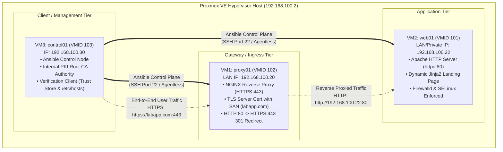

---
tags:
  - ansible
  - airnav-das
  - phase-3
  - master-runbook
  - zero-to-hero
  - sysadmin
  - devops
reading-order: 0
author: Hans Oliverio (Trainee Systems Engineer)
created: 2026-09-24
updated: 2026-09-24
---

# Phase 3: Deployment Automation — Complete End-to-End Master Runbook
## Zero-to-Hero Guide: From VM Provisioning to Automated Launch

> [!abstract] Executive Mission Brief
> This master runbook is your definitive, step-by-step, hand-holding guide to completing **Phase 3: Deployment Automation (AIR-DAS Onboarding)**.
> 
> In this phase, we rebuild the System Discovery Platform using **Ansible** on a clean, dedicated 3-VM architecture hosted on Proxmox VE:
> - **VM3 (`control01`)**: Dedicated Ansible Control Node & Verification Client.
> - **VM1 (`proxy01`)**: NGINX Reverse Proxy Gateway with HTTPS TLS Termination.
> - **VM2 (`web01`)**: Apache HTTP Server Backend serving a dynamic Jinja2 webpage.
> 
> This guide takes you from preserving your existing Phase 2 configs, resetting/re-provisioning the VMs on Proxmox VE, setting up the SSH control plane on VM3, building the project repository and roles, automating the internal PKI, and proving **idempotency** and **drift correction** with one single master playbook (`site.yml`).

> [!info] Official Standards & Authority References
> - **Ansible Core Documentation**: [docs.ansible.com/ansible/latest/](https://docs.ansible.com/ansible/latest/)
> - **Proxmox VE 8.x Administration Guide**: [pve.proxmox.com/pve-docs/](https://pve.proxmox.com/pve-docs/)
> - **Red Hat Enterprise Linux 9 / AlmaLinux 9 System Administrator's Guide**: [access.redhat.com/documentation/en-us/red_hat_enterprise_linux/9](https://access.redhat.com/documentation/en-us/red_hat_enterprise_linux/9)
> - **IETF RFC 5280 (X.509 PKI & Certificate Profile)**: [datatracker.ietf.org/doc/html/rfc5280](https://datatracker.ietf.org/doc/html/rfc5280)
> - **CA/Browser Forum Baseline Requirements (2026)**: [cabforum.org/baseline-requirements/](https://cabforum.org/baseline-requirements/)

---

## 0 · Target Architecture & IP Assignment Matrix



### Complete Node Identity Matrix

| Hostname | VMID | Role in Phase 3 | IP Address | Subnet / Gateway | vCPU / RAM / Disk |
|---|:---:|---|---|---|:---:|
| `control01` | **103** | Ansible Control Node & Client | `192.168.100.30/24` | GW: `192.168.100.1` | 2 vCPU / 2048 MB / 20 GB |
| `proxy01` | **102** | NGINX Reverse Proxy Gateway | `192.168.100.20/24` | GW: `192.168.100.1` | 2 vCPU / 1536 MB / 15 GB |
| `web01` | **101** | Backend Apache Web Server | `192.168.100.22/24` | GW: `192.168.100.1` | 2 vCPU / 1536 MB / 15 GB |
| `pve` | Host | Proxmox VE Hypervisor | `192.168.100.2/24` | GW: `192.168.100.1` | Physical Server |
| `laptop` | Host | Management Laptop | `192.168.100.10/24` | GW: `192.168.100.1` | Local Machine |

---

## 1 · Step 0: Preserving Your Phase 2 Environment & Proxmox Snapshots

> [!important] Good News: Your Proxmox Snapshots Are Already Safe!
> We inspected your Proxmox VE host (`192.168.100.2`) and verified that every single one of your Phase 2 virtual machines already has a clean, active snapshot named **`finishedHA-preAutomation`** recorded on **2026-09-24 01:41**:
> - **VM 100 (`db`)**: `finishedHA-preAutomation`
> - **VM 101 (`app`)**: `finishedHA-preAutomation`
> - **VM 102 (`proxy`)**: `finishedHA-preAutomation`
> - **VM 103 (`proxy02`)**: `finishedHA-preAutomation`
>
> If anything ever goes wrong, you can instantly restore any VM to its exact Phase 2 state in seconds with:
> ```bash
> # Run on Proxmox host (192.168.100.2):
> qm rollback 102 finishedHA-preAutomation
> ```

---

### 1.1 Why the `scp: /tmp/proxy01-configs.tar.gz: No such file or directory` Error Happened
When you ran the multi-line SSH script, your terminal asked:
`root@192.168.100.20's password:`
Because passwordless SSH keys were not yet installed from your laptop to `proxy01` and `proxy02`, running multiple chained commands (`ssh` -> `scp` -> `ssh`) interrupted the input stream. The `scp` command fired before the remote `tar` command finished creating `/tmp/proxy01-configs.tar.gz`.

---

### 1.2 Exporting Full Standalone VM Backups from Proxmox VE (`vzdump`)
Instead of wrestling with per-file SSH copy commands, you can export complete, standalone **Proxmox Virtual Machine Archive (`.vma.zst`)** backups directly from the hypervisor.

Run this single command on your **laptop** (which already has passwordless SSH to Proxmox):

```bash
# 1. Trigger Proxmox native live snapshot backup for all 4 VMs to local storage:
# (vzdump creates a consistent live snapshot without turning off the VMs)
ssh root@192.168.100.2 "vzdump 100 101 102 103 --mode snapshot --compress zstd --storage local"

# 2. View the generated backup archives on Proxmox:
ssh root@192.168.100.2 "ls -lh /var/lib/vz/dump/"

# 3. (Optional) Download the full backup images from Proxmox directly to your laptop:
mkdir -p ~/proxmox-phase2-backups
scp root@192.168.100.2:/var/lib/vz/dump/vzdump-qemu-*.vma.zst ~/proxmox-phase2-backups/
echo "✅ Complete Proxmox VM backups are now safely stored on your laptop in ~/proxmox-phase2-backups/"
```

---

### 1.3 Exporting Text Configurations Cleanly (One-Liner Method)
If you also want the raw text configs (`/etc/nginx`, `/etc/keepalived`) without interactive prompts, run this clean one-liner from your laptop:

```bash
# Set up passwordless SSH to proxy01 first so scp never fails:
ssh-copy-id root@192.168.100.20
ssh-copy-id root@192.168.100.21

# Now extract configs reliably:
mkdir -p ~/phase2-preservation/{proxy01,proxy02}
ssh root@192.168.100.20 "tar -czf - /etc/nginx /etc/keepalived /etc/hosts 2>/dev/null" > ~/phase2-preservation/proxy01/proxy01-configs.tar.gz
ssh root@192.168.100.21 "tar -czf - /etc/keepalived /etc/hosts 2>/dev/null" > ~/phase2-preservation/proxy02/proxy02-configs.tar.gz

# Extract locally:
cd ~/phase2-preservation/proxy01 && tar -xzf proxy01-configs.tar.gz
cd ~/phase2-preservation/proxy02 && tar -xzf proxy02-configs.tar.gz
echo "✅ Text configuration harvest complete!"
```
echo "=========================================================="
ls -lh ~/phase2-complete-backup-$(date +%Y%m%d).tar.gz
```

---

## 2 · Step 1: Decommissioning Old VMs & Provisioning the 3 Fresh VMs on Proxmox

We will now prepare our 3 target virtual machines on the Proxmox VE host (`192.168.100.2`).

### Option A: Clean Reset via Snapshots (Fastest & Safest)
Since your existing VMs already have the `finishedHA-preAutomation` snapshot created on Proxmox, you can quickly roll them back to a clean state or reconfigure them.

### Option B: Fresh VM Provisioning via Proxmox CLI (Recommended for Clean Room)
Log into the Proxmox VE host (`ssh root@192.168.100.2`) to stop old VMs and provision fresh, clean machines:

```bash
# -------------------------------------------------------------
# 1. Stop existing Phase 2 VMs safely on Proxmox VE:
# -------------------------------------------------------------
qm stop 100 2>/dev/null || true   # db
qm stop 101 2>/dev/null || true   # app
qm stop 102 2>/dev/null || true   # proxy
qm stop 103 2>/dev/null || true   # proxy02

# -------------------------------------------------------------
# 2. Decommission VM 100 (Database) and VM 103 (Proxy02):
# (Not required in Phase 3 per Sir Jayrose's scope boundary)
# If you wish to preserve their disk images, do not destroy them;
# simply keep them powered off.
# -------------------------------------------------------------

# -------------------------------------------------------------
# 3. Create VM 103: control01 (Ansible Control Node & Client VM)
# -------------------------------------------------------------
# Creates a new VM with 2 vCPUs, 2048MB RAM, attached to vmbr0 (LAN):
qm create 103 \
  --name control01 \
  --memory 2048 \
  --cores 2 \
  --cpu x86-64-v2-AES \
  --net0 virtio,bridge=vmbr0,firewall=1 \
  --scsihw virtio-scsi-single \
  --sata0 local-lvm:20 \
  --boot order=sata0;ide2;net0 \
  --ide2 local:iso/AlmaLinux-9-latest-x86_64-minimal.iso,media=cdrom \
  --ostype l26

# Start VM 103 and install AlmaLinux 9 minimal (or clone from clean template):
qm start 103
```

---

## 3 · Step 2: Configuring Network & Host Identities on the 3 VMs

Log into each VM's console or SSH session to configure standard hostnames and static IPs:

### On VM3: `control01` (`192.168.100.30`)
```bash
# 1. Set hostname:
hostnamectl set-hostname control01

# 2. Configure static IP address on primary network interface (ens18):
nmcli con mod ens18 ipv4.addresses 192.168.100.30/24
nmcli con mod ens18 ipv4.gateway 192.168.100.1
nmcli con mod ens18 ipv4.dns "192.168.100.1,8.8.8.8"
nmcli con mod ens18 ipv4.method manual
nmcli con mod ens18 connection.autoconnect yes
nmcli con up ens18

# 3. Populate /etc/hosts for easy internal resolution:
cat << 'EOF' > /etc/hosts
127.0.0.1   localhost localhost.localdomain
::1         localhost localhost.localdomain
192.168.100.30 control01
192.168.100.20 proxy01
192.168.100.22 web01
192.168.100.2  pve
192.168.100.10 laptop
EOF
```

### On VM1: `proxy01` (`192.168.100.20`)
```bash
# 1. Set hostname:
hostnamectl set-hostname proxy01

# 2. Configure static IP on ens18:
nmcli con mod ens18 ipv4.addresses 192.168.100.20/24
nmcli con mod ens18 ipv4.gateway 192.168.100.1
nmcli con mod ens18 ipv4.dns "192.168.100.1,8.8.8.8"
nmcli con mod ens18 ipv4.method manual
nmcli con mod ens18 connection.autoconnect yes
nmcli con up ens18

# 3. Clean up any leftover manual Keepalived or VIP bindings:
systemctl stop keepalived 2>/dev/null || true
systemctl disable keepalived 2>/dev/null || true
systemctl stop nginx 2>/dev/null || true

# 4. Populate /etc/hosts:
cat << 'EOF' > /etc/hosts
127.0.0.1   localhost localhost.localdomain
::1         localhost localhost.localdomain
192.168.100.30 control01
192.168.100.20 proxy01
192.168.100.22 web01
EOF
```

### On VM2: `web01` (`192.168.100.22`)
```bash
# 1. Set hostname:
hostnamectl set-hostname web01

# 2. Configure static IP on ens18:
nmcli con mod ens18 ipv4.addresses 192.168.100.22/24
nmcli con mod ens18 ipv4.gateway 192.168.100.1
nmcli con mod ens18 ipv4.dns "192.168.100.1,8.8.8.8"
nmcli con mod ens18 ipv4.method manual
nmcli con mod ens18 connection.autoconnect yes
nmcli con up ens18

# 3. Clean up any old Apache or backend services:
systemctl stop httpd 2>/dev/null || true
systemctl disable httpd 2>/dev/null || true
rm -rf /var/www/html/*

# 4. Populate /etc/hosts:
cat << 'EOF' > /etc/hosts
127.0.0.1   localhost localhost.localdomain
::1         localhost localhost.localdomain
192.168.100.30 control01
192.168.100.20 proxy01
192.168.100.22 web01
EOF
```

---

## 4 · Step 3: Setting Up the Ansible Control Plane on VM3 (`control01`)

From this point forward, **all automation operations are executed directly on `control01` (`192.168.100.30`)**.

### 4.1 Install Ansible Core and Dependencies
Log into `control01` as `root` (or regular user with sudo):

```bash
# 1. Update system package repository metadata:
dnf check-update || true

# 2. Install EPEL (Extra Packages for Enterprise Linux):
dnf install -y epel-release

# 3. Install Ansible Core, Python 3, OpenSSL, and Git:
dnf install -y ansible-core python3-pip git openssl curl

# 4. Verify Ansible version:
ansible --version
# Output should confirm: ansible [core 2.15+] with Python 3.9+
```

---

### 4.2 Generate & Distribute Ed25519 SSH Keys
Ansible is completely **agentless**: it uses OpenSSH to push and execute ephemeral Python modules.

```bash
# 1. Generate an Ed25519 keypair on control01:
# (-N "" ensures passwordless authentication for uninterrupted automation)
ssh-keygen -t ed25519 -C "ansible-control01" -f ~/.ssh/id_ed25519 -N ""

# 2. Copy the public key to proxy01 (VM1):
ssh-copy-id -i ~/.ssh/id_ed25519.pub root@192.168.100.20

# 3. Copy the public key to web01 (VM2):
ssh-copy-id -i ~/.ssh/id_ed25519.pub root@192.168.100.22

# 4. Authorize the key locally on control01 (VM3) for client tasks:
cat ~/.ssh/id_ed25519.pub >> ~/.ssh/authorized_keys
chmod 600 ~/.ssh/authorized_keys

# 5. Test passwordless SSH connectivity across all nodes:
ssh -o BatchMode=yes root@192.168.100.20 "echo '[OK] proxy01 SSH connection verified'"
ssh -o BatchMode=yes root@192.168.100.22 "echo '[OK] web01 SSH connection verified'"
ssh -o BatchMode=yes root@127.0.0.1 "echo '[OK] localhost SSH connection verified'"
```

---

## 5 · Step 4: Milestone 1 — Project Hangar Scaffold

Now, create the clean, enterprise-grade Ansible repository structure on `control01`.

```bash
# 1. Create project root directory:
mkdir -p ~/ansible-platform
cd ~/ansible-platform

# 2. Create the standard directory tree:
mkdir -p inventory
mkdir -p group_vars
mkdir -p host_vars
mkdir -p roles/{apache_web,nginx_proxy,pki_trust,client_zone}
mkdir -p roles/apache_web/{defaults,tasks,templates,handlers}
mkdir -p roles/nginx_proxy/{defaults,tasks,templates,handlers}
mkdir -p roles/pki_trust/{defaults,tasks,templates,handlers}
mkdir -p roles/client_zone/{defaults,tasks,templates,handlers}
mkdir -p pki_artifacts
```

---

### 5.1 Crafting Project-Level `ansible.cfg`
Create `~/ansible-platform/ansible.cfg`:

```ini
# ~/ansible-platform/ansible.cfg
# Project-level configuration file

[defaults]
# Default inventory path:
inventory = ./inventory/hosts.ini

# Path to search for roles:
roles_path = ./roles

# Default remote SSH user:
remote_user = root

# Number of parallel processes to spawn:
forks = 5

# Suppress SSH host key verification warnings in lab environment:
host_key_checking = False

# Display output in formatted, human-readable YAML:
stdout_callback = yaml

# Disable generation of .retry files on failure:
retry_files_enabled = False

[privilege_escalation]
# Automatically escalate privileges to root via sudo:
become = True
become_method = sudo
become_user = root
become_ask_pass = False
```

---

### 5.2 Creating the Inventory (`inventory/hosts.ini`)
Create `~/ansible-platform/inventory/hosts.ini`:

```ini
# ~/ansible-platform/inventory/hosts.ini
# Defines host aliases, IPs, connection parameters, and tier groups

[proxy]
proxy01 ansible_host=192.168.100.20 ansible_user=root

[webservers]
web01   ansible_host=192.168.100.22 ansible_user=root

[clients]
# control01 acts as the verification client host:
control01 ansible_host=127.0.0.1 ansible_connection=local

# Umbrella group containing all lab nodes:
[lab:children]
proxy
webservers
clients
```

---

### 5.3 Defining Variables (`group_vars/`)
A core requirement of Milestone 1 is separating common values from tier-specific settings.

#### Common Values (`group_vars/all.yml`):
```yaml
# ~/ansible-platform/group_vars/all.yml
---
# Applied across all hosts in the inventory:
domain_name: "labapp.com"
backend_port: 80
proxy_http_port: 80
proxy_https_port: 443

# Organization identity for certificates:
pki_org: "AirNav FCO Engineering"
pki_ou: "DAS Lab"
pki_country: "PH"
pki_state: "NCR"
pki_city: "Pasay"
```

#### Proxy Tier Values (`group_vars/proxy.yml`):
```yaml
# ~/ansible-platform/group_vars/proxy.yml
---
# Applied specifically to [proxy] hosts:
nginx_package_name: "nginx"
nginx_service_name: "nginx"
backend_server_ip: "192.168.100.22"

ssl_cert_dir: "/etc/pki/nginx"
ssl_cert_file: "{{ ssl_cert_dir }}/server.crt"
ssl_key_file: "{{ ssl_cert_dir }}/server.key"
ssl_ca_file: "{{ ssl_cert_dir }}/root-ca.crt"
```

#### Web Server Tier Values (`group_vars/webservers.yml`):
```yaml
# ~/ansible-platform/group_vars/webservers.yml
---
# Applied specifically to [webservers] hosts:
apache_package_name: "httpd"
apache_service_name: "httpd"
web_document_root: "/var/www/html"
webpage_title: "AirNav DAS - System Discovery Platform"
```

---

### 5.4 Validating Milestone 1 Connectivity
Execute these validation commands on `control01`:

```bash
cd ~/ansible-platform

# 1. Verify the inventory structure graphically:
ansible-inventory --graph
# Expected:
# @all:
#   |--@lab:
#   |  |--@clients:
#   |  |  |--control01
#   |  |--@proxy:
#   |  |  |--proxy01
#   |  |--@webservers:
#   |  |  |--web01

# 2. Run Ansible ping across all nodes:
ansible all -m ping
# Expected:
# proxy01   | SUCCESS => {"changed": false, "ping": "pong"}
# web01     | SUCCESS => {"changed": false, "ping": "pong"}
# control01 | SUCCESS => {"changed": false, "ping": "pong"}
```

---

## 6 · Step 5: Milestone 2 — Web Server Role (Apache on VM2)

### 6.1 Role Defaults (`roles/apache_web/defaults/main.yml`)
```yaml
# ~/ansible-platform/roles/apache_web/defaults/main.yml
---
apache_package: "{{ apache_package_name | default('httpd') }}"
apache_service: "{{ apache_service_name | default('httpd') }}"
apache_port: "{{ backend_port | default(80) }}"
document_root: "{{ web_document_root | default('/var/www/html') }}"
page_title: "{{ webpage_title | default('AirNav DAS System Discovery') }}"
```

---

### 6.2 Dynamic HTML Landing Page (`roles/apache_web/templates/index.html.j2`)
```html
<!-- ~/ansible-platform/roles/apache_web/templates/index.html.j2 -->
<!DOCTYPE html>
<html lang="en">
<head>
    <meta charset="UTF-8">
    <title>{{ page_title }}</title>
    <style>
        body { font-family: 'Segoe UI', Tahoma, Geneva, Verdana, sans-serif; background-color: #0b132b; color: #ffffff; text-align: center; padding-top: 60px; }
        .card { background-color: #1c2541; display: inline-block; padding: 40px; border-radius: 12px; box-shadow: 0 8px 32px rgba(0,0,0,0.5); border: 1px solid #3a506b; }
        h1 { color: #48cae4; margin: 0 0 10px 0; }
        h3 { color: #90e0ef; font-weight: normal; margin-top: 0; }
        table { margin: 25px auto 0 auto; text-align: left; border-collapse: collapse; }
        td { padding: 10px 18px; border-bottom: 1px solid #3a506b; font-size: 15px; }
        .badge { background-color: #5bc0be; color: #0b132b; padding: 6px 14px; border-radius: 6px; font-weight: bold; font-size: 13px; }
    </style>
</head>
<body>
    <div class="card">
        <h1>✈️ AIRNAV FCO ENGINEERING</h1>
        <h3>{{ page_title }}</h3>
        <span class="badge">DEPLOYED BY ANSIBLE AUTOMATION</span>

        <table>
            <tr><td><strong>Backend Host:</strong></td><td>{{ ansible_hostname }} ({{ ansible_default_ipv4.address }})</td></tr>
            <tr><td><strong>Operating System:</strong></td><td>{{ ansible_distribution }} {{ ansible_distribution_version }}</td></tr>
            <tr><td><strong>Backend Port:</strong></td><td>TCP {{ apache_port }}</td></tr>
            <tr><td><strong>Deployment Timestamp:</strong></td><td>{{ ansible_date_time.iso8601 }}</td></tr>
        </table>
    </div>
</body>
</html>
```

---

### 6.3 Port Configuration Template (`roles/apache_web/templates/ports.conf.j2`)
```apache
# ~/ansible-platform/roles/apache_web/templates/ports.conf.j2
# Managed by Ansible — roles/apache_web
Listen {{ apache_port }}
```

---

### 6.4 Tasks Definition (`roles/apache_web/tasks/main.yml`)
```yaml
# ~/ansible-platform/roles/apache_web/tasks/main.yml
---
- name: Install Apache HTTP Server package
  ansible.builtin.dnf:
    name: "{{ apache_package }}"
    state: present
  tags: [packages, apache]

- name: Configure Apache backend listening port
  ansible.builtin.template:
    src: ports.conf.j2
    dest: /etc/httpd/conf.d/00-ports.conf
    owner: root
    group: root
    mode: '0644'
  notify: Restart Apache
  tags: [config, apache]

- name: Deploy dynamic landing page from Jinja2 template
  ansible.builtin.template:
    src: index.html.j2
    dest: "{{ document_root }}/index.html"
    owner: root
    group: root
    mode: '0644'
  tags: [content, apache]

- name: Configure Firewalld to permit backend port traffic
  ansible.posix.firewalld:
    port: "{{ apache_port }}/tcp"
    permanent: true
    state: enabled
    immediate: true
  tags: [security, firewall]

- name: Configure SELinux to permit custom Apache listening port
  community.general.seport:
    ports: "{{ apache_port }}"
    proto: tcp
    setype: http_port_t
    state: present
  when: apache_port != 80 and apache_port != 443
  tags: [security, selinux]

- name: Ensure Apache service is enabled on boot and started
  ansible.builtin.service:
    name: "{{ apache_service }}"
    state: started
    enabled: true
  tags: [services, apache]

- name: Flush handlers to apply config changes immediately before verification
  ansible.builtin.meta: flush_handlers

- name: Verify Apache responds locally on backend port
  ansible.builtin.uri:
    url: "http://127.0.0.1:{{ apache_port }}"
    method: GET
    status_code: 200
    return_content: true
  register: local_http_check
  failed_when: "'AIRNAV FCO ENGINEERING' not in local_http_check.content"
  tags: [verification]

- name: Display backend verification evidence
  ansible.builtin.debug:
    msg: "SUCCESS: Apache backend verified locally on web01 port {{ apache_port }}. Status: {{ local_http_check.status }}"
  tags: [verification]
```

---

### 6.5 Handlers (`roles/apache_web/handlers/main.yml`)
```yaml
# ~/ansible-platform/roles/apache_web/handlers/main.yml
---
- name: Restart Apache
  ansible.builtin.service:
    name: "{{ apache_service }}"
    state: restarted
```

---

## 7 · Step 6: Milestone 3 — Proxy Gateway Role (NGINX on VM1)

### 7.1 Role Defaults (`roles/nginx_proxy/defaults/main.yml`)
```yaml
# ~/ansible-platform/roles/nginx_proxy/defaults/main.yml
---
nginx_package: "{{ nginx_package_name | default('nginx') }}"
nginx_service: "{{ nginx_service_name | default('nginx') }}"
fqdn: "{{ domain_name | default('labapp.com') }}"
proxy_port: "{{ proxy_http_port | default(80) }}"
upstream_host: "{{ backend_server_ip | default('192.168.100.22') }}"
upstream_port: "{{ backend_port | default(80) }}"
```

---

### 7.2 Reverse Proxy Template (`roles/nginx_proxy/templates/reverse_proxy.conf.j2`)
```nginx
# ~/ansible-platform/roles/nginx_proxy/templates/reverse_proxy.conf.j2
# Managed by Ansible — roles/nginx_proxy
# Host: {{ inventory_hostname }} | Generated: {{ ansible_date_time.iso8601 }}

upstream backend_servers {
    server {{ upstream_host }}:{{ upstream_port }};
    keepalive 32;
}

server {
    listen {{ proxy_port }};
    listen [::]:{{ proxy_port }};
    server_name {{ fqdn }};

    access_log /var/log/nginx/reverse_proxy_access.log combined;
    error_log /var/log/nginx/reverse_proxy_error.log warn;

    location / {
        proxy_pass http://backend_servers;

        # Standard Forwarding Headers:
        proxy_set_header Host $host;
        proxy_set_header X-Real-IP $remote_addr;
        proxy_set_header X-Forwarded-For $proxy_add_x_forwarded_for;
        proxy_set_header X-Forwarded-Proto $scheme;

        proxy_http_version 1.1;
        proxy_set_header Connection "";
    }
}
```

---

### 7.3 Tasks Definition (`roles/nginx_proxy/tasks/main.yml`)
```yaml
# ~/ansible-platform/roles/nginx_proxy/tasks/main.yml
---
- name: Install NGINX reverse proxy package
  ansible.builtin.dnf:
    name: "{{ nginx_package }}"
    state: present
  tags: [packages, nginx]

- name: Remove default Welcome configuration if present
  ansible.builtin.file:
    path: /etc/nginx/conf.d/default.conf
    state: absent
  notify: Reload NGINX
  tags: [config, nginx]

- name: Deploy reverse proxy configuration with pre-flight syntax validation
  ansible.builtin.template:
    src: reverse_proxy.conf.j2
    dest: /etc/nginx/conf.d/reverse_proxy.conf
    owner: root
    group: root
    mode: '0644'
    # Validates syntax on remote host before overwriting live config:
    validate: 'nginx -t -c /etc/nginx/nginx.conf'
  notify: Reload NGINX
  tags: [config, nginx]

- name: Configure SELinux boolean to permit NGINX to proxy network connections
  ansible.posix.seboolean:
    name: httpd_can_network_connect
    state: true
    persistent: true
  tags: [security, selinux]

- name: Configure Firewalld to permit incoming HTTP traffic
  ansible.posix.firewalld:
    port: "{{ proxy_port }}/tcp"
    permanent: true
    state: enabled
    immediate: true
  tags: [security, firewall]

- name: Ensure NGINX service is enabled on boot and started
  ansible.builtin.service:
    name: "{{ nginx_service }}"
    state: started
    enabled: true
  tags: [services, nginx]

- name: Flush handlers to reload NGINX before running verification check
  ansible.builtin.meta: flush_handlers

- name: Verify proxy-to-backend communication path
  ansible.builtin.uri:
    url: "http://127.0.0.1:{{ proxy_port }}"
    headers:
      Host: "{{ fqdn }}"
    method: GET
    status_code: 200
    return_content: true
  register: proxy_check
  failed_when: "'AIRNAV FCO ENGINEERING' not in proxy_check.content"
  tags: [verification]

- name: Display proxy verification evidence
  ansible.builtin.debug:
    msg: "SUCCESS: NGINX successfully proxied request to Apache. Status: {{ proxy_check.status }}"
  tags: [verification]
```

---

### 7.4 Handlers (`roles/nginx_proxy/handlers/main.yml`)
```yaml
# ~/ansible-platform/roles/nginx_proxy/handlers/main.yml
---
- name: Reload NGINX
  ansible.builtin.service:
    name: "{{ nginx_service }}"
    state: reloaded

- name: Restart NGINX
  ansible.builtin.service:
    name: "{{ nginx_service }}"
    state: restarted
```

---

## 8 · Step 7: Milestone 4 — Trust (Automated Internal PKI & HTTPS)

In this milestone, `control01` acts as the Certificate Authority (CA). The Root CA private key is kept strictly isolated on `control01`.

### 8.1 Role Defaults (`roles/pki_trust/defaults/main.yml`)
```yaml
# ~/ansible-platform/roles/pki_trust/defaults/main.yml
---
pki_dir: "{{ playbook_dir }}/pki_artifacts"
ca_key_name: "root-ca.key"
ca_crt_name: "root-ca.crt"
ca_subject: "/C={{ pki_country | default('PH') }}/ST={{ pki_state | default('NCR') }}/L={{ pki_city | default('Pasay') }}/O={{ pki_org | default('AirNav FCO Engineering') }}/OU={{ pki_ou | default('DAS Lab') }}/CN=AirNav DAS Root CA"

server_cert_fqdn: "{{ domain_name | default('labapp.com') }}"
server_subject: "/C={{ pki_country | default('PH') }}/ST={{ pki_state | default('NCR') }}/L={{ pki_city | default('Pasay') }}/O={{ pki_org | default('AirNav FCO Engineering') }}/OU={{ pki_ou | default('DAS Lab') }}/CN={{ server_cert_fqdn }}"

remote_cert_directory: "{{ ssl_cert_dir | default('/etc/pki/nginx') }}"
remote_cert_path: "{{ ssl_cert_file | default('/etc/pki/nginx/server.crt') }}"
remote_key_path: "{{ ssl_key_file | default('/etc/pki/nginx/server.key') }}"
remote_ca_path: "{{ ssl_ca_file | default('/etc/pki/nginx/root-ca.crt') }}"
```

---

### 8.2 Modern OpenSSL SAN Extension Template (`roles/pki_trust/templates/server_ext.cnf.j2`)
```ini
# ~/ansible-platform/roles/pki_trust/templates/server_ext.cnf.j2
basicConstraints = critical, CA:FALSE
keyUsage = critical, digitalSignature, keyEncipherment
extendedKeyUsage = serverAuth
subjectKeyIdentifier = hash
authorityKeyIdentifier = keyid,issuer

# Modern RFC 5280 & CA/B Forum Subject Alternative Names:
subjectAltName = @alt_names

[alt_names]
DNS.1 = {{ server_cert_fqdn }}
DNS.2 = *.{{ server_cert_fqdn }}
IP.1 = {{ hostvars['proxy01']['ansible_host'] | default('192.168.100.20') }}
IP.2 = 127.0.0.1
```

---

### 8.3 Tasks Definition (`roles/pki_trust/tasks/main.yml`)
```yaml
# ~/ansible-platform/roles/pki_trust/tasks/main.yml
---
# =========================================================================
# 1. CONTROL NODE TASKS (CA Generation & Server Signing on control01)
# =========================================================================
- name: Ensure local PKI artifact directory exists on Control Node
  ansible.builtin.file:
    path: "{{ pki_dir }}"
    state: directory
    mode: '0700'
  delegate_to: localhost
  run_once: true
  tags: [pki, ca]

- name: Generate Root CA Private Key (4096-bit RSA)
  ansible.builtin.command: >
    openssl genrsa -out {{ pki_dir }}/{{ ca_key_name }} 4096
  args:
    creates: "{{ pki_dir }}/{{ ca_key_name }}"
  delegate_to: localhost
  run_once: true
  tags: [pki, ca]

- name: Generate Self-Signed Root CA Certificate (10-Year Validity)
  ansible.builtin.command: >
    openssl req -x509 -new -nodes
    -key {{ pki_dir }}/{{ ca_key_name }}
    -sha256 -days 3650
    -out {{ pki_dir }}/{{ ca_crt_name }}
    -subj "{{ ca_subject }}"
  args:
    creates: "{{ pki_dir }}/{{ ca_crt_name }}"
  delegate_to: localhost
  run_once: true
  tags: [pki, ca]

- name: Generate Server Private Key for NGINX (2048-bit RSA)
  ansible.builtin.command: >
    openssl genrsa -out {{ pki_dir }}/server.key 2048
  args:
    creates: "{{ pki_dir }}/server.key"
  delegate_to: localhost
  run_once: true
  tags: [pki, server_cert]

- name: Generate Server Certificate Signing Request (CSR)
  ansible.builtin.command: >
    openssl req -new
    -key {{ pki_dir }}/server.key
    -out {{ pki_dir }}/server.csr
    -subj "{{ server_subject }}"
  args:
    creates: "{{ pki_dir }}/server.csr"
  delegate_to: localhost
  run_once: true
  tags: [pki, server_cert]

- name: Render OpenSSL SAN extension configuration
  ansible.builtin.template:
    src: server_ext.cnf.j2
    dest: "{{ pki_dir }}/server_ext.cnf"
    mode: '0600'
  delegate_to: localhost
  run_once: true
  tags: [pki, server_cert]

- name: Sign Server CSR using Root CA with modern SAN extensions
  ansible.builtin.command: >
    openssl x509 -req
    -in {{ pki_dir }}/server.csr
    -CA {{ pki_dir }}/{{ ca_crt_name }}
    -CAkey {{ pki_dir }}/{{ ca_key_name }}
    -CAcreateserial
    -out {{ pki_dir }}/server.crt
    -days 365
    -sha256
    -extfile {{ pki_dir }}/server_ext.cnf
  args:
    creates: "{{ pki_dir }}/server.crt"
  delegate_to: localhost
  run_once: true
  tags: [pki, server_cert]

# =========================================================================
# 2. TARGET PROXY NODE TASKS (Deploy to proxy01 with Hardened Permissions)
# =========================================================================
- name: Ensure target certificate directory exists on NGINX host
  ansible.builtin.file:
    path: "{{ remote_cert_directory }}"
    state: directory
    owner: root
    group: root
    mode: '0755'
  tags: [deploy, nginx]

- name: Deploy Server Certificate to NGINX
  ansible.builtin.copy:
    src: "{{ pki_dir }}/server.crt"
    dest: "{{ remote_cert_path }}"
    owner: root
    group: root
    mode: '0644'
  notify: Reload NGINX
  tags: [deploy, nginx]

- name: Deploy Server Private Key with strict 0600 permissions
  ansible.builtin.copy:
    src: "{{ pki_dir }}/server.key"
    dest: "{{ remote_key_path }}"
    owner: root
    group: root
    mode: '0600'
  notify: Reload NGINX
  tags: [deploy, nginx]

- name: Deploy Root CA public certificate to NGINX node
  ansible.builtin.copy:
    src: "{{ pki_dir }}/{{ ca_crt_name }}"
    dest: "{{ remote_ca_path }}"
    owner: root
    group: root
    mode: '0644'
  tags: [deploy, nginx]

# =========================================================================
# 3. VERIFICATION TASKS (Cryptographic Proof)
# =========================================================================
- name: Verify server certificate Subject Alternative Names (SAN)
  ansible.builtin.command: >
    openssl x509 -in {{ remote_cert_path }} -text -noout
  register: cert_inspection
  changed_when: false
  tags: [verification]

- name: Assert SAN contains required FQDN and IP
  ansible.builtin.assert:
    that:
      - "'DNS:labapp.com' in cert_inspection.stdout"
      - "'IP Address:192.168.100.20' in cert_inspection.stdout"
    fail_msg: "SECURITY FAILURE: Server certificate missing required SAN extensions!"
    success_msg: "VERIFIED: Server certificate SAN correctly matches FQDN and IP."
  tags: [verification]

- name: Verify certificate chain of trust against Root CA
  ansible.builtin.command: >
    openssl verify -CAfile {{ remote_ca_path }} {{ remote_cert_path }}
  register: chain_verify
  changed_when: false
  failed_when: "'OK' not in chain_verify.stdout"
  tags: [verification]

- name: Display cryptographic verification evidence
  ansible.builtin.debug:
    msg: "CHAIN VERIFICATION RESULT: {{ chain_verify.stdout }}"
  tags: [verification]
```

---

### 8.4 Upgrade NGINX Template for HTTPS (`roles/nginx_proxy/templates/reverse_proxy.conf.j2`)
Update `roles/nginx_proxy/templates/reverse_proxy.conf.j2` to terminate HTTPS on port 443 and redirect HTTP on port 80:

```nginx
# ~/ansible-platform/roles/nginx_proxy/templates/reverse_proxy.conf.j2
# Managed by Ansible — roles/nginx_proxy + roles/pki_trust

upstream backend_servers {
    server {{ upstream_host }}:{{ upstream_port }};
    keepalive 32;
}

# 1. HTTP Server Block — Permanent 301 Redirect to HTTPS:
server {
    listen {{ proxy_port }};
    listen [::]:{{ proxy_port }};
    server_name {{ fqdn }};

    location / {
        return 301 https://$host$request_uri;
    }
}

# 2. HTTPS Server Block — TLS Termination & Reverse Proxy:
server {
    listen {{ proxy_https_port | default(443) }} ssl http2;
    listen [::]:{{ proxy_https_port | default(443) }} ssl http2;
    server_name {{ fqdn }};

    ssl_certificate {{ ssl_cert_file }};
    ssl_certificate_key {{ ssl_key_file }};

    ssl_protocols TLSv1.2 TLSv1.3;
    ssl_ciphers HIGH:!aNULL:!MD5:!3DES;
    ssl_prefer_server_ciphers on;
    ssl_session_cache shared:SSL:10m;
    ssl_session_timeout 10m;

    access_log /var/log/nginx/https_access.log combined;
    error_log /var/log/nginx/https_error.log warn;

    location / {
        proxy_pass http://backend_servers;

        proxy_set_header Host $host;
        proxy_set_header X-Real-IP $remote_addr;
        proxy_set_header X-Forwarded-For $proxy_add_x_forwarded_for;
        proxy_set_header X-Forwarded-Proto https;

        proxy_http_version 1.1;
        proxy_set_header Connection "";
    }
}
```

In `roles/nginx_proxy/tasks/main.yml`, add firewalld port 443:
```yaml
- name: Configure Firewalld to permit incoming HTTPS traffic
  ansible.posix.firewalld:
    port: "{{ proxy_https_port | default(443) }}/tcp"
    permanent: true
    state: enabled
    immediate: true
  tags: [security, firewall]
```

---

## 9 · Step 8: Milestone 5 — Client Landing Zone (Client on VM3)

### 9.1 Role Defaults (`roles/client_zone/defaults/main.yml`)
```yaml
# ~/ansible-platform/roles/client_zone/defaults/main.yml
---
client_fqdn: "{{ domain_name | default('labapp.com') }}"
client_proxy_target_ip: "{{ hostvars['proxy01']['ansible_host'] | default('192.168.100.20') }}"
pki_root_ca_source: "{{ playbook_dir }}/pki_artifacts/root-ca.crt"
system_ca_anchors_dir: "/etc/pki/ca-trust/source/anchors"
installed_ca_name: "airnav-das-root-ca.crt"
```

---

### 9.2 Tasks Definition (`roles/client_zone/tasks/main.yml`)
```yaml
# ~/ansible-platform/roles/client_zone/tasks/main.yml
---
- name: Manage FQDN mapping in /etc/hosts preserving existing entries
  ansible.builtin.lineinfile:
    path: /etc/hosts
    regexp: '^[0-9.]+\s+.*\b{{ client_fqdn | regex_escape }}\b.*'
    line: "{{ client_proxy_target_ip }} {{ client_fqdn }}"
    state: present
    backup: true
  tags: [hosts, dns]

- name: Copy Root CA certificate to OS system trust anchor directory
  ansible.builtin.copy:
    src: "{{ pki_root_ca_source }}"
    dest: "{{ system_ca_anchors_dir }}/{{ installed_ca_name }}"
    owner: root
    group: root
    mode: '0644'
  notify: Update System CA Trust
  tags: [trust, pki]

- name: Flush handlers immediately to update system trust store
  ansible.builtin.meta: flush_handlers

- name: Verify hostname resolution for target FQDN
  ansible.builtin.command: >
    getent hosts {{ client_fqdn }}
  register: dns_check
  changed_when: false
  tags: [verification]

- name: Display DNS resolution evidence
  ansible.builtin.debug:
    msg: "DNS RESOLUTION OK: {{ dns_check.stdout }}"
  tags: [verification]

- name: Execute end-to-end trusted HTTPS verification request
  ansible.builtin.uri:
    url: "https://{{ client_fqdn }}"
    method: GET
    # STRICT SECURITY: Proves system trust store natively validates internal CA:
    validate_certs: true
    status_code: 200
    return_content: true
  register: e2e_https_check
  failed_when: "'AIRNAV FCO ENGINEERING' not in e2e_https_check.content"
  tags: [verification]

- name: Display end-to-end verification success evidence
  ansible.builtin.debug:
    msg: >
      END-TO-END SUCCESS:
      Client reached https://{{ client_fqdn }} through NGINX to Apache!
      HTTP Status: {{ e2e_https_check.status }}
  tags: [verification]
```

---

### 9.3 Handlers (`roles/client_zone/handlers/main.yml`)
```yaml
# ~/ansible-platform/roles/client_zone/handlers/main.yml
---
- name: Update System CA Trust
  ansible.builtin.command: >
    update-ca-trust extract
  changed_when: true
```

---

## 10 · Step 9: Milestone 6 & Automated Launch — Master Playbook

Create the master orchestration playbook `~/ansible-platform/site.yml`:

```yaml
# ~/ansible-platform/site.yml
---
# =============================================================================
# AIRNAV DAS — SYSTEM DISCOVERY PLATFORM MASTER PLAYBOOK
# Author: Hans Oliverio
# =============================================================================

- name: "Phase 1: Control Plane Initialization & Internal PKI Authority"
  hosts: localhost
  connection: local
  gather_facts: false
  tasks:
    - name: Announce deployment initialization
      ansible.builtin.debug:
        msg:
          - "=========================================================="
          - "✈️  AIRNAV DAS PLATFORM AUTOMATED LAUNCH IN PROGRESS"
          - "Target FQDN : {{ domain_name | default('labapp.com') }}"
          - "Timestamp   : {{ lookup('pipe', 'date -Iseconds') }}"
          - "=========================================================="

- name: "Phase 2: Deploy Backend Web Server Tier (Apache)"
  hosts: webservers
  become: true
  roles:
    - apache_web

- name: "Phase 3: Deploy Gateway Tier (PKI Trust & NGINX Reverse Proxy)"
  hosts: proxy
  become: true
  roles:
    - pki_trust
    - nginx_proxy

- name: "Phase 4: Client Landing Zone & System Verification"
  hosts: clients
  become: true
  roles:
    - client_zone

  post_tasks:
    - name: Final deployment summary
      ansible.builtin.debug:
        msg:
          - "=========================================================="
          - "✅  PLATFORM DEPLOYMENT & VERIFICATION COMPLETE!"
          - "All services are active, hardened, and securely accessible."
          - "Visit: https://{{ domain_name | default('labapp.com') }}"
          - "=========================================================="
      run_once: true
...
```

---

## 11 · Step 10: Running the Automation & Proving Idempotency

### Run 1: Initial Automated Launch
Run the master playbook from `control01`:

```bash
cd ~/ansible-platform
ansible-playbook site.yml
```
> [!tip] Verification Evidence 1: Initial Convergence
> In this run, Ansible configures everything from zero. Observe that `changed > 0` across all hosts:
> ```
> PLAY RECAP **************************************************************************
> control01  : ok=10   changed=4    unreachable=0    failed=0
> proxy01    : ok=15   changed=9    unreachable=0    failed=0
> web01      : ok=8    changed=6    unreachable=0    failed=0
> ```

---

### Run 2: The Idempotency Test
Immediately re-run the exact same command:

```bash
ansible-playbook site.yml
```
> [!tip] Verification Evidence 2: Zero Unnecessary Changes
> Because the platform is already in the desired state, **Ansible reports `changed=0`**:
> ```
> PLAY RECAP **************************************************************************
> control01  : ok=10   changed=0    unreachable=0    failed=0
> proxy01    : ok=15   changed=0    unreachable=0    failed=0
> web01      : ok=8    changed=0    unreachable=0    failed=0
> ```
> Explain to the trainer: "This proves that our automation is fully idempotent. We can run this playbook repeatedly in production without causing service flapping or unexpected configuration changes."

---

### Run 3: Controlled Drift Simulation & Self-Healing
Demonstrate how Ansible automatically corrects unauthorized modifications:

```bash
# 1. Manually tamper with the webpage on web01:
ssh root@192.168.100.22 "echo '<h1>UNAUTHORIZED DRIFT / TAMPERED FILE</h1>' > /var/www/html/index.html"

# 2. View drift detection using Ansible diff mode:
ansible-playbook site.yml --check --diff

# 3. Restore desired state automatically:
ansible-playbook site.yml
```
> [!tip] Verification Evidence 3: Self-Healing Convergence
> Notice that **only `web01` reports `changed=1`**, while all other nodes report `changed=0`. Ansible corrected the drift and restored the authorized landing page!

---

## 12 · Trainer Defense Cheat Sheet (10 High-Yield Q&As)

> [!abstract] Rehearse These Answers for Sir Jayrose and Senior Engineers

1. **Q: Why create VM3 (`control01`) instead of using your personal laptop?**
   - *A:* Infrastructure segregation. Using a dedicated VM mimics production management bastions and CI/CD runners (like Jenkins or AWX), ensuring uniform Linux environments, independent SSH key management, and preventing laptop network disconnections from interrupting runs.
2. **Q: What is Idempotency, and how does Ansible guarantee it?**
   - *A:* Idempotency means executing an operation multiple times produces the exact same end state: $f(f(x)) = f(x)$. Ansible modules check current state (file checksums, package registries, systemd sockets) before acting. If current state matches desired state, it exits with `changed: false`.
3. **Q: Why keep the Root CA private key on VM3 (`control01`) rather than on NGINX (`proxy01`)?**
   - *A:* Security trust boundaries. The Root CA is the cryptographic root of trust for the entire organization. Public-facing gateways (like NGINX) are exposed to traffic and potential attacks. If NGINX were compromised, an attacker would steal the Root CA and issue forged certificates. Keeping the Root CA offline on the management control node upholds the principle of least privilege.
4. **Q: Why use `validate: 'nginx -t -c %s'` in the template task?**
   - *A:* It renders the Jinja2 template into a temporary staging file first and tests NGINX syntax before replacing the production file in `/etc/nginx/conf.d/`. If a template syntax error exists, the deployment safely fails without breaking active web services.
5. **Q: What does the SELinux boolean `httpd_can_network_connect` do?**
   - *A:* In RHEL/AlmaLinux Enforcing mode, the `httpd_t` security domain is forbidden from opening outbound TCP sockets by default. Enabling this boolean permits NGINX to proxy incoming traffic to backend application servers without disabling SELinux.
6. **Q: Why use `flush_handlers`?**
   - *A:* Handlers are normally queued until the very end of a play. When tasks need to test service endpoints immediately (such as our local `ansible.builtin.uri` verification check), `flush_handlers` forces pending reloads/restarts to execute right away.
7. **Q: Why is `lineinfile` with `regexp` used for `/etc/hosts`?**
   - *A:* It searches for existing lines containing `labapp.com` and updates them in place rather than blindly appending duplicate entries on every run, preserving all other unrelated host entries.
8. **Q: How does `curl` on VM3 validate the certificate without `--insecure` (`-k`)?**
   - *A:* We copied `root-ca.crt` into `/etc/pki/ca-trust/source/anchors/` and ran `update-ca-trust extract`. This merged our internal CA into the system-wide certificate bundle (`ca-bundle.crt`), establishing native operating system trust.
9. **Q: What is the purpose of modern Subject Alternative Names (SANs)?**
   - *A:* RFC 5280 and modern CA/Browser Forum rules deprecate relying on the Common Name (CN). Modern TLS clients (like curl and Chrome) require matching SAN entries (`DNS:labapp.com`, `IP:192.168.100.20`) to prevent domain impersonation.
10. **Q: How do you secure credentials and sensitive keys in enterprise Ansible?**
    - *A:* Using **Ansible Vault** (`ansible-vault`), which provides AES-256 encryption for variable files or playbooks, allowing safe storage in Git repositories.

---

## 13 · Official Project Requirements & Final Demonstration Checklist

> [!important] Official AIR-DAS Phase 3 Grading Rubric (Sir Jayrose / FCO Engineering)

### Core Project Requirements Audit
- [ ] **Single Master Playbook**: `site.yml` orchestrates the complete 3-tier platform end-to-end.
- [ ] **Three-VM Platform**: Configures `control01` (VM3), `proxy01` (VM1), and `web01` (VM2).
- [ ] **Declarative Ansible Modules**: Packages (`dnf`), templates (`template`), services (`service`), firewalls (`firewalld`), SELinux (`seport`/`seboolean`), and hosts (`lineinfile`).
- [ ] **Centralized Variables**: No hardcoded magic IPs, ports, or FQDNs; variables segregated into `group_vars/` and role defaults.
- [ ] **Event-Driven Handlers**: Services reload/restart only when configurations change; zero flapping.
- [ ] **Pre-Flight Validation**: `validate: 'nginx -t -c %s'` verifies NGINX templates before placing them in production.

### End-of-Week Automated Launch Checklist
During your technical evaluation with the engineering team, demonstrate the following items in order:
1. [ ] **Present the Blueprint**: Show the 3-VM architecture diagram (`VM3 -> VM1 -> VM2`) and explain inventory groupings.
2. [ ] **Code Walkthrough**: Explain `inventory/hosts.ini`, `group_vars/`, roles, templates, and `site.yml`.
3. [ ] **Automated Launch Execution**: Run `ansible-playbook site.yml` against clean VMs.
4. [ ] **Backend Web Server Verification**: Show Apache serving dynamic content locally on `web01`.
5. [ ] **Reverse Proxy Verification**: Show NGINX forwarding client requests to Apache.
6. [ ] **Internal PKI Inspection**: Show Root CA and server certificate created by the automation with modern SANs.
7. [ ] **Client Trust Verification**: Show Root CA installed in `/etc/pki/ca-trust/source/anchors/` on `control01`.
8. [ ] **Name Resolution Verification**: Show `labapp.com` resolving to NGINX IP via `/etc/hosts`.
9. [ ] **End-to-End HTTPS Access**: Connect via HTTPS (`curl -Iv https://labapp.com`) without certificate warnings.
10. [ ] **Repeatability & Idempotency Proof**: Run `ansible-playbook site.yml` a second time; prove `changed=0`.
11. [ ] **Controlled Drift Demonstration**: Tamper with `index.html`, run `ansible-playbook site.yml --diff`, and show Ansible restoring compliance.

### Completion Review Sign-Off Matrix

| Review Area | Completion Evidence Required | Verification Method | Status |
|---|---|---|:---:|
| **Ansible Foundation** | Learning summary and automation blueprint | Present blueprint diagram and role hierarchy | ⬜ Pending |
| **Project Structure** | Inventory, variables, master playbook, and README | Review `ansible.cfg`, `hosts.ini`, `site.yml` | ⬜ Pending |
| **Apache Automation** | Working webpage and backend verification | `curl http://192.168.100.22` returns dynamic HTML | ⬜ Pending |
| **NGINX Automation** | Working reverse proxy and managed configuration | `curl http://192.168.100.20` proxies to Apache | ⬜ Pending |
| **Internal PKI Automation** | Root CA and server certificate created & verified | `openssl verify -CAfile root-ca.crt server.crt` | ⬜ Pending |
| **Client Configuration** | FQDN mapping and Root CA available on client | `getent hosts labapp.com` & `trust list` | ⬜ Pending |
| **End-to-End Verification** | Trusted HTTPS access to the expected webpage | `curl -Iv https://labapp.com` (200 OK, TLS verify OK) | ⬜ Pending |
| **Repeatability** | Second run (`changed=0`) and drift correction | Run 2 recap comparison & `--diff` drift recovery | ⬜ Pending |
| **Final Demonstration** | Automated launch and technical explanation | Live defense interview with Sir Jayrose | ⬜ Pending |

