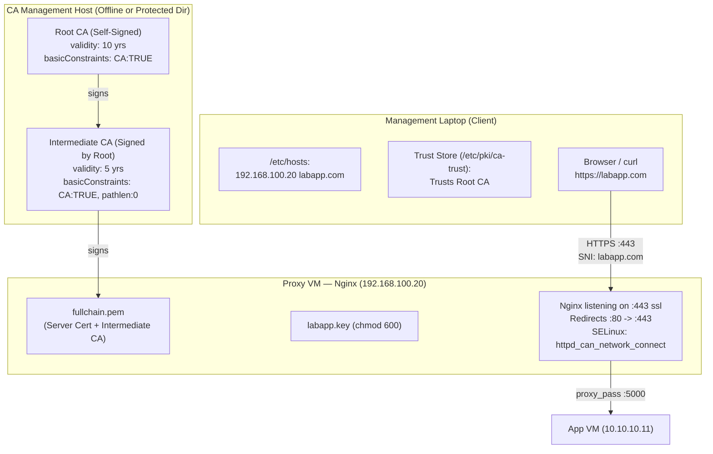

---
tags:
  - cybersecurity
  - pki
  - certificates
  - openssl
  - nginx
  - tls
  - hands-on
reading-order: 5
created: 2026-09-21
---

# Hands-On 2-Tier CA & Nginx TLS Implementation

> [!abstract] The 30-second version
> This note is the complete, reproducible operational runbook for establishing an enterprise **2-Tier Certificate Authority (Root CA + Intermediate CA)** using OpenSSL, generating a cryptographically signed TLS certificate for **`labapp.com`** (with SANs for both domain and IP), configuring **Nginx on AlmaLinux 9** for HTTPS on Port 443 with an HTTP-to-HTTPS redirect, setting up local DNS resolution via `/etc/hosts`, and installing the Root CA into the client OS and browser trust stores for a seamless, warning-free **green padlock**.

---

## 1 · Architecture & Topology for this Task



### IP & Domain Mapping
- **Domain Name**: `labapp.com` (and `*.labapp.com` wildcard)
- **Proxy VM IP**: `192.168.100.20` (LAN on `vmbr0`)
- **Protocol & Ports**:
  - `443/tcp`: HTTPS (TLS 1.2 & TLS 1.3)
  - `80/tcp`: HTTP (Automatic 301 Permanent Redirect to `https://labapp.com`)

---

## 2 · Phase 1: CA Directory Structure & OpenSSL Configs

We will build the CA workspace under `/root/ca` (or `~/ca`). OpenSSL requires a database index file and serial counter to track issued certificates.

### Step 1.1: Create Directory Layout
```bash
mkdir -p /root/ca/{root-ca,intermediate-ca}/{certs,crl,newcerts,private}
chmod 700 /root/ca/{root-ca,intermediate-ca}/private
touch /root/ca/root-ca/index.txt
touch /root/ca/intermediate-ca/index.txt
echo 1000 > /root/ca/root-ca/serial
echo 1000 > /root/ca/intermediate-ca/serial
```

### Step 1.2: Root CA Configuration (`/root/ca/root-ca/openssl.cnf`)
```ini
[ ca ]
default_ca = CA_default

[ CA_default ]
dir               = /root/ca/root-ca
certs             = $dir/certs
crl_dir           = $dir/crl
new_certs_dir     = $dir/newcerts
database          = $dir/index.txt
serial            = $dir/serial
RANDFILE          = $dir/private/.rand

private_key       = $dir/private/root-ca.key
certificate       = $dir/certs/root-ca.crt

default_md        = sha256
name_opt          = ca_default
cert_opt          = ca_default
default_days      = 3650
preserve          = no
policy            = policy_strict

[ policy_strict ]
countryName             = match
stateOrProvinceName     = optional
organizationName        = match
organizationalUnitName  = optional
commonName              = supplied
emailAddress            = optional

[ req ]
default_bits        = 4096
distinguished_name  = req_distinguished_name
string_mask         = utf8only
default_md          = sha256
prompt              = no

[ req_distinguished_name ]
countryName                     = PH
organizationName                = AirNav DAS Lab
commonName                      = AirNav DAS Root CA

[ v3_ca ]
subjectKeyIdentifier   = hash
authorityKeyIdentifier = keyid:always,issuer
basicConstraints       = critical, CA:true
keyUsage               = critical, digitalSignature, cRLSign, keyCertSign

[ v3_intermediate_ca ]
subjectKeyIdentifier   = hash
authorityKeyIdentifier = keyid:always,issuer
basicConstraints       = critical, CA:true, pathlen:0
keyUsage               = critical, digitalSignature, cRLSign, keyCertSign
```

### Step 1.3: Intermediate CA Configuration (`/root/ca/intermediate-ca/openssl.cnf`)
```ini
[ ca ]
default_ca = CA_default

[ CA_default ]
dir               = /root/ca/intermediate-ca
certs             = $dir/certs
crl_dir           = $dir/crl
new_certs_dir     = $dir/newcerts
database          = $dir/index.txt
serial            = $dir/serial
RANDFILE          = $dir/private/.rand

private_key       = $dir/private/intermediate-ca.key
certificate       = $dir/certs/intermediate-ca.crt

default_md        = sha256
name_opt          = ca_default
cert_opt          = ca_default
default_days      = 1825
preserve          = no
policy            = policy_loose

[ policy_loose ]
countryName             = optional
stateOrProvinceName     = optional
localityName            = optional
organizationName        = optional
organizationalUnitName  = optional
commonName              = supplied
emailAddress            = optional

[ req ]
default_bits        = 4096
distinguished_name  = req_distinguished_name
string_mask         = utf8only
default_md          = sha256
prompt              = no

[ req_distinguished_name ]
countryName                     = PH
organizationName                = AirNav DAS Lab
commonName                      = AirNav DAS Intermediate CA

[ server_cert ]
basicConstraints       = critical, CA:FALSE
subjectKeyIdentifier   = hash
authorityKeyIdentifier = keyid,issuer:always
keyUsage               = critical, digitalSignature, keyEncipherment
extendedKeyUsage       = serverAuth
```

---

## 3 · Phase 2: Generating the Root CA

The Root CA is self-signed and has a 10-year lifespan.

```bash
cd /root/ca/root-ca

# 1. Generate Root Private Key (RSA 4096 or ECDSA P-384)
# Encrypt with AES-256 for passphrase protection
openssl genrsa -aes256 -out private/root-ca.key 4096
chmod 400 private/root-ca.key

# 2. Create the Self-Signed Root Certificate
openssl req -config openssl.cnf \
    -key private/root-ca.key \
    -new -x509 -days 3650 -sha256 \
    -extensions v3_ca \
    -out certs/root-ca.crt

chmod 444 certs/root-ca.crt

# 3. Verify the Root Certificate
openssl x509 -noout -text -in certs/root-ca.crt | grep -A 3 "X509v3 Basic Constraints"
# Output MUST include: CA:TRUE
```

---

## 4 · Phase 3: Generating the Intermediate CA

The Intermediate CA is signed by the Root CA with `pathlen:0`.

```bash
cd /root/ca/intermediate-ca

# 1. Generate Intermediate Private Key
openssl genrsa -aes256 -out private/intermediate-ca.key 4096
chmod 400 private/intermediate-ca.key

# 2. Generate Intermediate CSR
openssl req -config openssl.cnf -new -sha256 \
    -key private/intermediate-ca.key \
    -out intermediate-ca.csr

# 3. Sign the Intermediate CSR using the Root CA
cd /root/ca/root-ca
openssl ca -config openssl.cnf -extensions v3_intermediate_ca \
    -days 1825 -notext -md sha256 \
    -in /root/ca/intermediate-ca/intermediate-ca.csr \
    -out /root/ca/intermediate-ca/certs/intermediate-ca.crt

chmod 444 /root/ca/intermediate-ca/certs/intermediate-ca.crt

# 4. Verify Intermediate Certificate against Root CA
openssl verify -CAfile /root/ca/root-ca/certs/root-ca.crt \
    /root/ca/intermediate-ca/certs/intermediate-ca.crt
# Output MUST say: /root/ca/intermediate-ca/certs/intermediate-ca.crt: OK
```

---

## 5 · Phase 4: Issuing the Server Certificate for `labapp.com`

Now we generate the certificate for our Proxy VM. In accordance with RFC 6125 and modern browser requirements, we **must inject Subject Alternative Names (SAN)**.

### Step 5.1: Generate Server Key and CSR
We can generate the server key directly on the Proxy VM (or in our workspace):

```bash
mkdir -p /root/ca/server
cd /root/ca/server

# 1. Generate unencrypted server private key (so Nginx can start automatically without prompting for passphrase on boot)
openssl genrsa -out labapp.key 2048
chmod 600 labapp.key

# 2. Create CSR configuration with SAN
cat > server_csr.cnf <<'EOF'
[ req ]
default_bits        = 2048
distinguished_name  = req_distinguished_name
req_extensions      = req_ext
prompt              = no

[ req_distinguished_name ]
countryName         = PH
organizationName    = AirNav DAS Lab
commonName          = labapp.com

[ req_ext ]
subjectAltName      = @alt_names

[ alt_names ]
DNS.1   = labapp.com
DNS.2   = *.labapp.com
IP.1    = 192.168.100.20
IP.2    = 10.10.10.10
EOF

# 3. Generate CSR
openssl req -new -key labapp.key -out labapp.csr -config server_csr.cnf
```

### Step 5.2: Sign the Server CSR with Intermediate CA
```bash
cd /root/ca/intermediate-ca

# Sign the CSR, passing the SAN extensions directly
openssl ca -config openssl.cnf -extensions server_cert \
    -extfile /root/ca/server/server_csr.cnf -extensions req_ext \
    -days 397 -notext -md sha256 \
    -in /root/ca/server/labapp.csr \
    -out /root/ca/server/labapp.crt

chmod 444 /root/ca/server/labapp.crt
```

### Step 5.3: Build the Full Certificate Chain (`fullchain.pem`)
> [!important] Crucial Chain Assembly Rule
> As established in RFC 5280, Nginx must send the Server Certificate **first**, followed immediately by the Intermediate CA Certificate. **Do not include the Root CA!**

```bash
cd /root/ca/server
cat labapp.crt /root/ca/intermediate-ca/certs/intermediate-ca.crt > fullchain.pem
```

---

## 6 · Phase 5: Configuring DNS / Domain Resolution (`/etc/hosts`)

Because `labapp.com` is a lab domain and does not exist in public DNS, we configure static name resolution on the client machine (laptop) and optionally on the VMs:

On the **Laptop** (and any client testing the app):
```bash
sudo bash -c 'echo "192.168.100.20 labapp.com" >> /etc/hosts'
```

Verify DNS resolution:
```bash
ping -c 2 labapp.com
# Should ping 192.168.100.20
```

---

## 7 · Phase 6: Configuring Nginx for HTTPS on Proxy VM

Now, reach the Proxy VM (`192.168.100.20`) and deploy the certificates.

### Step 7.1: Copy Certificate Files to Proxy VM
On Proxy VM:
```bash
mkdir -p /etc/nginx/ssl
chmod 700 /etc/nginx/ssl
```
Transfer `fullchain.pem` and `labapp.key` into `/etc/nginx/ssl/`:
```bash
# Verify permissions:
chmod 644 /etc/nginx/ssl/fullchain.pem
chmod 600 /etc/nginx/ssl/labapp.key
chown -R root:root /etc/nginx/ssl
```

### Step 7.2: Deploy Hardened Nginx Virtual Host Config
Edit `/etc/nginx/conf.d/labapp.conf`:

```nginx
# 1. HTTP Server — Permanent Redirect to HTTPS
server {
    listen 80;
    server_name labapp.com 192.168.100.20;
    return 301 https://$host$request_uri;
}

# 2. HTTPS Server — Modern TLS Termination
server {
    listen 443 ssl;
    http2 on;
    server_name labapp.com;

    # Certificate Chain & Private Key
    ssl_certificate         /etc/nginx/ssl/fullchain.pem;
    ssl_certificate_key     /etc/nginx/ssl/labapp.key;

    # Cryptographic Protocols & Ciphers (Mozilla Modern / NIST SP 800-52 compliant)
    ssl_protocols TLSv1.2 TLSv1.3;
    ssl_ciphers ECDHE-ECDSA-AES128-GCM-SHA256:ECDHE-RSA-AES128-GCM-SHA256:ECDHE-ECDSA-AES256-GCM-SHA384:ECDHE-RSA-AES256-GCM-SHA384:DHE-RSA-AES128-GCM-SHA256:DHE-RSA-AES256-GCM-SHA384;
    ssl_prefer_server_ciphers off;

    # Session Cache for Handshake Optimization
    ssl_session_timeout 1d;
    ssl_session_cache shared:SSL:10m;
    ssl_session_tickets off;

    # Reverse Proxy to Internal App VM
    location / {
        proxy_pass http://10.10.10.11:5000;
        proxy_set_header Host               $host;
        proxy_set_header X-Real-IP          $remote_addr;
        proxy_set_header X-Forwarded-For    $proxy_add_x_forwarded_for;
        proxy_set_header X-Forwarded-Proto  $scheme;
    }
}
```

### Step 7.3: Adjust Firewall & SELinux on Proxy VM
```bash
# Allow HTTPS (port 443) through firewalld
firewall-cmd --permanent --add-service=https
firewall-cmd --reload

# Ensure SELinux allows Nginx to connect upstream and read certs:
setsebool -P httpd_can_network_connect 1
restorecon -Rv /etc/nginx/ssl

# Test and reload Nginx
nginx -t
systemctl reload nginx
```

---

## 8 · Phase 7: Installing and Trusting the Root CA on the Client

If you test `curl https://labapp.com` right now from your laptop, it will fail with:
`curl: (60) SSL certificate problem: unable to get local issuer certificate`

This is expected! The client has not been instructed to trust your private Root CA yet.

### On AlmaLinux / RHEL / Fedora (Laptop / Client):
```bash
# Copy Root CA certificate into the system anchor store
sudo cp /path/to/root-ca.crt /etc/pki/ca-trust/source/anchors/

# Extract and rebuild system-wide trust bundles
sudo update-ca-trust extract
```

### In Web Browsers:
- **Chrome / Edge (on Linux)**: Chrome automatically uses the system trust store on Linux. Once `update-ca-trust extract` is run, restart Chrome.
- **Firefox**:
  1. Open Firefox -> `Settings` -> `Privacy & Security` -> `Certificates` -> `View Certificates...`
  2. Select the **Authorities** tab -> Click **Import...**
  3. Select `root-ca.crt`.
  4. Check the box: **"Trust this CA to identify websites"** -> Click **OK**.

---

## 9 · Phase 8: Verification & Evidence Gathering

### Test 1: Clean `curl` verification (No `-k` or `--insecure` flags!)
```bash
curl -v https://labapp.com/
```
**Expected Output**:
```
* Connected to labapp.com (192.168.100.20) port 443
* ALPN: curl offers h2,http/1.1
* TLSv1.3 (OUT), TLS handshake, Client hello (1):
* TLSv1.3 (IN), TLS handshake, Server hello (2):
* SSL connection using TLSv1.3 / TLS_AES_256_GCM_SHA384
* Server certificate:
*  subject: C=PH; O=AirNav DAS Lab; CN=labapp.com
*  start date: Sep 21 00:00:00 2026 GMT
*  expire date: Oct 23 00:00:00 2027 GMT
*  subjectAltName: host "labapp.com" matched cert's "labapp.com"
*  issuer: C=PH; O=AirNav DAS Lab; CN=AirNav DAS Intermediate CA
*  SSL certificate verify ok.
> GET / HTTP/2
> Host: labapp.com
...
< HTTP/2 200
<h1>Hello from the App VM</h1><p>DB says: Hello from the DB VM!</p>
```

### Test 2: HTTP to HTTPS Redirect Check
```bash
curl -I http://labapp.com/
```
**Expected Output**:
```
HTTP/1.1 301 Moved Permanently
Location: https://labapp.com/
```

### Test 3: OpenSSL Complete Chain Validation
```bash
openssl s_client -connect labapp.com:443 -servername labapp.com </dev/null
```
Look for:
`Verification: OK`
and check the certificate chain output:
```
Certificate chain
 0 s:C = PH, O = AirNav DAS Lab, CN = labapp.com
   i:C = PH, O = AirNav DAS Lab, CN = AirNav DAS Intermediate CA
 1 s:C = PH, O = AirNav DAS Lab, CN = AirNav DAS Intermediate CA
   i:C = PH, O = AirNav DAS Lab, CN = AirNav DAS Root CA
```

---

## 10 · Common Troubleshooting & Pitfalls

> [!bug]- Bug A — Browser shows `ERR_CERT_COMMON_NAME_INVALID`
> **Cause**: The certificate was created without the `subjectAltName` extension (relying solely on `CN=labapp.com`).
> **Fix**: Re-issue the certificate with `subjectAltName = DNS:labapp.com`. Modern browsers completely ignore `CN`.

> [!bug]- Bug B — `curl: (60) SSL certificate problem: unable to get local issuer certificate` but Root CA is installed
> **Cause**: Nginx was configured with `ssl_certificate /etc/nginx/ssl/labapp.crt;` (only the leaf cert) instead of `fullchain.pem`. The client knows the Root CA, but has no way to bridge the gap to the Intermediate CA.
> **Fix**: Ensure `fullchain.pem` contains `labapp.crt` followed by `intermediate-ca.crt`.

> [!bug]- Bug C — `502 Bad Gateway` after enabling HTTPS
> **Cause**: SELinux boolean `httpd_can_network_connect` is set to 0. When Nginx receives an HTTPS request, it decrypts it and attempts to connect to `http://10.10.10.11:5000`. SELinux blocks the outbound proxy socket.
> **Fix**: Run `setsebool -P httpd_can_network_connect 1`.

