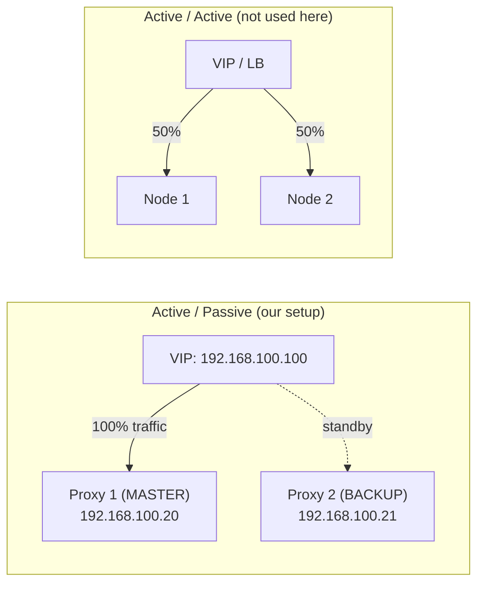
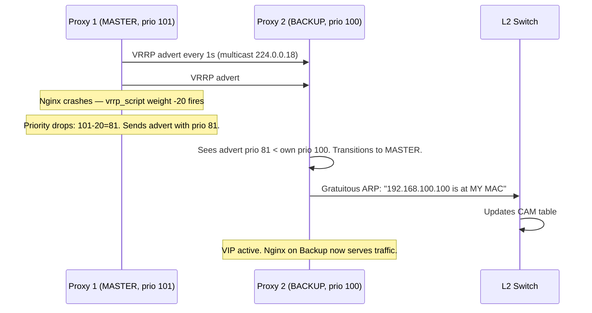
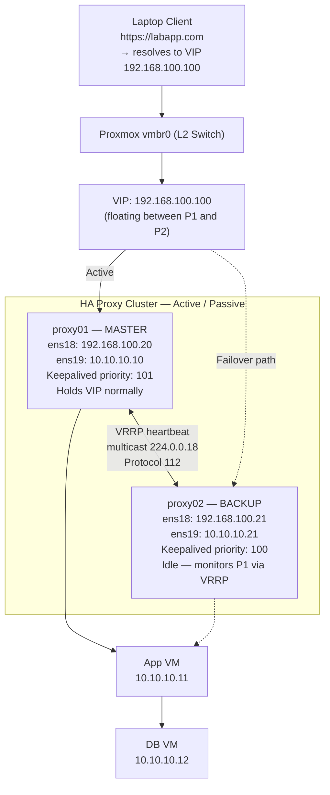

---
tags:
  - cybersecurity
  - networking
  - high-availability
  - keepalived
  - vrrp
  - clustering
reading-order: 5
created: 2026-09-21
updated: 2026-09-23
---

# Linux High Availability & Floating IPs

> [!abstract] The 30-second version
> In our current 3-tier architecture, the **Proxy VM is a Single Point of Failure (SPOF)**: if it crashes, reboots, or undergoes maintenance, the entire system goes dark. **High Availability (HA)** eliminates SPOFs through redundant nodes and automated failover. A **Floating IP (Virtual IP / VIP)** is an IP address that dynamically shifts between hosts without changing client DNS. In Linux environments, this is governed by **Keepalived** implementing **VRRP (Virtual Router Redundancy Protocol, [RFC 5798](https://datatracker.ietf.org/doc/html/rfc5798))**. When a primary proxy fails, the backup node broadcasts a **Gratuitous ARP (GARP)**, updating network switches and taking over traffic in under one second.

> [!info] Official References
> - **VRRP Protocol**: [RFC 5798 – Virtual Router Redundancy Protocol Version 3](https://datatracker.ietf.org/doc/html/rfc5798) (IETF, 2010)
> - **Keepalived Docs**: [keepalived.readthedocs.io](https://keepalived.readthedocs.io/en/latest/)
> - **Red Hat HA Guide (RHEL 9 / AlmaLinux 9)**: [High Availability Add-On Overview](https://access.redhat.com/documentation/en-us/red_hat_enterprise_linux/9/html/configuring_and_managing_high_availability_clusters/index)
> - **Gratuitous ARP**: [RFC 5227 §2.4](https://datatracker.ietf.org/doc/html/rfc5227#section-2.4) (IPv4 Address Conflict Detection)
> - **ip_nonlocal_bind kernel param**: [Linux kernel networking docs](https://www.kernel.org/doc/html/latest/networking/ip-sysctl.html)

---

## 1 · The SPOF Problem in Three-Tier Systems

```
[ Laptop ] ──► [ Proxy VM (SPOF!) ] ──► [ App VM ] ──► [ DB VM ]
                 192.168.100.20            10.10.10.11    10.10.10.12
```

If the Proxy VM's host loses power, the disk corrupts, or even just Nginx crashes:
- All client requests fail with `Connection refused` or timeout.
- App VM and DB VM are 100% healthy — irrelevant, because no traffic reaches them.

This is the SPOF problem. The solution is to have **two proxy VMs** with an IP that floats between them.

### High Availability Metrics

| Metric | Definition |
|---|---|
| **Availability %** | $99.9\%$ ("Three Nines") = ~8.76 hrs downtime/yr; $99.999\%$ ("Five Nines") = ~5 min/yr |
| **MTBF** | Mean Time Between Failures — how long a node runs before it breaks |
| **MTTR** | Mean Time To Recovery — how long failover takes end-to-end |
| **RTO** | Recovery Time Objective — the *maximum acceptable* outage duration (set by SLA) |
| **RPO** | Recovery Point Objective — the *maximum acceptable data loss* in time (relevant for databases, not proxies) |

For a **stateless reverse proxy**, RPO = 0 (no data to lose). The only metric that matters is MTTR, which Keepalived + VRRP drives to **< 3 seconds** for undetected hardware failure and **< 1 second** for a detected Nginx crash.

---

## 2 · Redundancy Models: Active/Passive vs. Active/Active



| Dimension | Active / Passive | Active / Active |
|---|---|---|
| **Traffic distribution** | One node handles 100%; backup is idle | All nodes handle traffic concurrently |
| **Complexity** | Low — standard Keepalived/VRRP | High — needs L4 load balancer or BGP ECMP |
| **State sync** | Simple — only config parity required | Hard for stateful services; needs session clustering |
| **Best for** | Proxy VMs, default gateways, firewall pairs | High-throughput web clusters, DNS servers |

**We implement Active/Passive.** The backup proxy runs Nginx and Keepalived but handles zero traffic until the master dies.

---

## 3 · What is a Floating IP (Virtual IP / VIP)?

A Floating IP (or VIP) is an IP address bound to a **service**, not permanently wired to a physical NIC. The OS assigns it as a secondary address on the active node's interface and removes it during failover. Clients never notice because they always talk to the same IP — `192.168.100.100`.

### The Layer 2 Magic: Gratuitous ARP (GARP)

ARP (Address Resolution Protocol) is how a switch knows which physical port to forward packets for a given IP. When the VIP moves, the new owner must **announce** the change. That announcement is a **Gratuitous ARP** — an unsolicited ARP reply sent to the broadcast MAC `ff:ff:ff:ff:ff:ff`, forcing every device on the segment (including the upstream switch) to update its ARP cache.

> [!info] Why "Gratuitous"?
> ARP is normally a *question* ("Who has 192.168.100.100?"). A Gratuitous ARP is an *unprompted announcement* ("192.168.100.100 is now at MY MAC") — nobody asked, but the sender broadcasts it anyway. This is defined in [RFC 5227 §2.4](https://datatracker.ietf.org/doc/html/rfc5227#section-2.4).

```
NORMAL STATE — Master active:
  Switch CAM table: 192.168.100.100 → Port 1 (MAC: 52:54:00:aa:bb:11)
  Switch CAM table: 192.168.100.20  → Port 1 (same NIC, primary IP)
  Switch CAM table: 192.168.100.21  → Port 2 (Backup, idle)

MASTER FAILS:
  Backup detects 3 missed VRRP heartbeats (~3 seconds).
  Backup binds 192.168.100.100 to its own ens18.

BACKUP SENDS GARP:
  Ethernet dst: ff:ff:ff:ff:ff:ff (broadcast)
  ARP: "192.168.100.100 is at MAC 52:54:00:aa:bb:22"

SWITCH CAM TABLE UPDATES IMMEDIATELY:
  192.168.100.100 → Port 2 (MAC: 52:54:00:aa:bb:22) ← updated!

Result: All future packets for 192.168.100.100 go to Proxy 2.
        Zero DNS changes. Zero client reconfiguration.
```

---

## 4 · VRRP Protocol Mechanics ([RFC 5798](https://datatracker.ietf.org/doc/html/rfc5798))

**VRRP (Virtual Router Redundancy Protocol)** is an IETF open standard for eliminating SPOFs in routed networks. RFC 5798 (VRRPv3, 2010) supersedes RFC 3768 (VRRPv2). Keepalived supports both; we use VRRPv2-compatible settings (IPv4 multicast).

### Key Concepts

| Field | What it does |
|---|---|
| `virtual_router_id` | Shared VRID (1–255) that identifies this HA cluster on the segment. Both nodes **must** share the same VRID. |
| `priority` | Determines Master election. Highest priority wins. In our setup: Master=101, Backup=100. |
| `advert_int` | How often (seconds) the Master broadcasts VRRP advertisements via multicast `224.0.0.18` (Protocol 112). |
| `authentication` | Simple password (PASS type) to prevent rogue nodes from hijacking the VRID. Not encryption — just a shared secret. |
| `preempt` (default on) | If the original Master recovers, it reclaims the VIP because priority 101 > 100. |
| `vrrp_script` | Keepalived-specific extension: runs a health-check command and adjusts priority dynamically if it fails. |

### Master Election & Failover Flow



> [!tip] Why `weight -20`?
> The math is intentional: `101 - 20 = 81`, which is less than the Backup's `100`. So the moment Nginx dies on Master, the Backup detects the lower-priority advertisement and **immediately** takes over — no need to wait for 3 missed heartbeats. Failover time drops from ~3 seconds to ~2 seconds.

---

## 5 · Provisioning the Backup Proxy VM

> [!important] Before you start
> You need a **second Proxy VM** with:
> - A dedicated LAN IP on `ens18` (we'll use `192.168.100.21`)
> - A dedicated Internal IP on `ens19` (we'll use `10.10.10.21`)
> - Identical Nginx config and TLS certs as Proxy 1
> The easiest path is cloning the existing Proxy VM in Proxmox.

### 5.1 · Clone Proxy VM in Proxmox

> [!info] Why clone?
> A full clone copies the disk image bit-for-bit. The resulting VM has Nginx, all config files, and AlmaLinux 9 pre-installed. You only need to change IPs and hostnames — not reinstall everything from scratch.

```bash
# On Proxmox host (192.168.100.2) — confirmed VMID map:
#   100 = db  |  101 = app  |  102 = proxy  (source for clone)
#   103 = proxy02  ← new backup proxy VM

# Full clone of proxy (VMID 102) into proxy02 (VMID 103):
pvesh create /nodes/pve/qemu/102/clone \
  --newid 103 \               # 103 is next available VMID
  --name proxy02 \            # name visible in Proxmox UI
  --full true \               # full clone — independent disk, not linked to source
  --storage local-lvm         # your Proxmox storage pool (check: pvesm status)

# Start the cloned VM:
pvesh create /nodes/pve/qemu/103/status/start
```

> [!caution] Full vs. Linked Clone
> A **linked clone** shares the base disk with the source VM (saves space). **Never use linked clones for production HA** — if the source disk corrupts, both VMs die. Always use `--full true`.

### 5.2 · Configure Networking on the Backup Proxy VM

After boot, connect via Proxmox console (not SSH — the IP is still `192.168.100.20`, same as Master):

```bash
# The clone has the same IPs as Proxy 1. Fix ens18 (LAN) first:
nmcli con mod ens18 ipv4.addresses 192.168.100.21/24  # new unique LAN IP
nmcli con mod ens18 ipv4.gateway 192.168.100.1         # same gateway as Proxy 1
nmcli con mod ens18 ipv4.dns 8.8.8.8                   # or your internal DNS
nmcli con mod ens18 ipv4.method manual
nmcli con up ens18

# Fix ens19 (Internal network):
nmcli con mod ens19 ipv4.addresses 10.10.10.21/24      # new unique internal IP
nmcli con mod ens19 ipv4.method manual
nmcli con up ens19

# Set the hostname so logs don't say "proxy01" on both nodes:
hostnamectl set-hostname proxy02

# Verify both interfaces are correct before proceeding:
ip addr show ens18   # should show 192.168.100.21
ip addr show ens19   # should show 10.10.10.21
```

> [!tip] `/etc/hosts` — Full Network Map
> Each host only needs entries for machines it **directly communicates with**. The rule: if a packet has to traverse more than one hop to reach a host, you still only add it if your service (Nginx, SSH, etc.) references it by hostname.
>
> | Host | LAN IP | Internal IP |
> |---|---|---|
> | Management Laptop | `192.168.100.10` | — |
> | Proxmox Host (`pve`) | `192.168.100.2` | — |
> | proxy01 (Primary) | `192.168.100.20` | `10.10.10.10` |
> | proxy02 (Backup) | `192.168.100.21` | `10.10.10.21` |
> | App VM | — | `10.10.10.11` |
> | DB VM | — | `10.10.10.12` |
> | **VIP** (floats) | `192.168.100.100` | — |
>
> **Management Laptop** (`/etc/hosts` on `192.168.100.10`):
> ```bash
> # Fix: labapp.com must point to VIP, NOT proxy01's physical IP
> # Your current entry "192.168.100.20 labapp.com" is wrong — fix it:
> sudo sed -i 's/192.168.100.20 labapp.com/192.168.100.100 labapp.com/' /etc/hosts
>
> # Then add the rest:
> 192.168.100.2   pve       # Proxmox web UI at https://pve:8006
> 192.168.100.20  proxy01   # direct admin SSH access
> 192.168.100.21  proxy02   # direct admin SSH access
> # Do NOT add 10.10.10.x here — laptop has no route to internal network
> ```
>
> **proxy01 and proxy02** (`/etc/hosts` on each proxy VM):
> ```bash
> 127.0.1.1       proxy01           # change to proxy02 on the cloned VM
> 192.168.100.10  laptop            # management laptop (scp cert source)
> 192.168.100.20  proxy01           # HA peer reference in logs
> 192.168.100.21  proxy02           # HA peer reference in logs
> 192.168.100.100 labapp.com        # VIP → Nginx server_name resolution
> 10.10.10.11     appvm             # upstream backend (Nginx proxy_pass target)
> 10.10.10.12     dbvm              # downstream DB (health checks or direct queries)
> ```
>
> **Proxmox host** (`pve`, `192.168.100.2`) — only manages VMs, no internal network access:
> ```bash
> 192.168.100.10  laptop
> 192.168.100.20  proxy01
> 192.168.100.21  proxy02
> ```
>
> **App VM / DB VM** (`10.10.10.x`) — internal-only, no LAN visibility:
> ```bash
> 10.10.10.10     proxy01-internal  # primary proxy reverse-proxy source
> 10.10.10.21     proxy02-internal  # backup proxy
> 10.10.10.11     appvm
> 10.10.10.12     dbvm
> ```

### 5.3 · Sync TLS Certificates to the Backup Proxy

Both proxy VMs **must serve the same TLS certificate** — because clients connect to the VIP (`192.168.100.100`) and either node might respond. The cert CN/SAN must match the VIP and domain name, not the individual node IP.

> [!warning] Key file permissions
> The private key (`labapp.key`) must be `chmod 600` and owned by `root:root` on the backup proxy. An overly permissive key causes Nginx to refuse to start.

```bash
# Run from your management laptop (192.168.100.10):

# Create the cert directory on Backup Proxy if it doesn't exist:
ssh root@192.168.100.21 "mkdir -p /etc/pki/nginx/"

# Copy fullchain and key to Backup Proxy:
scp /home/aw16/pki-ca/server/fullchain.pem   root@192.168.100.21:/etc/pki/nginx/fullchain.pem
scp /home/aw16/pki-ca/server/labapp.key      root@192.168.100.21:/etc/pki/nginx/labapp.key

# Lock down key permissions on the Backup Proxy:
ssh root@192.168.100.21 "chmod 600 /etc/pki/nginx/labapp.key && chown root:root /etc/pki/nginx/labapp.key"

# Verify the cert SAN covers the VIP and domain:
ssh root@192.168.100.21 "openssl x509 -in /etc/pki/nginx/fullchain.pem -text -noout | grep -A 3 'Subject Alternative'"
```

### 5.4 · Verify Nginx Config on Backup Proxy

Since we cloned, Nginx config is already present. Confirm it's correct and reload:

```bash
# On Backup Proxy (192.168.100.21):
nginx -t                     # test config syntax — must say "syntax is ok" and "test is successful"
systemctl enable --now nginx # ensure Nginx starts on boot
systemctl status nginx        # confirm active (running)
```

> [!caution] SELinux Context Check
> SELinux on AlmaLinux 9 is enforcing by default. If Nginx can't read cert files, check:
> ```bash
> # Verify cert files have the correct SELinux type:
> ls -lZ /etc/pki/nginx/
> # Expected type: cert_t for .pem, httpd_config_t or similar for key
>
> # If contexts are wrong (happens after scp), restore them:
> restorecon -Rv /etc/pki/nginx/
>
> # Alternatively, explicitly set the type:
> semanage fcontext -a -t cert_t "/etc/pki/nginx(/.*)?"
> restorecon -Rv /etc/pki/nginx/
> ```

### 5.5 · Firewall Rules on Both Proxy VMs

```bash
# Run on BOTH proxy01 (192.168.100.20) AND proxy02 (192.168.100.21):

firewall-cmd --permanent --add-service=http      # port 80 (for HTTP→HTTPS redirect)
firewall-cmd --permanent --add-service=https     # port 443
firewall-cmd --permanent --add-protocol=vrrp     # Protocol 112 — VRRP heartbeats
firewall-cmd --reload

# Confirm rules are active:
firewall-cmd --list-all
```

> [!info] Why open port 80?
> Nginx on the proxy typically does an HTTP→HTTPS redirect (`return 301 https://$host$request_uri`). If port 80 is blocked, browsers that type `http://labapp.com` get no response instead of a redirect. This is a UX issue, not a security issue — the actual content always travels over HTTPS.

---

## 6 · Installing and Configuring Keepalived

> [!info] Keepalived documentation
> [keepalived.readthedocs.io/en/latest/configuration.html](https://keepalived.readthedocs.io/en/latest/configuration.html)

### 6.1 · Kernel Tuning: `ip_nonlocal_bind`

By default, Linux refuses to let a process bind to an IP address that isn't currently assigned to any local interface. This creates a chicken-and-egg problem: on the **Backup** node, Nginx tries to bind to `192.168.100.100` (VIP) at startup, but the VIP only gets assigned after Keepalived wins a VRRP election. Without this sysctl, Nginx on Backup would fail to start.

```bash
# Run on BOTH proxy nodes:

# Persist the setting across reboots via drop-in config file:
echo "net.ipv4.ip_nonlocal_bind = 1" > /etc/sysctl.d/99-keepalived.conf

# Apply immediately without rebooting:
sysctl --system

# Confirm the value is 1:
sysctl net.ipv4.ip_nonlocal_bind
```

### 6.2 · Install Keepalived

```bash
# Run on BOTH proxy nodes:
dnf install -y keepalived

# Enable the service to start on boot (don't start yet — configure first):
systemctl enable keepalived
```

### 6.3 · Master Configuration — `proxy01` (`192.168.100.20`)

```ini
# /etc/keepalived/keepalived.conf — on proxy01 (MASTER)
# Keepalived docs: https://keepalived.readthedocs.io/en/latest/configuration.html

global_defs {
    router_id PROXY01                    # unique identifier for this node in logs
    vrrp_skip_check_adv_addr             # don't validate source IP of VRRP ads — avoids issues with asymmetric routing
    vrrp_garp_interval 0                 # send GARP immediately on state change (no delay)
    vrrp_gna_interval 0                  # same for IPv6 neighbor announcements
}

# --- Health Check Script ---
# Keepalived runs this command every `interval` seconds.
# `killall -0 nginx` sends signal 0 (no actual signal) — it just checks if the process exists.
# Exit code 0 = Nginx is running. Exit code non-0 = Nginx is dead.
vrrp_script check_nginx {
    script "/usr/bin/killall -0 nginx"
    interval 2      # check every 2 seconds
    weight -20      # if script fails: priority 101 - 20 = 81, which is < Backup's 100 → Backup takes over
    fall 2          # must fail 2 consecutive checks before triggering weight change (avoids flapping on transient errors)
    rise 2          # must succeed 2 consecutive checks before restoring weight (stabilization)
}

vrrp_instance VI_STATIC {
    state MASTER                         # this node starts as MASTER (highest priority wins regardless)
    interface ens18                      # the NIC that carries the VIP — our LAN interface
    virtual_router_id 51                 # must match on both nodes; identifies this VRRP cluster (1–255, unique per segment)
    priority 101                         # higher than Backup's 100 → this node wins election at startup
    advert_int 1                         # send VRRP heartbeat every 1 second via multicast 224.0.0.18

    authentication {
        auth_type PASS                   # simple shared-secret authentication (not encryption)
        auth_pass Secr3tAirNav           # must match on both nodes exactly (8 chars max for VRRPv2)
    }

    virtual_ipaddress {
        192.168.100.100/24 dev ens18 label ens18:vip  # the floating VIP; `label` makes it visible in `ip addr`
    }

    track_script {
        check_nginx                      # attach the health check — failure drops our priority below Backup's
    }
}
```

### 6.4 · Backup Configuration — `proxy02` (`192.168.100.21`)

```ini
# /etc/keepalived/keepalived.conf — on proxy02 (BACKUP)

global_defs {
    router_id PROXY02                    # different router_id from Master — shows up in logs
    vrrp_skip_check_adv_addr
    vrrp_garp_interval 0
    vrrp_gna_interval 0
}

vrrp_script check_nginx {
    script "/usr/bin/killall -0 nginx"
    interval 2
    weight -20                           # if Backup's Nginx also dies: 100-20=80, won't affect Master election
    fall 2
    rise 2
}

vrrp_instance VI_STATIC {
    state BACKUP                         # starts as BACKUP — waits for MASTER to stop advertising
    interface ens18
    virtual_router_id 51                 # must be identical to Master's virtual_router_id
    priority 100                         # lower than Master's 101 — loses election by default
    advert_int 1                         # must match Master's advert_int

    authentication {
        auth_type PASS
        auth_pass Secr3tAirNav           # must be identical to Master's auth_pass
    }

    virtual_ipaddress {
        192.168.100.100/24 dev ens18 label ens18:vip  # same VIP — Keepalived manages who actually holds it
    }

    track_script {
        check_nginx
    }
}
```

### 6.5 · Start Keepalived

```bash
# On proxy01 first, then proxy02:
systemctl start keepalived
systemctl status keepalived   # confirm: active (running)

# Verify the VIP is active on proxy01:
ip addr show ens18
# Expected output includes: inet 192.168.100.100/24 ... secondary ens18:vip

# Confirm proxy02 does NOT have the VIP yet:
ssh root@192.168.100.21 "ip addr show ens18 | grep 100.100"
# Expected output: (empty — no VIP on Backup while Master is healthy)
```

---

## 7 · Full Architecture After HA Setup



---

## 8 · End-to-End Failover Test

This is the most important verification step. A Keepalived setup that has never been tested is not an HA setup.

> [!tip] Test with two terminal windows open — one watching Proxy 1 logs, one watching Proxy 2 logs.

### Terminal A — Watch Master logs
```bash
# On proxy01:
journalctl -u keepalived -f
```

### Terminal B — Watch Backup logs
```bash
# On proxy02:
journalctl -u keepalived -f
```

### Terminal C — Continuous client ping from laptop
```bash
# On management laptop (192.168.100.10):
# Watch whether VIP stays reachable during failover:
ping -i 0.5 192.168.100.100
```

### Test 1: Kill Nginx on Master (service-level failure)
```bash
# On proxy01 — simulate Nginx crash:
systemctl stop nginx

# Expected behavior within ~2 seconds:
# - Terminal A: "Script check_nginx failed" → "Entering FAULT state" or priority drop
# - Terminal B: "VRRP_Script check_nginx failed" → "Transition to MASTER" → GARP sent
# - Terminal C: 0 or 1 dropped ping packets — then resumes

# Verify VIP moved to Backup:
ip addr show ens18               # on proxy01: VIP gone
ssh root@192.168.100.21 "ip addr show ens18"  # VIP now on proxy02

# Restore Nginx on Master and watch it reclaim VIP (preemption):
systemctl start nginx
# Wait ~4 seconds (2x rise checks + advert cycle)
# Terminal A: "Transition back to MASTER"
# Terminal B: "Received advert with higher priority, transitioning to BACKUP"
```

### Test 2: Hard shutdown of Master VM (hardware-level failure)
```bash
# In Proxmox web UI: right-click proxy (VMID 102) → Stop (hard power off)
# OR via pvesh:
pvesh create /nodes/pve/qemu/102/status/stop   # VMID 102 = proxy (Master)

# Expected behavior within ~3 seconds (3 missed VRRP advertisements):
# - Terminal B: "Master is down! Transitioning to MASTER state"
# - Terminal C: 2–3 dropped pings, then resumes
```

### Test 3: Verify HTTPS end-to-end after failover
```bash
# From management laptop, while proxy01 is still stopped:
curl -v --cacert /home/aw16/pki-ca/root-ca/certs/root-ca.crt https://labapp.com

# Expected: TLS handshake succeeds, cert SAN matches, HTTP 200 or application response
# The cert is identical on both proxies — clients see no difference
```

---

## 9 · Troubleshooting

### VIP not appearing on Master after `systemctl start keepalived`

```bash
# Check Keepalived journal for errors:
journalctl -u keepalived --since "5 minutes ago" --no-pager

# Common causes:
# 1. virtual_router_id mismatch between nodes — both must be identical
# 2. auth_pass mismatch — VRRP advertisements rejected silently
# 3. VRRP protocol (112) blocked by firewall:
firewall-cmd --list-protocols   # should include 'vrrp'
# Fix: firewall-cmd --permanent --add-protocol=vrrp && firewall-cmd --reload

# 4. Another device on the segment is already using VRID 51 — change virtual_router_id
```

### Both nodes claim MASTER simultaneously (split-brain)

```bash
# Symptom: both `ip addr show ens18` on proxy01 AND proxy02 show the VIP.
# Cause: VRRP multicast traffic blocked between nodes (same-host firewall, or VLAN isolation)

# Capture VRRP traffic to confirm heartbeats are reaching Backup:
tcpdump -i ens18 proto 112 -c 10  # run on proxy02 — should see packets from proxy01

# If no packets: check that firewall-cmd --add-protocol=vrrp is applied on MASTER
# If packets are seen but both still MASTER: auth_pass mismatch or VRID mismatch
```

### Nginx fails to start on Backup (before VIP is assigned)

```bash
# Confirm ip_nonlocal_bind is set to 1:
sysctl net.ipv4.ip_nonlocal_bind   # expected: net.ipv4.ip_nonlocal_bind = 1

# If 0: re-apply and confirm file exists:
cat /etc/sysctl.d/99-keepalived.conf  # must contain: net.ipv4.ip_nonlocal_bind = 1
sysctl --system
```

### Cert or TLS error after failover

```bash
# Verify both proxies serve the exact same cert:
# On proxy01:
openssl s_client -connect 192.168.100.20:443 -brief 2>/dev/null | grep "Server certificate"
# On proxy02:
openssl s_client -connect 192.168.100.21:443 -brief 2>/dev/null | grep "Server certificate"

# Fingerprints must match. If proxy02 has an old/different cert:
# Re-run the scp commands in §5.3 and reload Nginx.
```

---

## 10 · Advanced Clustering: Pacemaker, Corosync & STONITH

> [!note] This section is informational — not required for our current Keepalived setup.

While Keepalived is ideal for stateless network services (like Nginx reverse proxies), stateful multi-service architectures — databases, clustered storage — require **Pacemaker + Corosync**.

```
┌────────────────────────────────────────────────────────┐
│                   Pacemaker                            │
│           (Cluster Resource Manager)                   │
│   Manages start/stop ordering, VIPs, MariaDB, Failover │
├────────────────────────────────────────────────────────┤
│                    Corosync                            │
│            (Cluster Membership & Quorum)               │
│   Node heartbeats, voting, consensus, split-brain prev │
└────────────────────────────────────────────────────────┘
```

### The Nightmare of Split-Brain Syndrome

If the communication link between two nodes breaks, but both nodes remain alive:
- Node 1 thinks Node 2 is dead → claims the VIP and starts writing to shared storage.
- Node 2 thinks Node 1 is dead → also claims the VIP and starts writing to shared storage.
- Both nodes write simultaneously → **catastrophic data corruption**.

Keepalived on separate VMs on the same virtual switch avoids this: VRRP multicast traffic stays within Proxmox's vmbr0 and is extremely unlikely to be selectively blocked. For databases, the stakes are higher — hence Pacemaker/Corosync.

### The Solution: Quorum & STONITH

1. **Quorum**: A cluster requires a strict majority of votes ($\lfloor N/2 \rfloor + 1$) to take action. A 2-node cluster is inherently split-brain-prone and requires a 3rd voting device (a "QNet" daemon or external quorum disk).
2. **STONITH ("Shoot The Other Node In The Head")**: If a node stops responding or quorum is lost, the surviving node uses hardware IPMI or a Proxmox fence agent to **forcefully cut power** to the suspect node before taking over its storage or IP. *"The only safe node is a powered-off node."*

> [!info] Red Hat HA documentation covers Pacemaker + Corosync in detail for RHEL 9 / AlmaLinux 9:
> [Red Hat HA Add-On Guide](https://access.redhat.com/documentation/en-us/red_hat_enterprise_linux/9/html/configuring_and_managing_high_availability_clusters/index)
