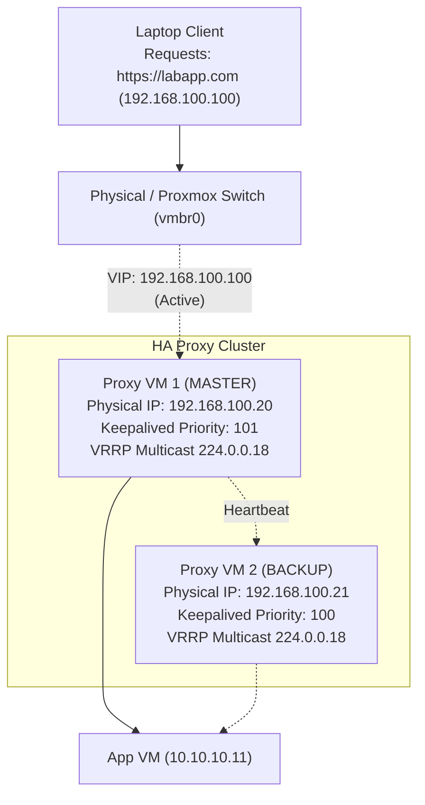

---
tags:
  - cybersecurity
  - networking
  - high-availability
  - keepalived
  - vrrp
  - clustering
reading-order: 6
created: 2026-09-21
---

# Linux High Availability & Floating IPs

> [!abstract] The 30-second version
> In our current 3-tier architecture, the **Proxy VM is a Single Point of Failure (SPOF)**: if it crashes, reboots, or undergoes maintenance, the entire system goes dark. **High Availability (HA)** eliminates SPOFs through redundant nodes and automated failover. A **Floating IP (Virtual IP / VIP)** is an IP address that dynamically shifts between hosts without changing client DNS. In Linux environments, this is governed by **Keepalived** implementing **VRRP (Virtual Router Redundancy Protocol, RFC 5798)**. When a primary proxy fails, the backup node broadcasts a **Gratuitous ARP (GARP)**, updating network switches and taking over traffic in under one second.

---

## 1 · The SPOF Problem in Three-Tier Systems

Look closely at our initial architecture:

```
[ Laptop ] ──► [ Proxy VM (SPOF!) ] ──► [ App VM ] ──► [ DB VM ]
                 192.168.100.20
```

If the Proxy VM's physical host loses power, or its virtual disk corrupts, or the `nginx` process crashes:
- Laptop requests fail immediately with `Connection refused` or timeout.
- Even though the App VM and DB VM are 100% healthy, the system is down.

### High Availability Metrics
- **Availability Percentage**: The ratio of uptime to total time:
  - $99.9\%$ ("Three Nines") = ~8.76 hours of downtime per year.
  - $99.999\%$ ("Five Nines") = ~5.26 minutes of downtime per year.
- **MTBF (Mean Time Between Failures)**: Average operational time before a failure occurs.
- **MTTR (Mean Time To Recovery)**: Time required to detect, failover, and restore service.
- **RTO (Recovery Time Objective)**: The maximum acceptable duration of system unavailability.
- **RPO (Recovery Point Objective)**: The maximum acceptable data loss measured in time (e.g., database transactions).

---

## 2 · Redundancy Models: Active/Passive vs. Active/Active

```
ACTIVE / PASSIVE (Failover Pair)
            ┌──► [ Primary Proxy (Master) ] ── (Handles 100% traffic)
[ VIP ] ────┤
            └──► [ Secondary Proxy (Backup) ] ── (Idle, monitors Master)

ACTIVE / ACTIVE (Load Balanced)
            ┌──► [ Proxy Node 1 ] ── (Handles 50% traffic)
[ VIP ] ────┤
            └──► [ Proxy Node 2 ] ── (Handles 50% traffic)
```

| Dimension | Active / Passive | Active / Active |
|---|---|---|
| **Mechanism** | One node handles traffic; the other stands by. | All nodes actively process incoming connections. |
| **Complexity** | Low. Standard Keepalived/VRRP. | Higher. Requires an upstream L4 load balancer or BGP ECMP (Equal-Cost Multi-Path). |
| **State Sync** | Simple. Backups only require configuration parity. | Complex for stateful services; requires session clustering. |
| **Best For** | Proxy VMs, Default Gateways, Firewall Pairs. | High-throughput web clusters, DNS servers. |

---

## 3 · What is a Floating IP (Virtual IP / VIP)?

A **Floating IP** (or Virtual IP) is an IP address assigned to a *service*, rather than being permanently hardcoded to a physical Network Interface Card (NIC).

### The Layer 2 Magic: Gratuitous ARP (GARP)
How does the network know which physical computer should receive packets sent to `192.168.100.100`?

```
1. NORMAL STATE (Master Active):
Switch Port 1 (Master MAC: 52:54:00:aa:bb:11) <── Holds VIP 192.168.100.100
Switch Port 2 (Backup MAC: 52:54:00:aa:bb:22) <── Listening

2. MASTER DIES (Hardware failure or Nginx stops):
Backup detects missing heartbeat (3 seconds).
Backup binds 192.168.100.100 to its interface.

3. GRATUITOUS ARP (GARP) BROADCAST:
Backup sends an unsolicited ARP packet to 255.255.255.255:
"Hey everyone! 192.168.100.100 is now at MAC 52:54:00:aa:bb:22!"

4. SWITCH CAM TABLE UPDATES:
The network switch immediately updates its MAC address table.
Future packets for 192.168.100.100 instantly route out of Port 2!
Zero DNS changes required on client laptops.
```

---

## 4 · VRRP Protocol Mechanics (RFC 5798)

**VRRP (Virtual Router Redundancy Protocol)** is an open standard designed to eliminate single points of failure in routed networks.

### How VRRP Operates
1. **Virtual Router ID (VRID)**: A shared identifier (1–255) grouping nodes into a redundant cluster.
2. **Priorities**:
   - Master node has higher priority (e.g. `101`).
   - Backup node has lower priority (e.g. `100`).
3. **Heartbeat Advertisements**:
   - The Master broadcasts a VRRP advertisement packet every **1 second** using multicast IP `224.0.0.18` (IP Protocol 112).
   - The packet says: *"I am Master for VRID 51 with priority 101, and I am alive."*
4. **Master Down Timer**:
   - If the Backup misses **3 consecutive advertisements** (~3 seconds), it transitions from `BACKUP` state to `MASTER` state and assumes the VIP.
5. **Preemption**:
   - `preempt`: If the original Master recovers, it re-claims the VIP because its priority is higher.
   - `nopreempt`: The backup keeps the VIP until it fails, avoiding unnecessary failover flaps.

---

## 5 · Implementing Keepalived on AlmaLinux 9

**Keepalived** is the premier Linux daemon implementing VRRP and automated health-checking.



### 1. Installation
On both Proxy VM 1 and Proxy VM 2:
```bash
dnf install -y keepalived
```

### 2. Kernel Tuning for IP Non-Local Binding
When Nginx starts, it needs to be able to bind to `192.168.100.100` even on the Backup node where the IP is not yet active:
```bash
echo "net.ipv4.ip_nonlocal_bind = 1" >> /etc/sysctl.d/99-keepalived.conf
sysctl --system
```

### 3. Master Configuration (`/etc/keepalived/keepalived.conf` on Proxy 1)
```ini
global_defs {
    router_id PROXY01
    vrrp_skip_check_adv_addr
    vrrp_garp_interval 0
    vrrp_gna_interval 0
}

# Health Check Script: If Nginx stops running, drop priority
vrrp_script check_nginx {
    script "/usr/bin/killall -0 nginx"
    interval 2
    weight -20    # 101 - 20 = 81 (drops below Backup's 100!)
    fall 2
    rise 2
}

vrrp_instance VI_STATIC {
    state MASTER
    interface ens18
    virtual_router_id 51
    priority 101
    advert_int 1

    authentication {
        auth_type PASS
        auth_pass Secr3tAirNav
    }

    virtual_ipaddress {
        192.168.100.100/24 dev ens18 label ens18:vip
    }

    track_script {
        check_nginx
    }
}
```

### 4. Backup Configuration (`/etc/keepalived/keepalived.conf` on Proxy 2)
```ini
global_defs {
    router_id PROXY02
}

vrrp_script check_nginx {
    script "/usr/bin/killall -0 nginx"
    interval 2
    weight -20
}

vrrp_instance VI_STATIC {
    state BACKUP
    interface ens18
    virtual_router_id 51
    priority 100
    advert_int 1

    authentication {
        auth_type PASS
        auth_pass Secr3tAirNav
    }

    virtual_ipaddress {
        192.168.100.100/24 dev ens18 label ens18:vip
    }

    track_script {
        check_nginx
    }
}
```

### 5. Firewalld Rules for VRRP
VRRP uses protocol 112:
```bash
firewall-cmd --permanent --add-protocol=vrrp
firewall-cmd --reload
```

---

## 6 · Advanced Clustering: Pacemaker, Corosync & STONITH

While Keepalived is ideal for stateless network services (like Nginx reverse proxies), stateful multi-service architectures (databases, clustered storage) require **Pacemaker + Corosync**.

```
┌────────────────────────────────────────────────────────┐
│                   Pacemaker                            │
│           (Cluster Resource Manager)                   │
│   Manages start/stop ordering, VIPs, MariaDB, Failover │
├────────────────────────────────────────────────────────┤
│                    Corosync                            │
│            (Cluster Membership & Quorum)               │
│   Node heartbeats, voting, consensus, split-brain prev │
└────────────────────────────────────────────────────────┘
```

### The Nightmare of Split-Brain Syndrome
If the communication link between two nodes breaks, but both nodes remain alive:
- Node 1 thinks Node 2 is dead. Node 1 claims the VIP.
- Node 2 thinks Node 1 is dead. Node 2 also claims the VIP!
- Both nodes attempt to write to the shared database simultaneously, leading to catastrophic **database corruption**.

### The Solution: Quorum & STONITH
1. **Quorum**: A cluster requires a strict majority of votes ($N/2 + 1$) to take action. A 2-node cluster requires a 3rd voting device (a "QNet" daemon or external tie-breaker).
2. **STONITH ("Shoot The Other Node In The Head")**:
   - If a node stops responding or quorum is lost, the surviving node uses hardware IPMI / Proxmox fence devices to forcefully cut physical power to the suspect node before taking over its storage or IP.
   - *"The only safe node is a powered-off node."*

