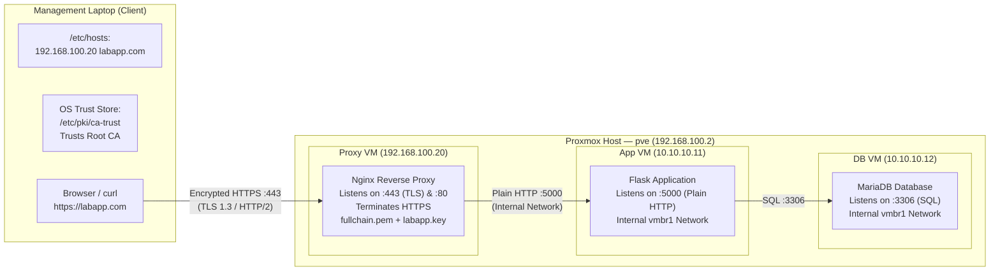

---
tags:
  - cybersecurity
  - pki
  - certificates
  - openssl
  - nginx
  - tls
  - task-guide
  - runbook
  - presentation
reading-order: 4.1
created: 2026-09-21
aliases:
  - PKI Master Execution Guide
  - 2-Tier PKI Runbook
  - Oliverio PKI Task
---

# 2-Tier PKI, Root & Intermediate CAs, and Nginx HTTPS Setup Guide
**Author / Engineer**: Oliverio (AirNav DAS Cadet Track)  
**Target Environment**: AlmaLinux 9 Management Laptop, Proxmox VE 3-Tier Architecture (`Proxy VM 192.168.100.20`, `App VM 10.10.10.11`, `DB VM 10.10.10.12`)

---

## Executive Summary & The Elevator Pitch

> [!abstract] The 30-Second Elevator Pitch
> *"To secure our 3-tier application, we engineered an enterprise-grade Public Key Infrastructure (PKI) from scratch. Rather than relying on insecure single-tier self-signed certificates, we established an industry-standard **2-Tier Certificate Authority** hierarchy consisting of an Offline Root CA and an active Intermediate CA. We then issued a cryptographically verified TLS certificate for **`labapp.com`** complete with Subject Alternative Names (SAN) for both domain and IP address. At the network edge, we configured an **Nginx Reverse Proxy** to perform **TLS Termination (SSL Offloading)** on Port 443 with modern TLS 1.2/1.3 and automatic HTTP-to-HTTPS redirection, while leaving backend traffic safely isolated on an internal network. Finally, we installed the Root CA into the client trust store, achieving a warning-free **solid green padlock** across modern browsers."*

---

## 1 · Architecture, Request Flow & TLS Offloading

Before typing a single command in the terminal, it is vital to understand the network topology, how data packets travel, and why each component is placed where it is.

### 1.1 Visual Topology



### 1.2 Node & Addressing Matrix

| Host / Node | Role | Addressing / Interfaces | Access Command / Location |
|---|---|---|---|
| **Management Laptop** | Client & CA Workspace (holds CA keys, runs OpenSSL, curl, browser) | `192.168.100.10` on `enp0s31f6` | Local terminal: `[aw16@laptop ~]$` |
| **Proxy VM** | Public-facing Reverse Proxy (terminates HTTPS :443, redirects :80) | `192.168.100.20` (`ens18` LAN) + `10.10.10.10` (`ens19` Internal) | `ssh root@192.168.100.20` |
| **App VM** | Application Logic (Flask service listening on `:5000`) | `10.10.10.11` (`ens18` Internal) | Internal proxy connection via `10.10.10.11:5000` |
| **DB VM** | Relational Database (MariaDB listening on `:3306`) | `10.10.10.12` (`ens18` Internal) | Database socket connection from App VM |

### 1.3 Core Concept: What is TLS Termination (SSL Offloading)?

> [!info] Analogy: The Secure Front Receptionist
> Think of Nginx as the **security receptionist at the entrance of a high-security corporate building**. 
> - When an external client arrives from the public internet, they must present their credentials and undergo strict security checks (the TLS cryptographic handshake).
> - Once the receptionist verifies the identity and decrypts the briefcase (the encrypted TLS packet), the receptionist hands the plain paper documents to internal couriers (the Flask application on `10.10.10.11`) who walk them through the private internal corridors (`vmbr1`).
> - The internal workers don't need to waste time wearing security armor or running heavy encryption checks; they focus 100% on their business logic.
> - **Security is maintained** because external visitors can never enter the private hallway directly; every external request MUST stop at the receptionist.

In technical terms:
1. **CPU Efficiency**: Performing asymmetric Diffie-Hellman key exchanges and symmetric AES encryption consumes significant CPU power. Offloading this to Nginx frees up Flask to run Python code.
2. **Centralized Certificate Management**: When certificates expire, you only replace them on Nginx. If you had 20 backend microservices, you would have had to update 20 separate apps.
3. **Network Isolation**: The App VM and DB VM have no public IP addresses. They reside solely on the isolated `vmbr1` software bridge.

---

## 2 · Phase 1: Local DNS Mapping on the Laptop (`/etc/hosts`)

Because `labapp.com` is a private lab domain that does not exist in public domain registrars for our internal network, your laptop's operating system needs to know which IP address corresponds to that name.

### 2.1 The Concept of `/etc/hosts`
Before computers contact external DNS servers (like Google `8.8.8.8` or Cloudflare `1.1.1.1`), the operating system's internal resolver first checks a local file named `/etc/hosts`. This file acts as a private, static address book that overrides external lookups.

### 2.2 Step 1.1: Add the Static Host Mapping
On your **Laptop terminal (`[aw16@laptop ~]$`)**, open the file in a text editor like `vi`:

```bash
sudo vi /etc/hosts
```

Inside `vi`, press `i` to enter Insert Mode, navigate to the bottom of the file, and add this line:
```text
192.168.100.20 labapp.com
```
Press `Esc`, then type `:wq` and press `Enter` to save and exit.

*(Alternative quick command):*
```bash
sudo bash -c 'echo "192.168.100.20 labapp.com" >> /etc/hosts'
```

#### Line-by-Line Breakdown:
- `sudo`: Executes with administrative root privileges, required because `/etc/hosts` is a protected system configuration file.
- `192.168.100.20`: The destination IP address of our Proxy VM.
- `labapp.com`: The domain name mapped to that IP address.

### 2.3 Step 1.2: Verify Local DNS Resolution
Verify that your laptop's resolver maps the name properly:

```bash
ping -c 3 labapp.com
```

*Expected Output:*
```text
PING labapp.com (192.168.100.20) 56(84) bytes of data.
64 bytes from labapp.com (192.168.100.20): icmp_seq=1 ttl=64 time=0.421 ms
64 bytes from labapp.com (192.168.100.20): icmp_seq=2 ttl=64 time=0.389 ms
```
This confirms that any network request destined for `labapp.com` will immediately route to `192.168.100.20`.

> [!warning] The GoDaddy / DNS-Over-HTTPS (DoH) Trap
> If you type `labapp.com` into Chrome or Firefox and get redirected to a **GoDaddy parking page**, your browser has **Secure DNS (DNS-over-HTTPS / DoH)** turned on!
> 
> **Why this happens**: Modern browsers frequently enable DoH by default. When DoH is active, the browser completely **bypasses your operating system's `/etc/hosts` file** and sends an encrypted HTTPS query directly to Cloudflare (`1.1.1.1`) or Google (`8.8.8.8`). Because `labapp.com` happens to be a domain owned by someone on the public internet, public DNS resolves it to GoDaddy's public IP (`34.102.136.180`).
> 
> **How to fix it**:
> 1. In Chrome: Go to `Settings` $\to$ `Privacy and security` $\to$ `Security` $\to$ Turn OFF "Use secure DNS" (or set to "With your current service provider").
> 2. In Firefox: Go to `Settings` $\to$ `Privacy & Security` $\to$ Scroll to `DNS over HTTPS` $\to$ Select "Off (Use default DNS resolver)".
> 3. Quick Test: Open an **Incognito / Private Window**, where host cache leaks are minimized.

---

## 3 · Phase 2: Building the CA Directory Hierarchy & Database

We will construct our entire Certificate Authority management workspace inside `~/pki-ca` on your management laptop.

### 3.1 Step 2.1: Initialize Directory Layout and Ledger Files
On your **Laptop terminal (`[aw16@laptop ~]$`)**:

```bash
# Create dedicated directories for Root CA, Intermediate CA, and Server artifacts:
mkdir -p ~/pki-ca/{root-ca,intermediate-ca}/{certs,crl,newcerts,private}
mkdir -p ~/pki-ca/server

# Lock down private key directories so only your user account can read them:
chmod 700 ~/pki-ca/{root-ca,intermediate-ca}/private

# Initialize OpenSSL accounting databases and serial counters:
touch ~/pki-ca/root-ca/index.txt
touch ~/pki-ca/intermediate-ca/index.txt
echo 1000 > ~/pki-ca/root-ca/serial
echo 1000 > ~/pki-ca/intermediate-ca/serial
```

### 3.2 In-Depth Concept: Why Did We Create "Empty" Files and Folders?

> [!tip] Analogy: The Blank Filing Cabinet & Ledger Book
> OpenSSL is not just an encryption calculator; when it functions as a Certificate Authority, it operates as a **strict database management system**.
> 
> Imagine you are opening a new municipal licensing office:
> - Before you can issue your very first driver's license, you must buy a **blank filing cabinet** (`newcerts/`) and open a **fresh ledger notebook** (`index.txt`).
> - Even though the ledger notebook starts completely blank, the office cannot open without it!
> - The moment you issue license #1000, you write a row in the ledger, drop a carbon copy into the filing cabinet, and flip the ticket counter (`serial`) to 1001.
> 
> If OpenSSL does not find this exact folder structure and these specific files, it will immediately abort with a database error.

#### Directory & File Breakdown:
- `certs/`: The public filing shelf where we store finalized certificates (e.g. `root-ca.crt`, `intermediate-ca.crt`).
- `crl/`: Where Certificate Revocation Lists are held if a certificate is ever banned before its expiration.
- `newcerts/`: **Mandatory OpenSSL archive**. Every time OpenSSL signs a certificate, it automatically drops a permanent backup copy into this folder named after its hexadecimal serial number (e.g. `1000.pem`).
- `private/`: The secure vault for private keys. `chmod 700` ensures permissions are `rwx------` (owner only).
- `touch index.txt`: The flat-file database tracking issued certificates. It starts empty. Every time a certificate is certified, OpenSSL appends a record with status flags (`V` = Valid, `R` = Revoked, `E` = Expired), expiration date, serial number, and Subject Distinguished Name.
- `echo 1000 > serial`: Initializes the serial counter in hexadecimal. **RFC 5280 §4.1.2.2** strictly mandates that every certificate issued by a CA must have a globally unique serial number. OpenSSL reads this file, assigns the number to the certificate, and increments it automatically to `1001`.

---

## 4 · Phase 3: Creating the Offline Root Certificate Authority

The **Root CA** is the sovereign trust anchor for our entire ecosystem. It is self-signed, uses a long 4096-bit RSA key encrypted with a passphrase, and is valid for 10 years (3,650 days).

```
[ Root CA ] (Self-Signed, 4096-bit, Validity: 10 Years)
     │
     └── signs ──► [ Intermediate CA ]
```

### 4.1 Presentation Defense: Why Use Configuration Files (`.cnf`) Instead of Interactive Prompts?

> [!important] Crucial Defense Talking Points for Evaluators
> In the steps below, we write configuration files (`openssl.cnf`) using a text editor or file redirect rather than relying on OpenSSL's default interactive question-and-answer prompt. If asked during your defense why you chose this route, cite these three reasons:
> 
> 1. **Modern Browser Security (Mandatory SANs)**: The interactive OpenSSL prompt only asks for the legacy `Common Name (CN)`. However, modern browsers (Chrome 58+, Firefox, Edge) completely ignore Common Names and require **Subject Alternative Names (SAN)**. SANs and IP addresses cannot be easily entered through interactive prompts; they require an extension configuration file.
> 2. **Advanced Cryptographic Constraints**: You cannot configure critical X.509v3 extensions like `basicConstraints = critical, CA:true` or `pathlen:0` through interactive prompts. These mathematical guardrails must be defined in configuration profiles.
> 3. **Infrastructure as Code (DevSecOps Best Practice)**: Manually answering terminal prompts is prone to human typos and cannot be automated in CI/CD pipelines. Defining configurations declaratively is the enterprise standard for auditability and reproducibility.
> 
> **Official Authoritative Sources**:
> - **RFC 5280**: *Internet X.509 Public Key Infrastructure Certificate and CRL Profile* (Defines `basicConstraints`, `keyUsage`, and path length constraints).
> - **RFC 6125**: *Representation and Verification of Domain-Based Application Service Identity* (Mandates Subject Alternative Names over Common Name).
> - **NIST SP 800-57 Part 1 Rev. 5**: *Recommendation for Key Management* (Recommends 4096-bit RSA keys for Root CAs intended to survive 10+ years).
> - **OpenSSL Documentation (`man x509v3_config`)**: Authoritative reference for extension syntax blocks.

### 4.2 Step 3.1: Create Root CA Configuration (`~/pki-ca/root-ca/openssl.cnf`)
Create the configuration file using `vi ~/pki-ca/root-ca/openssl.cnf` (or write it directly):

```ini
[ ca ]
default_ca = CA_default

[ CA_default ]
dir               = /home/aw16/pki-ca/root-ca
certs             = $dir/certs
crl_dir           = $dir/crl
new_certs_dir     = $dir/newcerts
database          = $dir/index.txt
serial            = $dir/serial
RANDFILE          = $dir/private/.rand

private_key       = $dir/private/root-ca.key
certificate       = $dir/certs/root-ca.crt

default_md        = sha256
name_opt          = ca_default
cert_opt          = ca_default
default_days      = 3650
preserve          = no
policy            = policy_strict

[ policy_strict ]
countryName             = match
stateOrProvinceName     = optional
organizationName        = match
organizationalUnitName  = optional
commonName              = supplied
emailAddress            = optional

[ req ]
default_bits        = 4096
distinguished_name  = req_distinguished_name
string_mask         = utf8only
default_md          = sha256
prompt              = no

[ req_distinguished_name ]
countryName                     = PH
organizationName                = AirNav DAS Lab
commonName                      = AirNav DAS Root CA

[ v3_ca ]
subjectKeyIdentifier   = hash
authorityKeyIdentifier = keyid:always,issuer
basicConstraints       = critical, CA:true
keyUsage               = critical, digitalSignature, cRLSign, keyCertSign

[ v3_intermediate_ca ]
subjectKeyIdentifier   = hash
authorityKeyIdentifier = keyid:always,issuer
basicConstraints       = critical, CA:true, pathlen:0
keyUsage               = critical, digitalSignature, cRLSign, keyCertSign
```

#### Line-by-Line Configuration Deep Dive:
- `policy = policy_strict`: Mandates that any child certificate signed directly by this Root CA must have the exact same `countryName` and `organizationName` as the Root CA itself (`match`).
- `[ req ] prompt = no`: Instructs OpenSSL not to prompt interactively for Distinguished Name fields, reading them automatically from `[ req_distinguished_name ]`.
- `[ v3_ca ]`: Extension profile used when the Root CA signs its own certificate:
  - `basicConstraints = critical, CA:true`: **The most vital line in PKI**. It declares that this certificate represents a Certificate Authority permitted to issue child certificates. The `critical` flag forces clients to reject the certificate if they do not recognize this extension.
  - `keyUsage = critical, digitalSignature, cRLSign, keyCertSign`: Restricts this private key mathematically to digital signatures, signing revocation lists (CRLs), and signing certificates (`keyCertSign`).
- `[ v3_intermediate_ca ]`: Profile used when Root CA signs an Intermediate CA:
  - `pathlen:0`: Specifies that the Intermediate CA can issue leaf certificates, but **cannot create subordinate CAs below itself**. This limits the blast radius of any downstream compromise.

### 4.3 Step 3.2: Generate Root Private Key
On your **Laptop terminal**:

```bash
cd ~/pki-ca/root-ca
openssl genrsa -aes256 -out private/root-ca.key 4096
```

#### Explanation of Flags:
- `genrsa`: OpenSSL engine to generate an RSA asymmetric keypair.
- `-aes256`: Encrypts the private key on disk using the AES-256 cipher in Cipher Block Chaining (CBC) mode. You will be prompted to enter a **passphrase** (e.g. `RootCAPass123!`). Store this securely. Even if someone steals the `.key` file, it cannot be used without this passphrase.
- `-out private/root-ca.key`: The file location where the key will be written.
- `4096`: The key modulus length in bits. Complies with NIST SP 800-57 guidelines for long-term security.

Lock down the key permissions so nobody else can read or modify it:
```bash
chmod 400 private/root-ca.key
```
(`400` = Read-only by file owner, no write permissions, no group/other access).

### 4.4 Step 3.3: Generate Self-Signed Root Certificate
Generate the public certificate:

```bash
openssl req -config openssl.cnf \
    -key private/root-ca.key \
    -new -x509 -days 3650 -sha256 \
    -extensions v3_ca \
    -out certs/root-ca.crt
```

You will be prompted to enter your **Root CA passphrase**.

#### Explanation of Flags:
- `req`: The PKCS#10 and certificate management utility.
- `-config openssl.cnf`: Points to our custom configuration file.
- `-key private/root-ca.key`: Specifies the private key used to sign the certificate.
- `-new`: Creates a new certificate request.
- `-x509`: **Crucial flag**. Tells OpenSSL to generate a self-signed X.509 certificate directly, rather than an unsigned Certificate Signing Request (CSR).
- `-days 3650`: Sets validity to 10 years (3,650 days).
- `-sha256`: Uses SHA-256 as the cryptographic digest algorithm.
- `-extensions v3_ca`: Applies the `[ v3_ca ]` extension block (`CA:TRUE`, `keyCertSign`).

Set public read permissions:
```bash
chmod 444 certs/root-ca.crt
```
(`444` = Read-only by all users; public certificates contain no secret material).

### 4.5 Step 3.4: Verify the Root Certificate
Inspect the generated certificate:

```bash
openssl x509 -noout -text -in certs/root-ca.crt
```

#### Verification Checklist:
Look for these key indicators in the text output:
```text
Issuer: C = PH, O = AirNav DAS Lab, CN = AirNav DAS Root CA
Subject: C = PH, O = AirNav DAS Lab, CN = AirNav DAS Root CA
X509v3 Basic Constraints: critical
    CA:TRUE
X509v3 Key Usage: critical
    Digital Signature, Certificate Sign, CRL Sign
```
Notice that `Issuer` and `Subject` are **identical**—the defining characteristic of a self-signed Root Trust Anchor.

---

## 5 · Phase 4: Creating the Issuing Intermediate Certificate Authority

The **Intermediate CA** handles daily operational certificate signing. By keeping the Root CA offline in cold storage, the Root key is protected from exposure. If an Intermediate CA is ever compromised, it can be revoked by the Root without requiring clients to reinstall a new Root CA.

```
[ Root CA ] (Offline, in storage)
     │
     └── signs ──► [ Intermediate CA ] (Active Issuer, 5 Years, pathlen:0)
                        │
                        └── signs ──► [ Web Server Certificate ]
```

### 5.1 Step 4.1: Create Intermediate CA Configuration (`~/pki-ca/intermediate-ca/openssl.cnf`)
Create `~/pki-ca/intermediate-ca/openssl.cnf`:

```ini
[ ca ]
default_ca = CA_default

[ CA_default ]
dir               = /home/aw16/pki-ca/intermediate-ca
certs             = $dir/certs
crl_dir           = $dir/crl
new_certs_dir     = $dir/newcerts
database          = $dir/index.txt
serial            = $dir/serial
RANDFILE          = $dir/private/.rand

private_key       = $dir/private/intermediate-ca.key
certificate       = $dir/certs/intermediate-ca.crt

default_md        = sha256
name_opt          = ca_default
cert_opt          = ca_default
default_days      = 1825
preserve          = no
policy            = policy_loose

[ policy_loose ]
countryName             = optional
stateOrProvinceName     = optional
localityName            = optional
organizationName        = optional
organizationalUnitName  = optional
commonName              = supplied
emailAddress            = optional

[ req ]
default_bits        = 4096
distinguished_name  = req_distinguished_name
string_mask         = utf8only
default_md          = sha256
prompt              = no

[ req_distinguished_name ]
countryName                     = PH
organizationName                = AirNav DAS Lab
commonName                      = AirNav DAS Intermediate CA

[ server_cert ]
basicConstraints       = critical, CA:FALSE
subjectKeyIdentifier   = hash
authorityKeyIdentifier = keyid,issuer:always
keyUsage               = critical, digitalSignature, keyEncipherment
extendedKeyUsage       = serverAuth
```

#### Key Differences from Root CA:
- `policy = policy_loose`: Child server certificates do not have to strictly match the country or organization of the Intermediate CA.
- `default_days = 1825`: 5-year validity period.
- `[ server_cert ]`: Profile applied when signing web servers:
  - `basicConstraints = critical, CA:FALSE`: **Critical security boundary**. Explicitly states that the issued server certificate is an end-entity and cannot act as a CA.
  - `extendedKeyUsage = serverAuth`: Specifically authorizes this certificate to authenticate TLS web servers.

### 5.2 Step 4.2: Generate Intermediate Private Key & CSR
On your **Laptop terminal**:

```bash
cd ~/pki-ca/intermediate-ca

# 1. Generate encrypted Intermediate Private Key:
openssl genrsa -aes256 -out private/intermediate-ca.key 4096
chmod 400 private/intermediate-ca.key
```
Enter an **Intermediate CA passphrase** (e.g. `InterCAPass123!`).

```bash
# 2. Generate Certificate Signing Request (CSR):
openssl req -config openssl.cnf -new -sha256 \
    -key private/intermediate-ca.key \
    -out intermediate-ca.csr
```

#### Core Concept: Why No `-x509` Flag Here?
Notice that we did **not** use the `-x509` flag.
Instead, `openssl req -new` produces a **Certificate Signing Request (CSR / PKCS#10)**. A CSR packages:
1. The Intermediate CA's **Public Key**.
2. Its Identity (`CN = AirNav DAS Intermediate CA`).
3. A digital signature created with the Intermediate CA's **Private Key** (known as **Proof of Possession**).

This CSR is now submitted to the Root CA to be certified and signed.

### 5.3 Step 4.3: Sign Intermediate CSR with the Root CA
Switch into the Root CA workspace and execute the signing operation:

```bash
cd ~/pki-ca/root-ca

openssl ca -config openssl.cnf -extensions v3_intermediate_ca \
    -days 1825 -notext -md sha256 \
    -in ~/pki-ca/intermediate-ca/intermediate-ca.csr \
    -out ~/pki-ca/intermediate-ca/certs/intermediate-ca.crt
```

#### The Prompts:
1. Enter your **Root CA passphrase**.
2. `Sign the certificate? [y/n]:` type `y` and press Enter.
3. `1 out of 1 certificate requests certified, commit? [y/n]:` type `y` and press Enter.

Lock permissions:
```bash
chmod 444 ~/pki-ca/intermediate-ca/certs/intermediate-ca.crt
```

### 5.4 Step 4.4: Verify the Intermediate Certificate Against Root CA
Verify the mathematical signature chain:

```bash
openssl verify -CAfile ~/pki-ca/root-ca/certs/root-ca.crt \
    ~/pki-ca/intermediate-ca/certs/intermediate-ca.crt
```

*Expected Output:*
```text
/home/aw16/pki-ca/intermediate-ca/certs/intermediate-ca.crt: OK
```
This confirms that the cryptographic signature on the Intermediate CA certificate was successfully validated by the Root CA's public key.

---

## 6 · Phase 5: Issuing the Web Server Certificate for `labapp.com`

Now we create the end-entity (leaf) certificate for our Nginx reverse proxy.

### 6.1 Step 5.1: Create Server Request Configuration with SAN (`~/pki-ca/server/server_req.cnf`)
Create `~/pki-ca/server/server_req.cnf`:

```ini
[ req ]
default_bits        = 2048
distinguished_name  = req_distinguished_name
req_extensions      = req_ext
prompt              = no

[ req_distinguished_name ]
countryName         = PH
organizationName    = AirNav DAS Lab
commonName          = labapp.com

[ req_ext ]
subjectAltName      = @alt_names

[ alt_names ]
DNS.1   = labapp.com
DNS.2   = *.labapp.com
IP.1    = 192.168.100.20
IP.2    = 10.10.10.10
```

> [!important] Why Subject Alternative Name (SAN) is Mandatory
> As mandated by **RFC 6125** and enforced by all modern browser engines (Google Chrome 58+, Mozilla Firefox, Apple Safari), the legacy `Common Name (CN)` field is **completely ignored for domain validation**.
> 
> If a client navigates to `https://labapp.com` or `https://192.168.100.20`, the browser checks **only** the `subjectAltName` extension.
> By adding both `DNS.1 = labapp.com` and `IP.1 = 192.168.100.20`, our certificate is mathematically valid whether accessed by its human-readable domain name or directly by its IP address!

### 6.2 Step 5.2: Generate Server Private Key & CSR
On your **Laptop terminal**:

```bash
cd ~/pki-ca/server

# 1. Generate unencrypted 2048-bit RSA Server Key:
openssl genrsa -out labapp.key 2048
chmod 600 labapp.key

# 2. Generate Server CSR containing SAN extensions:
openssl req -new -key labapp.key -out labapp.csr -config server_req.cnf
```

#### Concept: Why is the Server Key Unencrypted?
Notice that we did **not** pass `-aes256` when generating `labapp.key`.
- If a web server's private key is encrypted with a passphrase, Nginx will freeze upon booting or restarting, waiting for a human administrator to manually type the password into the terminal.
- Production servers use unencrypted host keys protected by strict operating system permissions (`chmod 600`, owned by `root:root`) and SELinux policies so system services can reload unattended.

### 6.3 Step 5.3: Sign Server CSR with the Intermediate CA
Sign the server certificate using our Intermediate CA:

```bash
cd ~/pki-ca/intermediate-ca

openssl ca -config openssl.cnf -extensions server_cert \
    -extfile ~/pki-ca/server/server_req.cnf -extensions req_ext \
    -days 397 -notext -md sha256 \
    -in ~/pki-ca/server/labapp.csr \
    -out ~/pki-ca/server/labapp.crt
```

Enter your **Intermediate CA passphrase** (`InterCAPass123!`), and confirm with `y` twice.

Lock permissions:
```bash
chmod 444 ~/pki-ca/server/labapp.crt
```

*(Note: `-days 397` complies with the CA/Browser Forum standard mandating that TLS server certificates must not exceed a lifetime of 398 days).*

### 6.4 Step 5.4: Assemble the Full Certificate Chain (`fullchain.pem`)
In TLS, the web server must present a complete chain of trust to connecting clients:

```bash
cd ~/pki-ca/server
cat labapp.crt ~/pki-ca/intermediate-ca/certs/intermediate-ca.crt > fullchain.pem
```

> [!danger] The Golden Chain Rule (RFC 5280)
> In TLS, a web server must present a contiguous chain of certificates starting with its own leaf certificate and moving up through all intermediate certificates:
> 1. **First Block**: `labapp.crt` (End-Entity / Leaf Certificate)
> 2. **Second Block**: `intermediate-ca.crt` (Intermediate CA Certificate)
> 
> **Do NOT include `root-ca.crt` in `fullchain.pem`!**
> The client must already trust the Root CA in its local trust store. Sending the Root CA over the network wastes bytes and proves nothing (a client cannot establish trust from an entity it does not already trust).

#### Verify the Assembled Chain Locally:
```bash
openssl verify -CAfile ~/pki-ca/root-ca/certs/root-ca.crt \
    -untrusted ~/pki-ca/intermediate-ca/certs/intermediate-ca.crt \
    labapp.crt
```
*Expected Output:*
```text
labapp.crt: OK
```

---

## 7 · Phase 6: Deploying to Proxy VM & Hardening Nginx

Now we copy our certificate chain and private key to the Proxy VM (`192.168.100.20`) and configure Nginx for HTTPS.

### 7.1 Step 6.1: Transfer Files to Proxy VM
From your **Laptop terminal**:

```bash
# Create SSL directory on Proxy VM:
ssh root@192.168.100.20 "mkdir -p /etc/nginx/ssl && chmod 700 /etc/nginx/ssl"

# Securely copy fullchain.pem and labapp.key:
scp ~/pki-ca/server/fullchain.pem root@192.168.100.20:/etc/nginx/ssl/
scp ~/pki-ca/server/labapp.key root@192.168.100.20:/etc/nginx/ssl/
```

### 7.2 Step 6.2: Set Permissions & SELinux File Contexts on Proxy VM
SSH into the Proxy VM:
```bash
ssh root@192.168.100.20
```

On the **Proxy VM terminal (`[root@proxy ~]#`)**:
```bash
chmod 644 /etc/nginx/ssl/fullchain.pem
chmod 600 /etc/nginx/ssl/labapp.key
chown -R root:root /etc/nginx/ssl

# Restore SELinux file security contexts:
restorecon -Rv /etc/nginx/ssl
```

> [!info] Concept: Why `restorecon` Matters for SELinux
> Files copied via `scp` inherit the SELinux type label of the temporary user session (e.g. `admin_home_t`).
> Nginx runs confined to the `httpd_t` security domain. By default, targeted SELinux policy **denies** `httpd_t` from reading files labeled `admin_home_t`, causing Nginx to crash on startup with `Permission denied` even if standard Unix permissions are `chmod 644`!
> `restorecon -Rv` resets the file labels to `cert_t` / `etc_t`, which SELinux permits Nginx to read.

### 7.3 Step 6.3: Deploy Hardened Nginx Virtual Host
On the Proxy VM, edit `/etc/nginx/conf.d/labapp.conf`:

```nginx
# 1. HTTP Server — Automatic Redirect to HTTPS
server {
    listen 80;
    server_name labapp.com 192.168.100.20;
    return 301 https://$host$request_uri;
}

# 2. HTTPS Server — TLS 1.2 & TLS 1.3 Termination
server {
    listen 443 ssl http2;
    server_name labapp.com 192.168.100.20;

    # Certificate Chain & Private Key
    ssl_certificate         /etc/nginx/ssl/fullchain.pem;
    ssl_certificate_key     /etc/nginx/ssl/labapp.key;

    # Secure TLS Protocols & Ciphers (NIST SP 800-52 / Mozilla Modern compliant)
    ssl_protocols TLSv1.2 TLSv1.3;
    ssl_ciphers ECDHE-ECDSA-AES128-GCM-SHA256:ECDHE-RSA-AES128-GCM-SHA256:ECDHE-ECDSA-AES256-GCM-SHA384:ECDHE-RSA-AES256-GCM-SHA384:DHE-RSA-AES128-GCM-SHA256:DHE-RSA-AES256-GCM-SHA384;
    ssl_prefer_server_ciphers off;

    # Session Cache & Optimization
    ssl_session_timeout 1d;
    ssl_session_cache shared:SSL:10m;
    ssl_session_tickets off;

    # Reverse Proxy to Internal App VM
    location / {
        proxy_pass http://10.10.10.11:5000;
        proxy_set_header Host               $host;
        proxy_set_header X-Real-IP          $remote_addr;
        proxy_set_header X-Forwarded-For    $proxy_add_x_forwarded_for;
        proxy_set_header X-Forwarded-Proto  $scheme;
    }
}
```

#### Line-by-Line Nginx Explanation:
- `listen 80`: Accepts unencrypted HTTP connections on standard Port 80.
- `return 301 https://$host$request_uri`: Sends an HTTP 301 (Moved Permanently) status code, instructing the browser to upgrade the connection to encrypted HTTPS immediately. `$host` preserves the requested domain name, and `$request_uri` preserves the exact path.
- `listen 443 ssl http2`:
  - `443 ssl`: Listens for incoming TLS connections on Port 443.
  - `http2`: Enables binary HTTP/2 protocol multiplexing. *(Note: AlmaLinux 9 ships with Nginx 1.20, which uses `listen 443 ssl http2;`. The standalone `http2 on;` directive was only introduced in Nginx 1.25.1+).*
- `ssl_certificate /etc/nginx/ssl/fullchain.pem`: Points to the bundled certificate chain (Server Cert + Intermediate CA Cert).
- `ssl_certificate_key /etc/nginx/ssl/labapp.key`: Points to the server's unencrypted RSA private key used to decrypt the TLS handshake.
- `ssl_protocols TLSv1.2 TLSv1.3`: Disables outdated, cryptographically broken protocols (SSLv2, SSLv3, TLS 1.0, TLS 1.1). Only secure modern protocols are permitted.
- `ssl_ciphers ...`: Whitelists strong AEAD cipher suites providing **PFS (Perfect Forward Secrecy)** via Ephemeral Elliptic Curve Diffie-Hellman (ECDHE).
- `ssl_session_cache shared:SSL:10m`: Creates an in-memory cache shared across all Nginx worker processes (10 megabytes can hold ~40,000 TLS sessions), allowing returning clients to resume sessions rapidly without repeating full handshakes.
- `proxy_pass http://10.10.10.11:5000`: Forwards the decrypted HTTP payload to the internal Flask application running on the App VM.
- `proxy_set_header X-Forwarded-Proto $scheme`: Passes the string `"https"` to Flask so the backend application knows the client originally connected over a secure channel.

### 7.4 Step 6.4: Open Firewall & Reload Nginx
On the **Proxy VM**:

```bash
# 1. Open Port 443 (HTTPS) permanently in firewalld:
firewall-cmd --permanent --add-service=https
firewall-cmd --reload

# 2. Allow Nginx to make outbound network proxy connections under SELinux:
setsebool -P httpd_can_network_connect 1

# 3. Test Nginx configuration syntax:
nginx -t

# 4. Reload Nginx without dropping active connections:
systemctl reload nginx
```

*Expected Output from `nginx -t`:*
```text
nginx: the configuration file /etc/nginx/nginx.conf syntax is ok
nginx: configuration file /etc/nginx/nginx.conf test is successful
```

---

## 8 · Phase 7: Installing the Root CA on Client Trust Stores

Because your Root CA was generated internally for our private lab, client operating systems and browsers do not recognize it yet. We must install the public `root-ca.crt` into the client's trust store.

### 8.1 Step 7.1: Install to Laptop System Store (AlmaLinux)
On your **Laptop terminal (`[aw16@laptop ~]$`)**:

```bash
sudo cp ~/pki-ca/root-ca/certs/root-ca.crt /etc/pki/ca-trust/source/anchors/
sudo update-ca-trust extract
```

#### How `update-ca-trust` Works:
1. `/etc/pki/ca-trust/source/anchors/` is the dedicated system directory for local administrative trust anchors.
2. `update-ca-trust extract` reads default upstream certificates plus your custom anchors, concatenates them into system bundles (`/etc/pki/tls/certs/ca-bundle.crt`), and updates the shared NSS database.
3. System utilities (`curl`, `git`, OpenSSL, Python) immediately recognize your Root CA without special command-line flags.

### 8.2 Step 7.2: Import into Web Browsers
- **Chrome / Chromium**: Under Linux, Chrome uses the system PKI trust store directly. Restart Chrome to apply.
- **Mozilla Firefox**:
  1. Open Firefox $\to$ Open Menu $\to$ **Settings**.
  2. Navigate to **Privacy & Security** $\to$ Scroll down to **Certificates** $\to$ Click **View Certificates...**
  3. Go to the **Authorities** tab $\to$ Click **Import...**
  4. Select `/home/aw16/pki-ca/root-ca/certs/root-ca.crt`.
  5. Check: **"Trust this CA to identify websites."**
  6. Click **OK**.

---

## 9 · Phase 8: End-to-End Verification & Evidence Gathering

Run these verification tests from your management laptop:

### 9.1 Test 1: Clean `curl` Verification (Zero Insecure Flags)
Run `curl` with verbose output and **without** `-k` or `--insecure`:

```bash
curl -v https://labapp.com/
```

#### Key Indicators of Success in curl Output:
- `* ALPN: server accepted h2` $\to$ Successfully negotiated **HTTP/2**.
- `* SSL connection using TLSv1.3 / TLS_AES_256_GCM_SHA384` $\to$ Negotiated **TLS 1.3**.
- `* subjectAltName: host "labapp.com" matched cert's "labapp.com"` $\to$ SAN matching verified.
- `* SSL certificate verify ok.` $\to$ Full 2-tier chain verified back to Root CA.
- Returns HTML from the backend:
  ```html
  <h1>Hello from the App VM</h1><p>DB says: Hello from the DB VM!</p>
  ```

### 9.2 Test 2: HTTP $\to$ HTTPS 301 Redirect Check
Verify that unencrypted HTTP requests are automatically upgraded:

```bash
curl -I http://labapp.com/
```

*Expected Output:*
```http
HTTP/1.1 301 Moved Permanently
Server: nginx
Location: https://labapp.com/
```

### 9.3 Test 3: Raw TLS Certificate Chain Inspection
Verify that Nginx presents the exact certificate chain:

```bash
openssl s_client -connect labapp.com:443 -servername labapp.com </dev/null
```

Look for:
```text
Certificate chain
 0 s:CN = labapp.com, O = AirNav DAS Lab, C = PH
   i:CN = AirNav DAS Intermediate CA, O = AirNav DAS Lab, C = PH
 1 s:CN = AirNav DAS Intermediate CA, O = AirNav DAS Lab, C = PH
   i:CN = AirNav DAS Root CA, O = AirNav DAS Lab, C = PH
---
Verification: OK
```

### 9.4 Test 4: Browser Green Padlock Check
Open `https://labapp.com` in your browser.
Observe the **solid padlock icon** (no red triangles or warnings). Click the padlock $\to$ "Connection is secure" $\to$ "Certificate is valid" to inspect the 2-tier certificate tree.

---

## 10 · Presentation Playbook: How to Prove Nginx Terminates HTTPS

When presenting this task to mentors, evaluators, or your team, lead with **architecture and concrete proof**, not just opening a browser.

### The Question: *"Your app returns HTTPS, but how do you prove NGINX is the component terminating TLS?"*

Here is the exact technical proof sequence you can demonstrate live:

---

### Proof 1: Show Nginx's Active Listening Sockets (`ss` command)
SSH into the Proxy VM (`ssh root@192.168.100.20`) and show the listening processes:

```bash
ss -tulpn | grep -E ":80|:443"
```

**Output:**
```text
tcp   LISTEN 0      511    0.0.0.0:80    0.0.0.0:*    users:(("nginx",pid=1234,fd=6))
tcp   LISTEN 0      511    0.0.0.0:443   0.0.0.0:*    users:(("nginx",pid=1234,fd=7))
```

**Talking Point:**
> *"Here on the Proxy VM, process `nginx` is bound directly to Port 443 and Port 80. Nginx is the only process on the network listening for HTTPS traffic."*

---

### Proof 2: Inspect Nginx's TLS Configuration and Certificate Files
Show the certificate mapping in `/etc/nginx/conf.d/labapp.conf`:

```bash
grep -E "ssl_certificate|listen" /etc/nginx/conf.d/labapp.conf
```

Show that `fullchain.pem` is parsed directly by Nginx:
```bash
openssl x509 -in /etc/nginx/ssl/fullchain.pem -text -noout | head -n 12
```

**Talking Point:**
> *"Nginx holds the private key (`labapp.key`) and the server certificate chain (`fullchain.pem`). The Flask application on the App VM does not even have these files installed."*

---

### Proof 3: The Smoking Gun — Live Packet Capture (`tcpdump`)
This is the single most impressive demonstration of TLS Offloading you can perform.

Open **two terminal windows** connected to the Proxy VM:

#### Window 1: Watch the Public Network (`ens18` — Laptop to Proxy)
```bash
tcpdump -i ens18 -nn -s 0 -A 'tcp port 443'
```

#### Window 2: Watch the Internal Network (`ens19` — Proxy to App VM)
```bash
tcpdump -i ens19 -nn -s 0 -A 'tcp port 5000'
```

Now, fire a request from your laptop (`curl https://labapp.com/`):
- **On `ens18` (Window 1)**: You will see binary TLS 1.3 encrypted ciphertext (unreadable scrambling).
- **On `ens19` (Window 2)**: You will see raw ASCII plaintext:
  ```http
  GET / HTTP/1.0
  Host: labapp.com
  X-Real-IP: 192.168.100.10
  X-Forwarded-Proto: https
  ```

**Talking Point:**
> *"This proves conclusively that Nginx terminates TLS. The packet arriving from the laptop on interface `ens18` is fully encrypted TLS 1.3. Nginx decrypts it in memory, inspects the HTTP headers, and transmits a plaintext HTTP request across `ens19` to Flask on Port 5000. Flask never touches a certificate."*

---

### 3-Minute Presentation Flow / Script

1. **Introduction (30 seconds)**:
   > *"The assignment was to secure our 3-tier architecture with HTTPS using a custom domain and a mathematically verified 2-Tier PKI hierarchy."*  
   > *(Show the architecture diagram: Laptop $\to$ Nginx (:443) $\to$ Flask (:5000) $\to$ MariaDB (:3306)).*

2. **The 2-Tier PKI Decision (45 seconds)**:
   > *"Rather than creating a naive 1-tier self-signed certificate, I implemented the industry standard 2-Tier hierarchy. An Offline Root CA acts as the long-term trust anchor, while an active Intermediate CA issues daily leaf certificates with `pathlen:0` constraints. If the web server key is ever compromised, only the leaf is replaced; no client trust stores ever need to be modified."*

3. **Modern Standards Compliance (30 seconds)**:
   > *"Following RFC 6125, we deprecated Common Name and injected explicit Subject Alternative Names (SANs) for both the domain `labapp.com` and the IP address `192.168.100.20`. This ensures zero certificate warnings across modern Chromium and Gecko engines."*

4. **Live Proof & Verification (1 minute)**:
   > Run `curl -v https://labapp.com/` in the terminal to show HTTP/2, TLS 1.3, and green certificate verification.  
   > Show the browser with the **solid green padlock** and inspect the 2-tier certificate tree.

5. **Engineering Hurdles Overcome (30 seconds)**:
   > *"During deployment, we solved three distinct production challenges:  
   > 1. Adapting HTTP/2 configuration syntax to Nginx 1.20 (`listen 443 ssl http2;`).  
   > 2. Resolving SELinux file context labeling (`restorecon -Rv /etc/nginx/ssl`).  
   > 3. Mitigating browser DNS-over-HTTPS (DoH) leakage that initially routed our private lab domain to GoDaddy."*

---

## 11 · Troubleshooting & Common Pitfalls

> [!bug]- Bug 1 — `curl: (60) SSL certificate problem: unable to get local issuer certificate`
> **Root Cause**: Either:
> 1. `fullchain.pem` on the Proxy VM only contains the leaf cert, omitting the Intermediate CA cert.
> 2. The Root CA certificate has not been added to `/etc/pki/ca-trust/source/anchors/` or `sudo update-ca-trust extract` was not run.
> **Fix**: Verify `fullchain.pem` has two certificate blocks, and run `sudo update-ca-trust extract` on the client.

> [!bug]- Bug 2 — Browser error: `ERR_CERT_COMMON_NAME_INVALID`
> **Root Cause**: The certificate was signed without the `subjectAltName` extension.
> **Fix**: Ensure `server_req.cnf` defines `subjectAltName = @alt_names` with `DNS.1 = labapp.com`, and pass `-extfile ... -extensions req_ext` when running `openssl ca`.

> [!bug]- Bug 3 — `502 Bad Gateway` on HTTPS
> **Root Cause**: HTTPS terminated properly at Nginx, but SELinux blocked Nginx from connecting to the internal Flask app on `10.10.10.11:5000`.
> **Fix**: On Proxy VM, run `setsebool -P httpd_can_network_connect 1`.

> [!bug]- Bug 4 — Nginx fails to start with `Permission denied` on `labapp.key`
> **Root Cause**: SELinux file context mismatch. If the key was transferred via SCP, it may inherit `admin_home_t` instead of `cert_t` or `etc_t`.
> **Fix**: On Proxy VM, run `restorecon -Rv /etc/nginx/ssl` and verify with `ls -laZ /etc/nginx/ssl`.

> [!bug]- Bug 5 — `nginx: [emerg] unknown directive "http2"`
> **Root Cause**: In Nginx versions prior to 1.25.1 (such as Nginx 1.20 on AlmaLinux 9), `http2` is not a standalone directive; it is a parameter of the `listen` directive.
> **Fix**: Change `listen 443 ssl; http2 on;` to `listen 443 ssl http2;`.

> [!bug]- Bug 6 — Browser redirects `labapp.com` to GoDaddy parking page
> **Root Cause**: Browser has Secure DNS (DNS-over-HTTPS) enabled, which bypasses `/etc/hosts` and queries public DNS.
> **Fix**: Turn off Secure DNS in browser settings or test in an Incognito / Private Window.
