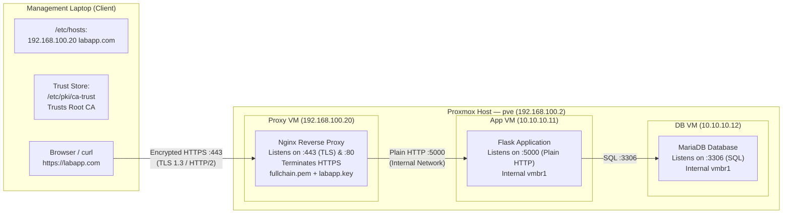

---

## Authoritative Standards & Primary Sources

| Standard / Reference               | Organization / Source   | Direct Specification Link                                                                                                                                                                     | Key Application in This Guide                                                                                                 |
| ---------------------------------- | ----------------------- | --------------------------------------------------------------------------------------------------------------------------------------------------------------------------------------------- | ----------------------------------------------------------------------------------------------------------------------------- |
| **RFC 5280**                       | IETF PKIX Working Group | [IETF RFC 5280](https://datatracker.ietf.org/doc/html/rfc5280)                                                                                                                                | Defines X.509 v3 structure, `basicConstraints`, `keyUsage`, path length limits (`pathlen:0`), and certificate chaining rules. |
| **RFC 6125**                       | IETF                    | [IETF RFC 6125](https://datatracker.ietf.org/doc/html/rfc6125)                                                                                                                                | Mandates Subject Alternative Names (`subjectAltName`) for domain verification; establishes Common Name (`CN`) deprecation.    |
| **RFC 8446**                       | IETF                    | [IETF RFC 8446](https://datatracker.ietf.org/doc/html/rfc8446)                                                                                                                                | Defines the TLS 1.3 protocol, handshake optimization, and modern AEAD cipher suites.                                          |
| **NIST SP 800-57 Part 1 Rev. 5**   | NIST                    | [NIST SP 800-57 Part 1](https://csrc.nist.gov/publications/detail/sp/800-57-part-1/rev-5/final)                                                                                               | Prescribes minimum cryptographic key lengths: RSA 4096-bit for long-lived Root CAs, RSA 2048-bit for operational servers.     |
| **NIST SP 800-52 Rev. 2**          | NIST                    | [NIST SP 800-52 Rev. 2](https://csrc.nist.gov/publications/detail/sp/800-52/rev-2/final)                                                                                                      | Guidelines for selecting and configuring secure TLS server protocol versions and cipher suites.                               |
| **Baseline Requirements v2.0**     | CA/Browser Forum        | [CAB Forum Baseline Requirements](https://cabforum.org/working-groups/server-certificate/baseline-requirements/)                                                                              | Enforces maximum 398-day validity for server TLS certificates (`default_days = 397`).                                         |
| **OpenSSL Configuration Manual**   | OpenSSL Project         | [OpenSSL x509v3_config(5)](https://www.openssl.org/docs/manmaster/man5/x509v3_config.html)                                                                                                    | Formal syntax reference for `openssl.cnf` extension blocks (`v3_ca`, `server_cert`, `req_ext`).                               |
| **OpenSSL Utilities Manual**       | OpenSSL Project         | [OpenSSL ca(1)](https://www.openssl.org/docs/manmaster/man1/openssl-ca.html) & [req(1)](https://www.openssl.org/docs/manmaster/man1/openssl-req.html)                                         | Operational syntax for CA database management and CSR processing.                                                             |
| **Nginx SSL Engine Documentation** | Nginx / F5              | [Nginx ngx_http_ssl_module](https://nginx.org/en/docs/http/ngx_http_ssl_module.html)                                                                                                          | Directive syntax for `ssl_certificate`, `ssl_ciphers`, session caching, and ALPN/HTTP2 negotiation.                           |
| **Mozilla Modern TLS Profile**     | Mozilla Security        | [Mozilla SSL Configuration Generator](https://ssl-config.mozilla.org/)                                                                                                                        | Battle-tested cipher whitelist providing Perfect Forward Secrecy (PFS) via ECDHE.                                             |
| **RHEL 9 Crypto & Trust Guide**    | Red Hat / AlmaLinux     | [RHEL 9 Security Hardening](https://access.redhat.com/documentation/en-us/red_hat_enterprise_linux/9/html/security_hardening/using-the-system-wide-cryptographic-policies_security-hardening) | Mechanics of `/etc/pki/ca-trust/source/anchors/` and `update-ca-trust extract`.                                               |

---

## 1 · Architecture, Request Flow & TLS Offloading



### Environment Matrix

| Host / Node | Role | Addressing / Interfaces | Access / Context |
|---|---|---|---|
| **Management Laptop** | Client & CA Workspace | `192.168.100.10` on `enp0s31f6` | Local terminal: `[aw16@laptop ~]$` |
| **Proxy VM** | Edge Reverse Proxy (TLS Termination) | `192.168.100.20` (`ens18` LAN) + `10.10.10.10` (`ens19` Internal) | `ssh root@192.168.100.20` |
| **App VM** | Application Backend (Flask) | `10.10.10.11` (`ens18` Internal) | Internal proxy target: `10.10.10.11:5000` |
| **DB VM** | Database Tier (MariaDB) | `10.10.10.12` (`ens18` Internal) | Backend DB target: `10.10.10.12:3306` |

> [!info] Concept: Why TLS Termination (SSL Offloading)?
> - **Analogy**: Nginx acts like a **corporate security receptionist**. External visitors present credentials and decrypt briefcases at the front desk (TLS handshake). Decrypted requests are walked down private internal hallways (`vmbr1`) as plaintext HTTP to internal workers (Flask).
> - **CPU Offload**: High-cost asymmetric key exchanges (ECDHE) and symmetric AES encryption are handled by optimized Nginx worker processes, leaving Flask CPU cycles dedicated to business logic.
> - **Centralization**: Certificates and security policies are updated on one edge node rather than reconfiguring dozens of backend microservices.

---

## 2 · Phase 1: Local Name Resolution (`/etc/hosts`)

Because `labapp.com` is a private lab domain, static resolution must be mapped on the client machine before external DNS lookups take place.

```bash
# [aw16@laptop ~]$ Add static DNS entry to /etc/hosts:
sudo bash -c 'echo "192.168.100.20 labapp.com" >> /etc/hosts'

# Verify resolution:
ping -c 3 labapp.com
```

> [!warning] The GoDaddy / DNS-over-HTTPS (DoH) Trap
> Modern browsers often enable **DNS-over-HTTPS (DoH)** by default, which **bypasses `/etc/hosts`** and routes queries to public resolvers (Cloudflare/Google). Since `labapp.com` is a registered public domain, public DNS resolves it to GoDaddy (`34.102.136.180`).
> 
> **Fix**: Disable "Secure DNS" in browser settings, set it to "System Resolver", or test using an **Incognito Window** / CLI `curl`. Reference: [IETF RFC 8484 — DNS Queries over HTTPS (DoH)](https://datatracker.ietf.org/doc/html/rfc8484).

---

## 3 · Phase 2: CA Directory & Database Architecture

We construct the CA workspace under `~/pki-ca`. OpenSSL requires a flat-file database schema to track issued certificates, maintain serial counters, and archive signed outputs.

```bash
# [aw16@laptop ~]$ Initialize CA workspace hierarchy:
mkdir -p ~/pki-ca/{root-ca,intermediate-ca}/{certs,crl,newcerts,private}
mkdir -p ~/pki-ca/server

# Restrict private key directories (Owner read/write/execute only):
chmod 700 ~/pki-ca/{root-ca,intermediate-ca}/private

# Initialize OpenSSL accounting databases and serial state:
touch ~/pki-ca/root-ca/index.txt
touch ~/pki-ca/intermediate-ca/index.txt
echo 1000 > ~/pki-ca/root-ca/serial
echo 1000 > ~/pki-ca/intermediate-ca/serial
```

> [!tip] Concept: Why Empty Files and Folders? (The Filing Cabinet Analogy)
> OpenSSL is not just an encryption tool; it acts as a **strict database ledger**:
> - `index.txt`: A blank accounting ledger. OpenSSL records every certificate signed (`V` = Valid, `R` = Revoked, `E` = Expired). Without this file, OpenSSL aborts.
> - `serial`: Hexadecimal ticket counter. [RFC 5280 §4.1.2.2](https://datatracker.ietf.org/doc/html/rfc5280#section-4.1.2.2) requires globally unique serial numbers. OpenSSL reads this, issues the cert with serial `1000`, and auto-increments it to `1001`.
> - `newcerts/`: Automated archive drawer. Every signed certificate is copied here by serial (e.g. `1000.pem`) for historical auditing.

---

## 4 · Phase 3: Creating the Offline Root Certificate Authority

The **Root CA** is the sovereign trust anchor (4096-bit RSA, 10-year validity, self-signed).

> [!important] Presentation Defense: Why `.cnf` Files Instead of Interactive Prompts?
> 1. **Mandatory SAN Support**: Interactive OpenSSL prompts only ask for Common Name (`CN`). Modern browsers strictly enforce [RFC 6125](https://datatracker.ietf.org/doc/html/rfc6125) and ignore `CN`. Subject Alternative Names (`subjectAltName`) require a configuration file.
> 2. **X.509v3 Constraints**: Strict CA constraints (`basicConstraints = critical, CA:true`, `pathlen:0`) cannot be set interactively.
> 3. **Infrastructure as Code (DevSecOps)**: Declarative configuration files guarantee reproducibility, eliminate human typing errors, and are auditable in version control.

### Step 3.1: Root CA Configuration (`~/pki-ca/root-ca/openssl.cnf`)

```ini
[ ca ]
default_ca = CA_default                 # Default CA section to reference

[ CA_default ]
# Directory and file locations for Root CA accounting
dir               = /home/aw16/pki-ca/root-ca
certs             = $dir/certs           # Storage for issued public certificates
crl_dir           = $dir/crl             # Storage for Certificate Revocation Lists
new_certs_dir     = $dir/newcerts        # Mandatory archive directory (serial.pem)
database          = $dir/index.txt       # Flat-file database index
serial            = $dir/serial          # Serial number tracking counter
RANDFILE          = $dir/private/.rand   # Random seed file

private_key       = $dir/private/root-ca.key  # Protected Root CA private signing key
certificate       = $dir/certs/root-ca.crt    # Public Root CA certificate

default_md        = sha256               # Cryptographic digest algorithm (SHA-256)
name_opt          = ca_default           # Subject naming display format
cert_opt          = ca_default           # Certificate display format
default_days      = 3650                 # 10-year validity (NIST SP 800-57 long-term recommendation)
preserve          = no                   # Reorder DN attributes to standard format
policy            = policy_strict        # Enforce strict subject matching on subordinate certs

[ policy_strict ]
# Subordinate certificates must strictly match the Root CA's organization and country
countryName             = match          # Must match "PH"
stateOrProvinceName     = optional
organizationName        = match          # Must match "AirNav DAS Lab"
organizationalUnitName  = optional
commonName              = supplied       # Must be explicitly provided in CSR
emailAddress            = optional

[ req ]
# Parameters for certificate request generation
default_bits        = 4096               # 4096-bit RSA key modulus (NIST SP 800-57)
distinguished_name  = req_distinguished_name
string_mask         = utf8only           # UTF-8 character encoding
default_md          = sha256
prompt              = no                 # Non-interactive mode (Infrastructure as Code)

[ req_distinguished_name ]
# Subject identity fields for Root CA
countryName                     = PH
organizationName                = AirNav DAS Lab
commonName                      = AirNav DAS Root CA

[ v3_ca ]
# Extensions applied when Root CA generates its self-signed certificate (RFC 5280)
subjectKeyIdentifier   = hash            # Unique public key identifier (SHA-1 hash per RFC 5280 §4.2.1.2)
authorityKeyIdentifier = keyid:always,issuer
basicConstraints       = critical, CA:true # Declares this is a CA. Critical flag mandates client abort if unrecognized.
keyUsage               = critical, digitalSignature, cRLSign, keyCertSign # Restricts cryptographic operations to cert/CRL signing

[ v3_intermediate_ca ]
# Extensions applied when Root CA signs an Intermediate CA
subjectKeyIdentifier   = hash
authorityKeyIdentifier = keyid:always,issuer
# pathlen:0 limits subordinate depth: Intermediate CA can sign end-entities, but CANNOT create further child CAs
basicConstraints       = critical, CA:true, pathlen:0
keyUsage               = critical, digitalSignature, cRLSign, keyCertSign
```

### Step 3.2: Generate Root Private Key & Self-Signed Certificate

```bash
# [aw16@laptop ~]$ Generate 4096-bit AES-256 encrypted Root Private Key:
cd ~/pki-ca/root-ca
openssl genrsa -aes256 -out private/root-ca.key 4096
chmod 400 private/root-ca.key

# Generate Self-Signed Root Certificate:
openssl req -config openssl.cnf \
    -key private/root-ca.key \
    -new -x509 -days 3650 -sha256 \
    -extensions v3_ca \
    -out certs/root-ca.crt
chmod 444 certs/root-ca.crt

# Verify Root Certificate constraints:
openssl x509 -noout -text -in certs/root-ca.crt
```

**Verification Checklist**:
- [x] `Issuer` and `Subject` are identical (`CN = AirNav DAS Root CA`) $\to$ Proves self-signed trust anchor.
- [x] `X509v3 Basic Constraints: critical` with `CA:TRUE` $\to$ Conforms to [RFC 5280 §4.2.1.9](https://datatracker.ietf.org/doc/html/rfc5280#section-4.2.1.9).
- [x] `X509v3 Key Usage: critical` includes `Certificate Sign, CRL Sign`.

---

## 5 · Phase 4: Creating the Issuing Intermediate Certificate Authority

The **Intermediate CA** signs day-to-day server certificates, keeping the Root key offline and protected.

### Step 4.1: Intermediate CA Configuration (`~/pki-ca/intermediate-ca/openssl.cnf`)

```ini
[ ca ]
default_ca = CA_default

[ CA_default ]
# Directory and file locations for Intermediate CA accounting
dir               = /home/aw16/pki-ca/intermediate-ca
certs             = $dir/certs
crl_dir           = $dir/crl
new_certs_dir     = $dir/newcerts
database          = $dir/index.txt
serial            = $dir/serial
RANDFILE          = $dir/private/.rand

private_key       = $dir/private/intermediate-ca.key
certificate       = $dir/certs/intermediate-ca.crt

default_md        = sha256
name_opt          = ca_default
cert_opt          = ca_default
default_days      = 1825                 # 5-year operational validity
preserve          = no
policy            = policy_loose         # Relaxed DN policy for issuing diverse end-entity certificates
copy_extensions   = copy                 # CRITICAL: Copies SAN extensions from CSR while preserving CA server_cert profile

[ policy_loose ]
# Loose policy allows leaf certificates with flexible organizational units
countryName             = optional
stateOrProvinceName     = optional
localityName            = optional
organizationName        = optional
organizationalUnitName  = optional
commonName              = optional       # Modern 2026 standard: CN is optional/deprecated
emailAddress            = optional

[ req ]
default_bits        = 4096
distinguished_name  = req_distinguished_name
string_mask         = utf8only
default_md          = sha256
prompt              = no

[ req_distinguished_name ]
countryName                     = PH
organizationName                = AirNav DAS Lab
commonName                      = AirNav DAS Intermediate CA

[ server_cert ]
# Profile applied when Intermediate CA signs leaf web server certificates
basicConstraints       = critical, CA:FALSE # Strict boundary: Leaf certificates CANNOT act as a CA
subjectKeyIdentifier   = hash
authorityKeyIdentifier = keyid,issuer:always
keyUsage               = critical, digitalSignature, keyEncipherment # Authorizes TLS key exchange
extendedKeyUsage       = serverAuth         # Authorizes TLS Web Server authentication (RFC 5280 §4.2.1.12)
```

### Step 4.2: Generate Intermediate Key, CSR & Sign with Root CA

```bash
# [aw16@laptop ~]$ 1. Generate encrypted Intermediate Private Key:
cd ~/pki-ca/intermediate-ca
openssl genrsa -aes256 -out private/intermediate-ca.key 4096
chmod 400 private/intermediate-ca.key

# 2. Generate Certificate Signing Request (CSR / PKCS#10):
# Note: No -x509 flag here; produces an unsigned request with Proof of Possession
openssl req -config openssl.cnf -new -sha256 \
    -key private/intermediate-ca.key \
    -out intermediate-ca.csr

# 3. Sign the Intermediate CSR using Root CA:
cd ~/pki-ca/root-ca
openssl ca -config openssl.cnf -extensions v3_intermediate_ca \
    -days 1825 -notext -md sha256 \
    -in ~/pki-ca/intermediate-ca/intermediate-ca.csr \
    -out ~/pki-ca/intermediate-ca/certs/intermediate-ca.crt
chmod 444 ~/pki-ca/intermediate-ca/certs/intermediate-ca.crt

# 4. Verify cryptographic signature chain against Root CA:
openssl verify -CAfile ~/pki-ca/root-ca/certs/root-ca.crt \
    ~/pki-ca/intermediate-ca/certs/intermediate-ca.crt
```
*Expected Output*: `/home/aw16/pki-ca/intermediate-ca/certs/intermediate-ca.crt: OK`

---

## 6 · Phase 5: Issuing the Web Server Certificate for `labapp.com`

### Step 5.1: Server Request Configuration (`~/pki-ca/server/server_req.cnf`)

```ini
[ req ]
default_bits        = 2048               # 2048-bit RSA for leaf server (NIST SP 800-57 compliant)
distinguished_name  = req_distinguished_name
req_extensions      = req_ext            # Inject SAN extension into the generated CSR
prompt              = no

[ req_distinguished_name ]
countryName         = PH
organizationName    = AirNav DAS Lab
# Common Name (CN) vs SAN in September 2026:
# CAB Forum Baseline Requirements §7.1.4.2.2 states CAs SHOULD NOT include a commonName attribute.
# Modern public CAs (Let's Encrypt, Google Trust Services) omit CN completely.
# For backward compatibility with legacy non-browser TLS clients, commonName can mirror DNS.1:
commonName          = labapp.com

[ req_ext ]
subjectAltName      = @alt_names         # Maps Subject Alternative Names block

[ alt_names ]
# Modern browsers validate TLS certificates SOLELY against these SAN entries (RFC 6125):
DNS.1   = labapp.com                     # Primary domain
DNS.2   = *.labapp.com                   # Wildcard subdomain
IP.1    = 192.168.100.20                 # Public edge Proxy VM IP (Direct IP TLS access)
IP.2    = 10.10.10.10                    # Internal interface Proxy VM IP
```

### Step 5.2: Generate Server Key, CSR & Sign with Intermediate CA

```bash
# [aw16@laptop ~]$ 1. Generate unencrypted server private key:
# Key is intentionally unencrypted so Nginx reloads unattended without freezing for a passphrase
cd ~/pki-ca/server
openssl genrsa -out labapp.key 2048
chmod 600 labapp.key

# 2. Generate Server CSR containing SAN extensions:
openssl req -new -key labapp.key -out labapp.csr -config server_req.cnf

# Verify CSR payload and requested SAN attributes before signing:
openssl req -in labapp.csr -text -noout | grep -A 4 "Requested Extensions:"

# 3. Sign Server CSR using Intermediate CA:
# copy_extensions = copy in openssl.cnf merges the CSR's SANs while applying [ server_cert ]
cd ~/pki-ca/intermediate-ca
openssl ca -config openssl.cnf -extensions server_cert \
    -days 397 -notext -md sha256 \
    -in ~/pki-ca/server/labapp.csr \
    -out ~/pki-ca/server/labapp.crt
chmod 444 ~/pki-ca/server/labapp.crt
```

> [!caution] The Double `-extensions` OpenSSL Trap
> In OpenSSL CLI, passing `-extensions` twice (e.g. `-extensions server_cert ... -extensions req_ext`) **does not merge them**. The second flag silently overwrites the first, stripping `basicConstraints: CA:FALSE` and `extendedKeyUsage`. 
> The enterprise-grade solution is setting `copy_extensions = copy` inside the CA's `openssl.cnf`, allowing the CA to enforce its strict `server_cert` profile while importing client-requested SANs from the CSR.

```bash
# Verify both CA constraints and SANs are present:
openssl x509 -in ~/pki-ca/server/labapp.crt -text -noout | grep -A 10 "X509v3 extensions:"

# 4. Assemble Full Certificate Chain (Leaf + Intermediate):
cd ~/pki-ca/server
cat labapp.crt ~/pki-ca/intermediate-ca/certs/intermediate-ca.crt > fullchain.pem

# 5. Verify local trust chain against Root CA:
openssl verify -CAfile ~/pki-ca/root-ca/certs/root-ca.crt \
    -untrusted ~/pki-ca/intermediate-ca/certs/intermediate-ca.crt \
    labapp.crt
```

> [!danger] The Golden Chain Rule (RFC 5280)
> When building `fullchain.pem`:
> 1. **First**: `labapp.crt` (Leaf server certificate)
> 2. **Second**: `intermediate-ca.crt` (Intermediate CA certificate)
> 
> **Never include `root-ca.crt` in `fullchain.pem`!** Clients must already possess the Root CA in their trust store. Sending the Root CA over the wire violates [RFC 5280](https://datatracker.ietf.org/doc/html/rfc5280), bloats TLS handshake packets, and proves nothing cryptographically.

---

## 7 · Phase 6: Proxy VM Deployment & Hardening Nginx

### Step 6.1: Transfer Certificates & Set Security Contexts

```bash
# [aw16@laptop ~]$ Create SSL directory and transfer files to Proxy VM:
ssh root@192.168.100.20 "mkdir -p /etc/nginx/ssl && chmod 700 /etc/nginx/ssl"
scp ~/pki-ca/server/fullchain.pem root@192.168.100.20:/etc/nginx/ssl/
scp ~/pki-ca/server/labapp.key root@192.168.100.20:/etc/nginx/ssl/

# Connect to Proxy VM:
ssh root@192.168.100.20
```

```bash
# [root@proxy ~]# Enforce least-privilege permissions:
chmod 644 /etc/nginx/ssl/fullchain.pem
chmod 600 /etc/nginx/ssl/labapp.key
chown -R root:root /etc/nginx/ssl

# Restore SELinux labels (resets admin_home_t -> cert_t/etc_t for Nginx):
restorecon -Rv /etc/nginx/ssl
```

### Step 6.2: Deploy Hardened Nginx Virtual Host (`/etc/nginx/conf.d/labapp.conf`)

```nginx
# 1. HTTP Server — Automatic Redirect to HTTPS (RFC 7231 §6.4.2)
server {
    listen 80;                           # Listen on unencrypted Port 80
    server_name labapp.com 192.168.100.20;
    return 301 https://$host$request_uri; # Permanent upgrade to TLS channel
}

# 2. HTTPS Server — Modern TLS 1.2 / 1.3 Termination
server {
    # Port 443 with TLS and HTTP/2 multiplexing (Nginx 1.20 AlmaLinux 9 syntax)
    listen 443 ssl http2;
    server_name labapp.com 192.168.100.20;

    # Cryptographic Material
    ssl_certificate         /etc/nginx/ssl/fullchain.pem; # Leaf + Intermediate bundle
    ssl_certificate_key     /etc/nginx/ssl/labapp.key;    # Unencrypted server private key

    # Protocol Hardening (NIST SP 800-52 & Mozilla Modern compliant)
    ssl_protocols TLSv1.2 TLSv1.3;        # Legacy SSLv3, TLS 1.0, and TLS 1.1 disabled
    ssl_ciphers ECDHE-ECDSA-AES128-GCM-SHA256:ECDHE-RSA-AES128-GCM-SHA256:ECDHE-ECDSA-AES256-GCM-SHA384:ECDHE-RSA-AES256-GCM-SHA384:DHE-RSA-AES128-GCM-SHA256:DHE-RSA-AES256-GCM-SHA384;
    ssl_prefer_server_ciphers off;       # Client selects preferred cipher under TLS 1.3

    # TLS Session Cache Optimization (Reduces TLS handshake CPU load)
    ssl_session_timeout 1d;
    ssl_session_cache shared:SSL:10m;    # 10MB shared cache (~40,000 active sessions)
    ssl_session_tickets off;

    # Reverse Proxy to Internal App VM
    location / {
        proxy_pass http://10.10.10.11:5000; # Forward decrypted traffic to Flask
        proxy_set_header Host               $host;
        proxy_set_header X-Real-IP          $remote_addr;
        proxy_set_header X-Forwarded-For    $proxy_add_x_forwarded_for;
        proxy_set_header X-Forwarded-Proto  $scheme; # Signals "https" to backend Flask app
    }
}
```

### Step 6.3: Open Firewall, Adjust SELinux & Reload Nginx

```bash
# [root@proxy ~]# 1. Open HTTPS port in firewalld:
firewall-cmd --permanent --add-service=https
firewall-cmd --reload

# 2. Enable outbound proxy connections in SELinux:
setsebool -P httpd_can_network_connect 1

# 3. Test configuration and reload service:
nginx -t
systemctl reload nginx
```

---

## 8 · Phase 7: Installing Root CA on Client Trust Stores

```bash
# [aw16@laptop ~]$ Install Root CA into system anchor repository:
sudo cp ~/pki-ca/root-ca/certs/root-ca.crt /etc/pki/ca-trust/source/anchors/

# Rebuild system PKI trust database (curl, git, OpenSSL, Python):
sudo update-ca-trust extract
```

> [!note] Browser Specific Trust
> - **Google Chrome / Edge (Linux)**: Automatically utilizes the NSS system database updated by `update-ca-trust`. Restart browser to apply.
> - **Mozilla Firefox**: Uses an internal trust store. Open `Settings` $\to$ `Privacy & Security` $\to$ `Certificates` $\to$ `View Certificates...` $\to$ `Authorities` tab $\to$ Click `Import...` $\to$ Select `root-ca.crt` $\to$ Check *"Trust this CA to identify websites"* $\to$ Click `OK`.

---

## 9 · Phase 8: End-to-End Verification

Execute from your management laptop:

### Test 1: Clean `curl` Verification (Zero Insecure Flags)
```bash
curl -v https://labapp.com/
```
**Success Indicators**:
- `* ALPN: server accepted h2` $\to$ HTTP/2 negotiated.
- `* SSL connection using TLSv1.3 / TLS_AES_256_GCM_SHA384` $\to$ Modern cipher active.
- `* subjectAltName: host "labapp.com" matched cert's "labapp.com"` $\to$ SAN validated.
- `* SSL certificate verify ok.` $\to$ Trusted back to internal Root CA.
- Returns HTML payload: `<h1>Hello from the App VM</h1><p>DB says: Hello from the DB VM!</p>`

### Test 2: HTTP $\to$ HTTPS 301 Redirect Check
```bash
curl -I http://labapp.com/
# Output must show: HTTP/1.1 301 Moved Permanently -> Location: https://labapp.com/
```

### Test 3: Raw TLS Certificate Chain Inspection
```bash
openssl s_client -connect labapp.com:443 -servername labapp.com </dev/null
# Output must show:
# 0 s:CN = labapp.com -> i:CN = AirNav DAS Intermediate CA
# 1 s:CN = AirNav DAS Intermediate CA -> i:CN = AirNav DAS Root CA
# Verification: OK
```

---

## 10 · Presentation Playbook: Proving Nginx Terminates TLS

Use this live demonstration to prove to evaluators that **Nginx terminates HTTPS at the edge** while Flask remains unburdened:

### Proof 1: Active Listening Sockets (`ss`)
```bash
# [root@proxy ~]# Show processes bound to web ports:
ss -tulpn | grep -E ":80|:443"
# Output confirms process "nginx" is listening on 0.0.0.0:443 and 0.0.0.0:80
```

### Proof 2: The Smoking Gun — Live Packet Capture (`tcpdump`)
Open **two terminals** on the Proxy VM:

```bash
# Terminal 1: Monitor public interface ens18 (Laptop -> Proxy)
tcpdump -i ens18 -nn -s 0 -A 'tcp port 443'

# Terminal 2: Monitor internal interface ens19 (Proxy -> App VM)
tcpdump -i ens19 -nn -s 0 -A 'tcp port 5000'
```

Now execute `curl https://labapp.com/` from your laptop:
- **`ens18` (Port 443)** displays **binary ciphertext** (scrambled TLS 1.3 payload).
- **`ens19` (Port 5000)** displays **cleartext ASCII HTTP**:
  ```http
  GET / HTTP/1.0
  Host: labapp.com
  X-Forwarded-Proto: https
  ```
> **Presentation Script**:
> *"This side-by-side packet capture proves TLS offloading. The packet entering `ens18` is mathematically encrypted via TLS 1.3. Nginx decrypts it in memory and transmits cleartext HTTP over the isolated `ens19` network to Flask on Port 5000. The backend never handles cryptographic certificates."*

---

## 11 · Troubleshooting & Common Pitfalls

> [!bug]- Bug 1 — `curl: (60) SSL certificate problem: unable to get local issuer certificate`
> **Root Cause**: Incomplete certificate chain in `fullchain.pem` (omitted Intermediate CA) or client trust store missing `root-ca.crt`.  
> **Fix**: Verify `fullchain.pem` has two certificate blocks, and rerun `sudo update-ca-trust extract` on the client.

> [!bug]- Bug 2 — Browser error: `ERR_CERT_COMMON_NAME_INVALID`
> **Root Cause**: Certificate was generated without Subject Alternative Names (`subjectAltName`). Modern browsers ignore Common Name.  
> **Fix**: Re-sign certificate using `server_req.cnf` containing `[ req_ext ]` with `subjectAltName = @alt_names`.

> [!bug]- Bug 3 — `502 Bad Gateway` on HTTPS
> **Root Cause**: TLS terminated successfully at Nginx, but SELinux blocked Nginx from opening outbound sockets to `10.10.10.11:5000`.  
> **Fix**: Run `setsebool -P httpd_can_network_connect 1` on the Proxy VM.

> [!bug]- Bug 4 — Nginx startup fails with `Permission denied` on `labapp.key`
> **Root Cause**: SELinux file context mismatch. SCP-transferred files inherit `admin_home_t` instead of `cert_t`.  
> **Fix**: Run `restorecon -Rv /etc/nginx/ssl` on the Proxy VM.

> [!bug]- Bug 5 — `nginx: [emerg] unknown directive "http2"`
> **Root Cause**: AlmaLinux 9 ships with Nginx 1.20 where `http2` is a parameter of `listen`, not a standalone directive (introduced in 1.25.1+).  
> **Fix**: Use `listen 443 ssl http2;` instead of `http2 on;`.

> [!bug]- Bug 6 — Browser redirects `labapp.com` to GoDaddy parking page
> **Root Cause**: Browser Secure DNS (DoH) active, bypassing `/etc/hosts`.  
> **Fix**: Turn off Secure DNS in browser settings or use Incognito mode.
