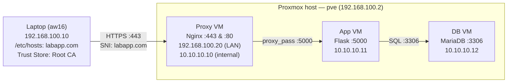

---
tags:
  - cybersecurity
  - pki
  - certificates
  - openssl
  - nginx
  - tls
  - task-guide
  - runbook
reading-order: 5.1
created: 2026-09-21
---

# Task Guide — 2-Tier PKI, Root/Intermediate CAs & Nginx HTTPS Setup

> [!abstract] The Objective
> Build a production-grade **2-Tier Public Key Infrastructure (PKI)** with an **Offline Root CA** and an **Issuing Intermediate CA** using OpenSSL on your AlmaLinux management laptop. Use this CA hierarchy to issue a cryptographically signed TLS certificate for **`labapp.com`** (with Subject Alternative Names). Secure the **Nginx Proxy VM (`192.168.100.20`)** with HTTPS on Port 443 and an automatic HTTP-to-HTTPS redirect, configure local DNS resolution via `/etc/hosts`, and install the Root CA into your client trust stores to achieve a warning-free **green padlock**.

---

## 1 · Architecture & Environment Reference

This task directly extends your verified 3-tier Proxmox environment:



| Host / Node | Role | Addressing / Interface | Access Command |
|---|---|---|---|
| **Management Laptop** | Client & CA Host (runs OpenSSL, curl, browser) | `192.168.100.10` on `enp0s31f6` | Local terminal: `[aw16@laptop ~]$` |
| **Proxy VM** | Front-end Reverse Proxy (terminates HTTPS :443) | `192.168.100.20` (`ens18`) + `10.10.10.10` (`ens19`) | `ssh root@192.168.100.20` |
| **App VM** | Middle-tier Logic (Flask internal service) | `10.10.10.11` (`ens18`) | `ssh -J root@192.168.100.2 root@10.10.10.11` |
| **DB VM** | Backend Data Tier (MariaDB internal service) | `10.10.10.12` (`ens18`) | `ssh -J root@192.168.100.2 root@10.10.10.12` |

---

## 2 · Phase 1: Local DNS Mapping on the Laptop

Because `labapp.com` is a private lab domain, map it in your laptop's local resolver:

```bash
# [aw16@laptop ~]$
sudo bash -c 'echo "192.168.100.20 labapp.com" >> /etc/hosts'
```

**Verify resolution:**
```bash
# [aw16@laptop ~]$
ping -c 2 labapp.com
```
*Expected result:* Responds from `192.168.100.20`.

---

## 3 · Phase 2: Building the CA Directory Hierarchy

We will execute all CA operations on your laptop inside a dedicated workspace: `~/pki-ca`.

```bash
# [aw16@laptop ~]$
mkdir -p ~/pki-ca/{root-ca,intermediate-ca}/{certs,crl,newcerts,private}
mkdir -p ~/pki-ca/server

# Secure private key directories so only your user can read them:
chmod 700 ~/pki-ca/{root-ca,intermediate-ca}/private

# Initialize OpenSSL flat-file databases and serial tracking:
touch ~/pki-ca/root-ca/index.txt
touch ~/pki-ca/intermediate-ca/index.txt
echo 1000 > ~/pki-ca/root-ca/serial
echo 1000 > ~/pki-ca/intermediate-ca/serial
```

---

## 4 · Phase 3: Creating the Root Certificate Authority

The Root CA is self-signed, uses a 4096-bit RSA key protected by a passphrase, and has a 10-year validity period (3,650 days).

### Step 3.1: Create Root CA OpenSSL Configuration
Create `~/pki-ca/root-ca/openssl.cnf`:

```bash
# [aw16@laptop ~]$
cat <<'EOF' > ~/pki-ca/root-ca/openssl.cnf
[ ca ]
default_ca = CA_default

[ CA_default ]
dir               = /home/aw16/pki-ca/root-ca
certs             = $dir/certs
crl_dir           = $dir/crl
new_certs_dir     = $dir/newcerts
database          = $dir/index.txt
serial            = $dir/serial
RANDFILE          = $dir/private/.rand

private_key       = $dir/private/root-ca.key
certificate       = $dir/certs/root-ca.crt

default_md        = sha256
name_opt          = ca_default
cert_opt          = ca_default
default_days      = 3650
preserve          = no
policy            = policy_strict

[ policy_strict ]
countryName             = match
stateOrProvinceName     = optional
organizationName        = match
organizationalUnitName  = optional
commonName              = supplied
emailAddress            = optional

[ req ]
default_bits        = 4096
distinguished_name  = req_distinguished_name
string_mask         = utf8only
default_md          = sha256
prompt              = no

[ req_distinguished_name ]
countryName                     = PH
organizationName                = AirNav DAS Lab
commonName                      = AirNav DAS Root CA

[ v3_ca ]
subjectKeyIdentifier   = hash
authorityKeyIdentifier = keyid:always,issuer
basicConstraints       = critical, CA:true
keyUsage               = critical, digitalSignature, cRLSign, keyCertSign

[ v3_intermediate_ca ]
subjectKeyIdentifier   = hash
authorityKeyIdentifier = keyid:always,issuer
basicConstraints       = critical, CA:true, pathlen:0
keyUsage               = critical, digitalSignature, cRLSign, keyCertSign
EOF
```

### Step 3.2: Generate Root Private Key
```bash
# [aw16@laptop ~]$
cd ~/pki-ca/root-ca
openssl genrsa -aes256 -out private/root-ca.key 4096
```
> [!tip] Passphrase Prompt
> OpenSSL will prompt for an encryption passphrase (e.g. `RootCAPass123!`). Memorize or store this securely.

Lock permissions:
```bash
# [aw16@laptop ~]$
chmod 400 private/root-ca.key
```

### Step 3.3: Generate Self-Signed Root Certificate
```bash
# [aw16@laptop ~]$
openssl req -config openssl.cnf \
    -key private/root-ca.key \
    -new -x509 -days 3650 -sha256 \
    -extensions v3_ca \
    -out certs/root-ca.crt
```
Enter your Root CA passphrase when prompted.

Lock permissions:
```bash
# [aw16@laptop ~]$
chmod 444 certs/root-ca.crt
```

### Step 3.4: Verify Root Certificate
```bash
# [aw16@laptop ~]$
openssl x509 -noout -text -in certs/root-ca.crt
```
**Verification Checklist:**
- `Issuer` matches `Subject` (`CN = AirNav DAS Root CA`) — proves it is self-signed.
- `X509v3 Basic Constraints`: `critical, CA:TRUE` — proves it is a valid Root CA.
- `X509v3 Key Usage`: `Certificate Sign, CRL Sign`.

---

## 5 · Phase 4: Creating the Intermediate Certificate Authority

The Intermediate CA acts as the active issuer for day-to-day server certificates. It is signed by the Root CA with a 5-year validity period (1,825 days) and `pathlen:0`.

### Step 4.1: Create Intermediate CA OpenSSL Configuration
Create `~/pki-ca/intermediate-ca/openssl.cnf`:

```bash
# [aw16@laptop ~]$
cat <<'EOF' > ~/pki-ca/intermediate-ca/openssl.cnf
[ ca ]
default_ca = CA_default

[ CA_default ]
dir               = /home/aw16/pki-ca/intermediate-ca
certs             = $dir/certs
crl_dir           = $dir/crl
new_certs_dir     = $dir/newcerts
database          = $dir/index.txt
serial            = $dir/serial
RANDFILE          = $dir/private/.rand

private_key       = $dir/private/intermediate-ca.key
certificate       = $dir/certs/intermediate-ca.crt

default_md        = sha256
name_opt          = ca_default
cert_opt          = ca_default
default_days      = 1825
preserve          = no
policy            = policy_loose

[ policy_loose ]
countryName             = optional
stateOrProvinceName     = optional
localityName            = optional
organizationName        = optional
organizationalUnitName  = optional
commonName              = supplied
emailAddress            = optional

[ req ]
default_bits        = 4096
distinguished_name  = req_distinguished_name
string_mask         = utf8only
default_md          = sha256
prompt              = no

[ req_distinguished_name ]
countryName                     = PH
organizationName                = AirNav DAS Lab
commonName                      = AirNav DAS Intermediate CA

[ server_cert ]
basicConstraints       = critical, CA:FALSE
subjectKeyIdentifier   = hash
authorityKeyIdentifier = keyid,issuer:always
keyUsage               = critical, digitalSignature, keyEncipherment
extendedKeyUsage       = serverAuth
EOF
```

### Step 4.2: Generate Intermediate Private Key & CSR
```bash
# [aw16@laptop ~]$
cd ~/pki-ca/intermediate-ca

# 1. Generate encrypted Intermediate key:
openssl genrsa -aes256 -out private/intermediate-ca.key 4096
chmod 400 private/intermediate-ca.key
```
Enter an intermediate passphrase (e.g. `InterCAPass123!`).

```bash
# 2. Generate Intermediate CSR:
# [aw16@laptop ~]$
openssl req -config openssl.cnf -new -sha256 \
    -key private/intermediate-ca.key \
    -out intermediate-ca.csr
```

### Step 4.3: Sign Intermediate Certificate with the Root CA
Now use the Root CA to sign the Intermediate CSR:

```bash
# [aw16@laptop ~]$
cd ~/pki-ca/root-ca
openssl ca -config openssl.cnf -extensions v3_intermediate_ca \
    -days 1825 -notext -md sha256 \
    -in ~/pki-ca/intermediate-ca/intermediate-ca.csr \
    -out ~/pki-ca/intermediate-ca/certs/intermediate-ca.crt
```
Enter your **Root CA passphrase**.
When prompted:
- `Sign the certificate? [y/n]:` type `y` and press Enter.
- `1 out of 1 certificate requests certified, commit? [y/n]:` type `y` and press Enter.

Lock permissions:
```bash
# [aw16@laptop ~]$
chmod 444 ~/pki-ca/intermediate-ca/certs/intermediate-ca.crt
```

### Step 4.4: Verify the Intermediate Certificate against Root CA
```bash
# [aw16@laptop ~]$
openssl verify -CAfile ~/pki-ca/root-ca/certs/root-ca.crt \
    ~/pki-ca/intermediate-ca/certs/intermediate-ca.crt
```
*Expected output:*
`~/pki-ca/intermediate-ca/certs/intermediate-ca.crt: OK`

---

## 6 · Phase 5: Issuing the Web Server Certificate for `labapp.com`

Now we generate the leaf certificate for Nginx. As mandated by RFC 6125 and modern browser engines, we inject **Subject Alternative Names (SAN)**.

### Step 5.1: Create the Server Request Configuration
```bash
# [aw16@laptop ~]$
cat <<'EOF' > ~/pki-ca/server/server_req.cnf
[ req ]
default_bits        = 2048
distinguished_name  = req_distinguished_name
req_extensions      = req_ext
prompt              = no

[ req_distinguished_name ]
countryName         = PH
organizationName    = AirNav DAS Lab
commonName          = labapp.com

[ req_ext ]
subjectAltName      = @alt_names

[ alt_names ]
DNS.1   = labapp.com
DNS.2   = *.labapp.com
IP.1    = 192.168.100.20
IP.2    = 10.10.10.10
EOF
```

### Step 5.2: Generate Server Private Key & CSR
```bash
# [aw16@laptop ~]$
cd ~/pki-ca/server

# Generate unencrypted private key (so Nginx reloads unattended):
openssl genrsa -out labapp.key 2048
chmod 600 labapp.key

# Generate CSR with SAN:
openssl req -new -key labapp.key -out labapp.csr -config server_req.cnf
```

### Step 5.3: Sign Server CSR with Intermediate CA
```bash
# [aw16@laptop ~]$
cd ~/pki-ca/intermediate-ca

openssl ca -config openssl.cnf -extensions server_cert \
    -extfile ~/pki-ca/server/server_req.cnf -extensions req_ext \
    -days 397 -notext -md sha256 \
    -in ~/pki-ca/server/labapp.csr \
    -out ~/pki-ca/server/labapp.crt
```
Enter your **Intermediate CA passphrase** (`InterCAPass123!`).
Confirm with `y` twice.

Lock permissions:
```bash
# [aw16@laptop ~]$
chmod 444 ~/pki-ca/server/labapp.crt
```

### Step 5.4: Assemble the Full Certificate Chain (`fullchain.pem`)
> [!important] The Chain Rule
> Concatenate the Server Certificate **first**, followed by the Intermediate CA. **Never append the Root CA!**

```bash
# [aw16@laptop ~]$
cd ~/pki-ca/server
cat labapp.crt ~/pki-ca/intermediate-ca/certs/intermediate-ca.crt > fullchain.pem
```

**Verify the assembled chain locally:**
```bash
# [aw16@laptop ~]$
openssl verify -CAfile ~/pki-ca/root-ca/certs/root-ca.crt \
    -untrusted ~/pki-ca/intermediate-ca/certs/intermediate-ca.crt \
    labapp.crt
```
*Expected output:* `labapp.crt: OK`

---

## 7 · Phase 6: Deploying to Proxy VM & Configuring Nginx

Now transfer the files to the Proxy VM and configure HTTPS.

### Step 7.1: Transfer Files to Proxy VM
From your laptop:
```bash
# [aw16@laptop ~]$
# Create SSL directory on Proxy VM:
ssh root@192.168.100.20 "mkdir -p /etc/nginx/ssl && chmod 700 /etc/nginx/ssl"

# Copy fullchain.pem and labapp.key:
scp ~/pki-ca/server/fullchain.pem root@192.168.100.20:/etc/nginx/ssl/
scp ~/pki-ca/server/labapp.key root@192.168.100.20:/etc/nginx/ssl/
```

### Step 7.2: Lock Permissions & Fix SELinux Contexts on Proxy VM
SSH into the Proxy VM:
```bash
# [aw16@laptop ~]$
ssh root@192.168.100.20
```

On the Proxy VM:
```bash
# [root@proxy ~]#
chmod 644 /etc/nginx/ssl/fullchain.pem
chmod 600 /etc/nginx/ssl/labapp.key
chown -R root:root /etc/nginx/ssl

# Restore SELinux file contexts so Nginx can read the certificates:
restorecon -Rv /etc/nginx/ssl
```

### Step 7.3: Deploy Hardened Nginx Virtual Host
Replace `/etc/nginx/conf.d/labapp.conf` on the Proxy VM:

```bash
# [root@proxy ~]#
cat <<'EOF' > /etc/nginx/conf.d/labapp.conf
# 1. HTTP Server — Automatic Redirect to HTTPS
server {
    listen 80;
    server_name labapp.com 192.168.100.20;
    return 301 https://$host$request_uri;
}

# 2. HTTPS Server — TLS 1.2 & TLS 1.3 Termination
server {
    listen 443 ssl;
    http2 on;
    server_name labapp.com 192.168.100.20;

    # Certificate Chain & Private Key
    ssl_certificate         /etc/nginx/ssl/fullchain.pem;
    ssl_certificate_key     /etc/nginx/ssl/labapp.key;

    # Secure TLS Protocols & Ciphers (NIST / Mozilla Modern compliant)
    ssl_protocols TLSv1.2 TLSv1.3;
    ssl_ciphers ECDHE-ECDSA-AES128-GCM-SHA256:ECDHE-RSA-AES128-GCM-SHA256:ECDHE-ECDSA-AES256-GCM-SHA384:ECDHE-RSA-AES256-GCM-SHA384:DHE-RSA-AES128-GCM-SHA256:DHE-RSA-AES256-GCM-SHA384;
    ssl_prefer_server_ciphers off;

    # Session Cache & Optimization
    ssl_session_timeout 1d;
    ssl_session_cache shared:SSL:10m;
    ssl_session_tickets off;

    # Reverse Proxy to App VM
    location / {
        proxy_pass http://10.10.10.11:5000;
        proxy_set_header Host               $host;
        proxy_set_header X-Real-IP          $remote_addr;
        proxy_set_header X-Forwarded-For    $proxy_add_x_forwarded_for;
        proxy_set_header X-Forwarded-Proto  $scheme;
    }
}
EOF
```

### Step 7.4: Open Firewall & Ensure SELinux Booleans
On the Proxy VM:
```bash
# [root@proxy ~]#
# Open Port 443 (HTTPS):
firewall-cmd --permanent --add-service=https
firewall-cmd --reload

# Ensure SELinux allows Nginx to make outbound proxy connections:
setsebool -P httpd_can_network_connect 1

# Test Nginx configuration syntax:
nginx -t

# Reload Nginx:
systemctl reload nginx
```
*Expected output from `nginx -t`:*
```
nginx: the configuration file /etc/nginx/nginx.conf syntax is ok
nginx: configuration file /etc/nginx/nginx.conf test is successful
```

---

## 8 · Phase 7: Installing the Root CA on the Laptop Trust Store

To ensure `curl`, Python, and browsers trust `labapp.com` without warnings:

### Step 8.1: Install to AlmaLinux System-Wide Trust Store (Laptop)
On your laptop:
```bash
# [aw16@laptop ~]$
sudo cp ~/pki-ca/root-ca/certs/root-ca.crt /etc/pki/ca-trust/source/anchors/
sudo update-ca-trust extract
```

### Step 8.2: Import into Web Browsers
- **Chrome / Edge**: Under Linux, Chrome reads the system trust store directly. Restart Chrome to pick up the updated anchors.
- **Mozilla Firefox**:
  1. Open Firefox $\to$ Open Menu $\to$ **Settings**.
  2. Navigate to **Privacy & Security** $\to$ Scroll down to **Certificates** $\to$ Click **View Certificates...**
  3. Go to the **Authorities** tab $\to$ Click **Import...**
  4. Browse to `/home/aw16/pki-ca/root-ca/certs/root-ca.crt`.
  5. Check the box: **"Trust this CA to identify websites."**
  6. Click **OK**.

---

## 9 · Phase 8: End-to-End Verification & Testing

Execute these tests from your management laptop:

### Test 1: Full HTTPS Handshake & Request (`curl`)
Run `curl` **without** `-k` or `--insecure`:
```bash
# [aw16@laptop ~]$
curl -v https://labapp.com/
```

**Success Criteria:**
1. Handshake establishes via `TLSv1.3` (or `TLSv1.2`).
2. Server certificate verified against `AirNav DAS Intermediate CA` $\to$ `AirNav DAS Root CA`.
3. `SSL certificate verify ok`.
4. Returns HTTP 200 with HTML:
   ```html
   <h1>Hello from the App VM</h1><p>DB says: Hello from the DB VM!</p>
   ```

### Test 2: HTTP $\to$ HTTPS 301 Redirect Check
```bash
# [aw16@laptop ~]$
curl -I http://labapp.com/
```
*Expected Output:*
```http
HTTP/1.1 301 Moved Permanently
Location: https://labapp.com/
```

### Test 3: Raw TLS Certificate Chain Inspection
```bash
# [aw16@laptop ~]$
openssl s_client -connect labapp.com:443 -servername labapp.com </dev/null
```
Look for:
```
Certificate chain
 0 s:CN = labapp.com, O = AirNav DAS Lab, C = PH
   i:CN = AirNav DAS Intermediate CA, O = AirNav DAS Lab, C = PH
 1 s:CN = AirNav DAS Intermediate CA, O = AirNav DAS Lab, C = PH
   i:CN = AirNav DAS Root CA, O = AirNav DAS Lab, C = PH
---
Verification: OK
```

### Test 4: Browser Check
Open `https://labapp.com` in Chrome or Firefox.
Observe the solid padlock icon (no red triangles, no "Connection not private" interstitials). Click the padlock $\to$ "Connection is secure" $\to$ "Certificate is valid" to inspect the 2-tier certificate tree.

---

## 10 · Common Troubleshooting & Pitfalls

> [!bug]- Bug 1 — `curl: (60) SSL certificate problem: unable to get local issuer certificate`
> **Root Cause**: Either:
> 1. `fullchain.pem` on the Proxy VM only contains the leaf cert, omitting the Intermediate CA cert.
> 2. The Root CA certificate has not been added to `/etc/pki/ca-trust/source/anchors/` or `sudo update-ca-trust extract` was not run.
> **Fix**: Verify `fullchain.pem` has two certificate blocks, and run `sudo update-ca-trust extract` on the client.

> [!bug]- Bug 2 — Browser error: `ERR_CERT_COMMON_NAME_INVALID`
> **Root Cause**: The certificate was signed without the `subjectAltName` extension.
> **Fix**: Ensure `server_req.cnf` defines `subjectAltName = @alt_names` with `DNS.1 = labapp.com`, and pass `-extfile ... -extensions req_ext` when running `openssl ca`.

> [!bug]- Bug 3 — `502 Bad Gateway` on HTTPS
> **Root Cause**: HTTPS terminated properly at Nginx, but SELinux blocked Nginx from connecting to the internal Flask app on `10.10.10.11:5000`.
> **Fix**: On Proxy VM, run `setsebool -P httpd_can_network_connect 1`.

> [!bug]- Bug 4 — Nginx fails to start with `Permission denied` on `labapp.key`
> **Root Cause**: SELinux file context mismatch. If the key was transferred via SCP, it may inherit `user_home_t` instead of `cert_t` or `etc_t`.
> **Fix**: On Proxy VM, run `restorecon -Rv /etc/nginx/ssl` and verify with `ls -laZ /etc/nginx/ssl`.

