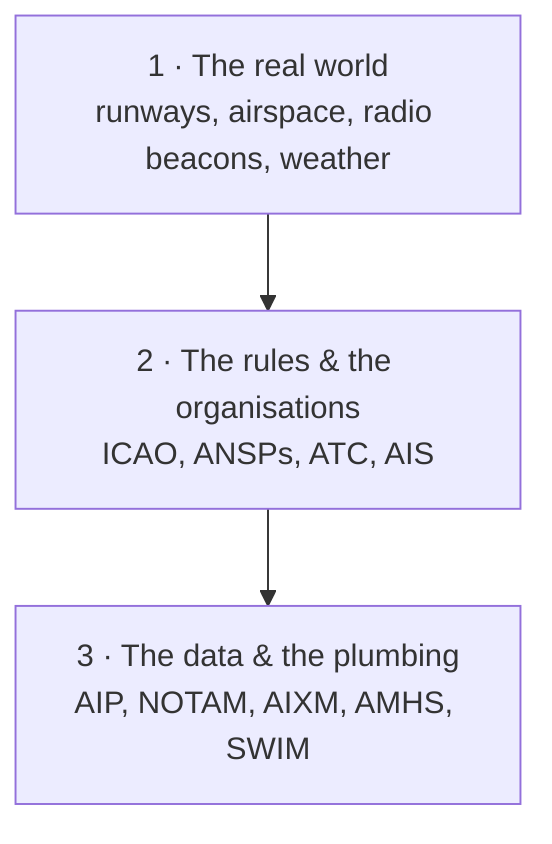

---
tags:
  - aviation-domain
  - moc
aliases:
  - Start Here
  - Aviation Domain Map
  - Reading Map
  - MOC
reading-order: 0
created: 2026-09-01
---

# 00 — Start Here

> [!abstract] What this folder is
> A beginner's tour of **aeronautical information** and the systems that move
> it — written assuming **zero prior aviation knowledge**. Every note is
> self-contained, but they're **numbered in reading order**: each one leans on
> the ones before it. Read `01` first.

## What "domain knowledge" means

A **domain** is the real-world field a system serves — its concepts, rules,
vocabulary and workflows. **Domain knowledge** is understanding that field
well enough to know *what the data means*, *what "correct" looks like*, and to
follow a conversation between the specialists who use it.

The domain here is **air navigation and aeronautical information**: airports,
airspace, routes, navigation aids, the notices and publications that describe
them, and the data formats and networks that carry them between countries.

> [!tip] Why learn the field before the tools
> The specific software changes over the years; the domain doesn't. What a
> [[15 — NOTAMs|NOTAM]] *is*, why [[14 — AIRAC|AIRAC]] exists, why a coordinate needs to be
> accurate to a fraction of a second — that knowledge outlives any one system,
> and you can't safely work on aviation data without it.

## The mental model: three layers

Everything in this folder is one of those three layers. You need all three.

## Reading list

### Foundations — the rules and who does what

| # | Note | One-line hook |
|---|---|---|
| 01 | [[01 — ICAO\|ICAO]] | The UN body that writes the global rulebook |
| 02 | [[02 — ANSP\|ANSP]] | The organisation that runs a country's airspace |
| 03 | [[03 — ATC\|ATC]] | Air Traffic Control — keeping aircraft apart in real time |
| 04 | [[04 — ATFM\|ATFM]] | Air Traffic Flow Management — stopping any sector from overloading |
| 05 | [[05 — AIS\|AIS]] | Aeronautical Information Services — the "librarians" of aviation |
| 06 | [[06 — Stakeholders\|Stakeholders]] | Everyone who produces or uses aeronautical data |

### The physical world of aviation

| # | Note | One-line hook |
|---|---|---|
| 07 | [[07 — Aerodromes\|Aerodromes]] | Airports, precisely defined |
| 08 | [[08 — NAVAIDs\|NAVAIDs]] | Ground and satellite aids that tell aircraft where they are |
| 09 | [[09 — Waypoints\|Waypoints]] | Named points in the sky that routes are built from |
| 10 | [[10 — FIR\|FIR]] | The big blocks the world's airspace is divided into |
| 11 | [[11 — TMA\|TMA]] | The busy funnel of airspace around major airports |
| 12 | [[12 — ICAO Airspace Classification\|ICAO Airspace Classification]] | Classes A–G: who may fly where, and what help they get |

### The data products

| # | Note | One-line hook |
|---|---|---|
| 13 | [[13 — AIP\|AIP]] | A country's official manual of aeronautical information |
| 14 | [[14 — AIRAC\|AIRAC]] | The fixed 28-day calendar that keeps changes in sync worldwide |
| 15 | [[15 — NOTAMs\|NOTAMs]] | Short-notice notices about temporary changes and hazards |
| 16 | [[16 — OPADD\|OPADD]] | The agreed rules for writing and handling NOTAMs |
| 17 | [[17 — PIB\|PIB]] | Pre-flight Information Bulletin — NOTAMs filtered for one flight |
| 18 | [[18 — METAR\|METAR]] | The standard coded airport weather report |
| 19 | [[19 — FPL\|FPL]] | The flight plan — what an aircraft tells ATC it intends to do |

### The exchange models and the plumbing

| # | Note | One-line hook |
|---|---|---|
| 20 | [[20 — GIS\|GIS]] | Geographic Information Systems — coordinates, maps, spatial data |
| 21 | [[21 — AIXM\|AIXM]] | The global data format for aeronautical information |
| 22 | [[22 — AIXM Temporality Model\|AIXM Temporality Model]] | How AIXM says "true from this date to that date" |
| 23 | [[23 — FIXM\|FIXM]] | The same idea, for flight information |
| 24 | [[24 — AMHS\|AMHS]] | The messaging backbone between aviation authorities |
| 25 | [[25 — EAD\|EAD]] | Europe's central aeronautical database — AIM done at scale |
| 26 | [[26 — SWIM\|SWIM]] | The modern "internet of air traffic management" |

### Where it's all heading

| # | Note | One-line hook |
|---|---|---|
| 27 | [[27 — TBO\|TBO]] | Trajectory-Based Operations — a flight as one shared 4-D path |
| 28 | [[28 — AMC Tables\|AMC Tables]] | Flexible use of airspace — sharing airspace day by day |

## Video primers

**Wendover Productions** — big-picture how aviation hangs together (watch in
this order):

| Video | Pairs with |
|---|---|
| [How Air Traffic Control Works](https://www.youtube.com/watch?v=C1f2GwWLB3k) | [[03 — ATC\|ATC]] · [[11 — TMA\|TMA]] · [[10 — FIR\|FIR]] |
| [The Plane Highway in the Sky](https://www.youtube.com/watch?v=-aQ2E0mlRQI) (oceanic airspace, organised tracks) | [[10 — FIR\|FIR]] · [[09 — Waypoints\|Waypoints]] |
| [Why Planes Don't Fly Faster](https://www.youtube.com/watch?v=n1QEj09Pe6k) | [[19 — FPL\|FPL]] |
| [The Design of Airline Route Networks](https://www.youtube.com/watch?v=sY7cQNx4Hg4) | [[06 — Stakeholders\|Stakeholders]] |
| [How Airlines Decide Where to Fly](https://www.youtube.com/watch?v=E3jfvncofiA) | [[06 — Stakeholders\|Stakeholders]] |

**Closer to the data side:** **Mentour Now / Mentour Pilot** (how the rules
work), the **EUROCONTROL** and **ICAO** YouTube channels (SWIM, AIM, AIXM,
ATFM), **VASAviation** (real ATC audio with subtitles).

## Reference libraries worth bookmarking

**Beginner-friendly**
- **GlobeAir glossary** — short, plain-language definitions: <https://www.globeair.com/glossary>
- **SKYbrary** — aviation-safety encyclopaedia: <https://skybrary.aero>
- **Flightradar24 glossary**: <https://www.flightradar24.com/glossary>
- **FAA Pilot's Handbook of Aeronautical Knowledge** (free PDF, very readable): <https://www.faa.gov/regulations_policies/handbooks_manuals/aviation/phak>
- **Boldmethod** — short visual explainers on airspace, navigation, weather: <https://www.boldmethod.com>

**Authoritative / deep**
- **ICAO** — Annexes & PANS documents: <https://www.icao.int>
- **EUROCONTROL** — specifications, concepts, the ATM Lexicon: <https://www.eurocontrol.int> · <https://ext.eurocontrol.int/lexicon>
- **AIXM**: <https://aixm.aero> · **FIXM**: <https://fixm.aero> · **WMO (weather codes)**: <https://community.wmo.int>
