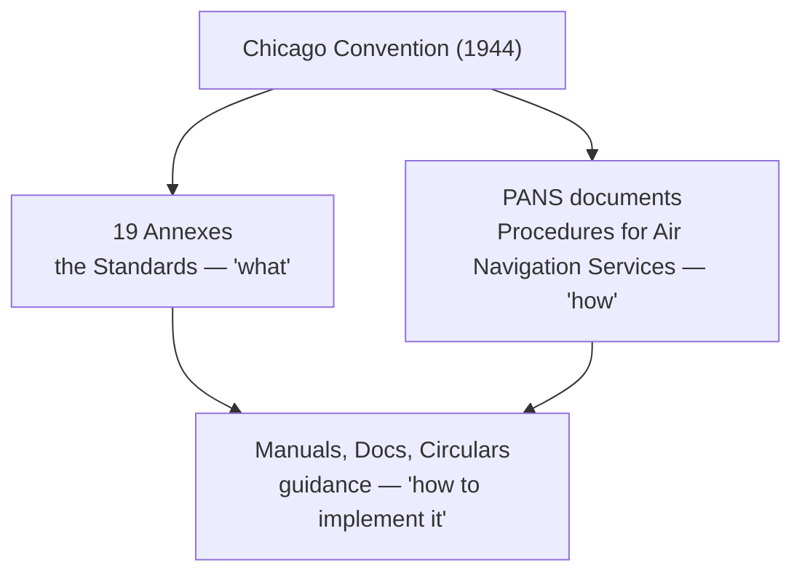

---
tags:
  - aviation-domain
  - regulation
aliases:
  - ICAO
  - International Civil Aviation Organization
reading-order: 1
created: 2026-09-01
---

# ICAO

> [!abstract] The 30-second version
> **ICAO** is the **United Nations agency for civil aviation**. It doesn't run
> airports or control aircraft — it writes the **global rulebook** so that a
> flight crossing many countries follows the same fundamental rules
> everywhere. When a document says *"per Annex 15"* or *"PANS-AIM"*, it's
> quoting ICAO.

## In plain words

Imagine every country invented its own road signs, its own side of the road,
its own licence rules. Driving across a border would be chaos. Aviation solved
this in 1944: 52 countries signed the **Chicago Convention**, which set up
**ICAO** to agree the shared rules (ICAO began operating in 1947). Today
**193 countries** are members.

ICAO produces **standards**. Each country then writes those standards into its
own national law and runs its own system. ICAO checks up on them with audits,
but it has no aircraft, no controllers, no radar of its own. Think of it as
the **standards body**, not the operator.

## Why it exists

To make international air travel **safe, orderly and interoperable** — one set
of procedures, phraseology, units, codes and data formats that work in every
airspace on Earth.

## The parts you actually need to know

### Standards vs recommendations

- **Standard (SARP)** — a country *must* apply it, or formally publish a
  **"difference"** saying where and why it doesn't.
- **Recommended Practice** — strongly encouraged, not mandatory.

### The document hierarchy

### The Annexes that matter for aeronautical information

| Annex | Title | Relevance |
|---|---|---|
| **3** | Meteorological Service | defines [[18 — METAR\|METAR]], TAF, SIGMET |
| **4** | Aeronautical Charts | rules for aviation maps |
| **10** | Aeronautical Telecommunications | radios, [[08 — NAVAIDs\|NAVAIDs]], [[24 — AMHS\|AMHS]] |
| **11** | Air Traffic Services | [[10 — FIR\|FIR]], [[03 — ATC\|ATC]], [[12 — ICAO Airspace Classification\|airspace classes]] |
| **14** | Aerodromes | everything about [[07 — Aerodromes\|Aerodromes]] |
| **15** | Aeronautical Information Services | the founding document for [[05 — AIS\|AIS]], [[13 — AIP\|AIP]], [[15 — NOTAMs\|NOTAMs]], [[14 — AIRAC\|AIRAC]] |

### Key PANS and Docs you'll hear quoted

| Reference | Common name | About |
|---|---|---|
| **Doc 4444** | PANS-ATM | air traffic procedures; also the [[19 — FPL\|FPL]] form |
| **Doc 10066** | PANS-AIM | procedures for modern **Aeronautical Information Management** |
| **Doc 8126** | AIS Manual | how-to guidance for [[05 — AIS\|AIS]] |
| **Doc 8400** | Abbreviations & Codes | the [[15 — NOTAMs\|NOTAM]] Q-codes |
| **Doc 7910** | Location Indicators | 4-letter codes like `EGLL` (London Heathrow) |
| **Doc 9674** | WGS-84 Manual | the global coordinate system — see [[20 — GIS\|GIS]] |
| **Doc 10039** | SWIM Concept | see [[26 — SWIM\|SWIM]] |

> [!tip] AIS is becoming AIM
> ICAO is mid-transition from **AIS** ("produce paper products") to **AIM**
> ("manage quality-assured digital data, let others build products"). Annex 15
> plus PANS-AIM (Doc 10066) drive it. See [[05 — AIS|AIS]].

## How it connects to the rest

ICAO sits at the top of almost everything in this folder. [[02 — ANSP|ANSPs]]
implement its standards; [[13 — AIP|AIPs]] follow its structure; [[21 — AIXM|AIXM]] and
[[23 — FIXM|FIXM]] exist to carry ICAO-required data; [[14 — AIRAC|AIRAC]] is an ICAO invention.

## Jargon buster

| Term | Plain meaning |
|---|---|
| SARP | Standard And Recommended Practice |
| PANS | Procedures for Air Navigation Services |
| Annex | One of the 19 rule-books attached to the Chicago Convention |
| Difference | A country's formal statement that it doesn't fully follow a standard |
| Contracting State | A member country |
| USOAP | ICAO's safety audit programme for member states |

## Learn more

**Start here (beginner-friendly)**
- GlobeAir — *ICAO Code*: <https://www.globeair.com/g/icao-code>
- SKYbrary — *International Civil Aviation Organisation (ICAO)*: <https://skybrary.aero/articles/international-civil-aviation-organisation-icao>
- Wikipedia — *International Civil Aviation Organization*: <https://en.wikipedia.org/wiki/International_Civil_Aviation_Organization>

**Go deeper (the official sources)**
- ICAO — *About ICAO*: <https://www.icao.int/about-icao>
- *Convention on International Civil Aviation* ("Chicago Convention", Doc 7300) — overview: <https://en.wikipedia.org/wiki/Convention_on_International_Civil_Aviation>
- ICAO — *Aeronautical Information Management*: <https://www.icao.int/airnavigation/aeronautical-information-management>
- ICAO Doc 10066 (PANS-AIM) preview: <https://www.unitingaviation.com/wp-content/uploads/2019/04/Doc-10066-Preview.pdf>
