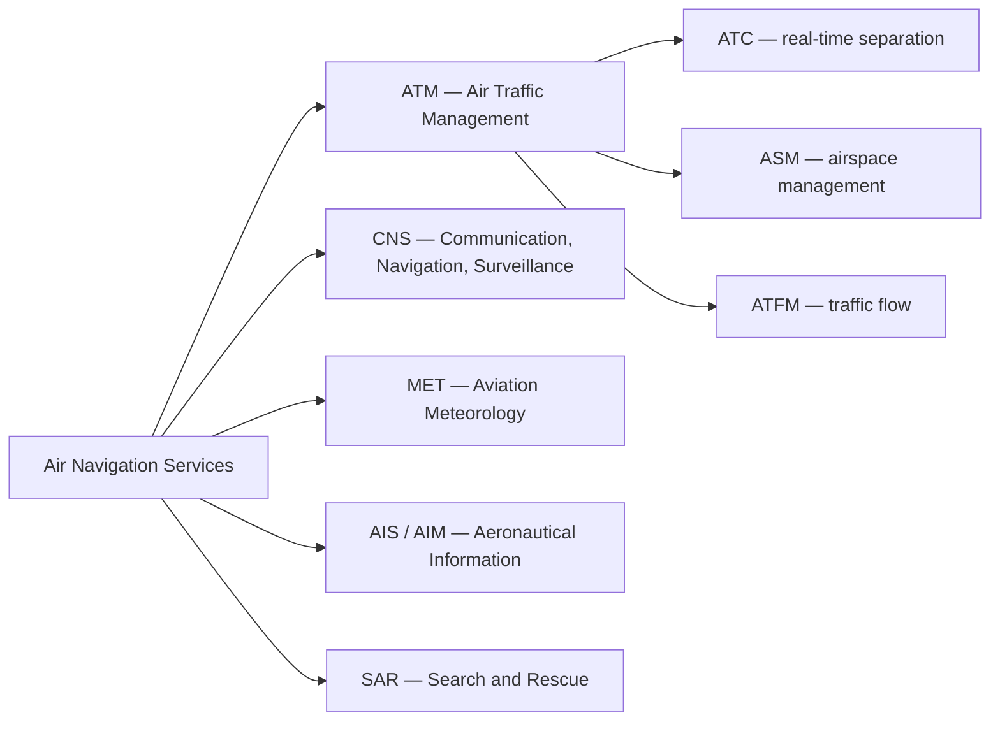

---
tags:
  - aviation-domain
  - organisations
aliases:
  - ANSP
  - Air Navigation Service Provider
  - Air Navigation Services
  - ANS
reading-order: 2
created: 2026-09-01
---

# ANSP

> [!abstract] The 30-second version
> An **ANSP (Air Navigation Service Provider)** is the organisation that runs
> the services aircraft need to fly safely through a country's airspace:
> **air traffic control, navigation aids, aviation weather, and aeronautical
> information**. It's the "utility company" for the sky.

## In plain words

When you fly, a lot of invisible infrastructure is working for you: someone is
watching the radar and keeping your aircraft away from others, radio beacons
and satellites are guiding it, weather is being observed and forecast, and a
constantly-updated description of the airspace is being published. One
organisation (sometimes a few) provides all of that for a given country. That
organisation is the **ANSP**.

An ANSP can be a **government department**, a **state-owned company**, or a
**private/not-for-profit company** — the arrangement varies by country. What
they do is defined by [[01 — ICAO|ICAO]] and doesn't.

## Why it exists

[[01 — ICAO|ICAO]] Annex 11 requires that **every piece of the world's airspace is
somebody's responsibility**. The ANSP is who takes that responsibility for a
country (and often for large areas of ocean too).

## The parts you actually need to know

### The five service groups ("ANS")

| Group         | What it does                                                                                                                           |
| ------------- | -------------------------------------------------------------------------------------------------------------------------------------- |
| **ATM**       | manage traffic: separate it ([[03 — ATC\|ATC]]), balance the flow ([[04 — ATFM\|ATFM]]), share the airspace ([[28 — AMC Tables\|ASM]]) |
| **CNS**       | the equipment layer: radios & [[24 — AMHS\|AMHS]], [[08 — NAVAIDs\|NAVAIDs]], radar / ADS-B                                            |
| **MET**       | observations and forecasts: [[18 — METAR\|METAR]], TAF, SIGMET                                                                         |
| **AIS / AIM** | publish the [[13 — AIP\|AIP]], issue [[15 — NOTAMs\|NOTAMs]], run the briefing office                                                  |
| **SAR**       | coordinate rescue when an aircraft is in distress                                                                                      |

### Regulator vs provider

Best practice (and ICAO's advice) is to **separate the safety regulator from
the service provider**, so the regulator can hold the provider accountable. In
some countries they're separate bodies; in others both roles sit inside one
authority.

### Examples

| ANSP | Country | Model |
|---|---|---|
| **FAA Air Traffic Organization** | USA | government |
| **NATS** | UK | public–private company |
| **DFS** | Germany | state-owned company |
| **Airservices Australia** | Australia | government-owned corporation |
| **MUAC** | upper airspace over Belgium/Netherlands/Luxembourg/NW Germany | multinational (run by EUROCONTROL) |

## How it connects to the rest

The ANSP is the employer of [[03 — ATC|ATC]], the operator of [[08 — NAVAIDs|NAVAIDs]], and the home
of the [[05 — AIS|AIS]] unit that produces the [[13 — AIP|AIP]] and [[15 — NOTAMs|NOTAMs]]. ANSPs coordinate
with each other constantly ([[10 — FIR|FIR]] boundaries, flight data) and are
represented globally by **CANSO**.

## Jargon buster

| Term | Plain meaning |
|---|---|
| ANS | Air Navigation Services (the umbrella term) |
| ATM | Air Traffic Management |
| CNS | Communication, Navigation, Surveillance |
| ASM | Airspace Management |
| SAR | Search And Rescue |
| CANSO | Civil Air Navigation Services Organisation (the ANSPs' global association) |

## Learn more

**Start here (beginner-friendly)**
- GlobeAir — *National Air Traffic Services (NATS)* (a worked example of an ANSP): <https://www.globeair.com/g/national-air-traffic-services-nats>
- SKYbrary — *Air Navigation Service Provider (ANSP)*: <https://skybrary.aero/articles/air-navigation-service-provider-ansp>
- Wikipedia — *Air navigation service provider*: <https://en.wikipedia.org/wiki/Air_navigation_service_provider>

**Go deeper (the official sources)**
- ICAO Annex 11 — *Air Traffic Services*: <https://www.icao.int>
- CANSO — the global association of ANSPs: <https://canso.org/>
