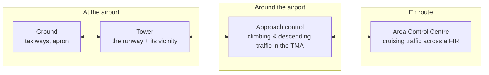

---
tags:
  - aviation-domain
  - atm
aliases:
  - ATC
  - Air Traffic Control
  - Air Traffic Services
  - ATS
reading-order: 3
created: 2026-09-01
---

# ATC

> [!abstract] The 30-second version
> **Air Traffic Control (ATC)** keeps aircraft **separated from each other and
> from the ground**, and keeps traffic flowing in an orderly way. Controllers
> sit on the ground and give pilots instructions ("clearances") by radio. It's
> the largest, most visible service an [[02 — ANSP|ANSP]] provides.

## In plain words

Aircraft can't just fly wherever they like. In busy airspace, a controller is
responsible for a chunk of sky (or a stretch of runway) and makes sure the
aircraft in it stay a safe distance apart — a certain number of miles
sideways, or a certain number of feet vertically. The controller issues
**clearances** ("climb to flight level 350", "turn left heading 270") and the
pilot reads them back and complies.

As a flight progresses it is **handed off** from one controller to the next:
ground → tower → departure → the en-route centres → arrival → tower → ground at
the far end. Each handoff is a coordinated transfer of responsibility.

## Why it exists

Without active separation, two aircraft converging in cloud have no way to see
and avoid each other. ATC is the system that prevents collisions and organises
the flow so airspace and runways are used efficiently.

## The parts you actually need to know

### ATS is the umbrella; ATC is one part

| Service | What it gives you |
|---|---|
| **Air Traffic Control (ATC)** | active separation + clearances (only in *controlled* airspace) |
| **Flight Information Service (FIS)** | useful information — weather, known traffic, hazards — as *advice*, not instructions |
| **Alerting Service** | notifies rescue organisations if an aircraft is overdue or in trouble |

Which of these you get depends on the **[[12 — ICAO Airspace Classification|airspace class]]** you're flying in.

### The three control domains

### Concepts that come up constantly

- **Separation minima** — the minimum allowed spacing, e.g. **1,000 ft**
  vertically, or **3–5 NM** horizontally when the controller has radar.
- **Clearance** — an authorisation to proceed under stated conditions.
- **IFR vs VFR** — *Instrument* Flight Rules (fly by instruments, always with
  ATC in controlled airspace) vs *Visual* Flight Rules (navigate by looking
  outside, "see and avoid").
- **Surveillance vs procedural control** — with radar or ADS-B the controller
  can *see* aircraft positions live; without it, they rely on pilot position
  reports and must use bigger separation. Most oceanic airspace is procedural.

### ATM = ATC + more

ATC (separation) works alongside **[[04 — ATFM|ATFM]]** (flow — so a sector is never
given more traffic than it can handle) and **airspace management** (sharing
airspace with the military — see [[28 — AMC Tables|AMC Tables]]). Together these three are
**Air Traffic Management (ATM)**.

## How it connects to the rest

ATC is the biggest *consumer* of aeronautical information: the airspace,
routes, [[08 — NAVAIDs|NAVAIDs]], [[07 — Aerodromes|aerodrome]] data and [[15 — NOTAMs|NOTAMs]] that
[[05 — AIS|AIS]] publishes all feed the systems controllers use. Bad data = a
controller working from a wrong picture.

## Jargon buster

| Term | Plain meaning |
|---|---|
| ATS | Air Traffic Services (ATC + FIS + Alerting) |
| TWR / APP / ACC | Tower / Approach / Area Control Centre |
| IFR / VFR | Instrument / Visual Flight Rules |
| NM | Nautical mile (1.852 km) |
| Flight Level (FL) | Altitude in hundreds of feet, on a standard pressure setting (FL350 ≈ 35,000 ft) |
| Handoff | Transfer of an aircraft from one controller to the next |
| ADS-B | Automatic position broadcast from the aircraft, used for surveillance |

## Learn more

**Start here (beginner-friendly)**
- GlobeAir — *Air Traffic Control (ATC)*: <https://www.globeair.com/g/air-traffic-control-atc>
- Wendover Productions — *How Air Traffic Control Works* (video): <https://www.youtube.com/watch?v=C1f2GwWLB3k>
- SKYbrary — *Air Traffic Control Service*: <https://skybrary.aero/articles/air-traffic-control-service>

**Go deeper (the official sources)**
- ICAO Annex 11 — *Air Traffic Services*: <https://www.icao.int>
- ICAO Doc 4444 — *PANS-ATM* (the procedures controllers follow): <https://ibs.rlp.cz/ext/aktuality/Doc4444.pdf>
- FAA — *Aeronautical Information Manual*, Chapter 4: <https://www.faa.gov/air_traffic/publications/atpubs/aim_html/chap4_section_1.html>
