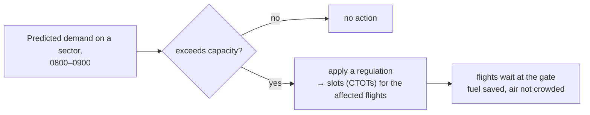

---
tags:
  - aviation-domain
  - atm
aliases:
  - ATFM
  - Air Traffic Flow Management
  - ATFCM
  - Flow Management
reading-order: 4
created: 2026-09-01
---

# ATFM

> [!abstract] The 30-second version
> **Air Traffic Flow Management (ATFM)** makes sure the amount of traffic
> heading for a piece of airspace or an airport **never exceeds what it can
> safely handle**. It works *ahead of time* — days to minutes before a flight
> — by smoothing demand: holding departures on the ground, giving slots, or
> re-routing.

## In plain words

[[03 — ATC|ATC]] can only safely work so many aircraft in a sector at once. If more
than that are all planning to arrive at 08:00, something has to give — and you
do **not** want the "give" to be aircraft circling in the air burning fuel and
crowding the sky.

ATFM looks at **predicted demand vs available capacity** for every sector and
airport, spots the overloads ("hotspots"), and fixes them early — usually by
telling some flights to **push back a bit later**, so they arrive spread out.
A short wait at the gate is safer, cheaper and cleaner than a hold in the air.

## Why it exists

To protect ATC from overload and to make delays **predictable and efficient**
instead of chaotic. It turns "too many planes, sort it out live" into "planned
in advance, everyone knows the plan."

## The parts you actually need to know

### Three time horizons

| Phase | When | Typical actions |
|---|---|---|
| **Strategic** | months → about a week before | forecast demand vs capacity, publish route restrictions |
| **Pre-tactical** | ~6 days → the day before | build the daily plan, coordinate airspace with the military ([[28 — AMC Tables\|AMC Tables]]) |
| **Tactical** | on the day | issue and adjust departure slots, re-route, hold flights on the ground |

### Key terms

| Term             | Meaning                                                                                                                |
| ---------------- | ---------------------------------------------------------------------------------------------------------------------- |
| **Regulation**   | a flow restriction placed on a hotspot for a time window                                                               |
| **Slot / CTOT**  | *Calculated Take-Off Time* — a departure time a flight must meet (±a few minutes) to fit through the constrained point |
| **Ground delay** | holding a flight at the gate instead of airborne                                                                       |
| **Rerouting**    | sending flights around a constrained area                                                                              |
| **DCB**          | *Demand and Capacity Balancing* — the core problem ATFM solves                                                         |

### Ground delay beats airborne holding

### Who runs it

- **Europe:** the **EUROCONTROL Network Manager** runs one central flow
  function for the whole region.
- **USA:** the FAA **Air Traffic Control System Command Center (ATCSCC)**.
- **Elsewhere:** national or sub-regional ATFM units, increasingly
  coordinating across borders.

## How it connects to the rest

ATFM consumes **[[19 — FPL|flight plans]]** (and, in future, [[23 — FIXM|FIXM]]/FF-ICE
trajectories). It depends on **[[28 — AMC Tables|AMC Tables]]** to know which routes are open
each day. It's a stepping stone toward **[[27 — TBO|TBO]]**, where flow is balanced by
adjusting trajectories rather than by blunt ground delays. It sits inside
**ATM** alongside [[03 — ATC|ATC]].

## Jargon buster

| Term | Plain meaning |
|---|---|
| ATFM / ATFCM | Air Traffic Flow (and Capacity) Management |
| CTOT | Calculated Take-Off Time — the "slot" |
| DCB | Demand and Capacity Balancing |
| Hotspot | A sector/airport predicted to be over capacity |
| NM (context: EUROCONTROL) | Network Manager |
| A-CDM | Airport Collaborative Decision Making — sharing accurate airport timings into the network |

## Learn more

**Start here (beginner-friendly)**
- GlobeAir — *Air Traffic Flow Management (ATFM)*: <https://www.globeair.com/g/air-traffic-flow-management-atfm>
- SKYbrary — *Air Traffic Flow Management (ATFM)*: <https://skybrary.aero/articles/air-traffic-flow-management-atfm>
- Wikipedia — *Air traffic flow management*: <https://en.wikipedia.org/wiki/Air_traffic_flow_management>

**Go deeper (the official sources)**
- ICAO Doc 9971 — *Manual on Collaborative Air Traffic Flow Management*: <https://store.icao.int>
- EUROCONTROL — *Network Manager*: <https://www.eurocontrol.int/network-manager>
- EUROCONTROL — *ATFCM Users Manual*: <https://www.eurocontrol.int/publication/atfcm-users-manual>
