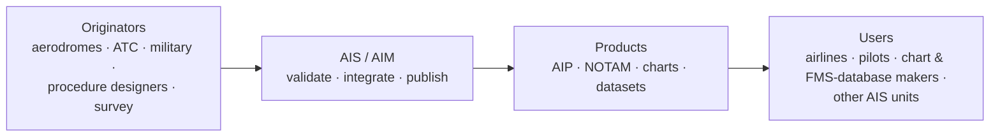

---
tags:
  - aviation-domain
  - ais-aim
aliases:
  - AIS
  - Aeronautical Information Services
  - Aeronautical Information Service
  - AIM
  - Aeronautical Information Management
reading-order: 5
created: 2026-09-01
---

# AIS

> [!abstract] The 30-second version
> **Aeronautical Information Services (AIS)** is the part of an [[02 — ANSP|ANSP]] that
> **collects, checks and publishes the information a pilot needs to fly
> safely** — where the runways and radio beacons are, how the airspace is
> shaped, what is temporarily closed or broken. If [[03 — ATC|ATC]] is the traffic
> police, **AIS is the map-and-almanac office**.

## In plain words

Every day, facts about the aviation system change: a taxiway closes for works,
a navigation beacon is switched off for maintenance, a new arrival route is
introduced, a crane goes up near a runway. Pilots and airline computers need
an **accurate, current, trustworthy** description of all of it — and they need
the *same* description worldwide.

AIS is the office that makes that happen. It gathers raw facts from many
sources, **checks them**, fits them together, and publishes them as a set of
standard products. The modern name for doing this well with digital data is
**AIM — Aeronautical Information Management**.

## Why it exists

A pilot planning a flight, or a flight-management computer loading its
database, must be able to rely on one authoritative source. AIS is that
source. Get it wrong and the error can be published worldwide and loaded into
thousands of aircraft within one [[14 — AIRAC|AIRAC]] cycle.

## The parts you actually need to know

### What AIS produces (the "information package")

| Product | What it is |
|---|---|
| **[[13 — AIP\|AIP]]** | the permanent national manual |
| **AIP Amendment** | permanent changes, on the [[14 — AIRAC\|AIRAC]] calendar |
| **AIP Supplement** | temporary changes lasting weeks–months |
| **[[15 — NOTAMs\|NOTAM]]** | short-notice notices (hours–weeks) |
| **AIC** | Aeronautical Information Circular — explanatory / admin notices |
| **Charts & datasets** | maps and, increasingly, structured [[21 — AIXM\|AIXM]] data |

Plus services: the **pre-flight briefing** (which produces a **[[17 — PIB|PIB]]** for a
specific route) and **post-flight** reporting (collecting crew observations).

### The data chain

### The five data-quality requirements

Every piece of aeronautical data must have:

1. **Accuracy** — how close to the true value.
2. **Resolution** — how many digits it's given to.
3. **Integrity** — assurance it hasn't been corrupted (rated *routine*,
   *essential* or *critical*).
4. **Traceability** — you can follow it back to its origin.
5. **Timeliness** — valid for the period it's used, delivered on time.

### AIS → AIM in one table

|  | AIS (old mindset) | AIM (the target) |
|---|---|---|
| The core unit | the document/product | the **dataset** |
| Format | paper / PDF | structured data ([[21 — AIXM\|AIXM]]) |
| Consumer | a human reading it | a machine *and* a human |
| Enablers | — | [[21 — AIXM\|AIXM]], [[26 — SWIM\|SWIM]], digital NOTAM, [[20 — GIS\|GIS]] |

Driven by **[[01 — ICAO|ICAO]] Annex 15** (standards) and **Doc 10066 – PANS-AIM**
(procedures), with guidance in **Doc 8126 – AIS Manual**.

## How it connects to the rest

AIS is the hub of this whole folder. [[13 — AIP|AIP]], [[15 — NOTAMs|NOTAMs]], [[14 — AIRAC|AIRAC]], [[17 — PIB|PIB]],
[[21 — AIXM|AIXM]], [[25 — EAD|EAD]] are all its tools or products. Its inputs come from the
[[06 — Stakeholders|Stakeholders]] upstream; its outputs feed everyone downstream.

## Jargon buster

| Term | Plain meaning |
|---|---|
| AIS | Aeronautical Information Services |
| AIM | Aeronautical Information Management (the modern, data-centric version) |
| AIC | Aeronautical Information Circular |
| Integrated Aeronautical Information Package | AIP + amendments + supplements + NOTAM + AIC + checklists |
| Data originator | Whoever creates a fact (e.g. an aerodrome operator) |

## Learn more

**Start here (beginner-friendly)**
- SKYbrary — *Aeronautical Information Service (AIS)*: <https://skybrary.aero/articles/aeronautical-information-service-ais>
- EUROCONTROL — *Aeronautical Information Management (AIM)*: <https://www.eurocontrol.int/concept/aeronautical-information-management>
- Wikipedia — *Aeronautical Information Service*: <https://en.wikipedia.org/wiki/Aeronautical_Information_Service>

**Go deeper (the official sources)**
- ICAO Annex 15 — *Aeronautical Information Services*: <https://www.icao.int>
- ICAO Doc 10066 (PANS-AIM) preview: <https://www.unitingaviation.com/wp-content/uploads/2019/04/Doc-10066-Preview.pdf>
- ICAO — *Aeronautical Information Management*: <https://www.icao.int/airnavigation/aeronautical-information-management>
- GroupEAD — *Annex 15 and Doc 10066 white paper*: <https://www.groupead.com/wp-content/uploads/2024/01/WhitePaper_ICAODocs_2022_Mail.pdf>
