---
tags:
  - aviation-domain
  - context
aliases:
  - Stakeholders
  - Aviation Stakeholders
  - AIS Stakeholders
reading-order: 6
created: 2026-09-01
---

# Stakeholders

> [!abstract] The 30-second version
> Aeronautical information has a **long supply chain**. Many organisations
> **produce** raw facts, one [[05 — AIS|AIS]] unit **checks and publishes** them, and a
> large community **uses** the results — with safety consequences if any link
> fails. This note is the cast list.

## In plain words

No single organisation "owns" all the information about an airport or a piece
of airspace. The airport operator knows about its runway works. The military
knows when it needs a training area. The people who design instrument
approaches know the procedures. Surveyors know the exact coordinates. All of
that has to flow **into** the AIS office, get **combined and quality-checked**,
and then flow **out** to airlines, chart makers, and the database vendors who
build what pilots see in the cockpit.

Understanding who's who tells you *why* a given piece of data has the accuracy,
format or deadline it does — because you can trace it to someone who depends
on it.

## Why it matters

Every data requirement (how accurate, what format, how fast) exists because
some stakeholder needs it that way. You can't judge "is this good enough?"
without knowing who's downstream.

## The parts you actually need to know

### The supply chain

```mermaid
flowchart LR
    subgraph UP ["Originators (upstream)"]
      AD["Aerodrome operators"]
      SURV["Surveyors / GIS providers"]
      PROC["Procedure designers"]
      MIL["Military / airspace authority"]
      ATCU["ATC units"]
      NAVE["Navigation / CNS engineering"]
      METS["Meteorological service"]
    end
    subgraph MID ["Integration"]
      AIS["AIS / AIM unit<br/>validate · integrate · publish"]
    end
    subgraph DOWN ["Users (downstream)"]
      AL["Airlines & flight dispatch"]
      FMSDB["FMS / navigation-database vendors"]
      CHART["Chart producers"]
      FPSP["Flight-planning providers"]
      ANSP2["Adjacent ANSPs"]
      REG["Regulator / ICAO"]
    end
    UP --> MID --> DOWN
```

### Who's who

| Stakeholder | Gives / takes | Depends on AIS for |
|---|---|---|
| **[[02 — ANSP\|ANSP]] / [[03 — ATC\|ATC]]** | provide airspace, route, frequency, restriction data; consume the integrated picture | correct data in their operational systems |
| **Aerodrome operators** | runway, lighting, obstacle, works info | timely publication of changes ([[15 — NOTAMs\|NOTAMs]] / [[13 — AIP\|AIP]]) |
| **Procedure designers** | departures, arrivals, approaches | accurate [[08 — NAVAIDs\|NAVAIDs]] & [[09 — Waypoints\|Waypoints]] as input |
| **Military / airspace management** | danger and reserved areas, activations | [[28 — AMC Tables\|AMC Tables]] and activation [[15 — NOTAMs\|NOTAMs]] |
| **Meteorological service** | [[18 — METAR\|METAR]], TAF, SIGMET | shared distribution ([[24 — AMHS\|AMHS]]) and briefing integration |
| **Airlines / dispatch** | consume everything | trustworthy, well-filtered, on-time information |
| **FMS / navigation-database vendors** | turn [[13 — AIP\|AIP]] data into the database in the cockpit | [[14 — AIRAC\|AIRAC]]-punctual, machine-readable ([[21 — AIXM\|AIXM]]) data |
| **Chart producers** | printed & electronic charts | one unambiguous source |
| **Adjacent ANSPs** | cross-border coordination | consistent [[10 — FIR\|FIR]] boundary [[09 — Waypoints\|Waypoints]] |
| **Regulator / [[01 — ICAO\|ICAO]]** | oversight and audits | evidence of a quality-managed AIS |
| **The travelling public** | the ultimate beneficiary | — |

### Industry bodies you'll hear named

**ICAO** (global standards), **CANSO** (ANSPs), **IATA** (airlines),
**ACI** (airports), **IFAIMA** (the federation of AIM associations),
**EUROCONTROL** (specifications, [[25 — EAD|EAD]], [[26 — SWIM|SWIM]], and co-governance of
[[21 — AIXM|AIXM]] with the FAA).

## How it connects to the rest

This note is the "who" behind every other note. When [[13 — AIP|AIP]], [[15 — NOTAMs|NOTAMs]] or
[[21 — AIXM|AIXM]] talk about a "data originator" or a "user", this is the list.

## Jargon buster

| Term | Plain meaning |
|---|---|
| Data originator | Whoever first creates a fact |
| Upstream / downstream | Earlier / later in the supply chain |
| FMS | Flight Management System — the aircraft's navigation computer |
| CANSO / IATA / ACI | trade associations for ANSPs / airlines / airports |
| IFAIMA | International Federation of AIM Associations |

## Learn more

**Start here (beginner-friendly)**
- SKYbrary — *Aeronautical Information Service (AIS)* (roles in the chain): <https://skybrary.aero/articles/aeronautical-information-service-ais>
- EUROCONTROL — *Aeronautical Information Management*: <https://www.eurocontrol.int/concept/aeronautical-information-management>
- IFAIMA — *International Federation of AIM Associations*: <https://www.ifaima.org/>

**Go deeper (the official sources)**
- ICAO Doc 8126 — *AIS Manual* (roles & responsibilities): <https://store.icao.int>
- ICAO Doc 10066 — *PANS-AIM* (data originator agreements, quality chain): <https://www.unitingaviation.com/wp-content/uploads/2019/04/Doc-10066-Preview.pdf>
- CANSO <https://canso.org/> · IATA <https://www.iata.org/> · ACI <https://aci.aero/>
