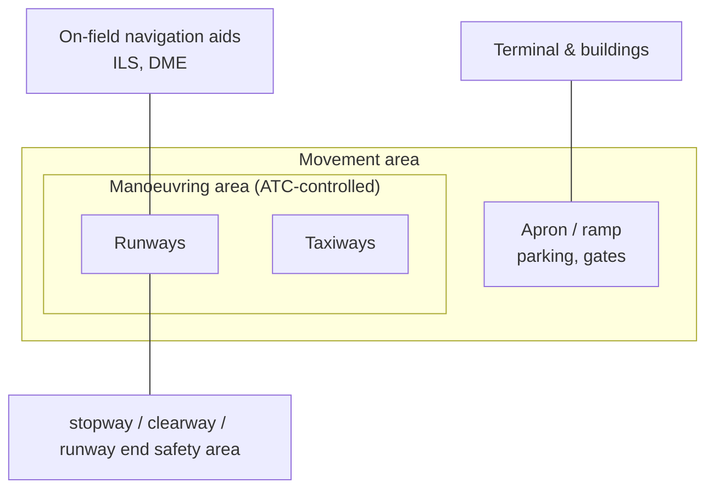

---
tags:
  - aviation-domain
  - infrastructure
aliases:
  - Aerodromes
  - Aerodrome
  - Aerodomes
  - Airport
reading-order: 7
created: 2026-09-01
---

# Aerodromes

> [!abstract] The 30-second version
> An **aerodrome** is any defined area of land or water used for aircraft to
> **arrive, depart and move on the surface** — from a grass strip to a major
> international airport. In aeronautical data it's a large bundle of precisely
> surveyed facts: runways, taxiways, lighting, obstacles, frequencies,
> procedures.

## In plain words

"Aerodrome" is the formal word; "airport" usually means an aerodrome with
terminals and border control for public flights. The word matters less than
what an aerodrome *is as data*: dozens of exact numbers and shapes that
aircraft-performance calculations and instrument approaches depend on.

Get a runway's usable length or a nearby obstacle's height slightly wrong and
you've affected whether an aircraft can safely take off or land there. This is
some of the most safety-critical data in the whole system.

## Why it exists as a data problem

Every published aerodrome needs a standard, complete, current description so
that any airline anywhere can plan to use it. [[01 — ICAO|ICAO]] Annex 14 defines what
must be measured and how; Annex 15 defines how it must be published.

## The parts you actually need to know

### Anatomy

### Runway naming

A runway's number is its **magnetic bearing ÷ 10, rounded**. A runway pointing
064° magnetic is **Runway 06**; used from the other end it's **Runway 24**
(064 + 180 = 244 → 24). Parallel runways add **L / C / R** (left / centre /
right).

### Declared distances (you'll meet these a lot)

| Code | Name | Plain meaning |
|---|---|---|
| **TORA** | Take-Off Run Available | runway length usable for the ground run |
| **TODA** | Take-Off Distance Available | TORA + clearway |
| **ASDA** | Accelerate-Stop Distance Available | TORA + stopway (room to abort) |
| **LDA** | Landing Distance Available | runway length usable for landing |

A **displaced threshold** means the usable landing area starts partway down
the runway (often because of an obstacle on the approach).

### Codes that identify an aerodrome

- **ICAO location indicator** — 4 letters (e.g. `KJFK`, `EGLL`, `YSSY`).
- **IATA code** — 3 letters, used on tickets and baggage tags (`JFK`, `LHR`, `SYD`).
- **Aerodrome Reference Point (ARP)** — one published latitude/longitude that
  "locates" the whole aerodrome (see [[20 — GIS|GIS]]).
- **Aerodrome Reference Code** — e.g. `4E`: a number (1–4) for runway length
  and a letter (A–F) for the biggest aircraft it's built for.

### Controlled airspace sits on top

An aerodrome usually has a **control zone (CTR)** from the ground up, often
under a **[[11 — TMA|TMA]]**. The class depends on how busy it is — see
[[12 — ICAO Airspace Classification|ICAO Airspace Classification]].

![[airspace-classes-profile-FAA.png|560]]
*Airspace classes stack above and around aerodromes: quiet fields sit in the
lower classes; busy hubs get the more protective ones. (FAA* Pilot's Handbook
of Aeronautical Knowledge*, Fig 15-1 — US rendering; the ICAO class letters
mean the same thing.)*

### Where aerodrome data lives

Published in **Part 3 (AD)** of the [[13 — AIP|AIP]], with a text entry, an aerodrome
chart and instrument-approach charts for each field. A detailed spatial model
of the surface (every taxiway centreline, every stand) is the **Aerodrome
Mapping Database (AMDB)**, modelled in [[21 — AIXM|AIXM]].

## How it connects to the rest

Aerodrome data uses [[20 — GIS|GIS]] coordinates, is published via the [[13 — AIP|AIP]] and kept
current with [[14 — AIRAC|AIRAC]] amendments and [[15 — NOTAMs|NOTAMs]], and is a key input to the
[[08 — NAVAIDs|NAVAIDs]] and procedures that define [[09 — Waypoints|Waypoints]].

## Jargon buster

| Term | Plain meaning |
|---|---|
| ARP | Aerodrome Reference Point |
| CTR | Control Zone (controlled airspace around an aerodrome, from the ground up) |
| TORA / TODA / ASDA / LDA | Declared distances (see table) |
| Threshold | The start of the usable landing portion of a runway |
| AMDB | Aerodrome Mapping Database |
| Apron / ramp | Where aircraft park, are loaded and serviced |

## Learn more

**Start here (beginner-friendly)**
- GlobeAir — *Aerodrome*: <https://www.globeair.com/g/aerodrome>
- Wikipedia — *Aerodrome*: <https://en.wikipedia.org/wiki/Aerodrome>
- Boldmethod — runway markings, numbering and thresholds explainers: <https://www.boldmethod.com>
- FAA — *Pilot's Handbook of Aeronautical Knowledge*, Ch. 14 *Airport Operations*: <https://www.faa.gov/regulations_policies/handbooks_manuals/aviation/phak>

**Go deeper (the official sources)**
- ICAO Annex 14 — *Aerodromes*: <https://www.icao.int>
- ICAO Doc 9157 — *Aerodrome Design Manual*: <https://store.icao.int>
- ICAO Doc 7910 — *Location Indicators*: <https://store.icao.int>
