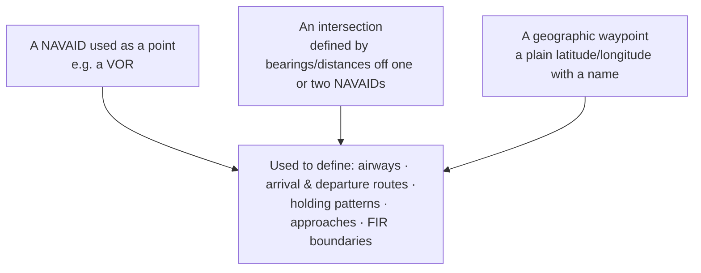

---
tags:
  - aviation-domain
  - route-network
aliases:
  - Waypoints
  - Waypoint
  - Significant Point
  - Fix
reading-order: 9
created: 2026-09-01
---

# Waypoints

> [!abstract] The 30-second version
> A **waypoint** (formal term: **significant point**) is a **named position in
> the sky** used to build routes and procedures. It can be a radio
> [[08 — NAVAIDs|NAVAID]], the crossing point of two beacon bearings, or — most
> commonly today — just a **latitude/longitude with a code name**. Routes,
> flight plans and aircraft databases are essentially lists of waypoints.

## In plain words

If you want to describe a route from A to B, you need names for the points
along the way. Some of those points are physical beacons on the ground. Most,
now, are just agreed coordinates in empty air, each given a **five-letter
pronounceable name** like `BOBBI`, `LARON` or `SITET` so a controller and
pilot can say it out loud without confusion.

String waypoints together and you have an airway, an arrival route, or the
route line in a [[19 — FPL|flight plan]]. Every waypoint's coordinates get loaded
into aircraft navigation databases worldwide — so a single wrong digit can
send an aircraft off track.

## Why they exist

To give routes and procedures a shared, unambiguous vocabulary of positions —
and, with satellite navigation, to let aircraft fly directly between
coordinates without needing a beacon at each turn.

## The parts you actually need to know

### Three kinds of significant point

Modern **PBN** (see [[08 — NAVAIDs|NAVAIDs]]) means most new points are **type C** — the
aircraft flies the coordinates directly.

### The five-letter name code

En-route geographic waypoints get a **unique, pronounceable 5-letter code**.
The rules: unique within a wide region (no nearby duplicates), pronounceable
in English, not rude or confusing in major languages, and allocated centrally
through ICAO's **ICARD** database. Terminal-area points (on arrival/departure/
approach procedures) often use a **name + number** like `BULLA1`.

### Fly-by vs fly-over

| Type | Behaviour |
|---|---|
| **Fly-by** | the aircraft turns *early* to smoothly join the next leg |
| **Fly-over** | the aircraft must pass *directly over* the point before turning |

This is a coded attribute of the waypoint and matters for staying clear of
obstacles.

### Where waypoints appear

- **ATS route / airway** — a string of waypoints and the segments between them.
- **SID / STAR** — published departure and arrival routes (waypoint sequences)
  that move traffic in and out of a [[11 — TMA|TMA]] predictably.
- **[[10 — FIR|FIR]] boundaries** — described as lists of coordinates.
- **[[19 — FPL|FPL]] route field** — waypoints, airway identifiers, and `DCT` (direct)
  segments.

### Data-quality points

Coordinates in **WGS-84** (see [[20 — GIS|GIS]]), to a fine resolution; **unique**
names per region; changes only on an **[[14 — AIRAC|AIRAC]]** date so every database
updates together; traceable to the originator. Published in **[[13 — AIP|AIP]] ENR 4.4**
and modelled in [[21 — AIXM|AIXM]] as `DesignatedPoint`.

## How it connects to the rest

Waypoints are built from [[08 — NAVAIDs|NAVAIDs]] and [[20 — GIS|GIS]] coordinates, published in the
[[13 — AIP|AIP]] on the [[14 — AIRAC|AIRAC]] cycle, assembled into the routes an [[19 — FPL|FPL]] uses, and
carried between systems in [[21 — AIXM|AIXM]] and [[23 — FIXM|FIXM]].

## Jargon buster

| Term | Plain meaning |
|---|---|
| Significant point | The ICAO term for "waypoint" |
| 5LNC | Five-Letter Name Code |
| ICARD | ICAO's central database for route and waypoint names |
| SID / STAR | Standard Instrument Departure / Standard Terminal Arrival Route |
| DCT | "Direct" — a straight leg between two points, not along an airway |
| Intersection | A waypoint defined by where two radials/bearings cross |

## Learn more

**Start here (beginner-friendly)**
- GlobeAir — *Waypoint*: <https://www.globeair.com/g/waypoint>
- SKYbrary — *Waypoint*: <https://skybrary.aero/articles/waypoint>
- ruk.ca — *ICAO, ICARD and 5LNC: how those 5-letter waypoint codes get their names* (friendly deep-dive): <https://ruk.ca/content/icao-icard-and-5lnc-how-those-5-letter-aeronautical-waypoint-codes-get-their-names>

**Go deeper (the official sources)**
- ICAO Annex 11 — *Air Traffic Services* (route & significant-point rules): <https://www.icao.int>
- ICAO Doc 8168 — *PANS-OPS*, Vol II (procedure & waypoint design): <https://store.icao.int>
- EUROCONTROL Network Manager — *Route Availability Document (RAD)*: <https://www.nm.eurocontrol.int/RAD/>
