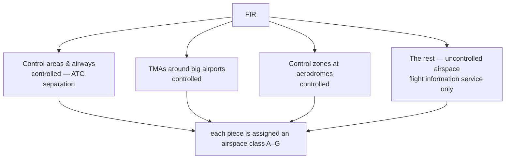

---
tags:
  - aviation-domain
  - airspace
aliases:
  - FIR
  - Flight Information Region
  - UIR
  - Upper Information Region
reading-order: 10
created: 2026-09-01
---

# FIR

> [!abstract] The 30-second version
> A **Flight Information Region (FIR)** is a large volume of airspace — often
> the size of a country or bigger — within which **one [[02 — ANSP|ANSP]] is
> responsible** for providing a **flight information service** and an
> **alerting service**. The whole planet's airspace, including the oceans, is
> divided into FIRs with no gaps and no overlaps.

## In plain words

Somebody has to be responsible for every bit of sky — to give pilots useful
information, and to notice and call for rescue if an aircraft goes missing.
The world is carved up into big pieces called FIRs, and each piece is assigned
to one country's ANSP. Boundaries often follow national borders, but over
oceans they follow negotiated lines, and a country can be responsible for
airspace far beyond its own territory.

An FIR is **not** one uniform block. Inside it are busy controlled areas
(airways, [[11 — TMA|terminal areas]], zones around airports) and large stretches
of uncontrolled airspace. The defining job of the FIR is providing information
and alerting **everywhere** in it.

## Why it exists

So there are **no orphan pieces of airspace**. [[01 — ICAO|ICAO]] Annex 11 requires it,
and regional ICAO agreements decide where the boundaries go.

## The parts you actually need to know

### FIR vs UIR

- **FIR** — from a defined base (often the ground) up to a specified level.
- **UIR (Upper Information Region)** — the airspace *above* that level,
  sometimes managed separately. Many countries just use one FIR from the
  ground up.

### What's inside an FIR

In controlled parts, [[03 — ATC|ATC]] actively separates aircraft. In uncontrolled
parts you still get **Flight Information Service** (weather, traffic, hazards)
and **Alerting Service** — and providing those two everywhere is what makes it
an FIR.

### Identification and boundaries

- Named after the responsible control centre + "FIR" (e.g. *Shanwick FIR*,
  *Anchorage FIR*, *Fukuoka FIR*), plus a 4-letter ICAO code.
- Boundaries are recorded in the regional **ICAO Air Navigation Plan** and
  described as lists of [[09 — Waypoints|Waypoints]]/coordinates.
- Some oceanic FIRs are enormous (millions of square kilometres) and mostly
  **procedural** — no radar, so aircraft report their positions and larger
  separation is used (space-based ADS-B is now changing this).

### Crossing between FIRs

Flights pass from one FIR to the next. The two ANSPs agree **transfer of
control / communication points** on the boundary, exchange flight data
(historically via [[24 — AMHS|AMHS]], increasingly via [[26 — SWIM|SWIM]] and [[23 — FIXM|FIXM]]), and
publish the arrangement in **[[13 — AIP|AIP]] ENR 2**.

## How it connects to the rest

The FIR is the top-level container for almost all aeronautical data: the
[[13 — AIP|AIP]] describes its limits and the units inside it, every [[15 — NOTAMs|NOTAM]]
is addressed to one or more FIRs, and its boundary is an [[21 — AIXM|AIXM]] airspace
feature.

## Jargon buster

| Term | Plain meaning |
|---|---|
| FIR / UIR | Flight / Upper Information Region |
| FIS | Flight Information Service |
| Alerting Service | Notifying rescue organisations about an aircraft in difficulty |
| Procedural control | Controlling traffic without radar, using position reports |
| Oceanic airspace | Airspace over the sea, usually procedural, often in very large FIRs |

## Learn more

**Start here (beginner-friendly)**
- GlobeAir — *Flight Information Region (FIR)*: <https://www.globeair.com/g/flight-information-region-fir>
- SKYbrary — *Flight Information Region (FIR)*: <https://skybrary.aero/articles/flight-information-region-fir>
- Wikipedia — *Flight information region* (with maps and the full list): <https://en.wikipedia.org/wiki/Flight_information_region>

**Go deeper (the official sources)**
- ICAO Annex 11 — *Air Traffic Services*, Chapter 2: <https://www.icao.int>
- ICAO Doc 7754 — *Air Navigation Plans* (regional): <https://www.icao.int>
- Wendover Productions — *The Plane Highway in the Sky* (oceanic FIRs, video): <https://www.youtube.com/watch?v=-aQ2E0mlRQI>
