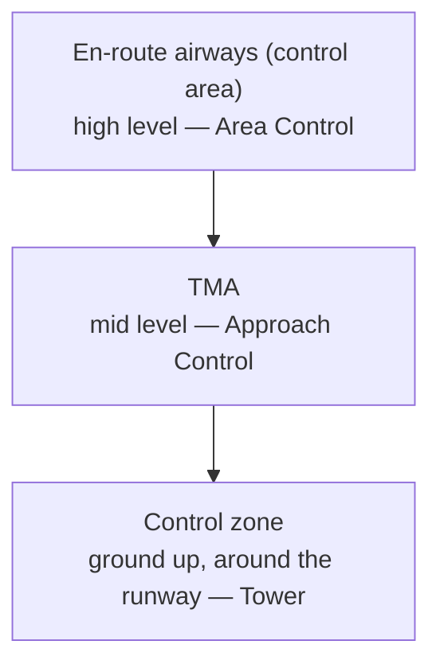

---
tags:
  - aviation-domain
  - airspace
aliases:
  - TMA
  - Terminal Manoeuvring Area
  - Terminal Control Area
  - TCA
  - Terminal Area
reading-order: 11
created: 2026-09-01
---

# TMA

> [!abstract] The 30-second version
> A **TMA (Terminal Manoeuvring Area / Terminal Control Area)** is controlled
> airspace **around one or more busy airports**, where arriving and departing
> aircraft are climbing, descending and turning. It's the funnel that connects
> the low-level zones around runways to the high-level en-route airways.

## In plain words

Near a big airport, lots of aircraft are doing complicated things in a small
space: some climbing away on departure, some descending and slowing for
arrival, some holding because the airport is busy. That needs its own block of
protected airspace with its own controller — **Approach Control** — working
just that traffic.

The TMA's shape is custom-built around the **published arrival and departure
routes** (STARs and SIDs) and around terrain and neighbouring airports. It
usually starts a little above the ground so small aircraft can operate
underneath it without a clearance, and extends up to meet the airway network.

## Why it exists

To give the concentrated, maneuvering traffic near a major airport a dedicated,
protected volume and a dedicated controller — separate from both the tower and
the en-route centre.

## The parts you actually need to know

### Where it sits

### Same idea, different names

| Term | Where used |
|---|---|
| **TMA** — Terminal Manoeuvring Area / Terminal Control Area | ICAO, Europe, most of the world |
| **TCA** — Terminal Control Area | some countries; also the term in ICAO Annex 11 |
| **TRACON airspace** | USA (the facility is the "TRACON") |

### What happens in a TMA

- **Arrivals** fly a **STAR** from the airway structure toward the airport,
  sometimes via a **holding pattern**, then are turned onto final approach
  (often an [[08 — NAVAIDs|ILS]]).
- **Departures** fly a **SID** that lifts them from the runway to a defined
  point on the airway network.
- **Approach Control** sequences it all, applying separation and speed control.

### Airspace class

A TMA is controlled airspace, so it's class **A, B, C or D** depending on how
busy it is and how visual (VFR) traffic is handled — see
[[12 — ICAO Airspace Classification|ICAO Airspace Classification]].

![[airspace-classes-profile-FAA.png|560]]
*Terminal airspace stacked around a hub, feeding into and out of the en-route
structure. (FAA PHAK, Fig 15-1 — US rendering.)*

## How it connects to the rest

The TMA is a piece of a [[10 — FIR|FIR]], worked by [[03 — ATC|ATC]] Approach Control, built
around [[09 — Waypoints|Waypoints]] and [[08 — NAVAIDs|NAVAIDs]], published in the [[13 — AIP|AIP]] (ENR 2 and the
terminal charts), and modelled in [[21 — AIXM|AIXM]] as airspace plus procedures. It's
also where [[27 — TBO|TBO]] and arrival-management tools deliver the most benefit.

## Jargon buster

| Term | Plain meaning |
|---|---|
| TMA / TCA | Terminal Manoeuvring Area / Terminal Control Area |
| CTR | Control Zone (around the runway, from the ground up) |
| Approach Control | The ATC unit that works climbing/descending traffic in the TMA |
| SID / STAR | Standard Instrument Departure / Standard Terminal Arrival Route |
| Holding pattern | A published racetrack-shaped path where aircraft wait their turn |

## Learn more

**Start here (beginner-friendly)**
- GlobeAir — *Terminal Control Area (TCA)*: <https://www.globeair.com/g/terminal-control-area-tca>
- SKYbrary — *Terminal Control Area (TMA)*: <https://skybrary.aero/articles/terminal-control-area-tma>
- SKYbrary — *SIDs and STARs*: <https://skybrary.aero/articles/sids-and-stars>

**Go deeper (the official sources)**
- ICAO Annex 11 — *Air Traffic Services* (control areas and TMAs): <https://www.icao.int>
- ICAO Doc 4444 — *PANS-ATM*: <https://ibs.rlp.cz/ext/aktuality/Doc4444.pdf>
- FAA — *Pilot's Handbook of Aeronautical Knowledge*, Ch. 15 *Airspace*: <https://www.faa.gov/regulations_policies/handbooks_manuals/aviation/phak>
