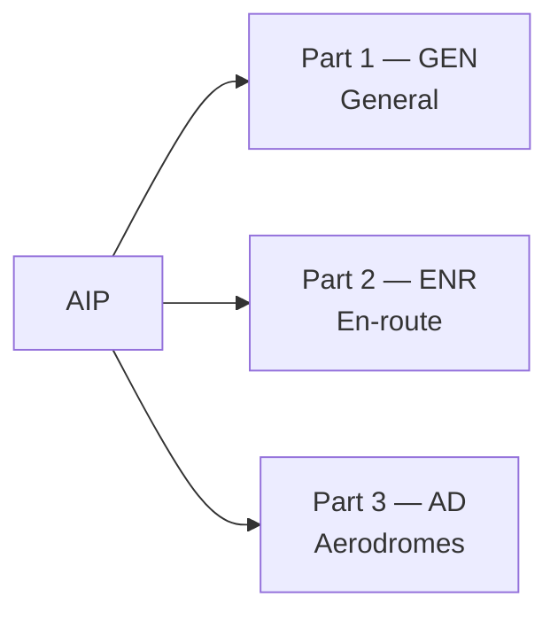

---
tags:
  - aviation-domain
  - ais-aim
  - products
aliases:
  - AIP
  - Aeronautical Information Publication
  - eAIP
reading-order: 13
created: 2026-09-01
---
**astructure & Technology:** A country with advanced radar coverage might implement stricter air traffic spacing rules than one relying on procedural reporting over remote airspace.
# AIP

> [!abstract] The 30-second version
> The **Aeronautical Information Publication (AIP)** is a country's **official
> manual of aeronautical information** — the permanent, authoritative
> reference on its airspace, airports, routes, [[08 — NAVAIDs|NAVAIDs]], procedures and
> rules. Every [[01 — ICAO|ICAO]] country publishes one. It's produced by the national
> [[05 — AIS|AIS]] unit and updated on the **[[14 — AIRAC|AIRAC]]** calendar.

## In plain words

Think of the AIP as the country's aviation encyclopaedia. If a fact is
**permanent, important and predictable** — the length of a runway, the shape
of an airway, the rules for entering a piece of airspace — it belongs in the
AIP. If it's temporary or last-minute, it goes in a **[[15 — NOTAMs|NOTAM]]**
instead.

The clever part is the **structure**: every country's AIP uses the *same*
numbered sections, defined by ICAO. So `ENR 4.1` means "en-route radio
navigation aids" in every country's AIP, and you can find any fact fast once
you know the layout.

## Why it exists

So there is **one authoritative, standardised source** of a country's
aeronautical information that airlines, chart makers and database vendors
worldwide can rely on.

## The parts you actually need to know

### The three parts

| Part | Contains | Useful examples |
|---|---|---|
| **GEN** | admin, contacts, national rules, units, list of **differences** from ICAO, charges | GEN 1.7 = differences |
| **ENR** | everything about the airspace *between* airports | ENR 1.4 = [[12 — ICAO Airspace Classification\|airspace classes]]; ENR 2 = [[10 — FIR\|FIR]] / [[11 — TMA\|TMA]]; ENR 3 = routes; ENR 4 = [[08 — NAVAIDs\|NAVAIDs]] & [[09 — Waypoints\|Waypoints]]; ENR 5 = danger/restricted areas |
| **AD** | everything about each [[07 — Aerodromes\|aerodrome]] | AD 2 = one sub-section per airport, with charts |

### How the AIP is kept current

| Mechanism | Timescale | Used for |
|---|---|---|
| **AIP Amendment** | permanent, on an [[14 — AIRAC\|AIRAC]] or ordinary date | lasting changes to the AIP |
| **AIP Supplement** | temporary, weeks–months | e.g. a runway resurfacing project |
| **[[15 — NOTAMs\|NOTAM]]** | hours to weeks, or urgent | a crane, a beacon outage, an airspace activation |
| **AIC** | notices / advance warnings | policy changes, safety campaigns |

### Paper → eAIP → data set

- **eAIP** — an electronic AIP in a standard ICAO structure (cross-linked
  HTML + PDF).
- **AIP data set** — the content published as structured **[[21 — AIXM|AIXM]]** data, so
  machines can consume it directly. This is the direction of travel under AIM.

### Worked example

*"What are the operating hours of a particular en-route VOR?"*
→ It's a NAVAID, en-route → **ENR 4.1** → find the identifier, read the "hours"
column → then check current [[15 — NOTAMs|NOTAMs]] in case it's temporarily unserviceable.

## How it connects to the rest

The AIP is the flagship product of [[05 — AIS|AIS]]. It's built from inputs by the
[[06 — Stakeholders|Stakeholders]] upstream, updated on the [[14 — AIRAC|AIRAC]] cycle, complemented by
[[15 — NOTAMs|NOTAMs]], mirrored in databases like [[25 — EAD|EAD]], and increasingly published as
[[21 — AIXM|AIXM]].

## Jargon buster

| Term | Plain meaning |
|---|---|
| GEN / ENR / AD | The three parts: General / En-route / Aerodromes |
| SUP | AIP Supplement (a temporary change) |
| AIC | Aeronautical Information Circular |
| Difference | A country's formal statement of where it doesn't follow an ICAO standard |
| eAIP | Electronic AIP |

## Learn more

**Start here (beginner-friendly)**
- SKYbrary — *Aeronautical Information Publications (AIPs)*: <https://skybrary.aero/articles/aeronautical-information-publications-aips>
- Wikipedia — *Aeronautical Information Publication*: <https://en.wikipedia.org/wiki/Aeronautical_Information_Publication>
- Any national eAIP is free to browse — search "eAIP" + a country name to see the GEN/ENR/AD structure in practice.

**Go deeper (the official sources)**
- ICAO Annex 15 — *Aeronautical Information Services* (AIP content & structure): <https://www.icao.int>
- ICAO Doc 10066 — *PANS-AIM*, Appendix 2 *Contents of the AIP*: <https://www.unitingaviation.com/wp-content/uploads/2019/04/Doc-10066-Preview.pdf>
- EUROCONTROL — *Guidelines for harmonised AIP publication and data set provision*: <https://www.eurocontrol.int/archive_download/all/node/9631>
