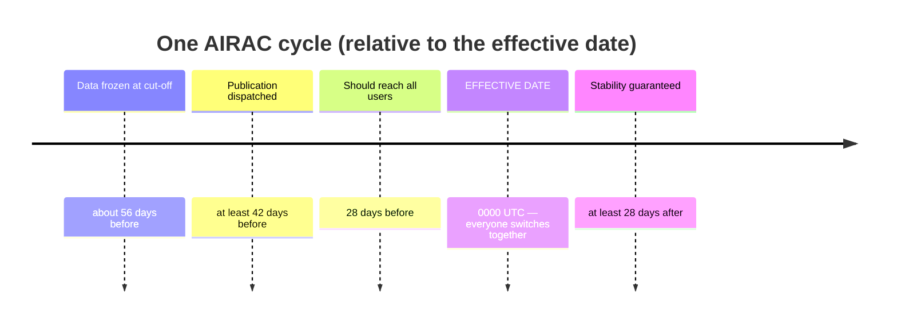

---
tags:
  - aviation-domain
  - ais-aim
  - process
aliases:
  - AIRAC
  - Aeronautical Information Regulation And Control
  - AIRAC cycle
reading-order: 14
created: 2026-09-01
---

# AIRAC

> [!abstract] The 30-second version
> **AIRAC** is a **fixed worldwide calendar of change dates, every 28 days**.
> Permanent, significant changes to aeronautical information all take effect
> on an AIRAC date and are published **well in advance**, so that every
> airline, chart maker and aircraft database around the world switches to the
> new data **at the same moment**.

## In plain words

Suppose an airway changes shape. If Country A updates its charts on the 1st,
an airline updates its database on the 5th, and a neighbouring country updates
on the 9th, then for over a week different people are flying with **different
pictures of the same airspace**. That's dangerous.

AIRAC fixes this by pre-agreeing the switch-over dates. Everyone freezes the
data early, publishes it early, builds their next version, and **flips to it
together** at 0000 UTC on the AIRAC effective date. It's a coordination
mechanism, not a technology.

## Why it exists

To guarantee that everyone in the world is working from the **same
aeronautical data at the same time**, despite the data changing constantly.

## The parts you actually need to know

### The rules (from ICAO Annex 15)

- **Interval:** exactly **28 days** between effective dates → **13 cycles a
  year**.
- **Advance notice:** AIRAC information must be *dispatched* at least **42
  days** before the effective date, aiming to reach users **28 days** ahead.
  Major changes get a **double cycle (56 days)** of notice.
- **Stability:** once published, AIRAC data must not change again for at least
  **28 days** after it takes effect (unless it was flagged temporary).

### The cycle identifier

Format **`YYCC`**: 2-digit year + cycle number. `AIRAC 2609` = the 9th cycle
of 2026. Charts and navigation databases are stamped with the cycle they're
valid for; using an expired cycle is a safety and legal problem for operators.

### AIRAC vs the alternatives

| The change is… | Publish it via… |
|---|---|
| permanent, significant, operationally important | **AIRAC** AIP Amendment |
| permanent but minor (a typo, an admin detail) | ordinary (non-AIRAC) amendment |
| temporary (weeks–months) | AIP Supplement, ideally AIRAC-aligned |
| short-notice / urgent / short-lived | **[[15 — NOTAMs\|NOTAM]]** |

> [!tip] Trigger NOTAM
> When an AIRAC amendment is issued, a short **trigger NOTAM** is often
> released too. It doesn't contain the change — it just points to the
> amendment and its effective date, so automated briefing systems flag it.

## How it connects to the rest

AIRAC is the production heartbeat of [[05 — AIS|AIS]]. Every [[13 — AIP|AIP]] amendment,
[[09 — Waypoints|waypoint]] change, new route and new procedure is timed to it, and
[[21 — AIXM|AIXM]] data sets and the aircraft navigation databases built by vendors all
follow the same calendar. [[25 — EAD|EAD]] distributes AIRAC data across countries.

## Jargon buster

| Term | Plain meaning |
|---|---|
| AIRAC | Aeronautical Information Regulation And Control |
| Cut-off | The date data is frozen for a cycle |
| Effective date | The date a cycle's changes become real |
| Trigger NOTAM | A short NOTAM announcing an AIRAC amendment |
| Double cycle | 56 days' notice, for major changes |

## Learn more

**Start here (beginner-friendly)**
- EUROCONTROL Aviation Intelligence Portal — *AIRAC*: <https://ansperformance.eu/acronym/airac/>
- SKYbrary — *Aeronautical Information Publications (AIPs)* (covers the AIRAC cycle): <https://skybrary.aero/articles/aeronautical-information-publications-aips>
- ICAO — *Aeronautical Information Regulation and Control (AIRAC)* overview: <https://www.icao.int/airnavigation/airac>
- Any AIRAC calendar (search "AIRAC effective dates") shows the 28-day rhythm.

**Go deeper (the official sources)**
- ICAO Annex 15 — *Aeronautical Information Services*, Chapter 6 *Aeronautical Information Updates*: <https://www.icao.int/sites/default/files/safety/CAPSCA/PublishingImages/Pages/ICAO-SARPs-(Annexes-and-PANS)/an15_1.pdf>
- Irish Aviation Authority — *Guidance Material on AIRAC*: <https://www.iaa.ie/docs/default-source/publications/advisory-memoranda/aeronautical-services-advisory-memoranda-(asam)/guidance-material-on-aeronautical-information-regulation-and-control-(airac).pdf>
- EUROCONTROL — *Aeronautical Information Regulation and Control (AIRAC) dates*: <https://www.eurocontrol.int/publication/aeronautical-information-regulation-and-control-airac-dates>
