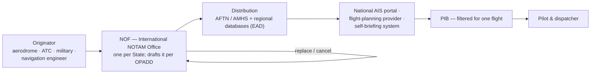

---
tags:
  - aviation-domain
  - ais-aim
  - dynamic-data
aliases:
  - NOTAMs
  - NOTAM
  - Notice to Airmen
  - Notice to Air Missions
reading-order: 15
created: 2026-09-01
---

# NOTAMs

> [!abstract] The 30-second version
> A **NOTAM** is a short, coded notice about something in the aviation system
> that has **changed at short notice** or is **temporary** — a closed runway,
> an unserviceable beacon, a crane, an airspace activation, a GPS outage. It's
> the "breaking news" of aeronautical information; the [[13 — AIP|AIP]] is the
> "encyclopaedia".

## In plain words

The [[13 — AIP|AIP]] can't keep up with fast-changing reality — it's on a 28-day
[[14 — AIRAC|AIRAC]] cycle. So when a runway closes tomorrow morning for three days, or a
navigation beacon fails, a **NOTAM** is issued: a brief message, in a fixed
format, that says *what*, *where*, *when it starts*, *when it ends*.

NOTAMs are written in heavy abbreviations and codes so that computers can
filter them and so they mean the same thing in every language. A pilot
planning a flight doesn't read every NOTAM in the country — a system filters
them down to the ones that matter for that route (see [[17 — PIB|PIB]]).

> [!note] The name
> Historically "**Notice to Airmen**". ICAO and many countries now expand it
> as "**Notice to Air Missions**". The word "NOTAM" itself is unchanged.

## Why it exists

To get **time-critical safety information** to pilots and dispatchers quickly,
in a standard machine-processable form, between AIRAC cycles.

## The parts you actually need to know

### The structure of an ICAO NOTAM

Every NOTAM is the same fixed set of lettered fields:

| Field | What it holds |
|---|---|
| *(header)* | **series letter + number / year** (e.g. `A1234/26`) then the **type**: `NOTAMN` new · `NOTAMR` replaces a NOTAM · `NOTAMC` cancels one. Series letters (A, B, C…) group NOTAMs by subject or area. |
| **Q)** | the **qualifier line** — the machine-readable summary (decoded below) |
| **A)** | the location(s) the NOTAM applies to (ICAO indicator(s), or a FIR) |
| **B)** | start of validity — `YYMMDDhhmm`, UTC |
| **C)** | end of validity — a date/time, or `PERM`, or `EST` (estimated; must be replaced before it expires) |
| **D)** | *(optional)* a **schedule** within the B–C window, e.g. `MON-FRI 0700-1500` or `0430-1630` |
| **E)** | the **plain-language text** — what is actually happening (this is what a human reads) |
| **F) / G)** | precise **lower / upper limits** — used mainly for navigation-warning NOTAMs |

### Worked example — a drone-activity NOTAM

```text
G0736/21 NOTAMN
# serials have specific usage decided on by ICAO or CAAP
# maximum of 999

# learn more about OPADD

Q) OBBB/QWULW/IV/BO/W/000/004/2513N05128E001 
# t p s  TPS  traffic purpose scope, requires validation preferably automated.


Subject Condition T P S LOWlmt UPPlmt Coordinates Radius

#these attributes have validation
 
#static database has all the credentials needed / ARP ie coordinates,etc.

A) OBBB
B) 2106140430
C) 2107141630
D) 0430-1630  #can be specific, UTC
E) REMOTELY PILOTED AIRCRAFT SYSTEM (RPAS) ACT WILL TAKE PLACE
   WI 1NM RADIUS OF 251300N0512800E. MAX HEIGHT 330FT AGL.  
F) SFC
G) 330FT AGL
```

| Element | Value → meaning |
|---|---|
| `G0736/21` | Series **G**, number **0736**, year **2021** |
| `NOTAMN` | Newly issued |
| **Q-line** | `FIR / Q-code / traffic / purpose / scope / lower / upper / coordinates+radius` |
| &nbsp;&nbsp;`OBBB` | the **FIR** — here Bahrain (Manila FIR would be `RPHI`, London `EGTT`, etc.) |
| &nbsp;&nbsp;`QWULW` | the **Q-code**: `W` = warnings group, `WU` = **unmanned aircraft**, `LW` = **will take place** → *"unmanned aircraft activity will take place"* |
| &nbsp;&nbsp;`IV` | **traffic** affected: both **I**FR and **V**FR |
| &nbsp;&nbsp;`BO` | **purpose**: `B` = put it in the pre-flight briefing / [[17 — PIB\|PIB]]; `O` = flight-operations relevance |
| &nbsp;&nbsp;`W` | **scope**: navigation **W**arning (`A` = aerodrome, `E` = en-route) |
| &nbsp;&nbsp;`000 / 004` | height band in hundreds of feet: **surface** to **≈400 ft** |
| &nbsp;&nbsp;`2513N05128E001` | centre **25°13′N 051°28′E**, radius **1 NM** |
| **A)** `OBBB` | applies FIR-wide (the precise spot is in the Q-line coordinates and the E) text) |
| **B)** `2106140430` | valid from **2021-06-14 04:30 UTC** |
| **C)** `2107141630` | valid until **2021-07-14 16:30 UTC** |
| **D)** `0430-1630` | but only **active daily 04:30–16:30 UTC** inside that month-long window |
| **E)** | the human-readable activity |
| **F) `SFC` / G) `330FT AGL`** | the *exact* limits — surface to 330 ft above ground |

> [!tip] Two things this example teaches
> 1. **The Q-line rounds outward.** The true upper limit is **330 ft** (field
>    G), but the Q-line shows **`004` (400 ft)** — always rounded to the
>    conservative side so a filter never hides a NOTAM that's marginally
>    relevant.
> 2. **B/C is the window; D is the pattern.** The NOTAM exists for a month, but
>    the drone flying only happens 04:30–16:30 each day.

### Reading a Q-code

Five letters, from **ICAO Doc 8400**:

```
Q  W U  L W
│  └┬┘  └┬┘
│   │    └── condition / status  (2 letters)
│   └─────── subject             (2 letters)
└─────────── always "Q"
```

The **first letter of the subject pair** tells you the broad category:

| | | | |
|---|---|---|---|
| `A` airspace organisation | `C` comms & surveillance | `F` facilities & services | `G` GNSS services |
| `I` ILS / MLS | `L` lighting | `M` movement & landing area | `N` nav aids (en-route/terminal) |
| `O` other | `P` ATM procedures | `R` airspace restrictions | `W` warnings |

Common **condition** pairs: `LC` closed · `LT` limited · `AS` unserviceable ·
`CM` under maintenance · `CS` installed/commissioned · `LW` will take place ·
`TT` on test · `XX` plain language (no code fits — trust field **E)**).

So `QMRLC` = **M**ovement area → **R**unway, **L**imitation → **C**losed =
*"runway closed"*. `QOBCE` = **O**ther → o**B**stacle, **C**hange →
**E**rected = *"obstacle erected"*.

Software filters on the **Q-code, traffic, scope and height band** — never on
the free text — to decide which NOTAMs reach which flight.

### The other Q-line qualifiers

| Qualifier | Values |
|---|---|
| **Traffic** | `I` IFR · `V` VFR · `IV` both |
| **Purpose** | `N` needs immediate attention on the day · `B` of interest for the [[17 — PIB\|PIB]] briefing · `O` flight-operations relevance · `M` miscellaneous (neither briefed nor operationally significant). Most common combo: **`NBO`**. |
| **Scope** | `A` aerodrome · `E` en-route · `W` nav warning · `AE`, `AW` combinations · `K` checklist |

### Special NOTAM formats

- **SNOWTAM** — runway surface conditions (snow, slush, ice, standing water),
  reported with the **Global Reporting Format (GRF)**. Since November 2021 the
  **maximum validity is 8 hours** (it used to be 24) — a fresh one is issued
  each time a new runway condition report comes in.
- **ASHTAM** — volcanic-ash activity and its effect on operations.
- **BIRDTAM** — bird-hazard concentrations (used in some regions).

### Where NOTAMs come from — and where you get them



- The **NOF (International NOTAM Office)** is the single national point that
  issues and receives NOTAMs — so a NOTAM is always **State/FIR-specific**.
- You do **not** find NOTAMs *inside* the [[13 — AIP|AIP]]. The AIP is the permanent
  reference; NOTAMs are the separate short-notice channel that **complements**
  it. You obtain them through a national AIS portal, a flight-planning
  provider, or a regional database like [[25 — EAD|EAD]] — and almost always **filtered
  for your route as a [[17 — PIB|PIB]]**.
- A temporary change that will last **months** is moved out of NOTAM into an
  **AIP Supplement**; a permanent one goes into an **[[14 — AIRAC|AIRAC]] AIP Amendment**.

> [!warning] The "NOTAM problem"
> One flight can generate **hundreds** of NOTAMs, many irrelevant, all in
> dense code. This is a recognised safety and workload issue. The fixes:
> better filtering ([[17 — PIB|PIB]]), disciplined writing ([[16 — OPADD|OPADD]]), plain-language
> reform, and **digital NOTAM** (structured [[21 — AIXM|AIXM]] data instead of free
> text — see [[22 — AIXM Temporality Model|AIXM Temporality Model]]).

## How it connects to the rest

NOTAMs are created by [[05 — AIS|AIS]] to the [[16 — OPADD|OPADD]] rules, distributed over
[[24 — AMHS|AMHS]], stored in databases like [[25 — EAD|EAD]], filtered into a [[17 — PIB|PIB]] for each
flight, and are the main driver of digital NOTAM work in [[21 — AIXM|AIXM]].

## Jargon buster

| Term | Plain meaning |
|---|---|
| NOTAM | Notice to Airmen / Air Missions |
| NOF | International NOTAM Office (one per State) |
| NOTAMN / R / C | New / Replaces / Cancels |
| Q-code | The 5-letter machine-readable subject/condition code (ICAO Doc 8400) |
| Series | The letter (A, B, C…) that groups NOTAMs by subject/area |
| EST | "Estimated" end time in field C) — must be replaced before it lapses |
| SNOWTAM / ASHTAM / BIRDTAM | Special formats: runway conditions / volcanic ash / bird hazard |
| GRF | Global Reporting Format — the standard for runway surface-condition reporting |
| AFTN | The legacy messaging network, predecessor of [[24 — AMHS\|AMHS]] |


EXAMPLE OF US' FORMAT OF NOTAM
### the system can automatically parse the US' message
Example
ex1:
ex2:
ex3:
## Learn more

**Start here (beginner-friendly)**
- GlobeAir — *Notice to Airmen (NOTAM)*: <https://www.globeair.com/g/notice-to-airmen-notam>
- SKYbrary — *Notice to Airmen (NOTAM)*: <https://skybrary.aero/articles/notice-airmen-notam>
- *How to read NOTAMs* — Learn ATC: <https://www.learn-atc.com/blog/how-to-read-notams>
- *How to Read a NOTAM for Drone Pilots* (walks through a Q-line): <https://www.jabdrone.com/post/how-to-read-a-notam-for-drone-pilots>

**Q-code / decoding references**
- Wikipedia — *NOTAM code* (full Q-code list): <https://en.wikipedia.org/wiki/NOTAM_code>
- FAA — *International NOTAM (Q) Codes* (Appendix B): <https://www.faa.gov/air_traffic/publications/atpubs/notam_html/appendix_b.html>

**Go deeper (the official sources)**
- ICAO Annex 15 — *Aeronautical Information Services* (NOTAM provisions): <https://www.icao.int>
- ICAO Doc 8126 — *AIS Manual* (NOTAM guidance, Q-code appendix): <https://store.icao.int>
- ICAO Doc 8400 — *ICAO Abbreviations and Codes* (defines the Q-codes): <https://store.icao.int>
- EUROCONTROL — *OPADD* (Operating Procedures for AIS Dynamic Data): <https://www.eurocontrol.int/publication/eurocontrol-guidelines-operating-procedures-ais-dynamic-data-opadd>
- ICAO — *EUR Doc 041, Guidance on the Issuance of SNOWTAM*: <https://www.icao.int/sites/default/files/APAC/Documents/EUR-Doc-041-Guidance-on-the-Issurance-of-SNOWTAM-Edition-1.1-December-2020.pdf>
