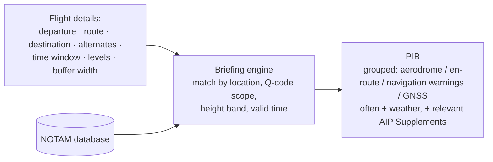

---
tags:
  - aviation-domain
  - ais-aim
  - products
aliases:
  - PIB
  - Pre-flight Information Bulletin
  - Preflight Information Bulletin
reading-order: 17
created: 2026-09-01
---

# PIB

> [!abstract] The 30-second version
> A **Pre-flight Information Bulletin (PIB)** is a **package of [[15 — NOTAMs|NOTAMs]],
> filtered and sorted for one specific flight** — its departure airport,
> route, destination, alternates, and a corridor of airspace around them, for
> the planned time window. Instead of reading every NOTAM in the country, the
> crew reads the PIB.

## In plain words

There might be thousands of active NOTAMs across a region. Almost none of them
matter for your particular flight from A to B at 3 pm today. A **briefing
system** takes your flight details, matches them against the NOTAM database
using each NOTAM's location, [[15 — NOTAMs|Q-code]] scope, height band and validity
time, and produces a tidy bulletin containing **only the relevant ones**,
grouped sensibly.

That bulletin is the PIB. Airline flight-planning systems generate one
automatically and attach it to the operational flight plan; a smaller operator
might request one from a briefing office or a self-service portal.

## Why it exists

To turn an unmanageable flood of NOTAMs into a **short, relevant, trustworthy
brief** for a specific flight — reducing the chance a crew misses something
important or wastes time on noise.

## The parts you actually need to know

### How a PIB is built

### Types of PIB

| Type | Scope |
|---|---|
| **Aerodrome PIB** | NOTAMs for one airport and its vicinity |
| **Area PIB** | NOTAMs for a whole [[10 — FIR\|FIR]] or defined area |
| **Route (narrow-route) PIB** | NOTAMs along the specific planned route plus a lateral/vertical buffer — the most useful for a given flight |

### Garbage in, garbage out

| If a NOTAM has… | Then the PIB… |
|---|---|
| the wrong Q-code **scope** | shows it to the wrong flights, or hides it from the right ones |
| a too-large geographic radius | floods unrelated routes |
| vague **E)** text | forces the crew to interpret it under time pressure |
| a broken replace/cancel chain | shows stale or duplicate items |

This is why [[16 — OPADD|OPADD]] discipline is a safety matter, not just tidiness.

## How it connects to the rest

The PIB is an [[05 — AIS|AIS]] *service* (as opposed to a *product* like the [[13 — AIP|AIP]]).
It's assembled from [[15 — NOTAMs|NOTAMs]] (quality depends on [[16 — OPADD|OPADD]]), often combined
with [[18 — METAR|METAR]]/TAF, and delivered through national portals or shared databases
like [[25 — EAD|EAD]]. It typically ends up embedded in the [[19 — FPL|flight plan]] package.

## Jargon buster

| Term | Plain meaning |
|---|---|
| PIB | Pre-flight Information Bulletin |
| Self-briefing | The operator runs the query themselves via a portal |
| Buffer | The margin around the route within which NOTAMs are considered relevant |
| NOTAM checklist / summary | A separate monthly list of *valid NOTAM numbers*, so users can spot anything they missed |
| RAIM | A GNSS-availability prediction sometimes included in a PIB |

## Learn more

**Start here (beginner-friendly)**
- SKYbrary — *Pre-flight Preparation*: <https://skybrary.aero/articles/pre-flight-preparation>
- SKYbrary — *Briefing Facilities* (NOTAM/PIB briefing services): <https://skybrary.aero/index.php/Briefing_Facilities>
- SKYbrary — *Notice to Airmen (NOTAM)* (how filtering works): <https://skybrary.aero/articles/notice-airmen-notam>
- EUROCONTROL — *European AIS Database (EAD)* briefing services overview: <https://www.eurocontrol.int/service/european-ais-database>

**Go deeper (the official sources)**
- ICAO Annex 15 — *Aeronautical Information Services* (pre-flight information): <https://www.icao.int>
- ICAO Doc 10066 — *PANS-AIM* (pre-flight information & the PIB): <https://www.unitingaviation.com/wp-content/uploads/2019/04/Doc-10066-Preview.pdf>
