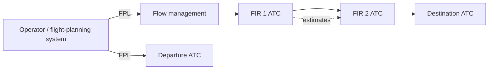

---
tags:
  - aviation-domain
  - flight-data
aliases:
  - FPL
  - Flight Plan
  - ICAO Flight Plan
  - Filed Flight Plan
reading-order: 19
created: 2026-09-01
---

# FPL

> [!abstract] The 30-second version
> A **flight plan (FPL)** is the message an operator files with [[03 — ATC|ATC]] before
> a flight, describing **what the aircraft is, where it's going, which route
> and altitude, when, and what equipment it carries**. ATC and flow management
> use it to plan and to know what to expect. The format is a global [[01 — ICAO|ICAO]]
> standard.

## In plain words

Before an IFR flight, someone (the airline's operations, or a pilot) submits a
short structured form: callsign, aircraft type, departure and destination,
proposed route as a list of [[09 — Waypoints|Waypoints]] and airways, cruising speed and
level, estimated timings, on-board equipment. That's the flight plan.

It's then distributed to every [[03 — ATC|ATC]] unit along the way and to
[[04 — ATFM|flow management]], so each of them knows this aircraft is coming, by
which route, at what time and level. As the flight progresses, updates
(delays, changes, cancellations) are sent as follow-up messages.

## Why it exists

So the whole chain of controllers and flow managers can **anticipate** each
flight instead of reacting to it — and so search-and-rescue knows what the
aircraft intended if it goes missing.

## The parts you actually need to know

### The ICAO flight plan form (PANS-ATM Doc 4444, Appendix 2)

Key numbered items (this "FPL 2012" format is used worldwide):

| Item   | Field                                                        | Example                       |
| ------ | ------------------------------------------------------------ | ----------------------------- |
| **7**  | aircraft identification (callsign)                           | `BAW117`                      |
| **8**  | flight rules / type of flight                                | `I` (IFR) / `S` (scheduled)   |
| **9**  | number, type, wake-turbulence category                       | `1/B77W/H`                    |
| **10** | equipment & capabilities (comms / navigation / surveillance) | `SDE3FGHIRWY/LB1`             |
| **13** | departure aerodrome + time (UTC)                             | `EGLL1230`                    |
| **15** | cruising speed, level, and the **route**                     | `N0480F350 CPT L9 KENET ...`  |
| **16** | destination + total estimated time + alternates              | `KJFK0715 KBOS`               |
| **18** | other information                                            | `PBN/A1B1 DOF/260901 REG/...` |

![[fpl-icao-flight-plan-form.png|520]]
*The blank **ICAO model flight plan form**. Notice the item numbers on the form
(3, 7, 8, 9, 10, 13, 15, 16, 18, 19) match the table above — item 7 really is
Aircraft Identification, item 13 the departure aerodrome, item 15 the route,
and so on. (ICAO PANS-ATM, Doc 4444, Appendix 2.)*

> [!warning] Two different "flight plan forms"
> The **ICAO** form above uses item numbers 7, 8, 9, 10, 13, 15… . Some
> countries also have their own **domestic** form with *different* block
> numbers (for example the old FAA domestic form numbers cruising altitude as
> block 7). When someone quotes "Item 15", they almost always mean the
> **ICAO** item 15 — the one used internationally and in ATS messages.

### Filling it in by hand — a worked example

> [!tip] The form is the *last* step
> You don't "fill the form" first. You plan the flight — route, cruising
> level, fuel, timings, weather, alternates — and the form is just the
> standardised way of writing that plan down. Every item has a strict format;
> a wrong character can get the plan rejected by the receiving system.

**Scenario:** one Cessna 172, registration `G-ABCD`, no operating company.
IFR, general aviation. From **EGKB** (off-blocks 09:00 UTC) to **LFAT**,
cruising 120 kt true at FL080, routing direct via two en-route points
(`DET` and `DVR` below are illustrative — the real ones come from the
published route network). About 45 min en route, alternate **LFAC**.
GNSS-equipped and RNAV-1 approved.

| Item                                  | What you write                           | How it's built                                                                                                                                                                                                                                                                                                                    |
| ------------------------------------- | ---------------------------------------- | --------------------------------------------------------------------------------------------------------------------------------------------------------------------------------------------------------------------------------------------------------------------------------------------------------------------------------- |
| **7** Aircraft ident                  | `GABCD`                                  | No airline, so use the registration (no hyphen). If it were an airline flight: the 3-letter ICAO airline code + flight number, e.g. `BAW117`.                                                                                                                                                                                     |
| **8** Flight rules / type             | `I` &nbsp;&nbsp; `G`                     | `I` = whole flight IFR (`V` VFR, `Y` IFR-then-VFR, `Z` VFR-then-IFR). `G` = general aviation (`S` scheduled, `N` non-scheduled, `M` military, `X` other).                                                                                                                                                                         |
| **9** Number / type / wake            | `C172/L`                                 | Number omitted = 1 aircraft. `C172` = the Doc 8643 type designator. `/L` = Light wake category (`M` medium, `H` heavy, `J` super).                                                                                                                                                                                                |
| **10** Equipment & capabilities       | `SGR/S`                                  | Before the `/`: `S` = standard (VHF radio, VOR, ILS), plus `G` GNSS and `R` = PBN approved. Add more letters for what's fitted (`D` DME, `F` ADF, `Y` 8.33 kHz radio…). After the `/` (surveillance): `S` = Mode S transponder (`C` = Mode A+C, `N` = none, `B1/B2` = ADS-B). If you put `R`, you **must** add `PBN/` in Item 18. |
| **13** Departure + time               | `EGKB0900`                               | ICAO location indicator + estimated **off-block** time, UTC, `HHMM`.                                                                                                                                                                                                                                                              |
| **15** Speed / level / route          | `N0120F080 DCT DET DCT DVR`              | Speed **and** level written together, no space: `N0120` = 120 kt (`K0120` = km/h, `M082` = Mach 0.82); `F080` = FL080 (`A045` = altitude 4 500 ft below transition altitude). Then a space, then the route: `DCT` = direct, point names or airway designators between points.                                                     |
| **16** Destination / EET / alternates | `LFAT0045 LFAC`                          | Destination indicator + **total** estimated time en route (`HHMM`) + alternate aerodrome(s), space-separated.                                                                                                                                                                                                                     |
| **18** Other information              | `PBN/D2 DOF/260915 REG/GABCD`            | Sub-fields, each `KEY/value`, space-separated: `PBN/D2` = RNAV-1 capability (required because of `R` in Item 10); `DOF/` = date of flight `YYMMDD`; `REG/` = registration. Put `0` (zero) if there is genuinely nothing.                                                                                                          |
| **19** Supplementary                  | `E/0400 P/2 R/V S/M J/L A/WHITE C/SMITH` | `E/` endurance `HHMM`, `P/` persons on board, `R/` emergency radio, `S/` survival equipment, `J/` life jackets, `A/` aircraft colour & markings, `C/` pilot-in-command. **Kept by the ATS unit — not transmitted in the FPL message.**                                                                                            |

**The same plan as the transmitted FPL message** (what you'd actually see in a
system — items are separated by `-`):

```text
(FPL-GABCD-IG
-C172/L-SGR/S
-EGKB0900
-N0120F080 DCT DET DCT DVR
-LFAT0045 LFAC
-PBN/D2 DOF/260915 REG/GABCD)
```

> [!warning] Common ways it gets rejected
> - **Item 15 route** doesn't match the current published network / [[14 — AIRAC|AIRAC]]
>   cycle, or uses an airway at a level it isn't valid for.
> - **Item 10 / Item 18** mismatch — `R` in Item 10 but no `PBN/` in Item 18,
>   or `PBN/` codes the aircraft can't actually do.
> - Wrong field widths — speed must be exactly `N` + 4 digits, level `F` + 3
>   digits, times `HHMM`.
> - `ZZZZ` used for a non-ICAO aerodrome or point without the matching
>   `DEP/`, `DEST/` or `DCT` explanation in Item 18.

*(Practise by taking a real short IFR route, planning it, and writing out
Items 7–19 from scratch, then check each field's format against the video and
the Doc 4444 instructions in **Learn more**.)*

### Related messages

`FPL` (filed) · `CHG` (change) · `CNL` (cancel) · `DLA` (delay) · `DEP` /
`ARR` (departure / arrival) · `CPL` / `EST` (passed between ATC units) ·
`RPL` (repetitive flight plan, for regular scheduled services). These travel
over [[24 — AMHS|AMHS]].

### How a flight plan flows



### Where it's heading: FF-ICE

Today's FPL is a fixed message filed a few hours before departure. **FF-ICE**
(*Flight & Flow Information for a Collaborative Environment*, ICAO **Doc
9965**) replaces it with continuous, structured **[[23 — FIXM|FIXM]]** exchanges — the
operator and the ANSPs share and negotiate the **4-D trajectory** from
planning through execution. This is the basis of **[[27 — TBO|TBO]]**.

### Data-quality angle

The **Item 15 route** must resolve against the **current published** route
network and [[09 — Waypoints|Waypoints]] for that [[14 — AIRAC|AIRAC]] cycle, and against the routes
open that day (see [[28 — AMC Tables|AMC Tables]]). Bad aeronautical data → valid flight plans
get rejected, or invalid ones get accepted.

## How it connects to the rest

The FPL is the bridge between **aeronautical information** (routes,
[[09 — Waypoints|Waypoints]], airspace that [[05 — AIS|AIS]] publishes) and **flight information**
(what one aircraft intends — [[23 — FIXM|FIXM]]). It's consumed by [[03 — ATC|ATC]] and
[[04 — ATFM|ATFM]] and carried over [[24 — AMHS|AMHS]].

## Jargon buster

| Term | Plain meaning |
|---|---|
| FPL | (Filed) Flight Plan |
| EET | Estimated Elapsed Time |
| EOBT | Estimated Off-Block Time (when the aircraft leaves the gate) |
| RPL | Repetitive Flight Plan |
| FF-ICE | Flight & Flow Information for a Collaborative Environment |
| PBN | Performance-Based Navigation (see [[08 — NAVAIDs\|NAVAIDs]]) |

## Learn more

**Start here — how to fill the form**
- *How To Fill ICAO Flight Plan* (video): <https://www.youtube.com/watch?v=Vv2s4okaf4I>
- Learn To Fly — *CFI Brief: ICAO Flight Plan Form* (item by item): <https://learntoflyblog.com/cfi-brief-icao-flight-plan-form/>
- PilotMall — *How to File a Flight Plan: step-by-step*: <https://www.pilotmall.com/blogs/news/how-to-file-a-flight-plan-step-by-step-guide>
- SKYbrary — *Flight Plan Completion*: <https://skybrary.aero/articles/flight-plan-completion>
- Wikipedia — *Flight plan*: <https://en.wikipedia.org/wiki/Flight_plan>

**Go deeper (the official sources)**
- ICAO Doc 4444 — *PANS-ATM*, **Appendix 2 + "Instructions for the completion of the flight plan form"** (the authoritative field-by-field rules): <https://ibs.rlp.cz/ext/aktuality/Doc4444.pdf>
- ICAO Doc 8643 — *Aircraft Type Designators* (for Item 9): <https://www.icao.int/publications/DOC8643/Pages/Search.aspx>
- ICAO Doc 9965 — *Manual on FF-ICE*: <https://store.icao.int>
- EUROCONTROL — *IFPS Users Manual* (how filed plans are validated in Europe): <https://www.eurocontrol.int/publication/ifps-users-manual>
