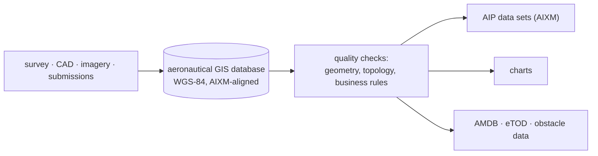

---
tags:
  - aviation-domain
  - gis
aliases:
  - GIS
  - Geographic Information System
  - Geographic Information Systems
  - Geospatial
reading-order: 20
created: 2026-09-01
---

# GIS

> [!abstract] The 30-second version
> A **GIS (Geographic Information System)** is software and data for storing,
> analysing and displaying **anything with a location**. Aeronautical
> information is intensely spatial — every runway, airspace, route, obstacle
> and beacon is a point, line or polygon on the Earth — so modern [[05 — AIS|AIS]] is
> essentially a **specialised GIS** with aviation rules on top.

## In plain words

If you've used Google Maps, you've used a GIS. The core idea: real things
(a road, a lake, a building) are stored as **shapes with coordinates** plus a
set of **attributes** (name, type, size). You can then draw them, measure
them, and ask spatial questions ("what's within 5 km of here?").

Aeronautical data is the same, just stricter. A runway threshold isn't
"roughly there" — it's a coordinate accurate to a fraction of a second of
arc, in a specified reference system, with a documented source. Get the
reference system wrong and the same runway lands in two different places.

## Why it matters here

[[21 — AIXM|AIXM]] geometry *is* GIS geometry (AIXM is built on the OGC **GML**
standard). Producing AIP data sets, aerodrome maps, obstacle data and digital
charts is all GIS work: coordinate systems, projections, topology, quality
checks.

## The parts you actually need to know

### Core concepts

| Concept | Plain meaning |
|---|---|
| **Feature** | a real thing with a location (a runway, an airspace) |
| **Geometry** | its shape — point, line, or polygon (and 3-D versions) |
| **Attributes** | its non-spatial facts (name, frequency, class) |
| **CRS / datum** | the rules that turn "51.47°N, 0.46°W" into a real spot on Earth |
| **Projection** | how the curved Earth is flattened onto a flat chart (always distorts something) |
| **Topology** | how features connect and share edges (no gap between two adjacent [[10 — FIR\|FIRs]]) |
| **Metadata** | data about the data: source, accuracy, date, lineage |

### WGS-84 — the one datum to remember

[[01 — ICAO|ICAO]] requires **WGS-84** (World Geodetic System 1984) as the common
horizontal reference for all published aeronautical coordinates (Annex 15;
guidance in **Doc 9674**). Before WGS-84, every country used its own local
datum, so the same runway had different coordinates in different countries —
sometimes off by hundreds of metres.

### Data quality, made concrete

| Data | Typical published resolution | Integrity |
|---|---|---|
| Runway threshold | ~0.3 m | **critical** |
| Beacon position | fine | essential / critical |
| Airspace boundary point | ~30 m | essential |
| En-route [[09 — Waypoints\|Waypoints]] | fine | essential |
| Obstacle position / height | metre-level near aerodromes | **critical** near aerodromes |

### Aviation GIS datasets you'll hear about

- **AMDB** — *Aerodrome Mapping Database*: a full spatial model of an airport
  surface → moving maps in the cockpit.
- **eTOD** — *electronic Terrain and Obstacle Data*: gridded terrain +
  obstacles in defined areas around aerodromes and routes.
- **Digital charts** — AIP charts generated from the same GIS data (one
  source, many products).

## How it connects to the rest

GIS is the spatial foundation under [[07 — Aerodromes|Aerodromes]], [[08 — NAVAIDs|NAVAIDs]], [[09 — Waypoints|Waypoints]],
[[10 — FIR|FIR]] boundaries and [[28 — AMC Tables|AMC Tables]] — and directly under [[21 — AIXM|AIXM]], which
encodes all of it.

## Jargon buster

| Term | Plain meaning |
|---|---|
| CRS | Coordinate Reference System |
| WGS-84 | The global coordinate system aviation uses |
| GML | Geography Markup Language — the OGC standard AIXM is built on |
| OGC | Open Geospatial Consortium (the standards body) |
| AMDB / eTOD | Aerodrome Mapping Database / electronic Terrain and Obstacle Data |
| Geoid | The "mean sea level" surface used for elevations |

## Learn more

**Start here (beginner-friendly)**
- Esri — *What is GIS?* (vendor-neutral primer): <https://www.esri.com/en-us/what-is-gis/overview>
- Wikipedia — *Geographic information system*: <https://en.wikipedia.org/wiki/Geographic_information_system>
- SKYbrary — *World Geodetic System 1984 (WGS84)*: <https://skybrary.aero/articles/world-geodetic-system-1984-wgs84>

**Go deeper (the official sources)**
- ICAO Annex 15 — *Aeronautical Information Services* (WGS-84, data quality): <https://www.icao.int>
- ICAO Doc 9674 — *World Geodetic System — 1984 (WGS-84) Manual*: <https://store.icao.int>
- OGC — *Geography Markup Language (GML)*: <https://www.ogc.org/standard/gml/>
- ICAO — *eTOD (electronic Terrain and Obstacle Data)* requirements, Annex 15 / PANS-AIM: <https://www.icao.int>
