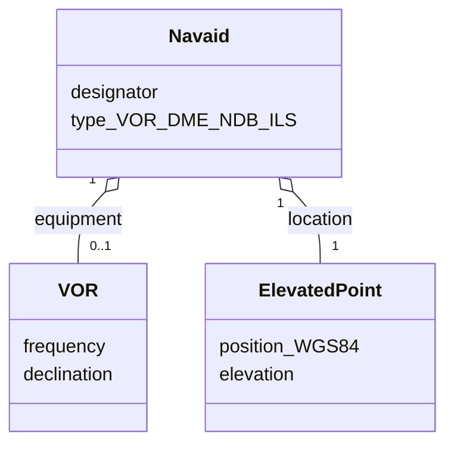

---
tags:
  - aviation-domain
  - exchange-models
aliases:
  - AIXM
  - Aeronautical Information Exchange Model
reading-order: 21
created: 2026-09-01
---

# AIXM

> [!abstract] The 30-second version
> **AIXM (Aeronautical Information Exchange Model)** is the **global data model
> and XML format for aeronautical information**. It defines *what* an
> aerodrome, runway, airspace, route or beacon **is** as structured data —
> every property, unit and relationship — so systems in different countries
> and from different vendors can exchange the [[13 — AIP|AIP]]'s content without
> re-typing it.

## In plain words

If two computers are going to exchange "the airspace and routes", they must
first **agree exactly what those things are**: what fields an airspace has,
what units altitudes are in, how a route connects to its waypoints. AIXM is
that shared agreement — a big, carefully-designed schema — plus a file format
(XML) to send the data in.

Think of it as a **standard database design for aeronautical information**,
maintained internationally so everyone builds to the same shape.

## Why it exists

To make the [[05 — AIS|AIS]] → AIM transition possible: instead of publishing PDFs that
humans re-key, countries publish **machine-readable data** that flows straight
into flight-planning systems, chart production, and shared databases.

## The parts you actually need to know

### Two layers

| Layer                      | What it is                                                                                                                                                                               |
| -------------------------- | ---------------------------------------------------------------------------------------------------------------------------------------------------------------------------------------- |
| **Conceptual model (UML)** | a diagram of ~150 **features** — AirportHeliport, Runway, Airspace, Navaid, DesignatedPoint, Route, RouteSegment… — with their properties and relationships. Vendor- and format-neutral. |
| **XML schema**             | the concrete file format, built on the OGC **GML** standard, so AIXM geometry is standard [[20 — GIS\|GIS]] geometry.                                                                    |

### Versions

| Version              | Notes                                                                                                                                                                                           |
| -------------------- | ----------------------------------------------------------------------------------------------------------------------------------------------------------------------------------------------- |
| **AIXM 4.5**         | older, pre-GML; still seen in legacy interfaces                                                                                                                                                 |
| **AIXM 5.1 / 5.1.1** | GML-based; the version most deployed systems still run; introduced the [[22 — AIXM Temporality Model\|temporality model]]                                                                       |
| **AIXM 5.2**         | the **current** specification (released January 2025): adds GNSS elements, runway condition reporting, instrument-procedure updates. The next regular update (5.3) is not expected before 2030. |

### A feature, conceptually

Every real feature also carries **time** — see the next note.

### The exchange-model family

AIXM is one of three models that share design principles so they interoperate:

| Model | Domain |
|---|---|
| **AIXM** | aeronautical information (this note) |
| **[[23 — FIXM\|FIXM]]** | flight information / flight plans |
| **IWXXM** | aeronautical weather ([[18 — METAR\|METAR]] etc.) |

Together they are the payload standards for **[[26 — SWIM|SWIM]]**.

### Governance

AIXM is **jointly managed by EUROCONTROL and the US FAA**. Change requests go
through a **Change Control Board**. The spec, schema and validation rules are
published openly; **business rules** (some machine-checkable) let you validate
a dataset automatically.

### Digital NOTAM

A **digital NOTAM** = a temporary event expressed as an AIXM change (a
`TEMPDELTA`) instead of free text. "Runway closed 1–15 Sep" becomes a
structured update to the Runway feature's availability for that period —
enabling automatic mapping, filtering and briefing. See [[15 — NOTAMs|NOTAMs]] and
[[22 — AIXM Temporality Model|AIXM Temporality Model]].

## How it connects to the rest

AIXM encodes the content of the [[13 — AIP|AIP]], uses [[20 — GIS|GIS]]/GML geometry, is
distributed by [[25 — EAD|EAD]] and over [[26 — SWIM|SWIM]], and carries digital [[15 — NOTAMs|NOTAMs]]. Its
time model is important enough to have [[22 — AIXM Temporality Model|its own note]].

## Jargon buster

| Term | Plain meaning |
|---|---|
| AIXM | Aeronautical Information Exchange Model |
| Feature | A modelled real-world thing (airspace, runway, navaid…) |
| GML | Geography Markup Language — the geometry standard AIXM builds on |
| UML | Unified Modeling Language — how the conceptual model is drawn |
| Business rule | A data-validation rule (e.g. "an airspace must have a class") |
| BASELINE / TEMPDELTA / PERMDELTA | AIXM time-slice types (next note) |

## Learn more

**Start here (beginner-friendly)**
- Wikipedia — *AIXM*: <https://en.wikipedia.org/wiki/AIXM>
- EUROCONTROL — *Aeronautical Information Exchange Model (AIXM)*: <https://www.eurocontrol.int/model/aeronautical-information-exchange-model>
- *International Airport Review* — *The Aeronautical Information Exchange Model (AIXM)*: <https://www.internationalairportreview.com/article/6570/the-aeronautical-information-exchange-model-aixm/>

**Go deeper (the official sources)**
- AIXM — official site and *Versions* page: <https://aixm.aero/page/versions>
- AIXM — *5.2 Specification* (current): <https://aixm.aero/page/aixm-52-specification>
- FAA — *AIXM*: <https://www.faa.gov/about/office_org/headquarters_offices/ato/service_units/mission_support/aixm>
- OGC — *Geography Markup Language (GML)*: <https://www.ogc.org/standard/gml/>
