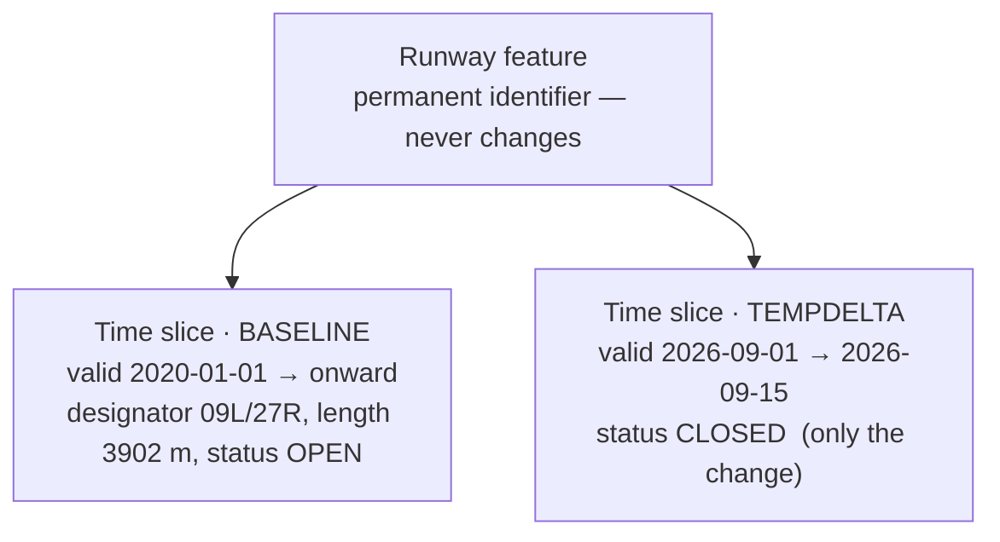

---
tags:
  - aviation-domain
  - exchange-models
  - data-modelling
aliases:
  - AIXM Temporality Model
  - AIXM Temporality Concept
  - Temporality Model
  - Time Slices
reading-order: 22
created: 2026-09-01
---

# AIXM Temporality Model

> [!abstract] The 30-second version
> Aeronautical information is always **valid for a period of time** — a runway
> is open until it's closed for works; a frequency changes on an [[14 — AIRAC|AIRAC]]
> date; an area is active only on certain nights. The **AIXM Temporality
> Model** is how [[21 — AIXM|AIXM]] attaches **"true from → true until"** to every fact,
> using objects called **time slices**. It's the idea that makes **digital
> [[15 — NOTAMs|NOTAMs]]** possible.

## In plain words

In an ordinary database, a runway row just says `status = OPEN`. But aviation
needs to answer questions like *"what was the status on 3 September?"* and
*"what will it be during the works next month?"* — past, present and future,
all at once.

AIXM solves this by never storing properties directly on a feature. Instead,
the feature has a permanent identity and holds a **list of time slices**. Each
slice describes what the feature looked like **during one period**. A
permanent state is one kind of slice; a temporary change (like a NOTAM) is
another kind, laid **on top** of the permanent one for its dates only.

## Why it exists

So that one dataset can carry a feature's **whole history and its planned
future**, and any consumer can compute *"the effective picture at time T"*.

## The parts you actually need to know

### Feature = identity + a list of time slices

### The four main time-slice types

| `interpretation` | Meaning | Everyday analogy |
|---|---|---|
| **BASELINE** | the full, permanent picture valid from a date onward | the master record |
| **PERMDELTA** | a **permanent change** to the baseline from a date (e.g. an AIRAC amendment) | an edit committed to the master |
| **TEMPDELTA** | a **temporary change** for a bounded period, after which the baseline resumes (e.g. a NOTAM) | a sticky note over part of the record |
| **SNAPSHOT** | the complete state at one instant, computed from baseline + deltas | a "flattened" read for systems that can't process deltas |

Also: **`correctionNumber`** — version 0 is the original slice, 1+ are
corrections that **fix an error** in it (not a real-world change).

### Worked example — a beacon's life

> [!example] Events for one navigation beacon
> - **7 Jan** — commissioned
> - **23 Jan – 18 Feb** — temporary frequency change
> - **11 Feb – 9 Mar** — temporarily offline
> - **22 Feb** — magnetic variation updated (permanent)
> - **27 Mar** — frequency changed (permanent)

![[aixm-temporality-vor-timeline.png|560]]
*The history as a timeline: two permanent changes (diamonds) and two
overlapping temporary events. (AIXM 5.1 Temporality Concept, Fig 22.)*

![[aixm-temporality-vor-timeslices.png|620]]
*Encoded as time slices: BASELINE slices for the permanent states, TEMPDELTA
slices for the temporary events, overlapping events kept as separate slices.
(AIXM 5.1 Temporality Concept, Fig 23.)*

### How a consumer reads it

To answer *"what is the frequency on 2 Feb?"* a system:

1. takes the applicable **BASELINE** (plus any **PERMDELTA** up to that date),
2. lays any **TEMPDELTA** whose period covers 2 Feb **on top**,
3. reads the resulting effective value.

### Schedules

A property can also carry a **schedule** ("active 2200–0600 daily, Mon–Fri")
so a recurring activation doesn't need one slice per night — useful for
military areas (see [[28 — AMC Tables|AMC Tables]]).

## Common mistakes

| Mistake | Why it's wrong |
|---|---|
| two BASELINE slices with overlapping periods | the effective state becomes ambiguous |
| a TEMPDELTA with no end date | that's a permanent change → should be a PERMDELTA |
| putting *every* property in a TEMPDELTA | a delta carries **only what changed** |
| treating a data-fix as a real-world change | a correction keeps the same period, bumps `correctionNumber` |

## How it connects to the rest

The temporality model is the beating heart of [[21 — AIXM|AIXM]]. It's what lets
[[15 — NOTAMs|NOTAMs]] (temporary) and [[14 — AIRAC|AIRAC]] amendments (permanent) live in the same
dataset, and it's the QA focus for anyone validating or authoring AIXM.

## Jargon buster

| Term | Plain meaning |
|---|---|
| BASELINE / PERMDELTA / TEMPDELTA / SNAPSHOT | the time-slice types |
| validTime | the period a time slice describes |
| featureLifetime | the birth → death of the feature itself |
| Delta | a slice that carries only what changed |
| Effective picture | the state you get after combining baseline + applicable deltas |

## Learn more

**Start here (beginner-friendly)**
- SKYbrary — *Digital NOTAM Brochure* (why the model exists): <https://skybrary.aero/bookshelf/digital-notam-brochure>
- AIXM — *Temporality Concept* introduction (skim the first few pages): <https://aixm.aero/sites/default/files/imce/AIXM51/aixm_temporality_1.0.pdf>

**Go deeper (the official sources)**
- AIXM — *Temporality Concept (v1.0 for AIXM 5.1)* — source of the figures above: <https://aixm.aero/sites/default/files/imce/AIXM51/aixm_temporality_1.0.pdf>
- AIXM — *Temporality Concept v1.1 (AIXM 5.1.1)*: <https://aixm.aero/sites/default/files/imce/AIXM511/aixm_temporality_1.1.pdf>
- AIXM — *5.2 Specification* (current version; the temporality concept carries forward largely unchanged): <https://aixm.aero/page/aixm-52-specification>
