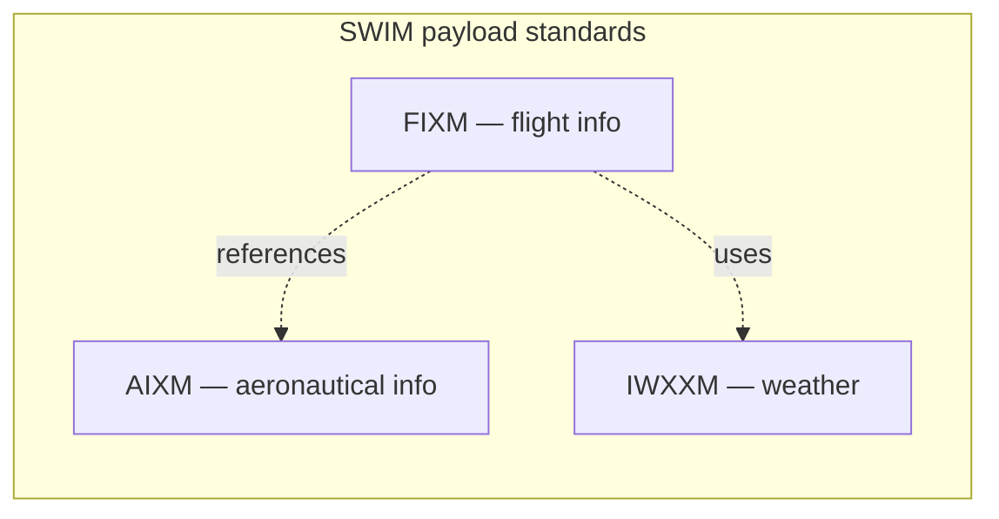

---
tags:
  - aviation-domain
  - exchange-models
aliases:
  - FIXM
  - Flight Information Exchange Model
reading-order: 23
created: 2026-09-01
---

# FIXM

> [!abstract] The 30-second version
> **FIXM (Flight Information Exchange Model)** is the **global data model and
> XML format for flight information** — everything about a *specific flight*:
> its identification, route, times, trajectory, equipment, operator and
> status. It's the flight-side counterpart to [[21 — AIXM|AIXM]] (aeronautical info) and
> **IWXXM** (weather).

## In plain words

The old way to describe a flight is the **[[19 — FPL|FPL]]** — a fixed message with
numbered fields, filed once. FIXM represents the same information (and much
more: the full **4-D trajectory**, negotiation status, constraints) as
structured data that can be **exchanged continuously** as the flight is
planned and flown.

If AIXM is "a shared database design for the airspace", FIXM is "a shared
database design for the flights moving through it".

## Why it exists

To let airlines, airports and ANSPs share flight and flow information using
**one common, internationally-accepted standard** — and to carry the **FF-ICE**
concept that replaces the single pre-departure flight plan.

## The parts you actually need to know

### The exchange-model family

A flight's FIXM route **references** the [[09 — Waypoints|Waypoints]], airways and airspace
that [[05 — AIS|AIS]] publishes in AIXM — so consistent identifiers across both models
are what make automated route-checking and trajectory prediction work.

### Architecture: Core + Extensions

| Part | Contents |
|---|---|
| **FIXM Core** | globally-applicable flight data, traceable to ICAO requirements (Doc 4444; Doc 9965 FF-ICE) |
| **Extensions** | region/community additions kept as separate schemas (e.g. a US extension, a EUROCONTROL extension) so the Core stays clean |

Implemented in **UML + XML schema**, technology-independent, developed openly.
The current release is the **FIXM 4.x** line (FIXM Core 4.3.0), with regional
extensions still being added.

### FF-ICE — the concept FIXM serves

**FF-ICE** = *Flight & Flow Information for a Collaborative Environment*
(ICAO **Doc 9965**). Instead of one flight plan filed a few hours out:

| Step | Nickname | What happens |
|---|---|---|
| Planning | **FF-ICE / R1** | operator shares flight data as FIXM; ANSPs return acceptability and constraints; iterate before departure |
| Execution | **FF-ICE / R2** | the trajectory is continuously revised and shared in real time |

The shared, agreed **4-D trajectory** (latitude, longitude, altitude and
**time** at each point) is the "common plan" — see [[27 — TBO|TBO]].

### Governance

Governed by a multi-stakeholder arrangement with **FAA and EUROCONTROL**
heavily involved (mirroring [[21 — AIXM|AIXM]]); releases, schemas and the data
dictionary are published at **fixm.aero**.

## How it connects to the rest

FIXM carries the modern [[19 — FPL|FPL]], references [[21 — AIXM|AIXM]] and [[09 — Waypoints|Waypoints]], rides
on [[26 — SWIM|SWIM]], feeds [[04 — ATFM|ATFM]], and is a building block of [[27 — TBO|TBO]].

## Jargon buster

| Term | Plain meaning |
|---|---|
| FIXM | Flight Information Exchange Model |
| FF-ICE | Flight & Flow Information for a Collaborative Environment |
| 4-D trajectory | 3-D position plus time at each point |
| Core / Extension | the globally-common part / region-specific add-ons |
| eFPL | the enhanced flight plan under FF-ICE |

## Learn more

**Start here (beginner-friendly)**
- FIXM — official site (short overview): <https://www.fixm.aero/>
- FAA — *FIXM Background* fact sheet: <https://www.faa.gov/sites/faa.gov/files/2022-06/FactSheet_FIXM.pdf>
- EUROCONTROL — *Flight Information Exchange Model (FIXM)*: <https://www.eurocontrol.int/model/flight-information-exchange-model>

**Go deeper (the official sources)**
- ICAO Doc 9965 — *Manual on FF-ICE*: <https://store.icao.int>
- FIXM — downloads & releases (schemas, primer, logical model): <https://www.fixm.aero/downloads.html>
- FIXM — *Core v4.3.0 Primer*: <https://www.fixm.aero/releases/FIXM-4.3.0/FIXM_Core_v4.3.0_Primer.pdf>
- ICAO A41 working paper — *Overview on exchange models* (AIXM/FIXM/IWXXM): <https://www.icao.int/sites/default/files/Meetings/a41/Documents/WP/wp_507_en.pdf>
