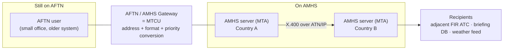

---
tags:
  - aviation-domain
  - cns
  - messaging
aliases:
  - AMHS
  - Aeronautical Message Handling System
  - ATS Message Handling System
  - ATSMHS
reading-order: 24
created: 2026-09-01
---
  
# AMHS

> [!abstract] The 30-second version
> **AMHS (Aeronautical Message Handling System)** is the **modern, email-like
> messaging backbone between aviation authorities and ANSPs**. It carries
> [[15 — NOTAMs|NOTAMs]], [[19 — FPL|flight plans]] and ATS messages, and [[18 — METAR|METAR]]/TAF/SIGMET
> between countries. It's the replacement for **AFTN**, the old teletype
> network.

## In plain words

Aviation has always needed a way for one country's systems to send formal
messages to another's — "here's a flight plan", "here's a NOTAM", "here's the
weather". For decades this ran on **AFTN**, a 1950s teletype network: short,
uppercase, plain-text messages, addressed with 8-letter codes.

**AMHS** is the upgrade. It's built on the **X.400** international messaging
standard and runs over modern IP networks. It can carry large messages, **file
attachments**, and binary payloads — including [[21 — AIXM|AIXM]] and [[23 — FIXM|FIXM]] data.
During the long transition, gateways let AMHS and remaining AFTN users still
talk to each other.

## Why it exists

AFTN can't carry the rich, structured, sometimes-large data that modern AIM
and flight information need. AMHS can.

## The parts you actually need to know

### What an AFTN message looks like

AFTN is the network the industry has used since the 1950s. It grew out of
teleprinters, and it still shows: uppercase only, a small character set, a
tight size limit.

```text
GG RPLLYNYX
250830 RPLLZTZX
(some message text ...)
```

| Part | Meaning |
|---|---|
| `GG` | **priority indicator** — one of five: `SS` distress · `DD` urgent · `FF` flight safety · `GG` met / flight-regularity / AIS · `KK` administrative |
| `RPLLYNYX` | **addressee** — an **8-letter address** (see anatomy below). Up to **21 addressees** per message. |
| `250830 RPLLZTZX` | filing time (day + `HHMM` UTC) and the **originator** address |
| `(...)` | the message text — max **~1 800 characters**, ITA-2 or IA-5 character set, no lowercase, no attachments |

#### The 8-letter AFTN address — anatomy (**2 – 2 – 4**)

```
R P   L L   Y N Y X
└┬┘   └┬┘   └──┬──┘
 │     │       └──── the office / service (letters 5–8)
 │     └──────────── location within the country (letters 3–4)
 └────────────────── ICAO nationality letters (letters 1–2)
```

| Part | Example | What it is | **Assigned by** |
|---|---|---|---|
| Letters **1–2** | `RP` | ICAO nationality / region letters (`RP` = Philippines) | **ICAO** (Doc 7910) |
| Letters **3–4** | `LL` | the specific location (`LL` = Manila / NAIA) → together `RPLL` is the ICAO **location indicator** | the State **proposes**, **ICAO approves & publishes** in Doc 7910 |
| Letters **5–7** | `YNY` | 3-letter designator for the office or service, from ICAO **Doc 8585** — e.g. `YNY` = International NOTAM Office, `YFY` = aeronautical fixed (AFTN) station, `YMY` = MET office, `ZTZ` = an ATS unit | the State, from Doc 8585 where one exists |
| Letter **8** | `X` | a specific department / division — or the filler `X` when none | the State |

So `RPLLYNYX` = Philippines · Manila · International NOTAM Office · no specific
department. (`RPLLYFYX`, used loosely elsewhere for "the NOTAM office", is
strictly the *comms centre* — use `YNYX` for the NOF.)

### What AMHS adds

**AMHS** is the modern replacement, built on the **X.400** international
messaging standard (with an **X.500 / ATN directory** for looking up
addresses). It runs over IP.

|  | **AFTN** (legacy) | **AMHS** (current) |
|---|---|---|
| Era / basis | 1950s teleprinter network | ITU-T **X.400 (1988)** / ISO-IEC 10021 messaging, over the **ATN** / IP |
| Addressing | 8-letter indicator | **X.400 O/R address** — attributes `C / A / P / O / OU1 / CN`. Two schemes: **XF** (Translated-form — algorithmic) and **CAAS** (Common **AMHS** Addressing Scheme). Both still map to/from the 8-letter form. |
| Character set | ITA-2 / IA-5, **uppercase only** | full 8-bit — lowercase, accented and extended characters |
| Message size | ~1 800 characters of text | effectively **unlimited** |
| Addressees | max **21** | **unlimited** |
| Priority levels | **5** (SS/DD/FF/GG/KK) | **3** |
| Attachments / binary | **none** — text only | **yes** — weather charts, aeronautical maps, **digital NOTAM**, [[21 — AIXM\|AIXM]] / [[23 — FIXM\|FIXM]] XML |
| Delivery feedback | none | delivery / non-delivery reports |
| Security | none | digital signatures, authentication (PKI) — in the *Extended* service |

Both run on the **ATN (Aeronautical Telecommunication Network)**, aviation's
common ground-to-ground (and air-to-ground) internetwork.

### The two AMHS service levels (ICAO Doc 9880, Part II)

| Level | What it provides |
|---|---|
| **Basic AMHS** | ATS messaging **equivalent to AFTN** (plus the addressing, size and character-set improvements) — this is what states implement first, for migration |
| **Extended AMHS** | adds **file / binary attachments**, **security** (digital signatures), use of the **ATN directory**, and a wider user community — needed to carry rich AIM / [[26 — SWIM\|SWIM]] payloads |

### How they interwork during the transition

States are migrating from AFTN to AMHS over many years, so the two must
coexist. The bridge is an **AFTN/AMHS Gateway**, formally an **MTCU
(Message Transfer and Conversion Unit)**: it translates addresses (8-letter ⇄
X.400 O/R), converts message formats and character sets, and maps the **5 AFTN
priorities onto the 3 AMHS ones**:

| AFTN | → AMHS |
|---|---|
| `SS` | Urgent |
| `DD`, `FF` | Normal |
| `GG`, `KK` | Non-urgent |



### Converting an address by hand: AFTN ⇄ AMHS

A gateway does this automatically — but doing it on paper is the best way to
understand it. Everything below is drawn from four ICAO documents that agree
exactly (the **ASIA/PAC AMHS Naming Plan**, the **AFI AMHS Manual**, the
**SAM AMHS Guide**, the **EUR AMHS Addressing Change Guidance** — all built on
**ICAO Doc 9880 Part II** / the ATN SARPs) **and cross-checked against the live
EUROCONTROL AMC register** (`AmhsMdRegister` / `AmhsCaasTables`, operational
extract of 27 Nov 2025): in all **282** management domains and every CAAS-table
row, `country-name` is `XX` and `ADMD` is `ICAO` — no exceptions. Of those
domains, **177 use XF and 105 use CAAS**.

#### Reading an AMHS address

An AMHS user's address is an **X.400 O/R address** — generically an
**MF-address** (MHS-form address). It is a **set of named attributes**,
broadest first:

| Attr | Name | Operational ATS value |
|---|---|---|
| **C** | Country-name | **`XX`** — *always, every scheme.* The ITU-T code for an international organisation belonging to no single country. |
| **A** | Administration-domain-name (ADMD) | **`ICAO`** — *always.* ICAO registered it so AMHS is free of any national carrier's rules. |
| **P** | Private-domain-name (PRMD) | the **Management Domain** — roughly one per ANSP. A short registered name, or a default (below). |
| **O** | Organization-name | routing detail — *value depends on the scheme* |
| **OU1** | Organizational-unit-name-1 | routing detail — *value depends on the scheme* |
| **CN** | Common-name | identifies the user — **CAAS only** |

> [!warning] `C` is `XX` — in **both** schemes. The famous mistake.
> A widespread briefing error claims *"CAAS uses the real country code (`C=PH`,
> `C=HK`); only XF uses `C=XX`."* **It is wrong.** Two ICAO manuals say so
> outright, and the live AMC register shows `XX` on every one of its 282
> domains:
> - **ASIA/PAC AMHS Naming Plan §2.3.1** — in the *CAAS* section — the
>   Country-name *"shall consist of the two alphanumeric ISO 3166 Country Code
>   `XX`"*.
> - **AFI AMHS Manual §3.2.6.2.1** — *"The use of the two-letter ISO 3166
>   country codes (e.g. FR for France, AU for Australia, US for the United
>   States) is not advisable, as these codes are used as values of the
>   **Country-name** attribute and not the **PRMD-name** attribute. This may
>   confuse the operators."*
>
> **Where the `C=PH` idea comes from:** an AMC register export has a separate
> **`ATNDir`** column showing `c=PH`, `c=HK`, `c=DE`… — that is the country
> attribute of the **X.500 ATN Directory** entry (where the record sits in the
> directory tree), a *different namespace* from the AMHS message address. In
> the address itself, `C` is always `XX`. What varies by country — `RP`,
> `HONGKONG` — is the **PRMD (`P`)**. A router rejects `C=PH`.

#### The PRMD (`P`)

One value per Management Domain. Rules (AFI AMHS Manual §3.2.6):

- a short **registered operating name / acronym** — `HONGKONG`, `THAILAND`,
  `SINGAPORE`, `IUTLAND-A`;
- **not** an ISO 3166 code (see the warning), **not** a generic term like
  "civil aviation" or "ANSP";
- assigned by the ANSP, then **registered and published by ICAO** (like
  Doc 7910 location indicators);
- **default**, until the ANSP registers one: the **ICAO nationality letters**
  from Doc 7910 — `RP` Philippines, `EG` UK, `RJ` Japan.

> [!note] ICAO nationality letters ≠ ISO country codes
> They often differ: Philippines `RP` not `PH`; UK `EG` not `GB`; Germany
> `ED`/`ET` not `DE`. The PRMD default uses the **AFTN** namespace.

#### The two schemes for `O` / `OU1` / `CN`

`C`, `A` and `P` are filled the same way in both. The schemes differ only
below that.

**XF — Translated-form address** *(AFI AMHS Manual, Table 3)*

| Attr | Value |
|---|---|
| `O` | the fixed literal **`AFTN`** |
| `OU1` | the user's **whole 8-letter AFTN address** |
| `CN` | **absent** — XF has 5 attributes |

`/C=XX/A=ICAO/P=EG/O=AFTN/OU1=EGHIZTZX` — Southampton Tower *(AFI AMHS Manual)*
`/C=XX/A=ICAO/P=RP/O=AFTN/OU1=RPLLYNYX` — Manila International NOTAM Office *(the Philippines is XF, PRMD `RP` — AMC register, Nov 2025)*
`/C=XX/A=ICAO/P=SITA/O=AFTN/OU1=RPLLPALX` — a SITA-hosted airline office in Manila *(also from the AMC extract)*

Every attribute follows from the AFTN address by a fixed rule, so converting it
needs only a **small table**: the list of Management Domains and their PRMD.

**CAAS — Common AMHS Addressing Scheme** *(Doc 9880 Part II; AFI Manual Table 4; AMC `AmhsCaasTables`)*

Read it as **`O` = Region · `OU1` = Location · `CN` = User**:

| Attr | Value |
|---|---|
| `O` | organization-name — a value the MD picks for **geographical routing** ("a region or geographical area within a State"). Each `O`→location-indicator mapping is **registered and published by ICAO** (this is what the AMC `AmhsCaasTables` file holds). |
| `OU1` | organizational-unit-name-1 — the **location-indicator level**: the user's 4-letter ICAO indicator, or a trailing-wildcard block (`VH**`, `LO**`) covering all indicators one routing point serves. |
| `CN` | common-name — the user: the **8-letter AFTN address** for a user that has one; a free-form name for a **direct** AMHS user with no AFTN address. |

Real operational CAAS addresses (AMC extract, 27 Nov 2025):

| O/R address | Source |
|---|---|
| `/C=XX/A=ICAO/P=AUSTRIA/O=LOVV/OU1=LOWM/CN=LOWMYBYX` | AMC `UserCapabilities` — a real Austria CAAS user (`O`=LOVV = Vienna) |
| `/C=XX/A=ICAO/P=HONGKONG/O=HKGCAD/OU1=VH**/CN=VHHHYNYX` | `O`/`OU1` from AMC `AmhsCaasTables` — Hong Kong; `CN` = the NOF's 8-letter address |
| `/C=XX/A=ICAO/P=THAILAND/O=VTBB/OU1=VT**/CN=VTBBYNYX` | same, Thailand |

CAAS lets one MD run **several routing points** — different `O` values under
one PRMD. The AMC file shows **Germany** (`P=GERMANY`) with `O` = `EDGG`,
`EDWW`, `EDDD`, `ETCC`, `ETEE`, `MAASTRICHT-UAC`, each mapped to its own block
of location indicators. ICAO directs every **new** implementation to CAAS;
**XF is transition-only**. (The virtual PRMD `EUROPE` carries pan-European
services this way — `O` = `EAD`, `EURONOTAM`, `EUROCONTROL-NMB`…)

#### Converting, both directions

The mapping is **fixed and published** — a gateway (MTCU) must produce the same
result no matter which gateway does it (AFI AMHS Manual §3.2.8.2.2). What you
look up depends on direction:

| From → to | What you need | How |
|---|---|---|
| **AFTN → XF** | the MD list (PRMD per domain) | `C=XX`, `A=ICAO`; `P` = destination MD's PRMD; `O=AFTN`; `OU1` = the 8 letters |
| **AFTN → CAAS** | the MD's full **CAAS table** (`O` per location indicator, `OU1` wildcards) | `C=XX`, `A=ICAO`; `P` = PRMD; `O` = from the table for the user's location indicator; `OU1` = that indicator / its wildcard block; `CN` = the 8 letters |
| **XF → AFTN** | nothing | the 8-letter address **is `OU1`** |
| **CAAS → AFTN** | nothing | the 8-letter address **is `CN`** (a direct user has none) |

> [!tip] The reply trick
> To answer a message, look at the **originator** O/R address: `O=AFTN` ⇒ it's
> **XF** ⇒ reply to `OU1`. `O` is anything else ⇒ **CAAS** ⇒ reply to `CN`.

#### Worked example — a NOTAM, Manila → Hong Kong

> [!example] Setup *(values from the live EUROCONTROL AMC register, Nov 2025)*
> - Manila International NOTAM Office **`RPLLYNYX`** — the Philippines is
>   registered **XF**, PRMD `RP` (`AmhsMdRegister`: `RP;XX;ICAO;RP;XF`). No
>   CAAS-table entry exists for it.
> - Hong Kong International NOTAM Office **`VHHHYNYX`** — Hong Kong, China is
>   **CAAS** (`AmhsCaasTables`: `XX;ICAO;HONGKONG;HKGCAD;VH**`).
> - The Manila–Hong Kong link runs on **AMHS**; the sending side's gateway
>   builds an O/R address for each end.

As AFTN:

```text
GG VHHHYNYX          recipient — Hong Kong International NOTAM Office
250830 RPLLYNYX      originator — Manila International NOTAM Office
```

Converted — each end in *its own* registered scheme:

| Attr | Recipient `VHHHYNYX` — Hong Kong (**CAAS**) | Originator `RPLLYNYX` — Philippines (**XF**) |
|---|---|---|
| C | `XX` | `XX` |
| A | `ICAO` | `ICAO` |
| P | `HONGKONG` | `RP` |
| O | `HKGCAD` | `AFTN` |
| OU1 | `VH**` | `RPLLYNYX` |
| CN | `VHHHYNYX` | *(none — XF has no CN)* |

**Reply:** Hong Kong reads the originator address — `O=AFTN` ⇒ XF ⇒ reply to
**`OU1` = `RPLLYNYX`**. If the reply later crosses an AFTN-only leg, that
gateway turns the recipient address back into 8 letters (`OU1` for XF, `CN` for
CAAS) and it goes on as plain AFTN.

#### One-look cheat sheet

| | **XF** (Translated-form) | **CAAS** |
|---|---|---|
| Attributes | `C A P O OU1` — **5** | `C A P O OU1 CN` — **6** |
| `C` / `A` | `XX` / `ICAO` | `XX` / `ICAO` |
| `P` | PRMD (default = ICAO nationality letters) | PRMD (registered operating name) |
| `O` | literal `AFTN` | geographical routing value — **Region** |
| `OU1` | the 8-letter AFTN address | location indicator / wildcard — **Location** |
| `CN` | — | 8-letter AFTN address, or direct-user name — **User** |
| AFTN address sits in | `OU1` | `CN` |
| To build it you need | the MD list only | the MD's full CAAS table |

`C` and `A` never change. New builds use **CAAS**; **XF** is the transition-only
shortcut ICAO is retiring.

### AMHS vs SWIM

|  | AMHS | [[26 — SWIM\|SWIM]] |
|---|---|---|
| Pattern | store-and-forward messaging (like email) | services: request/reply, publish/subscribe (like web APIs) |
| Payload | ATS messages, weather, attachments | AIXM / FIXM / IWXXM data, queries, streams |
| Coupling | address-to-address | publish once, many subscribe |

They coexist: AMHS keeps carrying formal ATS messaging while SWIM takes on
data-heavy, many-to-many sharing.

## How it connects to the rest

AMHS is the pipe under the products: a [[15 — NOTAMs|NOTAM]] you originate is
distributed as an AMHS message; a [[17 — PIB|PIB]] is assembled from messages that
arrived this way; [[18 — METAR|METAR]] for briefings comes in over it; [[19 — FPL|FPL]] messages
travel on it.

## Jargon buster

| Term | Plain meaning |
|---|---|
| AMHS / ATSMHS | (ATS) Aeronautical Message Handling System |
| AFTN | Aeronautical Fixed Telecommunication Network — the legacy predecessor |
| AFS | Aeronautical Fixed Service (the overall category AFTN and AMHS belong to) |
| ATN | Aeronautical Telecommunication Network |
| X.400 / X.500 | The international messaging / directory standards AMHS is based on (X.400 **1988** edition = ISO/IEC 10021) |
| O/R address (MF-address) | Originator/Recipient address — the X.400 address form (a set of attributes). "MF-address" (MHS-form) is the generic term; **XF** and **CAAS** are its two forms. |
| C / A / P | O/R attributes: **C**ountry-name (**always `XX`**, both schemes) / **A**DMD = Administration-Management-Domain (**always `ICAO`**) / **P**RMD = Private-Management-Domain = the Management Domain, ≈ one per ANSP, registered with ICAO |
| O / OU1 / CN | O/R attributes: **O**rganization-name / **O**rganizational-**u**nit-name-1 / **C**ommon-**n**ame. Carry routing detail and (for CAAS) the user identity. In CAAS: `O` = Region, `OU1` = Location, `CN` = User. |
| XF / CAAS | The two schemes. **XF** (Translated-form): every attribute derived from the AFTN address by algorithm; `O` = literal `AFTN`, `OU1` = the 8 letters, no `CN` (5 attributes). **CAAS**: the domain registers its own `O`/`OU1`; `CN` carries the 8 letters (6 attributes). CAAS is mandatory for new implementations; XF is transition-only. |
| PRMD default | until an ANSP registers a name, its PRMD is its **ICAO nationality letters** (Doc 7910) — `RP`, `EG`, `RJ` — which are **not** the ISO country codes (`PH`, `GB`, `JP`) |
| Direct / indirect user | **Direct** = has its own AMHS User Agent (and maybe no AFTN address). **Indirect** = an AFTN user reached through a gateway; always keyed by an 8-letter AFTN address. |
| AMHS Naming Plan | An ICAO **regional** guidance doc defining the XF/CAAS rules + a table of each State's scheme / PRMD / `O` / `OU1` |
| AMC | **ATS Messaging Management Centre** — run by EUROCONTROL for ICAO; the **live worldwide register** of AFTN/CIDIN/AMHS addresses and routing. Exports: `AmhsMdRegister` (scheme + PRMD per domain), `AmhsCaasTables` (the `O`/`OU1` mappings), `UserAddresses`. |
| ATNDir | The **X.500 ATN Directory**. Its entries carry a `c=<ISO code>` attribute for tree placement — **not** the AMHS address Country (which is `XX`). Source of the `C=PH` myth. |
| MTA / UA | Message Transfer Agent ("mail server") / User Agent ("mail client") |
| MTCU | Message Transfer and Conversion Unit — the AFTN/AMHS gateway |
| Priority (AFTN) | SS distress · DD urgent · FF flight safety · GG met/regularity/AIS · KK admin |
| OPMET | Operational Meteorological data (a category of message) |


## Own examples | AMHS Conversion
XF Conversion 
C=XX/A=ICAO/P=Check MD Registry/O=Always AFTN/OU(or OU1)=literal AFTN address

CAAS Conversion
C=XX/A=ICAO/P=Check MD Registry/O=Check CAAS Tables/OU1=first 4 letters of the address/CN=the entire AFTN address


Note:
	there are 4 files relating to AMC tables
	1. MD Registry 
	2. CAAS Tables
	3. User Adresses
	4. User Capabilities

Reminder: MD and CAAS are a pair it they are the minimum required which means you can use these two without the other two being User Adresses and User Capabilities.


## Learn more

**Start here (beginner-friendly)**
- SKYbrary — *Aeronautical Fixed Telecommunication Network (AFTN)*: <https://skybrary.aero/articles/aeronautical-fixed-telecommunication-network-aftn>
- Wikipedia — *Aeronautical Message Handling System*: <https://en.wikipedia.org/wiki/Aeronautical_Message_Handling_System>
- Wikipedia — *AFTN*: <https://en.wikipedia.org/wiki/Aeronautical_Fixed_Telecommunication_Network>
- Wikipedia — *X.400*: <https://en.wikipedia.org/wiki/X.400>

**On AFTN vs AMHS addressing and conversion** — these ICAO documents agree on
every detail in the section above; the AFI Manual and SAM Guide give the
attribute tables verbatim, and the **live EUROCONTROL AMC register** (address
`AmhsMdRegister` / `AmhsCaasTables` extracts, downloadable by AMC users) is the
operational proof — every domain shows `C=XX`, `A=ICAO`.
- ICAO ASIA/PAC — *AMHS Naming Plan*, 4th ed. (2015) — §2.3 CAAS, §2.4 XF, and Table 1a: every ASIA/PAC State's scheme, PRMD, `O`, `OU1` (Philippines, Hong Kong, Thailand, Singapore, Malaysia…): <https://www.icao.int/sites/default/files/APAC/Documents/edocs/APX-B-AMHS-naming-plan-Ed4.pdf>
- ICAO — *AFI AMHS Manual* v2.0 — §3.2.4 (Table 3 = XF, Table 4 = CAAS), §3.2.6 (PRMD rules + the "don't use ISO codes" note), §3.2.8 (conversion): <https://www.icao.int/sites/default/files/ESAF/APIRG/APIRG-20/Docs/WORKING-PAPERS/AFI_AMHS_Manual_v2_0.pdf>
- ICAO SAM — *AMHS Guide* — worked XF and CAAS address examples, gateway conversion test cases: <https://www.icao.int/sites/default/files/SAM/eDocuments/AMHS%20Guide.pdf>
- ICAO EUR — *AMHS Addressing Change Guidance*: <https://www.icao.int/sites/default/files/EURNAT/Documents/EUR%20and%20Nat%20Docs/EUR%20Documents/EUR%20Documents/AMHS%20Addressing%20Change%20Guidance/AMHS-Addressing-Change-Guidance-v1.0-EN.pdf>
- ICAO EUR Doc 021 — *ATS Messaging Management Manual* (the AMC's governing document): <https://www.icao.int/sites/default/files/EURNAT/Documents/EUR%20and%20Nat%20Docs/EUR%20Documents/EUR%20Documents/021%20-%20ATS%20Messaging%20Management%20Manual/EUR-Doc-021-ATS_Messaging_Management_Manual_v18.0.pdf>
- EUROCONTROL — *ATS Messaging Management Centre (AMC)* (the address/routing register): <https://www.eurocontrol.int/tool/air-traffic-services-messaging-management-centre>

**Go deeper (the official sources)**
- ICAO Doc 9880 — *Manual on Detailed Technical Specifications for the ATN (ISO/OSI)*, Part II (ATSMHS) — the base spec both schemes derive from: <https://store.icao.int>
- ICAO Annex 10 — *Aeronautical Telecommunications*, Vol II (communication procedures, incl. AFTN message format, priorities, 21-addressee / 1 800-character limits): <https://www.icao.int>
- EUROCONTROL — *Specification for the ATS Message Handling System (AMHS)* v2.1: <https://www.eurocontrol.int/sites/default/files/2019-04/AMHS%20Spec%202.1_released%20issue_web.pdf>
