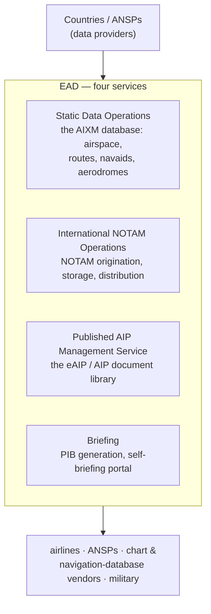

---
tags:
  - aviation-domain
  - ais-aim
  - systems
aliases:
  - EAD
  - European AIS Database
reading-order: 25
created: 2026-09-01
---

# EAD

> [!abstract] The 30-second version
> The **European AIS Database (EAD)** is a **single, central, quality-assured
> database of aeronautical information** used by 50+ countries and many
> ANSPs. Countries publish their [[13 — AIP|AIP]], [[15 — NOTAMs|NOTAMs]] and static data *into*
> EAD; airlines and other users retrieve briefings, [[17 — PIB|PIBs]] and data
> *out of* it. It's effectively the largest working [[05 — AIS|AIS]]/AIM system in the
> world.

## In plain words

Before EAD, dozens of European countries each ran their own aeronautical
database, each with its own quirks, and everyone duplicated the work of
collecting and cross-checking. EAD replaced that with **one shared system**
built on international standards ([[21 — AIXM|AIXM]] for the static data). Countries feed
their data in; the wider aviation community pulls what it needs out.

Even outside Europe, EAD matters as the **reference example of "data-centric
AIM"** — what a national or regional AIM platform should be able to do.

## Why it exists

To remove duplicated effort and inconsistency across many national databases,
and to provide one certified, standards-based source of European aeronautical
information.

## The parts you actually need to know

### The four services

### Key facts

- **Purpose:** replace ~40 national databases with one shared, standards-based
  system. Estimated to have saved the European system tens of millions of
  euros.
- **Data model:** the static side is **[[21 — AIXM|AIXM]]**; NOTAMs are ICAO-format with
  a path toward digital NOTAM.
- **Certification:** run as a certified service; **EASA-certified** for safety
  and data quality.
- **Operations:** an **EUROCONTROL** service. It was operated under contract by
  *GroupEAD* for years; **operational responsibility transferred fully to
  EUROCONTROL in January 2026**.
- **Access:** *EAD Basic* (free web access — browsing, briefing) and *EAD Pro*
  (system-to-system, full data services) for registered users.

### EAD vs a national AIS

|  | National AIS | EAD |
|---|---|---|
| Scope | one country's [[10 — FIR\|FIRs]] | 50+ countries |
| Role | **originates** the data | **integrates, stores, redistributes** it |

## How it connects to the rest

EAD is a concrete realisation of the [[01 — ICAO|ICAO]] Annex 15 / PANS-AIM data-centric
model. It consumes [[13 — AIP|AIP]] and [[15 — NOTAMs|NOTAMs]] data as [[21 — AIXM|AIXM]], produces
[[17 — PIB|PIBs]], and is a natural node for [[26 — SWIM|SWIM]].

## Jargon buster

| Term | Plain meaning |
|---|---|
| EAD | European AIS Database |
| SDO / INO / PAMS | Static Data Operations / International NOTAM Operations / Published AIP Management Service |
| EASA | European Union Aviation Safety Agency |
| eAIP | Electronic AIP |
| Data provider | A country/ANSP that publishes its data into EAD |

## Learn more

**Start here (beginner-friendly)**
- Wikipedia — *European AIS Database*: <https://en.wikipedia.org/wiki/European_AIS_Database>
- EUROCONTROL — *European AIS Database (EAD)*: <https://www.eurocontrol.int/service/european-ais-database>
- EAD — *Introduction to EAD Basic* portal: <https://www.ead.eurocontrol.int/>

**Go deeper (the official sources)**
- EUROCONTROL — *EASA re-certifies the European AIS Database (EAD)*: <https://www.eurocontrol.int/news/easa-re-certifies-european-ais-database-ead>
- DFS — *Successful transfer of the EAD to EUROCONTROL* (Jan 2026): <https://www.dfs.de/homepage/en/media/press/2026/20-01-2026-successful-transfer-of-the-european-ais-database-ead-to-eurocontrol/>
- ICAO Annex 15 & Doc 10066 (the model EAD implements): <https://www.icao.int>
